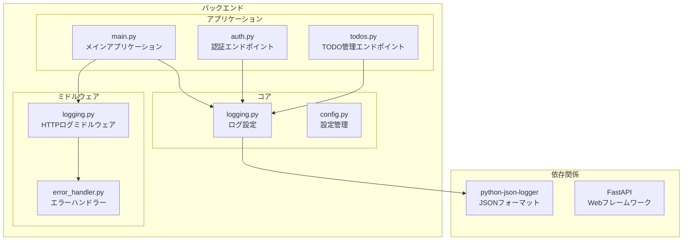
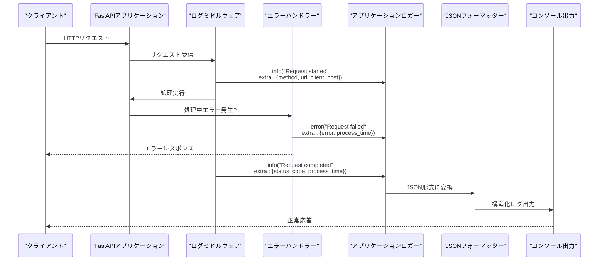
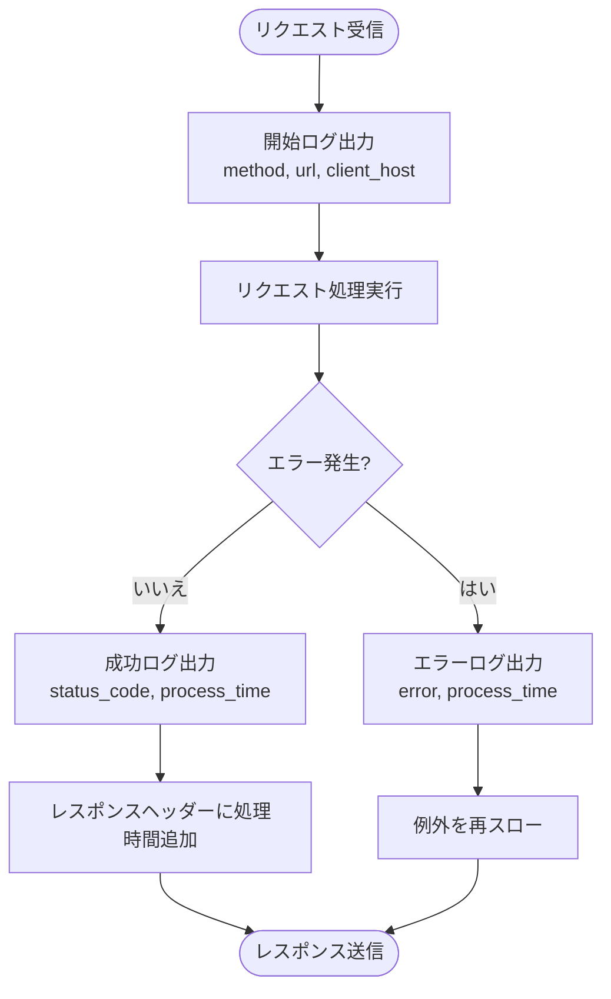
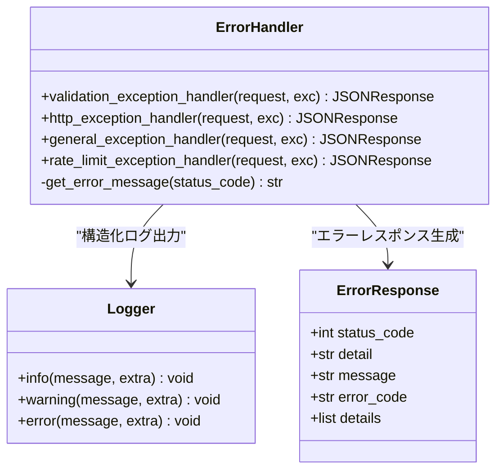
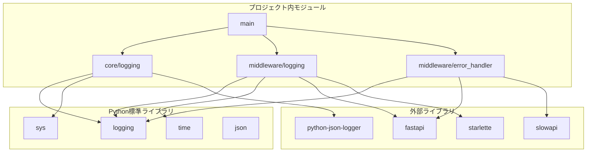
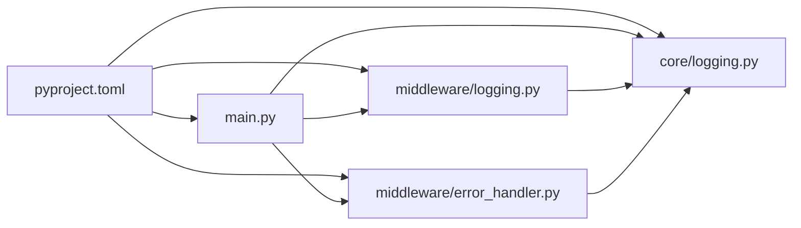

# 構造化ログの実装

<cite>
**この文書で参照されるファイル**
- [backend/app/core/logging.py](file://backend/app/core/logging.py)
- [backend/app/middleware/logging.py](file://backend/app/middleware/logging.py)
- [backend/app/main.py](file://backend/app/main.py)
- [backend/app/middleware/error_handler.py](file://backend/app/middleware/error_handler.py)
- [backend/pyproject.toml](file://backend/pyproject.toml)
- [backend/app/core/config.py](file://backend/app/core/config.py)
</cite>

## 目次
1. [はじめに](#はじめに)
2. [プロジェクト構造](#プロジェクト構造)
3. [コアコンポーネント](#コアコンポーネント)
4. [アーキテクチャ概観](#アーキテクチャ概観)
5. [詳細コンポーネント分析](#詳細コンポーネント分析)
6. [依存関係分析](#依存関係分析)
7. [パフォーマンス考慮事項](#パフォーマンス考慮事項)
8. [トラブルシューティングガイド](#トラブルシューティングガイド)
9. [結論](#結論)

## はじめに

このプロジェクトでは、Pythonのloggingモジュールを活用した構造化ログの実装が行われています。構造化ログとは、従来のテキスト形式のログではなく、JSON形式でログを出力することで、機械的に解析しやすい形式にすることを目的としています。

本実装では以下の特徴を持ちます：
- Pythonの標準loggingモジュールを使用
- python-json-loggerライブラリによるJSONフォーマット出力
- FastAPIミドルウェアを通じたHTTPリクエスト・レスポンスログ
- 構造化されたエラーハンドリング
- 外部ログ収集ツールとの連携を考慮した設計

## プロジェクト構造

構造化ログの実装は、以下のディレクトリ構造で行われています：



**図の出典**
- [backend/app/core/logging.py:1-36](file://backend/app/core/logging.py#L1-L36)
- [backend/app/middleware/logging.py:1-67](file://backend/app/middleware/logging.py#L1-L67)
- [backend/app/main.py:1-168](file://backend/app/main.py#L1-L168)

**セクションの出典**
- [backend/app/core/logging.py:1-36](file://backend/app/core/logging.py#L1-L36)
- [backend/app/middleware/logging.py:1-67](file://backend/app/middleware/logging.py#L1-L67)
- [backend/app/main.py:1-168](file://backend/app/main.py#L1-L168)

## コアコンポーネント

### 構造化ログ設定モジュール

`backend/app/core/logging.py`は、アプリケーション全体のログ設定を行う中心的なモジュールです。このモジュールでは以下のような機能を提供しています：

- **ログレベルの設定**: DEBUG, INFO, WARNING, ERROR, CRITICALのいずれかを指定可能
- **JSONフォーマットの設定**: python-json-loggerを使用したJSON形式のログ出力
- **コンソール出力の設定**: stdoutへの出力設定
- **アプリケーションロガーの初期化**: "app"という名前のロガーを設定

**セクションの出典**
- [backend/app/core/logging.py:6-36](file://backend/app/core/logging.py#L6-L36)

### HTTPリクエスト・レスポンスログミドルウェア

`backend/app/middleware/logging.py`は、FastAPIのミドルウェアとして動作し、すべてのHTTPリクエストに対して以下の情報をログに出力します：

- **リクエスト開始時**: HTTPメソッド、URL、クライアントIPアドレス
- **リクエスト完了時**: HTTPステータスコード、処理時間
- **エラー発生時**: エラー内容、処理時間

**セクションの出典**
- [backend/app/middleware/logging.py:10-67](file://backend/app/middleware/logging.py#L10-L67)

### エラーハンドリングと構造化ログ

`backend/app/middleware/error_handler.py`は、FastAPIの例外ハンドラーとして動作し、エラー発生時に以下の情報を構造化ログとして出力します：

- **バリデーションエラー**: 入力エラーの詳細情報
- **HTTPエラー**: ステータスコード、エラー詳細
- **一般エラー**: 予期しないエラーの内容
- **レート制限エラー**: 制限超過時の情報

**セクションの出典**
- [backend/app/middleware/error_handler.py:15-149](file://backend/app/middleware/error_handler.py#L15-L149)

## アーキテクチャ概観

構造化ログのアーキテクチャは、以下のようになっています：



**図の出典**
- [backend/app/middleware/logging.py:15-67](file://backend/app/middleware/logging.py#L15-L67)
- [backend/app/middleware/error_handler.py:79-104](file://backend/app/middleware/error_handler.py#L79-L104)
- [backend/app/core/logging.py:22-29](file://backend/app/core/logging.py#L22-L29)

## 詳細コンポーネント分析

### 構造化ログ設定の詳細

#### JSONフォーマットの設定

ログフォーマットは以下の要素を含んでいます：

- `%(asctime)s`: タイムスタンプ
- `%(name)s`: ロガー名
- `%(levelname)s`: ログレベル
- `%(message)s`: メッセージ本文
- `%(filename)s`: ファイル名
- `%(funcName)s`: 関数名
- `%(lineno)d`: 行番号

#### ログレベルの柔軟な設定

`setup_logging`関数は、引数としてログレベルを受け取り、それを適用する設計となっています。これにより、開発環境と本番環境で異なるログレベルを設定することが可能です。

**セクションの出典**
- [backend/app/core/logging.py:22-29](file://backend/app/core/logging.py#L22-L29)

### HTTPリクエストログミドルウェアの詳細

#### リクエスト処理フロー



**図の出典**
- [backend/app/middleware/logging.py:15-67](file://backend/app/middleware/logging.py#L15-L67)

#### 構造化されたログデータ

各ログには以下の構造化データが含まれます：

- **リクエスト開始ログ**: method, url, client_host
- **リクエスト完了ログ**: method, url, status_code, process_time
- **リクエスト失敗ログ**: method, url, error, process_time

**セクションの出典**
- [backend/app/middleware/logging.py:20-66](file://backend/app/middleware/logging.py#L20-L66)

### エラーハンドリングの詳細

#### 各種エラーの構造化ログ



**図の出典**
- [backend/app/middleware/error_handler.py:15-149](file://backend/app/middleware/error_handler.py#L15-L149)

#### 構造化されたエラーデータ

- **バリデーションエラー**: url, method, errors
- **HTTPエラー**: url, method, status_code, detail
- **一般エラー**: url, method, error
- **レート制限エラー**: url, method, client_host

**セクションの出典**
- [backend/app/middleware/error_handler.py:37-143](file://backend/app/middleware/error_handler.py#L37-L143)

## 依存関係分析

### 外部ライブラリの依存関係



**図の出典**
- [backend/pyproject.toml:7-25](file://backend/pyproject.toml#L7-L25)
- [backend/app/core/logging.py:1-3](file://backend/app/core/logging.py#L1-L3)
- [backend/app/middleware/logging.py:1-5](file://backend/app/middleware/logging.py#L1-L5)
- [backend/app/middleware/error_handler.py:1-8](file://backend/app/middleware/error_handler.py#L1-L8)

### 内部モジュール間の依存関係



**図の出典**
- [backend/pyproject.toml:1-51](file://backend/pyproject.toml#L1-L51)
- [backend/app/main.py:14-26](file://backend/app/main.py#L14-L26)

**セクションの出典**
- [backend/pyproject.toml:1-51](file://backend/pyproject.toml#L1-L51)
- [backend/app/main.py:14-26](file://backend/app/main.py#L14-L26)

## パフォーマンス考慮事項

### JSONフォーマットのパフォーマンス特性

構造化ログのJSONフォーマットは以下のパフォーマンス特性を持っています：

- **オーバーヘッド**: JSONシリアライゼーションによる追加のCPU負荷
- **I/O効率**: 構造化データのための効率的な解析が可能
- **メモリ使用量**: JSON文字列の生成によるメモリ使用量の増加

### 処理時間の計測

HTTPリクエストの処理時間は以下の方法で計測されています：

- **開始時刻**: `time.time()`を使用してリクエスト受信時のタイムスタンプを記録
- **終了時刻**: 処理完了またはエラー発生時のタイムスタンプを記録
- **計算精度**: 4桁の小数点まで精度を保つ

### ログレベルの最適化

- **開発環境**: DEBUGレベル以上を許可し、詳細なログを出力
- **本番環境**: INFOレベル以上のみを許可し、パフォーマンスを維持
- **条件付きログ**: 重要なイベントのみを構造化ログとして出力

## トラブルシューティングガイド

### 構造化ログの確認方法

#### JSON形式のログ出力確認

構造化ログは以下のJSON形式で出力されます：

```json
{
  "asctime": "2024-01-15T10:30:45",
  "name": "app",
  "levelname": "INFO",
  "message": "Request completed",
  "filename": "logging.py",
  "funcName": "dispatch",
  "lineno": 36,
  "method": "GET",
  "url": "http://localhost:8000/api/v1/todos/",
  "status_code": 200,
  "process_time": 0.1234
}
```

#### 一般的なトラブルシューティング手順

1. **ログレベルの確認**: `setup_logging`関数の引数でログレベルを確認
2. **JSONフォーマットの確認**: `JsonFormatter`の設定を確認
3. **ミドルウェアの有効性**: FastAPIのミドルウェアとして正しく登録されているか確認
4. **エラーハンドラーの動作**: 例外発生時のログ出力が正しく行われているか確認

### トラブルシューティング手順

#### ログ出力がない場合

1. **アプリケーション起動時のログ確認**
   - `setup_logging`関数の呼び出しを確認
   - `app_logger.info`の出力が行われているか確認

2. **ミドルウェアの登録確認**
   - `app.add_middleware(LoggingMiddleware)`の呼び出しを確認

3. **ロガーの設定確認**
   - `logging.getLogger("app")`の設定が正しく行われているか確認

**セクションの出典**
- [backend/app/core/logging.py:31-36](file://backend/app/core/logging.py#L31-L36)
- [backend/app/main.py:28-29](file://backend/app/main.py#L28-L29)
- [backend/app/main.py:117-118](file://backend/app/main.py#L117-L118)

#### JSONフォーマットの問題

1. **フォーマット文字列の確認**
   - `JsonFormatter`の`fmt`パラメータを確認
   - 必要な項目がすべて含まれているか確認

2. **日付フォーマットの確認**
   - `datefmt`パラメータの設定を確認
   - ISO8601形式が正しく設定されているか確認

3. **extraパラメータの確認**
   - `extra`辞書に必要なキーが含まれているか確認
   - JSONシリアライズ可能な型であるか確認

**セクションの出典**
- [backend/app/core/logging.py:22-25](file://backend/app/core/logging.py#L22-L25)

## 結論

この構造化ログの実装は、以下の利点を提供しています：

### 構造化ログの利点

1. **機械的解析の容易さ**: JSON形式により、外部ツールでの解析が簡単
2. **検索性の向上**: 構造化されたフィールドにより、特定の条件での検索が可能
3. **可読性の向上**: 標準化されたフォーマットにより、人間の可読性も維持
4. **拡張性の確保**: `extra`パラメータを通じて、必要に応じて追加情報を含められる

### 実装の特徴

1. **標準ライブラリの活用**: Pythonの標準loggingモジュールを使用
2. **外部ライブラリの導入**: python-json-loggerによるJSONフォーマット
3. **ミドルウェアの統合**: FastAPIのミドルウェアとして統一されたログ出力
4. **エラーハンドリングの構造化**: 例外発生時の構造化ログ出力

### 今後の改善点

1. **ロギングのパフォーマンス最適化**: 高頻度アクセス時のロギングの軽量化
2. **セキュリティの強化**: 敏感情報の漏洩防止策の導入
3. **外部ツール連携の拡充**: ELKスタックやCloudWatchなどの連携方法
4. **ロギングの監視**: ログの品質管理と監視の導入

この実装は、堅牢な構造化ログシステムの基盤を提供しており、将来的な拡張にも柔軟に対応できる設計となっています。