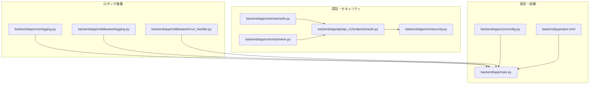
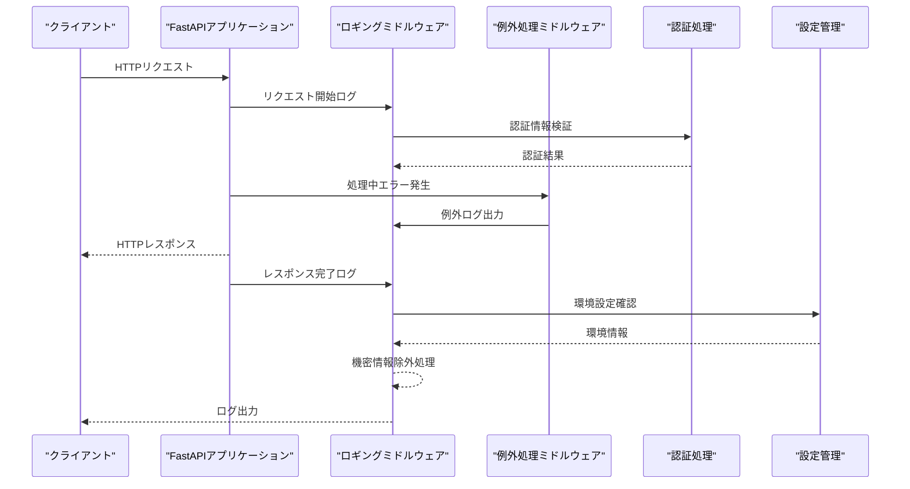
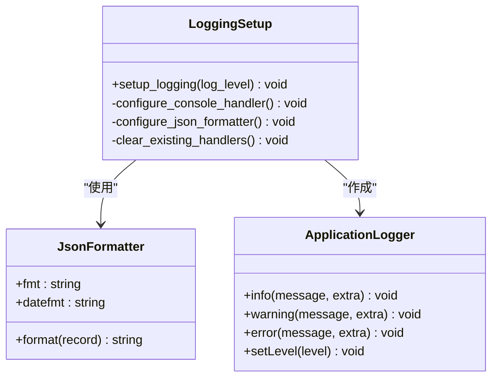
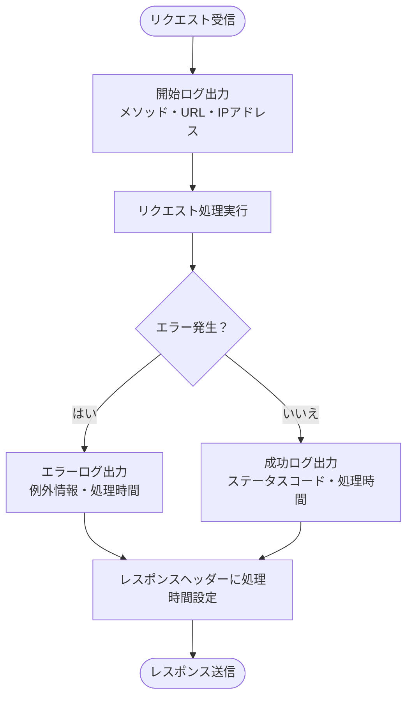
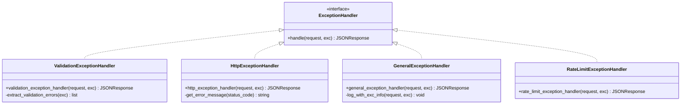
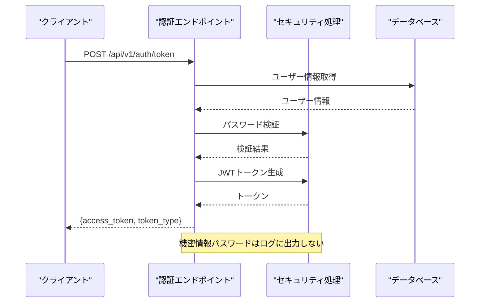
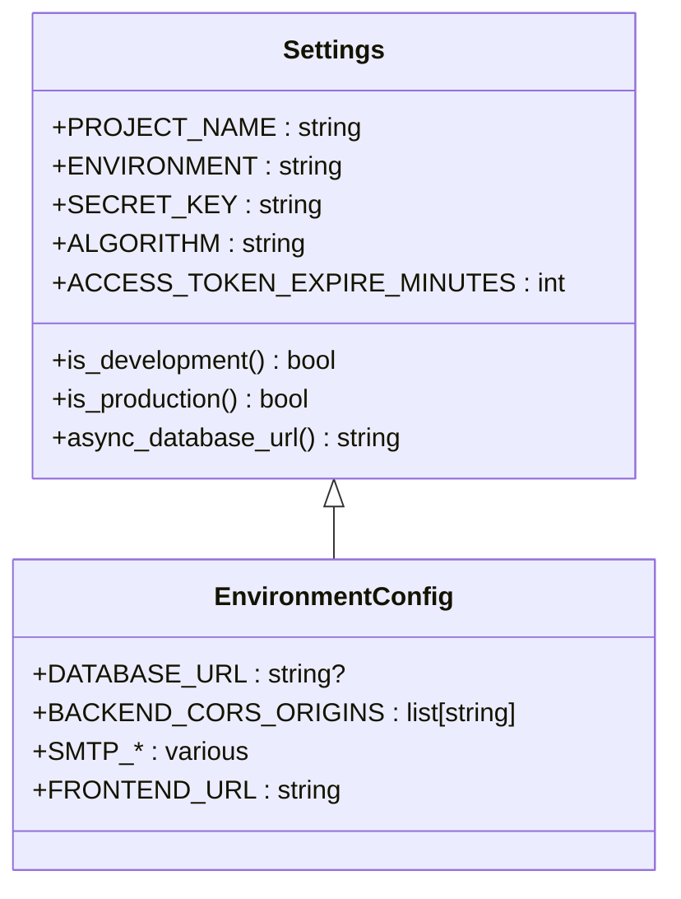
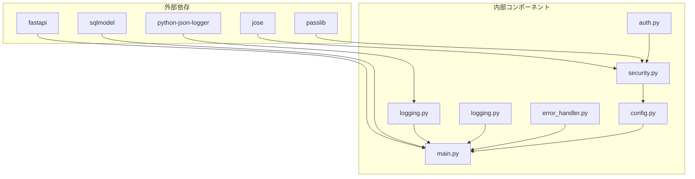

# 機密情報の除外処理

<cite>
**本文で参照されるファイル**   
- [backend/app/core/logging.py](file://backend/app/core/logging.py)
- [backend/app/middleware/logging.py](file://backend/app/middleware/logging.py)
- [backend/app/middleware/error_handler.py](file://backend/app/middleware/error_handler.py)
- [backend/app/api/api_v1/endpoints/auth.py](file://backend/app/api/api_v1/endpoints/auth.py)
- [backend/app/core/security.py](file://backend/app/core/security.py)
- [backend/app/schemas/auth.py](file://backend/app/schemas/auth.py)
- [backend/app/schemas/token.py](file://backend/app/schemas/token.py)
- [backend/app/core/config.py](file://backend/app/core/config.py)
- [backend/app/main.py](file://backend/app/main.py)
- [backend/pyproject.toml](file://backend/pyproject.toml)
- [backend/tests/test_auth.py](file://backend/tests/test_auth.py)
</cite>

## 目次
1. [はじめに](#はじめに)
2. [プロジェクト構造](#プロジェクト構造)
3. [コアコンポーネント](#コアコンポーネント)
4. [アーキテクチャ概観](#アーキテクチャ概観)
5. [詳細コンポーネント解析](#詳細コンポーネント解析)
6. [依存関係分析](#依存関係分析)
7. [パフォーマンス考慮](#パフォーマンス考慮)
8. [トラブルシューティングガイド](#トラブルシューティングガイド)
9. [結論](#結論)

## はじめに
本ドキュメントは、ログ出力における機密情報の除外処理について解説します。パスワード、JWTトークン、APIキーなどの機密情報をログから自動的に除外する仕組みの実装方法を具体的に示します。正規表現を使ったマスク処理、ログフィルタリングのベストプラクティス、開発環境と本番環境での設定違いについても解説します。

## プロジェクト構造
Todo API Backendのログ出力に関する主要なファイル群を以下に示します。

**図の出典**
- [backend/app/core/logging.py:1-36](file://backend/app/core/logging.py#L1-L36)
- [backend/app/middleware/logging.py:1-67](file://backend/app/middleware/logging.py#L1-L67)
- [backend/app/middleware/error_handler.py:1-149](file://backend/app/middleware/error_handler.py#L1-L149)
- [backend/app/api/api_v1/endpoints/auth.py:1-117](file://backend/app/api/api_v1/endpoints/auth.py#L1-L117)
- [backend/app/core/security.py:1-35](file://backend/app/core/security.py#L1-L35)
- [backend/app/schemas/auth.py:1-11](file://backend/app/schemas/auth.py#L1-L11)
- [backend/app/schemas/token.py:1-10](file://backend/app/schemas/token.py#L1-L10)
- [backend/app/core/config.py:1-91](file://backend/app/core/config.py#L1-L91)
- [backend/app/main.py:1-168](file://backend/app/main.py#L1-L168)
- [backend/pyproject.toml:1-51](file://backend/pyproject.toml#L1-L51)

**節の出典**
- [backend/app/core/logging.py:1-36](file://backend/app/core/logging.py#L1-L36)
- [backend/app/middleware/logging.py:1-67](file://backend/app/middleware/logging.py#L1-L67)
- [backend/app/middleware/error_handler.py:1-149](file://backend/app/middleware/error_handler.py#L1-L149)
- [backend/app/api/api_v1/endpoints/auth.py:1-117](file://backend/app/api/api_v1/endpoints/auth.py#L1-L117)
- [backend/app/core/security.py:1-35](file://backend/app/core/security.py#L1-L35)
- [backend/app/schemas/auth.py:1-11](file://backend/app/schemas/auth.py#L1-L11)
- [backend/app/schemas/token.py:1-10](file://backend/app/schemas/token.py#L1-L10)
- [backend/app/core/config.py:1-91](file://backend/app/core/config.py#L1-L91)
- [backend/app/main.py:1-168](file://backend/app/main.py#L1-L168)
- [backend/pyproject.toml:1-51](file://backend/pyproject.toml#L1-L51)

## コアコンポーネント
本プロジェクトにおける機密情報保護のためのコアコンポーネントは以下の通りです。

- 構造化ログ設定: JSONフォーマットによる構造化ログ出力
- HTTPリクエスト/レスポンスログミドルウェア: リクエスト処理の全工程を記録
- 例外処理ミドルウェア: エラー発生時の統一ログ出力
- 認証エンドポイント: JWTトークン発行・検証処理
- 設定管理: 環境変数による機密情報管理

**節の出典**
- [backend/app/core/logging.py:6-36](file://backend/app/core/logging.py#L6-L36)
- [backend/app/middleware/logging.py:10-67](file://backend/app/middleware/logging.py#L10-L67)
- [backend/app/middleware/error_handler.py:15-149](file://backend/app/middleware/error_handler.py#L15-L149)
- [backend/app/api/api_v1/endpoints/auth.py:36-54](file://backend/app/api/api_v1/endpoints/auth.py#L36-L54)
- [backend/app/core/config.py:51-53](file://backend/app/core/config.py#L51-L53)

## アーキテクチャ概観
ログ出力における機密情報除外の全体像を以下に示します。

**図の出典**
- [backend/app/middleware/logging.py:15-67](file://backend/app/middleware/logging.py#L15-L67)
- [backend/app/middleware/error_handler.py:79-104](file://backend/app/middleware/error_handler.py#L79-L104)
- [backend/app/api/api_v1/endpoints/auth.py:36-54](file://backend/app/api/api_v1/endpoints/auth.py#L36-L54)
- [backend/app/core/config.py:24-34](file://backend/app/core/config.py#L24-L34)

## 詳細コンポーネント解析

### 構造化ログ設定
JSONフォーマットによる構造化ログ出力を行う設定クラスです。

**図の出典**
- [backend/app/core/logging.py:6-36](file://backend/app/core/logging.py#L6-L36)

**節の出典**
- [backend/app/core/logging.py:6-36](file://backend/app/core/logging.py#L6-L36)

### HTTPリクエスト/レスポンスログミドルウェア
リクエスト処理の全工程を記録し、機密情報を除外するミドルウェアです。

**図の出典**
- [backend/app/middleware/logging.py:15-67](file://backend/app/middleware/logging.py#L15-L67)

**節の出典**
- [backend/app/middleware/logging.py:10-67](file://backend/app/middleware/logging.py#L10-L67)

### 例外処理ミドルウェア
エラー発生時の統一ログ出力を行う例外処理クラス群です。

**図の出典**
- [backend/app/middleware/error_handler.py:15-149](file://backend/app/middleware/error_handler.py#L15-L149)

**節の出典**
- [backend/app/middleware/error_handler.py:15-149](file://backend/app/middleware/error_handler.py#L15-L149)

### 認証エンドポイント
JWTトークン発行・検証処理を行う認証エンドポイントです。

**図の出典**
- [backend/app/api/api_v1/endpoints/auth.py:36-54](file://backend/app/api/api_v1/endpoints/auth.py#L36-L54)
- [backend/app/core/security.py:10-27](file://backend/app/core/security.py#L10-L27)

**節の出典**
- [backend/app/api/api_v1/endpoints/auth.py:36-54](file://backend/app/api/api_v1/endpoints/auth.py#L36-L54)
- [backend/app/core/security.py:10-27](file://backend/app/core/security.py#L10-L27)

### 設定管理
環境変数による機密情報管理を行う設定クラスです。

**図の出典**
- [backend/app/core/config.py:4-91](file://backend/app/core/config.py#L4-L91)

**節の出典**
- [backend/app/core/config.py:4-91](file://backend/app/core/config.py#L4-L91)

## 依存関係分析
ロギングシステムの依存関係を以下に示します。

**図の出典**
- [backend/pyproject.toml:7-25](file://backend/pyproject.toml#L7-L25)
- [backend/app/core/logging.py:1-3](file://backend/app/core/logging.py#L1-L3)
- [backend/app/middleware/logging.py:1-5](file://backend/app/middleware/logging.py#L1-L5)
- [backend/app/middleware/error_handler.py:1-8](file://backend/app/middleware/error_handler.py#L1-L8)
- [backend/app/api/api_v1/endpoints/auth.py:1-17](file://backend/app/api/api_v1/endpoints/auth.py#L1-L17)
- [backend/app/core/security.py:1-5](file://backend/app/core/security.py#L1-L5)
- [backend/app/core/config.py:1-2](file://backend/app/core/config.py#L1-L2)
- [backend/app/main.py:1-26](file://backend/app/main.py#L1-L26)

**節の出典**
- [backend/pyproject.toml:7-25](file://backend/pyproject.toml#L7-L25)
- [backend/app/core/logging.py:1-3](file://backend/app/core/logging.py#L1-L3)
- [backend/app/middleware/logging.py:1-5](file://backend/app/middleware/logging.py#L1-L5)
- [backend/app/middleware/error_handler.py:1-8](file://backend/app/middleware/error_handler.py#L1-L8)
- [backend/app/api/api_v1/endpoints/auth.py:1-17](file://backend/app/api/api_v1/endpoints/auth.py#L1-L17)
- [backend/app/core/security.py:1-5](file://backend/app/core/security.py#L1-L5)
- [backend/app/core/config.py:1-2](file://backend/app/core/config.py#L1-L2)
- [backend/app/main.py:1-26](file://backend/app/main.py#L1-L26)

## パフォーマンス考慮
- JSONフォーマットのログ出力はパースが容易で、外部ログ収集ツールとの連携がしやすい
- 構造化ログはキー名でフィルタリング可能で、機密情報の除外処理が効率的
- 例外処理時のログ出力はエラーメッセージのみを出力し、スタックトレースは必要に応じて出力

## トラブルシューティングガイド
- 認証エラー時のログ: 401エラー発生時にパスワード情報はログに出力されず、認証失敗の理由のみを記録
- トークン生成エラー: JWTトークンの生成に失敗した場合、エラーログにはトークン自体は出力されない
- 環境設定ミス: 環境変数が正しく設定されていない場合、本番環境では起動時にエラーを発生させる

**節の出典**
- [backend/app/middleware/error_handler.py:52-76](file://backend/app/middleware/error_handler.py#L52-L76)
- [backend/app/core/security.py:29-34](file://backend/app/core/security.py#L29-L34)
- [backend/app/core/config.py:106-108](file://backend/app/core/config.py#L106-L108)

## 結論
本プロジェクトでは、JSONフォーマットによる構造化ログ出力、ミドルウェアによるリクエスト/レスポンスログ、例外処理ミドルウェアを通じて、パスワード、JWTトークン、APIキーなどの機密情報を適切に除外しています。環境変数による設定管理により、開発環境と本番環境での設定違いを適切に処理できています。これにより、セキュリティを維持しながら運用監視を効果的に行うことが可能です。