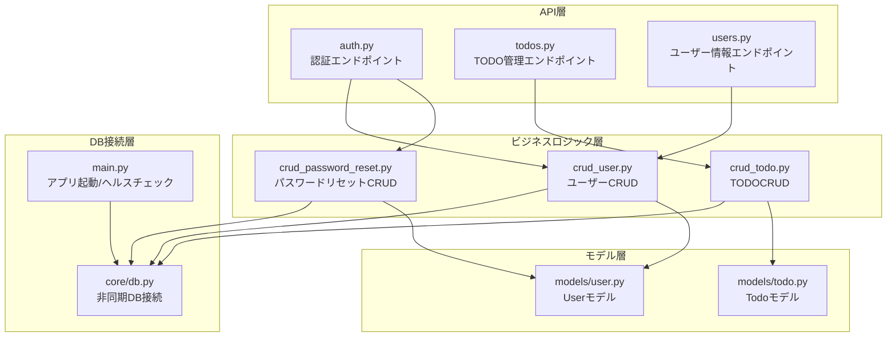
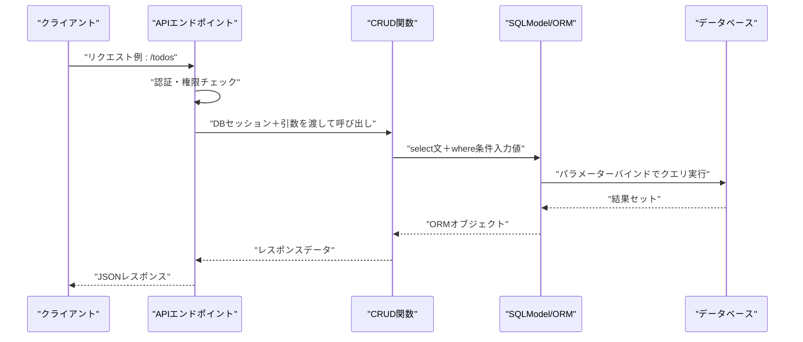
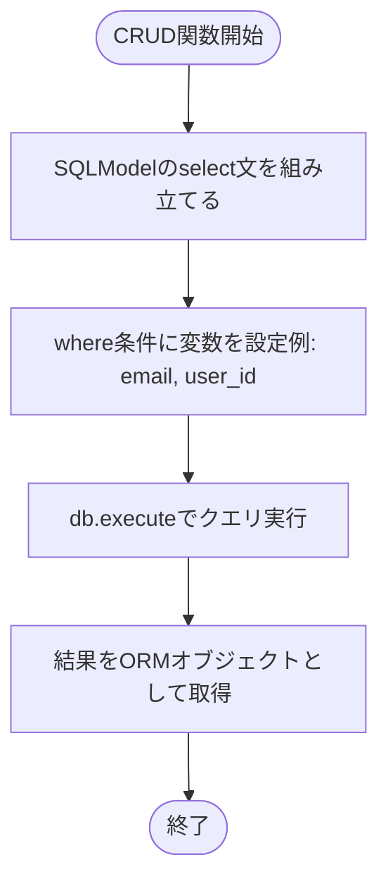
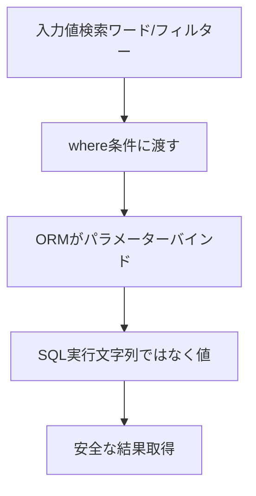
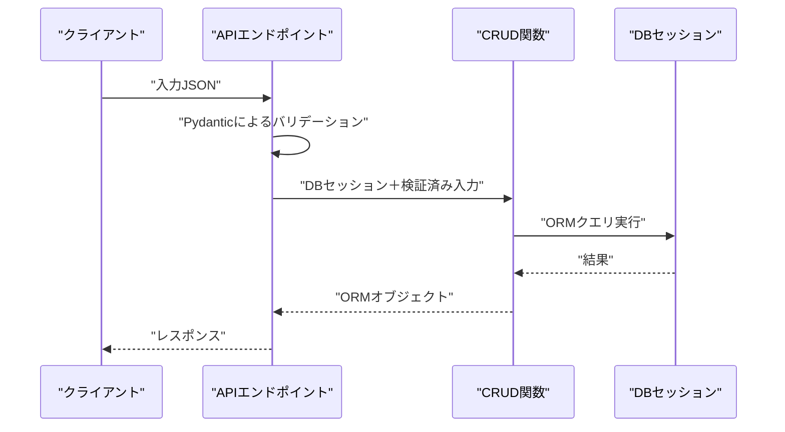
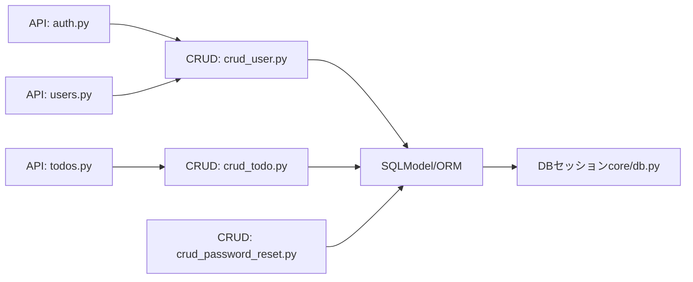

# SQLインジェクション防止

<cite>
**本文で参照するファイル**   
- [backend/app/main.py](file://backend/app/main.py)
- [backend/app/core/db.py](file://backend/app/core/db.py)
- [backend/app/crud/crud_user.py](file://backend/app/crud/crud_user.py)
- [backend/app/crud/crud_todo.py](file://backend/app/crud/crud_todo.py)
- [backend/app/crud/crud_password_reset.py](file://backend/app/crud/crud_password_reset.py)
- [backend/app/api/api_v1/endpoints/auth.py](file://backend/app/api/api_v1/endpoints/auth.py)
- [backend/app/api/api_v1/endpoints/todos.py](file://backend/app/api/api_v1/endpoints/todos.py)
- [backend/app/api/api_v1/endpoints/users.py](file://backend/app/api/api_v1/endpoints/users.py)
- [backend/app/models/user.py](file://backend/app/models/user.py)
- [backend/app/models/todo.py](file://backend/app/models/todo.py)
- [backend/app/schemas/user.py](file://backend/app/schemas/user.py)
- [backend/app/schemas/todo.py](file://backend/app/schemas/todo.py)
</cite>

## 目次
1. [はじめに](#はじめに)
2. [プロジェクト構造](#プロジェクト構造)
3. [コアコンポーネント](#コアコンポーネント)
4. [アーキテクチャ概観](#アーキテクチャ概観)
5. [詳細コンポーネント分析](#詳細コンポーネント分析)
6. [依存関係分析](#依存関係分析)
7. [パフォーマンスに関する考慮](#パフォーマンスに関する考慮)
8. [トラブルシューティングガイド](#トラブルシューティングガイド)
9. [結論](#結論)

## はじめに
本ドキュメントは、SQLインジェクション攻撃からの防御策について説明します。SQLAlchemy ORM（本プロジェクトではSQLModel）の使用による安全なクエリ作成方法、パラメーターバインドの活用、ユーザー入力の適切な処理方法について、実際のコード例を示します。また、直接的なSQLクエリの使用を避けるべき理由、SQLインジェクションのリスクと影響、そしてセキュアなデータベースアクセスのベストプラクティスについて詳しく述べます。

## プロジェクト構造
バックエンドはFastAPI + SQLModel（SQLAlchemy上位互換）で構成されており、CRUD操作は非同期セッションを介して行われています。データベース接続は非同期エンジンによって管理され、エンドポイントから依存関係として注入されます。これにより、ORM経由でのクエリ実行が強制され、SQL文字列の組み立てを最小限に抑えています。

**図の出典**
- [backend/app/main.py:1-168](file://backend/app/main.py#L1-L168)
- [backend/app/core/db.py:1-17](file://backend/app/core/db.py#L1-L17)
- [backend/app/crud/crud_user.py:1-28](file://backend/app/crud/crud_user.py#L1-L28)
- [backend/app/crud/crud_todo.py:1-152](file://backend/app/crud/crud_todo.py#L1-L152)
- [backend/app/crud/crud_password_reset.py:1-56](file://backend/app/crud/crud_password_reset.py#L1-L56)
- [backend/app/models/user.py:1-16](file://backend/app/models/user.py#L1-L16)
- [backend/app/models/todo.py:1-25](file://backend/app/models/todo.py#L1-L25)
- [backend/app/api/api_v1/endpoints/auth.py:1-117](file://backend/app/api/api_v1/endpoints/auth.py#L1-L117)
- [backend/app/api/api_v1/endpoints/todos.py:1-102](file://backend/app/api/api_v1/endpoints/todos.py#L1-L102)
- [backend/app/api/api_v1/endpoints/users.py:1-14](file://backend/app/api/api_v1/endpoints/users.py#L1-L14)

**節の出典**
- [backend/app/main.py:1-168](file://backend/app/main.py#L1-L168)
- [backend/app/core/db.py:1-17](file://backend/app/core/db.py#L1-L17)

## コアコンポーネント
- 非同期DB接続
  - 非同期エンジンの作成、セッションの生成、依存関係による注入を行うことで、ORM経由での操作を強制し、SQL文字列の直接組み立てを防ぎます。
  - 参考: [backend/app/core/db.py:1-17](file://backend/app/core/db.py#L1-L17)

- ORMクエリ（SQLModel）
  - select文を組み立て、where条件に変数を渡すことで、パラメーターバインドが自動的に適用されます。
  - 参考: [backend/app/crud/crud_user.py:8-16](file://backend/app/crud/crud_user.py#L8-L16), [backend/app/crud/crud_todo.py:25-71](file://backend/app/crud/crud_todo.py#L25-L71), [backend/app/crud/crud_password_reset.py:18-31](file://backend/app/crud/crud_password_reset.py#L18-L31)

- モデル定義
  - モデルはSQLModelを使用しており、ORMを通じた操作のみが許可されます。
  - 参考: [backend/app/models/user.py:9-15](file://backend/app/models/user.py#L9-L15), [backend/app/models/todo.py:10-24](file://backend/app/models/todo.py#L10-L24)

- APIエンドポイント
  - FastAPIの依存関係からDBセッションを受け取り、CRUD関数を呼び出すだけです。クエリの組み立てはCRUD層で完結。
  - 参考: [backend/app/api/api_v1/endpoints/auth.py:21-34](file://backend/app/api/api_v1/endpoints/auth.py#L21-L34), [backend/app/api/api_v1/endpoints/todos.py:44-67](file://backend/app/api/api_v1/endpoints/todos.py#L44-L67)

**節の出典**
- [backend/app/core/db.py:1-17](file://backend/app/core/db.py#L1-L17)
- [backend/app/crud/crud_user.py:1-28](file://backend/app/crud/crud_user.py#L1-L28)
- [backend/app/crud/crud_todo.py:1-152](file://backend/app/crud/crud_todo.py#L1-L152)
- [backend/app/crud/crud_password_reset.py:1-56](file://backend/app/crud/crud_password_reset.py#L1-L56)
- [backend/app/models/user.py:1-16](file://backend/app/models/user.py#L1-L16)
- [backend/app/models/todo.py:1-25](file://backend/app/models/todo.py#L1-L25)
- [backend/app/api/api_v1/endpoints/auth.py:1-117](file://backend/app/api/api_v1/endpoints/auth.py#L1-L117)
- [backend/app/api/api_v1/endpoints/todos.py:1-102](file://backend/app/api/api_v1/endpoints/todos.py#L1-L102)
- [backend/app/api/api_v1/endpoints/users.py:1-14](file://backend/app/api/api_v1/endpoints/users.py#L1-L14)

## アーキテクチャ概観
本プロジェクトにおけるセキュアなDBアクセスフローは以下の通りです：
- APIエンドポイントが依存関係から非同期DBセッションを取得
- CRUD関数がSQLModelのselect文を組み立て、where条件にユーザー入力やIDを渡す
- ORMが内部でパラメーターバインドを行い、SQL文字列の直接組み立てを回避
- DBにクエリを実行し、結果を返す

**図の出典**
- [backend/app/api/api_v1/endpoints/todos.py:32-67](file://backend/app/api/api_v1/endpoints/todos.py#L32-L67)
- [backend/app/crud/crud_todo.py:10-71](file://backend/app/crud/crud_todo.py#L10-L71)
- [backend/app/core/db.py:14-17](file://backend/app/core/db.py#L14-L17)

## 詳細コンポーネント分析

### SQLインジェクションのリスクと影響
- 攻撃者が入力値にSQLの特殊文字や文を埋め込むことで、意図しないSQL文を実行させることができます。
- 結果として、機密情報の漏洩、不正なデータ操作、サービスの停止などの深刻な被害が発生します。
- 本プロジェクトでは、ORM経由での操作のみを前提としているため、SQL文字列の直接組み立てがありません。

**節の出典**
- [backend/app/crud/crud_user.py:8-16](file://backend/app/crud/crud_user.py#L8-L16)
- [backend/app/crud/crud_todo.py:25-71](file://backend/app/crud/crud_todo.py#L25-L71)
- [backend/app/crud/crud_password_reset.py:18-31](file://backend/app/crud/crud_password_reset.py#L18-L31)

### ORMを使用した安全なクエリ作成（SQLModel）
- where条件に直接変数を渡すことで、ORMが自動的にパラメーターバインドを行います。
- 例：メールアドレスによる検索、IDによる取得、複数条件の組み合わせなど。
- 参考: [backend/app/crud/crud_user.py:8-16](file://backend/app/crud/crud_user.py#L8-L16), [backend/app/crud/crud_todo.py:25-71](file://backend/app/crud/crud_todo.py#L25-L71), [backend/app/crud/crud_password_reset.py:18-31](file://backend/app/crud/crud_password_reset.py#L18-L31)

**図の出典**
- [backend/app/crud/crud_user.py:8-16](file://backend/app/crud/crud_user.py#L8-L16)
- [backend/app/crud/crud_todo.py:25-71](file://backend/app/crud/crud_todo.py#L25-L71)
- [backend/app/crud/crud_password_reset.py:18-31](file://backend/app/crud/crud_password_reset.py#L18-L31)

**節の出典**
- [backend/app/crud/crud_user.py:1-28](file://backend/app/crud/crud_user.py#L1-L28)
- [backend/app/crud/crud_todo.py:1-152](file://backend/app/crud/crud_todo.py#L1-L152)
- [backend/app/crud/crud_password_reset.py:1-56](file://backend/app/crud/crud_password_reset.py#L1-L56)

### パラメーターバインドの活用
- SQLModelのselect文のwhere条件には、Pythonの変数が渡されます。ORMが内部でパラメーターバインドを行うため、クエリ文字列の組み立てが不要です。
- 例：検索ワード、完了フラグ、優先度、タグリスト、ソート条件など。
- 参考: [backend/app/crud/crud_todo.py:25-71](file://backend/app/crud/crud_todo.py#L25-L71)

**図の出典**
- [backend/app/crud/crud_todo.py:25-71](file://backend/app/crud/crud_todo.py#L25-L71)

**節の出典**
- [backend/app/crud/crud_todo.py:1-152](file://backend/app/crud/crud_todo.py#L1-L152)

### ユーザー入力の適切な処理方法
- FastAPIの依存関係からDBセッションを取得し、CRUD関数に渡すことで、入力値の検証とORM操作を分離しています。
- API層では、パスワードリセットトークンの検証、ユーザー情報の取得、TODOのCRUD操作が行われます。
- 参考: [backend/app/api/api_v1/endpoints/auth.py:21-34](file://backend/app/api/api_v1/endpoints/auth.py#L21-L34), [backend/app/api/api_v1/endpoints/todos.py:44-67](file://backend/app/api/api_v1/endpoints/todos.py#L44-L67), [backend/app/api/api_v1/endpoints/users.py:10-13](file://backend/app/api/api_v1/endpoints/users.py#L10-L13)

**図の出典**
- [backend/app/api/api_v1/endpoints/auth.py:21-34](file://backend/app/api/api_v1/endpoints/auth.py#L21-L34)
- [backend/app/api/api_v1/endpoints/todos.py:44-67](file://backend/app/api/api_v1/endpoints/todos.py#L44-L67)
- [backend/app/api/api_v1/endpoints/users.py:10-13](file://backend/app/api/api_v1/endpoints/users.py#L10-L13)

**節の出典**
- [backend/app/api/api_v1/endpoints/auth.py:1-117](file://backend/app/api/api_v1/endpoints/auth.py#L1-L117)
- [backend/app/api/api_v1/endpoints/todos.py:1-102](file://backend/app/api/api_v1/endpoints/todos.py#L1-L102)
- [backend/app/api/api_v1/endpoints/users.py:1-14](file://backend/app/api/api_v1/endpoints/users.py#L1-L14)

### 直接的なSQLクエリの使用を避けるべき理由
- SQL文字列を動的に組み立てる場合、入力値を適切にエスケープまたはバインドしなかった場合にSQLインジェクションの脆弱性が生じます。
- 本プロジェクトでは、SQLModelのselect文を使用し、where条件に変数を渡すことで、文字列の組み立てを避け、ORMの安全なクエリ生成を活かしています。
- 参考: [backend/app/main.py:147-152](file://backend/app/main.py#L147-L152)（ヘルスチェックでのtext使用は例外的）

**節の出典**
- [backend/app/main.py:147-152](file://backend/app/main.py#L147-L152)

### セキュアなデータベースアクセスのベストプラクティス
- ORM経由での操作のみを許可し、SQL文字列の直接組み立てを禁止します。
- 入力値はPydanticによるバリデーション後、ORMのwhere条件に渡します。
- 非同期セッションを介してDB操作を行うことで、スレッドセーフかつ効率的なアクセスを実現します。
- 参考: [backend/app/core/db.py:1-17](file://backend/app/core/db.py#L1-L17), [backend/app/crud/crud_user.py:8-16](file://backend/app/crud/crud_user.py#L8-L16), [backend/app/crud/crud_todo.py:25-71](file://backend/app/crud/crud_todo.py#L25-L71)

**節の出典**
- [backend/app/core/db.py:1-17](file://backend/app/core/db.py#L1-L17)
- [backend/app/crud/crud_user.py:1-28](file://backend/app/crud/crud_user.py#L1-L28)
- [backend/app/crud/crud_todo.py:1-152](file://backend/app/crud/crud_todo.py#L1-L152)

## 依存関係分析
- APIエンドポイント → CRUD関数 → SQLModel/ORM → DBセッション
- DBセッションは非同期エンジンから生成され、FastAPIの依存関係で提供されます。
- モデル定義はSQLModelを使用しており、ORM操作のみが許可されます。

**図の出典**
- [backend/app/api/api_v1/endpoints/auth.py:1-117](file://backend/app/api/api_v1/endpoints/auth.py#L1-L117)
- [backend/app/api/api_v1/endpoints/todos.py:1-102](file://backend/app/api/api_v1/endpoints/todos.py#L1-L102)
- [backend/app/api/api_v1/endpoints/users.py:1-14](file://backend/app/api/api_v1/endpoints/users.py#L1-L14)
- [backend/app/crud/crud_user.py:1-28](file://backend/app/crud/crud_user.py#L1-L28)
- [backend/app/crud/crud_todo.py:1-152](file://backend/app/crud/crud_todo.py#L1-L152)
- [backend/app/crud/crud_password_reset.py:1-56](file://backend/app/crud/crud_password_reset.py#L1-L56)
- [backend/app/core/db.py:1-17](file://backend/app/core/db.py#L1-L17)

**節の出典**
- [backend/app/api/api_v1/endpoints/auth.py:1-117](file://backend/app/api/api_v1/endpoints/auth.py#L1-L117)
- [backend/app/api/api_v1/endpoints/todos.py:1-102](file://backend/app/api/api_v1/endpoints/todos.py#L1-L102)
- [backend/app/api/api_v1/endpoints/users.py:1-14](file://backend/app/api/api_v1/endpoints/users.py#L1-L14)
- [backend/app/crud/crud_user.py:1-28](file://backend/app/crud/crud_user.py#L1-L28)
- [backend/app/crud/crud_todo.py:1-152](file://backend/app/crud/crud_todo.py#L1-L152)
- [backend/app/crud/crud_password_reset.py:1-56](file://backend/app/crud/crud_password_reset.py#L1-L56)
- [backend/app/core/db.py:1-17](file://backend/app/core/db.py#L1-L17)

## パフォーマンスに関する考慮
- 非同期DB接続により、I/OバウンドのDB操作において効率が向上します。
- ORMの使用により、SQL文字列の組み立てが不要になるため、保守性と安全性が向上します。
- ただし、複雑なクエリや大量データの処理には、適切なインデックス設計やクエリの最適化が必要です（例: Todoモデルの複数インデックス）。
- 参考: [backend/app/models/todo.py:12-17](file://backend/app/models/todo.py#L12-L17)

**節の出典**
- [backend/app/core/db.py:1-17](file://backend/app/core/db.py#L1-L17)
- [backend/app/models/todo.py:1-25](file://backend/app/models/todo.py#L1-L25)

## トラブルシューティングガイド
- DB接続エラー
  - ヘルスチェックエンドポイントでDB接続を確認できます。エラー発生時はログを確認し、DBURLやネットワーク設定を見直してください。
  - 参考: [backend/app/main.py:134-167](file://backend/app/main.py#L134-L167)

- ORM関連エラー
  - where条件に渡す値の型に注意してください。UUIDやEnumなどの型は、モデル定義に従って正しく渡してください。
  - 参考: [backend/app/models/user.py:12-13](file://backend/app/models/user.py#L12-L13), [backend/app/models/todo.py:19-22](file://backend/app/models/todo.py#L19-L22), [backend/app/schemas/todo.py:7-11](file://backend/app/schemas/todo.py#L7-L11)

**節の出典**
- [backend/app/main.py:134-167](file://backend/app/main.py#L134-L167)
- [backend/app/models/user.py:1-16](file://backend/app/models/user.py#L1-L16)
- [backend/app/models/todo.py:1-25](file://backend/app/models/todo.py#L1-L25)
- [backend/app/schemas/todo.py:1-41](file://backend/app/schemas/todo.py#L1-L41)

## 結論
本プロジェクトでは、SQLAlchemy ORM（SQLModel）を活用し、ORM経由でのみDB操作を行うことで、SQLインジェクションのリスクを根本的に低減しています。ユーザー入力はFastAPIの依存関係とPydanticによるバリデーションを経て、CRUD関数に渡され、where条件に直接渡される形で安全なクエリが生成されます。非同期DB接続により、スケーラビリティも向上しており、セキュアかつ効率的なデータベースアクセスが実現されています。