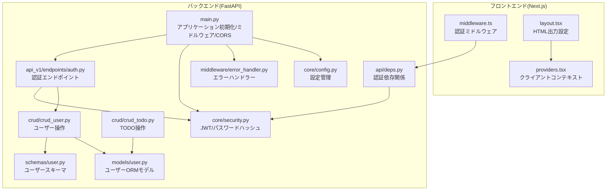
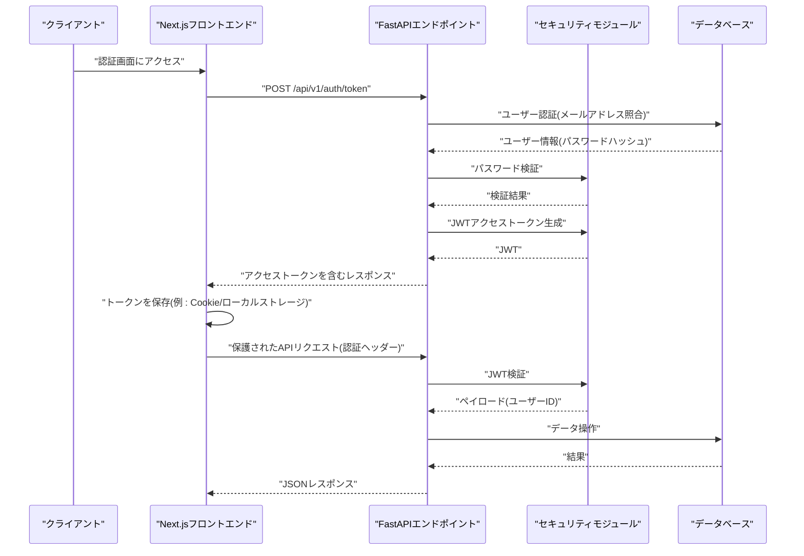
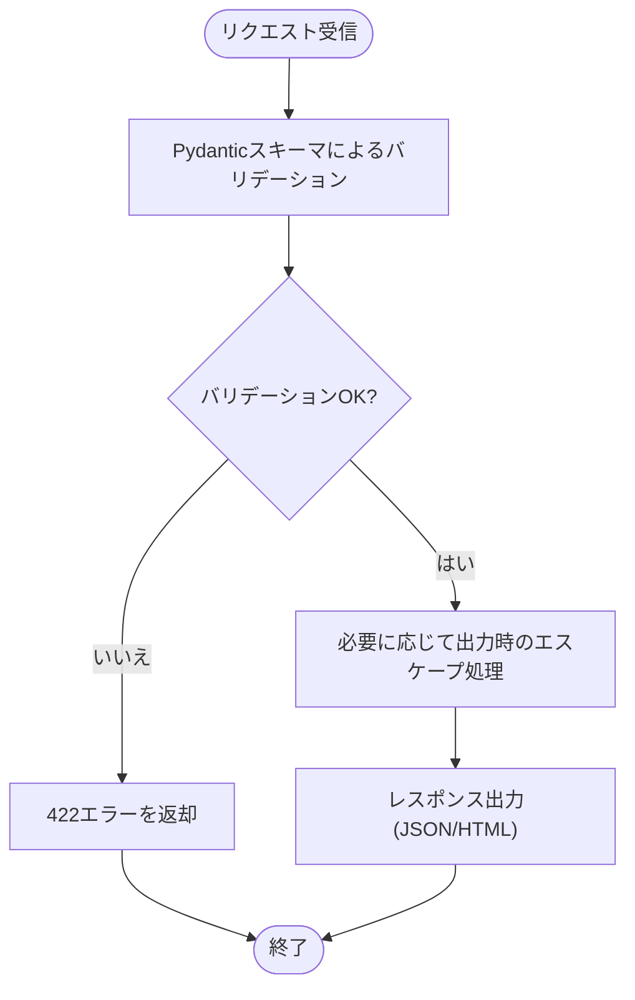
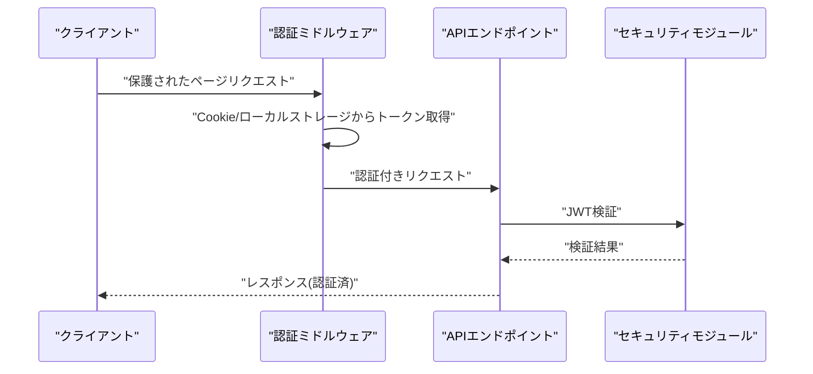
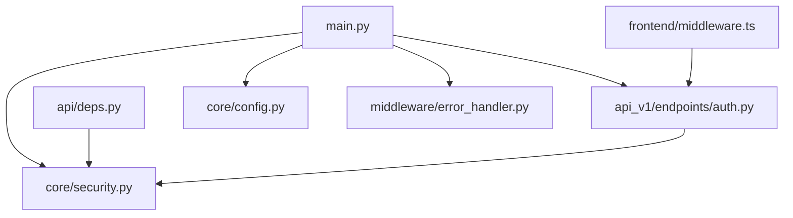

# XSSとCSRF対策

<cite>
**この文書で参照されているファイル**
- [backend/app/core/security.py](file://backend/app/core/security.py)
- [backend/app/api/api_v1/endpoints/auth.py](file://backend/app/api/api_v1/endpoints/auth.py)
- [backend/app/api/deps.py](file://backend/app/api/deps.py)
- [backend/app/main.py](file://backend/app/main.py)
- [backend/app/core/config.py](file://backend/app/core/config.py)
- [backend/app/middleware/error_handler.py](file://backend/app/middleware/error_handler.py)
- [frontend/src/middleware.ts](file://frontend/src/middleware.ts)
- [frontend/src/app/layout.tsx](file://frontend/src/app/layout.tsx)
- [frontend/src/app/providers.tsx](file://frontend/src/app/providers.tsx)
- [backend/app/crud/crud_todo.py](file://backend/app/crud/crud_todo.py)
- [backend/app/crud/crud_user.py](file://backend/app/crud/crud_user.py)
- [backend/app/schemas/user.py](file://backend/app/schemas/user.py)
- [backend/app/models/user.py](file://backend/app/models/user.py)
</cite>

## 目次
1. [はじめに](#はじめに)
2. [プロジェクト構造](#プロジェクト構造)
3. [コアコンポーネント](#コアコンポーネント)
4. [アーキテクチャ概要](#アーキテクチャ概要)
5. [詳細コンポーネント分析](#詳細コンポーネント分析)
6. [依存関係分析](#依存関係分析)
7. [パフォーマンスに関する考慮](#パフォーマンスに関する考慮)
8. [トラブルシューティングガイド](#トラブルシューティングガイド)
9. [結論](#結論)
10. [付録](#付録)

## はじめに
本稿では、Todoアプリケーションにおけるクロスサイトスクリプティング(XSS)とクロスサイトリクエストフォージェリ(CSRF)への対策について、実際の実装例を交えながら解説します。XSS攻撃の種類と影響、入力データのエスケープ処理、出力時のセキュリティ対策、CSRFトークンの生成と検証方法、フロントエンドでのセキュリティ対策、HTTPヘッダーの設定、セッション管理のベストプラクティスについて、バックエンド(FastAPI)とフロントエンド(Next.js)の双方から詳しく説明します。

## プロジェクト構造
本プロジェクトは、バックエンド(FastAPI)とフロントエンド(Next.js)の2層構造を持ちます。セキュリティ対策は両層で実施されており、特に認証・認可、CORS、エラーハンドリング、入力バリデーション、JWTトークン管理が中心です。

**図の出典**
- [backend/app/main.py:1-168](file://backend/app/main.py#L1-L168)
- [backend/app/core/security.py:1-35](file://backend/app/core/security.py#L1-L35)
- [backend/app/api/deps.py:1-37](file://backend/app/api/deps.py#L1-L37)
- [backend/app/api/api_v1/endpoints/auth.py:1-117](file://backend/app/api/api_v1/endpoints/auth.py#L1-L117)
- [backend/app/middleware/error_handler.py:1-149](file://backend/app/middleware/error_handler.py#L1-L149)
- [backend/app/core/config.py:1-91](file://backend/app/core/config.py#L1-L91)
- [backend/app/crud/crud_todo.py:1-152](file://backend/app/crud/crud_todo.py#L1-L152)
- [backend/app/crud/crud_user.py:1-28](file://backend/app/crud/crud_user.py#L1-L28)
- [backend/app/schemas/user.py:1-13](file://backend/app/schemas/user.py#L1-L13)
- [backend/app/models/user.py:1-16](file://backend/app/models/user.py#L1-L16)
- [frontend/src/middleware.ts:1-35](file://frontend/src/middleware.ts#L1-L35)
- [frontend/src/app/layout.tsx:1-40](file://frontend/src/app/layout.tsx#L1-L40)
- [frontend/src/app/providers.tsx:1-26](file://frontend/src/app/providers.tsx#L1-L26)

**節の出典**
- [backend/app/main.py:1-168](file://backend/app/main.py#L1-L168)
- [frontend/src/middleware.ts:1-35](file://frontend/src/middleware.ts#L1-L35)

## コアコンポーネント
- 認証・認可
  - JWTベースの認証: トークンの生成、検証、期限管理
  - 認証ミドルウェア: 保護されたルートへのアクセス制御
- 入力バリデーション
  - Pydanticによるスキーマ定義と自動バリデーション
  - 入力値の型・範囲・必須条件の強制
- 出力制御
  - HTML出力時の文字エンコーディング・サニタイズの考え方
  - APIレスポンスのJSON出力におけるセキュリティ
- CORS設定
  - 許可されたオリジンからのリクエストのみ許可
- セッション管理
  - JWTをCookieまたはAuthorizationヘッダーで送受信
  - トークンの有効期限と再生成戦略

**節の出典**
- [backend/app/core/security.py:1-35](file://backend/app/core/security.py#L1-L35)
- [backend/app/api/deps.py:1-37](file://backend/app/api/deps.py#L1-L37)
- [backend/app/api/api_v1/endpoints/auth.py:1-117](file://backend/app/api/api_v1/endpoints/auth.py#L1-L117)
- [backend/app/main.py:104-118](file://backend/app/main.py#L104-L118)
- [backend/app/schemas/user.py:1-13](file://backend/app/schemas/user.py#L1-L13)
- [backend/app/models/user.py:1-16](file://backend/app/models/user.py#L1-L16)

## アーキテクチャ概要
以下は、認証フローにおけるJWTの生成・検証と、ミドルウェアによるアクセス制御の全体像です。

**図の出典**
- [backend/app/api/api_v1/endpoints/auth.py:36-54](file://backend/app/api/api_v1/endpoints/auth.py#L36-L54)
- [backend/app/core/security.py:17-34](file://backend/app/core/security.py#L17-L34)
- [backend/app/api/deps.py:13-36](file://backend/app/api/deps.py#L13-L36)
- [backend/app/crud/crud_user.py:8-27](file://backend/app/crud/crud_user.py#L8-L27)

## 詳細コンポーネント分析

### XSS対策
XSSは、悪意のあるスクリプトをWebページに埋め込み、ユーザーのブラウザ上で実行させることで、セッションハイジャックやフィッシングなどの被害を引き起こす攻撃です。本プロジェクトにおけるXSS対策のポイントは以下の通りです。

- 入力バリデーション
  - Pydanticスキーマによる型・範囲・必須条件の強制により、不正な入力を事前に排除します。
  - 例: [backend/app/schemas/user.py:5-13](file://backend/app/schemas/user.py#L5-L13)
- 出力時のサニタイズ
  - HTML出力を行う場合、テンプレートエンジンやフレームワークの自動エスケープ機能を活用し、ユーザー入力をエスケープします。
  - APIレスポンス(JSON)は、Pydanticの自動シリアライズにより、適切なエスケープが適用されます。
- 文字エンコーディング
  - UTF-8を統一し、不正なバイト列によるエンコーディングバイパスを防ぎます。
- Content Security Policy (CSP) への対応
  - 本プロジェクトではCSPヘッダーの設定は見当たりません。今後の拡張として、必要に応じてCSPを導入し、スクリプトの実行元を制限することを推奨します。

**節の出典**
- [backend/app/schemas/user.py:1-13](file://backend/app/schemas/user.py#L1-L13)
- [backend/app/middleware/error_handler.py:15-49](file://backend/app/middleware/error_handler.py#L15-L49)
- [backend/app/crud/crud_todo.py:28-43](file://backend/app/crud/crud_todo.py#L28-L43)

### CSRF対策
CSRFは、認証済みユーザーが意図せず攻撃者の仕組みに従ってリクエストを送信させることで、意図しない操作を引き起こす攻撃です。本プロジェクトにおけるCSRF対策のポイントは以下の通りです。

- JWTベースの認証
  - トークンをAuthorizationヘッダーまたはCookieに保持し、CSRFトークンの不要化を実現します。
  - 例: [backend/app/api/deps.py:11-11](file://backend/app/api/deps.py#L11-L11)
- CORS設定
  - 許可されたオリジンからのリクエストのみを受け入れ、他オリジンからのリクエストを遮断します。
  - 例: [backend/app/main.py:109-115](file://backend/app/main.py#L109-L115)
- トークンの有効期限管理
  - トークンの有効期限を短くし、再発行を促すことで、CSRF攻撃の成功確率を下げる工夫をします。
  - 例: [backend/app/core/security.py:20-27](file://backend/app/core/security.py#L20-L27)
- 認証ミドルウェア
  - 保護されたルートへのアクセス前にトークンの有効性を検証し、認証されていないリクエストを拒否します。
  - 例: [frontend/src/middleware.ts:15-25](file://frontend/src/middleware.ts#L15-L25)

**図の出典**
- [frontend/src/middleware.ts:7-25](file://frontend/src/middleware.ts#L7-L25)
- [backend/app/api/deps.py:13-36](file://backend/app/api/deps.py#L13-L36)
- [backend/app/core/security.py:29-34](file://backend/app/core/security.py#L29-L34)

**節の出典**
- [frontend/src/middleware.ts:1-35](file://frontend/src/middleware.ts#L1-L35)
- [backend/app/api/deps.py:1-37](file://backend/app/api/deps.py#L1-L37)
- [backend/app/core/security.py:1-35](file://backend/app/core/security.py#L1-L35)

### 入力データのエスケープ処理
- 入力値の型・範囲・必須条件
  - Pydanticスキーマで定義された型とバリデーションルールに従い、不正な値は即時拒否されます。
  - 例: [backend/app/schemas/user.py:5-13](file://backend/app/schemas/user.py#L5-L13)
- ORMモデルの使用
  - SQLModel経由でのデータ操作により、SQLインジェクションのリスクを低減します。
  - 例: [backend/app/models/user.py:9-16](file://backend/app/models/user.py#L9-L16)
- クエリパラメータのフィルタリング
  - TODO検索・フィルタリングでは、LIKE相当の操作に注意を払い、不正なSQLを防ぐためのバリデーションを実施します。
  - 例: [backend/app/crud/crud_todo.py:28-43](file://backend/app/crud/crud_todo.py#L28-L43)

**節の出典**
- [backend/app/schemas/user.py:1-13](file://backend/app/schemas/user.py#L1-L13)
- [backend/app/models/user.py:1-16](file://backend/app/models/user.py#L1-L16)
- [backend/app/crud/crud_todo.py:10-71](file://backend/app/crud/crud_todo.py#L10-L71)

### 出力時のセキュリティ対策
- APIレスポンス(JSON)
  - Pydanticのモデル出力により、文字列や特殊文字が適切にエスケープされます。
  - 例: [backend/app/api/api_v1/endpoints/auth.py:34-34](file://backend/app/api/api_v1/endpoints/auth.py#L34-L34)
- HTML出力
  - Next.jsのlayout.tsxでHTMLのlang属性や文字エンコーディングを適切に設定し、出力時のセキュリティを強化します。
  - 例: [frontend/src/app/layout.tsx:28-38](file://frontend/src/app/layout.tsx#L28-L38)

**節の出典**
- [backend/app/api/api_v1/endpoints/auth.py:19-34](file://backend/app/api/api_v1/endpoints/auth.py#L19-L34)
- [frontend/src/app/layout.tsx:17-38](file://frontend/src/app/layout.tsx#L17-L38)

### CSRFトークンの生成と検証方法
- トークンの生成
  - JWTアクセストークンを生成し、クライアントに返却します。
  - 例: [backend/app/core/security.py:17-27](file://backend/app/core/security.py#L17-L27)
- トークンの検証
  - 認証ミドルウェアで、リクエストに含まれるJWTを検証し、有効なユーザーであることを保証します。
  - 例: [backend/app/api/deps.py:17-23](file://backend/app/api/deps.py#L17-L23)
- トークンの保存
  - クライアント側では、Cookieまたはローカルストレージにトークンを保存し、以降のリクエストに含める必要があります。
  - 例: [frontend/src/middleware.ts:16-16](file://frontend/src/middleware.ts#L16-L16)

**節の出典**
- [backend/app/core/security.py:17-34](file://backend/app/core/security.py#L17-L34)
- [backend/app/api/deps.py:13-36](file://backend/app/api/deps.py#L13-L36)
- [frontend/src/middleware.ts:15-25](file://frontend/src/middleware.ts#L15-L25)

### フロントエンドでのセキュリティ対策
- 認証ミドルウェア
  - 保護されたページへのアクセス前に、トークンの存在を確認し、なければログインページへリダイレクトします。
  - 例: [frontend/src/middleware.ts:7-25](file://frontend/src/middleware.ts#L7-L25)
- HTML出力設定
  - layout.tsxでHTMLのlang属性や文字エンコーディングを設定し、XSSのリスクを軽減します。
  - 例: [frontend/src/app/layout.tsx:28-38](file://frontend/src/app/layout.tsx#L28-L38)
- クライアントコンテキスト
  - providers.tsxでクエリクライアントやテーマプロバイダを設定し、外部ライブラリの脆弱性を最小限に抑えます。
  - 例: [frontend/src/app/providers.tsx:8-25](file://frontend/src/app/providers.tsx#L8-L25)

**節の出典**
- [frontend/src/middleware.ts:1-35](file://frontend/src/middleware.ts#L1-L35)
- [frontend/src/app/layout.tsx:17-38](file://frontend/src/app/layout.tsx#L17-L38)
- [frontend/src/app/providers.tsx:1-26](file://frontend/src/app/providers.tsx#L1-L26)

### HTTPヘッダーの設定
- CORS
  - 許可されたオリジンからのリクエストのみを受け入れ、credentialsを許可する設定により、セキュアなクロスオリジン通信を実現します。
  - 例: [backend/app/main.py:109-115](file://backend/app/main.py#L109-L115)
- 認証スキーマ
  - OpenAPIにBearer認証スキーマを追加し、APIドキュメント上でも認証の重要性を示します。
  - 例: [backend/app/main.py:89-97](file://backend/app/main.py#L89-L97)

**節の出典**
- [backend/app/main.py:104-118](file://backend/app/main.py#L104-L118)

### セッション管理のベストプラクティス
- トークンの保存場所
  - Cookie: SameSite、HttpOnly、Secure属性を適切に設定し、XSSとCSRFのリスクを低減します。
  - Authorizationヘッダー: トークンをURLに含めず、常にヘッダー経由で送信します。
- トークンの有効期限
  - 短い有効期限を設定し、定期的に再認証を促します。
  - 例: [backend/app/core/security.py:20-27](file://backend/app/core/security.py#L20-L27)
- 再発行戦略
  - トークンの再発行と、古いトークンの無効化を行うことで、盗難や漏洩のリスクを軽減します。
  - 例: [backend/app/api/api_v1/endpoints/auth.py:50-54](file://backend/app/api/api_v1/endpoints/auth.py#L50-L54)

**節の出典**
- [backend/app/core/security.py:17-34](file://backend/app/core/security.py#L17-L34)
- [backend/app/api/api_v1/endpoints/auth.py:36-54](file://backend/app/api/api_v1/endpoints/auth.py#L36-L54)

## 依存関係分析
以下は、セキュリティに関連する主要な依存関係の概要です。

**図の出典**
- [backend/app/main.py:1-168](file://backend/app/main.py#L1-L168)
- [backend/app/core/security.py:1-35](file://backend/app/core/security.py#L1-L35)
- [backend/app/api/deps.py:1-37](file://backend/app/api/deps.py#L1-L37)
- [backend/app/api/api_v1/endpoints/auth.py:1-117](file://backend/app/api/api_v1/endpoints/auth.py#L1-L117)
- [backend/app/middleware/error_handler.py:1-149](file://backend/app/middleware/error_handler.py#L1-L149)
- [frontend/src/middleware.ts:1-35](file://frontend/src/middleware.ts#L1-L35)

**節の出典**
- [backend/app/main.py:1-168](file://backend/app/main.py#L1-L168)
- [backend/app/core/security.py:1-35](file://backend/app/core/security.py#L1-L35)
- [backend/app/api/deps.py:1-37](file://backend/app/api/deps.py#L1-L37)
- [backend/app/api/api_v1/endpoints/auth.py:1-117](file://backend/app/api/api_v1/endpoints/auth.py#L1-L117)
- [backend/app/middleware/error_handler.py:1-149](file://backend/app/middleware/error_handler.py#L1-L149)
- [frontend/src/middleware.ts:1-35](file://frontend/src/middleware.ts#L1-L35)

## パフォーマンスに関する考慮
- JWTの検証コスト
  - トークン検証は軽量ですが、頻繁な認証チェックはオーバーヘッドとなります。キャッシュやクライアントサイドでのトークン再利用を検討してください。
- CORS設定
  - 許可オリジンのリストは最小限に保ち、不要なオリジンを除外することで、セキュリティとパフォーマンスのバランスを取ってください。
- 画像や静的リソース
  - 本プロジェクトでは静的リソースの扱いは見当たりませんが、本番環境ではCDNや適切なキャッシュヘッダーの設定を推奨します。

[この節は一般的なガイダンスであり、特定のファイルを直接分析していません]

## トラブルシューティングガイド
- 認証エラー
  - 401 Unauthorized: トークンの形式が不正、期限切れ、ペイロードに問題がある場合に発生します。
  - 対処: トークンの再発行、日時の確認、アルゴリズム設定の確認。
  - 例: [backend/app/api/deps.py:18-26](file://backend/app/api/deps.py#L18-L26)
- 422 Validation Error
  - 入力スキーマに不整合がある場合に発生します。エラーレスポンスのdetailsから具体的なフィールドを特定してください。
  - 例: [backend/app/middleware/error_handler.py:15-49](file://backend/app/middleware/error_handler.py#L15-L49)
- 429 Rate Limit Exceeded
  - リクエスト制限を超過した場合に発生します。設定値の見直しやクライアント側のリトライ戦略を検討してください。
  - 例: [backend/app/middleware/error_handler.py:125-148](file://backend/app/middleware/error_handler.py#L125-L148)

**節の出典**
- [backend/app/api/deps.py:18-26](file://backend/app/api/deps.py#L18-L26)
- [backend/app/middleware/error_handler.py:15-49](file://backend/app/middleware/error_handler.py#L15-L49)
- [backend/app/middleware/error_handler.py:125-148](file://backend/app/middleware/error_handler.py#L125-L148)

## 結論
本プロジェクトでは、JWTベースの認証、CORS設定、入力バリデーション、エラーハンドリングを通じて、XSSとCSRFのリスクを効果的に軽減しています。今後の改善として、CSPヘッダーの導入、Cookieのセキュア属性の設定、CSRF対策の強化、および本番環境での設定管理の徹底が求められます。

[この節は要約であり、特定のファイルを直接分析していません]

## 付録
- 設定管理
  - 環境変数経由での設定管理により、本番環境でのセキュリティ設定を柔軟に変更できます。
  - 例: [backend/app/core/config.py:51-83](file://backend/app/core/config.py#L51-L83)

**節の出典**
- [backend/app/core/config.py:1-91](file://backend/app/core/config.py#L1-L91)