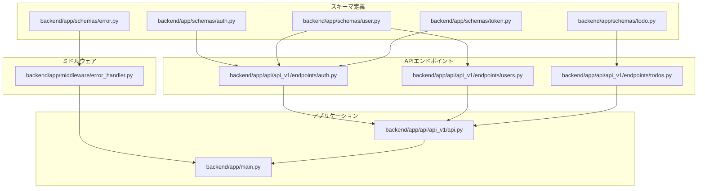
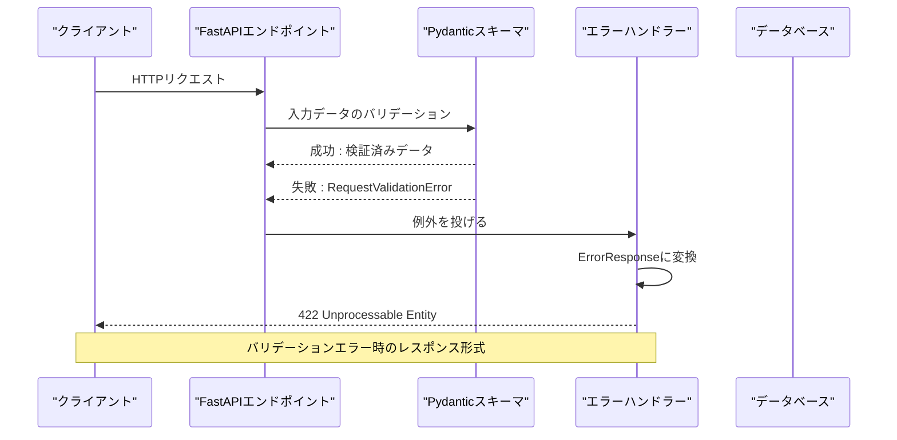
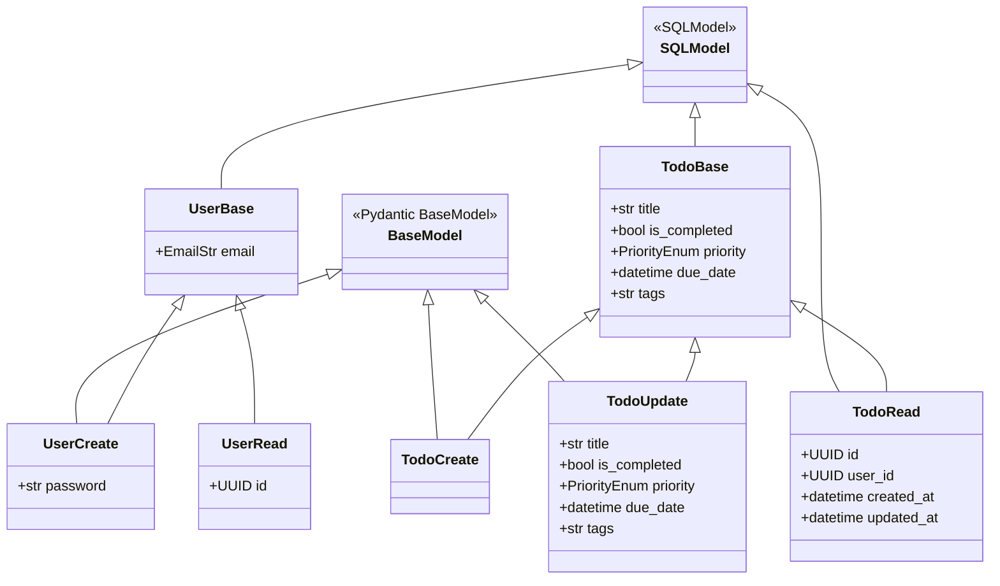
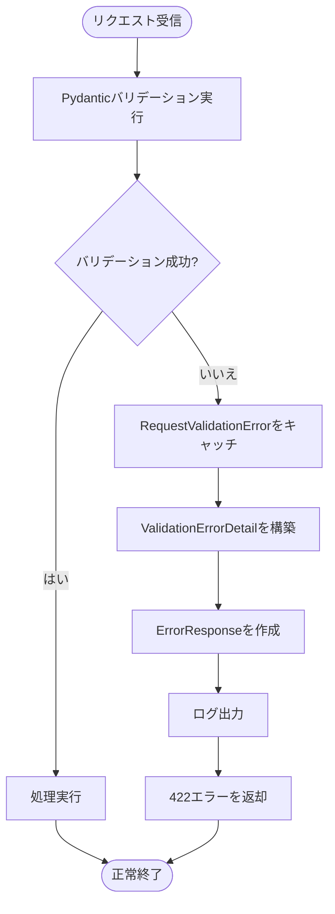
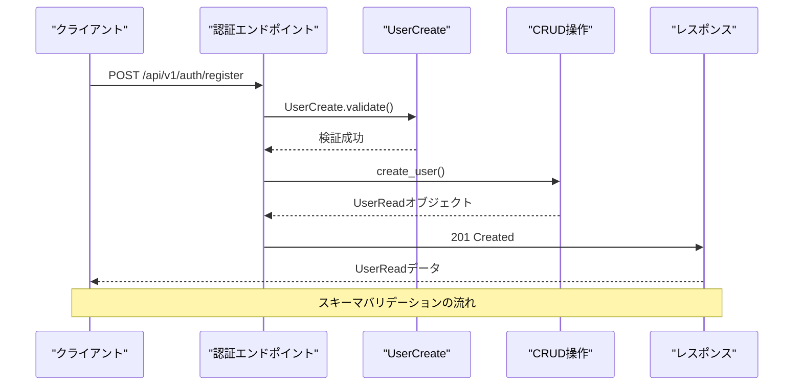
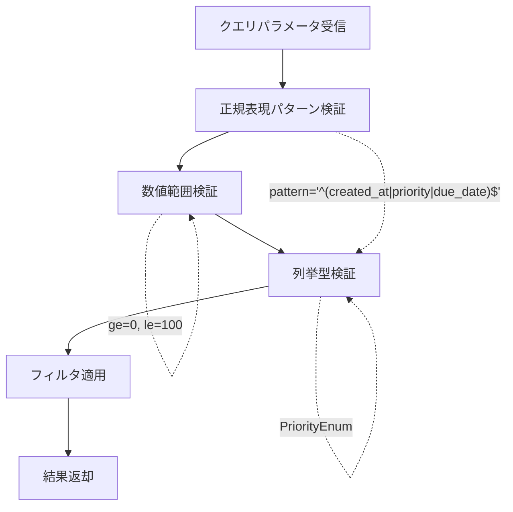
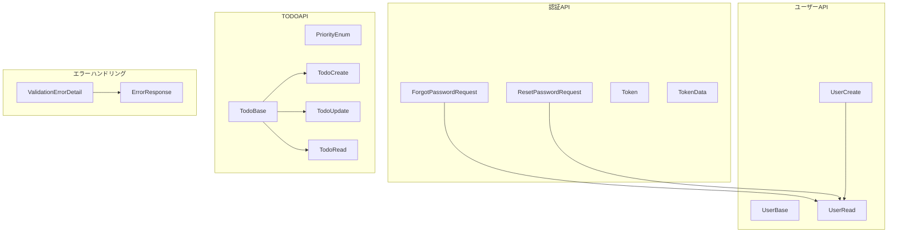
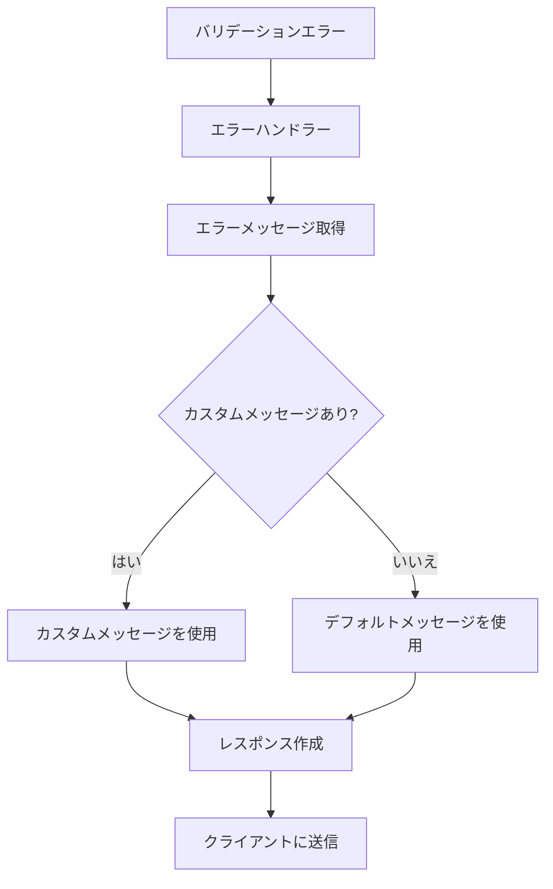

# スキーマバリデーション

<cite>
**本文で参照されるファイル**   
- [backend/app/schemas/auth.py](file://backend/app/schemas/auth.py)
- [backend/app/schemas/user.py](file://backend/app/schemas/user.py)
- [backend/app/schemas/todo.py](file://backend/app/schemas/todo.py)
- [backend/app/schemas/error.py](file://backend/app/schemas/error.py)
- [backend/app/schemas/token.py](file://backend/app/schemas/token.py)
- [backend/app/api/api_v1/endpoints/auth.py](file://backend/app/api/api_v1/endpoints/auth.py)
- [backend/app/api/api_v1/endpoints/users.py](file://backend/app/api/api_v1/endpoints/users.py)
- [backend/app/api/api_v1/endpoints/todos.py](file://backend/app/api/api_v1/endpoints/todos.py)
- [backend/app/middleware/error_handler.py](file://backend/app/middleware/error_handler.py)
- [backend/app/main.py](file://backend/app/main.py)
- [backend/app/api/api_v1/api.py](file://backend/app/api/api_v1/api.py)
- [backend/tests/test_auth.py](file://backend/tests/test_auth.py)
- [backend/tests/test_todos.py](file://backend/tests/test_todos.py)
</cite>

## 目次
1. [はじめに](#はじめに)
2. [プロジェクト構造](#プロジェクト構造)
3. [コアコンポーネント](#コアコンポーネント)
4. [アーキテクチャ概要](#アーキテクチャ概要)
5. [詳細コンポーネント分析](#詳細コンポーネント分析)
6. [依存関係分析](#依存関係分析)
7. [パフォーマンス考慮事項](#パフォーマンス考慮事項)
8. [トラブルシューティングガイド](#トラブルシューティングガイド)
9. [結論](#結論)

## はじめに
本ドキュメントは、TodoアプリケーションにおけるPydanticスキーマを使用した入力バリデーションの仕組みについて詳しく説明します。各スキーマクラスの定義、バリデーションルールの設定方法、フィールドの型検証、必須項目の指定、文字列長制限、フォーマット検証について実際のコード例を交えながら解説します。また、バリデーションエラー時のレスポンス形式、エラーメッセージのカスタマイズ方法、スキーマの再利用パターンについても述べます。

## プロジェクト構造
TodoアプリケーションはFastAPIフレームワークを基盤としており、スキーマバリデーションは以下のディレクトリ構造で管理されています：

**図の出典**
- [backend/app/schemas/auth.py:1-11](file://backend/app/schemas/auth.py#L1-L11)
- [backend/app/schemas/user.py:1-13](file://backend/app/schemas/user.py#L1-L13)
- [backend/app/schemas/todo.py:1-41](file://backend/app/schemas/todo.py#L1-L41)
- [backend/app/schemas/error.py:1-23](file://backend/app/schemas/error.py#L1-L23)
- [backend/app/schemas/token.py:1-10](file://backend/app/schemas/token.py#L1-L10)
- [backend/app/api/api_v1/endpoints/auth.py:1-117](file://backend/app/api/api_v1/endpoints/auth.py#L1-L117)
- [backend/app/api/api_v1/endpoints/users.py:1-14](file://backend/app/api/api_v1/endpoints/users.py#L1-L14)
- [backend/app/api/api_v1/endpoints/todos.py:1-102](file://backend/app/api/api_v1/endpoints/todos.py#L1-L102)
- [backend/app/middleware/error_handler.py:1-149](file://backend/app/middleware/error_handler.py#L1-L149)
- [backend/app/main.py:1-168](file://backend/app/main.py#L1-L168)
- [backend/app/api/api_v1/api.py:1-8](file://backend/app/api/api_v1/api.py#L1-L8)

**節の出典**
- [backend/app/schemas/auth.py:1-11](file://backend/app/schemas/auth.py#L1-L11)
- [backend/app/schemas/user.py:1-13](file://backend/app/schemas/user.py#L1-L13)
- [backend/app/schemas/todo.py:1-41](file://backend/app/schemas/todo.py#L1-L41)
- [backend/app/schemas/error.py:1-23](file://backend/app/schemas/error.py#L1-L23)
- [backend/app/schemas/token.py:1-10](file://backend/app/schemas/token.py#L1-L10)
- [backend/app/api/api_v1/endpoints/auth.py:1-117](file://backend/app/api/api_v1/endpoints/auth.py#L1-L117)
- [backend/app/api/api_v1/endpoints/users.py:1-14](file://backend/app/api/api_v1/endpoints/users.py#L1-L14)
- [backend/app/api/api_v1/endpoints/todos.py:1-102](file://backend/app/api/api_v1/endpoints/todos.py#L1-L102)
- [backend/app/middleware/error_handler.py:1-149](file://backend/app/middleware/error_handler.py#L1-L149)
- [backend/app/main.py:1-168](file://backend/app/main.py#L1-L168)
- [backend/app/api/api_v1/api.py:1-8](file://backend/app/api/api_v1/api.py#L1-L8)

## コアコンポーネント
本アプリケーションのバリデーションは、主に以下のスキーマクラスによって実現されています：

### 認証関連スキーマ
- **ForgotPasswordRequest**: EmailStr型のemailフィールドのみを含むシンプルなスキーマ
- **ResetPasswordRequest**: 文字列長制限付きのtokenとnew_passwordフィールドを持つ

### ユーザー関連スキーマ
- **UserBase**: EmailStr型のemailフィールド（unique、index、nullable=False、max_length=255）
- **UserCreate**: UserBaseを継承し、passwordフィールドを追加
- **UserRead**: ID、email、UUIDを含む読み取り専用スキーマ

### TODO関連スキーマ
- **PriorityEnum**: 優先度の列挙型（high、medium、low）
- **TodoBase**: title（max_length=255、nullable=False）、is_completed、priority、due_date、tags（max_length=500）
- **TodoCreate**: TodoBaseを継承（バリデーションルールは継承）
- **TodoUpdate**: 全フィールドがOptional型（部分的な更新に対応）
- **TodoRead**: ID、user_id、created_at、updated_atを含む完全なスキーマ

### エラーレスポンススキーマ
- **ErrorResponse**: 統一エラーレスポンススキーマ（status_code、detail、message、error_code、details）
- **ValidationErrorDetail**: バリデーションエラー詳細（field、message、value）

**節の出典**
- [backend/app/schemas/auth.py:1-11](file://backend/app/schemas/auth.py#L1-L11)
- [backend/app/schemas/user.py:1-13](file://backend/app/schemas/user.py#L1-L13)
- [backend/app/schemas/todo.py:1-41](file://backend/app/schemas/todo.py#L1-L41)
- [backend/app/schemas/error.py:1-23](file://backend/app/schemas/error.py#L1-L23)

## アーキテクチャ概要
バリデーション処理は、FastAPIのリクエスト処理フローの中で自動的に実行され、エラー発生時に統一されたレスポンス形式で返されます。

**図の出典**
- [backend/app/middleware/error_handler.py:15-49](file://backend/app/middleware/error_handler.py#L15-L49)
- [backend/app/api/api_v1/endpoints/auth.py:19-34](file://backend/app/api/api_v1/endpoints/auth.py#L19-L34)
- [backend/app/api/api_v1/endpoints/todos.py:59-67](file://backend/app/api/api_v1/endpoints/todos.py#L59-L67)

**節の出典**
- [backend/app/middleware/error_handler.py:1-149](file://backend/app/middleware/error_handler.py#L1-L149)
- [backend/app/api/api_v1/endpoints/auth.py:1-117](file://backend/app/api/api_v1/endpoints/auth.py#L1-L117)
- [backend/app/api/api_v1/endpoints/todos.py:1-102](file://backend/app/api/api_v1/endpoints/todos.py#L1-L102)

## 詳細コンポーネント分析

### Pydanticスキーマの定義パターン
スキーマはSQLModelとPydanticの両方を継承することで、データベースモデルとAPIスキーマの両方の機能を提供しています。

**図の出典**
- [backend/app/schemas/user.py:1-13](file://backend/app/schemas/user.py#L1-L13)
- [backend/app/schemas/todo.py:1-41](file://backend/app/schemas/todo.py#L1-L41)

### バリデーションルールの設定方法
各スキーマでは、フィールドごとにバリデーションルールを設定しています：

#### 型検証
- **EmailStr**: メールアドレス形式の検証
- **UUID**: UUID形式の検証
- **str**: 文字列型の検証
- **bool**: 真偽値の検証
- **datetime**: 日時型の検証
- **Optional**: 値が省略可能

#### 必須項目の指定
- **nullable=False**: NULL値を許可しない
- **Field(default=None)**: 明示的にNoneを許可

#### 文字列長制限
- **max_length=255**: titleフィールドの最大長
- **max_length=500**: tagsフィールドの最大長
- **min_length=6**: new_passwordフィールドの最小長
- **min_length=10**: tokenフィールドの最小長

#### フォーマット検証
- **pattern**: 正規表現によるフォーマット検証
- **enum**: 列挙型の値のみ許可

**節の出典**
- [backend/app/schemas/user.py:5-12](file://backend/app/schemas/user.py#L5-L12)
- [backend/app/schemas/todo.py:13-28](file://backend/app/schemas/todo.py#L13-L28)
- [backend/app/schemas/auth.py:8-10](file://backend/app/schemas/auth.py#L8-L10)
- [backend/app/api/api_v1/endpoints/todos.py:42-43](file://backend/app/api/api_v1/endpoints/todos.py#L42-L43)

### エラーハンドリングの仕組み
バリデーションエラーは自動的にキャッチされ、統一されたErrorResponse形式で返されます。

**図の出典**
- [backend/app/middleware/error_handler.py:15-49](file://backend/app/middleware/error_handler.py#L15-L49)

**節の出典**
- [backend/app/middleware/error_handler.py:1-149](file://backend/app/middleware/error_handler.py#L1-L149)

### APIエンドポイントでのスキーマ使用
各エンドポイントでは、リクエストボディやクエリパラメータに対してスキーマを適用しています。

**図の出典**
- [backend/app/api/api_v1/endpoints/auth.py:19-34](file://backend/app/api/api_v1/endpoints/auth.py#L19-L34)

**節の出典**
- [backend/app/api/api_v1/endpoints/auth.py:1-117](file://backend/app/api/api_v1/endpoints/auth.py#L1-L117)

### クエリパラメータのバリデーション
TODOエンドポイントでは、クエリパラメータにもバリデーションルールが適用されています。

**図の出典**
- [backend/app/api/api_v1/endpoints/todos.py:36-43](file://backend/app/api/api_v1/endpoints/todos.py#L36-L43)

**節の出典**
- [backend/app/api/api_v1/endpoints/todos.py:1-102](file://backend/app/api/api_v1/endpoints/todos.py#L1-L102)

## 依存関係分析
スキーマ間の依存関係と使用関係を以下に示します：

**図の出典**
- [backend/app/schemas/auth.py:1-11](file://backend/app/schemas/auth.py#L1-L11)
- [backend/app/schemas/user.py:1-13](file://backend/app/schemas/user.py#L1-L13)
- [backend/app/schemas/todo.py:1-41](file://backend/app/schemas/todo.py#L1-L41)
- [backend/app/schemas/error.py:1-23](file://backend/app/schemas/error.py#L1-L23)

**節の出典**
- [backend/app/schemas/auth.py:1-11](file://backend/app/schemas/auth.py#L1-L11)
- [backend/app/schemas/user.py:1-13](file://backend/app/schemas/user.py#L1-L13)
- [backend/app/schemas/todo.py:1-41](file://backend/app/schemas/todo.py#L1-L41)
- [backend/app/schemas/error.py:1-23](file://backend/app/schemas/error.py#L1-L23)

## パフォーマンス考慮事項
- **スキーマの再利用**: 同じバリデーションルールを複数のスキーマで再利用することで、コードの重複を避け、保守性を向上させています
- **非同期処理**: FastAPIの非同期対応により、スキーマバリデーションのオーバーヘッドを最小限に抑えています
- **エラーハンドリングの効率**: 一貫したエラーレスポンス形式により、クライアント側でのエラーハンドリングが容易になります

## トラブルシューティングガイド

### 一般的なバリデーションエラー
バリデーションエラーが発生した場合、以下のErrorResponse形式でエラー情報を取得できます：

- **status_code**: 422（Unprocessable Entity）
- **detail**: 詳細なエラー内容
- **message**: 日本語のエラーメッセージ
- **error_code**: エラーコード（VALIDATION_ERROR）
- **details**: 詳細なエラー情報の配列

### カスタムエラーメッセージの設定
エラーメッセージは、エラーハンドラー内でカスタマイズ可能です：

**図の出典**
- [backend/app/middleware/error_handler.py:107-122](file://backend/app/middleware/error_handler.py#L107-L122)

**節の出典**
- [backend/app/middleware/error_handler.py:1-149](file://backend/app/middleware/error_handler.py#L1-L149)

### テストケースからのバリデーション確認
テストコードを通じて、スキーマバリデーションの動作を確認できます：

- **ユーザー登録**: 重複したメールアドレスでの登録が400エラーになることを確認
- **ログイン**: 無効な認証情報でのログインが401エラーになることを確認
- **TODO作成**: 不正なデータでのTODO作成が422エラーになることを確認

**節の出典**
- [backend/tests/test_auth.py:1-66](file://backend/tests/test_auth.py#L1-L66)
- [backend/tests/test_todos.py:1-151](file://backend/tests/test_todos.py#L1-L151)

## 結論
本アプリケーションでは、Pydanticスキーマを活用した堅牢な入力バリデーションを実現しています。各スキーマクラスは、型検証、必須項目の指定、文字列長制限、フォーマット検証などのルールを適切に設定し、APIエンドポイントで自動的に適用されます。エラーハンドラーを通じて統一されたレスポンス形式が提供され、開発者とクライアント双方にとって使いやすいインターフェースとなっています。スキーマの再利用パターンにより、コードの保守性と拡張性が向上しており、今後の機能追加にも柔軟に対応できる構造になっています。