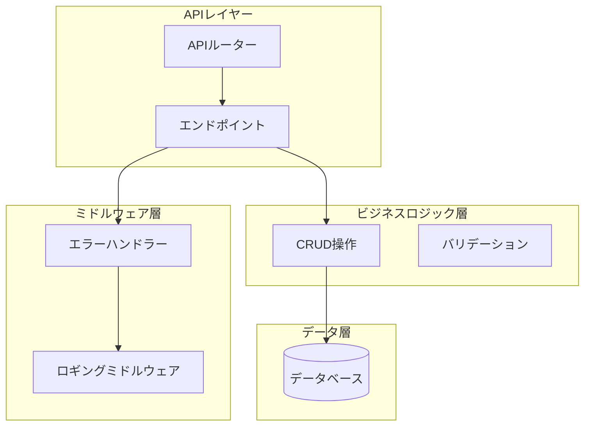
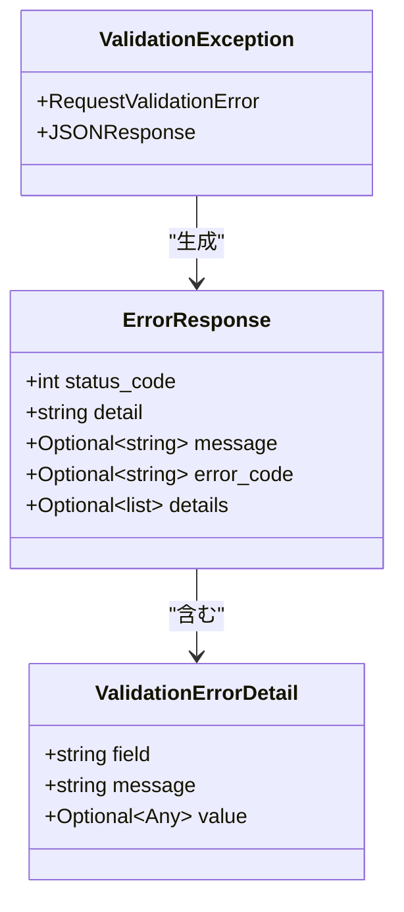
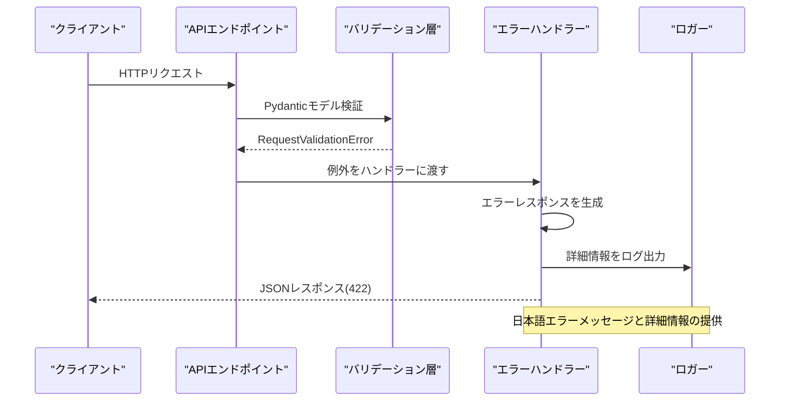
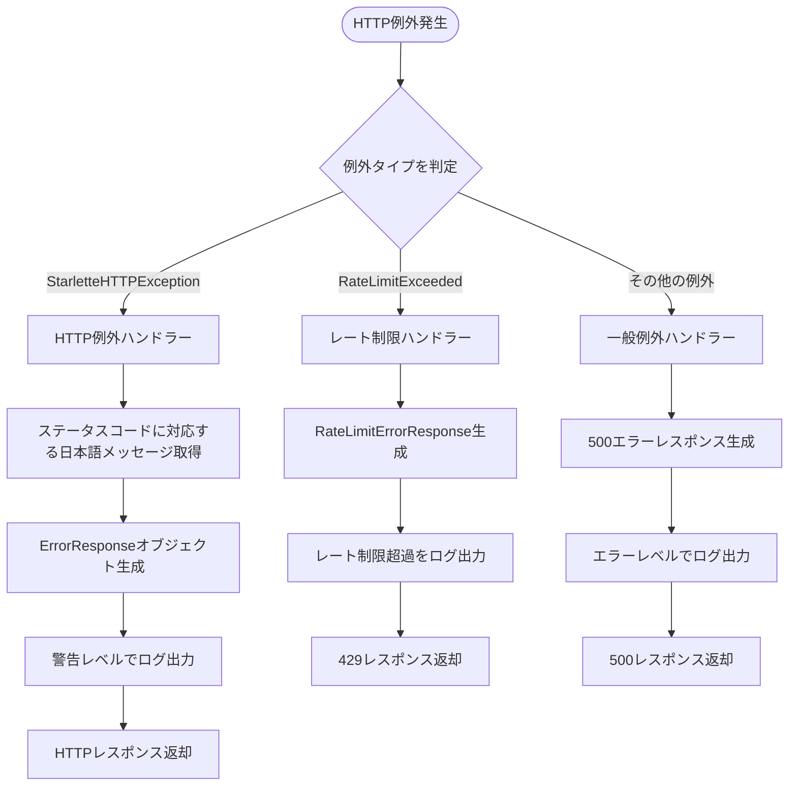
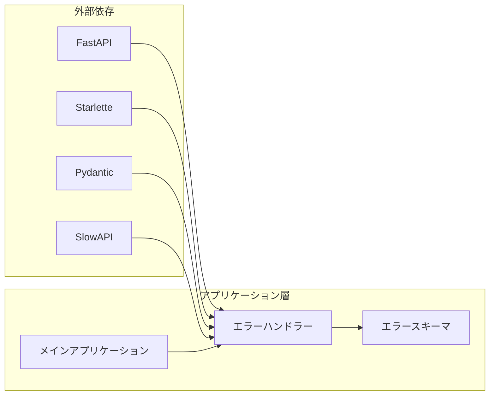
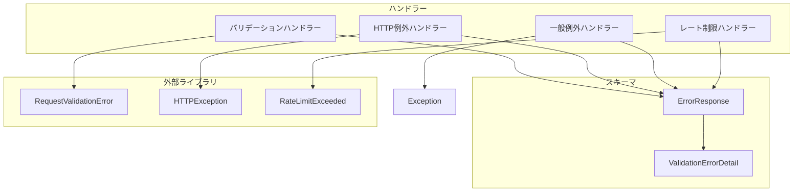

# バリデーションエラーハンドリング

<cite>
**この文書で参照されるファイル**
- [error_handler.py](file://backend/app/middleware/error_handler.py)
- [error.py](file://backend/app/schemas/error.py)
- [main.py](file://backend/app/main.py)
- [todos.py](file://backend/app/api/api_v1/endpoints/todos.py)
- [todo.py](file://backend/app/schemas/todo.py)
- [limiter.py](file://backend/app/core/limiter.py)
- [deps.py](file://backend/app/api/deps.py)
- [test_errors.py](file://backend/tests/test_errors.py)
- [conftest.py](file://backend/tests/conftest.py)
</cite>

## 目次
1. [導入](#導入)
2. [プロジェクト構造](#プロジェクト構造)
3. [コアコンポーネント](#コアコンポーネント)
4. [アーキテクチャ概要](#アーキテクチャ概要)
5. [詳細コンポーネント分析](#詳細コンポーネント分析)
6. [依存関係分析](#依存関係分析)
7. [パフォーマンス考慮事項](#パフォーマンス考慮事項)
8. [トラブルシューティングガイド](#トラブルシューティングガイド)
9. [結論](#結論)

## 導入

この文書は、TodoアプリケーションにおけるPydanticバリデーションエラーの処理方法とエラーレスポンスの生成について詳しく説明します。システムはFastAPIフレームワークを使用し、統一されたエラーハンドリングメカニズムを備えています。特に以下の点に焦点を当てます：

- Pydanticバリデーションエラーの捕捉方法
- カスタムエラーハンドラーの実装
- エラーレスポンスのフォーマット
- HTTPステータスコードの適切な設定
- エラーメッセージの国際化対応
- セキュリティ上考慮すべきエラー情報の漏洩防止
- 開発者向け詳細情報とユーザー向けシンプルメッセージの切り替え方法

## プロジェクト構造

Todoアプリケーションはモダンなマイクロサービスアーキテクチャを採用しており、エラーハンドリングはミドルウェア層に集中配置されています。



**図の出典**
- [main.py:117-128](file://backend/app/main.py#L117-L128)
- [error_handler.py:15-149](file://backend/app/middleware/error_handler.py#L15-L149)

**セクションの出典**
- [main.py:1-168](file://backend/app/main.py#L1-L168)
- [error_handler.py:1-149](file://backend/app/middleware/error_handler.py#L1-L149)

## コアコンポーネント

### エラーレスポンススキーマ

システムは統一されたエラーレスポンススキーマを定義し、すべてのエラーが同じ構造で返されるように設計されています。



**図の出典**
- [error.py:5-23](file://backend/app/schemas/error.py#L5-L23)

### バリデーションエラーハンドラー

バリデーションエラーハンドラーは、Pydanticバリデーションエラーを捕捉し、ユーザーにわかりやすいエラーメッセージを提供します。

**セクションの出典**
- [error_handler.py:15-49](file://backend/app/middleware/error_handler.py#L15-L49)
- [error.py:5-23](file://backend/app/schemas/error.py#L5-L23)

## アーキテクチャ概要

システム全体のエラーハンドリングアーキテクチャは、FastAPIの例外ハンドリング機構を活用しながら、独自のエラーレスポンススキーマを提供するよう設計されています。



**図の出典**
- [error_handler.py:15-49](file://backend/app/middleware/error_handler.py#L15-L49)
- [main.py:67-71](file://backend/app/main.py#L67-L71)

### HTTP例外ハンドラー

HTTP例外（4xx系）は、統一されたエラーレスポンススキーマを使用して処理されます。



**図の出典**
- [error_handler.py:52-149](file://backend/app/middleware/error_handler.py#L52-L149)

**セクションの出典**
- [error_handler.py:52-149](file://backend/app/middleware/error_handler.py#L52-L149)
- [main.py:67-71](file://backend/app/main.py#L67-L71)

## 詳細コンポーネント分析

### バリデーションエラーハンドラーの実装

バリデーションエラーハンドラーは、PydanticのRequestValidationErrorを捕捉し、詳細なエラー情報を抽出してユーザーに適した形式で返します。

#### エラーレスポンスの生成プロセス

```mermaid
flowchart TD
ValidationError[RequestValidationError受信] --> ExtractErrors[エラー詳細を抽出]
ExtractErrors --> CreateDetails[ValidationErrorDetailオブジェクト作成]
CreateDetails --> BuildErrorResponse[ErrorResponseオブジェクト構築]
BuildErrorResponse --> SetStatusCode[HTTPステータスコード設定(422)]
SetStatusCode --> LogWarning[警告レベルでログ出力]
LogWarning --> ReturnResponse[JSONレスポンス返却]
subgraph "エラーフィールドの処理"
FieldExtract[フィールド名抽出] --> JoinField["ドット区切り文字列に変換"]
ValueExtract[入力値抽出] --> AddValue[エラー詳細に追加]
end
CreateDetails --> FieldExtract
CreateDetails --> ValueExtract
```

**図の出典**
- [error_handler.py:15-49](file://backend/app/middleware/error_handler.py#L15-L49)

#### エラーメッセージの国際化対応

エラーメッセージは日本語のみで提供され、セキュリティ上重要な情報を漏洩しないよう設計されています。

**セクションの出典**
- [error_handler.py:107-122](file://backend/app/middleware/error_handler.py#L107-L122)

### エラーレスポンススキーマ

エラーレスポンススキーマは、以下の要素を含みます：

- `status_code`: HTTPステータスコード
- `detail`: 技術的なエラー詳細
- `message`: ユーザー向けの簡潔なエラーメッセージ
- `error_code`: 固定エラーコード
- `details`: 詳細なエラー情報（バリデーションエラーの場合）

**セクションの出典**
- [error.py:5-23](file://backend/app/schemas/error.py#L5-L23)

### 依存関係の解析



**図の出典**
- [main.py:16-26](file://backend/app/main.py#L16-L26)
- [error_handler.py:1-12](file://backend/app/middleware/error_handler.py#L1-L12)

**セクションの出典**
- [main.py:16-26](file://backend/app/main.py#L16-L26)
- [error_handler.py:1-12](file://backend/app/middleware/error_handler.py#L1-L12)

## 依存関係分析

### エラーハンドリングの依存関係

エラーハンドリングシステムは、以下の依存関係を維持しています：



**図の出典**
- [error_handler.py:15-149](file://backend/app/middleware/error_handler.py#L15-L149)
- [error.py:5-23](file://backend/app/schemas/error.py#L5-L23)

### APIエンドポイントとの統合

APIエンドポイントは、バリデーションエラーを自動的にエラーハンドラーに渡します。

**セクションの出典**
- [todos.py:59-67](file://backend/app/api/api_v1/endpoints/todos.py#L59-L67)
- [todo.py:20-21](file://backend/app/schemas/todo.py#L20-L21)

## パフォーマンス考慮事項

### レート制限の実装

システムはSlowAPIを使用してレート制限を実装し、過剰なリクエストを防いでいます。

**セクションの出典**
- [limiter.py:1-7](file://backend/app/core/limiter.py#L1-L7)
- [error_handler.py:125-149](file://backend/app/middleware/error_handler.py#L125-L149)

### ロギングの最適化

エラーハンドラーは、エラー発生時に必要な情報をログに出力しつつ、パフォーマンスへの影響を最小限に抑えています。

## トラブルシューティングガイド

### 一般的なエラー処理手順

1. **バリデーションエラーの確認**: `/api/v1/todos/`エンドポイントに空のJSONを送信することで、バリデーションエラーを再現できます。

2. **404エラーの確認**: 存在しないエンドポイントにアクセスすることで、404エラーを確認できます。

3. **認証エラーの確認**: 有効な認証トークンなしでAPIにアクセスすることで、401エラーを確認できます。

**セクションの出典**
- [test_errors.py:22-38](file://backend/tests/test_errors.py#L22-L38)
- [conftest.py:4-8](file://backend/tests/conftest.py#L4-L8)

### エラーメッセージのカスタマイズ

エラーメッセージは、`get_error_message`関数を通じてカスタマイズ可能です。これにより、異なる言語やメッセージの要件に対応できます。

**セクションの出典**
- [error_handler.py:107-122](file://backend/app/middleware/error_handler.py#L107-L122)

### セキュリティ上の考慮事項

1. **情報漏洩の防止**: 例外ハンドラーは、技術的な詳細情報を隠蔽し、ユーザーには簡潔なメッセージのみを表示します。

2. **ログのセキュリティ**: ログには機微情報が含まれないように注意し、必要最小限の情報のみを記録します。

3. **認証エラーの処理**: 認証失敗時は、具体的なエラー詳細を返さず、一般的な認証エラーとして処理します。

**セクションの出典**
- [deps.py:13-36](file://backend/app/api/deps.py#L13-L36)
- [error_handler.py:79-104](file://backend/app/middleware/error_handler.py#L79-L104)

## 結論

Todoアプリケーションのバリデーションエラーハンドリングシステムは、以下の特徴を持っています：

- **統一されたインターフェース**: 全てのエラーが同じスキーマで返されるため、クライアント側での処理が簡単になります。
- **ユーザー中心の設計**: 日本語のエラーメッセージと、技術的な詳細情報の分離により、ユーザーにとってわかりやすいエクスペリエンスを提供します。
- **セキュリティ対策**: 機微情報を含まないエラーメッセージと、適切なロギングによってセキュリティリスクを軽減します。
- **拡張性**: 新しいエラータイプに対応するためのフレームワークが整っているため、将来的な機能追加にも柔軟に対応できます。

このシステムは、FastAPIの強力なバリデーション機能と、独自のエラーハンドリングメカニズムを組み合わせることで、堅牢でユーザーフレンドリーなエラーハンドリングを実現しています。