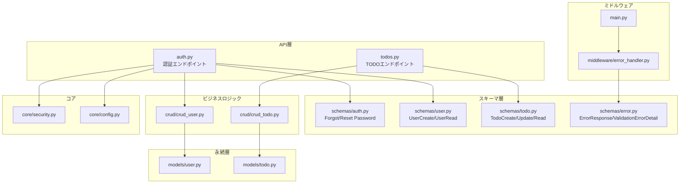
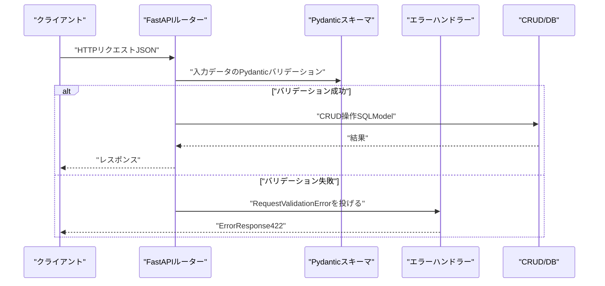
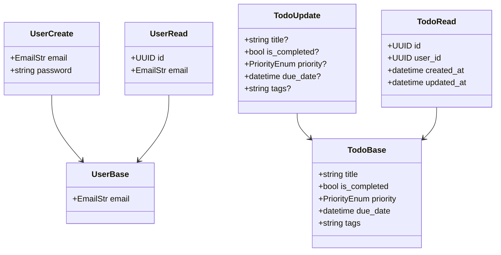
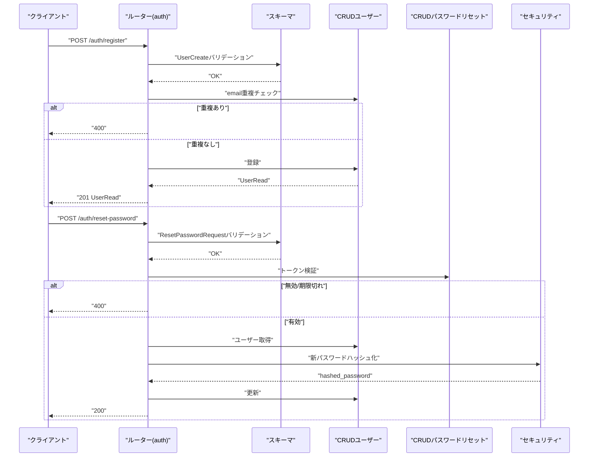
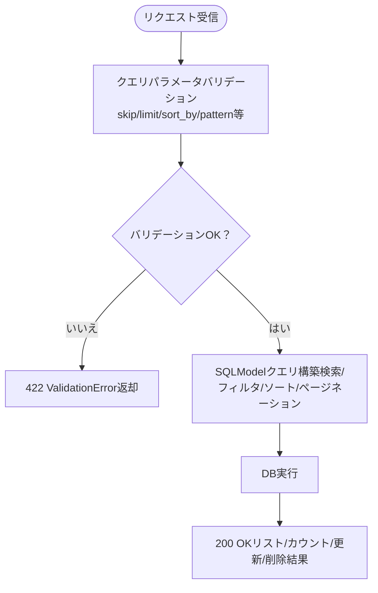
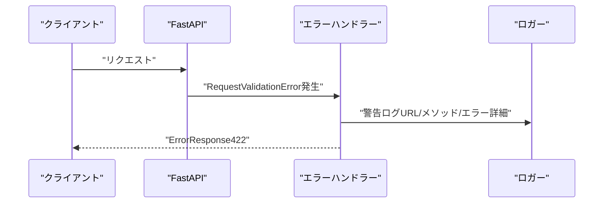
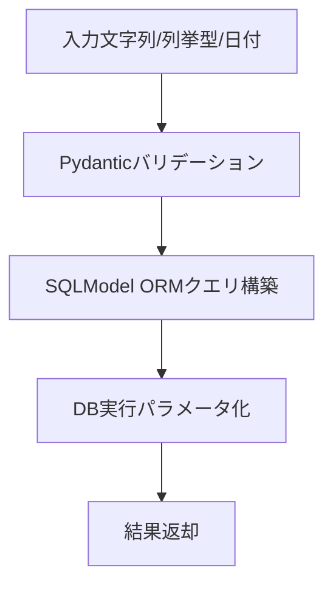
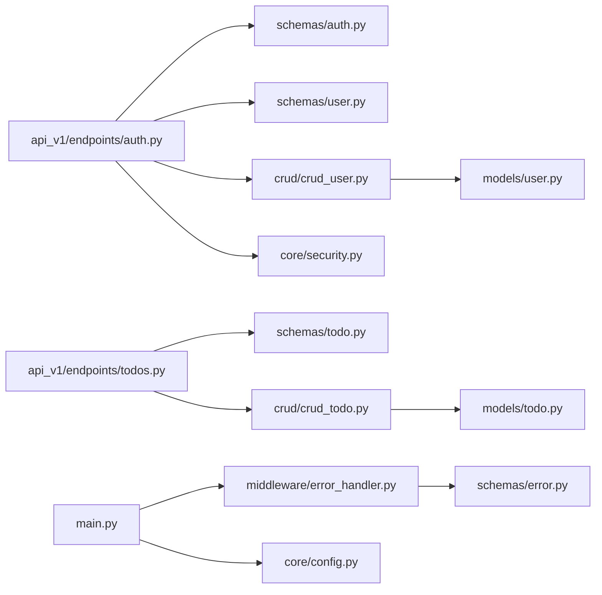

# 入力バリデーション

<cite>
**本文で参照するファイル**   
- [backend/app/schemas/auth.py](file://backend/app/schemas/auth.py)
- [backend/app/schemas/user.py](file://backend/app/schemas/user.py)
- [backend/app/schemas/todo.py](file://backend/app/schemas/todo.py)
- [backend/app/schemas/error.py](file://backend/app/schemas/error.py)
- [backend/app/api/api_v1/endpoints/auth.py](file://backend/app/api/api_v1/endpoints/auth.py)
- [backend/app/api/api_v1/endpoints/todos.py](file://backend/app/api/api_v1/endpoints/todos.py)
- [backend/app/middleware/error_handler.py](file://backend/app/middleware/error_handler.py)
- [backend/app/core/security.py](file://backend/app/core/security.py)
- [backend/app/core/config.py](file://backend/app/core/config.py)
- [backend/app/models/user.py](file://backend/app/models/user.py)
- [backend/app/models/todo.py](file://backend/app/models/todo.py)
- [backend/app/crud/crud_user.py](file://backend/app/crud/crud_user.py)
- [backend/app/crud/crud_todo.py](file://backend/app/crud/crud_todo.py)
- [backend/app/main.py](file://backend/app/main.py)
</cite>

## 目次
1. [はじめに](#はじめに)
2. [プロジェクト構造](#プロジェクト構造)
3. [コアコンポーネント](#コアコンポーネント)
4. [アーキテクチャ概要](#アーキテクチャ概要)
5. [詳細コンポーネント解析](#詳細コンポーネント解析)
6. [依存関係解析](#依存関係解析)
7. [パフォーマンス考慮事項](#パフォーマンス考慮事項)
8. [トラブルシューティングガイド](#トラブルシューティングガイド)
9. [結論](#結論)

## はじめに
本ドキュメントは、Todo APIにおける「入力バリデーションの仕組みとセキュリティ対策」について説明します。主に以下の点に焦点を当てます：
- Pydanticスキーマによるデータ検証の実装方法
- SQLインジェクション防止策
- XSS対策
- CSRF対策
- バリデーションエラーの処理方法
- 不正な入力の拒否ロジック
- セキュリティ上重要なフィールドの検証ルール

本プロジェクトでは、FastAPI + SQLModel + Pydanticスキーマを用いた型安全な入力検証、ミドルウェアによるエラーハンドリング、JWTによる認証、およびリクエスト制限（Rate Limit）を実装しています。

## プロジェクト構造
バックエンドは以下のレイヤーで構成されています：
- APIエンドポイント：FastAPIルーターを通じてリクエストを受け取り、認可・認証を検証した後、CRUD層へ処理を委譲
- Schemas：Pydanticベースの入力・出力スキーマ定義（バリデーションルール）
- Models：SQLModelモデル（DBスキーマ）
- CRUD：SQLAlchemy/SQLModelによるデータアクセス
- Core：セキュリティ（JWT、パスワードハッシュ）、設定（環境変数）
- Middleware：エラーハンドリング、CORS、ロギング
- Main：アプリケーション起動、OpenAPIカスタマイズ、ルーター登録

**図の出典**
- [backend/app/api/api_v1/endpoints/auth.py:1-117](file://backend/app/api/api_v1/endpoints/auth.py#L1-L117)
- [backend/app/api/api_v1/endpoints/todos.py:1-102](file://backend/app/api/api_v1/endpoints/todos.py#L1-L102)
- [backend/app/schemas/auth.py:1-11](file://backend/app/schemas/auth.py#L1-L11)
- [backend/app/schemas/user.py:1-13](file://backend/app/schemas/user.py#L1-L13)
- [backend/app/schemas/todo.py:1-41](file://backend/app/schemas/todo.py#L1-L41)
- [backend/app/schemas/error.py:1-23](file://backend/app/schemas/error.py#L1-L23)
- [backend/app/crud/crud_user.py:1-28](file://backend/app/crud/crud_user.py#L1-L28)
- [backend/app/crud/crud_todo.py:1-152](file://backend/app/crud/crud_todo.py#L1-L152)
- [backend/app/models/user.py:1-16](file://backend/app/models/user.py#L1-L16)
- [backend/app/models/todo.py:1-25](file://backend/app/models/todo.py#L1-L25)
- [backend/app/core/security.py:1-35](file://backend/app/core/security.py#L1-L35)
- [backend/app/core/config.py:1-91](file://backend/app/core/config.py#L1-L91)
- [backend/app/middleware/error_handler.py:1-149](file://backend/app/middleware/error_handler.py#L1-L149)
- [backend/app/main.py:1-168](file://backend/app/main.py#L1-L168)

**節の出典**
- [backend/app/main.py:1-168](file://backend/app/main.py#L1-L168)

## コアコンポーネント
- Pydanticスキーマ（バリデーションルール）
  - 認証：ForgotPasswordRequest、ResetPasswordRequest（最小長など）
  - ユーザー：UserBase、UserCreate、UserRead（emailのunique/index/max_length）
  - TODO：TodoBase、TodoCreate、TodoUpdate、TodoRead（title/tags/max_length、priority列挙型、日時フィールド）
  - エラー：ErrorResponse、ValidationErrorDetail（統一エラーレスポンス）

- FastAPIエンドポイント（入力検証の起点）
  - /auth/register：UserCreateを受けて重複emailチェック、登録
  - /auth/token：OAuth2PasswordRequestForm（username/password）を受けて認証
  - /auth/forgot-password：ForgotPasswordRequest（email）
  - /auth/reset-password：ResetPasswordRequest（token、new_password）
  - /todos：TodoCreate/TodoUpdateを受けてCRUD操作

- エラーハンドリング（ミドルウェア）
  - RequestValidationError → ValidationErrorDetailを整形してErrorResponseで返却
  - HTTPException/StarletteHTTPException → ErrorResponseで返却
  - RateLimitExceeded → 429エラーでErrorResponse
  - その他の未捕捉例外 → 500エラーでErrorResponse

- セキュリティ
  - JWT（HS256）：create_access_token/decode_access_token
  - パスワード：argon2によるハッシュ化（verify/get）
  - CORS：設定値に基づく許可オリジン管理
  - Rate Limit：SlowAPIによる各エンドポイントごとのレート制限

**節の出典**
- [backend/app/schemas/auth.py:1-11](file://backend/app/schemas/auth.py#L1-L11)
- [backend/app/schemas/user.py:1-13](file://backend/app/schemas/user.py#L1-L13)
- [backend/app/schemas/todo.py:1-41](file://backend/app/schemas/todo.py#L1-L41)
- [backend/app/schemas/error.py:1-23](file://backend/app/schemas/error.py#L1-L23)
- [backend/app/api/api_v1/endpoints/auth.py:1-117](file://backend/app/api/api_v1/endpoints/auth.py#L1-L117)
- [backend/app/api/api_v1/endpoints/todos.py:1-102](file://backend/app/api/api_v1/endpoints/todos.py#L1-L102)
- [backend/app/middleware/error_handler.py:1-149](file://backend/app/middleware/error_handler.py#L1-L149)
- [backend/app/core/security.py:1-35](file://backend/app/core/security.py#L1-L35)
- [backend/app/core/config.py:1-91](file://backend/app/core/config.py#L1-L91)

## アーキテクチャ概要
以下は、入力検証とエラーハンドリングの全体像です：

**図の出典**
- [backend/app/api/api_v1/endpoints/auth.py:1-117](file://backend/app/api/api_v1/endpoints/auth.py#L1-L117)
- [backend/app/api/api_v1/endpoints/todos.py:1-102](file://backend/app/api/api_v1/endpoints/todos.py#L1-L102)
- [backend/app/middleware/error_handler.py:1-149](file://backend/app/middleware/error_handler.py#L1-L149)

## 詳細コンポーネント解析

### Pydanticスキーマによる入力検証
- 認証系
  - ForgotPasswordRequest：emailはEmailStr（メール形式）
  - ResetPasswordRequest：token（min_length=10）、new_password（min_length=6）
- ユーザー系
  - UserBase：emailはEmailStr、uniqueかつindex、max_length=255
  - UserCreate：email、password
  - UserRead：email、id
- TODO系
  - TodoBase：title（max_length=255）、is_completed（bool）、priority（列挙型）、due_date（datetime）、tags（max_length=500）
  - TodoUpdate：各フィールドをOptionalに（部分更新）
  - TodoRead：id、user_id、created_at、updated_atを追加

**図の出典**
- [backend/app/schemas/user.py:1-13](file://backend/app/schemas/user.py#L1-L13)
- [backend/app/schemas/todo.py:1-41](file://backend/app/schemas/todo.py#L1-L41)

**節の出典**
- [backend/app/schemas/auth.py:1-11](file://backend/app/schemas/auth.py#L1-L11)
- [backend/app/schemas/user.py:1-13](file://backend/app/schemas/user.py#L1-L13)
- [backend/app/schemas/todo.py:1-41](file://backend/app/schemas/todo.py#L1-L41)

### APIエンドポイントでの入力検証フロー
- /auth/register
  - 入力：UserCreate
  - 処理：email重複チェック、存在すれば400、なければ登録
- /auth/token
  - 入力：OAuth2PasswordRequestForm（username/password）
  - 処理：email取得、パスワード検証、認可失敗時は401
- /auth/forgot-password
  - 入力：ForgotPasswordRequest（email）
  - 処理：ユーザーが存在しても200を返す（セキュリティ上漏洩防止）
- /auth/reset-password
  - 入力：ResetPasswordRequest（token、new_password）
  - 処理：トークン検証、ユーザー存在チェック、パスワード更新、使用済みトークンマーク

**図の出典**
- [backend/app/api/api_v1/endpoints/auth.py:1-117](file://backend/app/api/api_v1/endpoints/auth.py#L1-L117)
- [backend/app/schemas/auth.py:1-11](file://backend/app/schemas/auth.py#L1-L11)
- [backend/app/schemas/user.py:1-13](file://backend/app/schemas/user.py#L1-L13)
- [backend/app/crud/crud_user.py:1-28](file://backend/app/crud/crud_user.py#L1-L28)
- [backend/app/core/security.py:1-35](file://backend/app/core/security.py#L1-L35)

**節の出典**
- [backend/app/api/api_v1/endpoints/auth.py:1-117](file://backend/app/api/api_v1/endpoints/auth.py#L1-L117)

### TODOエンドポイントでの入力検証
- GET /todos
  - 入力：skip（ge=0）、limit（ge=1, le=100）、search、is_completed、priority、tags、sort_by（pattern）、sort_order（pattern）
  - 処理：CRUDで検索・フィルタ・ソート・ページネーション
- POST /todos
  - 入力：TodoCreate（title/tags/priority/due_date/is_completed）
- PUT /todos/{id}
  - 入力：TodoUpdate（各フィールドをOptionalに）
- DELETE /todos/{id}
  - 入力：id（UUID）

**図の出典**
- [backend/app/api/api_v1/endpoints/todos.py:1-102](file://backend/app/api/api_v1/endpoints/todos.py#L1-L102)
- [backend/app/schemas/todo.py:1-41](file://backend/app/schemas/todo.py#L1-L41)
- [backend/app/crud/crud_todo.py:1-152](file://backend/app/crud/crud_todo.py#L1-L152)

**節の出典**
- [backend/app/api/api_v1/endpoints/todos.py:1-102](file://backend/app/api/api_v1/endpoints/todos.py#L1-L102)
- [backend/app/crud/crud_todo.py:1-152](file://backend/app/crud/crud_todo.py#L1-L152)

### エラーハンドリング（バリデーションエラーの処理）
- RequestValidationError（422）：各フィールドのエラー詳細（field/message/value）をValidationErrorDetailに整形し、ErrorResponseで返却
- HTTPException/StarletteHTTPException：ステータスコードに応じた日本語メッセージをErrorResponseで返却
- RateLimitExceeded（429）：リクエスト制限超過をErrorResponseで返却
- その他の未捕捉例外：500 Internal Server ErrorをErrorResponseで返却

**図の出典**
- [backend/app/middleware/error_handler.py:1-149](file://backend/app/middleware/error_handler.py#L1-L149)
- [backend/app/schemas/error.py:1-23](file://backend/app/schemas/error.py#L1-L23)

**節の出典**
- [backend/app/middleware/error_handler.py:1-149](file://backend/app/middleware/error_handler.py#L1-L149)
- [backend/app/schemas/error.py:1-23](file://backend/app/schemas/error.py#L1-L23)

### SQLインジェクション防止策
- SQLModel（ORM）によるクエリ構築：SQL文の直接組み立てを避けており、パラメータ化クエリによりSQLインジェクションを防止
- 検索・フィルタ：contains、col、select.from_*などのORMメソッドを使用
- 例：CRUDの検索・フィルタ・ソート・ページネーション処理はすべてORM経由

**図の出典**
- [backend/app/crud/crud_todo.py:1-152](file://backend/app/crud/crud_todo.py#L1-L152)
- [backend/app/models/todo.py:1-25](file://backend/app/models/todo.py#L1-L25)

**節の出典**
- [backend/app/crud/crud_todo.py:1-152](file://backend/app/crud/crud_todo.py#L1-L152)
- [backend/app/models/todo.py:1-25](file://backend/app/models/todo.py#L1-L25)

### XSS対策
- 入力はPydanticスキーマでバリデーション（文字列長、形式）のみ。出力側（HTMLテンプレート）については、テンプレートエンジンやフレームワークの設定が必要ですが、本リポジトリのバックエンドでは明確なHTML出力は見られません。したがって、XSS対策は「入力の型安全なバリデーション」に加えて、出力時の適切なエスケープ処理（テンプレートエンジンやHTML出力時のサニタイズ）が重要です。

[本セクションは概念的な説明であり、特定のファイルを直接分析していないため、節の出典はありません]

### CSRF対策
- 本APIはJWT Bearer認証を前提としており、CSRF対策としてCookieベースのセッションやCSRFトークンは使用されていません。したがって、CSRFは本APIの設計上考慮されていない可能性があります。もしCookieセッションやCSRF対策が必要であれば、追加のセキュリティ対策（SameSite Cookie、CSRFトークン、CORS設定の厳格化など）を導入する必要があります。

[本セクションは概念的な説明であり、特定のファイルを直接分析していないため、節の出典はありません]

### 不正な入力の拒否ロジック
- 重複emailの拒否：/auth/registerでemail重複をチェックし、400を返却
- 認証失敗：/auth/tokenでemailまたはパスワードが一致しない場合、401を返却
- トークン無効：/auth/reset-passwordでトークンの検証に失敗した場合、400を返却
- 存在しないリソース：/todosで指定されたidのTodoが存在しない場合、404を返却
- 422エラー：Pydanticバリデーションエラー（例：文字数不足、形式不正、範囲外など）

**節の出典**
- [backend/app/api/api_v1/endpoints/auth.py:1-117](file://backend/app/api/api_v1/endpoints/auth.py#L1-L117)
- [backend/app/api/api_v1/endpoints/todos.py:1-102](file://backend/app/api/api_v1/endpoints/todos.py#L1-L102)

### セキュリティ上重要なフィールドの検証ルール
- 認証
  - email：EmailStr（メール形式）
  - token：min_length=10（パスワードリセット用）
  - new_password：min_length=6（パスワード強度）
- ユーザー
  - email：unique、index、max_length=255
- TODO
  - title：max_length=255
  - tags：max_length=500
  - priority：列挙型（high/medium/low）
- その他
  - Queryパラメータ：pattern（sort_by、sort_order）、ge/le（skip、limit）

**節の出典**
- [backend/app/schemas/auth.py:1-11](file://backend/app/schemas/auth.py#L1-L11)
- [backend/app/schemas/user.py:1-13](file://backend/app/schemas/user.py#L1-L13)
- [backend/app/schemas/todo.py:1-41](file://backend/app/schemas/todo.py#L1-L41)
- [backend/app/api/api_v1/endpoints/todos.py:1-102](file://backend/app/api/api_v1/endpoints/todos.py#L1-L102)

## 依存関係解析
- APIエンドポイントはスキーマ（Pydantic）に依存し、バリデーション後にCRUD層へ渡す
- CRUD層はSQLModelモデルに依存し、DB操作を行う
- エラーハンドラーはスキーマ（ErrorResponse/ValidationErrorDetail）に依存し、統一エラーレスポンスを返却
- 認証・セキュリティはcore/security.pyに依存し、JWTとパスワードハッシュ化を行う
- 設定（SECRET_KEY、ALGORITHM、CORS、Rate Limit）はcore/config.pyに依存

**図の出典**
- [backend/app/api/api_v1/endpoints/auth.py:1-117](file://backend/app/api/api_v1/endpoints/auth.py#L1-L117)
- [backend/app/api/api_v1/endpoints/todos.py:1-102](file://backend/app/api/api_v1/endpoints/todos.py#L1-L102)
- [backend/app/schemas/auth.py:1-11](file://backend/app/schemas/auth.py#L1-L11)
- [backend/app/schemas/user.py:1-13](file://backend/app/schemas/user.py#L1-L13)
- [backend/app/schemas/todo.py:1-41](file://backend/app/schemas/todo.py#L1-L41)
- [backend/app/schemas/error.py:1-23](file://backend/app/schemas/error.py#L1-L23)
- [backend/app/crud/crud_user.py:1-28](file://backend/app/crud/crud_user.py#L1-L28)
- [backend/app/crud/crud_todo.py:1-152](file://backend/app/crud/crud_todo.py#L1-L152)
- [backend/app/models/user.py:1-16](file://backend/app/models/user.py#L1-L16)
- [backend/app/models/todo.py:1-25](file://backend/app/models/todo.py#L1-L25)
- [backend/app/middleware/error_handler.py:1-149](file://backend/app/middleware/error_handler.py#L1-L149)
- [backend/app/core/security.py:1-35](file://backend/app/core/security.py#L1-L35)
- [backend/app/core/config.py:1-91](file://backend/app/core/config.py#L1-L91)
- [backend/app/main.py:1-168](file://backend/app/main.py#L1-L168)

**節の出典**
- [backend/app/main.py:1-168](file://backend/app/main.py#L1-L168)

## パフォーマンス考慮事項
- ORMクエリの効率化：TODOモデルには複数のインデックス（created_at、is_completed、priority、due_date）が設定されており、検索・フィルタ・ソートのパフォーマンス向上に寄与
- ページネーション：limitの上限（100）を設け、クエリの過剰な負荷を防ぐ
- 重複emailチェック：ユニークインデックスを活かしたO(1)近い検索により、登録時の重複チェックを高速化

**節の出典**
- [backend/app/models/todo.py:1-25](file://backend/app/models/todo.py#L1-L25)
- [backend/app/api/api_v1/endpoints/todos.py:1-102](file://backend/app/api/api_v1/endpoints/todos.py#L1-L102)
- [backend/app/crud/crud_user.py:1-28](file://backend/app/crud/crud_user.py#L1-L28)

## トラブルシューティングガイド
- 422 Validation Error
  - 症状：リクエストデータが不正
  - 対処：ErrorResponse.details内のフィールド名・メッセージを確認し、該当するスキーマのバリデーションルールを見直す
- 400 Bad Request
  - 症状：パスワードリセットトークンが無効または期限切れ
  - 対処：再度パスワードリセットを実施し、有効期限内にリセットを行う
- 401 Unauthorized
  - 症状：認証に失敗
  - 対処：正しいemail/passwordを確認し、再度ログイン
- 404 Not Found
  - 症状：指定されたTODOが存在しない
  - 対処：idが正しいか確認し、再度リクエスト
- 429 Too Many Requests
  - 症状：リクエスト制限超過
  - 対処：設定された制限時間を待ってから再度リクエスト

**節の出典**
- [backend/app/middleware/error_handler.py:1-149](file://backend/app/middleware/error_handler.py#L1-L149)
- [backend/app/api/api_v1/endpoints/auth.py:1-117](file://backend/app/api/api_v1/endpoints/auth.py#L1-L117)
- [backend/app/api/api_v1/endpoints/todos.py:1-102](file://backend/app/api/api_v1/endpoints/todos.py#L1-L102)

## 結論
本APIは、Pydanticスキーマによる型安全な入力検証、FastAPIの統合エラーハンドリング、JWTによる認証、SQLModelによるSQLインジェクション防止、およびリクエスト制限を組み合わせることで、堅牢な入力バリデーションとセキュリティを実現しています。XSS・CSRFについては、本設計では考慮されていないため、必要に応じて追加のセキュリティ対策を導入することが推奨されます。