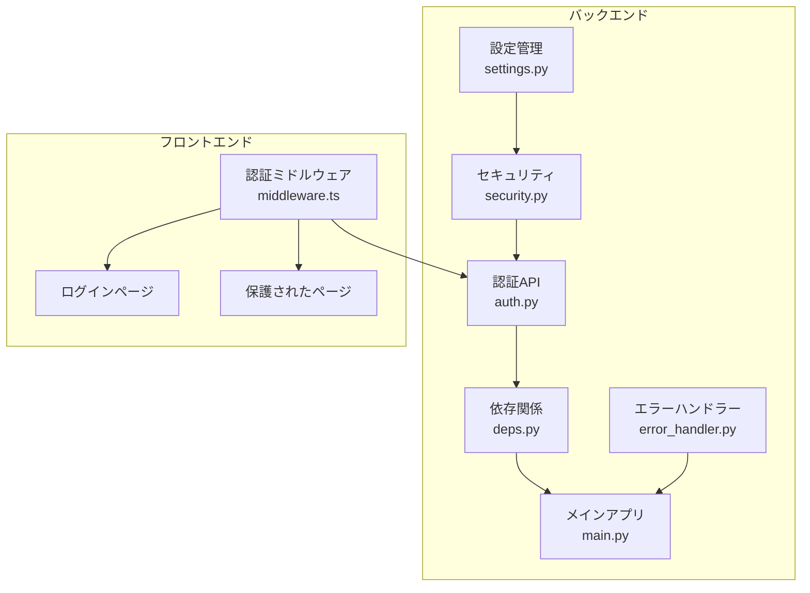
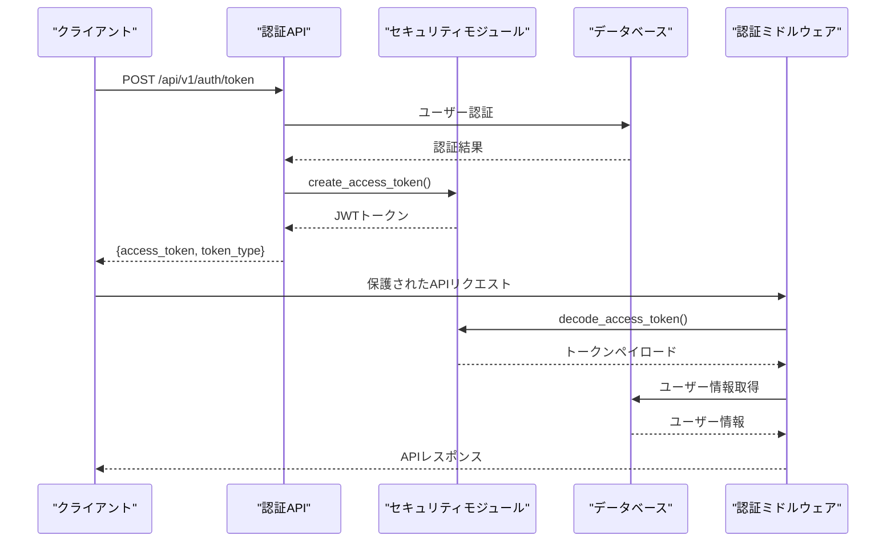
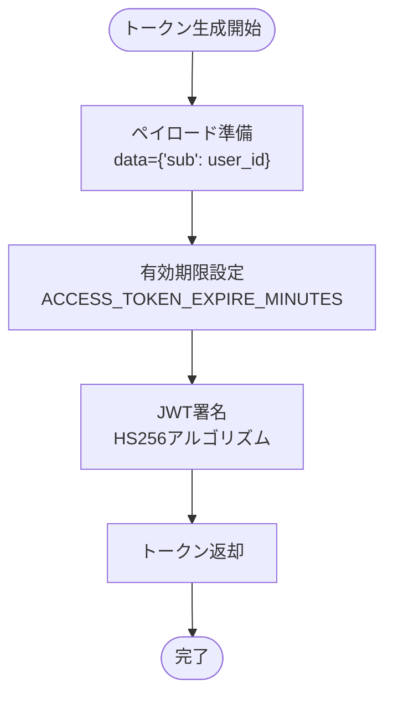
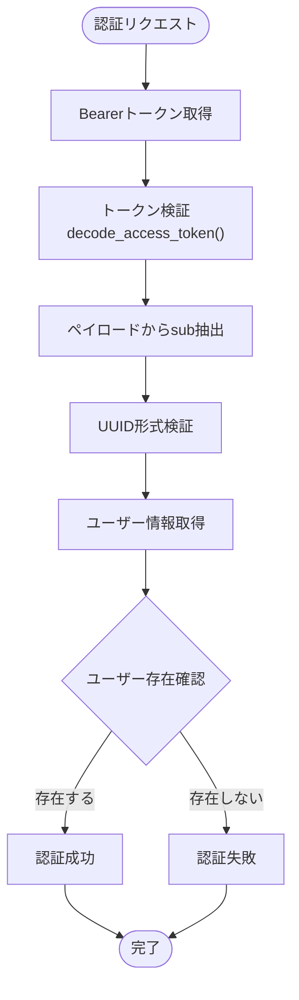
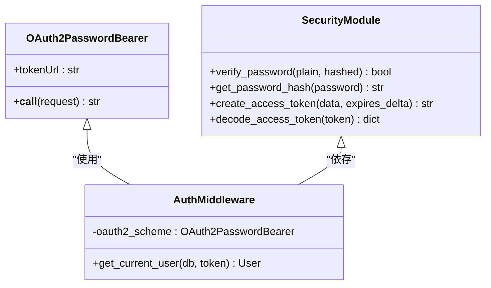
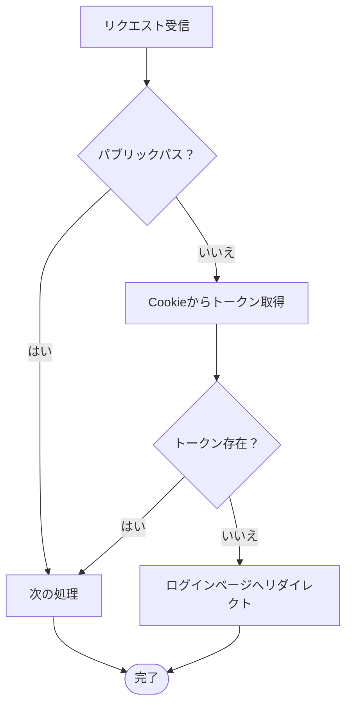
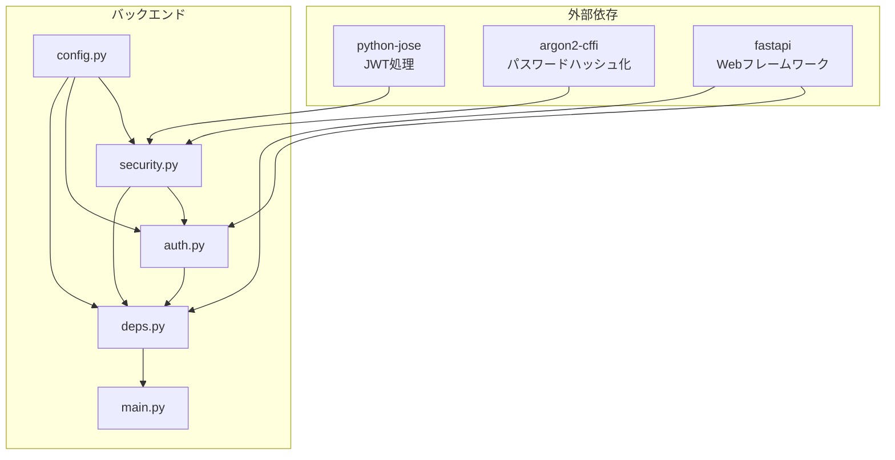

# JWT認証

<cite>
**この文書で参照されているファイル**
- [backend/app/core/security.py](file://backend/app/core/security.py)
- [backend/app/schemas/token.py](file://backend/app/schemas/token.py)
- [backend/app/api/api_v1/endpoints/auth.py](file://backend/app/api/api_v1/endpoints/auth.py)
- [backend/app/api/deps.py](file://backend/app/api/deps.py)
- [backend/app/core/config.py](file://backend/app/core/config.py)
- [backend/app/main.py](file://backend/app/main.py)
- [backend/app/schemas/auth.py](file://backend/app/schemas/auth.py)
- [backend/app/middleware/error_handler.py](file://backend/app/middleware/error_handler.py)
- [backend/app/crud/crud_user.py](file://backend/app/crud/crud_user.py)
- [frontend/src/middleware.ts](file://frontend/src/middleware.ts)
- [backend/tests/test_auth.py](file://backend/tests/test_auth.py)
- [backend/pyproject.toml](file://backend/pyproject.toml)
</cite>

## 目次
1. [はじめに](#はじめに)
2. [プロジェクト構造](#プロジェクト構造)
3. [コアコンポーネント](#コアコンポーネント)
4. [アーキテクチャ概観](#アーキテクチャ概観)
5. [詳細コンポーネント分析](#詳細コンポーネント分析)
6. [依存関係分析](#依存関係分析)
7. [パフォーマンス考慮事項](#パフォーマンス考慮事項)
8. [トラブルシューティングガイド](#トラブルシューティングガイド)
9. [結論](#結論)

## はじめに
本ドキュメントは、TodoアプリケーションにおけるJWT（JSON Web Token）認証の仕組みと実装について詳細に説明します。JWTトークンの生成プロセス、署名アルゴリズム（HS256）、トークンの有効期限設定、クレーム（claims）の構造について解説します。また、トークンの検証プロセス、期限切れトークンの処理、認証ミドルウェアでのトークン検証方法を具体的に示します。セキュリティ上の考慮点として、トークンの保存場所（Cookie vs localStorage）、CSRF攻撃への対策、トークンの再生成戦略についても述べます。

## プロジェクト構造
JWT認証はバックエンド（FastAPI）とフロントエンド（Next.js）の両方にわたる包括的な仕組みです。バックエンドはJWTトークンの生成・検証、認証ミドルウェア、エラーハンドリングを担当し、フロントエンドはクライアント側の認証状態管理と保護されたルートへのアクセス制御を行います。

**図の出典**
- [backend/app/core/config.py:1-91](file://backend/app/core/config.py#L1-L91)
- [backend/app/core/security.py:1-35](file://backend/app/core/security.py#L1-L35)
- [backend/app/api/api_v1/endpoints/auth.py:1-117](file://backend/app/api/api_v1/endpoints/auth.py#L1-L117)
- [backend/app/api/deps.py:1-37](file://backend/app/api/deps.py#L1-L37)
- [frontend/src/middleware.ts:1-35](file://frontend/src/middleware.ts#L1-L35)

**セクションの出典**
- [backend/app/core/config.py:1-91](file://backend/app/core/config.py#L1-L91)
- [backend/app/core/security.py:1-35](file://backend/app/core/security.py#L1-L35)
- [backend/app/api/api_v1/endpoints/auth.py:1-117](file://backend/app/api/api_v1/endpoints/auth.py#L1-L117)
- [backend/app/api/deps.py:1-37](file://backend/app/api/deps.py#L1-L37)
- [frontend/src/middleware.ts:1-35](file://frontend/src/middleware.ts#L1-L35)

## コアコンポーネント
JWT認証システムの核心となるコンポーネントは以下の通りです：

### 設定管理（Settings）
- SECRET_KEY: JWTトークン署名に使用される秘密鍵
- ALGORITHM: HS256（HMAC SHA256）を使用
- ACCESS_TOKEN_EXPIRE_MINUTES: トークン有効期限（分単位）
- BACKEND_CORS_ORIGINS: CORS設定（開発環境用）

### セキュリティモジュール（Security）
- create_access_token(): JWTトークン生成メソッド
- decode_access_token(): トークン検証メソッド
- verify_password()/get_password_hash(): パスワードハッシュ化

### 認証APIエンドポイント（Auth）
- POST /api/v1/auth/register: ユーザー登録
- POST /api/v1/auth/token: ログインアクセストークン取得
- POST /api/v1/auth/forgot-password: パスワードリセットメール送信
- POST /api/v1/auth/reset-password: パスワードリセット

### 認証ミドルウェア（Deps）
- OAuth2PasswordBearer: Bearerトークン認証スキーム
- get_current_user(): トークンから現在のユーザーを取得

**セクションの出典**
- [backend/app/core/config.py:50-54](file://backend/app/core/config.py#L50-L54)
- [backend/app/core/security.py:16-35](file://backend/app/core/security.py#L16-L35)
- [backend/app/api/api_v1/endpoints/auth.py:36-54](file://backend/app/api/api_v1/endpoints/auth.py#L36-L54)
- [backend/app/api/deps.py:11-37](file://backend/app/api/deps.py#L11-L37)

## アーキテクチャ概観
JWT認証の全体像は以下のようになります。ユーザー認証フローはバックエンドのFastAPIアプリケーションによって管理され、フロントエンドはクッキーまたはlocalStorageにトークンを保存して認証状態を維持します。

**図の出典**
- [backend/app/api/api_v1/endpoints/auth.py:36-54](file://backend/app/api/api_v1/endpoints/auth.py#L36-L54)
- [backend/app/core/security.py:16-27](file://backend/app/core/security.py#L16-L27)
- [backend/app/api/deps.py:13-36](file://backend/app/api/deps.py#L13-L36)

## 詳細コンポーネント分析

### JWTトークン生成プロセス
JWTトークン生成は以下の手順で行われます：

1. **ペイロードの準備**: トークンに含めるデータ（ユーザーIDなど）を準備
2. **有効期限の設定**: 現在時刻に有効期限を加算
3. **署名の実行**: SECRET_KEYとALGORITHM（HS256）を使用してトークンを署名
4. **トークンの返却**: 生成されたJWTをクライアントに返す

**図の出典**
- [backend/app/core/security.py:17-27](file://backend/app/core/security.py#L17-L27)
- [backend/app/core/config.py:52-53](file://backend/app/core/config.py#L52-L53)

**セクションの出典**
- [backend/app/core/security.py:16-27](file://backend/app/core/security.py#L16-L27)
- [backend/app/core/config.py:50-54](file://backend/app/core/config.py#L50-L54)

### トークン検証プロセス
トークン検証は以下の手順で行われます：

1. **認証スキームの適用**: OAuth2PasswordBearerを使用してBearerトークンを取得
2. **トークンの検証**: decode_access_token()でトークンを検証
3. **ペイロードの抽出**: sub（ユーザーID）を抽出
4. **ユーザー情報の取得**: データベースからユーザー情報を取得
5. **認可の実施**: ユーザーが存在するかを確認

**図の出典**
- [backend/app/api/deps.py:13-36](file://backend/app/api/deps.py#L13-L36)
- [backend/app/core/security.py:29-34](file://backend/app/core/security.py#L29-L34)

**セクションの出典**
- [backend/app/api/deps.py:13-36](file://backend/app/api/deps.py#L13-L36)
- [backend/app/core/security.py:29-34](file://backend/app/core/security.py#L29-L34)

### 認証ミドルウェアの実装
認証ミドルウェアはFastAPIのDependsメカニズムを使用して実装されており、以下のような特徴を持ちます：

- **OAuth2PasswordBearer**: `/api/v1/auth/token`エンドポイントを使用した認証スキーム
- **自動的なトークン検証**: 各エンドポイントで自動的にトークン検証が実行
- **エラーハンドリング**: 認証失敗時に401エラーを返す

**図の出典**
- [backend/app/api/deps.py:11-11](file://backend/app/api/deps.py#L11-L11)
- [backend/app/core/security.py:10-14](file://backend/app/core/security.py#L10-L14)

**セクションの出典**
- [backend/app/api/deps.py:11-37](file://backend/app/api/deps.py#L11-L37)
- [backend/app/core/security.py:10-14](file://backend/app/core/security.py#L10-L14)

### トークンクレーム（Claims）の構造
JWTトークンには以下のクレームが含まれます：

- **sub (Subject)**: ユーザー識別子（UUID形式）
- **exp (Expiration Time)**: トークンの有効期限
- **iss (Issuer)**: トークン発行者（設定で指定）
- **aud (Audience)**: トークン受信者（設定で指定）

**セクションの出典**
- [backend/app/core/security.py:25](file://backend/app/core/security.py#L25)
- [backend/app/api/api_v1/endpoints/auth.py:51-53](file://backend/app/api/api_v1/endpoints/auth.py#L51-L53)

### 有効期限設定と再生成戦略
- **有効期限**: ACCESS_TOKEN_EXPIRE_MINUTES（デフォルト30分）
- **再生成戦略**: 期限切れのトークンは再発行が必要
- **CSRF対策**: Bearerトークンを使用しており、CSRF攻撃には対応していない

**セクションの出典**
- [backend/app/core/config.py:52-53](file://backend/app/core/config.py#L52-L53)
- [backend/app/core/security.py:20-23](file://backend/app/core/security.py#L20-L23)

### クライアント側の認証状態管理
フロントエンドは以下の方法で認証状態を管理します：

- **Cookie経由**: `request.cookies.get('token')`でトークンを取得
- **Cookie vs localStorage**: Cookieを使用してセキュリティを強化
- **保護されたルート**: 認証が必要なページへのアクセス制御

**図の出典**
- [frontend/src/middleware.ts:7-25](file://frontend/src/middleware.ts#L7-L25)

**セクションの出典**
- [frontend/src/middleware.ts:15-23](file://frontend/src/middleware.ts#L15-L23)

## 依存関係分析
JWT認証システムの依存関係は以下の通りです：

**図の出典**
- [backend/pyproject.toml:7-25](file://backend/pyproject.toml#L7-L25)
- [backend/app/core/security.py:1-5](file://backend/app/core/security.py#L1-L5)
- [backend/app/core/config.py:1-2](file://backend/app/core/config.py#L1-L2)

**セクションの出典**
- [backend/pyproject.toml:7-25](file://backend/pyproject.toml#L7-L25)
- [backend/app/core/security.py:1-5](file://backend/app/core/security.py#L1-L5)
- [backend/app/core/config.py:1-2](file://backend/app/core/config.py#L1-L2)

## パフォーマンス考慮事項
- **トークンサイズ**: JWTはペイロードが小さい方が良い（ユーザーIDのみ）
- **有効期限**: 適切な有効期限を設定することでセキュリティとパフォーマンスのバランスを取る
- **暗号化アルゴリズム**: HS256は高速だが、秘密鍵の管理が重要
- **キャッシュ戦略**: トークン検証結果のキャッシュは適切に行わない（セキュリティリスクあり）

## トラブルシューティングガイド

### 一般的なエラーと対処法

#### 認証エラー（401 Unauthorized）
- **原因**: 無効なトークン、期限切れ、形式不正
- **対処法**: 再ログインし、新しいトークンを取得

#### トークン検証エラー
- **原因**: SECRET_KEYの不一致、ALGORITHMの不一致
- **対処法**: 設定ファイルの確認、再発行

#### CORSエラー
- **原因**: 許可されていないオリジンからのリクエスト
- **対処法**: BACKEND_CORS_ORIGINSの設定確認

**セクションの出典**
- [backend/app/middleware/error_handler.py:15-49](file://backend/app/middleware/error_handler.py#L15-L49)
- [backend/app/middleware/error_handler.py:52-76](file://backend/app/middleware/error_handler.py#L52-L76)

### トークンの保存場所に関するセキュリティ対策

#### Cookie vs localStorageの比較

| 特徴 | Cookie | localStorage |
|------|--------|--------------|
| **セキュリティ** | CSRF対策可能、HttpOnly対応可 | XSS脆弱性あり |
| **CORS対応** | 許可されたオリジンのみ | すべてのオリジン |
| **自動送信** | HTTPリクエストに自動添付 | 手動で設定が必要 |
| **CSRF対策** | SameSite、CSRFトークン対応可 | 対応が難しい |
| **開発環境** | 設定が複雑 | 簡単に利用可能 |

#### CSRF攻撃への対策
- **SameSite Cookie**: CookieにSameSite属性を設定
- **CSRFトークン**: トークンを埋め込む
- **Origin/Referer検証**: リクエスト元の検証
- **Double Submit Cookie**: 2つのCookieを使用

#### トークンの再生成戦略
- **定期的な再発行**: 有効期限の半分を過ぎたら再発行
- **アクティブユーザーの確認**: 一定期間アクセスがない場合の無効化
- **セッション管理**: 複数のデバイスでの同時使用を制限

**セクションの出典**
- [frontend/src/middleware.ts:15-23](file://frontend/src/middleware.ts#L15-L23)
- [backend/app/core/config.py:50-54](file://backend/app/core/config.py#L50-L54)

## 結論
TodoアプリケーションのJWT認証システムは、FastAPIのOAuth2PasswordBearerスキームとpython-joseライブラリを活用して実装されています。HS256アルゴリズムを使用したJWTトークンの生成・検証、適切な有効期限設定、認証ミドルウェアによる自動的なトークン検証が特徴です。フロントエンドではCookie経由でのトークン管理と、保護されたルートへのアクセス制御が実装されています。

セキュリティ面では、CSRF攻撃への対策としてCookieの使用やSameSite属性の設定が推奨され、XSS攻撃への対策としてlocalStorageの使用は避けるべきです。トークンの再生成戦略として、定期的な再発行とアクティブユーザーの確認が重要です。

今後の改善点としては、CSRF対策の強化（SameSite Cookie、CSRFトークン）、セッション管理の強化、トークンの暗号化（RS256など）の導入などが考えられます。