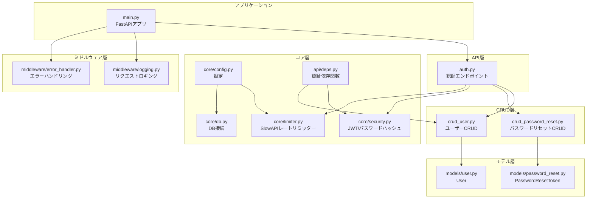
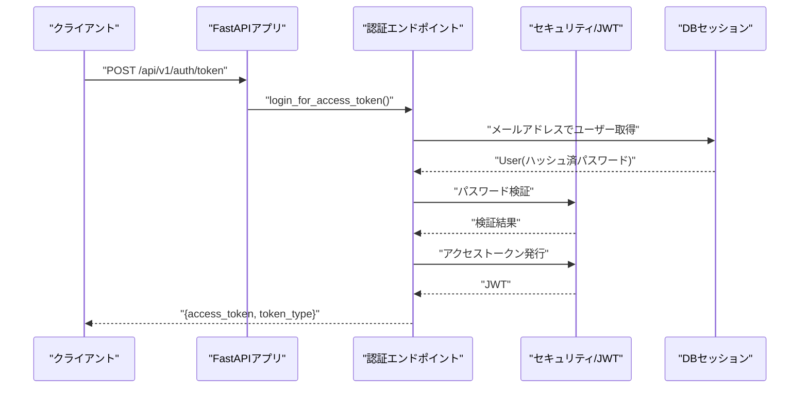
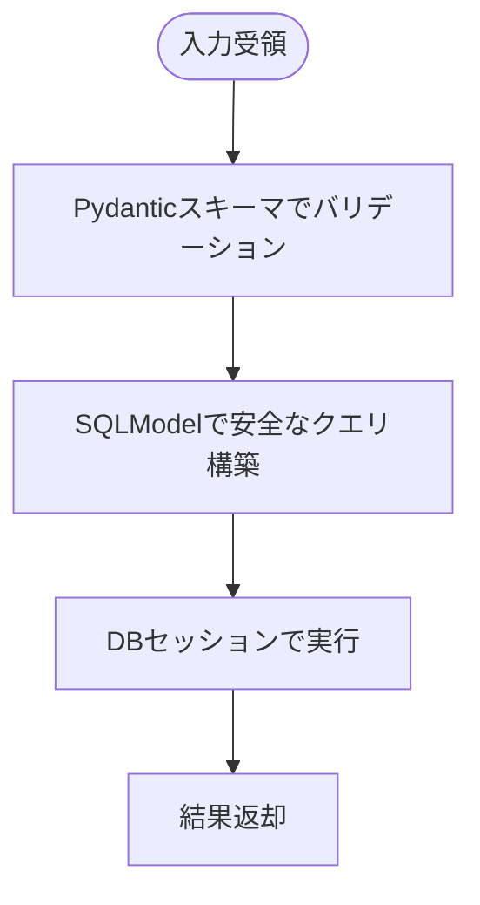
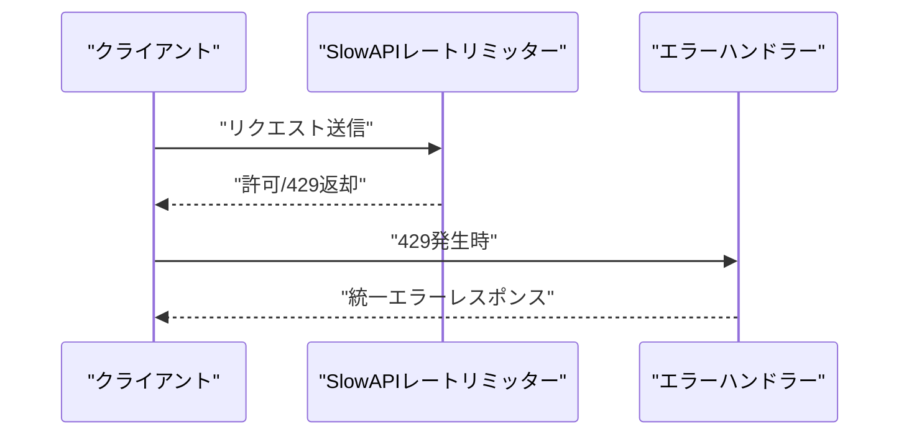
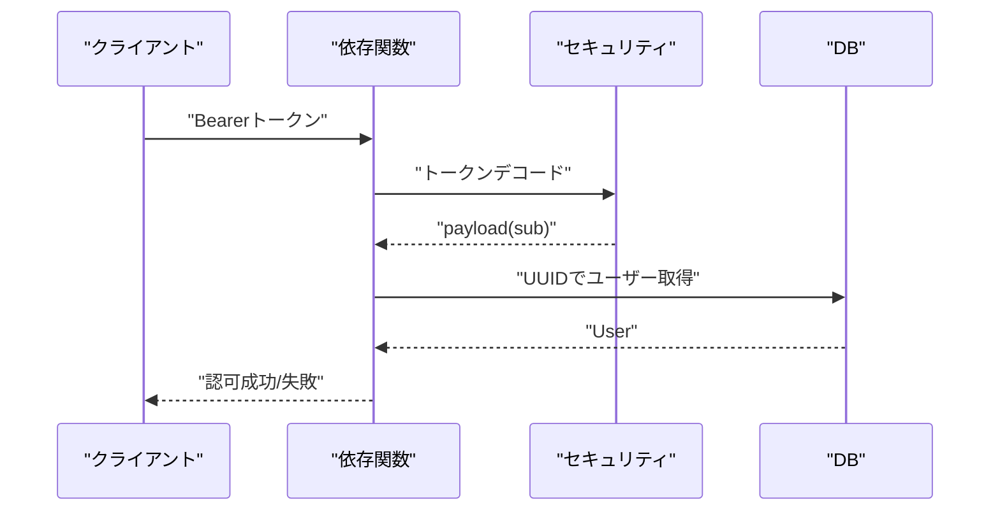
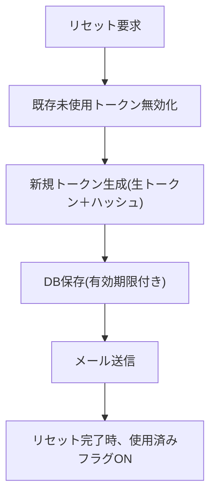
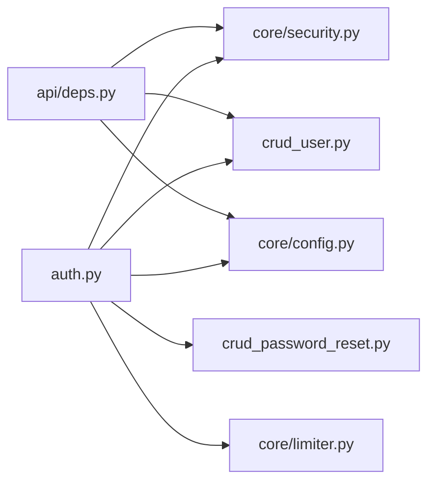
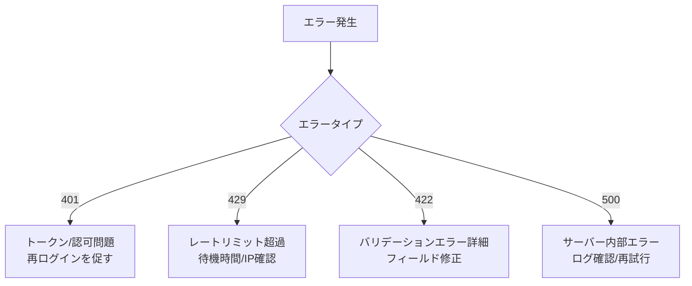

# セキュリティ対策

<cite>
**この文書で参照するファイル**
- [backend/app/main.py](file://backend/app/main.py)
- [backend/app/core/security.py](file://backend/app/core/security.py)
- [backend/app/api/api_v1/endpoints/auth.py](file://backend/app/api/api_v1/endpoints/auth.py)
- [backend/app/middleware/error_handler.py](file://backend/app/middleware/error_handler.py)
- [backend/app/core/limiter.py](file://backend/app/core/limiter.py)
- [backend/app/schemas/auth.py](file://backend/app/schemas/auth.py)
- [backend/app/crud/crud_user.py](file://backend/app/crud/crud_user.py)
- [backend/app/models/user.py](file://backend/app/models/user.py)
- [backend/app/core/config.py](file://backend/app/core/config.py)
- [backend/app/crud/crud_password_reset.py](file://backend/app/crud/crud_password_reset.py)
- [backend/app/models/password_reset.py](file://backend/app/models/password_reset.py)
- [backend/app/api/deps.py](file://backend/app/api/deps.py)
- [backend/app/middleware/logging.py](file://backend/app/middleware/logging.py)
- [backend/app/core/db.py](file://backend/app/core/db.py)
- [backend/pyproject.toml](file://backend/pyproject.toml)
</cite>

## 目次
1. [はじめに](#はじめに)
2. [プロジェクト構造](#プロジェクト構造)
3. [コアコンポーネント](#コアコンポーネント)
4. [アーキテクチャ概観](#アーキテクチャ概観)
5. [詳細コンポーネント分析](#詳細コンポーネント分析)
6. [依存関係分析](#依存関係分析)
7. [パフォーマンスとセキュリティのバランス](#パフォーマンスとセキュリティのバランス)
8. [トラブルシューティングガイド](#トラブルシューティングガイド)
9. [結論](#結論)
10. [付録：セキュリティ監査・脆弱性スキャン・監視](#付録セキュリティ監査脆弱性スキャン監視)

## はじめに
本ドキュメントは、認証システム全体におけるセキュリティリスクとその対策について説明します。具体的には以下の対策をコードレベルで解説します：
- CSRF攻撃への対策
- XSS攻撃への対策
- SQLインジェクションへの対策
- ブルートフォース攻撃への対策（Rate Limiting）
- Rate Limitingの実装
- エラーメッセージのセキュリティ対策
- 入力バリデーションの徹底方法
- セキュリティ監査の実施方法、脆弱性スキャンの導入、セキュリティイベントの監視

本プロジェクトはFastAPI + SQLModel + Argon2による認証・認可・パスワードリセット機能を提供しており、本ドキュメントではそれらの実装をもとにセキュリティ観点からの分析と改善提案を示します。

## プロジェクト構造
バックエンドはFastAPIアプリケーションとして、以下のようなレイヤー構造を持っています：
- API層：認証・ユーザー・TODO関連のエンドポイント
- CRUD層：データアクセスロジック
- モデル層：SQLModelによるORMモデル
- コア層：設定・セキュリティ・DB接続・レートリミッター
- ミドルウェア層：ロギング・エラーハンドリング
- 設定：環境変数ベースの設定管理

**図の出典**
- [backend/app/main.py:1-168](file://backend/app/main.py#L1-L168)
- [backend/app/api/api_v1/endpoints/auth.py:1-117](file://backend/app/api/api_v1/endpoints/auth.py#L1-L117)
- [backend/app/crud/crud_user.py:1-28](file://backend/app/crud/crud_user.py#L1-L28)
- [backend/app/crud/crud_password_reset.py:1-56](file://backend/app/crud/crud_password_reset.py#L1-L56)
- [backend/app/models/user.py:1-16](file://backend/app/models/user.py#L1-L16)
- [backend/app/models/password_reset.py:1-52](file://backend/app/models/password_reset.py#L1-L52)
- [backend/app/core/security.py:1-35](file://backend/app/core/security.py#L1-L35)
- [backend/app/core/limiter.py:1-7](file://backend/app/core/limiter.py#L1-L7)
- [backend/app/core/config.py:1-91](file://backend/app/core/config.py#L1-L91)
- [backend/app/core/db.py:1-17](file://backend/app/core/db.py#L1-L17)
- [backend/app/api/deps.py:1-37](file://backend/app/api/deps.py#L1-L37)
- [backend/app/middleware/logging.py:1-67](file://backend/app/middleware/logging.py#L1-L67)
- [backend/app/middleware/error_handler.py:1-149](file://backend/app/middleware/error_handler.py#L1-L149)

**節の出典**
- [backend/app/main.py:1-168](file://backend/app/main.py#L1-L168)
- [backend/app/core/config.py:1-91](file://backend/app/core/config.py#L1-L91)

## コアコンポーネント
- 認証・トークン管理：JWTベースのアクセストークン発行・検証、パスワードはArgon2でハッシュ化
- パスワードリセット：トークンの生成・ハッシュ化・有効期限付き管理
- レートリミッター：SlowAPIによるIPベースのリクエスト制限
- 入力バリデーション：Pydanticスキーマによる型・範囲・必須項目の検証
- エラーハンドリング：統一エラーレスポンス形式、機微情報漏洩防止
- CORS設定：本番環境でのオリジン制限

**節の出典**
- [backend/app/core/security.py:1-35](file://backend/app/core/security.py#L1-L35)
- [backend/app/models/password_reset.py:1-52](file://backend/app/models/password_reset.py#L1-L52)
- [backend/app/crud/crud_password_reset.py:1-56](file://backend/app/crud/crud_password_reset.py#L1-L56)
- [backend/app/core/limiter.py:1-7](file://backend/app/core/limiter.py#L1-L7)
- [backend/app/schemas/auth.py:1-11](file://backend/app/schemas/auth.py#L1-L11)
- [backend/app/middleware/error_handler.py:1-149](file://backend/app/middleware/error_handler.py#L1-L149)
- [backend/app/main.py:104-115](file://backend/app/main.py#L104-L115)

## アーキテクチャ概観
認証フロー（ログイン）の全体像：

**図の出典**
- [backend/app/api/api_v1/endpoints/auth.py:36-54](file://backend/app/api/api_v1/endpoints/auth.py#L36-L54)
- [backend/app/core/security.py:10-35](file://backend/app/core/security.py#L10-L35)
- [backend/app/crud/crud_user.py:8-11](file://backend/app/crud/crud_user.py#L8-L11)
- [backend/app/api/deps.py:13-36](file://backend/app/api/deps.py#L13-L36)

## 詳細コンポーネント分析

### CSRF攻撃への対策
現状の実装ではCSRF保護は適用されていません。本プロジェクトの認証はJWTベアラー方式であり、CSRFの主な脅威（Cookieベースの認証）とは異なりますが、以下の点に留意すべきです：
- トークンの取り扱いに注意（例：localStorageの使用はXSSリスクを伴うため、HttpOnly Cookieでの配信を推奨）
- トークンの再発行・無効化機構（既に実装済みのパスワードリセットトークンの設計を参考に）
- CORS設定（本番環境ではオリジンを厳密に制限）

対策案（提案）：
- トークンをHttpOnly Cookieに格納し、SameSite属性を適切に設定
- CSRFトークンの導入（必要に応じて）
- トークンの再発行・無効化APIの提供（既存のリセット機構を拡張）

**節の出典**
- [backend/app/main.py:104-115](file://backend/app/main.py#L104-L115)
- [backend/app/models/password_reset.py:1-52](file://backend/app/models/password_reset.py#L1-L52)

### XSS攻撃への対策
- 入力バリデーション：Pydanticスキーマによる型・長さ・必須項目の検証
- 出力制御：FastAPIのJSONレスポンスは自動的にエスケープされる（HTMLエスケープ不要）
- エラーメッセージ：統一エラーレスポンス形式で機微情報を含まない内容に

対策案（提案）：
- HTMLエスケープが必要な場所（例：TODOの内容表示）では、出力時に適切なエスケープを行う
- Content-Security-Policy（CSP）ヘッダーの導入
- X-Content-Type-Options、X-Frame-Optionsなどの基本的なセキュリティヘッダー

**節の出典**
- [backend/app/schemas/auth.py:1-11](file://backend/app/schemas/auth.py#L1-L11)
- [backend/app/middleware/error_handler.py:107-122](file://backend/app/middleware/error_handler.py#L107-L122)

### SQLインジェクションへの対策
- ORM使用：SQLModelによるORM経由でのクエリ実行（SQL文字列の直接組み立てを避ける）
- 入力バリデーション：Pydanticによる型・範囲チェック
- DB接続：非同期接続、セッション管理

**図の出典**
- [backend/app/crud/crud_user.py:8-11](file://backend/app/crud/crud_user.py#L8-L11)
- [backend/app/models/user.py:1-16](file://backend/app/models/user.py#L1-L16)
- [backend/app/core/db.py:1-17](file://backend/app/core/db.py#L1-L17)

**節の出典**
- [backend/app/crud/crud_user.py:1-28](file://backend/app/crud/crud_user.py#L1-L28)
- [backend/app/core/db.py:1-17](file://backend/app/core/db.py#L1-L17)

### ブルートフォース攻撃への対策（Rate Limiting）
- SlowAPIによるIPベースのレートリミッター
- 認証系エンドポイントごとの異なる制限値（ログイン、登録、パスワードリセットなど）
- 統一エラーハンドリング（429 Too Many Requests）

**図の出典**
- [backend/app/core/limiter.py:1-7](file://backend/app/core/limiter.py#L1-L7)
- [backend/app/core/config.py:62-67](file://backend/app/core/config.py#L62-L67)
- [backend/app/middleware/error_handler.py:125-148](file://backend/app/middleware/error_handler.py#L125-L148)
- [backend/app/api/api_v1/endpoints/auth.py:20-20](file://backend/app/api/api_v1/endpoints/auth.py#L20-L20)

**節の出典**
- [backend/app/core/limiter.py:1-7](file://backend/app/core/limiter.py#L1-L7)
- [backend/app/core/config.py:62-67](file://backend/app/core/config.py#L62-L67)
- [backend/app/middleware/error_handler.py:125-148](file://backend/app/middleware/error_handler.py#L125-L148)
- [backend/app/api/api_v1/endpoints/auth.py:20-20](file://backend/app/api/api_v1/endpoints/auth.py#L20-L20)

### Rate Limitingの実装
- 初期化：get_remote_addressによるIPキー、デフォルトリミット
- 各エンドポイント：@limiter.limitで個別設定
- 統一ハンドラー：RateLimitExceededを429で返却

**節の出典**
- [backend/app/core/limiter.py:1-7](file://backend/app/core/limiter.py#L1-L7)
- [backend/app/api/api_v1/endpoints/auth.py:20-20](file://backend/app/api/api_v1/endpoints/auth.py#L20-L20)
- [backend/app/middleware/error_handler.py:125-148](file://backend/app/middleware/error_handler.py#L125-L148)

### エラーメッセージのセキュリティ対策
- すべてのHTTP例外を統一エラーレスポンス形式で返却
- 機微情報（DBエラーメッセージ、内部パス等）を含まない日本語メッセージ
- 予期せぬ例外は500を返し、ロギングのみで詳細を隠蔽

**節の出典**
- [backend/app/middleware/error_handler.py:52-104](file://backend/app/middleware/error_handler.py#L52-L104)
- [backend/app/middleware/error_handler.py:107-122](file://backend/app/middleware/error_handler.py#L107-L122)

### 入力バリデーションの徹底方法
- Pydanticスキーマによる型・必須・範囲チェック（例：メールアドレス、最小文字数）
- FastAPIのRequestValidationErrorを捕らえて統一レスポンス
- DB保存前にもバリデーション（例：UUIDの妥当性）

**節の出典**
- [backend/app/schemas/auth.py:1-11](file://backend/app/schemas/auth.py#L1-L11)
- [backend/app/middleware/error_handler.py:15-49](file://backend/app/middleware/error_handler.py#L15-L49)
- [backend/app/api/deps.py:28-31](file://backend/app/api/deps.py#L28-L31)

### 認証・認可フロー
- トークン発行：メールアドレスとパスワードをもとにJWT発行
- トークン検証：依存関数でsub（ユーザーID）を取得し、DBからユーザーを取得
- 401 Unauthorized：トークン不正やユーザー不存在の場合

**図の出典**
- [backend/app/api/deps.py:13-36](file://backend/app/api/deps.py#L13-L36)
- [backend/app/core/security.py:29-35](file://backend/app/core/security.py#L29-L35)
- [backend/app/crud/crud_user.py:13-16](file://backend/app/crud/crud_user.py#L13-L16)

**節の出典**
- [backend/app/api/deps.py:1-37](file://backend/app/api/deps.py#L1-L37)
- [backend/app/core/security.py:1-35](file://backend/app/core/security.py#L1-L35)

### パスワードリセットのセキュリティ設計
- トークン生成：secretsによる暗号学的擬似乱数
- トークン保存：SHA-256ハッシュ化
- 有効期限付き、未使用トークンの無効化機構あり
- 既存トークンの無効化後に新規発行

**図の出典**
- [backend/app/api/api_v1/endpoints/auth.py:63-78](file://backend/app/api/api_v1/endpoints/auth.py#L63-L78)
- [backend/app/crud/crud_password_reset.py:40-56](file://backend/app/crud/crud_password_reset.py#L40-L56)
- [backend/app/models/password_reset.py:34-52](file://backend/app/models/password_reset.py#L34-L52)

**節の出典**
- [backend/app/api/api_v1/endpoints/auth.py:57-117](file://backend/app/api/api_v1/endpoints/auth.py#L57-L117)
- [backend/app/crud/crud_password_reset.py:1-56](file://backend/app/crud/crud_password_reset.py#L1-L56)
- [backend/app/models/password_reset.py:1-52](file://backend/app/models/password_reset.py#L1-L52)

## 依存関係分析
- 認証エンドポイントは、セキュリティ（JWT/パスワード）、CRUD、設定、レートリミッターに依存
- 依存関数はセキュリティとCRUDを介してDBにアクセス
- 設定はレートリミッターとCORS、SMTP、JWTアルゴリズムなどを管理

**図の出典**
- [backend/app/api/api_v1/endpoints/auth.py:1-117](file://backend/app/api/api_v1/endpoints/auth.py#L1-L117)
- [backend/app/core/security.py:1-35](file://backend/app/core/security.py#L1-L35)
- [backend/app/crud/crud_user.py:1-28](file://backend/app/crud/crud_user.py#L1-L28)
- [backend/app/crud/crud_password_reset.py:1-56](file://backend/app/crud/crud_password_reset.py#L1-L56)
- [backend/app/core/config.py:1-91](file://backend/app/core/config.py#L1-L91)
- [backend/app/core/limiter.py:1-7](file://backend/app/core/limiter.py#L1-L7)
- [backend/app/api/deps.py:1-37](file://backend/app/api/deps.py#L1-L37)

**節の出典**
- [backend/app/api/api_v1/endpoints/auth.py:1-117](file://backend/app/api/api_v1/endpoints/auth.py#L1-L117)
- [backend/app/api/deps.py:1-37](file://backend/app/api/deps.py#L1-L37)

## パフォーマンスとセキュリティのバランス
- トークンの有効期限：短めに設定することで、漏洩リスクを抑制
- レートリミッター：過剰なリクエストを抑えることでDoSを防ぐ
- DB接続：非同期接続によりスループット向上
- CORS：本番環境ではオリジンを絞ることで、クロスオリジン攻撃を軽減

**節の出典**
- [backend/app/core/config.py:52-53](file://backend/app/core/config.py#L52-L53)
- [backend/app/core/config.py:62-67](file://backend/app/core/config.py#L62-L67)
- [backend/app/core/db.py:1-17](file://backend/app/core/db.py#L1-L17)
- [backend/app/main.py:104-115](file://backend/app/main.py#L104-L115)

## トラブルシューティングガイド
- 401 Unauthorized：トークンが無効またはユーザーが存在しない
- 429 Too Many Requests：レートリミッター超過（IPベース）
- 422 Validation Error：リクエストスキーマ違反（フィールド名・値を含む詳細）
- 500 Internal Server Error：予期せぬ例外（ロギングで詳細確認）

**図の出典**
- [backend/app/middleware/error_handler.py:52-104](file://backend/app/middleware/error_handler.py#L52-L104)
- [backend/app/middleware/error_handler.py:125-148](file://backend/app/middleware/error_handler.py#L125-L148)

**節の出典**
- [backend/app/middleware/error_handler.py:1-149](file://backend/app/middleware/error_handler.py#L1-L149)

## 結論
本プロジェクトは、JWTベースの認証、Argon2によるパスワードハッシュ、SlowAPIによるレートリミッター、Pydanticによる入力バリデーション、統一エラーレスポンスといったセキュリティ対策を実装しています。さらに、CORS設定、パスワードリセットのトークン管理、DB接続の非同期化なども採用されており、堅牢な基盤を提供しています。今後の改善として、CSRF保護（HttpOnly Cookie）、CSPヘッダー、XSS対策（出力エスケープ）の導入が推奨されます。

## 付録：セキュリティ監査・脆弱性スキャン・監視
- セキュリティ監査
  - 依存関係の定期レビュー（pyproject.tomlの依存バージョン更新）
  - 設定管理（.env）の機微情報漏洩防止（Git管理外、アクセス制限）
- 脆弱性スキャン
  - pip-audit、bandit、semgrepによる静的解析
  - Dockerイメージスキャン（CIで実施）
- セキュリティイベントの監視
  - FastAPIロギングミドルウェアによるリクエスト/エラー記録
  - 429、401、500の発生頻度を指標としたアラート導入

**節の出典**
- [backend/pyproject.toml:1-51](file://backend/pyproject.toml#L1-L51)
- [backend/app/middleware/logging.py:1-67](file://backend/app/middleware/logging.py#L1-L67)
- [backend/app/main.py:1-168](file://backend/app/main.py#L1-L168)