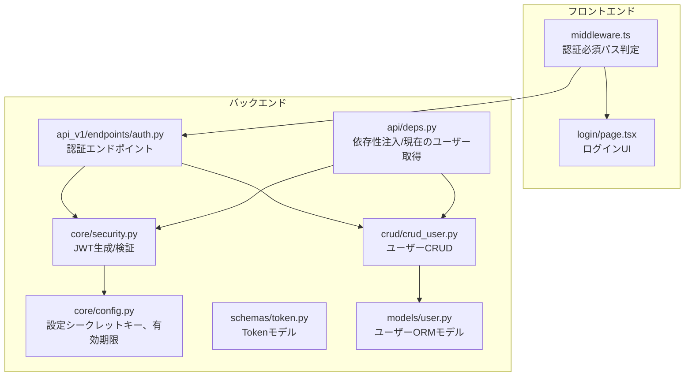
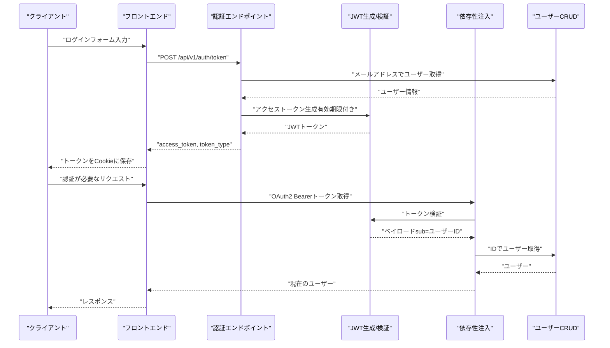
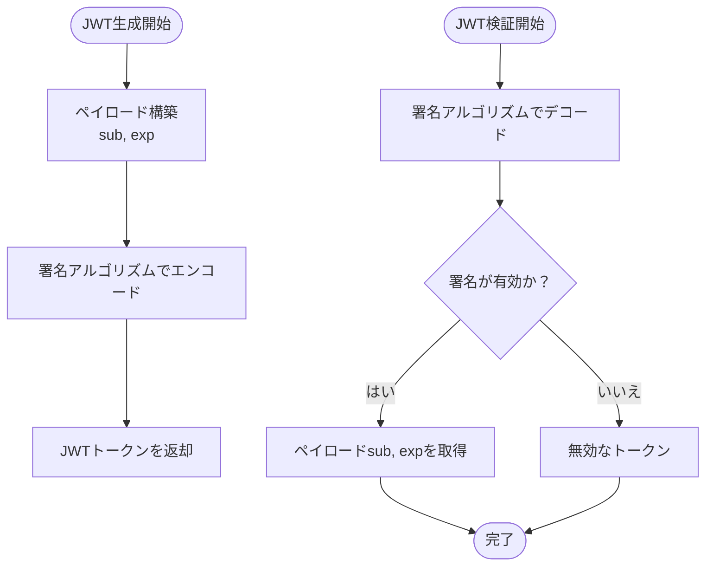
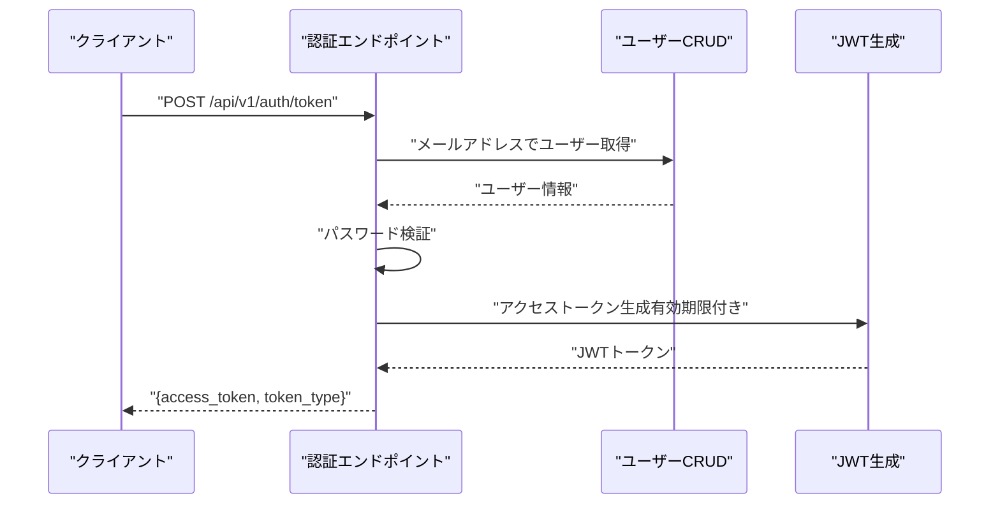
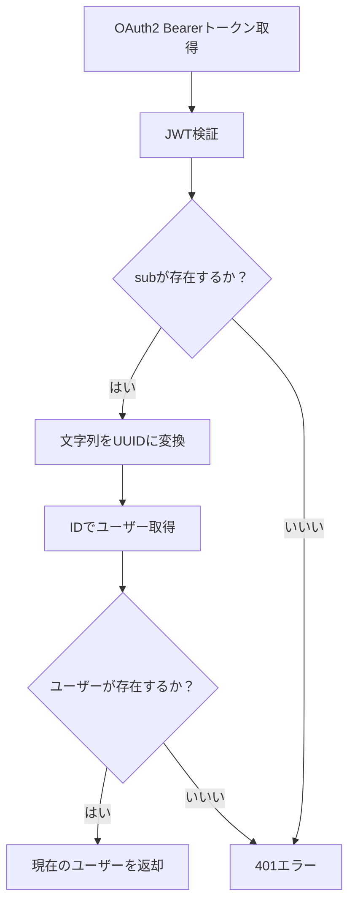
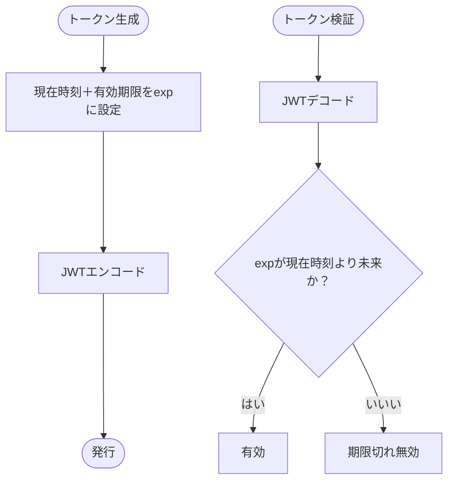
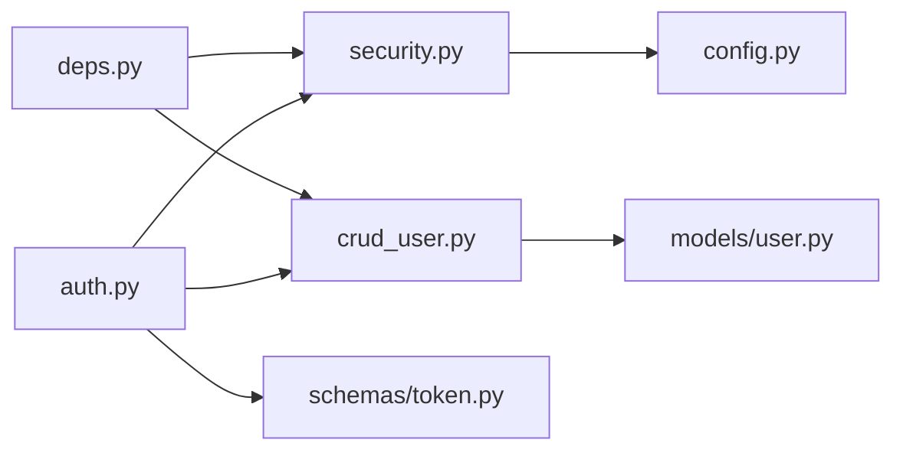
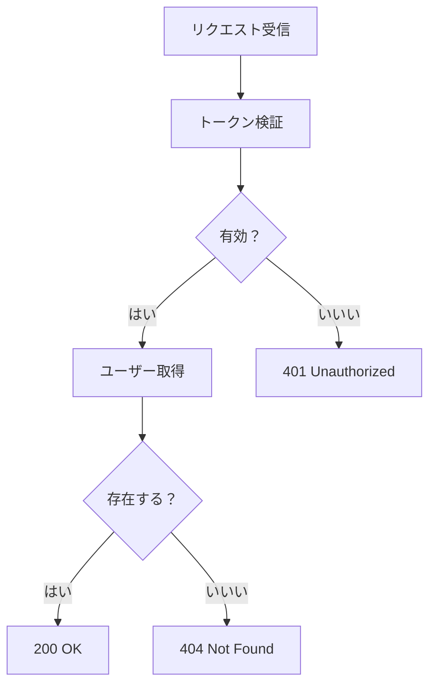

# セッション管理

<cite>
**本文で参照されたファイル**
- [backend/app/api/api_v1/endpoints/auth.py](file://backend/app/api/api_v1/endpoints/auth.py)
- [backend/app/core/security.py](file://backend/app/core/security.py)
- [backend/app/api/deps.py](file://backend/app/api/deps.py)
- [backend/app/core/config.py](file://backend/app/core/config.py)
- [backend/app/schemas/token.py](file://backend/app/schemas/token.py)
- [backend/app/crud/crud_user.py](file://backend/app/crud/crud_user.py)
- [backend/app/models/user.py](file://backend/app/models/user.py)
- [frontend/src/middleware.ts](file://frontend/src/middleware.ts)
- [frontend/src/app/login/page.tsx](file://frontend/src/app/login/page.tsx)
- [backend/app/middleware/error_handler.py](file://backend/app/middleware/error_handler.py)
</cite>

## 目次
1. [はじめに](#はじめに)
2. [プロジェクト構造](#プロジェクト構造)
3. [コアコンポーネント](#コアコンポーネント)
4. [アーキテクチャ概観](#アーキテクチャ概観)
5. [詳細コンポーネント解析](#詳細コンポーネント解析)
6. [依存関係分析](#依存関係分析)
7. [パフォーマンス考慮事項](#パフォーマンス考慮事項)
8. [トラブルシューティングガイド](#トラブルシューティングガイド)
9. [結論](#結論)
10. [付録](#付録)

## はじめに
本ドキュメントは、Todoアプリケーションにおける認証セッション管理の設計と実装について、JWTベースのステートレス認証の利点、有効期限管理、ログアウト処理、クライアント側でのトークン保存方法（HTTPOnly Cookie vs localStorage）、セキュリティ上の最適な配置場所、セッションの再生成、リプレイ攻撃への対策、マルチデバイス対応について詳細に解説します。

## プロジェクト構造
認証に関連する主な構成要素は以下の通りです：
- バックエンド（FastAPI）：認証エンドポイント、JWT生成/検証、依存性注入、設定管理
- フロントエンド（Next.js）：認証不要な公開パス、認証必須パスのミドルウェア、クライアント側のトークン保持

**図の出典**
- [frontend/src/middleware.ts:1-35](file://frontend/src/middleware.ts#L1-L35)
- [frontend/src/app/login/page.tsx:1-111](file://frontend/src/app/login/page.tsx#L1-L111)
- [backend/app/api/api_v1/endpoints/auth.py:1-117](file://backend/app/api/api_v1/endpoints/auth.py#L1-L117)
- [backend/app/api/deps.py:1-37](file://backend/app/api/deps.py#L1-L37)
- [backend/app/core/security.py:1-35](file://backend/app/core/security.py#L1-L35)
- [backend/app/core/config.py:1-91](file://backend/app/core/config.py#L1-L91)
- [backend/app/schemas/token.py:1-10](file://backend/app/schemas/token.py#L1-L10)
- [backend/app/crud/crud_user.py:1-28](file://backend/app/crud/crud_user.py#L1-L28)
- [backend/app/models/user.py:1-16](file://backend/app/models/user.py#L1-L16)

**節の出典**
- [frontend/src/middleware.ts:1-35](file://frontend/src/middleware.ts#L1-L35)
- [frontend/src/app/login/page.tsx:1-111](file://frontend/src/app/login/page.tsx#L1-L111)
- [backend/app/api/api_v1/endpoints/auth.py:1-117](file://backend/app/api/api_v1/endpoints/auth.py#L1-L117)
- [backend/app/api/deps.py:1-37](file://backend/app/api/deps.py#L1-L37)
- [backend/app/core/security.py:1-35](file://backend/app/core/security.py#L1-L35)
- [backend/app/core/config.py:1-91](file://backend/app/core/config.py#L1-L91)
- [backend/app/schemas/token.py:1-10](file://backend/app/schemas/token.py#L1-L10)
- [backend/app/crud/crud_user.py:1-28](file://backend/app/crud/crud_user.py#L1-L28)
- [backend/app/models/user.py:1-16](file://backend/app/models/user.py#L1-L16)

## コアコンポーネント
- 認証エンドポイント（/api/v1/auth）：ユーザー登録、アクセストークン取得、パスワードリセット関連のエンドポイントを提供
- JWT生成/検証：署名アルゴリズム、有効期限、ペイロードのエンコード/デコードを行う
- 依存性注入：OAuth2 Bearerトークンを取得し、現在のユーザーを解決
- 設定管理：シークレットキー、アルゴリズム、アクセストークン有効期限、リクエスト制限などを管理
- トークンモデル：レスポンス形式のトークン定義
- ユーザーCRUD：ユーザーの存在確認、作成、IDによる取得
- エラーハンドリング：認証エラー、バリデーションエラー、リクエスト制限超過などの統一エラーレスポンス

**節の出典**
- [backend/app/api/api_v1/endpoints/auth.py:1-117](file://backend/app/api/api_v1/endpoints/auth.py#L1-L117)
- [backend/app/core/security.py:1-35](file://backend/app/core/security.py#L1-L35)
- [backend/app/api/deps.py:1-37](file://backend/app/api/deps.py#L1-L37)
- [backend/app/core/config.py:1-91](file://backend/app/core/config.py#L1-L91)
- [backend/app/schemas/token.py:1-10](file://backend/app/schemas/token.py#L1-L10)
- [backend/app/crud/crud_user.py:1-28](file://backend/app/crud/crud_user.py#L1-L28)
- [backend/app/models/user.py:1-16](file://backend/app/models/user.py#L1-L16)
- [backend/app/middleware/error_handler.py:1-149](file://backend/app/middleware/error_handler.py#L1-L149)

## アーキテクチャ概観
JWTベースのステートレス認証の流れ：
1. ユーザーはログインエンドポイントに認証情報を送信
2. サーバーはパスワードを検証し、アクセストークンを発行（有効期限付き）
3. クライアントはトークンを保持（現状はCookieから取得）
4. 以降のリクエストにはAuthorization: Bearer トークンを含める
5. サーバーはトークンを検証し、現在のユーザーを解決

**図の出典**
- [backend/app/api/api_v1/endpoints/auth.py:36-54](file://backend/app/api/api_v1/endpoints/auth.py#L36-L54)
- [backend/app/core/security.py:17-27](file://backend/app/core/security.py#L17-L27)
- [backend/app/api/deps.py:13-36](file://backend/app/api/deps.py#L13-L36)
- [backend/app/crud/crud_user.py:8-16](file://backend/app/crud/crud_user.py#L8-L16)
- [frontend/src/middleware.ts:15-23](file://frontend/src/middleware.ts#L15-L23)

**節の出典**
- [backend/app/api/api_v1/endpoints/auth.py:36-54](file://backend/app/api/api_v1/endpoints/auth.py#L36-L54)
- [backend/app/core/security.py:17-27](file://backend/app/core/security.py#L17-L27)
- [backend/app/api/deps.py:13-36](file://backend/app/api/deps.py#L13-L36)
- [backend/app/crud/crud_user.py:8-16](file://backend/app/crud/crud_user.py#L8-L16)
- [frontend/src/middleware.ts:15-23](file://frontend/src/middleware.ts#L15-L23)

## 詳細コンポーネント解析

### JWT生成と検証
- 生成：ペイロードにユーザーID（sub）を含み、有効期限（ACCESS_TOKEN_EXPIRE_MINUTES）を設定
- 検証：署名アルゴリズム（ALGORITHM）とシークレットキー（SECRET_KEY）を使用してトークンを検証
- 依存：設定モジュールからシークレットキー、アルゴリズム、有効期限を取得

**図の出典**
- [backend/app/core/security.py:17-34](file://backend/app/core/security.py#L17-L34)
- [backend/app/core/config.py:51-53](file://backend/app/core/config.py#L51-L53)

**節の出典**
- [backend/app/core/security.py:17-34](file://backend/app/core/security.py#L17-L34)
- [backend/app/core/config.py:51-53](file://backend/app/core/config.py#L51-L53)

### 認証エンドポイント（ログイン）
- 入力：OAuth2PasswordRequestForm（username=メールアドレス、password）
- 処理：メールアドレスでユーザーを取得し、パスワードを検証
- 成功時：アクセストークンを発行（有効期限付き）
- 失敗時：401 Unauthorized（WWW-Authenticate: Bearer）

**図の出典**
- [backend/app/api/api_v1/endpoints/auth.py:36-54](file://backend/app/api/api_v1/endpoints/auth.py#L36-L54)
- [backend/app/crud/crud_user.py:8-16](file://backend/app/crud/crud_user.py#L8-L16)
- [backend/app/core/security.py:17-27](file://backend/app/core/security.py#L17-L27)

**節の出典**
- [backend/app/api/api_v1/endpoints/auth.py:36-54](file://backend/app/api/api_v1/endpoints/auth.py#L36-L54)
- [backend/app/crud/crud_user.py:8-16](file://backend/app/crud/crud_user.py#L8-L16)
- [backend/app/core/security.py:17-27](file://backend/app/core/security.py#L17-L27)

### 現在のユーザー取得（依存性注入）
- OAuth2 Bearerトークンを取得
- トークンを検証し、ペイロードからユーザーIDを取得
- IDでユーザーを取得し、存在しない場合は401

**図の出典**
- [backend/app/api/deps.py:13-36](file://backend/app/api/deps.py#L13-L36)
- [backend/app/core/security.py:29-34](file://backend/app/core/security.py#L29-L34)
- [backend/app/crud/crud_user.py:13-16](file://backend/app/crud/crud_user.py#L13-L16)

**節の出典**
- [backend/app/api/deps.py:13-36](file://backend/app/api/deps.py#L13-L36)
- [backend/app/core/security.py:29-34](file://backend/app/core/security.py#L29-L34)
- [backend/app/crud/crud_user.py:13-16](file://backend/app/crud/crud_user.py#L13-L16)

### 有効期限管理
- 設定：ACCESS_TOKEN_EXPIRE_MINUTES（分単位）
- 生成時：現在時刻＋有効期限をexpとしてペイロードに追加
- 検証時：expが切れている場合、検証に失敗（401）

**図の出典**
- [backend/app/core/security.py:19-26](file://backend/app/core/security.py#L19-L26)
- [backend/app/core/config.py](file://backend/app/core/config.py#L53)

**節の出典**
- [backend/app/core/security.py:19-26](file://backend/app/core/security.py#L19-L26)
- [backend/app/core/config.py](file://backend/app/core/config.py#L53)

### ログアウト処理（現状）
- 現状の実装ではログアウトエンドポイントは提供されていない
- クライアント側ではCookieからトークンを取得しているため、Cookieを削除することで「ログアウト」となる
- 本番環境では、CookieをHttpOnlyかつSameSite=Lax/Strictに設定し、CSRF対策も行うべき

**節の出典**
- [frontend/src/middleware.ts:15-23](file://frontend/src/middleware.ts#L15-L23)

### トークン保存方法（HTTPOnly Cookie vs localStorage）
- 現状のフロントエンドはCookieからトークンを取得している
- ただし、セキュリティ上、CookieはHttpOnlyにすべきであり、XSS対策としてSameSiteやSecure属性も考慮
- localStorageはXSSリスクが高いため、推奨されない

**節の出典**
- [frontend/src/middleware.ts:15-23](file://frontend/src/middleware.ts#L15-L23)

### セッションの再生成
- 現状の認証では再生成機構は実装されていない
- 再生成が必要な場合は、新規トークンを発行し、古いCookieを置き換える

**節の出典**
- [backend/app/api/api_v1/endpoints/auth.py:36-54](file://backend/app/api/api_v1/endpoints/auth.py#L36-L54)

### リプレイ攻撃への対策
- 有効期限（exp）によりリプレイを防ぐ
- トークンの再生成（短期間で再発行）も有効
- 本番環境では、CSRF対策（SameSite、Referer/Originチェック）も推奨

**節の出典**
- [backend/app/core/security.py:25-26](file://backend/app/core/security.py#L25-L26)
- [backend/app/core/config.py](file://backend/app/core/config.py#L53)

### マルチデバイス対応
- JWTはステートレスなので、複数端末で同時に有効
- 各端末で別々のCookieを保持する必要がある
- 本番環境では、Cookieのドメイン/パス設定とSameSite属性を適切に設定

**節の出典**
- [frontend/src/middleware.ts:15-23](file://frontend/src/middleware.ts#L15-L23)

## 依存関係分析
- 認証エンドポイントはJWT生成/検証、ユーザーCRUD、設定に依存
- 依存性注入はOAuth2 Bearerトークンを経由してJWT検証とユーザー取得を行う
- 設定はシークレットキー、アルゴリズム、有効期限、リクエスト制限を管理

**図の出典**
- [backend/app/api/api_v1/endpoints/auth.py:1-117](file://backend/app/api/api_v1/endpoints/auth.py#L1-L117)
- [backend/app/core/security.py:1-35](file://backend/app/core/security.py#L1-L35)
- [backend/app/api/deps.py:1-37](file://backend/app/api/deps.py#L1-L37)
- [backend/app/core/config.py:1-91](file://backend/app/core/config.py#L1-L91)
- [backend/app/schemas/token.py:1-10](file://backend/app/schemas/token.py#L1-L10)
- [backend/app/crud/crud_user.py:1-28](file://backend/app/crud/crud_user.py#L1-L28)
- [backend/app/models/user.py:1-16](file://backend/app/models/user.py#L1-L16)

**節の出典**
- [backend/app/api/api_v1/endpoints/auth.py:1-117](file://backend/app/api/api_v1/endpoints/auth.py#L1-L117)
- [backend/app/core/security.py:1-35](file://backend/app/core/security.py#L1-L35)
- [backend/app/api/deps.py:1-37](file://backend/app/api/deps.py#L1-L37)
- [backend/app/core/config.py:1-91](file://backend/app/core/config.py#L1-L91)
- [backend/app/schemas/token.py:1-10](file://backend/app/schemas/token.py#L1-L10)
- [backend/app/crud/crud_user.py:1-28](file://backend/app/crud/crud_user.py#L1-L28)
- [backend/app/models/user.py:1-16](file://backend/app/models/user.py#L1-L16)

## パフォーマンス考慮事項
- JWT検証はCPU負荷が低い（署名検証のみ）
- 有効期限の短縮（ACCESS_TOKEN_EXPIRE_MINUTES）はセキュリティ向上だが、頻繁な再発行による通信コスト増
- トークンの再生成頻度を調整し、バランスを取ることが重要

**節の出典**
- [backend/app/core/config.py](file://backend/app/core/config.py#L53)
- [backend/app/core/security.py:25-26](file://backend/app/core/security.py#L25-L26)

## トラブルシューティングガイド
- 401 Unauthorized：トークンの検証に失敗（無効、期限切れ、ペイロード不正）
- 404 Not Found：トークンに含まれるユーザーIDに対応するユーザーが存在しない
- 429 Too Many Requests：リクエスト制限超過（LOGIN/RATE_LIMIT_LOGINなど）
- 500 Internal Server Error：予期しないエラー

**図の出典**
- [backend/app/api/deps.py:17-35](file://backend/app/api/deps.py#L17-L35)
- [backend/app/middleware/error_handler.py:52-76](file://backend/app/middleware/error_handler.py#L52-L76)

**節の出典**
- [backend/app/api/deps.py:17-35](file://backend/app/api/deps.py#L17-L35)
- [backend/app/middleware/error_handler.py:52-76](file://backend/app/middleware/error_handler.py#L52-L76)

## 結論
本システムはJWTベースのステートレス認証を採用しており、認証情報の保持をサーバーに委ねることでスケーラビリティと簡潔さを実現しています。有効期限管理、リクエスト制限、エラーハンドリングを通じてセキュリティと安定性を両立しています。今後の改善として、ログアウト処理の実装、Cookieのセキュア設定、CSRF対策、マルチデバイス対応、トークン再生成機構の導入が挙げられます。

## 付録
- 認証フローの補足：パスワードリセット（Forgot/Reset）は別途実装されており、トークンの有効期限（RESET_TOKEN_EXPIRE_HOURS）も設定されています。

**節の出典**
- [backend/app/api/api_v1/endpoints/auth.py:57-116](file://backend/app/api/api_v1/endpoints/auth.py#L57-L116)
- [backend/app/core/config.py:82-83](file://backend/app/core/config.py#L82-L83)