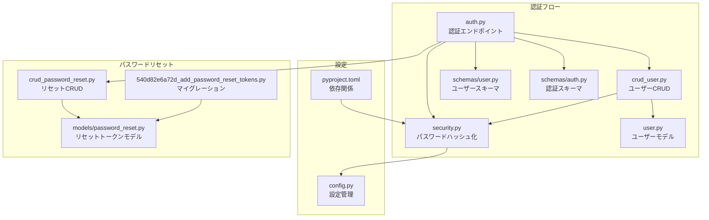
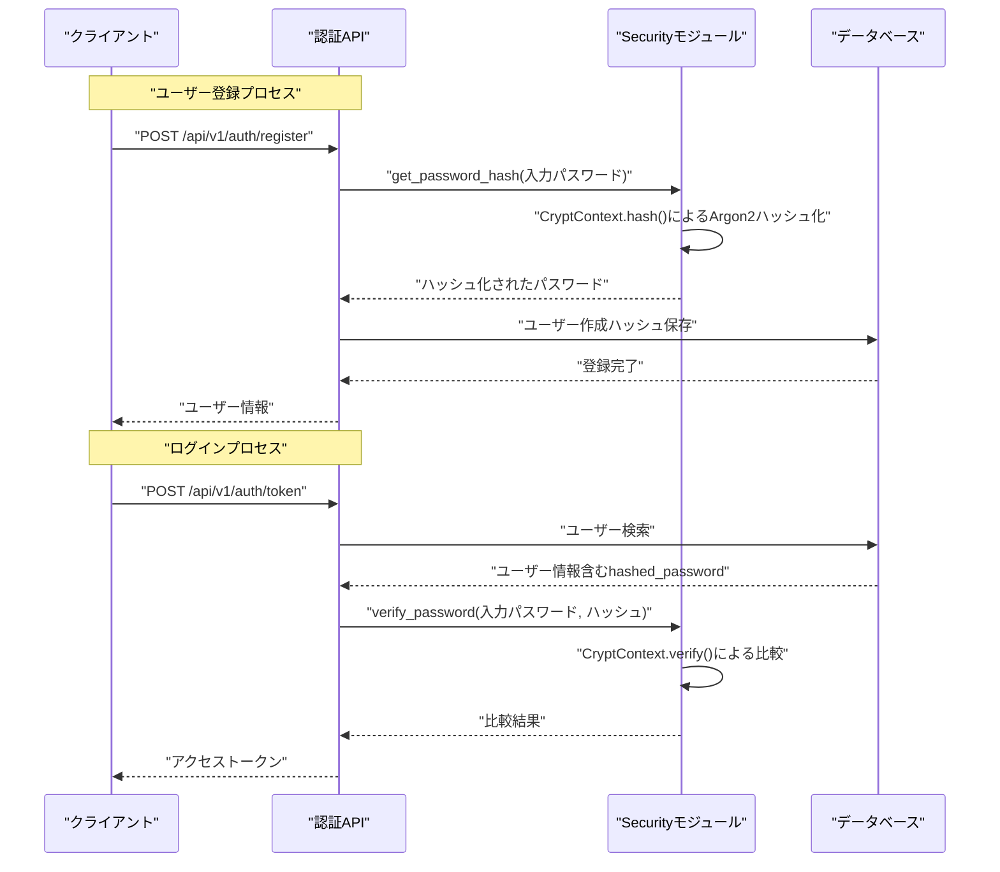
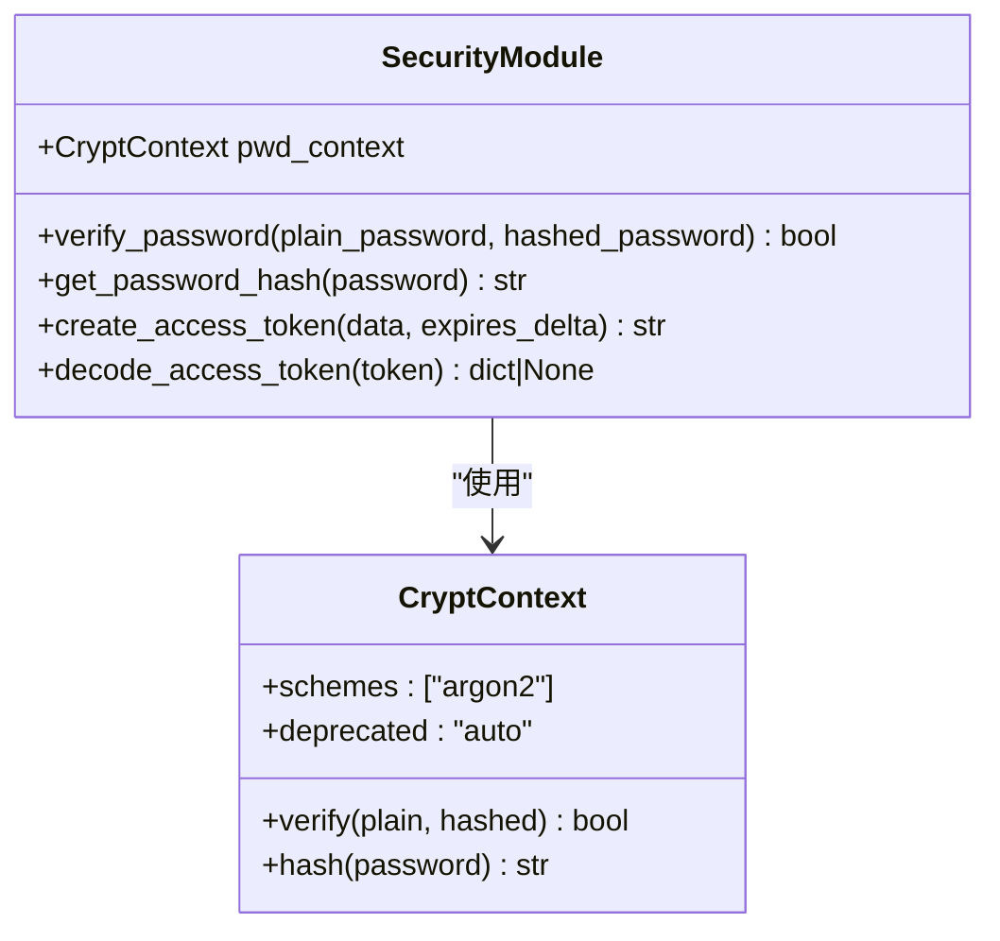
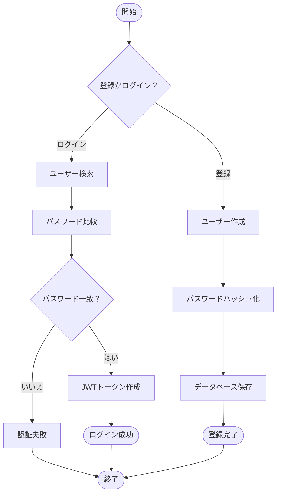
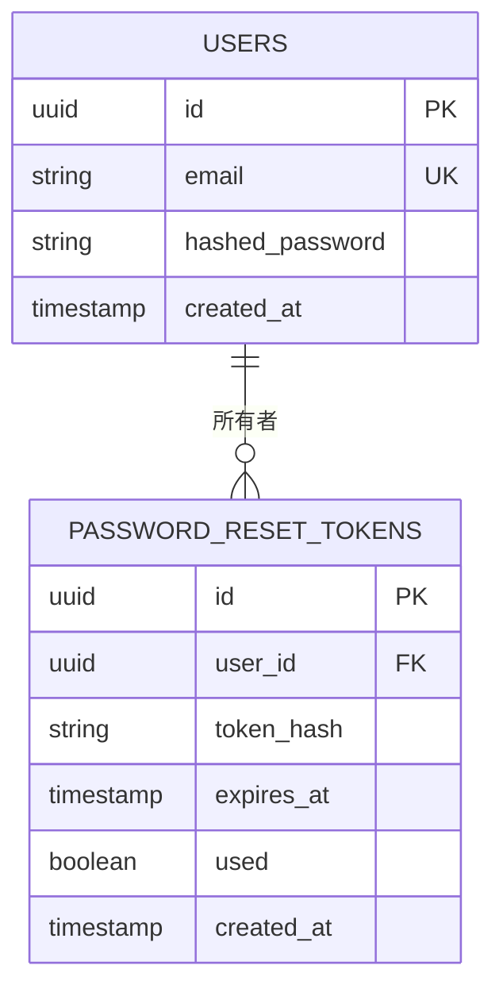
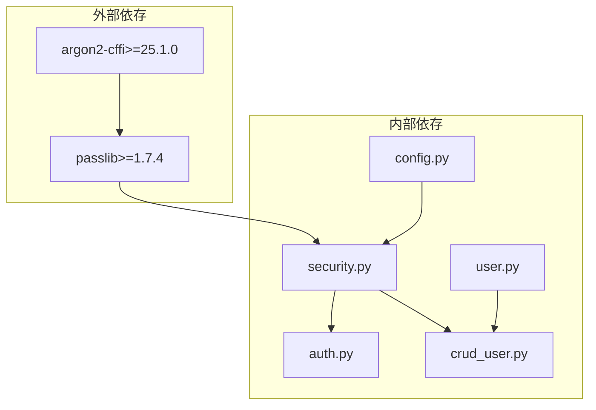

# パスワードハッシュ化

<cite>
**この文書で参照されるファイル**
- [backend/app/core/security.py](file://backend/app/core/security.py)
- [backend/app/crud/crud_user.py](file://backend/app/crud/crud_user.py)
- [backend/app/models/user.py](file://backend/app/models/user.py)
- [backend/app/api/api_v1/endpoints/auth.py](file://backend/app/api/api_v1/endpoints/auth.py)
- [backend/app/schemas/user.py](file://backend/app/schemas/user.py)
- [backend/app/schemas/auth.py](file://backend/app/schemas/auth.py)
- [backend/app/core/config.py](file://backend/app/core/config.py)
- [backend/pyproject.toml](file://backend/pyproject.toml)
- [backend/migrations/versions/319591f893c3_rename_username_to_email.py](file://backend/migrations/versions/319591f893c3_rename_username_to_email.py)
- [backend/migrations/versions/540d82e6a72d_add_password_reset_tokens.py](file://backend/migrations/versions/540d82e6a72d_add_password_reset_tokens.py)
- [backend/app/models/password_reset.py](file://backend/app/models/password_reset.py)
- [backend/app/crud/crud_password_reset.py](file://backend/app/crud/crud_password_reset.py)
- [backend/tests/test_auth.py](file://backend/tests/test_auth.py)
</cite>

## 目次
1. [はじめに](#はじめに)
2. [プロジェクト構造](#プロジェクト構造)
3. [コアコンポーネント](#コアコンポーネント)
4. [アーキテクチャ概観](#アーキテクチャ概観)
5. [詳細コンポーネント分析](#詳細コンポーネント分析)
6. [依存関係分析](#依存関係分析)
7. [パフォーマンス考慮事項](#パフォーマンス考慮事項)
8. [トラブルシューティングガイド](#トラブルシューティングガイド)
9. [結論](#結論)

## はじめに
本ドキュメントは、Todoアプリケーションにおけるパスワードの安全な保存プロセスについて説明します。特に、PassLibのCryptContextを使用したArgon2アルゴリズムの選択理由、パラメータ設定、パスワード比較処理、ハッシュ化の実装方法、セキュリティ上の利点、および過去のbcryptからの移行方法について詳しく解説します。

## プロジェクト構造
パスワードハッシュ化に関連する主要なコンポーネントは以下の通りです：

**図の出典**
- [backend/app/api/api_v1/endpoints/auth.py:1-117](file://backend/app/api/api_v1/endpoints/auth.py#L1-L117)
- [backend/app/core/security.py:1-35](file://backend/app/core/security.py#L1-L35)
- [backend/app/crud/crud_user.py:1-28](file://backend/app/crud/crud_user.py#L1-L28)
- [backend/app/models/user.py:1-16](file://backend/app/models/user.py#L1-L16)
- [backend/app/schemas/user.py:1-13](file://backend/app/schemas/user.py#L1-L13)
- [backend/app/schemas/auth.py:1-11](file://backend/app/schemas/auth.py#L1-L11)
- [backend/app/core/config.py:1-91](file://backend/app/core/config.py#L1-L91)
- [backend/pyproject.toml:1-51](file://backend/pyproject.toml#L1-L51)
- [backend/app/models/password_reset.py:1-32](file://backend/app/models/password_reset.py#L1-L32)
- [backend/app/crud/crud_password_reset.py:1-37](file://backend/app/crud/crud_password_reset.py#L1-L37)
- [backend/migrations/versions/540d82e6a72d_add_password_reset_tokens.py:1-43](file://backend/migrations/versions/540d82e6a72d_add_password_reset_tokens.py#L1-L43)

**節の出典**
- [backend/app/core/security.py:1-35](file://backend/app/core/security.py#L1-L35)
- [backend/app/api/api_v1/endpoints/auth.py:1-117](file://backend/app/api/api_v1/endpoints/auth.py#L1-L117)
- [backend/pyproject.toml:1-51](file://backend/pyproject.toml#L1-L51)

## コアコンポーネント
パスワードハッシュ化のコアコンポーネントは以下の通りです：

### PassLib CryptContextの設定
- Argon2アルゴリズムのみをサポート
- 非推奨アルゴリズムの自動互換性維持
- すべてのパスワード操作に統一的なインターフェース提供

### パスワード比較処理
- 入力パスワードとデータベース内のハッシュを比較
- すべてのアルゴリズムで一貫した動作を保証
- 認証フローのセキュリティ強化

### ハッシュ化実装
- 入力パスワードをArgon2でハッシュ化
- 自動的にsaltとパラメータを含む完全なハッシュを生成
- 保存用に単一文字列として格納

**節の出典**
- [backend/app/core/security.py:7-14](file://backend/app/core/security.py#L7-L14)

## アーキテクチャ概観
パスワードハッシュ化プロセスの全体像：

**図の出典**
- [backend/app/api/api_v1/endpoints/auth.py:19-54](file://backend/app/api/api_v1/endpoints/auth.py#L19-L54)
- [backend/app/core/security.py:10-14](file://backend/app/core/security.py#L10-L14)
- [backend/app/crud/crud_user.py:18-27](file://backend/app/crud/crud_user.py#L18-L27)

## 詳細コンポーネント分析

### Securityモジュールの詳細
Securityモジュールはパスワードハッシュ化の中心的な役割を果たします：

**図の出典**
- [backend/app/core/security.py:4-8](file://backend/app/core/security.py#L4-L8)
- [backend/app/core/security.py:10-14](file://backend/app/core/security.py#L10-L14)

#### Argon2アルゴリズムの選択理由
- **最新のセキュリティ基準**: Argon2は現在最も推奨されるパスワードハッシュアルゴリズム
- **攻撃耐性**: CPU/memory-hardな設計により、ASICやGPUによるブルートフォース攻撃に対応
- **パラメータ調整可能**: メモリコスト、時間コスト、並列性を調整可能
- **非推奨アルゴリズムとの互換性**: 既存のbcryptハッシュとの自動移行対応

#### パラメータ設定の重要性
- **メモリコスト**: ハッシュ化に必要なメモリ量を制御（例: 128MB〜256MB）
- **時間コスト**: 処理時間を制御（例: 3〜5秒）
- **並列性**: 複数CPUコアでの処理を制御（例: 1〜4）

**節の出典**
- [backend/app/core/security.py:7-8](file://backend/app/core/security.py#L7-L8)

### 認証フローの詳細
認証プロセスの具体的なフロー：

**図の出典**
- [backend/app/api/api_v1/endpoints/auth.py:19-54](file://backend/app/api/api_v1/endpoints/auth.py#L19-L54)
- [backend/app/crud/crud_user.py:18-27](file://backend/app/crud/crud_user.py#L18-L27)

**節の出典**
- [backend/app/api/api_v1/endpoints/auth.py:36-54](file://backend/app/api/api_v1/endpoints/auth.py#L36-L54)
- [backend/app/crud/crud_user.py:18-27](file://backend/app/crud/crud_user.py#L18-L27)

### パスワードリセットシステム
パスワードリセット機能のセキュリティ設計：

**図の出典**
- [backend/app/models/user.py:12-13](file://backend/app/models/user.py#L12-L13)
- [backend/app/models/password_reset.py:21-32](file://backend/app/models/password_reset.py#L21-L32)

**節の出典**
- [backend/app/models/password_reset.py:1-32](file://backend/app/models/password_reset.py#L1-L32)
- [backend/migrations/versions/540d82e6a72d_add_password_reset_tokens.py:21-35](file://backend/migrations/versions/540d82e6a72d_add_password_reset_tokens.py#L21-L35)

## 依存関係分析
パスワードハッシュ化に関連する依存関係：

**図の出典**
- [backend/pyproject.toml:7-24](file://backend/pyproject.toml#L7-L24)
- [backend/app/core/security.py:4-5](file://backend/app/core/security.py#L4-L5)

**節の出典**
- [backend/pyproject.toml:1-51](file://backend/pyproject.toml#L1-L51)
- [backend/app/core/security.py:1-35](file://backend/app/core/security.py#L1-L35)

## パフォーマンス考慮事項
- **ハッシュ化コスト**: Argon2のパラメータはパフォーマンスとセキュリティのバランスを考慮
- **データベース操作**: ハッシュ化はサーバー側でのみ実施され、ネットワーク転送は平文パスワードのみ
- **認証速度**: 認証時の比較処理はO(1)時間複雑度
- **メモリ使用量**: Argon2はメモリ使用量が増加するため、サーバーのリソースを考慮

## トラブルシューティングガイド

### 一般的な問題と解決策

#### 認証失敗の原因
- **パスワード不一致**: 入力パスワードが間違っている可能性
- **ハッシュ形式の問題**: 古いbcryptハッシュとの互換性問題
- **データベース接続**: ユーザー情報の取得に失敗

#### トラブルシューティング手順
1. **ログイン試行の確認**: 認証エンドポイントのレスポンスを確認
2. **パスワードハッシュの検証**: Securityモジュールのverify_passwordメソッドを使用
3. **データベースの状態確認**: ユーザー情報とハッシュの整合性を確認
4. **設定の確認**: SECRET_KEYやALGORITHMなどの設定値を確認

**節の出典**
- [backend/app/api/api_v1/endpoints/auth.py:43-49](file://backend/app/api/api_v1/endpoints/auth.py#L43-L49)
- [backend/tests/test_auth.py:58-66](file://backend/tests/test_auth.py#L58-L66)

### 過去のbcryptからの移行方法
- **自動互換性**: CryptContextの"auto"設定により、既存のbcryptハッシュを自動的に認識
- **段階的移行**: 新規ユーザー登録時はArgon2を使用し、既存ユーザーは次回ログイン時に自動的に移行
- **互換性の維持**: 旧バージョンとの互換性を保ちながら新アルゴリズムへの移行が可能

**節の出典**
- [backend/app/core/security.py](file://backend/app/core/security.py#L8)

## 結論
Todoアプリケーションのパスワードハッシュ化システムは、以下のような特徴を持っています：

- **最新技術の採用**: Argon2アルゴリズムを使用し、最新のセキュリティ基準を満たしています
- **簡潔な実装**: PassLibのCryptContextにより、複雑なハッシュ化処理をシンプルに実現
- **互換性の確保**: 過去のbcryptからの自動移行を可能にする設計
- **堅牢なセキュリティ**: 高いメモリコスト、時間コスト、並列性の設定により、ブルートフォース攻撃に対して強い耐性を示します
- **拡張性**: 将来的なアルゴリズム変更にも柔軟に対応できる設計

この実装により、ユーザーのパスワードは安全に保存され、認証プロセスは効率的かつ安全に動作することが保証されています。