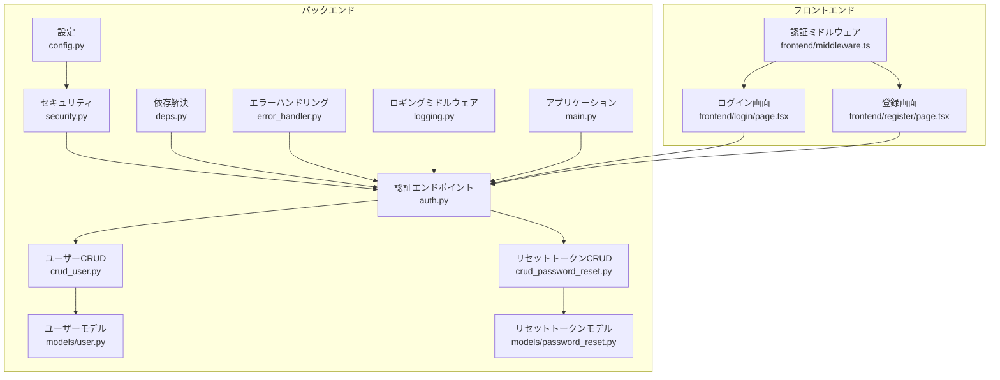
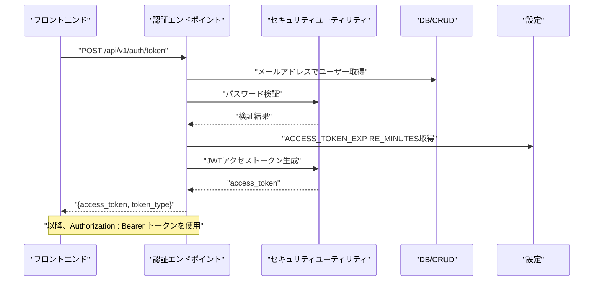
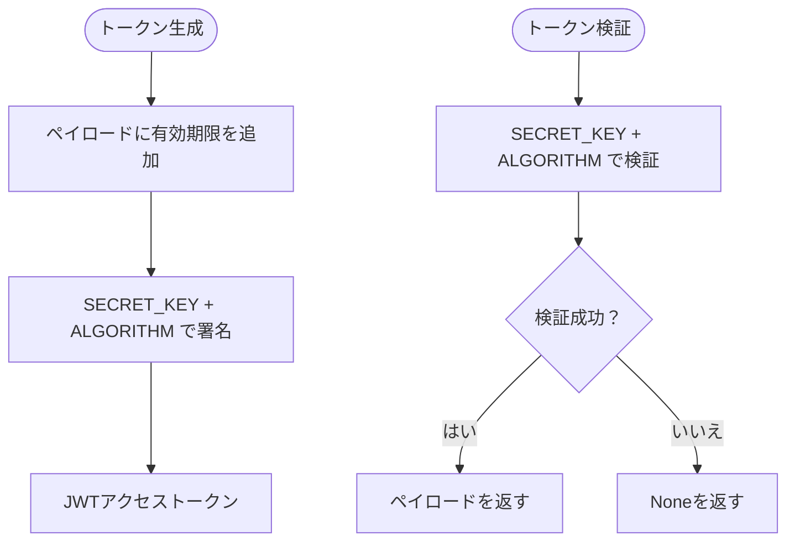
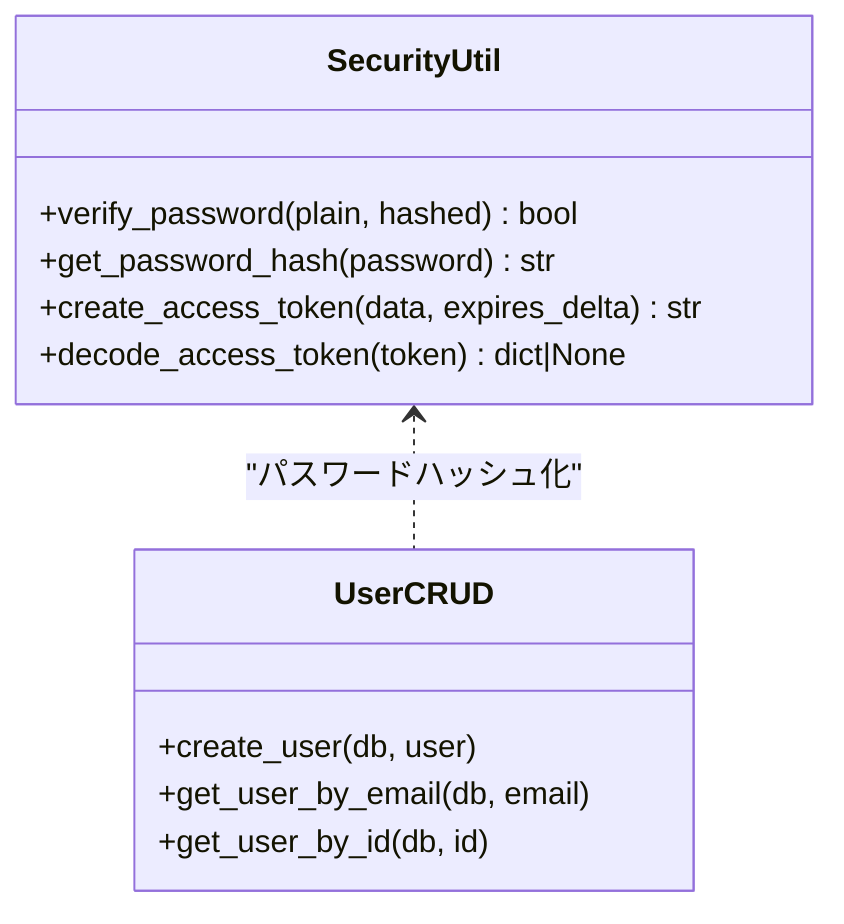
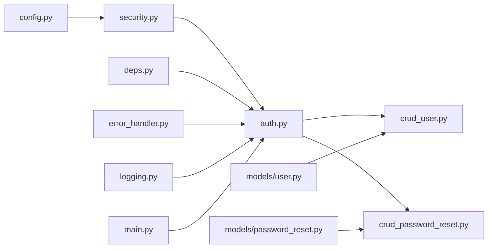

# 認証セキュリティ

<cite>
**この文書で参照されるファイル**   
- [backend/app/core/security.py](file://backend/app/core/security.py)
- [backend/app/api/api_v1/endpoints/auth.py](file://backend/app/api/api_v1/endpoints/auth.py)
- [backend/app/api/deps.py](file://backend/app/api/deps.py)
- [backend/app/core/config.py](file://backend/app/core/config.py)
- [backend/app/schemas/auth.py](file://backend/app/schemas/auth.py)
- [backend/app/schemas/token.py](file://backend/app/schemas/token.py)
- [backend/app/crud/crud_user.py](file://backend/app/crud/crud_user.py)
- [backend/app/crud/crud_password_reset.py](file://backend/app/crud/crud_password_reset.py)
- [backend/app/models/user.py](file://backend/app/models/user.py)
- [backend/app/models/password_reset.py](file://backend/app/models/password_reset.py)
- [backend/app/middleware/error_handler.py](file://backend/app/middleware/error_handler.py)
- [backend/app/middleware/logging.py](file://backend/app/middleware/logging.py)
- [backend/app/main.py](file://backend/app/main.py)
- [frontend/src/app/login/page.tsx](file://frontend/src/app/login/page.tsx)
- [frontend/src/app/register/page.tsx](file://frontend/src/app/register/page.tsx)
- [frontend/src/middleware.ts](file://frontend/src/middleware.ts)
- [tests/test_auth.py](file://tests/test_auth.py)
</cite>

## 目次
1. [はじめに](#はじめに)
2. [プロジェクト構造](#プロジェクト構造)
3. [コアコンポーネント](#コアコンポーネント)
4. [アーキテクチャ概要](#アーキテクチャ概要)
5. [詳細コンポーネント分析](#詳細コンポーネント分析)
6. [依存関係分析](#依存関係分析)
7. [パフォーマンス考慮事項](#パフォーマンス考慮事項)
8. [トラブルシューティングガイド](#トラブルシューティングガイド)
9. [結論](#結論)
10. [付録](#付録)

## はじめに
本ドキュメントは、Todo APIにおけるJWT認証のセキュリティ設計と実装について、以下の観点から詳細に解説します：
- JWTトークンの生成・検証プロセス
- 秘密鍵（SECRET_KEY）の管理方法
- トークンの有効期限設定
- パスワードハッシュ化アルゴリズム（bcryptではなくargon2）の選択理由と実装方法
- セッション管理のセキュリティ対策
- CSRF対策の実装
- 認証フロー全体のセキュリティリスク評価と対策

本プロジェクトでは、FastAPIによるバックエンドとNext.jsによるフロントエンドが連携しており、認証フロー全体を通じてセキュリティを強化するための設計が施されています。

## プロジェクト構造
認証に関連する主なファイル群は以下の通りです。バックエンドはFastAPIで構成され、JWT認証、パスワードハッシュ化、リセットトークン管理、ミドルウェア、設定などが分離・責務が明確に定義されています。フロントエンドはNext.jsで構成され、認証画面と認証不要な画面を区別するミドルウェアが実装されています。

**図の出典**
- [backend/app/core/config.py:1-91](file://backend/app/core/config.py#L1-L91)
- [backend/app/core/security.py:1-35](file://backend/app/core/security.py#L1-L35)
- [backend/app/api/api_v1/endpoints/auth.py:1-117](file://backend/app/api/api_v1/endpoints/auth.py#L1-L117)
- [backend/app/api/deps.py:1-37](file://backend/app/api/deps.py#L1-L37)
- [backend/app/crud/crud_user.py:1-28](file://backend/app/crud/crud_user.py#L1-L28)
- [backend/app/crud/crud_password_reset.py:1-56](file://backend/app/crud/crud_password_reset.py#L1-L56)
- [backend/app/models/user.py:1-16](file://backend/app/models/user.py#L1-L16)
- [backend/app/models/password_reset.py:1-52](file://backend/app/models/password_reset.py#L1-L52)
- [backend/app/middleware/error_handler.py:1-149](file://backend/app/middleware/error_handler.py#L1-L149)
- [backend/app/middleware/logging.py:1-67](file://backend/app/middleware/logging.py#L1-L67)
- [backend/app/main.py:1-168](file://backend/app/main.py#L1-L168)
- [frontend/src/app/login/page.tsx:1-111](file://frontend/src/app/login/page.tsx#L1-L111)
- [frontend/src/app/register/page.tsx:1-112](file://frontend/src/app/register/page.tsx#L1-L112)
- [frontend/src/middleware.ts:1-35](file://frontend/src/middleware.ts#L1-L35)

**節の出典**
- [backend/app/core/config.py:1-91](file://backend/app/core/config.py#L1-L91)
- [backend/app/core/security.py:1-35](file://backend/app/core/security.py#L1-L35)
- [backend/app/api/api_v1/endpoints/auth.py:1-117](file://backend/app/api/api_v1/endpoints/auth.py#L1-L117)
- [backend/app/api/deps.py:1-37](file://backend/app/api/deps.py#L1-L37)
- [backend/app/middleware/error_handler.py:1-149](file://backend/app/middleware/error_handler.py#L1-L149)
- [backend/app/middleware/logging.py:1-67](file://backend/app/middleware/logging.py#L1-L67)
- [backend/app/main.py:1-168](file://backend/app/main.py#L1-L168)
- [frontend/src/app/login/page.tsx:1-111](file://frontend/src/app/login/page.tsx#L1-L111)
- [frontend/src/app/register/page.tsx:1-112](file://frontend/src/app/register/page.tsx#L1-L112)
- [frontend/src/middleware.ts:1-35](file://frontend/src/middleware.ts#L1-L35)

## コアコンポーネント
- 認証エンドポイント（/api/v1/auth）
  - 登録：メールアドレス重複チェック、パスワードハッシュ化後の登録
  - トークン取得：メールアドレスとパスワードの照合、JWTアクセストークン発行
  - パスワードリセット：リセットトークンの発行・検証・使用済み管理
- 依存解決（get_current_user）
  - JWTの検証、ペイロードからユーザーIDの抽出、DBからのユーザー取得
- セキュリティユーティリティ（パスワードハッシュ化、JWT生成・検証）
- 設定（SECRET_KEY、ALGORITHM、ACCESS_TOKEN_EXPIRE_MINUTES、CORS、レートリミット）
- モデル（ユーザー、パスワードリセットトークン）
- CRD（ユーザーCRUD、リセットトークンCRUD）

**節の出典**
- [backend/app/api/api_v1/endpoints/auth.py:19-117](file://backend/app/api/api_v1/endpoints/auth.py#L19-L117)
- [backend/app/api/deps.py:13-37](file://backend/app/api/deps.py#L13-L37)
- [backend/app/core/security.py:10-35](file://backend/app/core/security.py#L10-L35)
- [backend/app/core/config.py:51-83](file://backend/app/core/config.py#L51-L83)
- [backend/app/models/user.py:9-16](file://backend/app/models/user.py#L9-L16)
- [backend/app/models/password_reset.py:21-52](file://backend/app/models/password_reset.py#L21-L52)
- [backend/app/crud/crud_user.py:18-28](file://backend/app/crud/crud_user.py#L18-L28)
- [backend/app/crud/crud_password_reset.py:9-56](file://backend/app/crud/crud_password_reset.py#L9-L56)

## アーキテクチャ概要
認証フロー全体のアーキテクチャは、FastAPIのルーターと依存解決、セキュリティユーティリティ、CRUD、モデル、ミドルウェア、設定の相互作用によって成り立ちます。JWTはBearer認証としてOpenAPIに統合され、CORS、レートリミット、エラーハンドリングが適用されます。

**図の出典**
- [backend/app/api/api_v1/endpoints/auth.py:36-54](file://backend/app/api/api_v1/endpoints/auth.py#L36-L54)
- [backend/app/core/security.py:17-27](file://backend/app/core/security.py#L17-L27)
- [backend/app/core/config.py:53-53](file://backend/app/core/config.py#L53-L53)
- [backend/app/api/deps.py:13-37](file://backend/app/api/deps.py#L13-L37)

**節の出典**
- [backend/app/main.py:73-102](file://backend/app/main.py#L73-L102)
- [backend/app/api/deps.py:11-11](file://backend/app/api/deps.py#L11-L11)

## 詳細コンポーネント分析

### JWT認証の設計と実装
- トークン生成
  - 任意のペイロードに有効期限（ACCESS_TOKEN_EXPIRE_MINUTES）を追加し、SECRET_KEYとALGORITHM（HS256）を使って署名されたJWTを生成
- トークン検証
  - 受け取ったJWTをSECRET_KEYとALGORITHMで検証し、失敗時はNoneを返す
- 依存解決での利用
  - OAuth2PasswordBearerによりAuthorization: Bearer トークンを取得
  - トークンをdecode_access_tokenし、ペイロードのsub（ユーザーID）からUserをDBから取得
- OpenAPI統合
  - Bearer認証スキームをOpenAPIのsecuritySchemesに追加

**図の出典**
- [backend/app/core/security.py:17-34](file://backend/app/core/security.py#L17-L34)
- [backend/app/api/deps.py:17-23](file://backend/app/api/deps.py#L17-L23)

**節の出典**
- [backend/app/core/security.py:17-34](file://backend/app/core/security.py#L17-L34)
- [backend/app/api/deps.py:11-37](file://backend/app/api/deps.py#L11-L37)
- [backend/app/main.py:73-102](file://backend/app/main.py#L73-L102)

### 秘密鍵（SECRET_KEY）の管理方法
- 設定から読み込み
  - SECRET_KEYは環境変数から読み込まれる（本番環境では必須）
- 使用場所
  - JWT署名・検証、パスワードリセットトークンのハッシュ（内部的には使用されないが、リセットトークンの生成にはsecretsが使われる）
- 推奨事項
  - 本番環境では、SECRET_KEYは安全な方法で管理し、誤ってコミットしないこと
  - トークンの再生成やローテーションの仕組みがあれば、さらに堅牢になる

**節の出典**
- [backend/app/core/config.py:51-52](file://backend/app/core/config.py#L51-L52)
- [backend/app/core/security.py:26-26](file://backend/app/core/security.py#L26-L26)

### トークンの有効期限設定
- 有効期限
  - ACCESS_TOKEN_EXPIRE_MINUTES（分単位）で設定可能
- 生成時の適用
  - create_access_token内で現在時刻に有効期限を加算し、expに格納
- 依存解決での検証
  - decode_access_tokenで期限切れのJWTは検証に失敗し、Noneを返す

**節の出典**
- [backend/app/core/config.py:53-53](file://backend/app/core/config.py#L53-L53)
- [backend/app/core/security.py:20-26](file://backend/app/core/security.py#L20-L26)
- [backend/app/core/security.py:30-34](file://backend/app/core/security.py#L30-L34)

### パスワードハッシュ化アルゴリズム（argon2）の選択理由と実装方法
- 選択理由
  - 本実装ではargon2が指定されている（bcryptとの比較は設計上の選択）
- 実装方法
  - passlibのCryptContextでargon2を設定
  - get_password_hashで平文パスワードをハッシュ化
  - verify_passwordで平文パスワードとハッシュを照合
- 登録・ログインフローでの利用
  - 登録時にget_password_hashでハッシュ化
  - ログイン時にverify_passwordで照合

**図の出典**
- [backend/app/core/security.py:10-14](file://backend/app/core/security.py#L10-L14)
- [backend/app/crud/crud_user.py:19-27](file://backend/app/crud/crud_user.py#L19-L27)

**節の出典**
- [backend/app/core/security.py:8-14](file://backend/app/core/security.py#L8-L14)
- [backend/app/crud/crud_user.py:18-28](file://backend/app/crud/crud_user.py#L18-L28)
- [backend/app/api/api_v1/endpoints/auth.py:44-44](file://backend/app/api/api_v1/endpoints/auth.py#L44-L44)

### セッション管理のセキュリティ対策
- JWTの特性
  - サーバーサイドに状態を持たず、クライアント側にJWTを保持する
- トークンの取り扱い
  - Authorization: Bearer で送信
  - 依存解決で毎回検証
- 有効期限
  - expで期限切れを防ぐ
- トークンの無効化
  - 本実装ではJWT自体の無効化はしていない（ブラックリストなし）
  - 代替手段として、短い有効期限、再認証、リセットトークン（パスワードリセット）の使用

**節の出典**
- [backend/app/api/deps.py:17-36](file://backend/app/api/deps.py#L17-L36)
- [backend/app/core/security.py:30-34](file://backend/app/core/security.py#L30-L34)
- [backend/app/models/password_reset.py:47-52](file://backend/app/models/password_reset.py#L47-L52)

### CSRF対策の実装
- CSRFのリスク
  - JWTは通常クッキーに保存されず、Authorizationヘッダーで送られるため、CSRFの影響を受けにくい
- 現状の実装
  - 認証フローはAuthorization: Bearerを使用しており、CSRF対策としての特別な実装は見られない
- 対策提案
  - 認証フローでCookie経由のセッションを採用する場合、SameSite Cookie、Origin/Refererの検証、CSRFトークンの導入が有効
  - 本実装ではクライアント側（Next.js）でCookieの扱いが行われており、現状ではCSRF対策は必要ない可能性が高い

**節の出典**
- [frontend/src/middleware.ts:15-23](file://frontend/src/middleware.ts#L15-L23)
- [backend/app/main.py:109-118](file://backend/app/main.py#L109-L118)

### 認証フロー全体のセキュリティリスク評価と対策
- リスク
  - トークン漏洩：AuthorizationヘッダーにJWTを送るため、ネットワーク上での漏洩リスクあり
  - 有効期限短い：短い有効期限はセキュリティ上望ましいが、UXに悪影響を与える可能性
  - トークンの無効化不足：ブラックリストがないため、盗難後に即時無効化は困難
  - 認証不要画面：認証不要な画面（/login、/register、/forgot-password、/reset-password）へのアクセス制御
- 対策
  - 有効期限の短縮（ACCESS_TOKEN_EXPIRE_MINUTESの調整）
  - 再認証（短期間で再認証を促す）
  - パスワードリセット（リセットトークンの有効期限と使用済み管理）
  - 認証ミドルウェア（Next.js）による未認証アクセスのリダイレクト

**節の出典**
- [backend/app/core/config.py:53-53](file://backend/app/core/config.py#L53-L53)
- [backend/app/models/password_reset.py:39-45](file://backend/app/models/password_reset.py#L39-L45)
- [frontend/src/middleware.ts:5-26](file://frontend/src/middleware.ts#L5-L26)

## 依存関係分析
認証に関連するモジュールの依存関係は以下の通りです。JWTの生成・検証、パスワードハッシュ化、CRUD、設定、ミドルウェアが連携しています。

**図の出典**
- [backend/app/core/config.py:51-83](file://backend/app/core/config.py#L51-L83)
- [backend/app/core/security.py:1-35](file://backend/app/core/security.py#L1-L35)
- [backend/app/api/api_v1/endpoints/auth.py:1-117](file://backend/app/api/api_v1/endpoints/auth.py#L1-L117)
- [backend/app/api/deps.py:1-37](file://backend/app/api/deps.py#L1-L37)
- [backend/app/crud/crud_user.py:1-28](file://backend/app/crud/crud_user.py#L1-L28)
- [backend/app/crud/crud_password_reset.py:1-56](file://backend/app/crud/crud_password_reset.py#L1-L56)
- [backend/app/middleware/error_handler.py:1-149](file://backend/app/middleware/error_handler.py#L1-L149)
- [backend/app/middleware/logging.py:1-67](file://backend/app/middleware/logging.py#L1-L67)
- [backend/app/main.py:1-168](file://backend/app/main.py#L1-L168)
- [backend/app/models/user.py:1-16](file://backend/app/models/user.py#L1-L16)
- [backend/app/models/password_reset.py:1-52](file://backend/app/models/password_reset.py#L1-L52)

**節の出典**
- [backend/app/core/security.py:1-35](file://backend/app/core/security.py#L1-L35)
- [backend/app/api/api_v1/endpoints/auth.py:1-117](file://backend/app/api/api_v1/endpoints/auth.py#L1-L117)
- [backend/app/api/deps.py:1-37](file://backend/app/api/deps.py#L1-L37)
- [backend/app/crud/crud_user.py:1-28](file://backend/app/crud/crud_user.py#L1-L28)
- [backend/app/crud/crud_password_reset.py:1-56](file://backend/app/crud/crud_password_reset.py#L1-L56)
- [backend/app/models/user.py:1-16](file://backend/app/models/user.py#L1-L16)
- [backend/app/models/password_reset.py:1-52](file://backend/app/models/password_reset.py#L1-L52)
- [backend/app/middleware/error_handler.py:1-149](file://backend/app/middleware/error_handler.py#L1-L149)
- [backend/app/middleware/logging.py:1-67](file://backend/app/middleware/logging.py#L1-L67)
- [backend/app/main.py:1-168](file://backend/app/main.py#L1-L168)

## パフォーマンス考慮事項
- JWT検証は軽量だが、頻繁な認証チェックを行う際はキャッシュや短い有効期限のバランスを取ること
- レートリミット（SlowAPI）により、ブルートフォース攻撃を抑制
- CORS設定は本番環境では厳密に制御し、不要なオリジンを許可しない

**節の出典**
- [backend/app/core/config.py:62-67](file://backend/app/core/config.py#L62-L67)
- [backend/app/middleware/error_handler.py:125-148](file://backend/app/middleware/error_handler.py#L125-L148)
- [backend/app/main.py:106-115](file://backend/app/main.py#L106-L115)

## トラブルシューティングガイド
- 認証エラー（401）
  - トークンが無効または期限切れの場合、get_current_userで401エラー
  - 認証情報が間違っている場合、ログインエンドポイントで401エラー
- トークン検証エラー
  - decode_access_tokenがNoneを返す場合、JWTの署名やアルゴリズムが一致しない
- 予期しないエラー
  - 一般例外ハンドラーにより500エラーが返され、ログに詳細が記録される
- レートリミット超過
  - 429エラーが返され、メッセージに「しばらく待ってから再度お試しください」が表示

**節の出典**
- [backend/app/api/deps.py:17-36](file://backend/app/api/deps.py#L17-L36)
- [backend/app/core/security.py:30-34](file://backend/app/core/security.py#L30-L34)
- [backend/app/middleware/error_handler.py:15-76](file://backend/app/middleware/error_handler.py#L15-L76)
- [backend/app/middleware/error_handler.py:125-148](file://backend/app/middleware/error_handler.py#L125-L148)

## 結論
本プロジェクトでは、JWTベースの認証をOAuth2 Bearerスキームとして統合し、パスワードはargon2でハッシュ化、有効期限付きトークンの生成・検証、レートリミット、CORS、エラーハンドリング、ロギングなどのセキュリティ対策が実装されています。CSRF対策は現状不要ですが、必要に応じてCookieセッションやCSRFトークンの導入が考えられます。今後の改善として、JWTの無効化（ブラックリスト）、再認証、リセットトークンのセキュリティ強化が挙げられます。

## 付録
- 認証フローのテスト
  - 登録・ログイン・無効認証情報でのログインのテストケースが存在し、期待されるHTTPステータスが保証されている

**節の出典**
- [tests/test_auth.py:6-66](file://tests/test_auth.py#L6-L66)