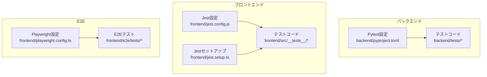
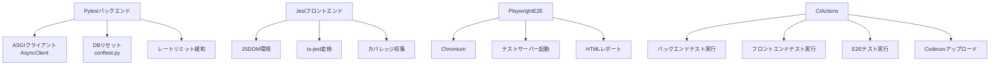
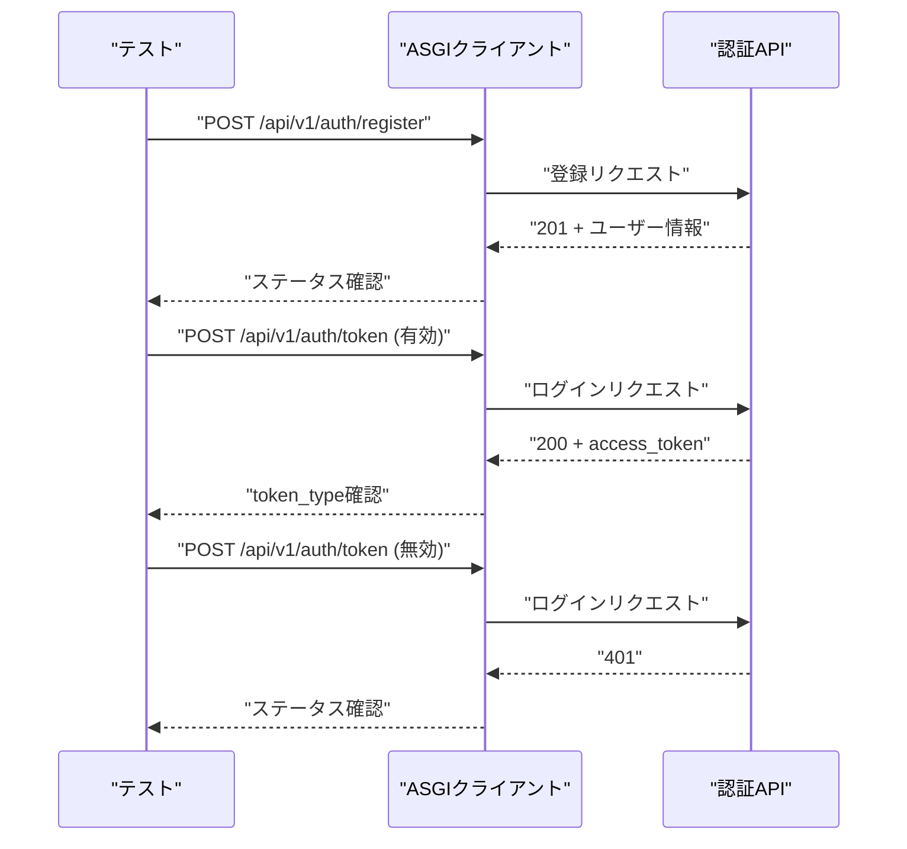
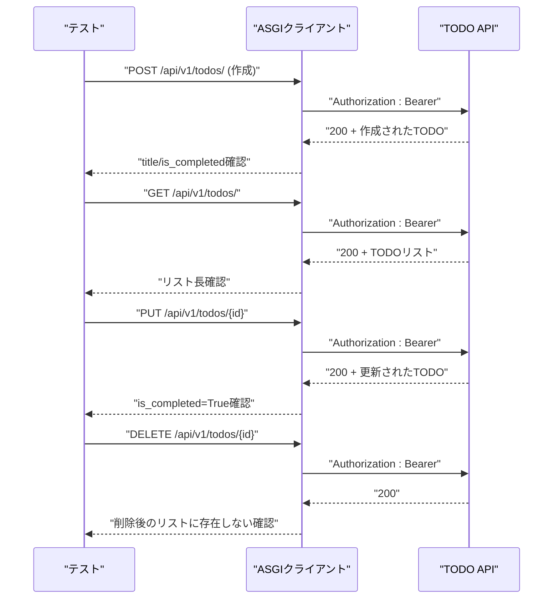
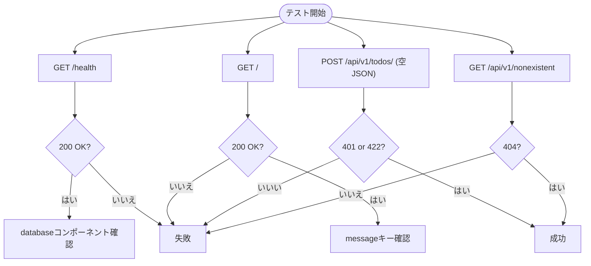
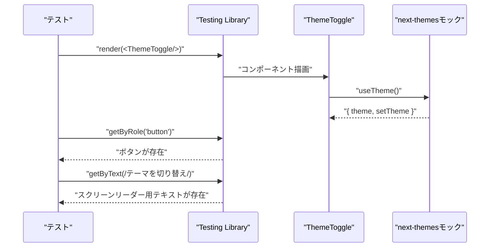
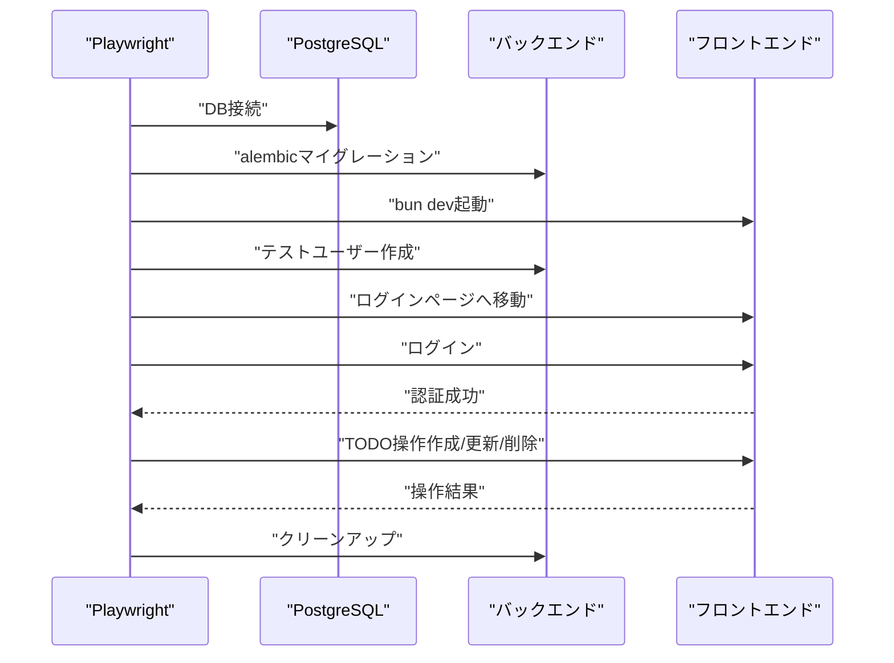
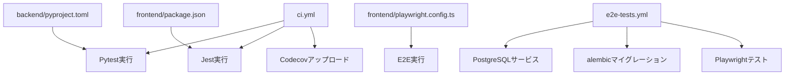

# テスト戦略

<cite>
**この文書で参照されるファイル**
- [README.md](file://README.md)
- [backend/pyproject.toml](file://backend/pyproject.toml)
- [backend/pytest.ini](file://backend/pytest.ini)
- [backend/tests/conftest.py](file://backend/tests/conftest.py)
- [backend/tests/test_auth.py](file://backend/tests/test_auth.py)
- [backend/tests/test_todos.py](file://backend/tests/test_todos.py)
- [backend/tests/test_errors.py](file://backend/tests/test_errors.py)
- [frontend/package.json](file://frontend/package.json)
- [frontend/jest.config.js](file://frontend/jest.config.js)
- [frontend/jest.setup.ts](file://frontend/jest.setup.ts)
- [frontend/src/__tests__/theme-toggle.test.tsx](file://frontend/src/__tests__/theme-toggle.test.tsx)
- [frontend/playwright.config.ts](file://frontend/playwright.config.ts)
- [frontend/e2e/tests/todos.spec.ts](file://frontend/e2e/tests/todos.spec.ts)
- [.github/workflows/ci.yml](file://.github/workflows/ci.yml)
- [.github/workflows/e2e-tests.yml](file://.github/workflows/e2e-tests.yml)
- [docs/auth_specification.md](file://docs/auth_specification.md)
</cite>

## 目次
1. [導入](#導入)
2. [プロジェクト構造](#プロジェクト構造)
3. [コアコンポーネント](#コアコンポーネント)
4. [アーキテクチャ概観](#アーキテクチャ概観)
5. [詳細コンポーネント分析](#詳細コンポーネント分析)
6. [依存関係分析](#依存関係分析)
7. [パフォーマンスに関する考慮](#パフォーマンスに関する考慮)
8. [トラブルシューティングガイド](#トラブルシューティングガイド)
9. [結論](#結論)
10. [付録](#付録)

## 導入
本プロジェクトは、認証、TODO管理、エラーハンドリング、E2Eテストを含む包括的なテスト戦略を実装しています。バックエンドにはPytest、フロントエンドにはJest、E2EテストにはPlaywrightが利用されています。本ドキュメントでは、それぞれのテスト設定、実装方法、具体的なテストケース、テストカバレッジの維持方法について詳しく説明します。

## プロジェクト構造
テストに関連する主な場所：
- バックエンド：backend/tests にPytestテストが配置され、Pytest設定は backend/pyproject.toml および backend/pytest.ini で管理されています。
- フロントエンド：frontend/src/__tests__ にJestテストが配置され、Jest設定は frontend/jest.config.js および frontend/jest.setup.ts で管理されています。
- E2Eテスト：frontend/e2e/tests にPlaywrightテストが配置され、設定は frontend/playwright.config.ts で管理されています。
- CI：.github/workflows/ci.yml および .github/workflows/e2e-tests.yml でテストとE2Eテストが実行されます。

**図の出典**
- [backend/pyproject.toml:33-47](file://backend/pyproject.toml#L33-L47)
- [backend/pytest.ini:1-4](file://backend/pytest.ini#L1-L4)
- [frontend/jest.config.js:1-31](file://frontend/jest.config.js#L1-L31)
- [frontend/jest.setup.ts:1-14](file://frontend/jest.setup.ts#L1-L14)
- [frontend/playwright.config.ts:1-65](file://frontend/playwright.config.ts#L1-L65)

**節の出典**
- [README.md:216-242](file://README.md#L216-L242)
- [backend/pyproject.toml:1-47](file://backend/pyproject.toml#L1-L47)
- [frontend/package.json:1-65](file://frontend/package.json#L1-L65)

## コアコンポーネント
- 認証テスト（backend/tests/test_auth.py）
  - ユーザー登録、重複登録、ログイン、無効資格情報でのログインをカバー。
- TODO管理テスト（backend/tests/test_todos.py）
  - 作成、一覧取得、更新、削除、件数取得（フィルタ付き）、認証なしアクセスをカバー。
- エラーハンドリングテスト（backend/tests/test_errors.py）
  - ヘルスチェック、ルートエンドポイント、バリデーションエラー、404エラーをカバー。
- フロントエンドテスト（frontend/src/__tests__/theme-toggle.test.tsx）
  - UIコンポーネントのレンダリング、アクセシビリティラベルを検証。
- E2Eテスト（frontend/e2e/tests/todos.spec.ts）
  - 認証後のTODO操作、前処理・後処理、レートリミット対策、クリーンアップを含む。

**節の出典**
- [backend/tests/test_auth.py:1-61](file://backend/tests/test_auth.py#L1-L61)
- [backend/tests/test_todos.py:1-159](file://backend/tests/test_todos.py#L1-L159)
- [backend/tests/test_errors.py:1-38](file://backend/tests/test_errors.py#L1-L38)
- [frontend/src/__tests__/theme-toggle.test.tsx:1-28](file://frontend/src/__tests__/theme-toggle.test.tsx#L1-L28)
- [frontend/e2e/tests/todos.spec.ts:133-171](file://frontend/e2e/tests/todos.spec.ts#L133-L171)

## アーキテクチャ概観
テストの全体像と統合ポイント：
- Pytest（バックエンド）：ASGI経由のHTTPクライアント、テストごとのデータベースリセット、レートリミット緩和。
- Jest（フロントエンド）：JSDOM環境、TypeScript変換、カバレッジ収集、Next.js/Navigationモック。
- Playwright（E2E）：Chromium、テストサーバー起動、レートリミット対策、HTMLレポート出力。
- CI：GitHub Actionsでバックエンドテスト、フロントエンドテスト、E2Eテストを実行し、カバレッジをCodecovに送信。

**図の出典**
- [backend/tests/conftest.py:18-53](file://backend/tests/conftest.py#L18-L53)
- [backend/pyproject.toml:33-47](file://backend/pyproject.toml#L33-L47)
- [frontend/jest.config.js:1-31](file://frontend/jest.config.js#L1-L31)
- [frontend/playwright.config.ts:1-65](file://frontend/playwright.config.ts#L1-L65)
- [.github/workflows/ci.yml:117-179](file://.github/workflows/ci.yml#L117-L179)

## 詳細コンポーネント分析

### 認証テスト（backend/tests/test_auth.py）
- 認証フローの要点
  - 登録：201 Created、ユーザー名とIDの存在を確認。
  - 重複登録：400 Bad Request。
  - ログイン：200 OK、access_token と token_type=bearer。
  - 無効資格情報：401 Unauthorized。
- 実装ポイント
  - 非同期テスト（asyncio_mode）。
  - 共通fixture（setup_db、client）の活用。

**図の出典**
- [backend/tests/test_auth.py:4-61](file://backend/tests/test_auth.py#L4-L61)
- [backend/tests/conftest.py:39-53](file://backend/tests/conftest.py#L39-L53)

**節の出典**
- [backend/tests/test_auth.py:1-61](file://backend/tests/test_auth.py#L1-L61)
- [backend/tests/conftest.py:1-53](file://backend/tests/conftest.py#L1-L53)

### TODO管理テスト（backend/tests/test_todos.py）
- 業務フローの要点
  - 作成：200 OK、title、is_completed=False。
  - 一覧取得：200 OK、リストの長さ。
  - 更新：200 OK、is_completed=True。
  - 削除：200 OK、削除後のリストに存在しない。
  - 件数取得：200 OK、total。
  - 認証なしアクセス：401 Unauthorized。
- 実装ポイント
  - 認証トークン取得fixture（auth_token）。
  - 各テストでBearerトークンをAuthorizationヘッダーに設定。

**図の出典**
- [backend/tests/test_todos.py:21-159](file://backend/tests/test_todos.py#L21-L159)

**節の出典**
- [backend/tests/test_todos.py:1-159](file://backend/tests/test_todos.py#L1-L159)

### エラーハンドリングテスト（backend/tests/test_errors.py）
- エラーハンドリングの要点
  - ヘルスチェック：200 OK、status=ok、databaseコンポーネント。
  - ルートエンドポイント：200 OK、message。
  - バリデーションエラー：401または422（認証エラーまたはスキーマエラー）。
  - 404エラー：存在しないエンドポイント。
- 実装ポイント
  - 非同期テスト。
  - 認証ヘッダーを含むリクエストでバリデーションエラーを再現。

**図の出典**
- [backend/tests/test_errors.py:4-38](file://backend/tests/test_errors.py#L4-L38)

**節の出典**
- [backend/tests/test_errors.py:1-38](file://backend/tests/test_errors.py#L1-L38)

### フロントエンドテスト（frontend/src/__tests__/theme-toggle.test.tsx）
- テストの要点
  - ThemeToggleコンポーネントがボタンを正しくレンダリング。
  - スクリーンリーダー用のラベルが適切に表示。
  - next-themes と next/navigation のモック。
- 実装ポイント
  - Jest設定（moduleNameMapper、transform、setupFilesAfterEnv）。
  - jest.setup.ts でモックを定義。

**図の出典**
- [frontend/src/__tests__/theme-toggle.test.tsx:1-28](file://frontend/src/__tests__/theme-toggle.test.tsx#L1-L28)
- [frontend/jest.config.js:5-8](file://frontend/jest.config.js#L5-L8)
- [frontend/jest.setup.ts:4-13](file://frontend/jest.setup.ts#L4-L13)

**節の出典**
- [frontend/src/__tests__/theme-toggle.test.tsx:1-28](file://frontend/src/__tests__/theme-toggle.test.tsx#L1-L28)
- [frontend/jest.config.js:1-31](file://frontend/jest.config.js#L1-L31)
- [frontend/jest.setup.ts:1-14](file://frontend/jest.setup.ts#L1-L14)

### E2Eテスト（frontend/e2e/tests/todos.spec.ts）
- E2Eフローの要点
  - 認証後のTODO操作（作成、更新、削除）。
  - beforeEachでテストユーザー作成、ログイン、既存TODOのクリーンアップ。
  - レートリミット対策として待機時間を設ける。
  - afterEachでクリーンアップ（必要に応じて）。
- 実装ポイント
  - Playwright設定（webServer、workers=1、reporter=html）。
  - GitHub ActionsでPostgreSQLサービス、DBマイグレーション、バックエンド起動。

**図の出典**
- [frontend/playwright.config.ts:59-65](file://frontend/playwright.config.ts#L59-L65)
- [frontend/e2e/tests/todos.spec.ts:133-171](file://frontend/e2e/tests/todos.spec.ts#L133-L171)
- [.github/workflows/e2e-tests.yml:56-65](file://.github/workflows/e2e-tests.yml#L56-L65)

**節の出典**
- [frontend/e2e/tests/todos.spec.ts:133-171](file://frontend/e2e/tests/todos.spec.ts#L133-L171)
- [frontend/playwright.config.ts:1-65](file://frontend/playwright.config.ts#L1-L65)
- [.github/workflows/e2e-tests.yml:1-65](file://.github/workflows/e2e-tests.yml#L1-L65)

## 依存関係分析
- 設定とテストの依存関係
  - backend/pyproject.toml でpytest、pytest-asyncio、pytest-cov、httpxが定義され、Pytest設定が有効になります。
  - frontend/package.json でjest、jest-environment-jsdom、ts-jest、@testing-library/jest-dom、@testing-library/react、@testing-library/react-hooksが定義され、Jest設定が適用されます。
  - frontend/playwright.config.ts でE2E設定が定義され、GitHub Actionsで実行されます。
- CIでの統合
  - .github/workflows/ci.yml でフロントエンドテスト（test:coverage）とカバレッジアップロードが実施。
  - .github/workflows/e2e-tests.yml でPostgreSQLサービス、DBマイグレーション、Playwrightテストが実施。

**図の出典**
- [backend/pyproject.toml:24-31](file://backend/pyproject.toml#L24-L31)
- [frontend/package.json:17-55](file://frontend/package.json#L17-L55)
- [frontend/playwright.config.ts:1-65](file://frontend/playwright.config.ts#L1-L65)
- [.github/workflows/ci.yml:117-179](file://.github/workflows/ci.yml#L117-L179)
- [.github/workflows/e2e-tests.yml:13-65](file://.github/workflows/e2e-tests.yml#L13-L65)

**節の出典**
- [backend/pyproject.toml:1-47](file://backend/pyproject.toml#L1-L47)
- [frontend/package.json:1-65](file://frontend/package.json#L1-L65)
- [.github/workflows/ci.yml:117-179](file://.github/workflows/ci.yml#L117-L179)
- [.github/workflows/e2e-tests.yml:1-65](file://.github/workflows/e2e-tests.yml#L1-L65)

## パフォーマンスに関する考慮
- レートリミット対策
  - Pytestのconftest.pyで RATE_LIMIT_* 環境変数を緩和し、テスト中のレート制限を回避します。
  - E2Eテストでは、Playwright設定でworkers=1、actionTimeout/expect.timeoutを調整し、安定性を確保します。
- DBリセットの最適化
  - 同期的なDBリセット（_sync_reset_database）により、非同期DB接続の問題を回避しながらテストごとにクリーンな状態を保ちます。
- CIでの並列化のバランス
  - E2Eテストではworkers=1に設定し、レートリミットやDB接続の競合を防ぎます。

**節の出典**
- [backend/tests/conftest.py:1-7](file://backend/tests/conftest.py#L1-L7)
- [backend/tests/conftest.py:18-44](file://backend/tests/conftest.py#L18-L44)
- [frontend/playwright.config.ts:19-31](file://frontend/playwright.config.ts#L19-L31)

## トラブルシューティングガイド
- 認証エラー（401）
  - 無効な資格情報でのログインや、認証なしでのTODOアクセスが該当します。テストで401を期待するように設計されています。
- 重複ユーザー登録（400）
  - 同じユーザー名での二度目の登録が該当します。バリデーションエラーではなく、ビジネスロジックエラーとして400を期待します。
- バリデーションエラー（422）または認証エラー（401）
  - 空のリクエストボディでのTODO作成は、スキーマエラーまたは認証エラーのいずれかを返す可能性があります。
- E2Eテストの失敗
  - PostgreSQLサービスの準備、alembicマイグレーション、バックエンド起動の順序を確認してください。また、レートリミット対策としての待機時間を確認してください。

**節の出典**
- [backend/tests/test_auth.py:52-61](file://backend/tests/test_auth.py#L52-L61)
- [backend/tests/test_auth.py:17-30](file://backend/tests/test_auth.py#L17-L30)
- [backend/tests/test_errors.py:22-31](file://backend/tests/test_errors.py#L22-L31)
- [.github/workflows/e2e-tests.yml:56-65](file://.github/workflows/e2e-tests.yml#L56-L65)

## 結論
本プロジェクトでは、Pytestによるバックエンドテスト、Jestによるフロントエンドテスト、PlaywrightによるE2Eテストを通じて、認証、TODO管理、エラーハンドリングの品質を守っています。設定はCIと連携しており、テストカバレッジも継続的に維持されています。レートリミット対策、DBリセット、モックの活用により、安定したテスト環境が実現されています。

## 付録
- 認証仕様書（参考）
  - JWT認証方式、APIエンドポイント、セキュリティ対策、実装フェーズが記載されています。
- CIワークフロー（参考）
  - GitHub Actionsでのテスト実行、カバレッジアップロード、E2Eテストの実行手順が記載されています。

**節の出典**
- [docs/auth_specification.md:1-65](file://docs/auth_specification.md#L1-L65)
- [.github/workflows/ci.yml:117-179](file://.github/workflows/ci.yml#L117-L179)
- [.github/workflows/e2e-tests.yml:1-65](file://.github/workflows/e2e-tests.yml#L1-L65)