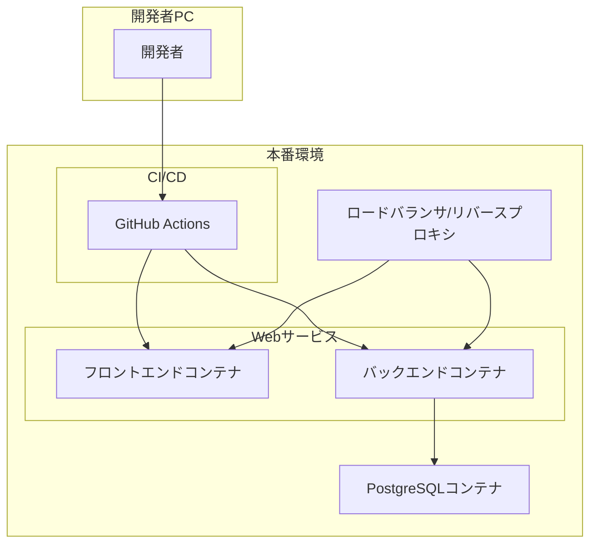
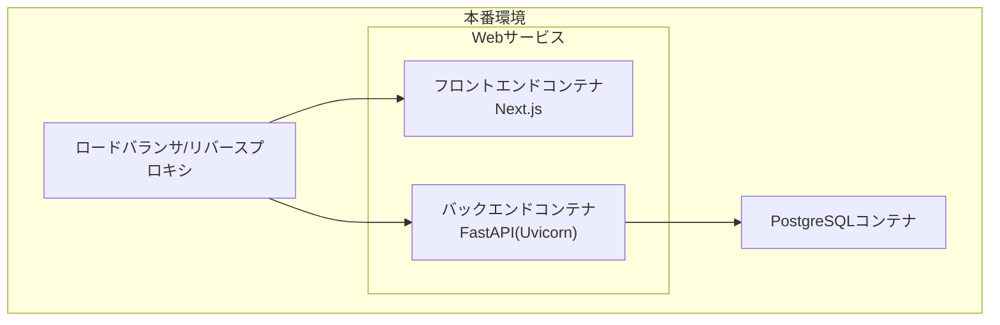
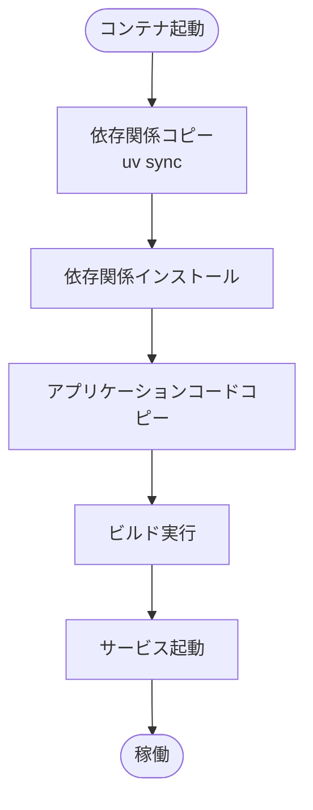
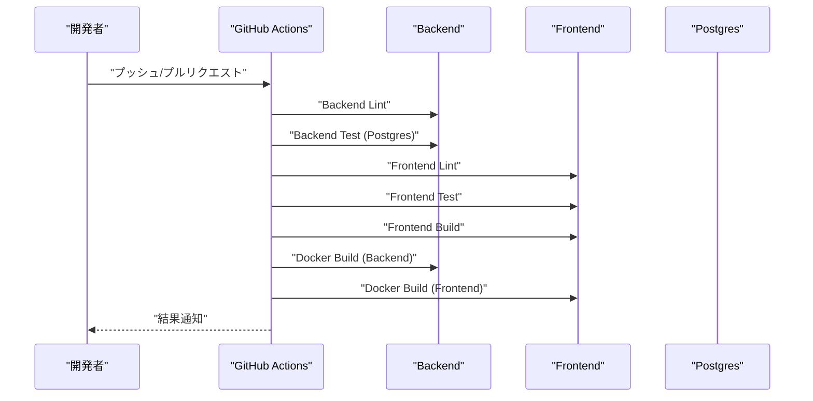
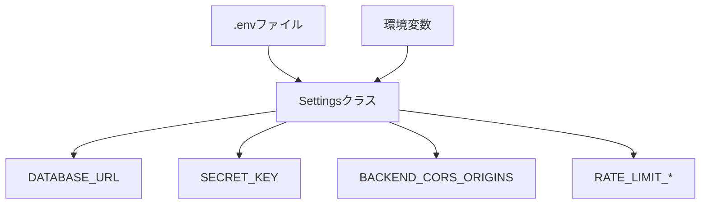
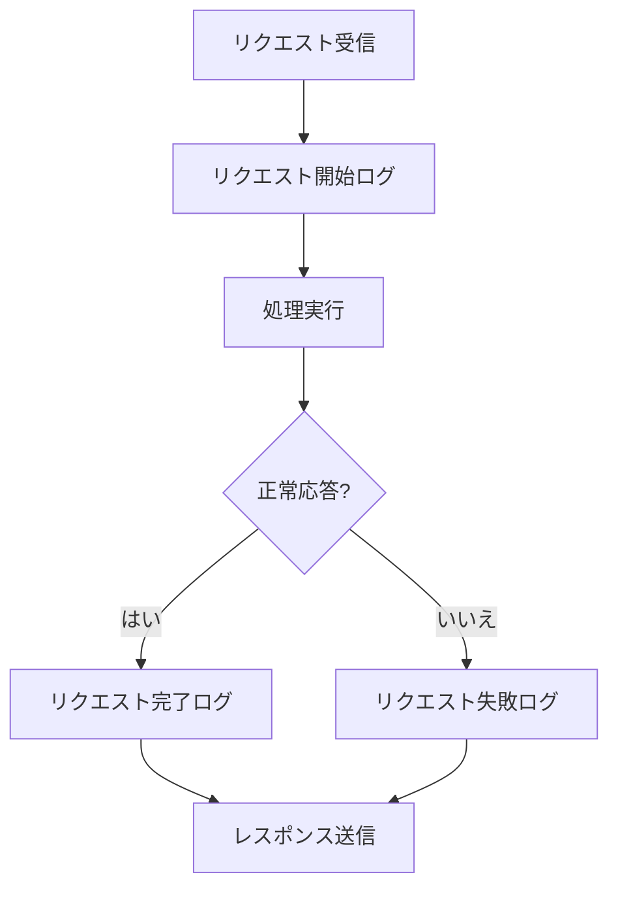
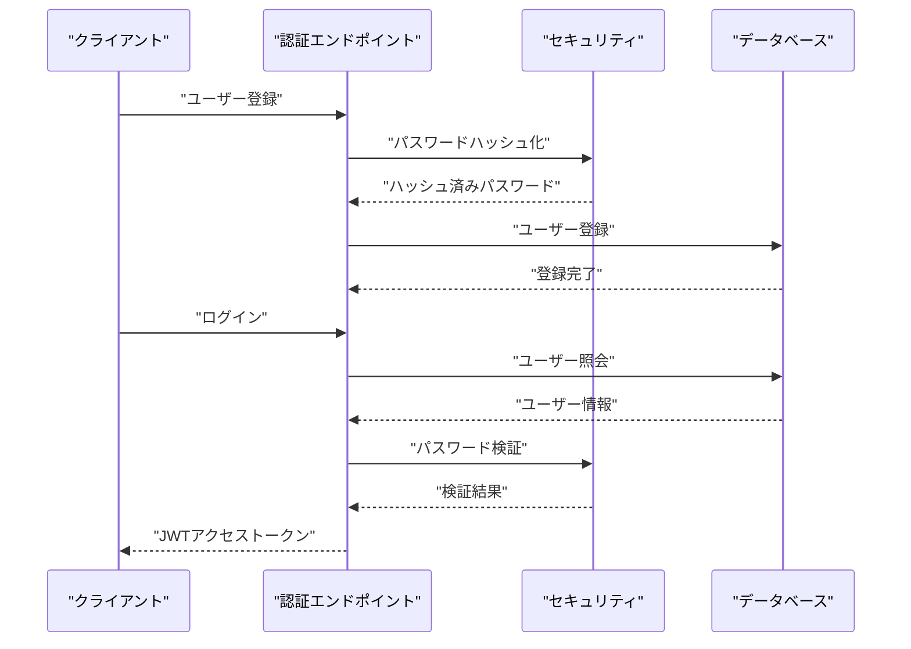
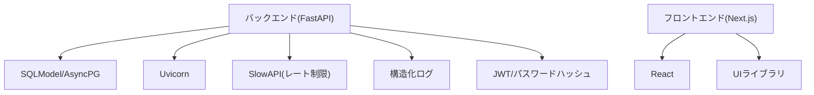

# デプロイメントガイド

<cite>
**参照されたファイル一覧**
- [docker-compose.yml](file://docker-compose.yml)
- [backend/Dockerfile](file://docker/backend/Dockerfile)
- [frontend/Dockerfile](file://docker/frontend/Dockerfile)
- [.github/workflows/ci.yml](file://.github/workflows/ci.yml)
- [backend/pyproject.toml](file://backend/pyproject.toml)
- [frontend/package.json](file://frontend/package.json)
- [backend/app/core/config.py](file://backend/app/core/config.py)
- [backend/app/main.py](file://backend/app/main.py)
- [backend/app/core/logging.py](file://backend/app/core/logging.py)
- [backend/app/middleware/logging.py](file://backend/app/middleware/logging.py)
- [backend/app/middleware/error_handler.py](file://backend/app/middleware/error_handler.py)
- [backend/app/core/security.py](file://backend/app/core/security.py)
- [backend/app/api/api_v1/endpoints/auth.py](file://backend/app/api/api_v1/endpoints/auth.py)
- [backend/app/api/api_v1/endpoints/todos.py](file://backend/app/api/api_v1/endpoints/todos.py)
- [backend/app/models/todo.py](file://backend/app/models/todo.py)
- [backend/app/models/user.py](file://backend/app/models/user.py)
- [backend/app/schemas/todo.py](file://backend/app/schemas/todo.py)
- [backend/app/schemas/user.py](file://backend/app/schemas/user.py)
</cite>

## 目次
1. [はじめに](#はじめに)
2. [プロジェクト構造](#プロジェクト構造)
3. [コアコンポーネント](#コアコンポーネント)
4. [アーキテクチャ概要](#アーキテクチャ概要)
5. [詳細コンポーネント分析](#詳細コンポーネント分析)
6. [依存関係分析](#依存関係分析)
7. [パフォーマンス考慮事項](#パフォーマンス考慮事項)
8. [トラブルシューティングガイド](#トラブルシューティングガイド)
9. [結論](#結論)
10. [付録](#付録)

## はじめに
本ガイドでは、Todoアプリケーションの本格的なデプロイメント手順を説明します。具体的には、Dockerコンテナ化、docker-composeによるサービス構成、GitHub ActionsによるCI/CDパイプラインの構築方法を詳細に解説します。また、開発環境と本番環境の違い、環境変数の設定、ロギングと監視の設定、セキュリティ上の考慮事項についても網羅的に取り上げます。

## プロジェクト構造
本プロジェクトは、バックエンド(FastAPI)、フロントエンド(Next.js)、PostgreSQL、およびCI/CDパイプラインから構成されます。全体の構成は以下の通りです：

**図の出典**
- [docker-compose.yml:1-16](file://docker-compose.yml#L1-L16)
- [backend/app/main.py:128-132](file://backend/app/main.py#L128-L132)

**節の出典**
- [docker-compose.yml:1-16](file://docker-compose.yml#L1-L16)
- [backend/app/main.py:128-132](file://backend/app/main.py#L128-L132)

## コアコンポーネント
本アプリケーションのデプロイメントにおいて最も重要なコンポーネントは以下の通りです：

- Dockerイメージ構築用Dockerfile（バックエンド/フロントエンド）
- docker-composeによるサービス定義
- GitHub ActionsによるCI/CDパイプライン
- 設定管理（環境変数ベース）
- ロギングと監視（構造化ログ、ミドルウェア）
- セキュリティ（JWT認証、CORS設定）

**節の出典**
- [backend/Dockerfile:1-10](file://docker/backend/Dockerfile#L1-L10)
- [frontend/Dockerfile:1-8](file://docker/frontend/Dockerfile#L1-L8)
- [.github/workflows/ci.yml:1-200](file://.github/workflows/ci.yml#L1-L200)
- [backend/app/core/config.py:1-73](file://backend/app/core/config.py#L1-L73)
- [backend/app/core/logging.py:1-36](file://backend/app/core/logging.py#L1-L36)
- [backend/app/middleware/logging.py:1-67](file://backend/app/middleware/logging.py#L1-L67)
- [backend/app/core/security.py:1-35](file://backend/app/core/security.py#L1-L35)

## アーキテクチャ概要
本アプリケーションの本番環境における基本的なアーキテクチャは以下の通りです。フロントエンドコンテナがバックエンドAPIを呼び出し、バックエンドはPostgreSQLにアクセスします。GitHub ActionsがCI/CDパイプラインとして機能し、イメージをビルドして本番環境に展開します。

**図の出典**
- [docker-compose.yml:1-16](file://docker-compose.yml#L1-L16)
- [backend/app/main.py:128-132](file://backend/app/main.py#L128-L132)

**節の出典**
- [docker-compose.yml:1-16](file://docker-compose.yml#L1-L16)
- [backend/app/main.py:128-132](file://backend/app/main.py#L128-L132)

## 詳細コンポーネント分析

### Dockerコンテナ化
- バックエンドコンテナ
  - Python 3.10 slimイメージをベースに、uvによる依存関係管理とパッケージ同期を実施。
  - UvicornでFastAPIアプリケーションをホストし、8000番ポートを公開。
  - 参考: [backend/Dockerfile:1-10](file://docker/backend/Dockerfile#L1-L10)

- フロントエンドコンテナ
  - BunをベースとしたNode.js互換ランタイムを使用。
  - Next.jsのビルドプロセスを実施し、本番用の静的アセットを生成。
  - 参考: [frontend/Dockerfile:1-8](file://docker/frontend/Dockerfile#L1-L8)

- docker-composeによるサービス構成
  - PostgreSQLコンテナをdbサービスとして定義。
  - 環境変数でDB接続情報を設定し、永続ボリュームでデータを保持。
  - 参考: [docker-compose.yml:1-16](file://docker-compose.yml#L1-L16)

**図の出典**
- [backend/Dockerfile:5-9](file://docker/backend/Dockerfile#L5-L9)
- [frontend/Dockerfile:3-7](file://docker/frontend/Dockerfile#L3-L7)

**節の出典**
- [backend/Dockerfile:1-10](file://docker/backend/Dockerfile#L1-L10)
- [frontend/Dockerfile:1-8](file://docker/frontend/Dockerfile#L1-L8)
- [docker-compose.yml:1-16](file://docker-compose.yml#L1-L16)

### GitHub ActionsによるCI/CDパイプライン
- ワークフロー概要
  - push/pull_requestトリガーに対応し、複数ジョブでLint、テスト、ビルド、Dockerイメージビルドを実施。
  - 参考: [.github/workflows/ci.yml:1-200](file://.github/workflows/ci.yml#L1-L200)

- 各ジョブの役割
  - Backend Lint: Pythonの静的解析（ruff）を実施。
  - Backend Test: Postgresサービスを利用した統合テスト実施。
  - Frontend Lint: ESLintによる静的解析。
  - Frontend Test: Jestによる単体・カバレッジテスト。
  - Frontend Build: Next.jsのビルド実施。
  - Docker Build: Backend/ FrontendのDockerイメージをビルド。

**図の出典**
- [.github/workflows/ci.yml:9-200](file://.github/workflows/ci.yml#L9-L200)

**節の出典**
- [.github/workflows/ci.yml:1-200](file://.github/workflows/ci.yml#L1-L200)

### 環境変数と設定管理
- 設定クラス（Settings）
  - 環境変数経由でデータベース接続文字列、JWTシークレットキー、CORSオリジン、レート制限などを管理。
  - 本番環境では必須項目を環境変数で設定する必要がある。
  - 参考: [backend/app/core/config.py:1-73](file://backend/app/core/config.py#L1-L73)

- 設定の読み込み順序
  - .envファイルから設定を読み込み、上書き可能な環境変数を適用。
  - 参考: [backend/app/core/config.py:67-70](file://backend/app/core/config.py#L67-L70)

- 依存関係と設定
  - pyproject.tomlで依存関係を定義。
  - 参考: [backend/pyproject.toml:1-47](file://backend/pyproject.toml#L1-L47)
  - package.jsonでフロントエンド依存関係を定義。
  - 参考: [frontend/package.json:1-65](file://frontend/package.json#L1-L65)

**図の出典**
- [backend/app/core/config.py:42-65](file://backend/app/core/config.py#L42-L65)

**節の出典**
- [backend/app/core/config.py:1-73](file://backend/app/core/config.py#L1-L73)
- [backend/pyproject.toml:1-47](file://backend/pyproject.toml#L1-L47)
- [frontend/package.json:1-65](file://frontend/package.json#L1-L65)

### ロギングと監視
- 構造化ログ
  - python-json-loggerを使用し、JSONフォーマットでログを出力。
  - 参考: [backend/app/core/logging.py:1-36](file://backend/app/core/logging.py#L1-L36)

- リクエストログミドルウェア
  - HTTPリクエスト/レスポンスの開始・完了・エラーを記録し、処理時間も計測。
  - 参考: [backend/app/middleware/logging.py:1-67](file://backend/app/middleware/logging.py#L1-L67)

- 例外ハンドリング
  - 入力バリデーションエラー、HTTP例外、一般例外、レート制限超過を一貫した形式で処理。
  - 参考: [backend/app/middleware/error_handler.py:1-149](file://backend/app/middleware/error_handler.py#L1-L149)

**図の出典**
- [backend/app/middleware/logging.py:15-66](file://backend/app/middleware/logging.py#L15-L66)

**節の出典**
- [backend/app/core/logging.py:1-36](file://backend/app/core/logging.py#L1-L36)
- [backend/app/middleware/logging.py:1-67](file://backend/app/middleware/logging.py#L1-L67)
- [backend/app/middleware/error_handler.py:1-149](file://backend/app/middleware/error_handler.py#L1-L149)

### セキュリティ
- 認証
  - Argon2によるパスワードハッシュ化、JWTによる認証。
  - 参考: [backend/app/core/security.py:1-35](file://backend/app/core/security.py#L1-L35)

- CORS設定
  - 本番環境ではBACKEND_CORS_ORIGINSを環境変数で厳密に設定。
  - 参考: [backend/app/main.py:106-115](file://backend/app/main.py#L106-L115)

- APIエンドポイント
  - 認証エンドポイント（登録/ログイン）と、認可されたユーザーのみがアクセス可能なTODO管理エンドポイント。
  - 参考: [backend/app/api/api_v1/endpoints/auth.py:1-53](file://backend/app/api/api_v1/endpoints/auth.py#L1-L53)
  - 参考: [backend/app/api/api_v1/endpoints/todos.py:1-102](file://backend/app/api/api_v1/endpoints/todos.py#L1-L102)

**図の出典**
- [backend/app/api/api_v1/endpoints/auth.py:17-52](file://backend/app/api/api_v1/endpoints/auth.py#L17-L52)
- [backend/app/core/security.py:10-27](file://backend/app/core/security.py#L10-L27)

**節の出典**
- [backend/app/core/security.py:1-35](file://backend/app/core/security.py#L1-L35)
- [backend/app/main.py:106-115](file://backend/app/main.py#L106-L115)
- [backend/app/api/api_v1/endpoints/auth.py:1-53](file://backend/app/api/api_v1/endpoints/auth.py#L1-L53)
- [backend/app/api/api_v1/endpoints/todos.py:1-102](file://backend/app/api/api_v1/endpoints/todos.py#L1-L102)

### 開発環境 vs 本番環境
- 開発環境
  - 自動マイグレーション（開発時のみテーブル作成）、デフォルトのCORSオリジン、簡易な認証設定。
  - 参考: [backend/app/main.py:38-42](file://backend/app/main.py#L38-L42)
  - 参考: [backend/app/core/config.py:56-60](file://backend/app/core/config.py#L56-L60)

- 本番環境
  - 必須環境変数（SECRET_KEY、BACKEND_CORS_ORIGINSなど）を設定。
  - CORSオリジンを厳密に制御し、レート制限を適切に設定。
  - 参考: [backend/app/main.py:106-107](file://backend/app/main.py#L106-L107)
  - 参考: [backend/app/core/config.py:50-65](file://backend/app/core/config.py#L50-L65)

**節の出典**
- [backend/app/main.py:38-42](file://backend/app/main.py#L38-L42)
- [backend/app/main.py:106-107](file://backend/app/main.py#L106-L107)
- [backend/app/core/config.py:50-65](file://backend/app/core/config.py#L50-L65)

## 依存関係分析
本アプリケーションの主要な依存関係は以下の通りです。バックエンドはSQLModel/AsyncPG、FastAPI、Uvicorn、SlowAPI（レート制限）に依存しています。フロントエンドはNext.js、React、各種UIライブラリに依存しています。

**図の出典**
- [backend/pyproject.toml:7-22](file://backend/pyproject.toml#L7-L22)
- [frontend/package.json:18-36](file://frontend/package.json#L18-L36)

**節の出典**
- [backend/pyproject.toml:1-47](file://backend/pyproject.toml#L1-L47)
- [frontend/package.json:1-65](file://frontend/package.json#L1-L65)

## パフォーマンス考慮事項
- レスポンス時間の計測
  - ロギングミドルウェアによりリクエスト処理時間（X-Process-Time）を計測。
  - 参考: [backend/app/middleware/logging.py:34-48](file://backend/app/middleware/logging.py#L34-L48)

- レート制限
  - SlowAPIによるレート制限を設定し、認証・登録エンドポイントに適用。
  - 参考: [backend/app/api/api_v1/endpoints/auth.py:18-35](file://backend/app/api/api_v1/endpoints/auth.py#L18-L35)
  - 参考: [backend/app/core/config.py:63-65](file://backend/app/core/config.py#L63-L65)

- DB接続
  - 非同期接続（asyncpg/sqlmodel）により、I/Oを効率化。
  - 参考: [backend/app/core/config.py:44-48](file://backend/app/core/config.py#L44-L48)

**節の出典**
- [backend/app/middleware/logging.py:34-48](file://backend/app/middleware/logging.py#L34-L48)
- [backend/app/api/api_v1/endpoints/auth.py:18-35](file://backend/app/api/api_v1/endpoints/auth.py#L18-L35)
- [backend/app/core/config.py:44-48](file://backend/app/core/config.py#L44-L48)
- [backend/app/core/config.py:63-65](file://backend/app/core/config.py#L63-L65)

## トラブルシューティングガイド
- 起動時のエラー
  - CORS設定ミス：本番環境でBACKEND_CORS_ORIGINSが設定されていない場合にRuntimeErrorが発生。
  - 参考: [backend/app/main.py:106-107](file://backend/app/main.py#L106-L107)

- 認証エラー
  - 401 Unauthorized：ユーザー名またはパスワードが不正。
  - 参考: [backend/app/api/api_v1/endpoints/auth.py:42-47](file://backend/app/api/api_v1/endpoints/auth.py#L42-L47)

- DB接続エラー
  - /healthエンドポイントでデータベース接続チェックを行い、エラー時はログに記録。
  - 参考: [backend/app/main.py:146-159](file://backend/app/main.py#L146-L159)

- 例外処理
  - 一般的な例外は500エラーとして一貫して処理され、ログに詳細が記録される。
  - 参考: [backend/app/middleware/error_handler.py:79-104](file://backend/app/middleware/error_handler.py#L79-L104)

**節の出典**
- [backend/app/main.py:106-107](file://backend/app/main.py#L106-L107)
- [backend/app/api/api_v1/endpoints/auth.py:42-47](file://backend/app/api/api_v1/endpoints/auth.py#L42-L47)
- [backend/app/main.py:146-159](file://backend/app/main.py#L146-L159)
- [backend/app/middleware/error_handler.py:79-104](file://backend/app/middleware/error_handler.py#L79-L104)

## 結論
本ガイドでは、TodoアプリケーションのDockerコンテナ化、docker-composeによるサービス構成、GitHub ActionsによるCI/CDパイプラインの構築方法を詳細に解説しました。開発環境と本番環境の違い、環境変数の設定、ロギングと監視、セキュリティ上の考慮事項についても網羅的に述べました。これらの手順に従うことで、安定した本番環境へのデプロイが可能になります。

## 付録
- API仕様
  - ScalarによるAPIリファレンスが提供されている。
  - 参考: [backend/app/main.py:121-126](file://backend/app/main.py#L121-L126)

- DBモデル
  - TodoとUserモデル、および関連付けられたスキーマ定義。
  - 参考: [backend/app/models/todo.py:1-25](file://backend/app/models/todo.py#L1-L25)
  - 参考: [backend/app/models/user.py:1-16](file://backend/app/models/user.py#L1-L16)
  - 参考: [backend/app/schemas/todo.py:1-41](file://backend/app/schemas/todo.py#L1-L41)
  - 参考: [backend/app/schemas/user.py:1-12](file://backend/app/schemas/user.py#L1-L12)

**節の出典**
- [backend/app/main.py:121-126](file://backend/app/main.py#L121-L126)
- [backend/app/models/todo.py:1-25](file://backend/app/models/todo.py#L1-L25)
- [backend/app/models/user.py:1-16](file://backend/app/models/user.py#L1-L16)
- [backend/app/schemas/todo.py:1-41](file://backend/app/schemas/todo.py#L1-L41)
- [backend/app/schemas/user.py:1-12](file://backend/app/schemas/user.py#L1-L12)