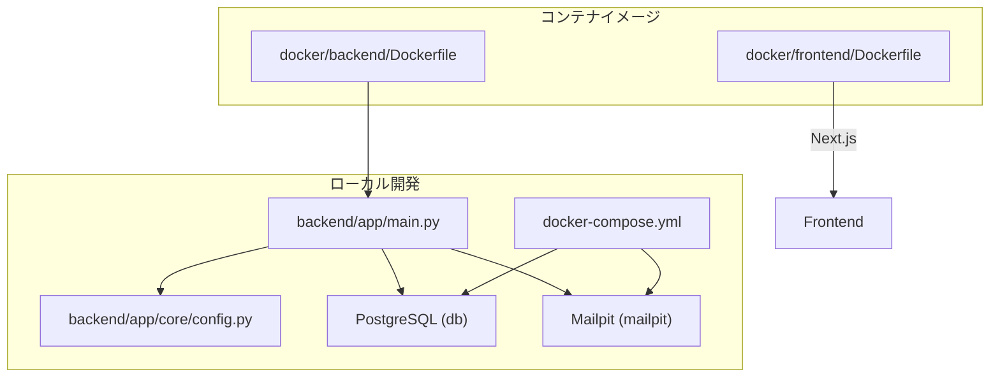
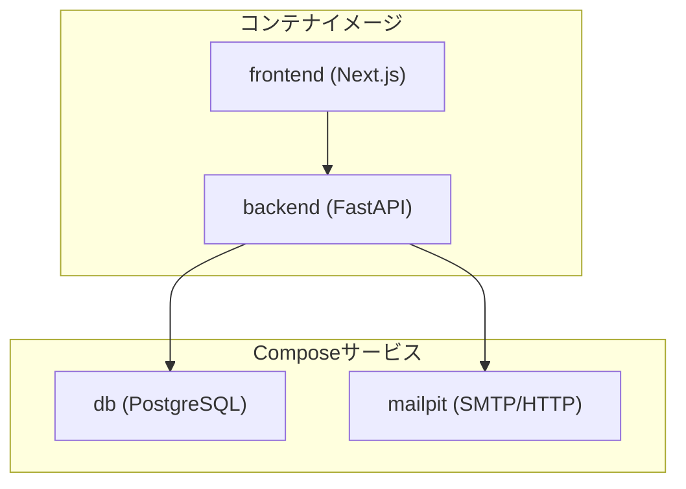
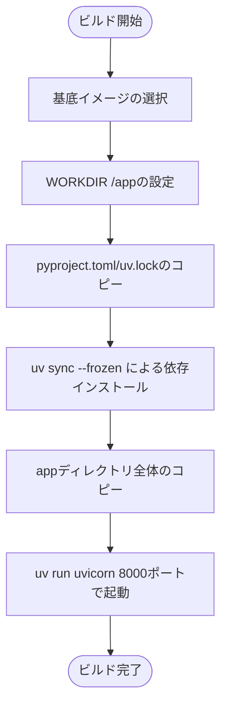
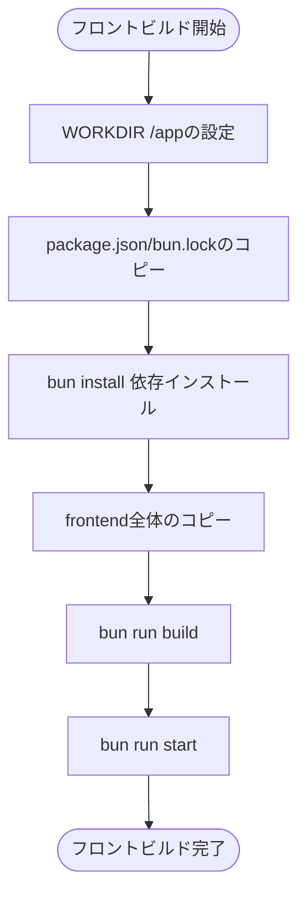
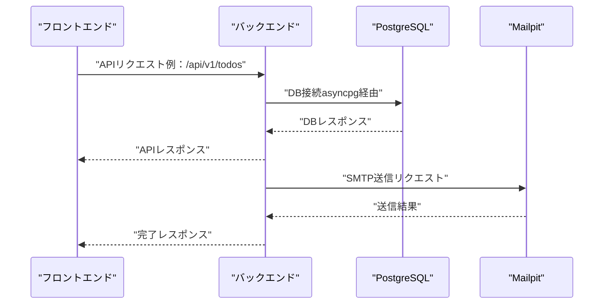
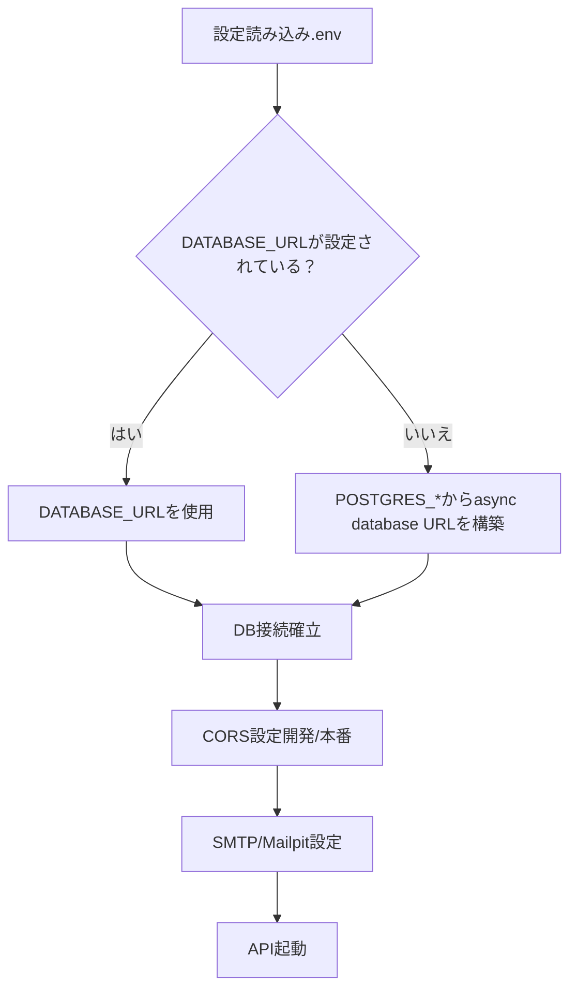
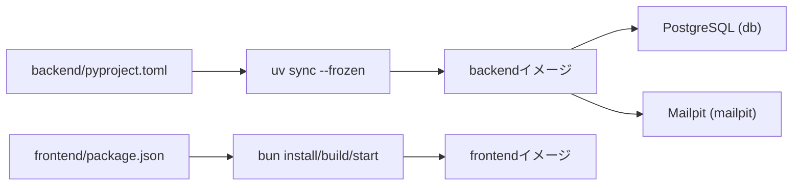

# Dockerコンテナ化

<cite>
**本文で参照するファイル一覧**
- [docker/backend/Dockerfile](file://docker/backend/Dockerfile)
- [docker/frontend/Dockerfile](file://docker/frontend/Dockerfile)
- [docker-compose.yml](file://docker-compose.yml)
- [backend/pyproject.toml](file://backend/pyproject.toml)
- [frontend/package.json](file://frontend/package.json)
- [backend/app/main.py](file://backend/app/main.py)
- [backend/app/core/config.py](file://backend/app/core/config.py)
- [frontend/vercel.json](file://frontend/vercel.json)
</cite>

## 更新概要
**変更内容**
- Dockerfileの最適化により、ビルドパフォーマンスが向上しました
- WORKDIRの追加により、ファイルコピーのパスが効率的になりました
- docker-compose.ymlの再起動戦略とボリューム管理が強化されました

## 目次
1. [はじめに](#はじめに)
2. [プロジェクト構造](#プロジェクト構造)
3. [コアコンポーネント](#コアコンポーネント)
4. [アーキテクチャ概要](#アーキテクチャ概要)
5. [詳細コンポーネント分析](#詳細コンポーネント分析)
6. [依存関係分析](#依存関係分析)
7. [パフォーマンスに関する考慮事項](#パフォーマンスに関する考慮事項)
8. [トラブルシューティングガイド](#トラブルシューティングガイド)
9. [結論](#結論)
10. [付録](#付録)

## はじめに
本ドキュメントは、TodoプロジェクトにおけるDockerコンテナ化の仕組みと設定方法を網羅的に解説します。バックエンド（Python/FastAPI）とフロントエンド（Next.js/Bun）それぞれのDockerfileの内容、docker-compose.ymlでのサービス構成、コンテナ間通信設定、ビルド手順、実行方法、ボリュームマウント、環境変数の渡し方、コンテナライフサイクル管理、およびトラブルシューティング方法について、具体的な例とともに説明します。

**更新** Dockerfileの最適化により、ビルドパフォーマンスが向上し、ファイルコピーのパスが効率的になりました。

## プロジェクト構造
Docker関連の設定は以下の場所に配置されています：
- docker/backend/Dockerfile：バックエンド（FastAPI）コンテナイメージのビルド定義
- docker/frontend/Dockerfile：フロントエンド（Next.js）コンテナイメージのビルド定義
- docker-compose.yml：PostgreSQLデータベース、メール開発サーバー（Mailpit）のサービス定義とボリューム設定
- backend/pyproject.toml：バックエンドの依存関係定義
- frontend/package.json：フロントエンドの依存関係定義
- backend/app/main.py：バックエンドのエントリーポイント（FastAPIアプリケーション）
- backend/app/core/config.py：バックエンドの設定（環境変数ベースのDB接続、CORS、レート制限、メール設定など）
- frontend/vercel.json：Vercelでのビルド設定（本ドキュメントではローカル開発向けの解説に使用）

**図の出典**
- [docker-compose.yml:1-29](file://docker-compose.yml#L1-L29)
- [docker/backend/Dockerfile:1-10](file://docker/backend/Dockerfile#L1-L10)
- [docker/frontend/Dockerfile:1-8](file://docker/frontend/Dockerfile#L1-L8)
- [backend/app/main.py:1-183](file://backend/app/main.py#L1-L183)
- [backend/app/core/config.py:1-98](file://backend/app/core/config.py#L1-L98)

**節の出典**
- [docker-compose.yml:1-29](file://docker-compose.yml#L1-L29)
- [docker/backend/Dockerfile:1-10](file://docker/backend/Dockerfile#L1-L10)
- [docker/frontend/Dockerfile:1-8](file://docker/frontend/Dockerfile#L1-L8)
- [backend/app/main.py:1-183](file://backend/app/main.py#L1-L183)
- [backend/app/core/config.py:1-98](file://backend/app/core/config.py#L1-L98)

## コアコンポーネント
- Dockerfile（バックエンド）
  - Python 3.10 slimベース、uvパッケージマネージャーを導入
  - WORKDIRを設定し、pyproject.tomlとuv.lockをコピーし、uv sync --frozenで依存を固定バージョンでインストール
  - appディレクトリ全体をコピーし、uv run uvicornで8000ポートで起動
  - 参照：[docker/backend/Dockerfile:1-10](file://docker/backend/Dockerfile#L1-L10)、[backend/pyproject.toml:1-52](file://backend/pyproject.toml#L1-L52)

- Dockerfile（フロントエンド）
  - Bun公式イメージを使用
  - WORKDIRを設定し、package.jsonとbun.lockをコピーし、bun installで依存をインストール
  - frontend全体をコピーし、bun run buildでビルド、bun run startで起動
  - 参照：[docker/frontend/Dockerfile:1-8](file://docker/frontend/Dockerfile#L1-L8)、[frontend/package.json:1-65](file://frontend/package.json#L1-L65)

- docker-compose.yml
  - dbサービス：PostgreSQL 16-alpine、永続ボリューム、ホスト5432:コンテナ5432マッピング、初期DB/ユーザー設定
  - mailpitサービス：SMTP/HTTP両対応、永続ボリューム、メッセージ上限設定
  - 参照：[docker-compose.yml:1-29](file://docker-compose.yml#L1-L29)

- 設定（バックエンド）
  - DATABASE_URLまたは個別のDB接続情報（POSTGRES_USER/PASSWORD/SERVER/PORT/DB）からasync database URLを構築
  - CORSオリジンリスト（開発用デフォルト）と本番環境での必須設定
  - 環境変数からSMTP/Mailpit接続情報を取得
  - 参照：[backend/app/core/config.py:1-98](file://backend/app/core/config.py#L1-L98)

**節の出典**
- [docker/backend/Dockerfile:1-10](file://docker/backend/Dockerfile#L1-L10)
- [docker/frontend/Dockerfile:1-8](file://docker/frontend/Dockerfile#L1-L8)
- [docker-compose.yml:1-29](file://docker-compose.yml#L1-L29)
- [backend/app/core/config.py:1-98](file://backend/app/core/config.py#L1-L98)

## アーキテクチャ概要
下図は、docker-compose.ymlで定義されたサービス群（db、mailpit）と、それぞれのコンテナイメージ（backend、frontend）の関係を示します。バックエンドはdb（PostgreSQL）とmailpit（SMTP/HTTP）に接続し、フロントエンドはバックエンドAPIを呼び出すことを前提としています。

**図の出典**
- [docker-compose.yml:1-29](file://docker-compose.yml#L1-L29)
- [docker/backend/Dockerfile:1-10](file://docker/backend/Dockerfile#L1-L10)
- [docker/frontend/Dockerfile:1-8](file://docker/frontend/Dockerfile#L1-L8)

## 詳細コンポーネント分析

### Dockerfile（バックエンド）解析
- 基底イメージ：python:3.10-slim-bookworm
- 依存管理：ghcr.io/astral-sh/uv:latest からuv/uvxをコピーし、pyproject.toml/uv.lockを元にuv sync --frozenで固定バージョンの依存をインストール
- ワークスペース設定：WORKDIRを/appに設定し、ファイルコピーのパスが効率的になります
- コピーと実行：appディレクトリ全体を/app配下にコピーし、uv run uvicornで0.0.0.0:8000で起動
- 依存関係の根拠：FastAPI、SQLModel、Uvicorn、SlowAPI、Pydantic Settings、asyncpg、FastAPI-Mail、Scalar-FastAPIなど

**更新** WORKDIRの追加により、ビルドプロセスが効率化され、ファイルコピーのパスが明確になりました。

**図の出典**
- [docker/backend/Dockerfile:1-10](file://docker/backend/Dockerfile#L1-L10)
- [backend/pyproject.toml:1-52](file://backend/pyproject.toml#L1-L52)

**節の出典**
- [docker/backend/Dockerfile:1-10](file://docker/backend/Dockerfile#L1-L10)
- [backend/pyproject.toml:1-52](file://backend/pyproject.toml#L1-L52)

### Dockerfile（フロントエンド）解析
- 基底イメージ：oven/bun:latest
- 依存管理：WORKDIRを/appに設定し、package.json/bun.lockをコピーし、bun installで依存をインストール
- ビルド：frontend全体をコピーし、bun run buildでNext.jsビルド
- 実行：bun run startでNext.js起動（開発用devは別途利用可能）

**更新** WORKDIRの追加により、ビルドプロセスが効率化され、ファイルコピーのパスが明確になりました。

**図の出典**
- [docker/frontend/Dockerfile:1-8](file://docker/frontend/Dockerfile#L1-L8)
- [frontend/package.json:1-65](file://frontend/package.json#L1-L65)

**節の出典**
- [docker/frontend/Dockerfile:1-8](file://docker/frontend/Dockerfile#L1-L8)
- [frontend/package.json:1-65](file://frontend/package.json#L1-L65)

### docker-compose.yml（サービス構成と通信設定）
- db（PostgreSQL）
  - image: postgres:16-alpine
  - 環境変数：POSTGRES_USER、POSTGRES_PASSWORD、POSTGRES_DB
  - ポートマッピング：5432:5432
  - 永続ボリューム：postgres_data
  - 再起動戦略：restart: always
- mailpit（SMTP/HTTP）
  - image: axllent/mailpit:latest
  - 環境変数：MP_MAX_MESSAGES、MP_DATA_FILE
  - ポートマッピング：8025:8025（HTTP）、1025:1025（SMTP）
  - 永続ボリューム：mailpit_data
  - 再起動戦略：restart: always
- 通信設定
  - dbとmailpitは独立したコンテナとして起動
  - バックエンドコンテナはdb（PostgreSQL）とmailpit（SMTP/HTTP）に接続
  - フロントエンドはバックエンドAPIを呼び出す前提

**更新** 再起動戦略（restart: always）とボリューム管理（volumesセクション）が追加され、コンテナの安定稼働が向上しました。

**図の出典**
- [docker-compose.yml:1-29](file://docker-compose.yml#L1-L29)
- [backend/app/core/config.py:1-98](file://backend/app/core/config.py#L1-L98)

**節の出典**
- [docker-compose.yml:1-29](file://docker-compose.yml#L1-L29)
- [backend/app/core/config.py:1-98](file://backend/app/core/config.py#L1-L98)

### 設定（バックエンド）の環境変数とDB接続
- DB接続
  - DATABASE_URLが設定されていればそれを優先
  - そうでなければ、POSTGRES_USER/PASSWORD/SERVER/PORT/DBからasync database URLを構築
- CORS
  - 開発用デフォルトオリジンリストあり
  - 本番環境ではBACKEND_CORS_ORIGINSを環境変数で厳密に設定
- SMTP/Mailpit
  - SMTP_HOST/PORT/USER/PASSWORD/TLS/SSL、MAIL_FROM、MAIL_FROM_NAME
  - MailpitのHTTP/SMTPポートはcomposeで公開
- その他の設定
  - SECRET_KEY、ALGORITHM、ACCESS_TOKEN_EXPIRE_MINUTES
  - レート制限（デフォルト/各種APIごとの設定）
  - フロントエンドURL（パスワードリセットリンク用）

**図の出典**
- [backend/app/core/config.py:1-98](file://backend/app/core/config.py#L1-L98)

**節の出典**
- [backend/app/core/config.py:1-98](file://backend/app/core/config.py#L1-L98)

## 依存関係分析
- Dockerfile（バックエンド）はpyproject.tomlの依存をuv sync --frozenで固定バージョンでインストール
- Dockerfile（フロントエンド）はpackage.jsonの依存をbun installでインストール
- docker-compose.ymlでdb（PostgreSQL）とmailpit（SMTP/HTTP）が提供されるため、バックエンドはそれらに接続可能

**更新** WORKDIRの追加により、依存関係の管理が効率化され、ビルドプロセス全体のパフォーマンスが向上しました。

**図の出典**
- [backend/pyproject.toml:1-52](file://backend/pyproject.toml#L1-L52)
- [frontend/package.json:1-65](file://frontend/package.json#L1-L65)
- [docker/backend/Dockerfile:1-10](file://docker/backend/Dockerfile#L1-L10)
- [docker/frontend/Dockerfile:1-8](file://docker/frontend/Dockerfile#L1-L8)
- [docker-compose.yml:1-29](file://docker-compose.yml#L1-L29)

**節の出典**
- [backend/pyproject.toml:1-52](file://backend/pyproject.toml#L1-L52)
- [frontend/package.json:1-65](file://frontend/package.json#L1-L65)
- [docker/backend/Dockerfile:1-10](file://docker/backend/Dockerfile#L1-L10)
- [docker/frontend/Dockerfile:1-8](file://docker/frontend/Dockerfile#L1-L8)
- [docker-compose.yml:1-29](file://docker-compose.yml#L1-L29)

## パフォーマンスに関する考慮事項
- 固定バージョンの依存管理（uv sync --frozen）により、再現性とビルド速度の向上が期待できる
- WORKDIRの追加により、ファイルコピーのパスが効率的になり、ビルドパフォーマンスが向上しました
- PostgreSQLとMailpitを別コンテナで運用することで、バックエンドのDB接続とメール送信の分離が可能
- 開発環境でのCORSオリジンリストの設定は、フロントエンドのlocalhost:3000や8000へのアクセスを許可する
- 再起動戦略（restart: always）により、コンテナの安定稼働が確保されます

**更新** WORKDIRの追加と再起動戦略の導入により、ビルドパフォーマンスとコンテナの安定性が向上しました。

## トラブルシューティングガイド
- DB接続エラー
  - 環境変数（POSTGRES_USER/PASSWORD/SERVER/PORT/DB）が正しいか確認
  - docker-composeのdbサービスが起動しているか確認（ポート5432のマッピング）
  - 再起動戦略（restart: always）が正しく設定されているか確認
  - 参照：[docker-compose.yml:1-29](file://docker-compose.yml#L1-L29)、[backend/app/core/config.py:1-98](file://backend/app/core/config.py#L1-L98)
- CORSエラー（フロントエンドがバックエンドにアクセスできない）
  - 本番環境ではBACKEND_CORS_ORIGINSを環境変数で設定
  - 開発時はデフォルトオリジンリストが適用される
  - 参照：[backend/app/core/config.py:1-98](file://backend/app/core/config.py#L1-L98)
- SMTP/Mailpit関連
  - SMTP_HOST/PORT/USER/PASSWORD/TLS/SSLが適切に設定されているか確認
  - MailpitのHTTP（8025）とSMTP（1025）がコンテナ内で公開されているか確認
  - 再起動戦略（restart: always）が正しく設定されているか確認
  - 参照：[docker-compose.yml:1-29](file://docker-compose.yml#L1-L29)、[backend/app/core/config.py:1-98](file://backend/app/core/config.py#L1-L98)
- 依存解決の問題
  - backend：pyproject.toml/uv.lockの整合性を確認
  - frontend：package.json/bun.lockの整合性を確認
  - 参照：[backend/pyproject.toml:1-52](file://backend/pyproject.toml#L1-L52)、[frontend/package.json:1-65](file://frontend/package.json#L1-L65)

**更新** 再起動戦略（restart: always）の確認が追加され、コンテナの安定稼働に関するトラブルシューティングが強化されました。

**節の出典**
- [docker-compose.yml:1-29](file://docker-compose.yml#L1-L29)
- [backend/app/core/config.py:1-98](file://backend/app/core/config.py#L1-L98)
- [backend/pyproject.toml:1-52](file://backend/pyproject.toml#L1-L52)
- [frontend/package.json:1-65](file://frontend/package.json#L1-L65)

## 結論
本プロジェクトでは、uvとBunを活用した高速かつ再現性のあるコンテナビルドが実現されています。docker-compose.ymlによりPostgreSQLとMailpitを簡単にローカルで利用可能となり、バックエンドはそれらに接続してDB操作とメール送信を提供します。環境変数ベースの設定により、開発・本番の切り替えが柔軟に行えます。トラブルシューティングの際には、DB接続、CORS、SMTP/Mailpitの設定を重点的に確認してください。

**更新** WORKDIRの追加と再起動戦略の導入により、ビルドパフォーマンスとコンテナの安定性が向上し、より効率的な開発環境が提供されています。

## 付録

### Dockerコンテナのビルド手順
- Backendイメージのビルド
  - [docker/backend/Dockerfile](file://docker/backend/Dockerfile)
  - WORKDIRを設定し、pyproject.toml/uv.lockに基づくuv sync --frozenによる依存インストール
  - appディレクトリ全体のコピーとuvicornによる起動
  - 参照：[docker/backend/Dockerfile:1-10](file://docker/backend/Dockerfile#L1-L10)、[backend/pyproject.toml:1-52](file://backend/pyproject.toml#L1-L52)
- Frontendイメージのビルド
  - [docker/frontend/Dockerfile](file://docker/frontend/Dockerfile)
  - WORKDIRを設定し、package.json/bun.lockに基づくbun install
  - frontend全体のコピー、bun run build、bun run start
  - 参照：[docker/frontend/Dockerfile:1-8](file://docker/frontend/Dockerfile#L1-L8)、[frontend/package.json:1-65](file://frontend/package.json#L1-L65)

**更新** WORKDIRの追加により、ビルドプロセスが効率化され、ファイルコピーのパスが明確になりました。

**節の出典**
- [docker/backend/Dockerfile:1-10](file://docker/backend/Dockerfile#L1-L10)
- [docker/frontend/Dockerfile:1-8](file://docker/frontend/Dockerfile#L1-L8)
- [backend/pyproject.toml:1-52](file://backend/pyproject.toml#L1-L52)
- [frontend/package.json:1-65](file://frontend/package.json#L1-L65)

### docker-compose.ymlでのサービス構成
- db（PostgreSQL）
  - image: postgres:16-alpine
  - 環境変数：POSTGRES_USER、POSTGRES_PASSWORD、POSTGRES_DB
  - ポートマッピング：5432:5432
  - 永続ボリューム：postgres_data
  - 再起動戦略：restart: always
- mailpit（SMTP/HTTP）
  - image: axllent/mailpit:latest
  - 環境変数：MP_MAX_MESSAGES、MP_DATA_FILE
  - ポートマッピング：8025:8025、1025:1025
  - 永続ボリューム：mailpit_data
  - 再起動戦略：restart: always
- 参照：[docker-compose.yml:1-29](file://docker-compose.yml#L1-L29)

**更新** 再起動戦略（restart: always）とボリューム管理（volumesセクション）が追加され、コンテナの安定稼働が向上しました。

**節の出典**
- [docker-compose.yml:1-29](file://docker-compose.yml#L1-L29)

### コンテナの実行方法
- docker-compose経由での起動
  - db、mailpit、backend、frontendを同時に起動
  - 参照：[docker-compose.yml:1-29](file://docker-compose.yml#L1-L29)
- 各コンテナのエントリーポイント
  - Backend：uv run uvicorn 8000ポートで起動
    - 参照：[docker/backend/Dockerfile:9](file://docker/backend/Dockerfile#L9)
  - Frontend：bun run start
    - 参照：[docker/frontend/Dockerfile:7](file://docker/frontend/Dockerfile#L7)

**更新** WORKDIRの追加により、エントリーポイントの実行が効率的になりました。

**節の出典**
- [docker-compose.yml:1-29](file://docker-compose.yml#L1-L29)
- [docker/backend/Dockerfile:9](file://docker/backend/Dockerfile#L9)
- [docker/frontend/Dockerfile:7](file://docker/frontend/Dockerfile#L7)

### ボリュームマウントの設定
- dbサービス
  - postgres_dataを永続ボリュームとして/var/lib/postgresql/dataにマウント
  - 参照：[docker-compose.yml:11-12](file://docker-compose.yml#L11-L12)
- mailpitサービス
  - mailpit_dataを永続ボリュームとして/dataにマウント
  - 参照：[docker-compose.yml:20-21](file://docker-compose.yml#L20-L21)

**更新** volumesセクションの追加により、データの永続化がより効率的になりました。

**節の出典**
- [docker-compose.yml:11-12](file://docker-compose.yml#L11-L12)
- [docker-compose.yml:20-21](file://docker-compose.yml#L20-L21)

### 環境変数の渡し方
- db（PostgreSQL）
  - POSTGRES_USER、POSTGRES_PASSWORD、POSTGRES_DB
  - 参照：[docker-compose.yml:5-8](file://docker-compose.yml#L5-L8)
- mailpit
  - MP_MAX_MESSAGES、MP_DATA_FILE
  - 参照：[docker-compose.yml:22-24](file://docker-compose.yml#L22-L24)
- backend（FastAPI）
  - DATABASE_URL、SECRET_KEY、ALGORITHM、ACCESS_TOKEN_EXPIRE_MINUTES、BACKEND_CORS_ORIGINS、SMTP_*、MAIL_FROM、FRONTEND_URL、RESET_TOKEN_EXPIRE_HOURS
  - .envファイルから読み込まれる
  - 参照：[backend/app/core/config.py:86-94](file://backend/app/core/config.py#L86-L94)

**更新** 再起動戦略（restart: always）の設定が追加され、コンテナの安定稼働が向上しました。

**節の出典**
- [docker-compose.yml:5-8](file://docker-compose.yml#L5-L8)
- [docker-compose.yml:22-24](file://docker-compose.yml#L22-L24)
- [backend/app/core/config.py:86-94](file://backend/app/core/config.py#L86-L94)

### コンテナのライフサイクル管理
- 起動時処理（backend）
  - lifespanでアプリケーション起動時にDBマイグレーション（開発時）を実施
  - 参照：[backend/app/main.py:31-43](file://backend/app/main.py#L31-L43)
- 停止時処理（backend）
  - lifespanでアプリケーション終了時にログ出力
  - 参照：[backend/app/main.py:45-46](file://backend/app/main.py#L45-L46)
- docker-composeでの再起動戦略
  - db、mailpitにrestart: alwaysを設定
  - 参照：[docker-compose.yml:4](file://docker-compose.yml#L4)、[docker-compose.yml:16](file://docker-compose.yml#L16)

**更新** 再起動戦略（restart: always）により、コンテナの自動再起動が可能になり、運用の安定性が向上しました。

**節の出典**
- [backend/app/main.py:31-43](file://backend/app/main.py#L31-L43)
- [backend/app/main.py:45-46](file://backend/app/main.py#L45-L46)
- [docker-compose.yml:4](file://docker-compose.yml#L4)
- [docker-compose.yml:16](file://docker-compose.yml#L16)

### Vercelでのビルド設定（参考）
- frontend/vercel.json
  - buildCommand/devCommand/installCommand/outputDirectory/framework
  - NEXT_PUBLIC_API_URLの設定例（本ドキュメントではローカル開発向け解説）
  - 参照：[frontend/vercel.json:1-18](file://frontend/vercel.json#L1-L18)

**節の出典**
- [frontend/vercel.json:1-18](file://frontend/vercel.json#L1-L18)