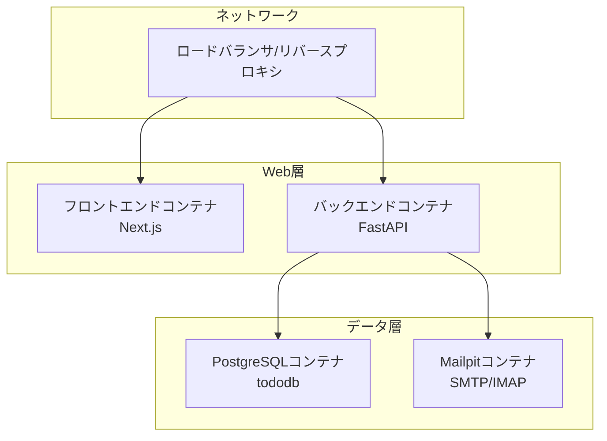
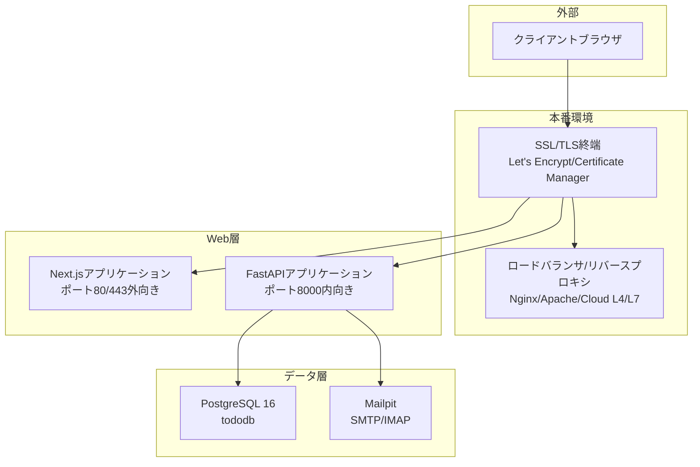
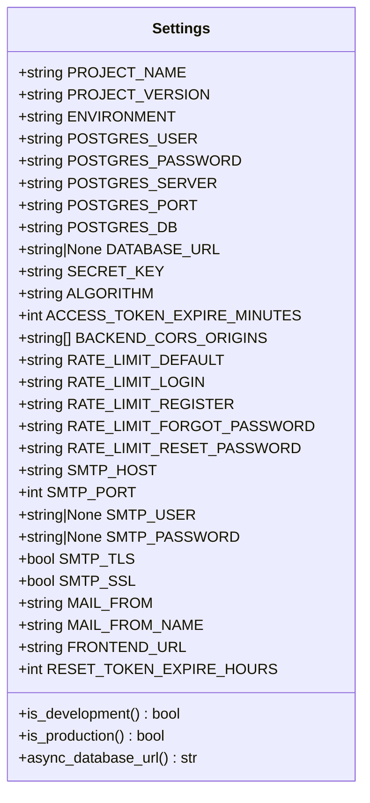
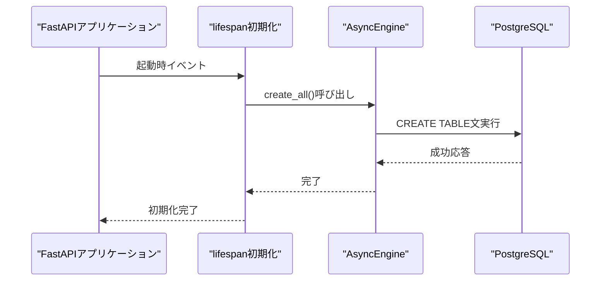
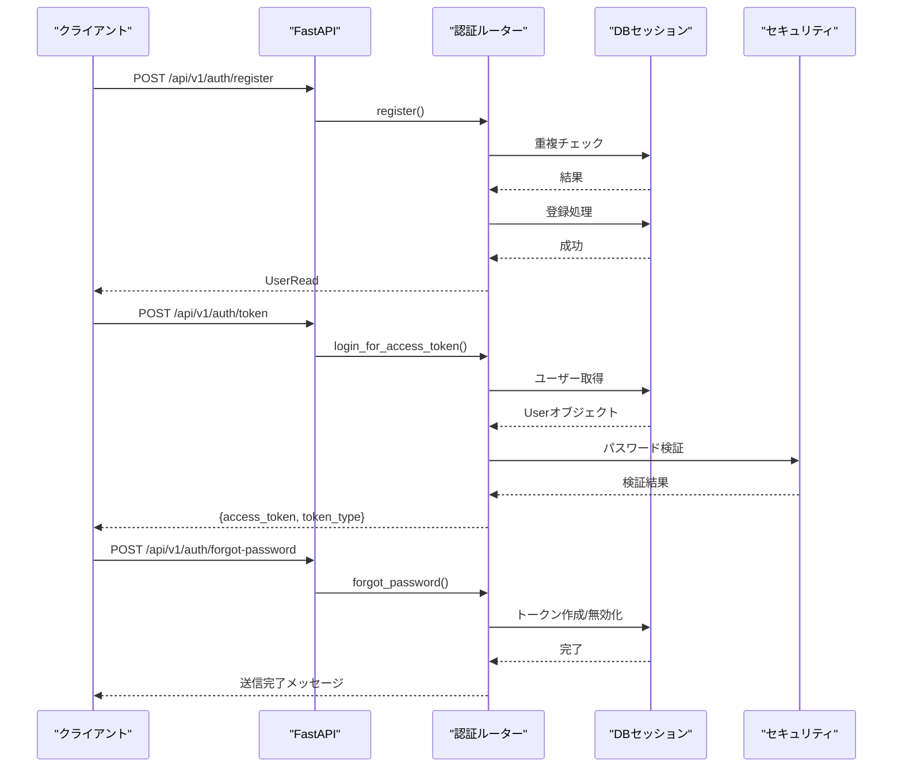
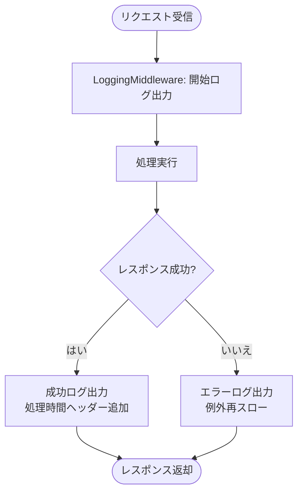
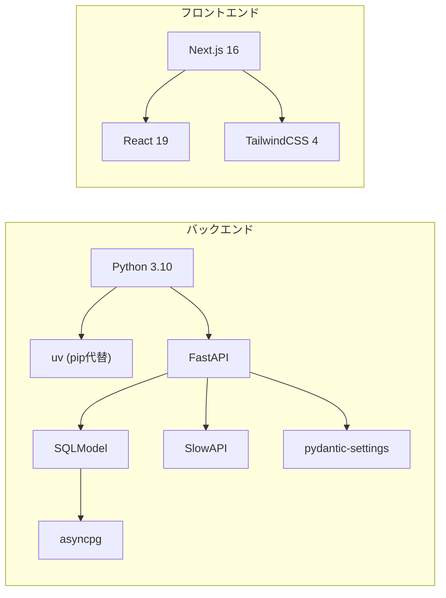

# デプロイメントガイド

<cite>
**このドキュメントで参照されているファイル**
- [docker-compose.yml](file://docker-compose.yml)
- [backend/Dockerfile](file://docker/backend/Dockerfile)
- [frontend/Dockerfile](file://docker/frontend/Dockerfile)
- [pyproject.toml](file://backend/pyproject.toml)
- [package.json](file://frontend/package.json)
- [config.py](file://backend/app/core/config.py)
- [main.py](file://backend/app/main.py)
- [db.py](file://backend/app/core/db.py)
- [logging.py](file://backend/app/core/logging.py)
- [security.py](file://backend/app/core/security.py)
- [limiter.py](file://backend/app/core/limiter.py)
- [error_handler.py](file://backend/app/middleware/error_handler.py)
- [logging_middleware.py](file://backend/app/middleware/logging.py)
- [auth.py](file://backend/app/api/api_v1/endpoints/auth.py)
- [alembic.ini](file://backend/alembic.ini)
</cite>

## 目次
1. [はじめに](#はじめに)
2. [プロジェクト構造](#プロジェクト構造)
3. [コアコンポーネント](#コアコンポーネント)
4. [アーキテクチャ概観](#アーキテクチャ概観)
5. [詳細コンポーネント分析](#詳細コンポーネント分析)
6. [依存関係分析](#依存関係分析)
7. [パフォーマンス考慮事項](#パフォーマンス考慮事項)
8. [トラブルシューティングガイド](#トラブルシューティングガイド)
9. [結論](#結論)
10. [付録](#付録)

## はじめに
本ガイドは、Todoアプリケーションを本番環境へデプロイするための包括的な手順と設定を提供します。Dockerコンテナ化、環境変数、ネットワーク構成、ボリューム管理、ロードバランサ、SSL証明書、データベース接続、およびモニタリングの実装方法について詳しく解説します。

## プロジェクト構造
本プロジェクトはバックエンド(FastAPI)、フロントエンド(Next.js)、データベース(PostgreSQL)、メール(Mailpit)の4つのコンポーネントから構成されています。Docker Composeを使用してサービス間の連携を管理し、開発・本番環境での設定を分離します。



**図の出典**
- [docker-compose.yml:1-29](file://docker-compose.yml#L1-L29)
- [backend/Dockerfile:1-10](file://docker/backend/Dockerfile#L1-L10)
- [frontend/Dockerfile:1-8](file://docker/frontend/Dockerfile#L1-L8)

**節の出典**
- [docker-compose.yml:1-29](file://docker-compose.yml#L1-L29)
- [backend/Dockerfile:1-10](file://docker/backend/Dockerfile#L1-L10)
- [frontend/Dockerfile:1-8](file://docker/frontend/Dockerfile#L1-L8)

## コアコンポーネント
- 設定管理: pydantic-settingsによる環境変数管理、CORS、レート制限、メール設定、JWTシークレットキー
- DB接続: SQLAlchemy Async Engine + SQLModel、Alembicマイグレーション
- API層: FastAPIルーター、JWT認証、パスワードリセット、ヘルスチェック
- ミドルウェア: CORS、ロギング、エラーハンドリング、レートリミット
- ロギング: 構造化JSONログ、アプリケーションロガー設定

**節の出典**
- [config.py:4-91](file://backend/app/core/config.py#L4-L91)
- [db.py:1-17](file://backend/app/core/db.py#L1-L17)
- [main.py:1-168](file://backend/app/main.py#L1-L168)
- [logging.py:1-36](file://backend/app/core/logging.py#L1-L36)

## アーキテクチャ概観
本番環境での基本的なアーキテクチャは以下の通りです。ロードバランサがフロントエンドとバックエンドの両方にトラフィックを振り分け、PostgreSQLが永続化ストレージとして動作し、MailpitがSMTP/IMAP経由のメール受信を提供します。



**図の出典**
- [docker-compose.yml:1-29](file://docker-compose.yml#L1-L29)
- [backend/Dockerfile:9](file://docker/backend/Dockerfile#L9)
- [frontend/Dockerfile:7](file://docker/frontend/Dockerfile#L7)

## 詳細コンポーネント分析

### 設定管理コンポーネント
- 環境変数の優先順位: DATABASE_URL > 各個別の接続パラメータ
- CORS: 本番環境ではBACKEND_CORS_ORIGINSを必須設定
- JWT: SECRET_KEYは本番環境で必須、ACCESS_TOKEN_EXPIRE_MINUTESで有効期限管理
- レート制限: 各エンドポイントごとに設定可能、デフォルトは100/分
- メール: SMTP_HOST/PORT/USER/PASSWORD/TLS/SSL、MAIL_FROM、FRONTEND_URL



**図の出典**
- [config.py:4-91](file://backend/app/core/config.py#L4-L91)

**節の出典**
- [config.py:24-88](file://backend/app/core/config.py#L24-L88)

### DB接続コンポーネント
- 非同期接続: asyncpg + SQLAlchemy AsyncEngine
- 開発時自動マイグレーション: lifespan初期化時にテーブル作成
- 接続文字列: DATABASE_URL優先、なければ個別パラメータから組み立て



**図の出典**
- [main.py:33-48](file://backend/app/main.py#L33-L48)
- [db.py:5-12](file://backend/app/core/db.py#L5-L12)

**節の出典**
- [db.py:1-17](file://backend/app/core/db.py#L1-L17)
- [main.py:33-48](file://backend/app/main.py#L33-L48)

### API認証フロー
- JWTベースの認証: /api/v1/auth/token
- パスワードリセット: /api/v1/auth/forgot-password と /api/v1/auth/reset-password
- トークン有効期限: ACCESS_TOKEN_EXPIRE_MINUTESで設定



**図の出典**
- [auth.py:19-117](file://backend/app/api/api_v1/endpoints/auth.py#L19-L117)
- [security.py:10-34](file://backend/app/core/security.py#L10-L34)

**節の出典**
- [auth.py:19-117](file://backend/app/api/api_v1/endpoints/auth.py#L19-L117)
- [security.py:16-34](file://backend/app/core/security.py#L16-L34)

### ロギングとミドルウェア
- 構造化JSONログ: python-json-loggerを使用した標準出力出力
- リクエストログ: LoggingMiddlewareによる処理時間付きアクセスログ
- エラーハンドリング: 全般的なHTTPエラー、バリデーションエラー、レート制限エラー



**図の出典**
- [logging_middleware.py:10-67](file://backend/app/middleware/logging.py#L10-L67)
- [logging.py:6-36](file://backend/app/core/logging.py#L6-L36)

**節の出典**
- [logging_middleware.py:10-67](file://backend/app/middleware/logging.py#L10-L67)
- [logging.py:6-36](file://backend/app/core/logging.py#L6-L36)
- [error_handler.py:15-149](file://backend/app/middleware/error_handler.py#L15-L149)

## 依存関係分析
- Dockerイメージ: Python 3.10 slim + uv、Bun latest
- バックエンド依存: FastAPI、SQLModel、asyncpg、SlowAPI、Pydantic Settings
- フロントエンド依存: Next.js 16、React 19、TailwindCSS 4
- DBマイグレーション: Alembic + PostgreSQL 16



**図の出典**
- [pyproject.toml:7-25](file://backend/pyproject.toml#L7-L25)
- [package.json:18-35](file://frontend/package.json#L18-L35)

**節の出典**
- [pyproject.toml:1-51](file://backend/pyproject.toml#L1-L51)
- [package.json:1-65](file://frontend/package.json#L1-L65)

## パフォーマンス考慮事項
- 非同期DB接続: SQLAlchemy AsyncEngineによる同時接続対応
- レート制限: SlowAPIによる各エンドポイントごとの制御
- CORS最適化: 本番環境ではオリジンを限定的に設定
- ロギング: JSONフォーマットによる構造化ログ、不要な出力は抑制

## トラブルシューティングガイド
- CORSエラー: 本番環境でBACKEND_CORS_ORIGINSが設定されていない場合にRuntimeError
- DB接続失敗: DATABASE_URLまたは個別接続パラメータの確認、PostgreSQLサービスの稼働状況
- JWTエラー: SECRET_KEYの設定漏れ、アルゴリズム不一致
- メール送信失敗: SMTP設定の確認、Mailpitの稼働確認
- ヘルスチェック: /healthエンドポイントでDB接続状況を確認

**節の出典**
- [main.py:106-107](file://backend/app/main.py#L106-L107)
- [main.py:134-167](file://backend/app/main.py#L134-L167)
- [error_handler.py:107-122](file://backend/app/middleware/error_handler.py#L107-L122)

## 結論
本ガイドでは、Dockerコンテナ化、環境変数設定、ネットワーク構成、ボリューム管理、ロードバランサ、SSL証明書、データベース接続、モニタリングについて実践的な手順を示しました。本番環境では、設定のセキュリティ、ネットワークの堅牢性、監視の徹底が重要です。

## 付録

### 本番環境デプロイメント手順
1. 環境変数の準備
   - DATABASE_URLまたは個別の接続パラメータを設定
   - SECRET_KEYを安全に管理
   - BACKEND_CORS_ORIGINSを本番オリジンのみに限定
   - SMTP設定を本番SMTPサーバーに変更

2. Dockerイメージのビルド
   ```bash
   docker-compose build
   ```

3. サービスの起動
   ```bash
   docker-compose up -d
   ```

4. DBマイグレーション
   - Alembicを使用してスキーマを適用
   - 開発時はlifespanで自動作成が行われるため、本番では手動で適用

5. SSL証明書の設定
   - Let's EncryptまたはクラウドのACMを使用
   - ロードバランサでTLS終端を設定

6. モニタリングの実装
   - 構造化ログをCentralized Loggingに送信
   - /healthエンドポイントを監視ルーチンで定期的にチェック
   - レート制限の超過を監視し、アラートを設定

**節の出典**
- [alembic.ini:1-150](file://backend/alembic.ini#L1-L150)
- [docker-compose.yml:1-29](file://docker-compose.yml#L1-L29)