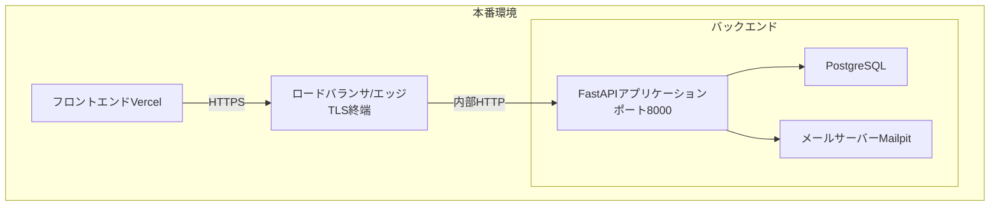
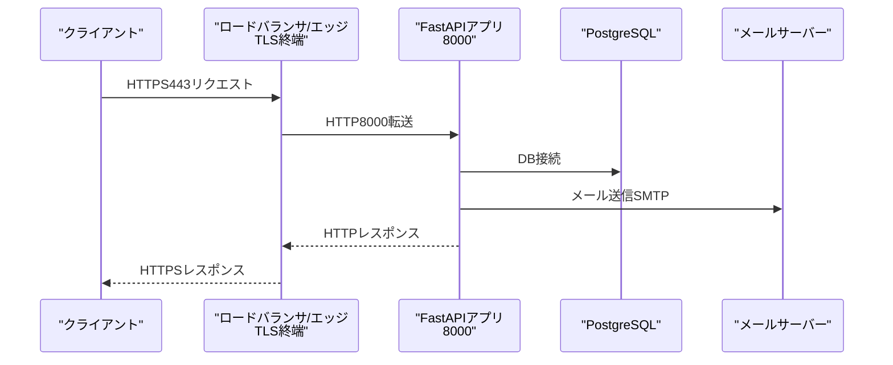
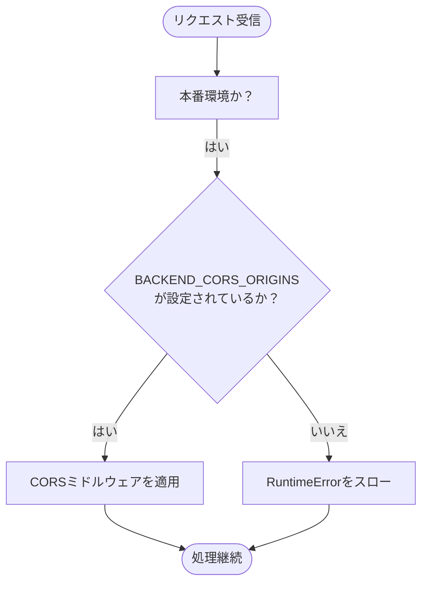
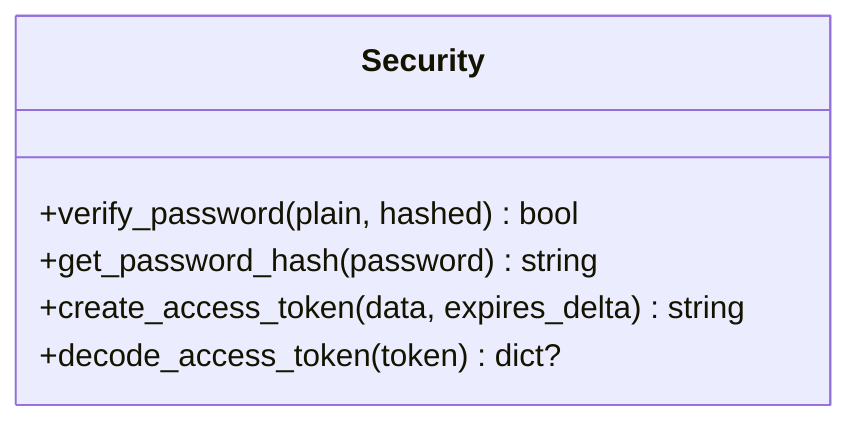
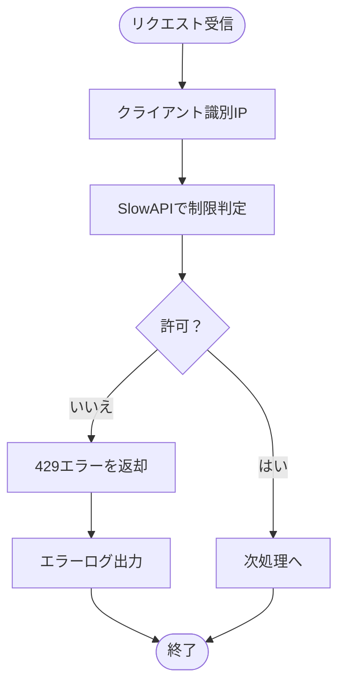
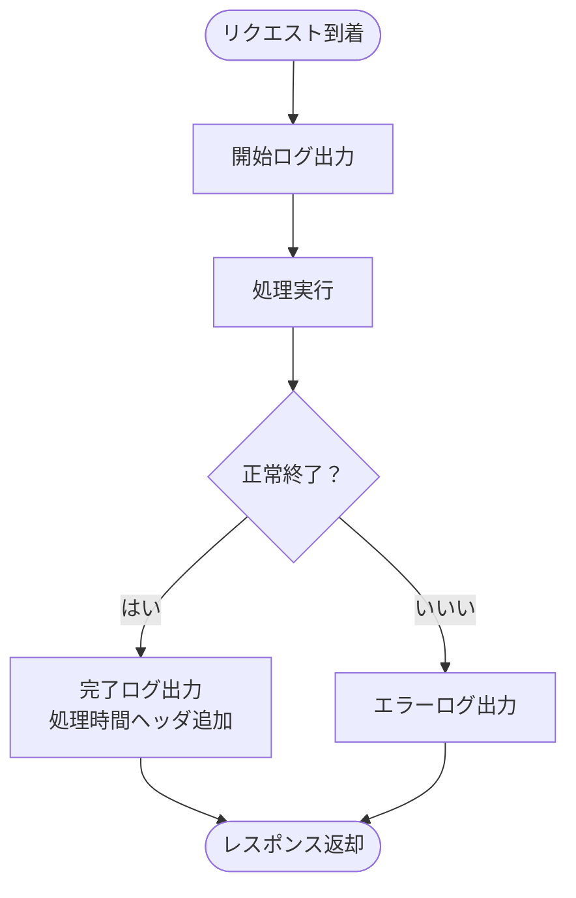
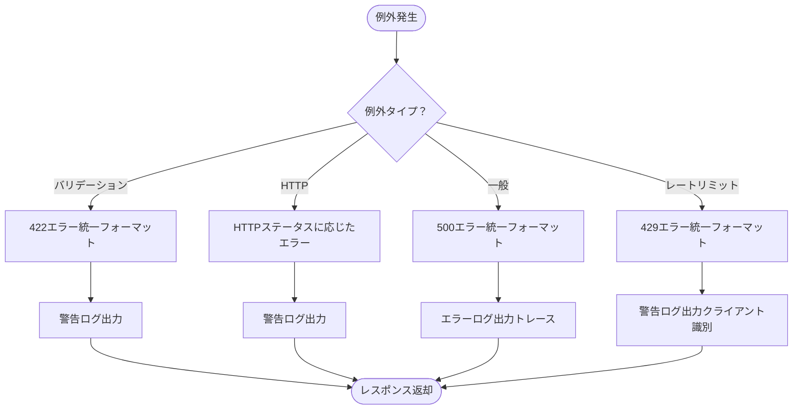
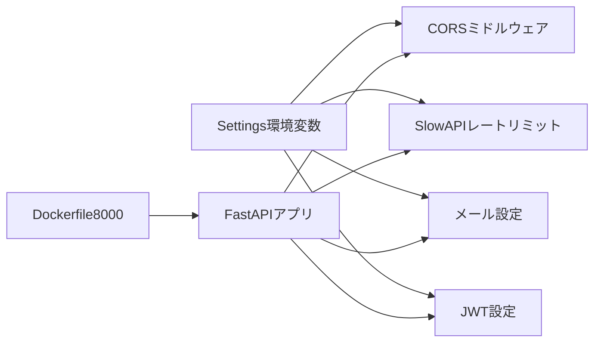

# ネットワーク構成

<cite>
**本文で参照するファイル**   
- [docker-compose.yml](file://docker-compose.yml)
- [backend/app/main.py](file://backend/app/main.py)
- [backend/app/core/config.py](file://backend/app/core/config.py)
- [backend/app/core/security.py](file://backend/app/core/security.py)
- [backend/app/core/limiter.py](file://backend/app/core/limiter.py)
- [backend/app/middleware/logging.py](file://backend/app/middleware/logging.py)
- [backend/app/middleware/error_handler.py](file://backend/app/middleware/error_handler.py)
- [backend/pyproject.toml](file://backend/pyproject.toml)
- [docker/backend/Dockerfile](file://docker/backend/Dockerfile)
- [frontend/vercel.json](file://frontend/vercel.json)
- [SPECIFICATION.md](file://SPECIFICATION.md)
</cite>

## 目次
1. [はじめに](#はじめに)
2. [プロジェクト構造](#プロジェクト構造)
3. [コアコンポーネント](#コアコンポーネント)
4. [アーキテクチャ概観](#アーキテクチャ概観)
5. [詳細コンポーネント分析](#詳細コンポーネント分析)
6. [依存関係分析](#依存関係分析)
7. [パフォーマンス考慮事項](#パフォーマンス考慮事項)
8. [トラブルシューティングガイド](#トラブルシューティングガイド)
9. [結論](#結論)
10. [付録](#付録)

## はじめに
本ドキュメントは、本番環境におけるTodo APIのネットワーク構成とセキュリティ設定について、具体的な設定例とともに解説します。対象とする内容は以下の通りです：
- ロードバランサの設定（本番環境での外部トラフィックの分散）
- SSL/TLS証明書の導入（HTTPS終端）
- ポートフォワーディング（80/443へのリダイレクト、内部ポート8000への転送）
- ファイアウォールの構成（受信/送信ルール）
- DNS設定（A/CNAMEレコード）、IPアドレスの割り当て
- ネットワークセキュリティのベストプラクティス（CORS、レート制限、認証）

本番環境では、本ドキュメントの「ベストプラクティス」に従い、設定値を環境変数経由で管理し、TLS終端をロードバランサまたはエッジサービスで行うことを推奨します。

## プロジェクト構造
本プロジェクトは、バックエンド（FastAPI）とフロントエンド（Next.js/Bun）の2層構造であり、Dockerコンテナとして独立して動作します。本番環境では、これらのコンテナをロードバランサの背後で運用し、外部からのトラフィックをHTTPSで受けることを前提とします。

**図の出典**
- [docker-compose.yml:1-29](file://docker-compose.yml#L1-L29)
- [docker/backend/Dockerfile:9](file://docker/backend/Dockerfile#L9)
- [backend/app/main.py:128](file://backend/app/main.py#L128)

**節の出典**
- [docker-compose.yml:1-29](file://docker-compose.yml#L1-L29)
- [docker/backend/Dockerfile:9](file://docker/backend/Dockerfile#L9)
- [SPECIFICATION.md:100-115](file://SPECIFICATION.md#L100-L115)

## コアコンポーネント
- 設定管理（Settings）：環境変数を基に設定を読み込み、CORS、レートリミット、メール、JWTなどのセキュリティ関連設定を保持します。
- CORSミドルウェア：本番環境では必須のオリジンリストを環境変数で指定し、それ以外のオリジンからのアクセスを拒否します。
- 認証（JWT）：JWTの署名アルゴリズム、有効期限、トークンの生成/検証ロジックを提供します。
- レートリミット（SlowAPI）：リクエスト数の制限を適用し、超過時に統一エラーレスポンスを返します。
- ロギングミドルウェア：リクエスト/レスポンスの詳細なログを出力し、処理時間もヘッダに付与します。
- エラーハンドラー：バリデーションエラー、HTTP例外、予期しないエラー、レートリミット超過を統一フォーマットで返します。

**節の出典**
- [backend/app/core/config.py:4-90](file://backend/app/core/config.py#L4-L90)
- [backend/app/main.py:104-115](file://backend/app/main.py#L104-L115)
- [backend/app/core/security.py:16-34](file://backend/app/core/security.py#L16-L34)
- [backend/app/core/limiter.py:1-7](file://backend/app/core/limiter.py#L1-L7)
- [backend/app/middleware/logging.py:10-67](file://backend/app/middleware/logging.py#L10-L67)
- [backend/app/middleware/error_handler.py:15-149](file://backend/app/middleware/error_handler.py#L15-L149)

## アーキテクチャ概観
本番環境での典型的なネットワークフローは以下の通りです：

**図の出典**
- [docker/backend/Dockerfile:9](file://docker/backend/Dockerfile#L9)
- [backend/app/main.py:128](file://backend/app/main.py#L128)
- [backend/app/core/config.py:69-83](file://backend/app/core/config.py#L69-L83)

## 詳細コンポーネント分析

### CORS（クロスオリジンリソース共有）
- 本番環境では、BACKEND_CORS_ORIGINSを環境変数で厳密に設定し、オリジンリストに含まれないリクエストは拒否されます。
- 設定例（環境変数）：NEXT_PUBLIC_API_URL など、フロントエンドのオリジンを含める必要があります。

**図の出典**
- [backend/app/main.py:106-107](file://backend/app/main.py#L106-L107)
- [backend/app/core/config.py:55-60](file://backend/app/core/config.py#L55-L60)

**節の出典**
- [backend/app/main.py:104-115](file://backend/app/main.py#L104-L115)
- [backend/app/core/config.py:55-60](file://backend/app/core/config.py#L55-L60)

### JWT認証
- JWTの署名アルゴリズム（例：HS256）とシークレットキー、有効期限（分単位）を設定します。
- トークンの生成/検証ロジックは、認証エンドポイントで使用されます。

**図の出典**
- [backend/app/core/security.py:10-34](file://backend/app/core/security.py#L10-L34)

**節の出典**
- [backend/app/core/security.py:16-34](file://backend/app/core/security.py#L16-L34)

### レートリミット（SlowAPI）
- 既定のリミットと、特定エンドポイント（ログイン、登録、パスワードリセットなど）のリミットを環境変数で設定可能です。
- 超過時は429エラーを返し、ロギングも行われます。

**図の出典**
- [backend/app/core/limiter.py:1-7](file://backend/app/core/limiter.py#L1-L7)
- [backend/app/middleware/error_handler.py:125-148](file://backend/app/middleware/error_handler.py#L125-L148)

**節の出典**
- [backend/app/core/limiter.py:1-7](file://backend/app/core/limiter.py#L1-L7)
- [backend/app/middleware/error_handler.py:125-148](file://backend/app/middleware/error_handler.py#L125-L148)

### ロギングミドルウェア
- 各リクエストの開始/完了/失敗をログに出力し、処理時間をレスポンスヘッダに追加します。
- 構造化ログ（JSON）で出力され、本番環境での監視・分析に適しています。

**図の出典**
- [backend/app/middleware/logging.py:15-66](file://backend/app/middleware/logging.py#L15-L66)

**節の出典**
- [backend/app/middleware/logging.py:10-67](file://backend/app/middleware/logging.py#L10-L67)

### エラーハンドラー
- バリデーションエラー、HTTP例外、予期しないエラー、レートリミット超過を統一フォーマットで返します。
- 本番環境では、詳細なエラー内容をクライアントに漏洩させないよう注意が必要です。

**図の出典**
- [backend/app/middleware/error_handler.py:15-149](file://backend/app/middleware/error_handler.py#L15-L149)

**節の出典**
- [backend/app/middleware/error_handler.py:15-149](file://backend/app/middleware/error_handler.py#L15-L149)

## 依存関係分析
- 設定（Settings）は、環境変数からJWT、CORS、レートリミット、メール、フロントエンドURLなどを読み込みます。
- FastAPIアプリケーションは、設定に基づいてCORS、ロギング、エラーハンドラー、ルーティングを初期化します。
- Dockerfileでは、バックエンドコンテナが8000番ポートでリッスンするように設定されています。

**図の出典**
- [backend/app/core/config.py:4-90](file://backend/app/core/config.py#L4-L90)
- [backend/app/main.py:104-115](file://backend/app/main.py#L104-L115)
- [docker/backend/Dockerfile:9](file://docker/backend/Dockerfile#L9)

**節の出典**
- [backend/app/core/config.py:4-90](file://backend/app/core/config.py#L4-L90)
- [backend/app/main.py:104-115](file://backend/app/main.py#L104-L115)
- [docker/backend/Dockerfile:9](file://docker/backend/Dockerfile#L9)

## パフォーマンス考慮事項
- レスポンスヘッダに処理時間を含めることで、遅いエンドポイントの特定が容易になります。
- 構造化ログ（JSON）により、本番環境での集計・可視化がしやすくなります。
- レートリミットの設定値は、トラフィックパターンに応じて調整し、過剰に設定しすぎると攻撃に対する緩みになるため注意が必要です。

[本節は一般的なパフォーマンスに関する指針を示しており、特定のファイルを直接分析していないため、節の出典はありません]

## トラブルシューティングガイド
- CORSエラー（本番環境）：BACKEND_CORS_ORIGINSが設定されていない場合、アプリケーション起動時にエラーが発生します。環境変数を確認し、フロントエンドオリジンを追加してください。
- 429エラー（レートリミット）：同一クライアントからのリクエストが多すぎる場合に発生します。レートリミット設定を見直し、クライアント側でリトライ間隔を調整してください。
- 500エラー（予期しないエラー）：サーバー内部エラーです。エラーログを確認し、スタックトレースを元に原因を特定してください。
- 認証エラー（401/422）：JWTの有効期限切れ、不正な形式、またはパスワードの不一致が考えられます。認証フローを再実行し、トークンの再発行を試みてください。

**節の出典**
- [backend/app/main.py:106-107](file://backend/app/main.py#L106-L107)
- [backend/app/middleware/error_handler.py:125-148](file://backend/app/middleware/error_handler.py#L125-L148)
- [backend/app/middleware/error_handler.py:79-104](file://backend/app/middleware/error_handler.py#L79-L104)
- [backend/app/core/security.py:29-34](file://backend/app/core/security.py#L29-L34)

## 結論
本番環境でのネットワーク構成とセキュリティ設定においては、以下が最も重要です：
- CORSオリジンリストは本番環境で厳密に管理し、環境変数経由で設定します。
- TLS終端はロードバランサまたはエッジサービスで行い、内部はHTTP（8000）で運用します。
- JWTのシークレットキーとアルゴリズム、レートリミットの設定は環境変数で管理し、変更時には慎重なテストと監視を推奨します。
- 構造化ログと統一エラーレスポンスにより、運用の可視化と保守性を高めます。

[本節は要約であり、特定のファイルを直接分析していないため、節の出典はありません]

## 付録

### 本番環境でのネットワーク構成手順（例）
- ロードバランサの設定
  - 入力：443（HTTPS）
  - 出力：80（内部HTTP）→ FastAPI（8000）
  - 証明書：Let’s Encryptまたは自社CA（本番環境での証明書管理は運用責任者に委ねる）
- SSL/TLS証明書
  - ACME（Let’s Encrypt）または自社CAで証明書を取得し、ロードバランサで終端します。
- ポートフォワーディング
  - 80→443（リダイレクト）＋443→8000（転送）
- ファイアウォール
  - 受信：80（リダイレクト用）、443（HTTPS）
  - 送信：PostgreSQL（5432）、SMTP（1025/587）など必要に応じて
- DNS設定
  - Aレコード：APIドメイン → サーバーIP
  - CNAMEレコード：www.example.com → example.com（任意）
- IPアドレスの割り当て
  - 1つ以上のパブリックIPを準備し、冗長化（マルチAZ）を考慮
- 最小権限の原則
  - セキュリティグループ/ファイアウォールでは、最小限のポートのみ開放
- 証明書の自動更新
  - 自動更新スクリプトまたはACMEクライアントを設定

[本節は概念的な手順を示しており、実際のコード構造とはマッピングされていないため、図の出典も節の出典もありません]