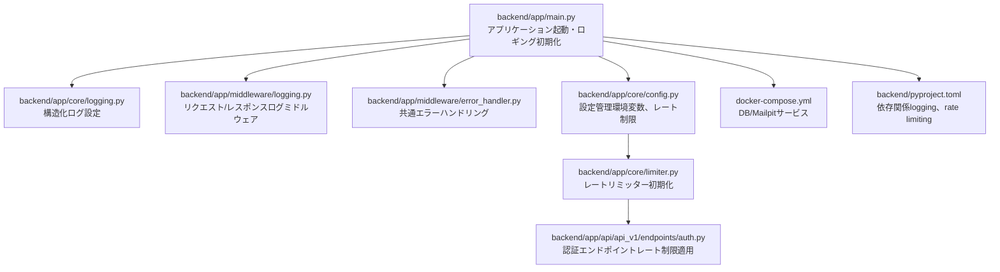
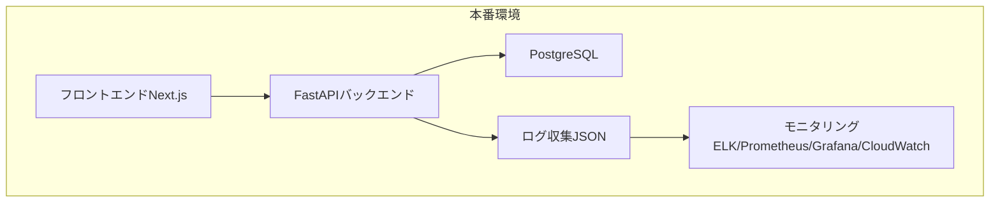
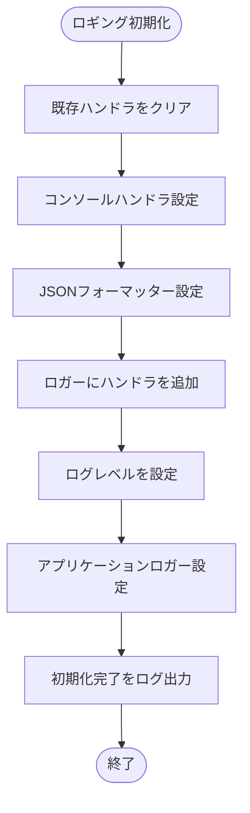
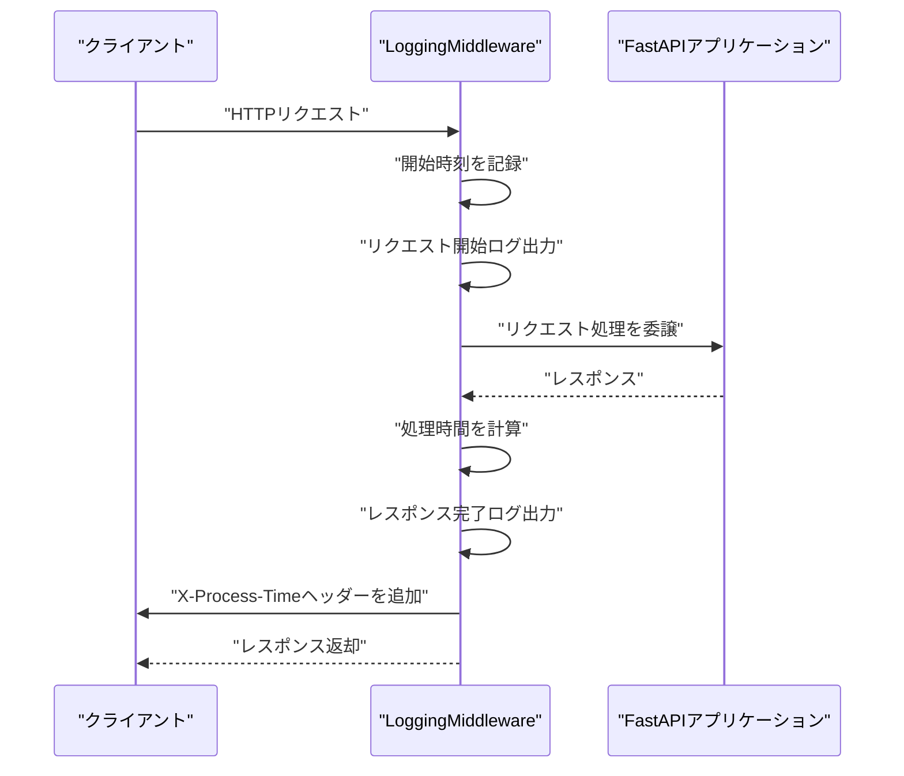
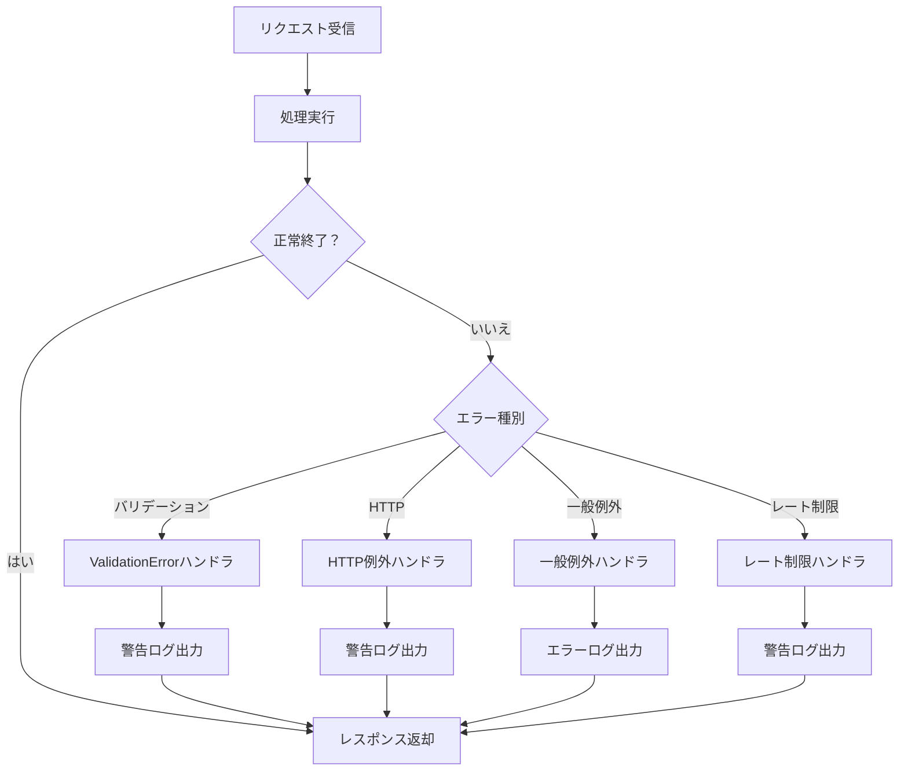
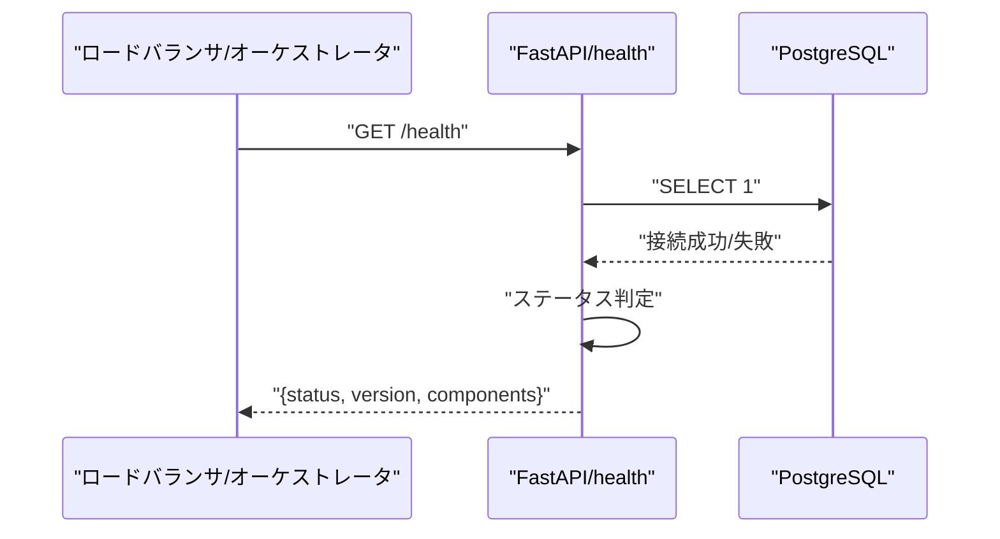
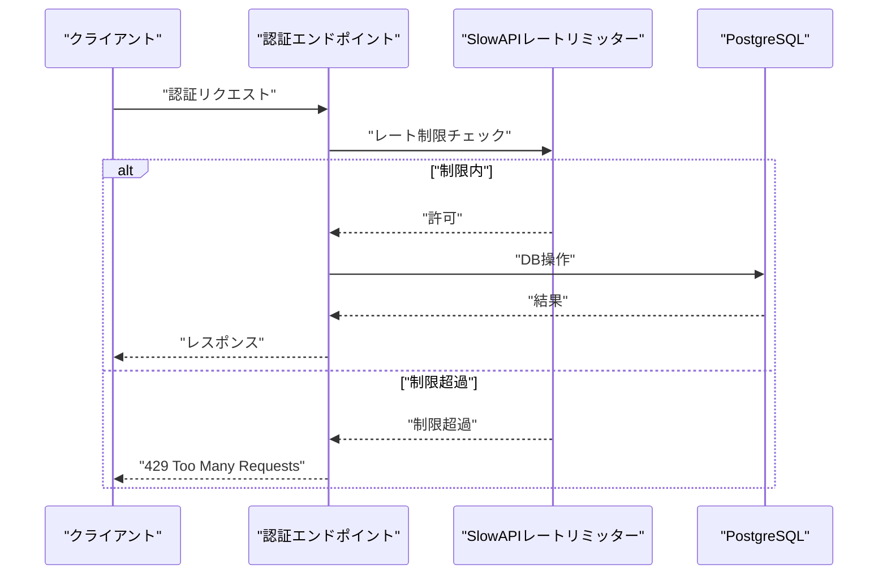
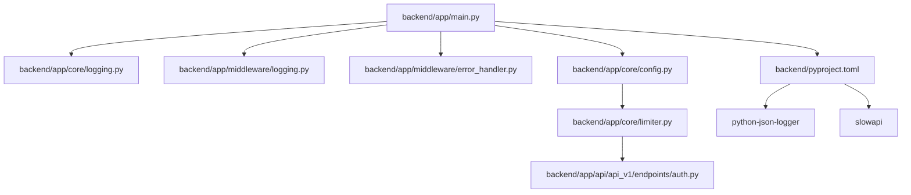

# モニタリング設定

<cite>
**本ドキュメントで参照するファイル**
- [README.md](file://README.md)
- [backend/app/main.py](file://backend/app/main.py)
- [backend/app/core/logging.py](file://backend/app/core/logging.py)
- [backend/app/middleware/logging.py](file://backend/app/middleware/logging.py)
- [backend/app/middleware/error_handler.py](file://backend/app/middleware/error_handler.py)
- [backend/app/core/config.py](file://backend/app/core/config.py)
- [backend/app/core/limiter.py](file://backend/app/core/limiter.py)
- [backend/app/api/api_v1/endpoints/auth.py](file://backend/app/api/api_v1/endpoints/auth.py)
- [docker-compose.yml](file://docker-compose.yml)
- [backend/pyproject.toml](file://backend/pyproject.toml)
</cite>

## 目次
1. [はじめに](#はじめに)
2. [プロジェクト構造](#プロジェクト構造)
3. [コアコンポーネント](#コアコンポーネント)
4. [アーキテクチャ概観](#アーキテクチャ概観)
5. [詳細コンポーネント分析](#詳細コンポーネント分析)
6. [依存関係分析](#依存関係分析)
7. [パフォーマンス考慮事項](#パフォーマンス考慮事項)
8. [トラブルシューティングガイド](#トラブルシューティングガイド)
9. [結論](#結論)
10. [付録](#付録)

## はじめに
本ドキュメントは、本番環境におけるモニタリングとロギングの設定手順を網羅的に説明します。具体的には、アプリケーションログの収集と保存、パフォーマンスメトリクスの監視、エラーレポートの設定、アラート通知の構成について解説します。また、ELKスタック、Prometheus、Grafana、CloudWatchなどのモニタリングツールとの連携方法、ログの集約と可視化の実装例も示します。

本プロジェクトでは、FastAPIによるバックエンドが提供されており、構造化ログ（JSON）の出力、ミドルウェアによるリクエスト/レスポンスログ、エラーハンドリング、ヘルスチェックエンドポイント、レート制限機能が既に実装されています。これらの機能を活かして、本番環境での監視基盤を構築することが可能です。

**節の出典**
- [README.md:272-278](file://README.md#L272-L278)

## プロジェクト構造
バックエンド（FastAPI）のモニタリングに関連する主なファイルと役割を以下に示します。

- 起動時のロギング初期化：backend/app/main.py
- 構造化ログ設定：backend/app/core/logging.py
- HTTPリクエスト/レスポンスログミドルウェア：backend/app/middleware/logging.py
- 共通エラーハンドリング：backend/app/middleware/error_handler.py
- 設定管理（環境変数、レート制限設定）：backend/app/core/config.py
- レートリミッター初期化：backend/app/core/limiter.py
- 認証エンドポイント（レート制限適用）：backend/app/api/api_v1/endpoints/auth.py
- DockerCompose（DB/Mailpit）：docker-compose.yml
- 依存関係（logging、rate limiting、monitoring関連）：backend/pyproject.toml

**図の出典**
- [backend/app/main.py:28-29](file://backend/app/main.py#L28-L29)
- [backend/app/core/logging.py:6-35](file://backend/app/core/logging.py#L6-L35)
- [backend/app/middleware/logging.py:10-67](file://backend/app/middleware/logging.py#L10-L67)
- [backend/app/middleware/error_handler.py:15-149](file://backend/app/middleware/error_handler.py#L15-L149)
- [backend/app/core/config.py:44-67](file://backend/app/core/config.py#L44-L67)
- [backend/app/core/limiter.py:1-7](file://backend/app/core/limiter.py#L1-L7)
- [backend/app/api/api_v1/endpoints/auth.py:19-117](file://backend/app/api/api_v1/endpoints/auth.py#L19-L117)
- [docker-compose.yml:1-29](file://docker-compose.yml#L1-L29)
- [backend/pyproject.toml:19-24](file://backend/pyproject.toml#L19-L24)

**節の出典**
- [backend/app/main.py:28-48](file://backend/app/main.py#L28-L48)
- [backend/app/core/logging.py:6-35](file://backend/app/core/logging.py#L6-L35)
- [backend/app/middleware/logging.py:10-67](file://backend/app/middleware/logging.py#L10-L67)
- [backend/app/middleware/error_handler.py:15-149](file://backend/app/middleware/error_handler.py#L15-L149)
- [backend/app/core/config.py:44-88](file://backend/app/core/config.py#L44-L88)
- [backend/app/core/limiter.py:1-7](file://backend/app/core/limiter.py#L1-L7)
- [backend/app/api/api_v1/endpoints/auth.py:19-117](file://backend/app/api/api_v1/endpoints/auth.py#L19-L117)
- [docker-compose.yml:1-29](file://docker-compose.yml#L1-L29)
- [backend/pyproject.toml:19-24](file://backend/pyproject.toml#L19-L24)

## コアコンポーネント
本番環境でのモニタリングに必要なコアコンポーネントを以下に示します。

- 構造化ログ（JSON）：python-json-loggerを使用したJSON形式のログ出力
- HTTPリクエスト/レスポンスログ：LoggingMiddlewareによるリクエスト開始/完了/エラーのログ出力
- 共通エラーハンドリング：validation、HTTP、一般例外、レート制限超過の統一エラーレスポンス
- ヘルスチェックエンドポイント：DB接続状況を含むシステム健全性の確認
- レート制限：SlowAPIによる認証系エンドポイントのリクエスト制限
- 設定管理：環境変数経由での設定（DB接続、CORS、レート制限、SMTPなど）

**節の出典**
- [backend/app/core/logging.py:6-35](file://backend/app/core/logging.py#L6-L35)
- [backend/app/middleware/logging.py:10-67](file://backend/app/middleware/logging.py#L10-L67)
- [backend/app/middleware/error_handler.py:15-149](file://backend/app/middleware/error_handler.py#L15-L149)
- [backend/app/main.py:134-167](file://backend/app/main.py#L134-L167)
- [backend/app/core/limiter.py:1-7](file://backend/app/core/limiter.py#L1-L7)
- [backend/app/core/config.py:44-88](file://backend/app/core/config.py#L44-L88)

## アーキテクチャ概観
本番環境でのモニタリング・ロギングの全体像を以下に示します。FastAPIアプリケーションは、起動時にロギングを初期化し、ミドルウェアを通じてリクエスト/レスポンスログを出力します。エラーハンドリングにより統一されたエラーレポートが行われ、ヘルスチェックエンドポイントでDB接続状況が監視されます。レート制限機能によりAPIの過剰アクセスを防ぎます。

**図の出典**
- [backend/app/main.py:28-48](file://backend/app/main.py#L28-L48)
- [backend/app/middleware/logging.py:10-67](file://backend/app/middleware/logging.py#L10-L67)
- [backend/app/middleware/error_handler.py:15-149](file://backend/app/middleware/error_handler.py#L15-L149)
- [backend/app/main.py:134-167](file://backend/app/main.py#L134-L167)
- [docker-compose.yml:1-29](file://docker-compose.yml#L1-L29)

## 詳細コンポーネント分析

### 構造化ログ設定（JSON）
- 機能：標準出力へのJSON形式のログ出力設定
- 特徴：asctime、name、levelname、message、filename、funcName、linenoを含む
- 用途：ELKスタックやCloudWatch Logsなどの外部ツールによる解析・可視化

**図の出典**
- [backend/app/core/logging.py:6-35](file://backend/app/core/logging.py#L6-L35)

**節の出典**
- [backend/app/core/logging.py:6-35](file://backend/app/core/logging.py#L6-L35)

### HTTPリクエスト/レスポンスログミドルウェア
- 機能：リクエスト開始/完了/エラー時のログ出力、処理時間の算出とレスポンスヘッダーへの追加
- 出力項目：method、url、client_host、status_code、process_time、error（エラー時）
- 用途：APIのパフォーマンス監視、異常検知、トレーサビリティ

**図の出典**
- [backend/app/middleware/logging.py:15-50](file://backend/app/middleware/logging.py#L15-L50)

**節の出典**
- [backend/app/middleware/logging.py:10-67](file://backend/app/middleware/logging.py#L10-L67)

### 共通エラーハンドリング
- 機能：バリデーションエラー、HTTP例外、一般例外、レート制限超過の統一エラーレスポンス
- 出力項目：url、method、status_code、detail、errors（バリデーションエラー時）、client_host（レート制限時）
- 用途：エラーレポート、問題の特定、運用対応

**図の出典**
- [backend/app/middleware/error_handler.py:15-149](file://backend/app/middleware/error_handler.py#L15-L149)

**節の出典**
- [backend/app/middleware/error_handler.py:15-149](file://backend/app/middleware/error_handler.py#L15-L149)

### ヘルスチェックエンドポイント
- 機能：システム全体の健全性を確認し、DB接続状況を含むステータスを返却
- 出力項目：status、version、components.database（status/message）
- 用途：オーケストレーション（Kubernetesなど）でのヘルスチェック、ALB/NGINXなどのLB設定

**図の出典**
- [backend/app/main.py:134-167](file://backend/app/main.py#L134-L167)

**節の出典**
- [backend/app/main.py:134-167](file://backend/app/main.py#L134-L167)

### 認証エンドポイントとレート制限
- 対象：/api/v1/auth/register、/api/v1/auth/token、/api/v1/auth/forgot-password、/api/v1/auth/reset-password
- 設定：SlowAPIによる各エンドポイントごとのレート制限（設定ファイルから環境変数で上書き可能）
- 用途：認証系の過剰アクセス防止、DDoS緩和

**図の出典**
- [backend/app/api/api_v1/endpoints/auth.py:19-117](file://backend/app/api/api_v1/endpoints/auth.py#L19-L117)
- [backend/app/core/limiter.py:1-7](file://backend/app/core/limiter.py#L1-L7)
- [backend/app/core/config.py:62-67](file://backend/app/core/config.py#L62-L67)

**節の出典**
- [backend/app/api/api_v1/endpoints/auth.py:19-117](file://backend/app/api/api_v1/endpoints/auth.py#L19-L117)
- [backend/app/core/limiter.py:1-7](file://backend/app/core/limiter.py#L1-L7)
- [backend/app/core/config.py:62-67](file://backend/app/core/config.py#L62-L67)

## 依存関係分析
本番環境でのモニタリングに必要な依存関係を以下に示します。

- logging：python-json-logger（構造化ログ）
- rate limiting：slowapi（レート制限）
- monitoring：ELKスタック（Logstash/Filebeat/Beats）、Prometheus（メトリクス）、Grafana（ダッシュボード）、CloudWatch（AWS環境）

**図の出典**
- [backend/app/main.py:28-29](file://backend/app/main.py#L28-L29)
- [backend/app/core/logging.py:6-35](file://backend/app/core/logging.py#L6-L35)
- [backend/app/middleware/logging.py:10-67](file://backend/app/middleware/logging.py#L10-L67)
- [backend/app/middleware/error_handler.py:15-149](file://backend/app/middleware/error_handler.py#L15-L149)
- [backend/app/core/config.py:44-88](file://backend/app/core/config.py#L44-L88)
- [backend/app/core/limiter.py:1-7](file://backend/app/core/limiter.py#L1-L7)
- [backend/app/api/api_v1/endpoints/auth.py:19-117](file://backend/app/api/api_v1/endpoints/auth.py#L19-L117)
- [backend/pyproject.toml:19-24](file://backend/pyproject.toml#L19-L24)

**節の出典**
- [backend/pyproject.toml:19-24](file://backend/pyproject.toml#L19-L24)

## パフォーマンス考慮事項
- 処理時間の計測：LoggingMiddlewareによりリクエストごとの処理時間が算出され、レスポンスヘッダーにX-Process-Timeとして付与されます。これにより、APIのパフォーマンスを簡単に監視できます。
- レート制限：SlowAPIによる認証系エンドポイントのリクエスト制限により、過剰アクセスを防ぎます。環境変数で柔軟に設定可能です。
- 構造化ログ：JSON形式のログ出力により、ELKスタックやCloudWatch Logsなどの外部ツールによる集約・分析が容易になります。

**節の出典**
- [backend/app/middleware/logging.py:33-48](file://backend/app/middleware/logging.py#L33-L48)
- [backend/app/core/limiter.py:1-7](file://backend/app/core/limiter.py#L1-L7)
- [backend/app/core/logging.py:22-25](file://backend/app/core/logging.py#L22-L25)

## トラブルシューティングガイド
- DB接続エラー：/healthエンドポイントのレスポンスにdatabaseのstatus/errorが表示されます。エラーログも出力されているため、該当箇所を確認してください。
- 認証エラー：エラーハンドラーにより統一されたレスポンスが返却されます。クライアント側でステータスコードとdetailを確認し、必要に応じて再試行してください。
- レート制限超過：429 Too Many Requestsが返却されます。クライアント側でリトライ間隔を調整するか、設定値を見直してください。
- 構造化ログの確認：コンテナの標準出力にJSON形式のログが出力されるため、Docker/Kubernetesのログ出力先に転送設定を追加してください。

**節の出典**
- [backend/app/main.py:134-167](file://backend/app/main.py#L134-L167)
- [backend/app/middleware/error_handler.py:125-149](file://backend/app/middleware/error_handler.py#L125-L149)
- [backend/app/middleware/logging.py:52-66](file://backend/app/middleware/logging.py#L52-L66)
- [backend/app/core/logging.py:6-35](file://backend/app/core/logging.py#L6-L35)

## 結論
本プロジェクトでは、構造化ログ（JSON）、HTTPリクエスト/レスポンスログ、共通エラーハンドリング、ヘルスチェックエンドポイント、レート制限機能が既に実装されています。これらを活かして、ELKスタック、Prometheus、Grafana、CloudWatchなどのモニタリングツールとの連携を構築することで、本番環境でのアプリケーションログの収集・保存、パフォーマンスメトリクスの監視、エラーレポート、アラート通知を効果的に実現できます。

## 付録

### 本番環境での設定手順（概要）
- 環境変数の設定：DATABASE_URL、SECRET_KEY、BACKEND_CORS_ORIGINS、SMTP_*、FRONTEND_URL、RATE_LIMIT_*などを適切に設定してください。
- ログ出力先の設定：コンテナの標準出力に出力されるJSONログを、ELKスタックやCloudWatch Logsに転送するように設定します。
- 監視ツールの連携：
  - ELKスタック：Filebeat/Beatsで標準出力を収集し、Logstashでフィルタリング、Kibanaで可視化します。
  - Prometheus：X-Process-Timeヘッダーをメトリクスとして取得し、Grafanaでダッシュボードを作成します。
  - CloudWatch：AWS ECS/EKS環境では、標準出力をCloudWatch Logsに送信し、アラートを設定します。
- アラート通知：監視ツールのアラートルールを設定し、Slack、PagerDuty、メールなどへの通知を構成します。

**節の出典**
- [backend/app/core/config.py:44-88](file://backend/app/core/config.py#L44-L88)
- [backend/app/core/logging.py:6-35](file://backend/app/core/logging.py#L6-L35)
- [backend/app/middleware/logging.py:47-48](file://backend/app/middleware/logging.py#L47-L48)
- [README.md:272-278](file://README.md#L272-L278)