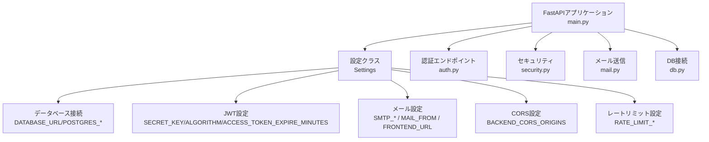
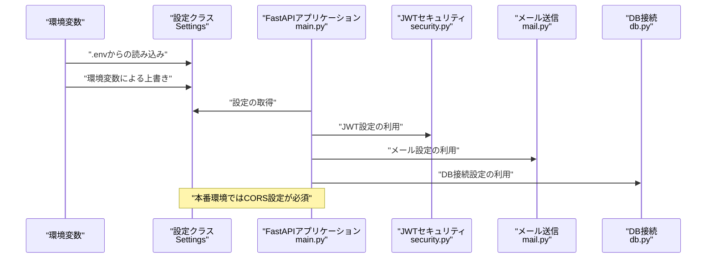
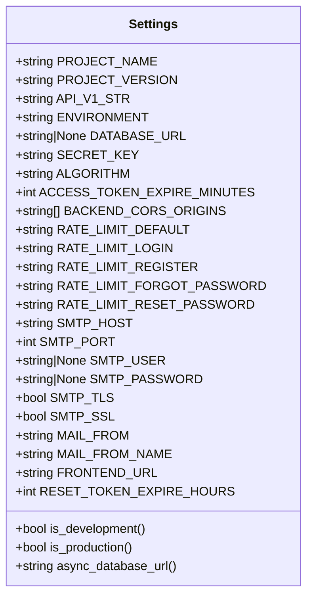
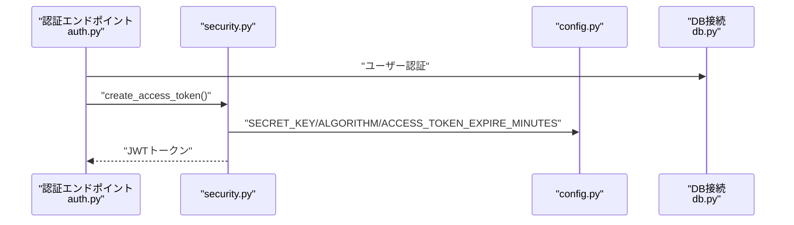
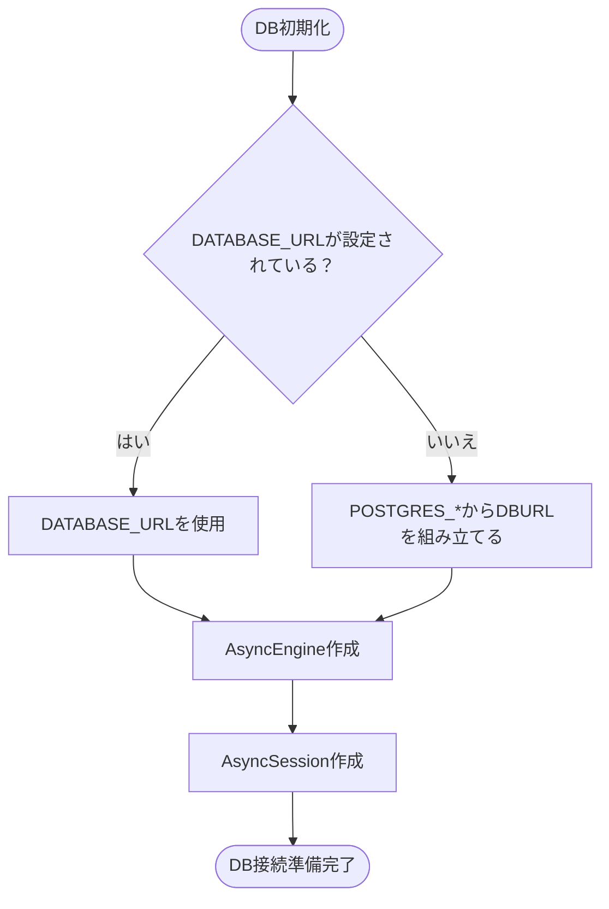
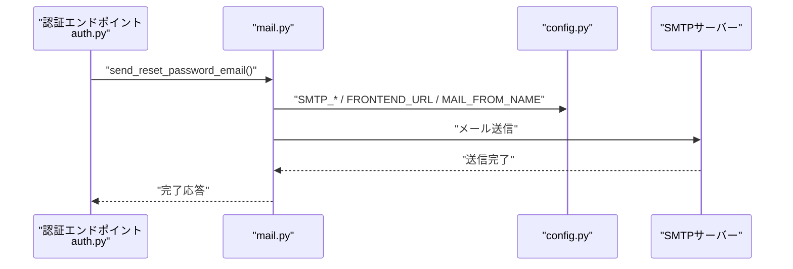
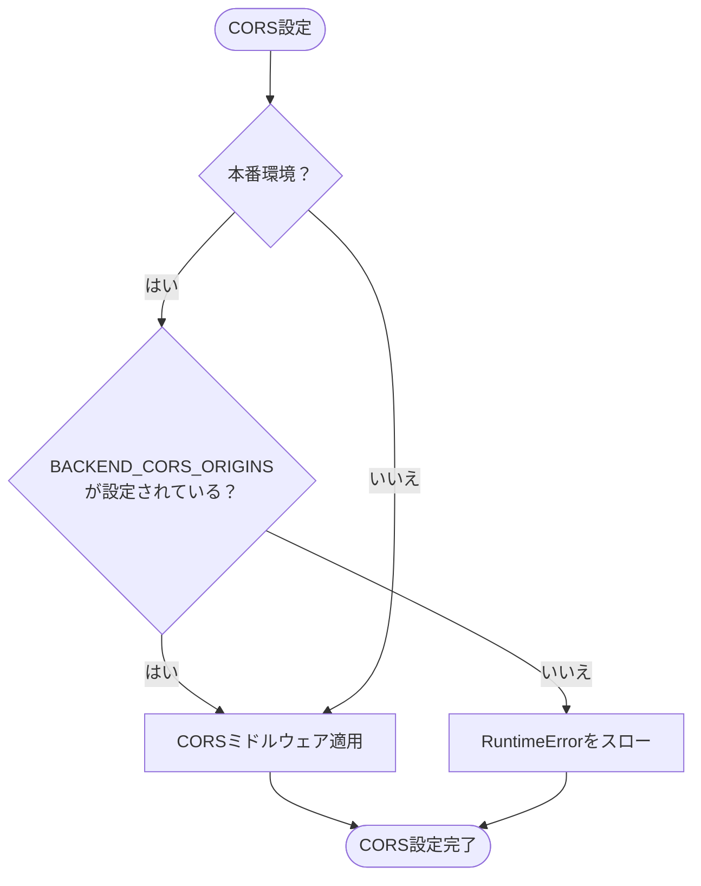
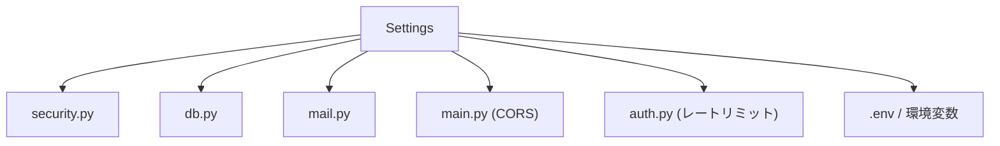

# 環境変数設定

<cite>
**この文書で参照されているファイル**
- [config.py](file://backend/app/core/config.py)
- [security.py](file://backend/app/core/security.py)
- [mail.py](file://backend/app/core/mail.py)
- [db.py](file://backend/app/core/db.py)
- [deps.py](file://backend/app/api/deps.py)
- [docker-compose.yml](file://docker-compose.yml)
- [pyproject.toml](file://backend/pyproject.toml)
- [auth.py](file://backend/app/api/api_v1/endpoints/auth.py)
- [main.py](file://backend/app/main.py)
</cite>

## 目次
1. [はじめに](#はじめに)
2. [プロジェクト構造](#プロジェクト構造)
3. [コアコンポーネント](#コアコンポーネント)
4. [アーキテクチャ概観](#アーキテクチャ概観)
5. [詳細なコンポーネント分析](#詳細なコンポーネント分析)
6. [依存関係分析](#依存関係分析)
7. [パフォーマンスに関する考慮事項](#パフォーマンスに関する考慮事項)
8. [トラブルシューティングガイド](#トラブルシューティングガイド)
9. [結論](#結論)
10. [付録](#付録)

## はじめに
本ドキュメントは、本番環境における環境変数の設定手順とベストプラクティスを提供することを目的としています。特に、データベース接続文字列、JWTシークレットキー、メールサーバー設定、APIエンドポイントURLなど、本番運用において必須となる設定について、セキュリティ上の注意点、環境ごとの設定例、暗号化された値の取り扱い、設定のバリデーション方法を解説します。

## プロジェクト構造
バックエンドはFastAPIフレームワークを用いており、設定はPydantic Settingsによる設定クラスで管理されています。設定は.envファイルから読み込まれ、本番環境では環境変数経由での上書きが推奨されます。データベース接続、JWT認証、メール送信、CORS設定、レートリミットなどが設定クラスを通じて制御されています。

**図の出典**
- [config.py:1-91](file://backend/app/core/config.py#L1-L91)
- [main.py:1-168](file://backend/app/main.py#L1-L168)

**節の出典**
- [config.py:1-91](file://backend/app/core/config.py#L1-L91)
- [main.py:1-168](file://backend/app/main.py#L1-L168)

## コアコンポーネント
- 設定クラス Settings
  - 環境変数から読み込まれる項目：DATABASE_URL、POSTGRES_*、SECRET_KEY、ALGORITHM、ACCESS_TOKEN_EXPIRE_MINUTES、BACKEND_CORS_ORIGINS、RATE_LIMIT_*、SMTP_*、MAIL_FROM、MAIL_FROM_NAME、FRONTEND_URL、RESET_TOKEN_EXPIRE_HOURS
  - 本番環境ではSECRET_KEYは必須であり、開発環境とは異なる値を設定する必要があります
  - CORS設定は本番環境で厳密に設定する必要があり、設定されていない場合ランタイムエラーになります
- JWT
  - SECRET_KEYとALGORITHM、ACCESS_TOKEN_EXPIRE_MINUTESが設定クラスから利用され、トークンの生成・検証に使用されます
- DB接続
  - DATABASE_URLが指定されている場合はそちらが優先され、そうでない場合はPOSTGRES_*から組み立てられます
- メール送信
  - SMTP_*、MAIL_FROM、MAIL_FROM_NAME、FRONTEND_URLが利用され、パスワードリセットメールの送信に使用されます
- CORS
  - BACKEND_CORS_ORIGINSが本番環境で必須であり、設定されていないと起動時にエラーになります

**節の出典**
- [config.py:1-91](file://backend/app/core/config.py#L1-L91)
- [security.py:1-35](file://backend/app/core/security.py#L1-L35)
- [db.py:1-17](file://backend/app/core/db.py#L1-L17)
- [mail.py:1-53](file://backend/app/core/mail.py#L1-L53)
- [main.py:104-115](file://backend/app/main.py#L104-L115)

## アーキテクチャ概観
本番環境での設定フローは以下の通りです。設定クラスが.envファイルから読み込み、環境変数で上書きされ、各コンポーネントがそれを使用します。特にJWTシークレットキーは本番環境で安全に管理する必要があります。

**図の出典**
- [config.py:85-88](file://backend/app/core/config.py#L85-L88)
- [main.py:104-115](file://backend/app/main.py#L104-L115)
- [security.py:16-27](file://backend/app/core/security.py#L16-L27)
- [mail.py:11-24](file://backend/app/core/mail.py#L11-L24)
- [db.py:5-12](file://backend/app/core/db.py#L5-L12)

## 詳細なコンポーネント分析

### 設定クラス（Settings）
- 必須項目（本番環境）
  - SECRET_KEY：JWTの署名に使用されるシークレットキー
- 任意項目（本番環境でも設定推奨）
  - DATABASE_URL：完全なDB接続文字列（優先）
  - BACKEND_CORS_ORIGINS：許可するオリジンリスト（本番環境で必須）
  - FRONTEND_URL：フロントエンドのベースURL（パスワードリセットリンクに使用）
- その他の重要項目
  - SMTP_*：SMTPサーバー設定
  - RATE_LIMIT_*：レートリミット設定
  - RESET_TOKEN_EXPIRE_HOURS：パスワードリセットトークンの有効時間

**図の出典**
- [config.py:4-90](file://backend/app/core/config.py#L4-L90)

**節の出典**
- [config.py:4-90](file://backend/app/core/config.py#L4-L90)

### JWT設定（security.py）
- トークン生成・検証に利用されるSECRET_KEYとALGORITHM、有効期限（ACCESS_TOKEN_EXPIRE_MINUTES）が設定クラスから取得されます
- 本番環境ではSECRET_KEYは安全に管理し、複数のインスタンス間で共有する必要があります

**図の出典**
- [auth.py:36-54](file://backend/app/api/api_v1/endpoints/auth.py#L36-L54)
- [security.py:16-27](file://backend/app/core/security.py#L16-L27)
- [config.py:50-53](file://backend/app/core/config.py#L50-L53)

**節の出典**
- [security.py:1-35](file://backend/app/core/security.py#L1-L35)
- [auth.py:36-54](file://backend/app/api/api_v1/endpoints/auth.py#L36-L54)

### DB接続（db.py）
- DATABASE_URLが設定されていればそれが優先され、そうでなければPOSTGRES_*から組み立てられます
- 開発環境ではechoが有効になり、本番環境では無効になるよう設計されています

**図の出典**
- [config.py:44-48](file://backend/app/core/config.py#L44-L48)
- [db.py:5-12](file://backend/app/core/db.py#L5-L12)

**節の出典**
- [db.py:1-17](file://backend/app/core/db.py#L1-L17)
- [config.py:44-48](file://backend/app/core/config.py#L44-L48)

### メール設定（mail.py）
- SMTP_*、MAIL_FROM、MAIL_FROM_NAME、FRONTEND_URLが設定クラスから取得され、パスワードリセットメールの送信に使用されます
- HTMLとテキストの両方のテンプレートが利用され、FRONTEND_URLにリセットURLが埋め込まれます

**図の出典**
- [auth.py:64-78](file://backend/app/api/api_v1/endpoints/auth.py#L64-L78)
- [mail.py:27-52](file://backend/app/core/mail.py#L27-L52)
- [config.py:69-83](file://backend/app/core/config.py#L69-L83)

**節の出典**
- [mail.py:1-53](file://backend/app/core/mail.py#L1-L53)
- [auth.py:64-78](file://backend/app/api/api_v1/endpoints/auth.py#L64-L78)

### CORS設定（main.py）
- 本番環境ではBACKEND_CORS_ORIGINSを必ず設定する必要があります。設定されていない場合、起動時にランタイムエラーになります
- 許可するオリジンを最小限に抑え、ワイルドカードは避けるべきです

**図の出典**
- [main.py:104-115](file://backend/app/main.py#L104-L115)
- [config.py:55-60](file://backend/app/core/config.py#L55-L60)

**節の出典**
- [main.py:104-115](file://backend/app/main.py#L104-L115)

## 依存関係分析
設定クラスは、JWT、DB、メール、CORS、レートリミットなど、アプリケーション全体の動作に深く関わるコンポーネントに依存しています。設定の変更は広範囲に影響を与えるため、本番環境では慎重な管理が必要です。

**図の出典**
- [config.py:1-91](file://backend/app/core/config.py#L1-L91)
- [security.py:1-35](file://backend/app/core/security.py#L1-L35)
- [db.py:1-17](file://backend/app/core/db.py#L1-L17)
- [mail.py:1-53](file://backend/app/core/mail.py#L1-L53)
- [main.py:104-115](file://backend/app/main.py#L104-L115)
- [auth.py:19-20](file://backend/app/api/api_v1/endpoints/auth.py#L19-L20)

**節の出典**
- [config.py:1-91](file://backend/app/core/config.py#L1-L91)

## パフォーマンスに関する考慮事項
- 設定の読み込みは起動時に一度だけ行われるため、頻繁な変更は不要です
- DB接続文字列の指定は、ネットワークや認証情報の最適化に繋がります
- CORS設定はオリジンの数が多いほどミドルウェアの判定にコストがかかりますので、最小限に抑えることが望ましいです

## トラブルシューティングガイド
- CORSエラー（本番環境）
  - 症状：起動時にRuntimeErrorが発生
  - 原因：BACKEND_CORS_ORIGINSが設定されていない
  - 対処：本番環境では必ずオリジンを明示的に設定してください
  - 参考：[main.py:106-107](file://backend/app/main.py#L106-L107)
- JWT認証エラー
  - 症状：トークンの検証に失敗
  - 原因：SECRET_KEYが一致しない、またはALGORITHMが異なる
  - 対処：本番環境ではSECRET_KEYを安全に管理し、複数インスタンスで共有してください
  - 参考：[security.py:29-34](file://backend/app/core/security.py#L29-L34)
- DB接続エラー
  - 症状：ヘルスチェックやDB操作でエラー
  - 原因：DATABASE_URLまたはPOSTGRES_*の誤り
  - 対処：DATABASE_URLを直接設定するか、POSTGRES_*を確認してください
  - 参考：[db.py:5-12](file://backend/app/core/db.py#L5-L12)
- メール送信エラー
  - 症状：パスワードリセットメールが送信されない
  - 原因：SMTP_*、MAIL_FROM、FRONTEND_URLの誤り
  - 対処：SMTPサーバーの認証情報と接続設定を確認し、FRONTEND_URLを正しく設定してください
  - 参考：[mail.py:11-24](file://backend/app/core/mail.py#L11-L24)

**節の出典**
- [main.py:106-107](file://backend/app/main.py#L106-L107)
- [security.py:29-34](file://backend/app/core/security.py#L29-L34)
- [db.py:5-12](file://backend/app/core/db.py#L5-L12)
- [mail.py:11-24](file://backend/app/core/mail.py#L11-L24)

## 結論
本番環境では、設定のセキュリティと堅牢性を確保することが最も重要です。特にJWTシークレットキー、DB接続文字列、SMTP認証情報、CORSオリジンリストは、環境変数経由で管理し、変更時には慎重なテストと監視を行うべきです。本ドキュメントで示した手順に従い、ベストプラクティスに則って設定を管理することで、安定した運用が可能になります。

## 付録

### 本番環境での設定手順（手順例）
- 環境変数の準備
  - SECRET_KEY：本番用の強力なシークレットキーを設定（例：環境変数経由）
  - DATABASE_URL：本番DBへの接続文字列を設定（例：環境変数経由）
  - BACKEND_CORS_ORIGINS：本番のフロントエンドオリジンのみを設定（例：環境変数経由）
  - FRONTEND_URL：本番のフロントエンドURLを設定（例：環境変数経由）
  - SMTP_*：SMTPサーバーの認証情報を設定（例：環境変数経由）
- 設定のバリデーション
  - 起動時にCORS設定のバリデーションが実施されるため、BACKEND_CORS_ORIGINSが設定されていることを確認
  - JWTのSECRET_KEYが一致するか、ALGORITHMが正しいことを確認
- 暗号化された値の取り扱い
  - 環境変数としてSECRET_KEY、SMTP_USER、SMTP_PASSWORDを設定
  - .envファイルには含めず、環境変数経由での管理を徹底
- 環境ごとの設定例
  - 開発環境：.envファイルから設定を読み込み、ローカルDBとローカルSMTPを使用
  - 本番環境：すべての設定を環境変数から読み込み、外部DBと外部SMTPを使用
- 設定のロード順序
  - .envファイルから読み込み、その後に環境変数で上書きされる
  - 参考：[config.py:85-88](file://backend/app/core/config.py#L85-L88)

**節の出典**
- [config.py:85-88](file://backend/app/core/config.py#L85-L88)
- [main.py:104-115](file://backend/app/main.py#L104-L115)
- [docker-compose.yml:1-29](file://docker-compose.yml#L1-L29)