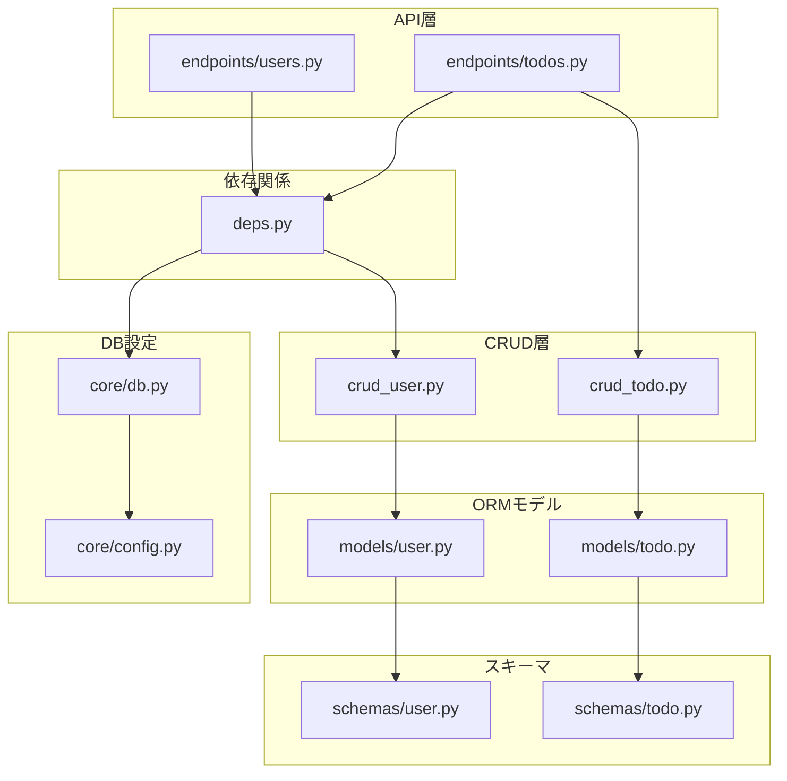
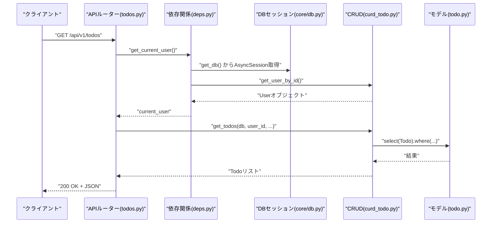
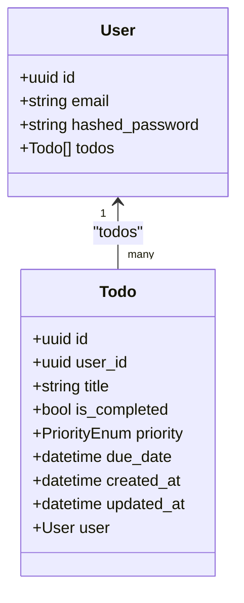
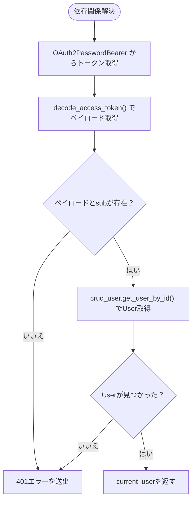
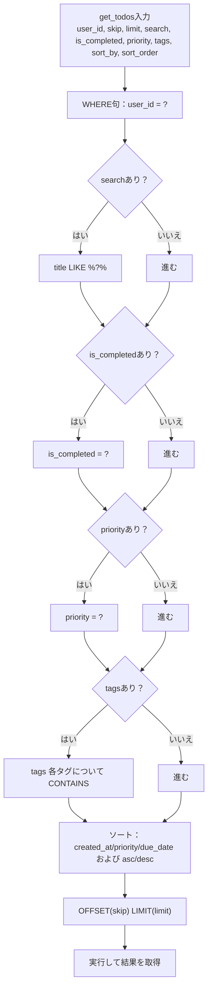
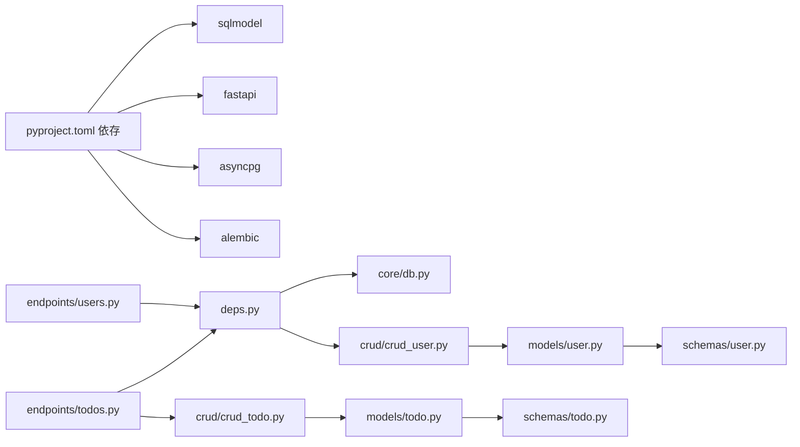

# ORM実装

<cite>
**この文書で参照されるファイル**
- [backend/app/models/user.py](file://backend/app/models/user.py)
- [backend/app/models/todo.py](file://backend/app/models/todo.py)
- [backend/app/schemas/user.py](file://backend/app/schemas/user.py)
- [backend/app/schemas/todo.py](file://backend/app/schemas/todo.py)
- [backend/app/core/db.py](file://backend/app/core/db.py)
- [backend/app/core/config.py](file://backend/app/core/config.py)
- [backend/app/crud/crud_user.py](file://backend/app/crud/crud_user.py)
- [backend/app/crud/crud_todo.py](file://backend/app/crud/crud_todo.py)
- [backend/app/api/api_v1/endpoints/users.py](file://backend/app/api/api_v1/endpoints/users.py)
- [backend/app/api/api_v1/endpoints/todos.py](file://backend/app/api/api_v1/endpoints/todos.py)
- [backend/app/api/deps.py](file://backend/app/api/deps.py)
- [backend/app/models/__init__.py](file://backend/app/models/__init__.py)
- [backend/migrations/versions/4f4084d80ebd_create_users_and_todos_tables.py](file://backend/migrations/versions/4f4084d80ebd_create_users_and_todos_tables.py)
- [backend/migrations/versions/add_indexes.py](file://backend/migrations/versions/add_indexes.py)
- [backend/pyproject.toml](file://backend/pyproject.toml)
</cite>

## 目次
1. [はじめに](#はじめに)
2. [プロジェクト構造](#プロジェクト構造)
3. [コアコンポーネント](#コアコンポーネント)
4. [アーキテクチャ概観](#アーキテクチャ概観)
5. [詳細コンポーネント解析](#詳細コンポーネント解析)
6. [依存関係分析](#依存関係分析)
7. [パフォーマンス考慮事項](#パフォーマンス考慮事項)
8. [トラブルシューティングガイド](#トラブルシューティングガイド)
9. [結論](#結論)
10. [付録](#付録)

## はじめに
本ドキュメントは、SQLModelを使用したORMモデルの実装方法を網羅的に解説します。特に以下の点に焦点を当てます：
- モデルクラスの定義方法、フィールドの型指定、関連付けの設定
- データベース接続の設定、セッション管理、トランザクション処理
- User-Todo間の関係性定義、クエリの実行方法、データの取得・更新・削除パターン
- パフォーマンス最適化のアプローチと注意点

## プロジェクト構造
バックエンドはFastAPI + SQLModel + SQLAlchemy async engineによる非同期ORMレイヤーで構成されています。主なモジュールは以下の通りです：
- models：SQLModelモデル定義（User、Todo）
- schemas：Pydanticベースの入出力スキーマ（User、Todo）
- core：設定（Settings）とDB接続（engine、sessionmaker、get_db）
- crud：CRUDロジック（ユーザー、TODO）
- api：APIエンドポイント（FastAPIルーター）
- migrations：Alembicによるマイグレーション

**図の出典**
- [backend/app/api/api_v1/endpoints/users.py:1-14](file://backend/app/api/api_v1/endpoints/users.py#L1-L14)
- [backend/app/api/api_v1/endpoints/todos.py:1-102](file://backend/app/api/api_v1/endpoints/todos.py#L1-L102)
- [backend/app/api/deps.py:1-37](file://backend/app/api/deps.py#L1-L37)
- [backend/app/crud/crud_user.py:1-28](file://backend/app/crud/crud_user.py#L1-L28)
- [backend/app/crud/crud_todo.py:1-152](file://backend/app/crud/crud_todo.py#L1-L152)
- [backend/app/models/user.py:1-16](file://backend/app/models/user.py#L1-L16)
- [backend/app/models/todo.py:1-25](file://backend/app/models/todo.py#L1-L25)
- [backend/app/schemas/user.py:1-13](file://backend/app/schemas/user.py#L1-L13)
- [backend/app/schemas/todo.py:1-41](file://backend/app/schemas/todo.py#L1-L41)
- [backend/app/core/config.py:1-91](file://backend/app/core/config.py#L1-L91)
- [backend/app/core/db.py:1-17](file://backend/app/core/db.py#L1-L17)

**節の出典**
- [backend/app/models/user.py:1-16](file://backend/app/models/user.py#L1-L16)
- [backend/app/models/todo.py:1-25](file://backend/app/models/todo.py#L1-L25)
- [backend/app/schemas/user.py:1-13](file://backend/app/schemas/user.py#L1-L13)
- [backend/app/schemas/todo.py:1-41](file://backend/app/schemas/todo.py#L1-L41)
- [backend/app/core/db.py:1-17](file://backend/app/core/db.py#L1-L17)
- [backend/app/core/config.py:1-91](file://backend/app/core/config.py#L1-L91)
- [backend/app/crud/crud_user.py:1-28](file://backend/app/crud/crud_user.py#L1-L28)
- [backend/app/crud/crud_todo.py:1-152](file://backend/app/crud/crud_todo.py#L1-L152)
- [backend/app/api/api_v1/endpoints/users.py:1-14](file://backend/app/api/api_v1/endpoints/users.py#L1-L14)
- [backend/app/api/api_v1/endpoints/todos.py:1-102](file://backend/app/api/api_v1/endpoints/todos.py#L1-L102)
- [backend/app/api/deps.py:1-37](file://backend/app/api/deps.py#L1-L37)
- [backend/app/models/__init__.py:1-4](file://backend/app/models/__init__.py#L1-L4)

## コアコンポーネント
- 設定（Settings）：環境変数からDB接続文字列を生成し、開発/本番の挙動を切り替えます。
- DB接続：SQLAlchemy async engineとsessionmakerを用いて非同期セッションを提供。
- モデル（User、Todo）：SQLModelのField、Relationship、Indexを用いた定義。
- スキーマ（User、Todo）：Pydanticベースの入出力バリデーション。
- CRUD：非同期SQLModelクエリによるCRUD操作。
- APIエンドポイント：FastAPIルーターによるHTTPエンドポイント。

**節の出典**
- [backend/app/core/config.py:44-48](file://backend/app/core/config.py#L44-L48)
- [backend/app/core/db.py:5-16](file://backend/app/core/db.py#L5-L16)
- [backend/app/models/user.py:9-15](file://backend/app/models/user.py#L9-L15)
- [backend/app/models/todo.py:10-24](file://backend/app/models/todo.py#L10-L24)
- [backend/app/schemas/user.py:5-12](file://backend/app/schemas/user.py#L5-L12)
- [backend/app/schemas/todo.py:13-34](file://backend/app/schemas/todo.py#L13-L34)
- [backend/app/crud/crud_user.py:8-27](file://backend/app/crud/crud_user.py#L8-L27)
- [backend/app/crud/crud_todo.py:10-151](file://backend/app/crud/crud_todo.py#L10-L151)
- [backend/app/api/api_v1/endpoints/todos.py:13-101](file://backend/app/api/api_v1/endpoints/todos.py#L13-L101)

## アーキテクチャ概観
以下は、認証済みユーザーがTODOを操作する際の典型的なフローです。

**図の出典**
- [backend/app/api/api_v1/endpoints/todos.py:32-57](file://backend/app/api/api_v1/endpoints/todos.py#L32-L57)
- [backend/app/api/deps.py:13-36](file://backend/app/api/deps.py#L13-L36)
- [backend/app/core/db.py:14-16](file://backend/app/core/db.py#L14-L16)
- [backend/app/crud/crud_todo.py:10-71](file://backend/app/crud/crud_todo.py#L10-L71)
- [backend/app/models/todo.py:10-24](file://backend/app/models/todo.py#L10-L24)

## 詳細コンポーネント解析

### UserモデルとTodoモデル
- Userモデル
  - 主キー：UUID
  - フィールド：email（ユニーク、インデックス）、hashed_password
  - 関連付け：todos（Todoのリスト、back_populatesで双方向）
- Todoモデル
  - 主キー：UUID
  - 外部キー：user_id → users.id
  - インデックス：created_at、is_completed、priority、due_date
  - 関連付け：user（User、back_populatesで双方向）

**図の出典**
- [backend/app/models/user.py:9-15](file://backend/app/models/user.py#L9-L15)
- [backend/app/models/todo.py:10-24](file://backend/app/models/todo.py#L10-L24)

**節の出典**
- [backend/app/models/user.py:9-15](file://backend/app/models/user.py#L9-L15)
- [backend/app/models/todo.py:10-24](file://backend/app/models/todo.py#L10-L24)

### スキーマ（Pydantic）
- UserBase：email（EmailStr、ユニーク、インデックス）
- UserCreate：email、password
- UserRead：email、id
- TodoBase：title、is_completed、priority、due_date、tags
- TodoCreate：TodoBase
- TodoUpdate：title、is_completed、priority、due_date、tags（すべてOptional）
- TodoRead：TodoBaseにid、user_id、created_at、updated_atを追加
- TodoCountResponse：total
- TodoDeleteResponse：status

**節の出典**
- [backend/app/schemas/user.py:5-12](file://backend/app/schemas/user.py#L5-L12)
- [backend/app/schemas/todo.py:13-41](file://backend/app/schemas/todo.py#L13-L41)

### DB接続設定とセッション管理
- Settings.async_database_url：環境変数またはデフォルト値から接続文字列を生成
- engine：asyncpg + postgresql
- async_session：expire_on_commit=Falseでセッションを生成
- get_db：非同期ジェネレータとしてDBセッションを提供（依存関係注入用）

**節の出典**
- [backend/app/core/config.py:44-48](file://backend/app/core/config.py#L44-L48)
- [backend/app/core/db.py:5-16](file://backend/app/core/db.py#L5-L16)

### 依存関係と認証フロー
- OAuth2PasswordBearer：/api/v1/auth/token で取得したトークンを使用
- get_current_user：トークンをデコードし、DBからUserを取得
- FastAPIルーターの各エンドポイントは、current_userをDependsで注入

**図の出典**
- [backend/app/api/deps.py:13-36](file://backend/app/api/deps.py#L13-L36)

**節の出典**
- [backend/app/api/deps.py:11-36](file://backend/app/api/deps.py#L11-L36)

### CRUD操作（ユーザー）
- get_user_by_email：emailでUserを検索
- get_user_by_id：idでUserを検索
- create_user：パスワードをハッシュ化して新規作成、commit後にrefresh

**節の出典**
- [backend/app/crud/crud_user.py:8-27](file://backend/app/crud/crud_user.py#L8-L27)

### CRUD操作（TODO）
- get_todos：user_idで絞り込み、検索・フィルタ・ソート・ページネーション対応
- count_todos：同条件での件数取得
- create_todo：TodoCreateをモデルに変換し、user_idを埋め込み作成
- update_todo：指定フィールドのみ更新、updated_atを更新日時で上書き
- delete_todo：該当レコードを削除

**図の出典**
- [backend/app/crud/crud_todo.py:10-71](file://backend/app/crud/crud_todo.py#L10-L71)

**節の出典**
- [backend/app/crud/crud_todo.py:10-151](file://backend/app/crud/crud_todo.py#L10-L151)

### APIエンドポイント（TODO）
- GET /api/v1/todos/count：件数取得
- GET /api/v1/todos：一覧取得（検索・フィルタ・ソート・ページネーション）
- POST /api/v1/todos：作成
- PUT /api/v1/todos/{id}：更新（404未検出）
- DELETE /api/v1/todos/{id}：削除（404未検出）

**節の出典**
- [backend/app/api/api_v1/endpoints/todos.py:13-101](file://backend/app/api/api_v1/endpoints/todos.py#L13-L101)

### APIエンドポイント（ユーザー）
- GET /api/v1/users/me：現在のユーザー情報を取得

**節の出典**
- [backend/app/api/api_v1/endpoints/users.py:9-13](file://backend/app/api/api_v1/endpoints/users.py#L9-L13)

## 依存関係分析
- 外部依存：SQLModel、FastAPI、asyncpg、Alembic、Pydantic Settings
- 内部依存：models ↔ schemas、crud ↔ models、api ↔ crud、deps ↔ db

**図の出典**
- [backend/pyproject.toml:7-25](file://backend/pyproject.toml#L7-L25)
- [backend/app/models/user.py:1-16](file://backend/app/models/user.py#L1-L16)
- [backend/app/models/todo.py:1-25](file://backend/app/models/todo.py#L1-L25)
- [backend/app/schemas/user.py:1-13](file://backend/app/schemas/user.py#L1-L13)
- [backend/app/schemas/todo.py:1-41](file://backend/app/schemas/todo.py#L1-L41)
- [backend/app/crud/crud_user.py:1-28](file://backend/app/crud/crud_user.py#L1-L28)
- [backend/app/crud/crud_todo.py:1-152](file://backend/app/crud/crud_todo.py#L1-L152)
- [backend/app/api/api_v1/endpoints/users.py:1-14](file://backend/app/api/api_v1/endpoints/users.py#L1-L14)
- [backend/app/api/api_v1/endpoints/todos.py:1-102](file://backend/app/api/api_v1/endpoints/todos.py#L1-L102)
- [backend/app/api/deps.py:1-37](file://backend/app/api/deps.py#L1-L37)
- [backend/app/core/db.py:1-17](file://backend/app/core/db.py#L1-L17)

**節の出典**
- [backend/pyproject.toml:7-25](file://backend/pyproject.toml#L7-L25)

## パフォーマンス考慮事項
- インデックス戦略
  - Todo：created_at、is_completed、priority、due_date、user_id
  - User：email（ユニークインデックス）
  - 参考マイグレーション：[backend/migrations/versions/add_indexes.py:22-27](file://backend/migrations/versions/add_indexes.py#L22-L27)
- 非同期クエリ
  - CRUDは非同期SQLModelクエリを使用し、DBアクセスを効率化
- トランザクション
  - CRUDメソッド内でcommit/refreshを呼び出し、一貫性を保つ
- ソートとページネーション
  - get_todosではLIMIT/OFFSETによるページネーション、SQLModelのcol()による列指定ソート
- 検索条件
  - LIKE（contains）はインデックス効率が悪いため、必要に応じて全文検索エンジン導入を検討

**節の出典**
- [backend/app/models/todo.py:12-17](file://backend/app/models/todo.py#L12-L17)
- [backend/app/schemas/user.py](file://backend/app/schemas/user.py#L6)
- [backend/app/crud/crud_todo.py:10-71](file://backend/app/crud/crud_todo.py#L10-L71)

## トラブルシューティングガイド
- 401エラー（認証失敗）
  - トークン形式不正、subなし、DBに該当Userなし
  - 対応：get_current_userの例外処理を確認
- 404エラー（TODO未検出）
  - 更新/削除時に該当レコードが存在しない
  - 対応：APIエンドポイントのHTTPExceptionを確認
- DB接続エラー
  - Settings.async_database_urlが正しいか、環境変数が設定されているか
  - 対応：core/config.pyのDATABASE_URLまたはデフォルト値の確認
- トランザクション未反映
  - commit忘れ、refresh忘れ
  - 対応：CRUDメソッド内のcommit/refreshの呼び出しを確認

**節の出典**
- [backend/app/api/deps.py:17-36](file://backend/app/api/deps.py#L17-L36)
- [backend/app/api/api_v1/endpoints/todos.py:87-101](file://backend/app/api/api_v1/endpoints/todos.py#L87-L101)
- [backend/app/core/config.py:44-48](file://backend/app/core/config.py#L44-L48)
- [backend/app/crud/crud_user.py:24-26](file://backend/app/crud/crud_user.py#L24-L26)
- [backend/app/crud/crud_todo.py:103-140](file://backend/app/crud/crud_todo.py#L103-L140)

## 結論
本プロジェクトは、SQLModelを活用した堅牢なORM実装を提供しています。非同期DB接続、明確なスキーマ定義、CRUD抽象化、APIエンドポイントを通じて、User-Todo間の関係性を安全かつ効率的に扱っています。インデックス戦略と非同期クエリにより、パフォーマンスとスケーラビリティを両立しています。

## 付録
- 初期テーブル作成（マイグレーション）
  - users：id（PK）、email（ユニーク、インデックス）、hashed_password
  - todos：id（PK）、user_id（FK → users.id）、title、is_completed、created_at
  - 参考：[backend/migrations/versions/4f4084d80ebd_create_users_and_todos_tables.py:24-40](file://backend/migrations/versions/4f4084d80ebd_create_users_and_todos_tables.py#L24-L40)
- インデックス追加（マイグレーション）
  - todos：user_id、created_at、is_completed、priority、due_date
  - users：email
  - 参考：[backend/migrations/versions/add_indexes.py:22-30](file://backend/migrations/versions/add_indexes.py#L22-L30)