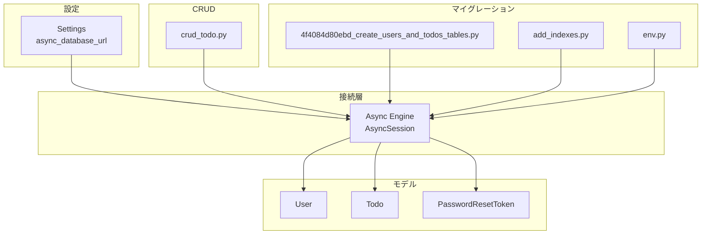
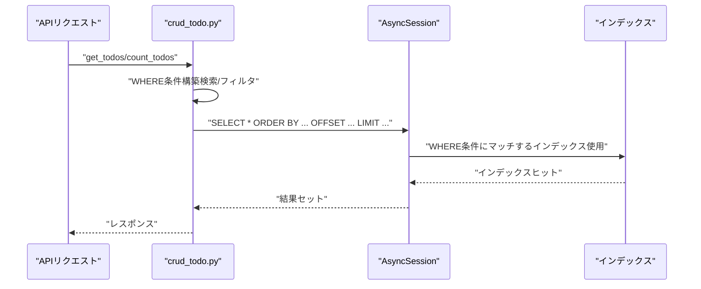
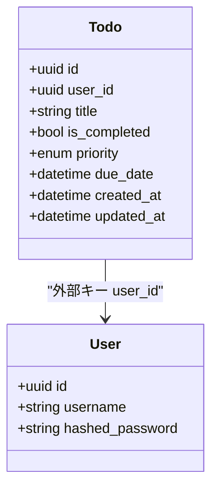
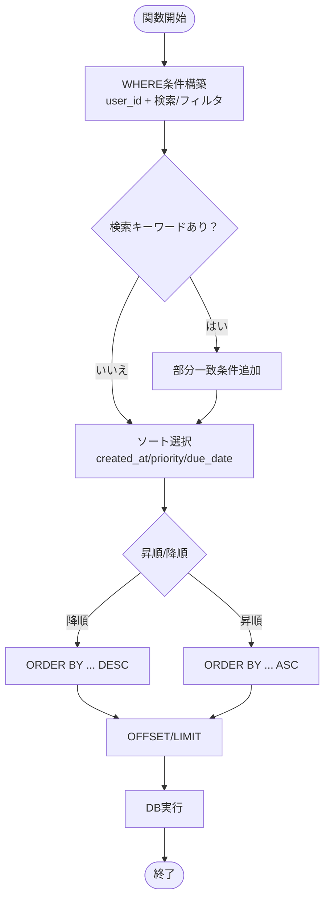
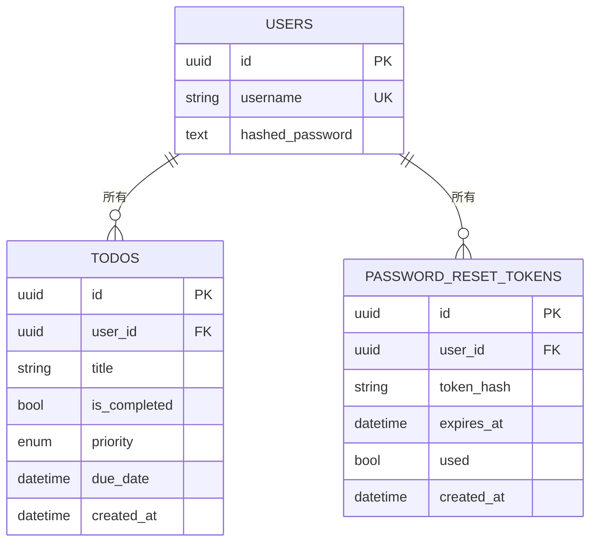
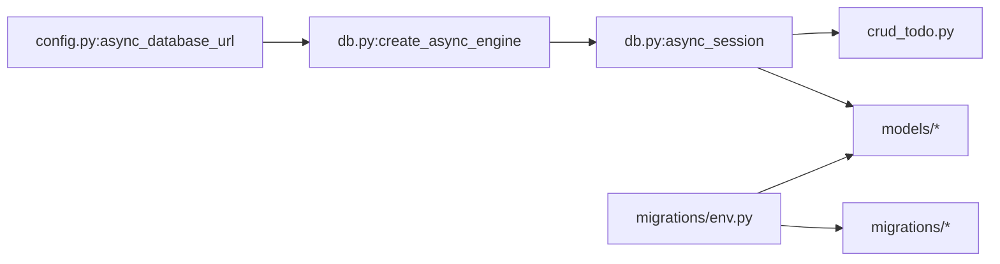

# インデックスとパフォーマンス

<cite>
**本文で参照されたファイル**   
- [backend/app/core/db.py](file://backend/app/core/db.py)
- [backend/app/core/config.py](file://backend/app/core/config.py)
- [backend/app/models/todo.py](file://backend/app/models/todo.py)
- [backend/app/models/user.py](file://backend/app/models/user.py)
- [backend/app/models/password_reset.py](file://backend/app/models/password_reset.py)
- [backend/app/crud/crud_todo.py](file://backend/app/crud/crud_todo.py)
- [backend/migrations/versions/4f4084d80ebd_create_users_and_todos_tables.py](file://backend/migrations/versions/4f4084d80ebd_create_users_and_todos_tables.py)
- [backend/migrations/versions/add_indexes.py](file://backend/migrations/versions/add_indexes.py)
- [backend/migrations/env.py](file://backend/migrations/env.py)
</cite>

## 目次
1. [はじめに](#はじめに)
2. [プロジェクト構造](#プロジェクト構造)
3. [コアコンポーネント](#コアコンポーネント)
4. [アーキテクチャ概要](#アーキテクチャ概要)
5. [詳細コンポーネント解析](#詳細コンポーネント解析)
6. [依存関係分析](#依存関係分析)
7. [パフォーマンスに関する考慮事項](#パフォーマンスに関する考慮事項)
8. [トラブルシューティングガイド](#トラブルシューティングガイド)
9. [結論](#結論)

## はじめに
本ドキュメントは、Todoアプリケーションにおける「データベースのパフォーマンス最適化」に焦点を当てたものです。特に、WHERE句での検索性能向上のためのインデックス配置、複合インデックスの設計方法、クエリプランの確認方法、WHERE条件にマッチするインデックスの選定基準、SELECT COUNT(*)の高速化、LIKE検索（部分一致）のパフォーマンス改善策について解説します。また、データの整合性とパフォーマンスのバランスを取る設計思想とその実装方法も示します。

## プロジェクト構造
バックエンドはSQLModel + SQLAlchemy非同期エンジン（asyncpg）を用いており、Alembicによるマイグレーション管理が行われています。データモデル（User/Todo/PasswordResetToken）はSQLModelのORMとして定義され、インデックスはコード上（modelレベル）とマイグレーション（alembic）の両方で定義されています。

**図の出典**
- [backend/app/core/config.py:44-48](file://backend/app/core/config.py#L44-L48)
- [backend/app/core/db.py:5-12](file://backend/app/core/db.py#L5-L12)
- [backend/migrations/versions/4f4084d80ebd_create_users_and_todos_tables.py:24-40](file://backend/migrations/versions/4f4084d80ebd_create_users_and_todos_tables.py#L24-L40)
- [backend/migrations/versions/add_indexes.py:20-31](file://backend/migrations/versions/add_indexes.py#L20-L31)
- [backend/migrations/env.py:66-82](file://backend/migrations/env.py#L66-L82)

**節の出典**
- [backend/app/core/config.py:44-48](file://backend/app/core/config.py#L44-L48)
- [backend/app/core/db.py:5-12](file://backend/app/core/db.py#L5-L12)
- [backend/migrations/versions/4f4084d80ebd_create_users_and_todos_tables.py:24-40](file://backend/migrations/versions/4f4084d80ebd_create_users_and_todos_tables.py#L24-L40)
- [backend/migrations/versions/add_indexes.py:20-31](file://backend/migrations/versions/add_indexes.py#L20-L31)
- [backend/migrations/env.py:66-82](file://backend/migrations/env.py#L66-L82)

## コアコンポーネント
- 接続設定：非同期DB接続用URLを環境設定から取得し、asyncpg経由でEngineを作成します。
- モデル定義：Todo/User/PasswordResetTokenがSQLModelで定義されており、必要に応じてIndexを明示的に指定しています。
- CRUD処理：Todo一覧取得・件数取得・作成・更新・削除が非同期で実装されており、WHERE条件やソート、ページネーションに対応しています。
- マイグレーション：テーブル作成とインデックス追加のマイグレーションが分離・バージョン管理されています。

**節の出典**
- [backend/app/core/config.py:44-48](file://backend/app/core/config.py#L44-L48)
- [backend/app/core/db.py:5-12](file://backend/app/core/db.py#L5-L12)
- [backend/app/models/todo.py:10-24](file://backend/app/models/todo.py#L10-L24)
- [backend/app/models/user.py:9-16](file://backend/app/models/user.py#L9-L16)
- [backend/app/models/password_reset.py:21-32](file://backend/app/models/password_reset.py#L21-L32)
- [backend/app/crud/crud_todo.py:10-152](file://backend/app/crud/crud_todo.py#L10-L152)
- [backend/migrations/versions/4f4084d80ebd_create_users_and_todos_tables.py:21-41](file://backend/migrations/versions/4f4084d80ebd_create_users_and_todos_tables.py#L21-L41)
- [backend/migrations/versions/add_indexes.py:20-41](file://backend/migrations/versions/add_indexes.py#L20-L41)

## アーキテクチャ概要
非同期DB接続を介したCRUDフロー。WHERE条件の組み立て、COUNTクエリ、ソート・ページネーションの適用、インデックスの活用がポイントです。

**図の出典**
- [backend/app/crud/crud_todo.py:10-98](file://backend/app/crud/crud_todo.py#L10-L98)
- [backend/app/core/db.py:14-16](file://backend/app/core/db.py#L14-L16)
- [backend/migrations/versions/add_indexes.py:20-31](file://backend/migrations/versions/add_indexes.py#L20-L31)

## 詳細コンポーネント解析

### Todoモデル（インデックス定義）
- 明示的なIndex：created_at、is_completed、priority、due_date
- 外部キー列user_id：インデックスあり（modelレベル）
- 目的：WHERE user_idによるフィルタ、日付・完了状態・優先度でのソート・フィルタを高速化

**図の出典**
- [backend/app/models/todo.py:10-24](file://backend/app/models/todo.py#L10-L24)
- [backend/app/models/user.py:9-16](file://backend/app/models/user.py#L9-L16)

**節の出典**
- [backend/app/models/todo.py:10-24](file://backend/app/models/todo.py#L10-L24)
- [backend/app/models/user.py:9-16](file://backend/app/models/user.py#L9-L16)

### CRUD（WHERE条件・COUNT・ソート・ページネーション）
- get_todos：user_id必須、検索（部分一致）、完了状態、優先度、タグ（複数指定可能）、ソート（created_at/priority/due_date）、DESC/ASC、OFFSET/LIMIT
- count_todos：同条件での件数取得（SELECT COUNT）

**図の出典**
- [backend/app/crud/crud_todo.py:10-71](file://backend/app/crud/crud_todo.py#L10-L71)

**節の出典**
- [backend/app/crud/crud_todo.py:10-71](file://backend/app/crud/crud_todo.py#L10-L71)
- [backend/app/crud/crud_todo.py:73-98](file://backend/app/crud/crud_todo.py#L73-L98)

### インデックス設計（マイグレーション）
- 初期テーブル作成時：users.username（ユニークインデックス）
- 追加インデックス：todos.user_id、created_at、is_completed、priority、due_date
- 目的：user_idでのフィルタ、日付範囲・完了状態・優先度での高速検索、並び替え

**図の出典**
- [backend/migrations/versions/4f4084d80ebd_create_users_and_todos_tables.py:24-40](file://backend/migrations/versions/4f4084d80ebd_create_users_and_todos_tables.py#L24-L40)
- [backend/migrations/versions/add_indexes.py:20-31](file://backend/migrations/versions/add_indexes.py#L20-L31)

**節の出典**
- [backend/migrations/versions/4f4084d80ebd_create_users_and_todos_tables.py:24-40](file://backend/migrations/versions/4f4084d80ebd_create_users_and_todos_tables.py#L24-L40)
- [backend/migrations/versions/add_indexes.py:20-31](file://backend/migrations/versions/add_indexes.py#L20-L31)

### パスワードリセットトークン（インデックス活用例）
- token_hash：インデックスあり（一意性は保証していないが、検索速度向上）
- 有効期限・未使用フラグによるバリデーション

**節の出典**
- [backend/app/models/password_reset.py:21-32](file://backend/app/models/password_reset.py#L21-L32)

## 依存関係分析
- 接続設定 → DBエンジン → モデル（SQLModel） → CRUD → API
- Alembicのenv.pyがモデルをインポートし、マイグレーションを実行
- 非同期接続（asyncpg）により、I/OバウンドなDBアクセスを効率化

**図の出典**
- [backend/app/core/config.py:44-48](file://backend/app/core/config.py#L44-L48)
- [backend/app/core/db.py:5-12](file://backend/app/core/db.py#L5-L12)
- [backend/migrations/env.py:66-82](file://backend/migrations/env.py#L66-L82)

**節の出典**
- [backend/app/core/config.py:44-48](file://backend/app/core/config.py#L44-L48)
- [backend/app/core/db.py:5-12](file://backend/app/core/db.py#L5-L12)
- [backend/migrations/env.py:66-82](file://backend/migrations/env.py#L66-L82)

## パフォーマンスに関する考慮事項

### WHERE句での検索性能向上のためのインデックス配置
- user_id（外部キー）：Todoの基本フィルタ（CRUDの多くがuser_idを前提）
- 日付系：created_at、due_date（日付範囲・期限切れ処理など）
- 真偽値：is_completed（完了/未完了のフィルタ）
- 列挙型：priority（優先度でのフィルタ・ソート）
- これらはCRUDのWHERE条件に頻出しており、インデックスにより効果的に利用できます。

**節の出典**
- [backend/app/models/todo.py:12-17](file://backend/app/models/todo.py#L12-L17)
- [backend/migrations/versions/add_indexes.py:22-27](file://backend/migrations/versions/add_indexes.py#L22-L27)
- [backend/app/crud/crud_todo.py:25-43](file://backend/app/crud/crud_todo.py#L25-L43)

### 複合インデックスの設計方法
- 現状：todos.user_id単体インデックスあり
- 今後の候補：
  - user_id + is_completed：ユーザーごとの完了状態フィルタ
  - user_id + priority：ユーザーごとの優先度フィルタ
  - user_id + due_date：期限別集計・スケジュール表示
  - user_id + created_at：タイムスタンプでのソート・ページネーション
- 設計原則：
  - SELECT WHERE ORDER BYの列の順序に注意（user_idを先頭に）
  - 高Selectivityな列（例：user_id）を左に配置
  - 使用頻度の高いWHERE条件の組み合わせを考慮

**節の出典**
- [backend/app/models/todo.py:20](file://backend/app/models/todo.py#L20)
- [backend/app/crud/crud_todo.py:25-65](file://backend/app/crud/crud_todo.py#L25-L65)

### クエリプランの確認方法
- 開発環境（echo）：SQLAlchemyのechoオプションによりSQL出力可
- PostgreSQL：EXPLAIN/EXPLAIN ANALYZEでクエリプラン確認
- 実装上の確認ポイント：
  - WHERE条件（部分一致含む）がインデックスを活かせるか
  - ORDER BY列がインデックス順に一致するか
  - COUNTクエリが効率的に走るか

**節の出典**
- [backend/app/core/db.py:7](file://backend/app/core/db.py#L7)
- [backend/app/crud/crud_todo.py:84-98](file://backend/app/crud/crud_todo.py#L84-L98)

### WHERE条件にマッチするインデックスの選定基準
- 単一列：user_id、is_completed、priority、due_date、created_at
- 部分一致：title.contains/tags.contains（現状インデックスなし）
- 選定基準：
  - WHEREに現れる列のSelectivity
  - ORDER BY列との一致度
  - 頻出条件の組み合わせ（user_id + 他の列）

**節の出典**
- [backend/app/crud/crud_todo.py:28-43](file://backend/app/crud/crud_todo.py#L28-L43)
- [backend/migrations/versions/add_indexes.py:22-27](file://backend/migrations/versions/add_indexes.py#L22-L27)

### SELECT COUNT(*)の高速化
- 現状：COUNTクエリでSELECT COUNT(*)（SQLModelのfunc.count）
- 改善案：
  - 件数が多い場合、WHERE条件にマッチするインデックスを活かす
  - 集計クエリをキャッシュ（一定期間）する
  - 分散集計（例：Redisなど）を検討

**節の出典**
- [backend/app/crud/crud_todo.py:73-98](file://backend/app/crud/crud_todo.py#L73-L98)

### LIKE検索（部分一致）のパフォーマンス改善策
- 現状：title.contains/tags.contains（PostgreSQLのILIKE/POSIX正規表現）
- 改善策：
  - トークン化＋FTS（全文検索）導入（例：pg_trgm + GINインデックス）
  - 部分一致の前缀（prefix）に限定（例：前方一致のみ）
  - 検索キーワードの事前正規化（大文字小文字統一、不要文字除去）

**節の出典**
- [backend/app/crud/crud_todo.py:28-43](file://backend/app/crud/crud_todo.py#L28-L43)

### 整合性とパフォーマンスのバランス
- 整合性：
  - 外部キー制約（user_id → users.id）
  - ユニークインデックス（users.username）
  - NOT NULL制約（必須フィールド）
- パフォーマンス：
  - WHERE/OB/INDEXのマッチを意識した設計
  - 過剰インデックスは書き込みコスト増
  - 集計・キャッシュ戦略で読み取り性能を高める

**節の出典**
- [backend/migrations/versions/4f4084d80ebd_create_users_and_todos_tables.py:32-40](file://backend/migrations/versions/4f4084d80ebd_create_users_and_todos_tables.py#L32-L40)
- [backend/app/models/todo.py:20](file://backend/app/models/todo.py#L20)
- [backend/app/models/password_reset.py:26](file://backend/app/models/password_reset.py#L26)

## トラブルシューティングガイド
- SQL出力確認：開発環境でecho=true（設定値）によりSQLログを確認
- インデックスの有無：EXPLAINで使用されるインデックスを確認
- 部分一致の遅さ：FTS導入または前方一致に制限
- COUNTの遅さ：WHERE条件のSelectivity向上、集計キャッシュ導入

**節の出典**
- [backend/app/core/db.py:7](file://backend/app/core/db.py#L7)
- [backend/app/crud/crud_todo.py:84-98](file://backend/app/crud/crud_todo.py#L84-L98)

## 結論
本アプリケーションでは、WHERE条件に頻出するuser_id、日付、完了状態、優先度に対してインデックスを配置し、CRUDのパフォーマンスを支えています。さらに、COUNTクエリや部分一致検索については、FTS導入やキャッシュ戦略、前方一致制限などの改善が可能です。設計思想としては、整合性を維持しつつ、読み取り性能を高めるためにWHERE/OB/INDEXのマッチを意識した複合インデックス設計と、必要に応じた集計キャッシュを組み合わせることが鍵です。