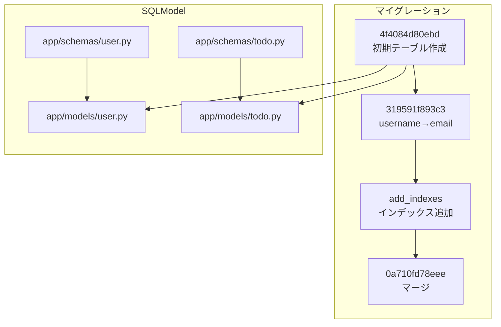
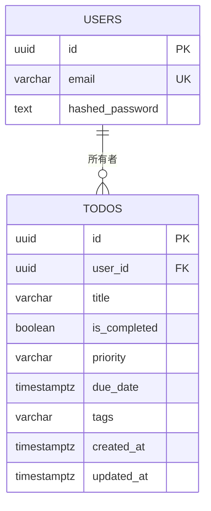
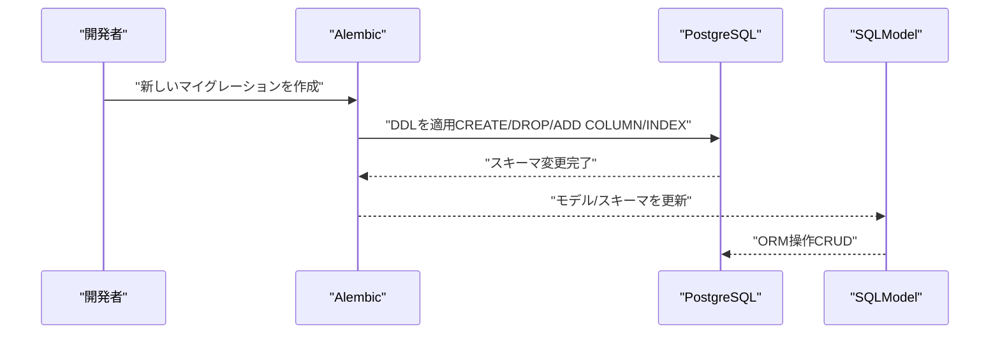
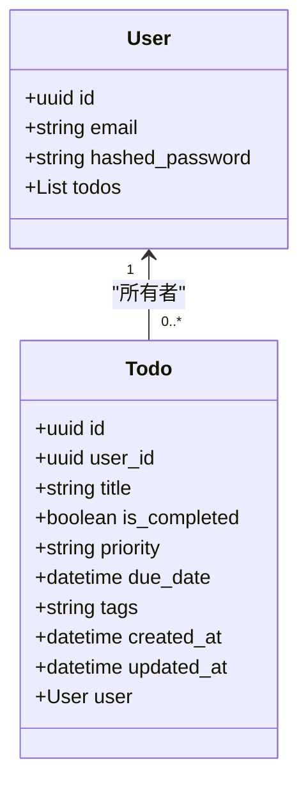
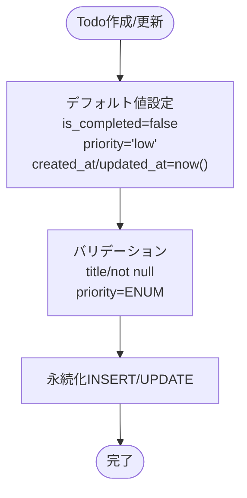
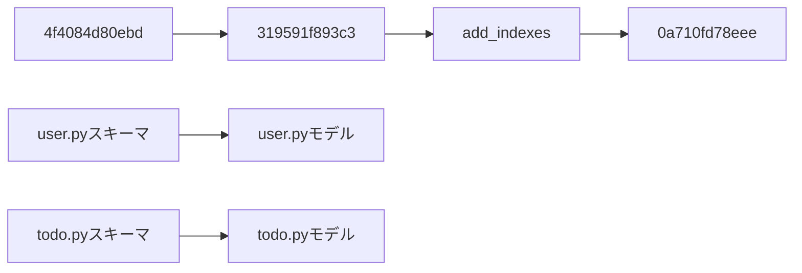

# データベーススキーマ

<cite>
**この文書で参照されるファイル**
- [4f4084d80ebd_create_users_and_todos_tables.py](file://backend/migrations/versions/4f4084d80ebd_create_users_and_todos_tables.py)
- [319591f893c3_rename_username_to_email.py](file://backend/migrations/versions/319591f893c3_rename_username_to_email.py)
- [add_indexes.py](file://backend/migrations/versions/add_indexes.py)
- [0a710fd78eee_merge_heads.py](file://backend/migrations/versions/0a710fd78eee_merge_heads.py)
- [user.py（モデル）](file://backend/app/models/user.py)
- [todo.py（モデル）](file://backend/app/models/todo.py)
- [user.py（スキーマ）](file://backend/app/schemas/user.py)
- [todo.py（スキーマ）](file://backend/app/schemas/todo.py)
- [SPECIFICATION.md](file://SPECIFICATION.md)
</cite>

## 目次
1. [導入](#導入)
2. [プロジェクト構造](#プロジェクト構造)
3. [コアコンポーネント](#コアコンポーネント)
4. [アーキテクチャ概観](#アーキテクチャ概観)
5. [詳細コンポーネント分析](#詳細コンポーネント分析)
6. [依存関係分析](#依存関係分析)
7. [性能に関する考慮事項](#性能に関する考慮事項)
8. [トラブルシューティングガイド](#トラブルシューティングガイド)
9. [結論](#結論)
10. [付録](#付録)

## 導入
本ドキュメントでは、PostgreSQLデータベースにおけるTodoアプリケーションのテーブルスキーマを詳細に説明します。特に以下の点に焦点を当てます：
- usersテーブルとtodosテーブルの各カラムのデータ型、制約、デフォルト値
- 主キー、外部キー、ユニーク制約、NOT NULL制約の設計理由
- テーブル間の関係性（1対多）と参照整合性制約
- 各データ型（UUID、VARCHAR、BOOLEAN、TIMESTAMP、ENUMなど）の選定基準と利点

また、スキーマの進化過程（マイグレーション）と現在の実装（SQLModelモデル/スキーマ）を統合的に解釈し、仕様書との整合性も確認します。

## プロジェクト構造
バックエンドのデータベーススキーマは、AlembicマイグレーションとSQLModelモデル/スキーマによって定義・管理されています。以下は関連するファイルの位置と役割です：

- マイグレーション（スキーマ変更の記録）
  - 4f4084d80ebd_create_users_and_todos_tables.py：users/todosテーブルの初期作成
  - 319591f893c3_rename_username_to_email.py：usernameカラムをemailカラムに変更（ユニーク制約付き）
  - add_indexes.py：インデックス追加（todos/emailの検索・フィルタ性能向上）
  - 0a710fd78eee_merge_heads.py：複数マイグレーションのマージ（現状は空処理）

- SQLModelモデル（ORM定義）
  - app/models/user.py：usersテーブルのORMマッピング
  - app/models/todo.py：todosテーブルのORMマッピング（追加カラムあり）

- SQLModelスキーマ（Pydanticベースのバリデーション/シリアライズ）
  - app/schemas/user.py：usersのスキーマ（email、ユニーク、インデックス）
  - app/schemas/todo.py：todosのスキーマ（ENUM、デフォルト値、バリデーション）

**図の出典**
- [4f4084d80ebd_create_users_and_todos_tables.py:21-50](file://backend/migrations/versions/4f4084d80ebd_create_users_and_todos_tables.py#L21-L50)
- [319591f893c3_rename_username_to_email.py:21-38](file://backend/migrations/versions/319591f893c3_rename_username_to_email.py#L21-L38)
- [add_indexes.py:20-40](file://backend/migrations/versions/add_indexes.py#L20-L40)
- [0a710fd78eee_merge_heads.py:21-28](file://backend/migrations/versions/0a710fd78eee_merge_heads.py#L21-L28)
- [user.py（モデル）:9-15](file://backend/app/models/user.py#L9-L15)
- [todo.py（モデル）:10-24](file://backend/app/models/todo.py#L10-L24)
- [user.py（スキーマ）:5-12](file://backend/app/schemas/user.py#L5-L12)
- [todo.py（スキーマ）:13-41](file://backend/app/schemas/todo.py#L13-L41)

**節の出典**
- [4f4084d80ebd_create_users_and_todos_tables.py:21-50](file://backend/migrations/versions/4f4084d80ebd_create_users_and_todos_tables.py#L21-L50)
- [319591f893c3_rename_username_to_email.py:21-38](file://backend/migrations/versions/319591f893c3_rename_username_to_email.py#L21-L38)
- [add_indexes.py:20-40](file://backend/migrations/versions/add_indexes.py#L20-L40)
- [0a710fd78eee_merge_heads.py:21-28](file://backend/migrations/versions/0a710fd78eee_merge_heads.py#L21-L28)
- [user.py（モデル）:9-15](file://backend/app/models/user.py#L9-L15)
- [todo.py（モデル）:10-24](file://backend/app/models/todo.py#L10-L24)
- [user.py（スキーマ）:5-12](file://backend/app/schemas/user.py#L5-L12)
- [todo.py（スキーマ）:13-41](file://backend/app/schemas/todo.py#L13-L41)

## コアコンポーネント
本プロジェクトのデータベーススキーマは、以下の2つのテーブルで構成されます。

- usersテーブル
  - 主キー：id（UUID）
  - ユニーク制約：email（VARCHAR/TEXT型のいずれかの定義が存在）
  - NOT NULL制約：email、hashed_password
  - 用途：認証情報（メールアドレス、ハッシュ化パスワード）を保持

- todosテーブル
  - 主キー：id（UUID）
  - 外部キー：user_id → users.id（1対多）
  - NOT NULL制約：title、user_id
  - ENUM（VARCHAR）：priority（high/medium/low）
  - DEFAULT値：is_completed=false、priority='low'、created_at/updated_at=現在時刻
  - NULLABLE：due_date、tags、is_completed（一部列）
  - 用途：ユーザーごとのTodoアイテムを管理（タイトル、完了フラグ、優先度、期限、タグ、タイムスタンプ）

**図の出典**
- [4f4084d80ebd_create_users_and_todos_tables.py:24-40](file://backend/migrations/versions/4f4084d80ebd_create_users_and_todos_tables.py#L24-L40)
- [319591f893c3_rename_username_to_email.py:24-27](file://backend/migrations/versions/319591f893c3_rename_username_to_email.py#L24-L27)
- [todo.py（モデル）:19-22](file://backend/app/models/todo.py#L19-L22)
- [todo.py（スキーマ）:7-18](file://backend/app/schemas/todo.py#L7-L18)

**節の出典**
- [4f4084d80ebd_create_users_and_todos_tables.py:24-40](file://backend/migrations/versions/4f4084d80ebd_create_users_and_todos_tables.py#L24-L40)
- [319591f893c3_rename_username_to_email.py:24-27](file://backend/migrations/versions/319591f893c3_rename_username_to_email.py#L24-L27)
- [user.py（モデル）:12-13](file://backend/app/models/user.py#L12-L13)
- [user.py（スキーマ）](file://backend/app/schemas/user.py#L6)
- [todo.py（モデル）:19-22](file://backend/app/models/todo.py#L19-L22)
- [todo.py（スキーマ）:14-18](file://backend/app/schemas/todo.py#L14-L18)

## アーキテクチャ概観
スキーマの変更は、マイグレーションによって記録・適用され、SQLModelのモデル/スキーマが実際のORMマッピングとバリデーションを担います。以下はスキーマの進化フローです。

**図の出典**
- [4f4084d80ebd_create_users_and_todos_tables.py:21-50](file://backend/migrations/versions/4f4084d80ebd_create_users_and_todos_tables.py#L21-L50)
- [319591f893c3_rename_username_to_email.py:21-38](file://backend/migrations/versions/319591f893c3_rename_username_to_email.py#L21-L38)
- [add_indexes.py:20-40](file://backend/migrations/versions/add_indexes.py#L20-L40)
- [user.py（モデル）:9-15](file://backend/app/models/user.py#L9-L15)
- [todo.py（モデル）:10-24](file://backend/app/models/todo.py#L10-L24)

## 詳細コンポーネント分析

### usersテーブル
- データ型と制約
  - id：UUID（主キー）
  - email：VARCHAR（長さ255）、NOT NULL、UNIQUE（インデックス付き）
  - hashed_password：TEXT、NOT NULL
- 設計理由
  - UUID：衝突リスクを低減し、分散システムでの一意性を保証
  - emailのUNIQUE：重複したアカウントを防ぎ、認証の信頼性を高める
  - NOT NULL：必須情報を強制し、整合性を維持
- 関連性
  - todosテーブルとの1対多（1人のユーザーが複数のTodoを持つ）

**図の出典**
- [user.py（モデル）:9-15](file://backend/app/models/user.py#L9-L15)
- [todo.py（モデル）:10-24](file://backend/app/models/todo.py#L10-L24)
- [user.py（スキーマ）:5-12](file://backend/app/schemas/user.py#L5-L12)
- [todo.py（スキーマ）:13-34](file://backend/app/schemas/todo.py#L13-L34)

**節の出典**
- [4f4084d80ebd_create_users_and_todos_tables.py:24-30](file://backend/migrations/versions/4f4084d80ebd_create_users_and_todos_tables.py#L24-L30)
- [319591f893c3_rename_username_to_email.py:24-27](file://backend/migrations/versions/319591f893c3_rename_username_to_email.py#L24-L27)
- [user.py（モデル）:12-13](file://backend/app/models/user.py#L12-L13)
- [user.py（スキーマ）](file://backend/app/schemas/user.py#L6)

### todosテーブル
- データ型と制約
  - id：UUID（主キー）
  - user_id：UUID（外部キー users.id、NOT NULL、INDEX付き）
  - title：VARCHAR（255）、NOT NULL
  - is_completed：BOOLEAN、DEFAULT false
  - priority：ENUM（VARCHAR）：high/medium/low、DEFAULT 'low'
  - due_date：TIMESTAMP（NULLABLE）
  - tags：VARCHAR（500）、NULLABLE
  - created_at/updated_at：TIMESTAMP（NULLABLE）、ORMで現在時刻をデフォルトに設定
- 設計理由
  - UUID：一意性と分散性の向上
  - ENUM：優先度の値域を制限し、整合性と検索効率を高める
  - DEFAULT値：デフォルト状態を明確にし、アプリ側のロジックを簡略化
  - INDEX付きuser_id：親子関係のJOINやフィルタ性能を向上
- 関係性
  - 外部キーにより、1人のユーザーが複数のTodoを持つ（1対多）

**図の出典**
- [todo.py（モデル）:19-22](file://backend/app/models/todo.py#L19-L22)
- [todo.py（スキーマ）:14-18](file://backend/app/schemas/todo.py#L14-L18)

**節の出典**
- [4f4084d80ebd_create_users_and_todos_tables.py:32-40](file://backend/migrations/versions/4f4084d80ebd_create_users_and_todos_tables.py#L32-L40)
- [add_indexes.py:22-27](file://backend/migrations/versions/add_indexes.py#L22-L27)
- [todo.py（モデル）:19-22](file://backend/app/models/todo.py#L19-L22)
- [todo.py（スキーマ）:14-18](file://backend/app/schemas/todo.py#L14-L18)

### 参照整合性制約
- 外部キー制約：todos.user_id → users.id
- 設計理由：親子関係の整合性を保ち、不正なデータ挿入を防ぐ
- 影響：usersレコードの削除時に、関連するtodosレコードの扱い（CASCADE削除など）はマイグレーション/ORM設定に依存

**節の出典**
- [4f4084d80ebd_create_users_and_todos_tables.py](file://backend/migrations/versions/4f4084d80ebd_create_users_and_todos_tables.py#L38)

### インデックス戦略
- todos.user_id：外部キー＋頻繁なフィルタ条件（親子関係のクエリ高速化）
- todos.created_at、todos.is_completed、todos.priority、todos.due_date：検索・フィルタ・ソート用
- users.email：ユニークインデックス（重複防止＋検索高速化）

**節の出典**
- [add_indexes.py:22-30](file://backend/migrations/versions/add_indexes.py#L22-L30)
- [319591f893c3_rename_username_to_email.py:25-26](file://backend/migrations/versions/319591f893c3_rename_username_to_email.py#L25-L26)

## 依存関係分析
- マイグレーション依存関係
  - 4f4084d80ebd → 319591f893c3 → add_indexes → 0a710fd78eee（マージ）
- ORM依存関係
  - users/todosモデルはスキーマ（SQLModel）から派生
  - Todoモデルには追加カラム（created_at/updated_at/priority/due_date/tags）が含まれる

**図の出典**
- [4f4084d80ebd_create_users_and_todos_tables.py:21-50](file://backend/migrations/versions/4f4084d80ebd_create_users_and_todos_tables.py#L21-L50)
- [319591f893c3_rename_username_to_email.py:21-38](file://backend/migrations/versions/319591f893c3_rename_username_to_email.py#L21-L38)
- [add_indexes.py:20-40](file://backend/migrations/versions/add_indexes.py#L20-L40)
- [0a710fd78eee_merge_heads.py:21-28](file://backend/migrations/versions/0a710fd78eee_merge_heads.py#L21-L28)
- [user.py（スキーマ）:5-12](file://backend/app/schemas/user.py#L5-L12)
- [todo.py（スキーマ）:13-41](file://backend/app/schemas/todo.py#L13-L41)
- [user.py（モデル）:9-15](file://backend/app/models/user.py#L9-L15)
- [todo.py（モデル）:10-24](file://backend/app/models/todo.py#L10-L24)

**節の出典**
- [0a710fd78eee_merge_heads.py:16-17](file://backend/migrations/versions/0a710fd78eee_merge_heads.py#L16-L17)

## 性能に関する考慮事項
- UUID主キー
  - 利点：分散環境での一意性、衝突リスクの低減
  - 注意：連続性がないため、B-Treeインデックスのス캔効率は劣る傾向（ただし、PostgreSQLのOSSM/OINXは対策あり）
- ENUM（priority）
  - 利点：値域制限によりストレージ効率、クエリの索引利用しやすさ
  - 注意：ENUMの追加/変更にはマイグレーションが必要
- インデックス
  - user_id、created_at、is_completed、priority、due_date：頻繁なフィルタ・ソート条件に対応
  - email：ユニークインデックスにより重複防止と高速検索
- 時刻型（TIMESTAMP vs TIMESTAMPTZ）
  - ORMではtzなし（naive）のdatetimeが設定されているが、DB上での格納形式はマイグレーション定義に依存。アプリ層でUTCを意識することで整合性を保つのが望ましい。

[この節は一般的なガイダンスであり、特定ファイルの解析を伴わない]

## トラブルシューティングガイド
- email重複エラー
  - 症状：UNIQUE制約違反
  - 対処：既存のemailを変更、またはDBのemail一覧を確認
  - 関連：emailのUNIQUE制約（マイグレーションで設定）

- 外部キー違反（todos.user_id）
  - 症状：INSERT/UPDATE時にusers.idが存在しない
  - 対処：対象user_idのusersレコードを事前に作成

- インデックス不足によるクエリ遅延
  - 症状：フィルタ・ソートが遅い
  - 対処：必要に応じて追加インデックスを適用（user_id以外にも）

**節の出典**
- [319591f893c3_rename_username_to_email.py:24-27](file://backend/migrations/versions/319591f893c3_rename_username_to_email.py#L24-L27)
- [4f4084d80ebd_create_users_and_todos_tables.py](file://backend/migrations/versions/4f4084d80ebd_create_users_and_todos_tables.py#L38)
- [add_indexes.py:22-27](file://backend/migrations/versions/add_indexes.py#L22-L27)

## 結論
本スキーマは、UUID主キー、ENUM制限、UNIQUE/NOT NULL制約、適切なインデックス戦略を通じて、整合性・パフォーマンス・保守性を両立させています。users/todosの1対多関係は、外部キー制約によって厳密に保たれ、API層でのフィルタ・ソート・ページネーションがスムーズに動作します。今後の拡張では、ENUMの追加/変更やインデックスのチューニング、必要に応じたCASCADE削除などの整合性ルールの見直しが重要です。

[この節は要約であり、特定ファイルの解析を伴わない]

## 付録
- 仕様書との整合性
  - SPECIFICATION.mdにはtodosのカラム定義（priority ENUM、tags、created_at/updated_at）が記載されており、現行のスキーマ（マイグレーション＋ORM）と一致しています。

**節の出典**
- [SPECIFICATION.md:57-68](file://SPECIFICATION.md#L57-L68)