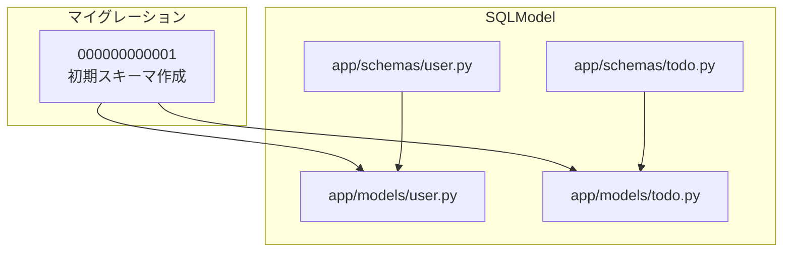
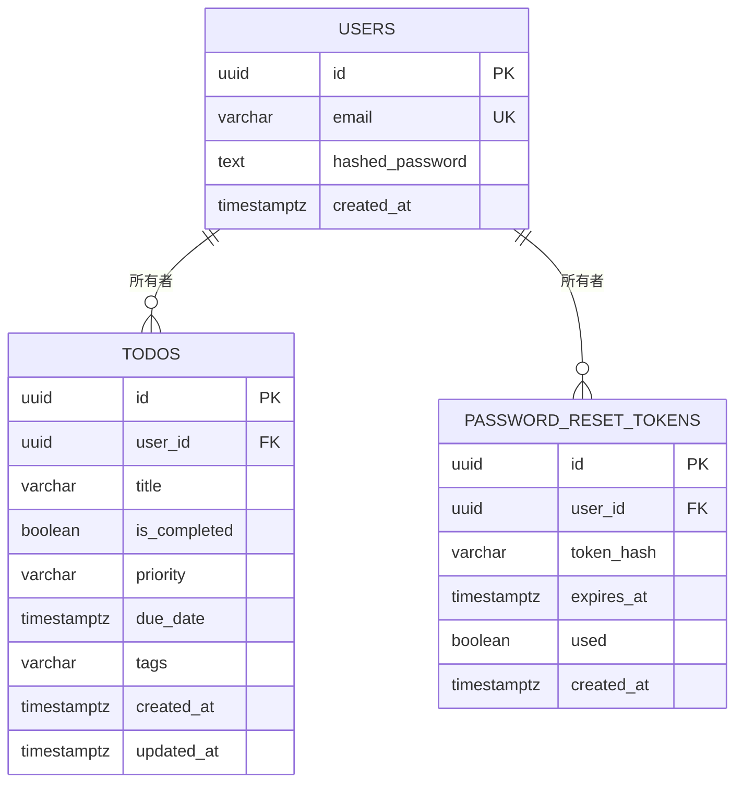
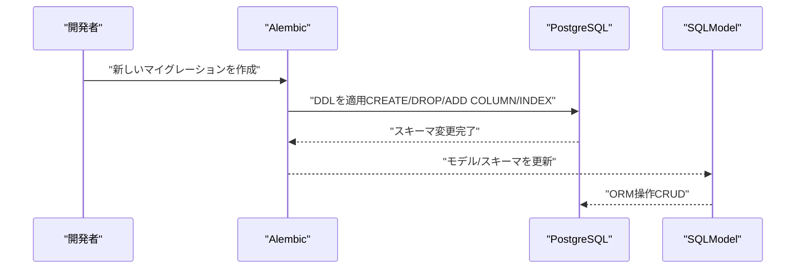
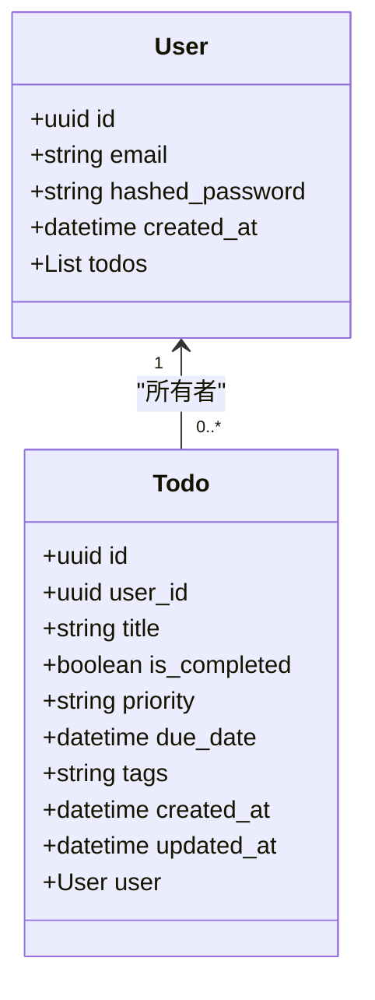
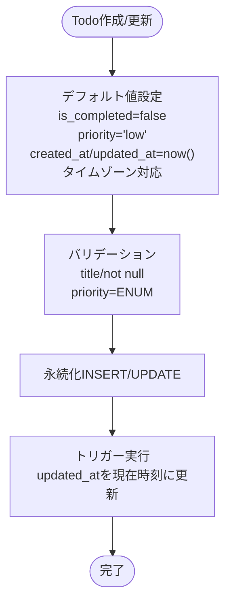
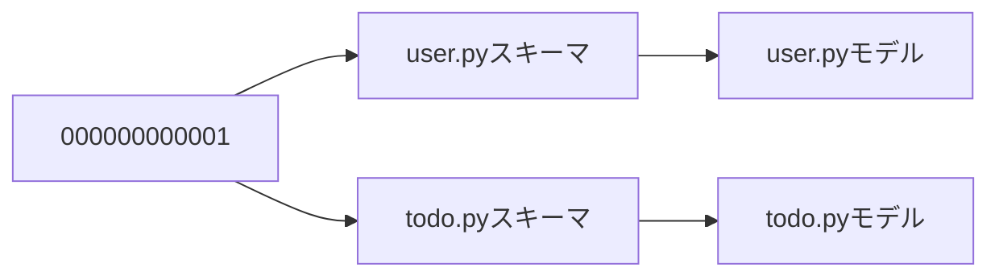

# データベーススキーマ

<cite>
**この文書で参照されるファイル**
- [000000000001_initial_schema.py](file://backend/migrations/versions/000000000001_initial_schema.py)
- [user.py（モデル）](file://backend/app/models/user.py)
- [todo.py（モデル）](file://backend/app/models/todo.py)
- [user.py（スキーマ）](file://backend/app/schemas/user.py)
- [todo.py（スキーマ）](file://backend/app/schemas/todo.py)
- [SPECIFICATION.md](file://SPECIFICATION.md)
</cite>

## 更新概要
**変更内容**
- タイムゾーン対応のタイムスタンプフィールド（DateTime(timezone=True)）の採用
- メールアドレスをユーザーIDとして使用する設計の反映
- 新しい初期スキーママイグレーションの統合
- 3つのテーブル（users、todos、password_reset_tokens）の包括的なスキーマ定義

## 目次
1. [導入](#導入)
2. [プロジェクト構造](#プロジェクト構造)
3. [コアコンポーネント](#コアコンポーネント)
4. [アーキテクチャ概観](#アーキテクチャ概観)
5. [詳細コンポーネント分析](#詳細コンポーネント分析)
6. [依存関係分析](#依存関係分析)
7. [性能に関する考慮事項](#性能に関する考慮事項)
8. [トラブルシューティングガイド](#トラブルシューティングガイド)
9. [結論](#結論)
10. [付録](#付録)

## 導入
本ドキュメントでは、PostgreSQLデータベースにおけるTodoアプリケーションのテーブルスキーマを詳細に説明します。特に以下の点に焦点を当てます：
- usersテーブル、todosテーブル、password_reset_tokensテーブルの各カラムのデータ型、制約、デフォルト値
- 主キー、外部キー、ユニーク制約、NOT NULL制約の設計理由
- テーブル間の関係性（1対多）と参照整合性制約
- 各データ型（UUID、VARCHAR、BOOLEAN、TIMESTAMP WITH TIME ZONE、ENUMなど）の選定基準と利点

また、スキーマの進化過程（マイグレーション）と現在の実装（SQLModelモデル/スキーマ）を統合的に解釈し、仕様書との整合性も確認します。

## プロジェクト構造
バックエンドのデータベーススキーマは、AlembicマイグレーションとSQLModelモデル/スキーマによって定義・管理されています。以下は関連するファイルの位置と役割です：

- マイグレーション（スキーマ変更の記録）
  - 000000000001_initial_schema.py：users/todos/password_reset_tokensテーブルの初期作成（タイムゾーン対応）

- SQLModelモデル（ORM定義）
  - app/models/user.py：usersテーブルのORMマッピング
  - app/models/todo.py：todosテーブルのORMマッピング（タイムゾーン対応）

- SQLModelスキーマ（Pydanticベースのバリデーション/シリアライズ）
  - app/schemas/user.py：usersのスキーマ（email、ユニーク、インデックス）
  - app/schemas/todo.py：todosのスキーマ（ENUM、デフォルト値、バリデーション）

**図の出典**
- [000000000001_initial_schema.py:21-133](file://backend/migrations/versions/0000000000001_initial_schema.py#L21-L133)
- [user.py（モデル）:9-16](file://backend/app/models/user.py#L9-L16)
- [todo.py（モデル）:12-33](file://backend/app/models/todo.py#L12-L33)
- [user.py（スキーマ）:5-13](file://backend/app/schemas/user.py#L5-L13)
- [todo.py（スキーマ）:13-41](file://backend/app/schemas/todo.py#L13-L41)

**節の出典**
- [000000000001_initial_schema.py:21-133](file://backend/migrations/versions/000000000001_initial_schema.py#L21-L133)
- [user.py（モデル）:9-16](file://backend/app/models/user.py#L9-L16)
- [todo.py（モデル）:12-33](file://backend/app/models/todo.py#L12-L33)
- [user.py（スキーマ）:5-13](file://backend/app/schemas/user.py#L5-L13)
- [todo.py（スキーマ）:13-41](file://backend/app/schemas/todo.py#L13-L41)

## コアコンポーネント
本プロジェクトのデータベーススキーマは、以下の3つのテーブルで構成されます。

- usersテーブル
  - 主キー：id（UUID）
  - ユニーク制約：email（VARCHAR 255）
  - NOT NULL制約：email、hashed_password、created_at
  - 用途：認証情報（メールアドレス、ハッシュ化パスワード、作成日時）を保持

- todosテーブル
  - 主キー：id（UUID）
  - 外部キー：user_id → users.id（1対多）
  - NOT NULL制約：title、user_id、created_at、updated_at
  - ENUM（VARCHAR）：priority（high/medium/low）
  - DEFAULT値：is_completed=false、priority='low'、created_at/updated_at=現在時刻（タイムゾーン対応）
  - NULLABLE：due_date、tags、is_completed（一部列）
  - 用途：ユーザーごとのTodoアイテムを管理（タイトル、完了フラグ、優先度、期限、タグ、タイムスタンプ）

- password_reset_tokensテーブル
  - 主キー：id（UUID）
  - 外部キー：user_id → users.id（1対多）
  - NOT NULL制約：user_id、token_hash、expires_at、used
  - 用途：パスワードリセット機能のトークン管理

**図の出典**
- [000000000001_initial_schema.py:24-64](file://backend/migrations/versions/000000000001_initial_schema.py#L24-L64)
- [000000000001_initial_schema.py:72-87](file://backend/migrations/versions/000000000001_initial_schema.py#L72-L87)
- [user.py（モデル）:12-13](file://backend/app/models/user.py#L12-L13)
- [todo.py（モデル）:21-30](file://backend/app/models/todo.py#L21-L30)

**節の出典**
- [000000000001_initial_schema.py:24-64](file://backend/migrations/versions/000000000001_initial_schema.py#L24-L64)
- [000000000001_initial_schema.py:72-87](file://backend/migrations/versions/000000000001_initial_schema.py#L72-L87)
- [user.py（モデル）:12-13](file://backend/app/models/user.py#L12-L13)
- [todo.py（モデル）:21-30](file://backend/app/models/todo.py#L21-L30)

## アーキテクチャ概観
スキーマの変更は、マイグレーションによって記録・適用され、SQLModelのモデル/スキーマが実際のORMマッピングとバリデーションを担います。以下はスキーマの進化フローです。

**図の出典**
- [000000000001_initial_schema.py:21-133](file://backend/migrations/versions/000000000001_initial_schema.py#L21-L133)
- [user.py（モデル）:9-16](file://backend/app/models/user.py#L9-L16)
- [todo.py（モデル）:12-33](file://backend/app/models/todo.py#L12-L33)

## 詳細コンポーネント分析

### usersテーブル
- データ型と制約
  - id：UUID（主キー）
  - email：VARCHAR（255）、NOT NULL、UNIQUE（インデックス付き）
  - hashed_password：TEXT、NOT NULL
  - created_at：TIMESTAMP WITH TIME ZONE、NOT NULL、DEFAULT now()
- 設計理由
  - UUID：衝突リスクを低減し、分散システムでの一意性を保証
  - emailのUNIQUE：重複したアカウントを防ぎ、認証の信頼性を高める
  - NOT NULL：必須情報を強制し、整合性を維持
  - created_at：タイムゾーン対応でグローバルな時刻管理を可能にする
- 関連性
  - todosテーブルとの1対多（1人のユーザーが複数のTodoを持つ）

**図の出典**
- [user.py（モデル）:9-16](file://backend/app/models/user.py#L9-L16)
- [todo.py（モデル）:12-33](file://backend/app/models/todo.py#L12-L33)
- [user.py（スキーマ）:5-13](file://backend/app/schemas/user.py#L5-L13)
- [todo.py（スキーマ）:13-41](file://backend/app/schemas/todo.py#L13-L41)

**節の出典**
- [000000000001_initial_schema.py:24-38](file://backend/migrations/versions/000000000001_initial_schema.py#L24-L38)
- [user.py（モデル）:12-13](file://backend/app/models/user.py#L12-L13)
- [user.py（スキーマ）:6](file://backend/app/schemas/user.py#L6)

### todosテーブル
- データ型と制約
  - id：UUID（主キー）
  - user_id：UUID（外部キー users.id、NOT NULL、INDEX付き）
  - title：VARCHAR（255）、NOT NULL
  - is_completed：BOOLEAN、DEFAULT false
  - priority：ENUM（VARCHAR）：high/medium/low、DEFAULT 'low'
  - due_date：TIMESTAMP WITH TIME ZONE（NULLABLE）
  - tags：VARCHAR（500）、NULLABLE
  - created_at：TIMESTAMP WITH TIME ZONE、NOT NULL、DEFAULT now()
  - updated_at：TIMESTAMP WITH TIME ZONE、NOT NULL、DEFAULT now()
- 設計理由
  - UUID：一意性と分散性の向上
  - ENUM：優先度の値域を制限し、整合性と検索効率を高める
  - DEFAULT値：デフォルト状態を明確にし、アプリ側のロジックを簡略化
  - INDEX付きuser_id：親子関係のJOINやフィルタ性能を向上
  - created_at/updated_at：タイムゾーン対応でグローバルな時刻管理を可能にする
- 関係性
  - 外部キーにより、1人のユーザーが複数のTodoを持つ（1対多）

**図の出典**
- [todo.py（モデル）:21-30](file://backend/app/models/todo.py#L21-L30)
- [000000000001_initial_schema.py:95-110](file://backend/migrations/versions/000000000001_initial_schema.py#L95-L110)

**節の出典**
- [000000000001_initial_schema.py:41-69](file://backend/migrations/versions/000000000001_initial_schema.py#L41-L69)
- [todo.py（モデル）:21-30](file://backend/app/models/todo.py#L21-L30)

### password_reset_tokensテーブル
- データ型と制約
  - id：UUID（主キー）
  - user_id：UUID（外部キー users.id、NOT NULL）
  - token_hash：VARCHAR（NULLABLE）
  - expires_at：TIMESTAMP WITH TIME ZONE、NOT NULL
  - used：BOOLEAN、DEFAULT false
  - created_at：TIMESTAMP WITH TIME ZONE、NOT NULL、DEFAULT now()
- 設計理由
  - UUID：一意性を保証し、セキュリティを向上
  - token_hash：トークンの安全な保存（ハッシュ化）
  - expires_at：トークンの有効期限管理
  - used：トークンの使用状況管理
  - created_at：タイムゾーン対応でグローバルな時刻管理を可能にする

**節の出典**
- [000000000001_initial_schema.py:72-87](file://backend/migrations/versions/000000000001_initial_schema.py#L72-L87)

### 参照整合性制約
- 外部キー制約：todos.user_id → users.id、password_reset_tokens.user_id → users.id
- 設計理由：親子関係の整合性を保ち、不正なデータ挿入を防ぐ
- 影響：usersレコードの削除時に、関連するtodosレコードの扱い（CASCADE削除など）はマイグレーション/ORM設定に依存

**節の出典**
- [000000000001_initial_schema.py:62-86](file://backend/migrations/versions/000000000001_initial_schema.py#L62-L86)

### インデックス戦略
- users.email：ユニークインデックス（重複防止＋検索高速化）
- todos.user_id：外部キー＋頻繁なフィルタ条件（親子関係のクエリ高速化）
- todos.created_at、todos.is_completed、todos.priority、todos.due_date：検索・フィルタ・ソート用
- password_reset_tokens.token_hash：トークン検索用

**節の出典**
- [000000000001_initial_schema.py:38](file://backend/migrations/versions/000000000001_initial_schema.py#L38)
- [000000000001_initial_schema.py:65-69](file://backend/migrations/versions/000000000001_initial_schema.py#L65-L69)
- [000000000001_initial_schema.py:88-93](file://backend/migrations/versions/000000000001_initial_schema.py#L88-L93)

### タイムゾーン対応のタイムスタンプフィールド
- DateTime(timezone=True)の採用
- 全てのタイムスタンプフィールド（created_at、updated_at、due_date、expires_at）がタイムゾーン対応
- UTC時刻の保存とグローバルな時刻管理を可能にする
- ORM層でのタイムゾーン処理（datetime.now(timezone.utc)）の統一

**節の出典**
- [000000000001_initial_schema.py:29-33](file://backend/migrations/versions/000000000001_initial_schema.py#L29-L33)
- [000000000001_initial_schema.py:48](file://backend/migrations/versions/000000000001_initial_schema.py#L48)
- [000000000001_initial_schema.py:50-61](file://backend/migrations/versions/000000000001_initial_schema.py#L50-L61)
- [000000000001_initial_schema.py:77](file://backend/migrations/versions/000000000001_initial_schema.py#L77)
- [todo.py（モデル）:23-30](file://backend/app/models/todo.py#L23-L30)

## 依存関係分析
- マイグレーション依存関係
  - 000000000001：初期スキーマ作成（users、todos、password_reset_tokens）
- ORM依存関係
  - users/todos/password_reset_tokensモデルはスキーマ（SQLModel）から派生
  - Todoモデルには追加カラム（created_at/updated_at/priority/due_date/tags）が含まれる

**図の出典**
- [000000000001_initial_schema.py:21-133](file://backend/migrations/versions/000000000001_initial_schema.py#L21-L133)
- [user.py（スキーマ）:5-13](file://backend/app/schemas/user.py#L5-L13)
- [todo.py（スキーマ）:13-41](file://backend/app/schemas/todo.py#L13-L41)
- [user.py（モデル）:9-16](file://backend/app/models/user.py#L9-L16)
- [todo.py（モデル）:12-33](file://backend/app/models/todo.py#L12-L33)

**節の出典**
- [000000000001_initial_schema.py:21-133](file://backend/migrations/versions/000000000001_initial_schema.py#L21-L133)

## 性能に関する考慮事項
- UUID主キー
  - 利点：分散環境での一意性、衝突リスクの低減
  - 注意：連続性がないため、B-Treeインデックスのスキャン効率は劣る傾向（ただし、PostgreSQLのOSSM/OINXは対策あり）
- ENUM（priority）
  - 利点：値域制限によりストレージ効率、クエリの索引利用しやすさ
  - 注意：ENUMの追加/変更にはマイグレーションが必要
- インデックス
  - user_id、created_at、is_completed、priority、due_date：頻繁なフィルタ・ソート条件に対応
  - email：ユニークインデックスにより重複防止と高速検索
- 時刻型（TIMESTAMP WITH TIME ZONE vs TIMESTAMP）
  - 全てのタイムスタンプフィールドがタイムゾーン対応（DateTime(timezone=True)）
  - 利点：グローバルな時刻管理、タイムゾーンの混在を防ぐ
  - 注意：アプリ層でのタイムゾーン処理の一貫性が重要
- トリガー機能
  - todos.updated_atの自動更新トリガー（update_updated_at_column）
  - 利点：手動でのupdated_at管理を不要にし、データの一貫性を保つ

**節の出典**
- [000000000001_initial_schema.py:95-110](file://backend/migrations/versions/000000000001_initial_schema.py#L95-L110)

## トラブルシューティングガイド
- email重複エラー
  - 症状：UNIQUE制約違反
  - 対処：既存のemailを変更、またはDBのemail一覧を確認
  - 関連：emailのUNIQUE制約（マイグレーションで設定）

- 外部キー違反（todos.user_id、password_reset_tokens.user_id）
  - 症状：INSERT/UPDATE時にusers.idが存在しない
  - 対処：対象user_idのusersレコードを事前に作成

- インデックス不足によるクエリ遅延
  - 症状：フィルタ・ソートが遅い
  - 対処：必要に応じて追加インデックスを適用（user_id以外にも）

- タイムゾーン関連の問題
  - 症状：時刻のずれや表示ミス
  - 対処：アプリ層でのUTC時刻の使用を確認し、適切なタイムゾーン変換を行う

**節の出典**
- [000000000001_initial_schema.py:36](file://backend/migrations/versions/000000000001_initial_schema.py#L36)
- [000000000001_initial_schema.py:62](file://backend/migrations/versions/000000000001_initial_schema.py#L62)
- [000000000001_initial_schema.py:85](file://backend/migrations/versions/000000000001_initial_schema.py#L85)

## 結論
本スキーマは、UUID主キー、ENUM制限、UNIQUE/NOT NULL制約、適切なインデックス戦略、そしてタイムゾーン対応のタイムスタンプフィールドを通じて、整合性・パフォーマンス・保守性・グローバル対応を両立させています。users/todos/password_reset_tokensの1対多関係は、外部キー制約によって厳密に保たれ、API層でのフィルタ・ソート・ページネーションがスムーズに動作します。今後の拡張では、ENUMの追加/変更やインデックスのチューニング、必要に応じたCASCADE削除などの整合性ルールの見直し、およびタイムゾーン処理の一貫性の維持が重要です。

## 付録
- 仕様書との整合性
  - SPECIFICATION.mdにはtodosのカラム定義（priority ENUM、tags、created_at/updated_at）が記載されており、現行のスキーマ（マイグレーション＋ORM）と一致しています。

**節の出典**
- [SPECIFICATION.md:57-68](file://SPECIFICATION.md#L57-L68)