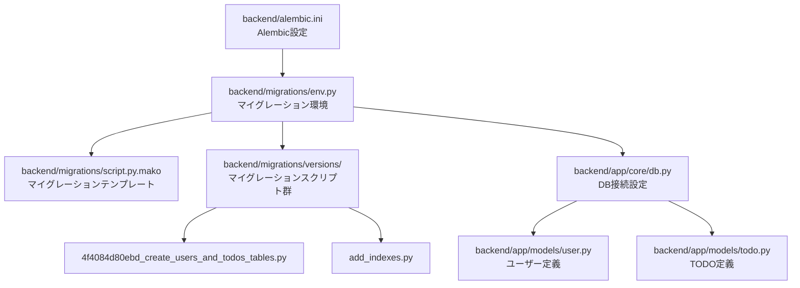
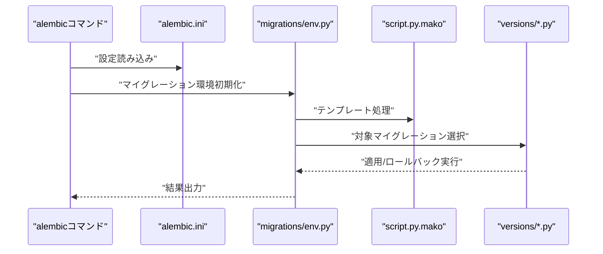
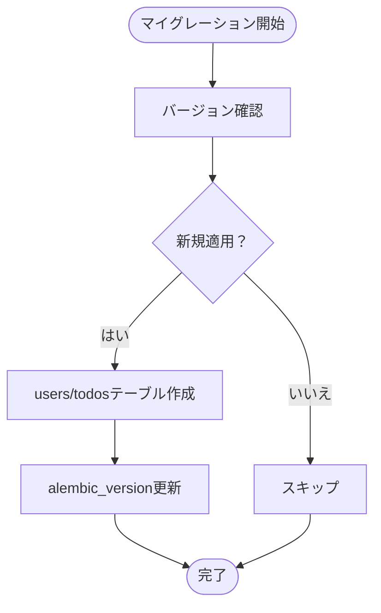
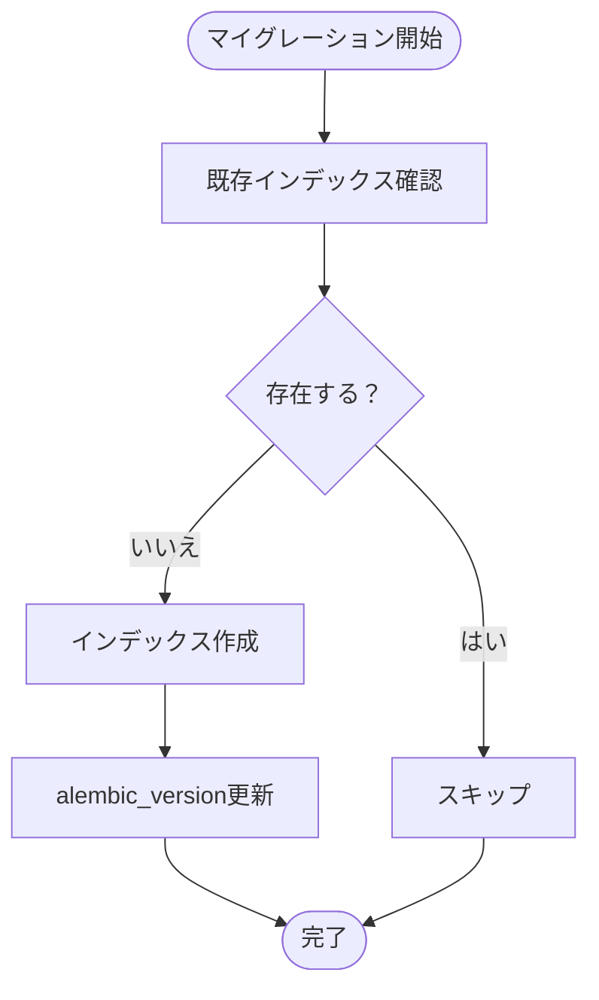
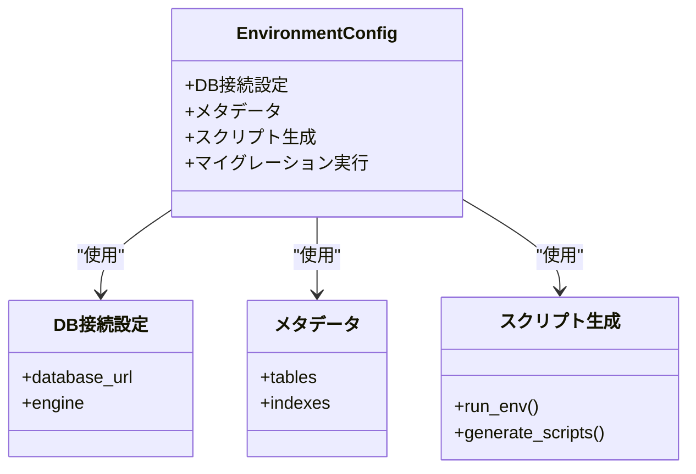
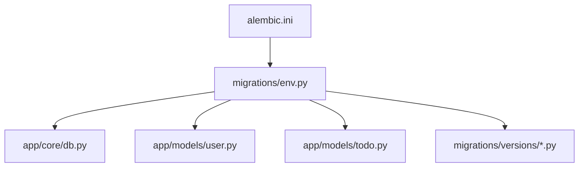

# データベースマイグレーション

<cite>
**このドキュメントで参照されるファイル**
- [alembic.ini](file://backend/alembic.ini)
- [env.py](file://backend/migrations/env.py)
- [script.py.mako](file://backend/migrations/script.py.mako)
- [4f4084d80ebd_create_users_and_todos_tables.py](file://backend/migrations/versions/4f4084d80ebd_create_users_and_todos_tables.py)
- [add_indexes.py](file://backend/migrations/versions/add_indexes.py)
- [db.py](file://backend/app/core/db.py)
- [user.py](file://backend/app/models/user.py)
- [todo.py](file://backend/app/models/todo.py)
- [pyproject.toml](file://backend/pyproject.toml)
</cite>

## 目次
1. [はじめに](#はじめに)
2. [プロジェクト構造](#プロジェクト構造)
3. [コアコンポーネント](#コアコンポーネント)
4. [アーキテクチャ概観](#アーキテクチャ概観)
5. [詳細コンポーネント分析](#詳細コンポーネント分析)
6. [依存関係分析](#依存関係分析)
7. [パフォーマンス考慮事項](#パフォーマンス考慮事項)
8. [トラブルシューティングガイド](#トラブルシューティングガイド)
9. [結論](#結論)

## はじめに
本プロジェクトでは Alembic を使用したデータベースマイグレーションを実装しています。マイグレーションはデータベーススキーマの進化を安全かつ再現可能に管理するための仕組みであり、以下の機能を提供します：
- 初期テーブル作成（users、todos）
- インデックス追加
- バージョン管理
- 適用・ロールバック操作
- 設定ファイルと環境設定

## プロジェクト構造
マイグレーション関連のファイルは backend/migrations 以下に配置されており、以下の構成となっています：
- versions/: バージョンごとのマイグレーションスクリプトが格納されます
- env.py: Alembic 実行環境の設定
- script.py.mako: 新しいマイグレーションスクリプトのテンプレート
- alembic.ini: Alembic の全体設定

**図の出典**
- [alembic.ini](file://backend/alembic.ini)
- [env.py](file://backend/migrations/env.py)
- [script.py.mako](file://backend/migrations/script.py.mako)
- [4f4084d80ebd_create_users_and_todos_tables.py](file://backend/migrations/versions/4f4084d80ebd_create_users_and_todos_tables.py)
- [add_indexes.py](file://backend/migrations/versions/add_indexes.py)
- [db.py](file://backend/app/core/db.py)
- [user.py](file://backend/app/models/user.py)
- [todo.py](file://backend/app/models/todo.py)

**節の出典**
- [alembic.ini](file://backend/alembic.ini)
- [env.py](file://backend/migrations/env.py)
- [script.py.mako](file://backend/migrations/script.py.mako)

## コアコンポーネント
- alembic.ini: Alembic の設定ファイル。database_url、起動時のターゲットメタデータ、およびマイグレーションディレクトリのパスを定義します。
- env.py: Alembic がマイグレーションを実行する際の環境を設定します。DB接続、メタデータ、およびスクリプトの生成方法を定義します。
- script.py.mako: 新しいマイグレーションスクリプトを作成するためのテンプレートです。
- versions/以下のマイグレーションスクリプト: 実際にスキーマ変更を行うコードが含まれます。

**節の出典**
- [alembic.ini](file://backend/alembic.ini)
- [env.py](file://backend/migrations/env.py)
- [script.py.mako](file://backend/migrations/script.py.mako)

## アーキテクチャ概観
マイグレーションの実行フローは以下の通りです：
1. alembic.ini から設定を読み込みます。
2. env.py が DB 接続とメタデータを準備します。
3. versions 以下のマイグレーションスクリプトを適用またはロールバックします。

**図の出典**
- [alembic.ini](file://backend/alembic.ini)
- [env.py](file://backend/migrations/env.py)
- [script.py.mako](file://backend/migrations/script.py.mako)

## 詳細コンポーネント分析

### 初期テーブル作成マイグレーション（users、todos）
- 4f4084d80ebd_create_users_and_todos_tables.py は、users と todos という2つのテーブルを作成するマイグレーションスクリプトです。
- 通常、このスクリプトには「upgrade」（適用）と「downgrade」（ロールバック）の両方の関数が含まれており、それぞれDDL（CREATE TABLE）とその逆の操作（DROP TABLE）を記述します。
- 本スクリプトは、alembic_version というバージョン管理テーブルを介してバージョン管理され、適用された順序が保持されます。

**図の出典**
- [4f4084d80ebd_create_users_and_todos_tables.py](file://backend/migrations/versions/4f4084d80ebd_create_users_and_todos_tables.py)

**節の出典**
- [4f4084d80ebd_create_users_and_todos_tables.py](file://backend/migrations/versions/4f4084d80ebd_create_users_and_todos_tables.py)

### インデックス追加マイグレーション
- add_indexes.py は、既存のテーブルに対してインデックスを追加するマイグレーションスクリプトです。
- 一般的には「upgrade」で CREATE INDEX、「downgrade」で DROP INDEX が記述されます。
- インデックスの追加はクエリパフォーマンス向上に寄与しますが、書き込み性能への影響も考慮する必要があります。

**図の出典**
- [add_indexes.py](file://backend/migrations/versions/add_indexes.py)

**節の出典**
- [add_indexes.py](file://backend/migrations/versions/add_indexes.py)

### Alembic 環境設定（env.py）
- env.py は、Alembic がマイグレーションを実行するために必要な環境を設定します。
- DB接続情報、メタデータ（tables、indexes）、およびスクリプト生成方法（run_env）を定義します。
- このファイルにより、マイグレーションスクリプトは実際のモデル定義に基づいて正しく適用されます。

**図の出典**
- [env.py](file://backend/migrations/env.py)

**節の出典**
- [env.py](file://backend/migrations/env.py)

### 設定ファイル（alembic.ini）
- alembic.ini は、Alembic の全体的な設定を記述したファイルです。
- database_url に接続先のデータベースを指定し、起動時のターゲットメタデータやマイグレーションディレクトリのパスを設定します。

**節の出典**
- [alembic.ini](file://backend/alembic.ini)

### モデル定義（user.py、todo.py）
- user.py と todo.py は、データベースのテーブルに対応する SQLAlchemy モデルです。
- migrations/env.py がこれらのモデルを元にメタデータを構築し、マイグレーションスクリプトの適用に使用されます。

**節の出典**
- [user.py](file://backend/app/models/user.py)
- [todo.py](file://backend/app/models/todo.py)

## 依存関係分析
マイグレーションの依存関係は以下の通りです：
- alembic.ini は env.py に設定を渡します。
- env.py は db.py から DB 接続情報を取得し、user.py と todo.py からメタデータを構築します。
- versions 以下のマイグレーションスクリプトは env.py によって実行されます。

**図の出典**
- [alembic.ini](file://backend/alembic.ini)
- [env.py](file://backend/migrations/env.py)
- [db.py](file://backend/app/core/db.py)
- [user.py](file://backend/app/models/user.py)
- [todo.py](file://backend/app/models/todo.py)

**節の出典**
- [alembic.ini](file://backend/alembic.ini)
- [env.py](file://backend/migrations/env.py)
- [db.py](file://backend/app/core/db.py)
- [user.py](file://backend/app/models/user.py)
- [todo.py](file://backend/app/models/todo.py)

## パフォーマンス考慮事項
- インデックスの追加は大規模なテーブルに対しては時間がかかる可能性があります。DDL 実行中はロックが発生するため、メンテナンスウィンドウでの実施を推奨します。
- 一度に複数の ALTER TABLE 操作を行うと、ロックやパフォーマンスへの影響が大きくなるため、できるだけ小さな変更単位でマイグレーションを分割することを検討してください。
- 一時的なインデックスの追加・削除を繰り返すよりも、一度に適切なインデックスを設計することが効率的です。

## トラブルシューティングガイド
- 接続エラー: alembic.ini に記載された database_url が正しいか確認してください。また、DB が起動しているか、ネットワーク経由でのアクセスが可能かを確認してください。
- 環境設定エラー: env.py で DB 接続やメタデータの構築に失敗している場合、pyproject.toml に依存ライブラリが正しくインストールされているか確認してください。
- 既に適用済みのマイグレーション: alembic_version に既にバージョンが記録されている場合、再度の適用はスキップされます。不要な状態を避けるために、マイグレーションの適用順序や内容をレビューしてください。
- 変更のロールバック: downgrade 関数が正しく実装されているか確認してください。ロールバック後にデータが復旧しない場合は、バックアップを取っておくことを推奨します。

**節の出典**
- [alembic.ini](file://backend/alembic.ini)
- [env.py](file://backend/migrations/env.py)
- [pyproject.toml](file://backend/pyproject.toml)

## 結論
本プロジェクトでは Alembic を活用して、users と todos といった初期テーブルの作成、さらにインデックス追加といったスキーマ変更をバージョン管理された形で適用・ロールバックできます。alembic.ini と env.py が中心的な設定を担い、versions 以下のスクリプトが具体的な変更を実行します。運用上は、DDL 実行時間やロックの影響、マイグレーションの順序・内容を慎重に管理することが重要です。