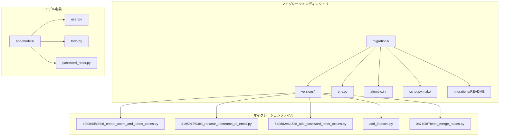
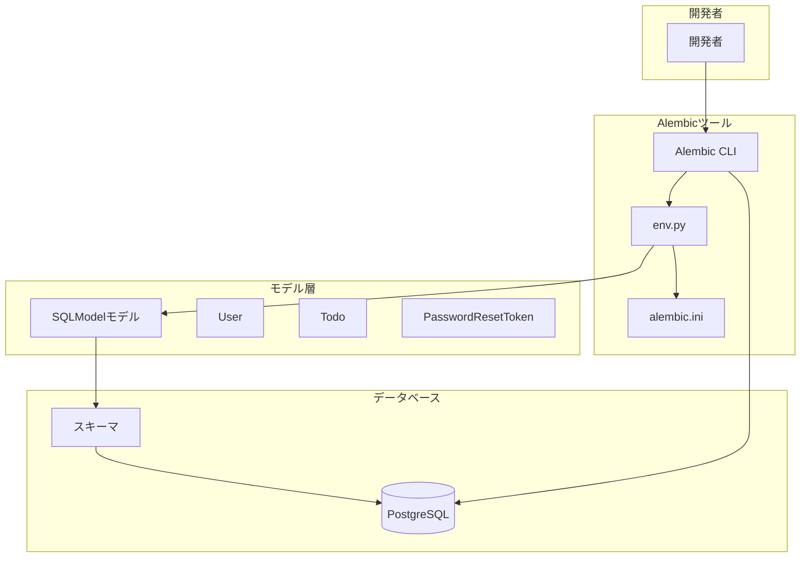
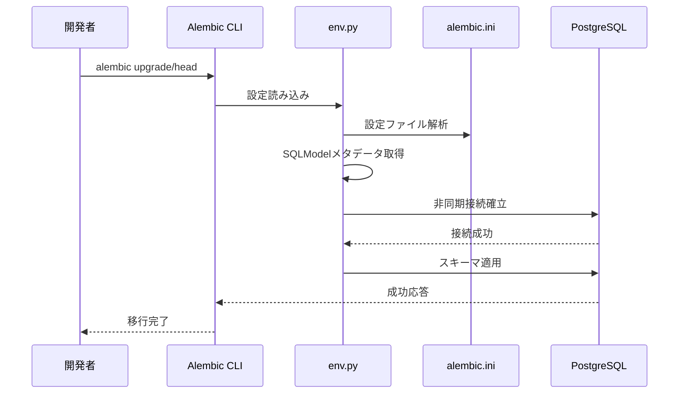
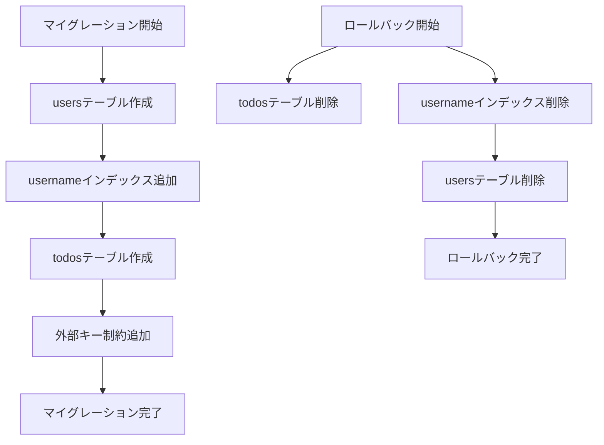
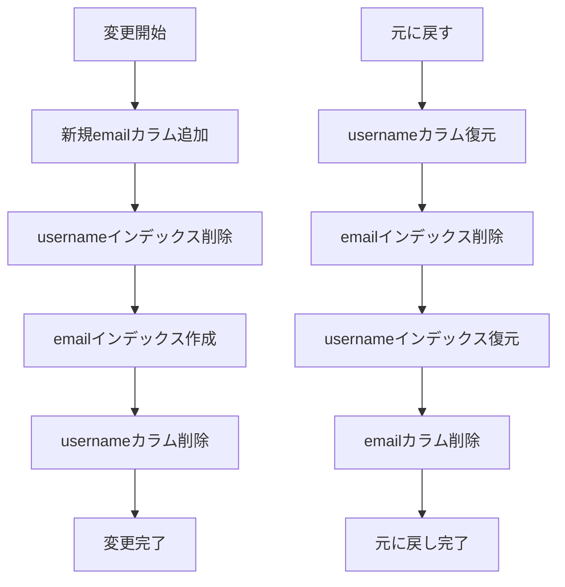
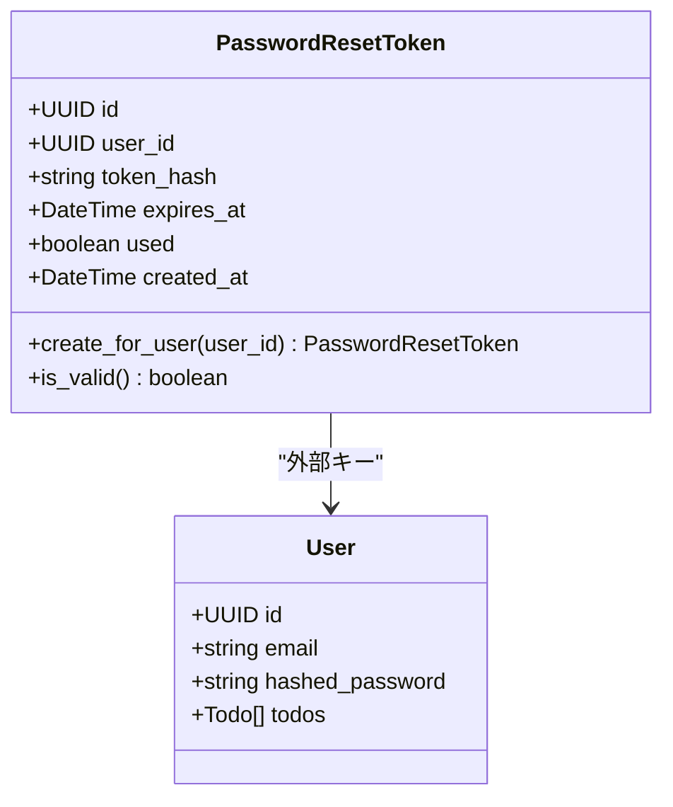
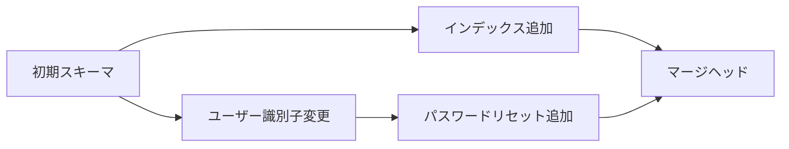
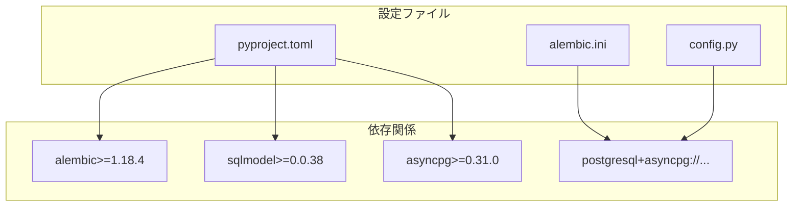

# データベースマイグレーション

<cite>
**このドキュメントで参照されたファイル**
- [4f4084d80ebd_create_users_and_todos_tables.py](file://backend/migrations/versions/4f4084d80ebd_create_users_and_todos_tables.py)
- [319591f893c3_rename_username_to_email.py](file://backend/migrations/versions/319591f893c3_rename_username_to_email.py)
- [540d82e6a72d_add_password_reset_tokens.py](file://backend/migrations/versions/540d82e6a72d_add_password_reset_tokens.py)
- [add_indexes.py](file://backend/migrations/versions/add_indexes.py)
- [0a710fd78eee_merge_heads.py](file://backend/migrations/versions/0a710fd78eee_merge_heads.py)
- [env.py](file://backend/migrations/env.py)
- [alembic.ini](file://backend/alembic.ini)
- [pyproject.toml](file://backend/pyproject.toml)
- [user.py](file://backend/app/models/user.py)
- [todo.py](file://backend/app/models/todo.py)
- [password_reset.py](file://backend/app/models/password_reset.py)
- [config.py](file://backend/app/core/config.py)
</cite>

## 目次
1. [はじめに](#はじめに)
2. [プロジェクト構造](#プロジェクト構造)
3. [コアコンポーネント](#コアコンポーネント)
4. [アーキテクチャ概観](#アーキテクチャ概観)
5. [詳細コンポーネント分析](#詳細コンポーネント分析)
6. [依存関係分析](#依存関係分析)
7. [パフォーマンス考慮事項](#パフォーマンス考慮事項)
8. [トラブルシューティングガイド](#トラブルシューティングガイド)
9. [結論](#結論)

## はじめに

このプロジェクトは、SQLAlchemyのORMであるSQLModelを使用したデータベースマイグレーションを実装しています。Alembicというマイグレーションツールを活用し、データベーススキーマの進化を安全かつ一貫性を持って管理しています。

マイグレーションは、アプリケーションのデータベース構造をバージョン管理するための重要な手法です。このプロジェクトでは、ユーザー管理、TODO管理、パスワードリセット機能を支えるデータベーススキーマの変更を、履歴的に追跡・管理しています。

## プロジェクト構造

プロジェクトのマイグレーション関連構造は以下の通りです：

```mermaid
graph TB
subgraph "マイグレーションディレクトリ"
MIG[migrations/]
VERS[versions/]
ENV[env.py]
INI[alembic.ini]
SCRIPT[script.py.mako]
README[migrations/README]
end
subgraph "モデル定義"
MODELS[app/models/]
USER[user.py]
TODO[todo.py]
PRT[password_reset.py]
end
subgraph "マイグレーションファイル"
F4[4f4084d80ebd_create_users_and_todos_tables.py]
A3[319591f893c3_rename_username_to_email.py]
P5[540d82e6a72d_add_password_reset_tokens.py]
IDX[add_indexes.py]
MH[0a710fd78eee_merge_heads.py]
end
MIG --> VERS
MIG --> ENV
MIG --> INI
MIG --> SCRIPT
MIG --> README
MODELS --> USER
MODELS --> TODO
MODELS --> PRT
VERS --> F4
VERS --> A3
VERS --> P5
VERS --> IDX
VERS --> MH
```

**図の出典**
- [env.py:1-95](file://backend/migrations/env.py#L1-L95)
- [alembic.ini:1-150](file://backend/alembic.ini#L1-L150)

**セクションの出典**
- [env.py:1-95](file://backend/migrations/env.py#L1-L95)
- [alembic.ini:1-150](file://backend/alembic.ini#L1-L150)

## コアコンポーネント

### Alembic環境設定

マイグレーションの基本的な設定は、`env.py`ファイルで行われています。このファイルは、Alembicがデータベース接続やモデルを認識するために必要な設定を提供します。

主要な特徴：
- 非同期データベース接続のサポート（asyncpg）
- SQLModelのメタデータをターゲットとして設定
- 複数のモデルを自動的に検出（User、Todo、PasswordResetToken）

### モデル定義

各マイグレーションは、対応するPythonモデル定義に基づいています：

**Userモデル**：ユーザー認証情報を管理
- UUID形式の主キー
- ハッシュ化されたパスワード
- Todoとのリレーションシップ

**Todoモデル**：TODOアイテムを管理  
- 外部キーによるUserとの関連
- 複数のインデックス（created_at、is_completed、priority、due_date）
- 自動タイムスタンプ管理

**PasswordResetTokenモデル**：パスワードリセット機能
- トークンのSHA-256ハッシュ化
- 有効期限付きのトークン管理
- 使用状況の追跡

**セクションの出典**
- [user.py:1-16](file://backend/app/models/user.py#L1-L16)
- [todo.py:1-25](file://backend/app/models/todo.py#L1-L25)
- [password_reset.py:1-52](file://backend/app/models/password_reset.py#L1-L52)

## アーキテクチャ概観

マイグレーションシステムの全体像は以下のようになります：

```mermaid
graph TB
subgraph "開発者"
DEV[開発者]
end
subgraph "Alembicツール"
ALEMBIC[Alembic CLI]
ENV[env.py]
CONFIG[alembic.ini]
end
subgraph "データベース"
DB[(PostgreSQL)]
SCHEMA[スキーマ]
end
subgraph "モデル層"
MODELS[SQLModelモデル]
USER[User]
TODO[Todo]
PRT[PasswordResetToken]
end
DEV --> ALEMBIC
ALEMBIC --> ENV
ENV --> CONFIG
ENV --> MODELS
MODELS --> SCHEMA
SCHEMA --> DB
ALEMBIC --> DB
```

**図の出典**
- [env.py:1-95](file://backend/migrations/env.py#L1-L95)
- [alembic.ini:1-150](file://backend/alembic.ini#L1-L150)

### 接続プロセス

```mermaid
sequenceDiagram
participant Dev as 開発者
participant Alembic as Alembic CLI
participant Env as env.py
participant Config as alembic.ini
participant DB as PostgreSQL
Dev->>Alembic : alembic upgrade/head
Alembic->>Env : 設定読み込み
Env->>Config : 設定ファイル解析
Env->>Env : SQLModelメタデータ取得
Env->>DB : 非同期接続確立
DB-->>Env : 接続成功
Env->>DB : スキーマ適用
DB-->>Alembic : 成功応答
Alembic-->>Dev : 移行完了
```

**図の出典**
- [env.py:66-83](file://backend/migrations/env.py#L66-L83)
- [alembic.ini:86-89](file://backend/alembic.ini#L86-L89)

## 詳細コンポーネント分析

### 初期スキーマ作成（usersとtodosテーブル）

最初のマイグレーションでは、基本的なユーザー管理とTODO管理機能を提供するスキーマを構築します。

```mermaid
flowchart TD
START[マイグレーション開始] --> CREATE_USERS[usersテーブル作成]
CREATE_USERS --> ADD_USERNAME_IDX[usernameインデックス追加]
ADD_USERNAME_IDX --> CREATE_TODOS[todosテーブル作成]
CREATE_TODOS --> ADD_FOREIGN_KEY[外部キー制約追加]
ADD_FOREIGN_KEY --> END[マイグレーション完了]
DOWN_START[ロールバック開始] --> DROP_TODOS[todosテーブル削除]
DOWN_START --> DROP_USERNAME_IDX[usernameインデックス削除]
DROP_USERNAME_IDX --> DROP_USERS[usersテーブル削除]
DROP_USERS --> DOWN_END[ロールバック完了]
```

**図の出典**
- [4f4084d80ebd_create_users_and_todos_tables.py:21-50](file://backend/migrations/versions/4f4084d80ebd_create_users_and_todos_tables.py#L21-L50)

**セクションの出典**
- [4f4084d80ebd_create_users_and_todos_tables.py:1-51](file://backend/migrations/versions/4f4084d80ebd_create_users_and_todos_tables.py#L1-L51)

### ユーザー識別子の変更（usernameからemailへの移行）

このマイグレーションは、ユーザー識別子をusernameからemailに変更する重要な変更を含みます。

```mermaid
flowchart TD
START[変更開始] --> ADD_EMAIL[新規emailカラム追加]
ADD_EMAIL --> DROP_USERNAME_IDX[usernameインデックス削除]
DROP_USERNAME_IDX --> CREATE_EMAIL_IDX[emailインデックス作成]
CREATE_EMAIL_IDX --> DROP_USERNAME[usernameカラム削除]
DROP_USERNAME --> END[変更完了]
DOWN_START[元に戻す] --> ADD_USERNAME[usernameカラム復元]
ADD_USERNAME --> DROP_EMAIL_IDX[emailインデックス削除]
DROP_EMAIL_IDX --> CREATE_USERNAME_IDX[usernameインデックス復元]
CREATE_USERNAME_IDX --> DROP_EMAIL[emailカラム削除]
DROP_EMAIL --> DOWN_END[元に戻し完了]
```

**図の出典**
- [319591f893c3_rename_username_to_email.py:21-38](file://backend/migrations/versions/319591f893c3_rename_username_to_email.py#L21-L38)

**セクションの出典**
- [319591f893c3_rename_username_to_email.py:1-39](file://backend/migrations/versions/319591f893c3_rename_username_to_email.py#L1-L39)

### パスワードリセット機能追加

パスワードリセット機能を実装するために、専用のトークンテーブルを追加します。

```mermaid
classDiagram
class PasswordResetToken {
+UUID id
+UUID user_id
+string token_hash
+DateTime expires_at
+boolean used
+DateTime created_at
+create_for_user(user_id) PasswordResetToken
+is_valid() boolean
}
class User {
+UUID id
+string email
+string hashed_password
+Todo[] todos
}
PasswordResetToken --> User : "外部キー"
```

**図の出典**
- [password_reset.py:21-52](file://backend/app/models/password_reset.py#L21-L52)
- [user.py:9-16](file://backend/app/models/user.py#L9-L16)

**セクションの出典**
- [540d82e6a72d_add_password_reset_tokens.py:1-44](file://backend/migrations/versions/540d82e6a72d_add_password_reset_tokens.py#L1-L44)

### インデックス追加

パフォーマンス向上のための複数のインデックスを追加します。

**セクションの出典**
- [add_indexes.py:1-41](file://backend/migrations/versions/add_indexes.py#L1-L41)

### マージヘッド処理

複数の開発ブランチからのマージを処理するための特別なマイグレーションです。

**セクションの出典**
- [0a710fd78eee_merge_heads.py:1-29](file://backend/migrations/versions/0a710fd78eee_merge_heads.py#L1-L29)

## 依存関係分析

マイグレーション間の依存関係は以下の通りです：

```mermaid
graph LR
A[初期スキーマ] --> B[ユーザー識別子変更]
B --> C[パスワードリセット追加]
A --> D[インデックス追加]
D --> E[マージヘッド]
C --> E
```

**図の出典**
- [4f4084d80ebd_create_users_and_todos_tables.py:14-18](file://backend/migrations/versions/4f4084d80ebd_create_users_and_todos_tables.py#L14-L18)
- [319591f893c3_rename_username_to_email.py:14-18](file://backend/migrations/versions/319591f893c3_rename_username_to_email.py#L14-L18)
- [540d82e6a72d_add_password_reset_tokens.py:14-18](file://backend/migrations/versions/540d82e6a72d_add_password_reset_tokens.py#L14-L18)
- [0a710fd78eee_merge_heads.py:14-18](file://backend/migrations/versions/0a710fd78eee_merge_heads.py#L14-L18)

### 設定依存関係

```mermaid
graph TB
subgraph "設定ファイル"
PYPROJECT[pyproject.toml]
ALEMBIC_INI[alembic.ini]
CONFIG_PY[config.py]
end
subgraph "依存関係"
ALEMBIC[alembic>=1.18.4]
SQLMODEL[sqlmodel>=0.0.38]
ASYNC_PG[asyncpg>=0.31.0]
POSTGRES_URL[postgresql+asyncpg://...]
end
PYPROJECT --> ALEMBIC
PYPROJECT --> SQLMODEL
PYPROJECT --> ASYNC_PG
ALEMBIC_INI --> POSTGRES_URL
CONFIG_PY --> POSTGRES_URL
```

**図の出典**
- [pyproject.toml:7-25](file://backend/pyproject.toml#L7-L25)
- [alembic.ini:86-89](file://backend/alembic.ini#L86-L89)
- [config.py:44-48](file://backend/app/core/config.py#L44-L48)

**セクションの出典**
- [pyproject.toml:1-51](file://backend/pyproject.toml#L1-L51)
- [alembic.ini:1-150](file://backend/alembic.ini#L1-L150)
- [config.py:1-91](file://backend/app/core/config.py#L1-L91)

## パフォーマンス考慮事項

### インデックス戦略

TODOテーブルには複数のインデックスが設定されています：
- `ix_todos_user_id`: ユーザーごとのクエリ高速化
- `ix_todos_created_at`: 日付ベースのフィルタリング
- `ix_todos_is_completed`: 完了状態でのクエリ高速化
- `ix_todos_priority`: 優先度でのソート・フィルタリング
- `ix_todos_due_date`: 期限切れのクエリ高速化

### 非同期接続

Alembicは非同期接続を使用することで、データベース操作のパフォーマンスを向上させています。これにより、大量のマイグレーションデータを効率的に処理できます。

## トラブルシューティングガイド

### 共通エラーと解決策

**データベース接続エラー**
- 症状：`FATAL: database "..." does not exist`
- 対処法：`alembic.ini`の`sqlalchemy.url`を確認し、正しい接続文字列を設定

**マイグレーション失敗**
- 症状：`alembic upgrade head`でエラー発生
- 対処法：`env.py`の`target_metadata`が正しく設定されているか確認

**依存関係エラー**
- 症状：`merge_heads`エラー
- 対処法：`0a710fd78eee_merge_heads.py`を使用してマージを処理

**セクションの出典**
- [env.py:66-83](file://backend/migrations/env.py#L66-L83)
- [alembic.ini:86-89](file://backend/alembic.ini#L86-L89)

## 結論

このプロジェクトのマイグレーションシステムは、以下の特徴を持っています：

1. **堅牢なアーキテクチャ**：SQLModelとAlembicの統合により、型安全なスキーマ管理が可能
2. **非同期対応**：asyncpgを使用した高速なデータベース操作
3. **履歴管理**：明確なバージョン管理と依存関係の追跡
4. **拡張性**：新しい機能追加に柔軟に対応できる設計

過去のマイグレーション履歴を通じて、ユーザー識別子の変更やパスワードリセット機能の追加など、重要な機能変更が適切に管理されています。これにより、データベーススキーマの進化を安全かつ一貫性を持って行うことが可能になっています。