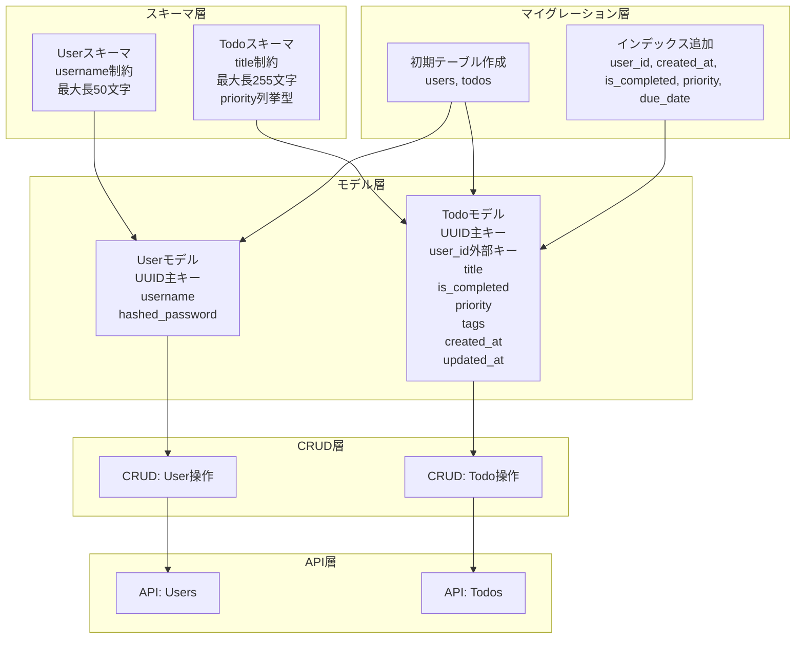
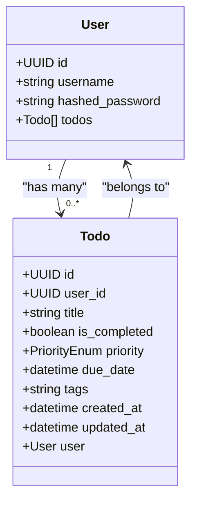
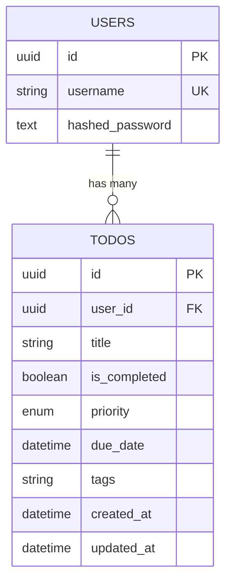
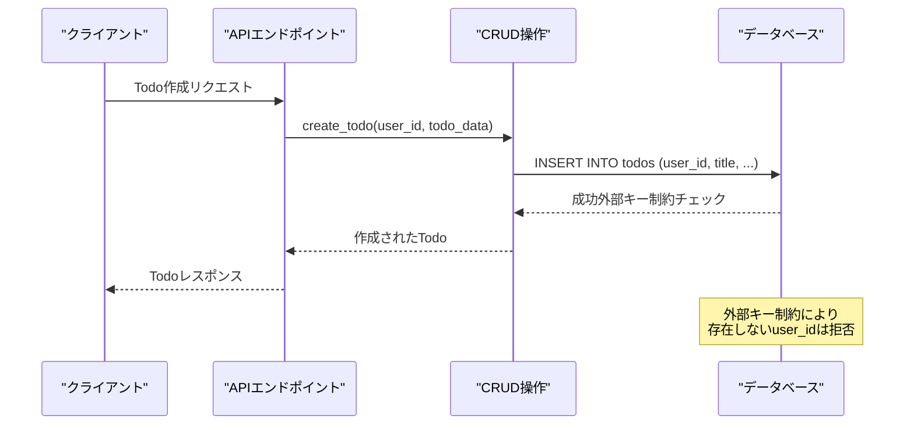
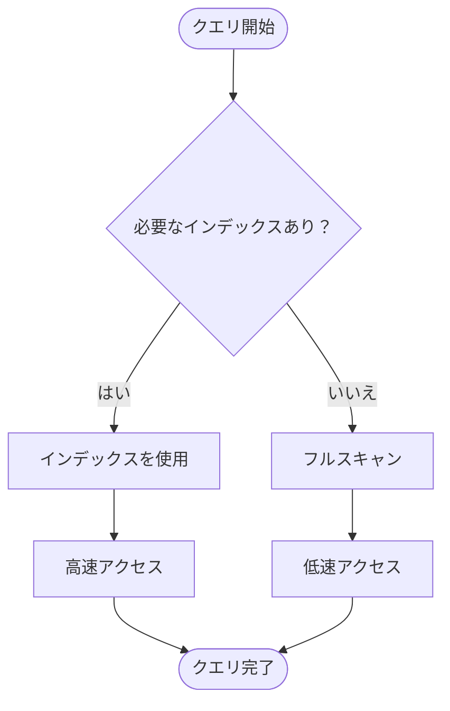
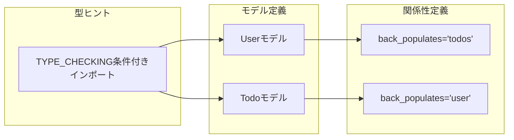

# データベースモデル

<cite>
**この文書で参照されるファイル**
- [user.py](file://backend/app/models/user.py)
- [todo.py](file://backend/app/models/todo.py)
- [__init__.py](file://backend/app/models/__init__.py)
- [user.py](file://backend/app/schemas/user.py)
- [todo.py](file://backend/app/schemas/todo.py)
- [4f4084d80ebd_create_users_and_todos_tables.py](file://backend/migrations/versions/4f4084d80ebd_create_users_and_todos_tables.py)
- [add_indexes.py](file://backend/migrations/versions/add_indexes.py)
- [crud_user.py](file://backend/app/crud/crud_user.py)
- [crud_todo.py](file://backend/app/crud/crud_todo.py)
- [users.py](file://backend/app/api/api_v1/endpoints/users.py)
- [todos.py](file://backend/app/api/api_v1/endpoints/todos.py)
- [db.py](file://backend/app/core/db.py)
- [pyproject.toml](file://backend/pyproject.toml)
</cite>

## 目次
1. [イントロダクション](#イントロダクション)
2. [プロジェクト構造](#プロジェクト構造)
3. [コアコンポーネント](#コアコンポーネント)
4. [アーキテクチャ概要](#アーキテクチャ概要)
5. [詳細コンポーネント分析](#詳細コンポーネント分析)
6. [依存関係分析](#依存関係分析)
7. [性能考慮事項](#性能考慮事項)
8. [トラブルシューティングガイド](#トラブルシューティングガイド)
9. [結論](#結論)

## イントロダクション
本ドキュメントは、SQLModelを使用したTodoアプリケーションのデータベースモデル設計について詳細に説明します。特に以下の2つのモデルについて、フィールド定義、データ型、制約条件、バリデーションルール、モデル間の関係性、外部キー制約、インデックス設定について網羅的に解説します。

- Userモデル：UUID主キー、ユーザー名、ハッシュ化パスワード、作成日時、更新日時
- Todoモデル：UUID主キー、ユーザーID外部キー、タイトル、完了フラグ、優先度、タグ、作成日時、更新日時

## プロジェクト構造
SQLModelによるモデル設計は、以下の層構造で実装されています：

**図の出典**
- [user.py:1-16](file://backend/app/models/user.py#L1-L16)
- [todo.py:1-25](file://backend/app/models/todo.py#L1-L25)
- [4f4084d80ebd_create_users_and_todos_tables.py:24-40](file://backend/migrations/versions/4f4084d80ebd_create_users_and_todos_tables.py#L24-L40)
- [add_indexes.py:23-27](file://backend/migrations/versions/add_indexes.py#L23-L27)

**セクションの出典**
- [user.py:1-16](file://backend/app/models/user.py#L1-L16)
- [todo.py:1-25](file://backend/app/models/todo.py#L1-L25)
- [__init__.py:1-4](file://backend/app/models/__init__.py#L1-L4)

## コアコンポーネント

### Userモデル（ユーザー管理）
Userモデルは認証とユーザー情報を管理するための基底モデルです。

**主なフィールド定義**：
- `id`: UUID型、主キー、自動生成
- `username`: 文字列型、ユニーク制約、最大50文字、インデックス付き
- `hashed_password`: 文字列型、NULL不可

**データ型と制約**：
- UUID主キー：一意性と分散性を確保
- username: UNIQUE制約 + INDEX制約（パフォーマンス向上）
- hashed_password: NULL不可（パスワード必須）

**バリデーションルール**：
- username: 最大50文字、ユニーク、NULL不可
- password: CRUD層でハッシュ化処理

**セクションの出典**
- [user.py:12-13](file://backend/app/models/user.py#L12-L13)
- [user.py:4-5](file://backend/app/schemas/user.py#L4-L5)
- [crud_user.py:12-21](file://backend/app/crud/crud_user.py#L12-L21)

### Todoモデル（タスク管理）
Todoモデルはユーザーごとのタスク情報を管理します。

**主なフィールド定義**：
- `id`: UUID型、主キー、自動生成
- `user_id`: UUID型、外部キー（users.id）、NULL不可、インデックス付き
- `title`: 文字列型、最大255文字、NULL不可
- `is_completed`: 真偽値型、デフォルトFalse
- `priority`: 列挙型（HIGH/MEDIUM/LOW）、デフォルトLOW
- `due_date`: 日時型、任意
- `tags`: 文字列型、最大500文字、任意
- `created_at`: 日時型、タイムゾーン付きUTC、自動生成
- `updated_at`: 日時型、タイムゾーン付きUTC、自動生成

**データ型と制約**：
- UUID主キー：一意性と分散性を確保
- 外部キー制約：users.idへの参照整合性
- 各種制約：NOT NULL、UNIQUE、ENUM制限

**バリデーションルール**：
- title: 最大255文字、NULL不可
- priority: 列挙型制限（high/medium/low）
- tags: 最大500文字、任意
- due_date: 日時型、任意

**セクションの出典**
- [todo.py:19-24](file://backend/app/models/todo.py#L19-L24)
- [todo.py:13-18](file://backend/app/schemas/todo.py#L13-L18)
- [todo.py:7-11](file://backend/app/schemas/todo.py#L7-L11)

## アーキテクチャ概要

### モデル間の関係性
UserモデルとTodoモデルは1対多の関係（1人のユーザーが複数のTodoを持つ）を形成しています。

**図の出典**
- [user.py](file://backend/app/models/user.py#L15)
- [todo.py](file://backend/app/models/todo.py#L24)

### 外部キー制約
マイグレーションファイルで定義された外部キー制約により、データ整合性が保たれています。

**図の出典**
- [4f4084d80ebd_create_users_and_todos_tables.py](file://backend/migrations/versions/4f4084d80ebd_create_users_and_todos_tables.py#L38)

### インデックス設定
複数のインデックスが設定されており、パフォーマンス最適化が行われています。

**Todoテーブルのインデックス**：
- `ix_todos_user_id`: user_idのクエリ性能向上
- `ix_todos_created_at`: 作成日時のソート・フィルタリング
- `ix_todos_is_completed`: 完了状態でのフィルタリング
- `ix_todos_priority`: 優先度でのソート・フィルタリング
- `ix_todos_due_date`: 期限日のソート・フィルタリング

**Userテーブルのインデックス**：
- `ix_users_username`: ユーザー名での検索性能向上

**セクションの出典**
- [todo.py:12-17](file://backend/app/models/todo.py#L12-L17)
- [add_indexes.py:23-30](file://backend/migrations/versions/add_indexes.py#L23-L30)

## 詳細コンポーネント分析

### Userモデルの詳細設計

#### フィールド定義とデータ型
- `id`: uuid.UUID = Field(default_factory=uuid.uuid4, primary_key=True)
  - UUID型の主キー、自動生成
  - SQL: UUID型（PostgreSQLの場合UUID型）

- `username`: str = Field(unique=True, index=True, nullable=False, max_length=50)
  - 文字列型、ユニーク制約、インデックス付き、NULL不可
  - SQL: VARCHAR(50) + UNIQUE制約

- `hashed_password`: str = Field(nullable=False)
  - 文字列型、NULL不可
  - SQL: TEXT型（パスワードの長さを考慮）

#### 制約条件とバリデーション
- 主キー制約：idフィールドの主キー属性
- ユニーク制約：usernameフィールドのユニーク属性
- NOT NULL制約：usernameとhashed_passwordフィールド
- 長さ制限：usernameは50文字以内、tagsは500文字以内

**セクションの出典**
- [user.py:12-13](file://backend/app/models/user.py#L12-L13)
- [user.py](file://backend/app/schemas/user.py#L5)
- [4f4084d80ebd_create_users_and_todos_tables.py:26-29](file://backend/migrations/versions/4f4084d80ebd_create_users_and_todos_tables.py#L26-L29)

### Todoモデルの詳細設計

#### フィールド定義とデータ型
- `id`: uuid.UUID = Field(default_factory=uuid.uuid4, primary_key=True)
  - UUID型の主キー、自動生成

- `user_id`: uuid.UUID = Field(foreign_key="users.id", nullable=False, index=True)
  - 外部キー制約付きUUID型、NULL不可、インデックス付き

- `title`: str = Field(max_length=255, nullable=False)
  - 文字列型、最大255文字、NULL不可

- `is_completed`: bool = Field(default=False)
  - 真偽値型、デフォルトFalse

- `priority`: PriorityEnum = Field(default=PriorityEnum.LOW)
  - 列挙型（HIGH/MEDIUM/LOW）、デフォルトLOW

- `due_date`: Optional[datetime] = Field(default=None)
  - 日時型、任意

- `tags`: Optional[str] = Field(default=None, max_length=500)
  - 文字列型、最大500文字、任意

- `created_at`: datetime = Field(default_factory=lambda: datetime.now(timezone.utc).replace(tzinfo=None))
  - 日時型、タイムゾーン付きUTC、自動生成

- `updated_at`: datetime = Field(default_factory=lambda: datetime.now(timezone.utc).replace(tzinfo=None))
  - 日時型、タイムゾーン付きUTC、自動生成

#### 列挙型の定義
PriorityEnum列挙型は以下の値を持ちます：
- HIGH: "high"
- MEDIUM: "medium"  
- LOW: "low"

**セクションの出典**
- [todo.py:19-24](file://backend/app/models/todo.py#L19-L24)
- [todo.py:7-11](file://backend/app/schemas/todo.py#L7-L11)
- [todo.py:13-18](file://backend/app/schemas/todo.py#L13-L18)

### 外部キー制約の実装
Todoモデルのuser_idフィールドには外部キー制約が設定されており、usersテーブルのidフィールドを参照しています。

**図の出典**
- [todo.py](file://backend/app/models/todo.py#L20)
- [4f4084d80ebd_create_users_and_todos_tables.py](file://backend/migrations/versions/4f4084d80ebd_create_users_and_todos_tables.py#L38)

### インデックスの効果とパフォーマンス
複数のインデックスが設定されており、特定のクエリパターンに対してパフォーマンスが向上します。

**図の出典**
- [add_indexes.py:22-27](file://backend/migrations/versions/add_indexes.py#L22-L27)

**セクションの出典**
- [todo.py:12-17](file://backend/app/models/todo.py#L12-L17)
- [add_indexes.py:23-30](file://backend/migrations/versions/add_indexes.py#L23-L30)

## 依存関係分析

### モデル間の依存関係
SQLModelのRelationshipメカニズムにより、モデル間の関連付けが自動的に管理されます。

**図の出典**
- [user.py](file://backend/app/models/user.py#L15)
- [todo.py](file://backend/app/models/todo.py#L24)
- [user.py:6-7](file://backend/app/models/user.py#L6-L7)
- [todo.py:7-8](file://backend/app/models/todo.py#L7-L8)

### 外部依存関係
プロジェクトの依存関係は以下の通りです：

**主要依存関係**：
- sqlmodel>=0.0.38: ORMフレームワーク
- fastapi>=0.136.0: Webフレームワーク
- asyncpg>=0.31.0: PostgreSQL非同期接続
- argon2-cffi>=25.1.0: パスワードハッシュ化
- alembic>=1.18.4: データベースマイグレーション

**開発依存関係**：
- pytest>=9.0.3: 単体テスト
- pytest-asyncio>=1.3.0: 非同期テスト
- psycopg2-binary>=2.9.9: PostgreSQL接続

**セクションの出典**
- [pyproject.toml:7-22](file://backend/pyproject.toml#L7-L22)
- [pyproject.toml:25-31](file://backend/pyproject.toml#L25-L31)

## 性能考慮事項

### インデックス戦略
- `user_id`インデックス：ユーザーごとのTodo取得を高速化
- `created_at`インデックス：日付ベースのソートとフィルタリング
- `is_completed`インデックス：完了状態でのクエリ性能向上
- `priority`インデックス：優先度でのソートとフィルタリング
- `due_date`インデックス：期限日のクエリ性能向上

### UUIDの利点と課題
- 利点：分散型システムでの一意性保証、衝突のないID生成
- 課題：インデックスのパフォーマンス（挿入時のランダム性による）

### 非同期処理の活用
- SQLAlchemy AsyncEngineを使用した非同期データベース操作
- 高スループットなWebアプリケーションの実現

## トラブルシューティングガイド

### 共通エラーと解決策

#### 外部キー制約エラー
**症状**：Todo作成時に「users.idへの参照制約違反」
**原因**：存在しないuser_idを指定した場合
**解決策**：有効なユーザーIDを確認し、再度試行

#### ユニーク制約エラー
**症状**：ユーザー作成時に「usernameの重複」
**原因**：既存のusernameを使用した場合
**解決策**：別のusernameを指定

#### 型エラー
**症状**：UUID形式のエラー
**原因**：UUID文字列の形式が不正
**解決策**：UUID4形式の文字列を使用

**セクションの出典**
- [4f4084d80ebd_create_users_and_todos_tables.py](file://backend/migrations/versions/4f4084d80ebd_create_users_and_todos_tables.py#L38)
- [crud_todo.py:144-151](file://backend/app/crud/crud_todo.py#L144-L151)

### デバッグ手順
1. **データベース接続の確認**：asyncpg接続が確立されているか
2. **マイグレーションの適用**：最新のマイグレーションが適用されているか
3. **型チェック**：UUIDや列挙型の値が正しいか
4. **インデックスの確認**：必要なインデックスが存在するか

**セクションの出典**
- [db.py:5-12](file://backend/app/core/db.py#L5-L12)
- [add_indexes.py:20-41](file://backend/migrations/versions/add_indexes.py#L20-L41)

## 結論
本プロジェクトのSQLModelによるデータベースモデル設計は、以下の特徴を持っています：

1. **堅牢なデータ整合性**：外部キー制約とユニーク制約により、データの整合性を保証
2. **高パフォーマンス**：複数のインデックスにより、特定のクエリパターンに対して最適化
3. **拡張性のある設計**：列挙型やOptionalフィールドにより、将来的な機能追加に柔軟に対応
4. **非同期処理の活用**：現代的なWebアプリケーションの性能向上に貢献

UserモデルとTodoモデルの設計は、1対多の関係を適切に表現し、CRUD操作を効率的に行えるようになっています。今後の拡張としては、より複雑なクエリや高度なインデックス戦略の導入が考えられます。