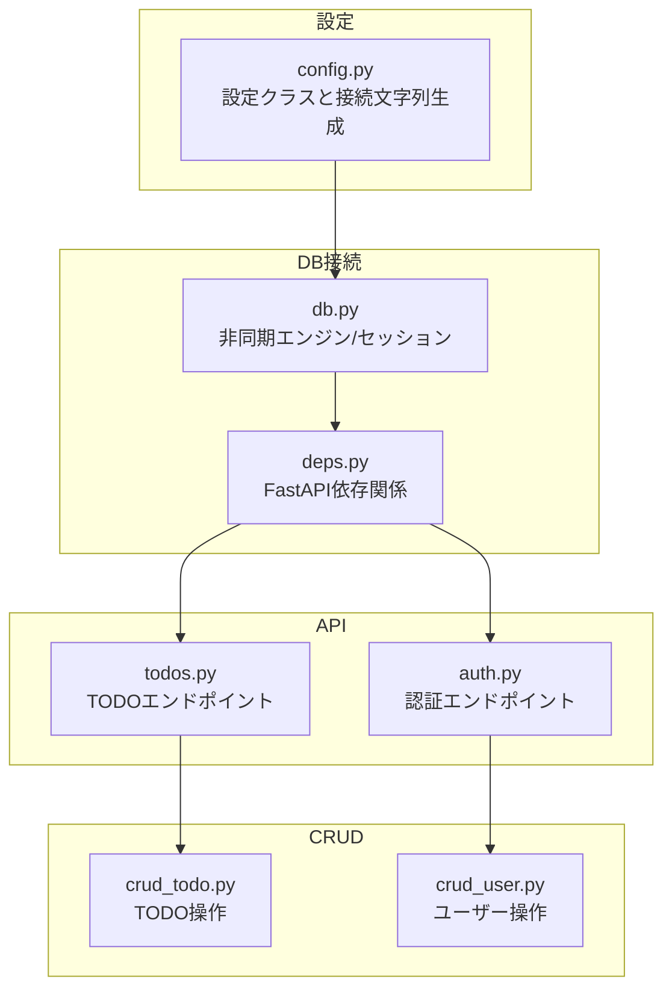
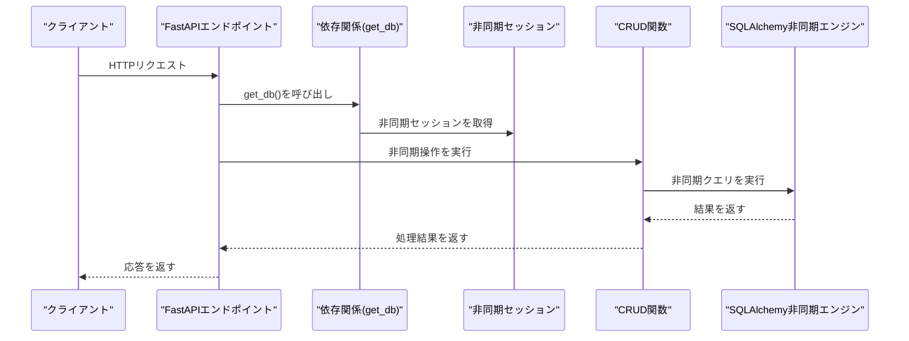
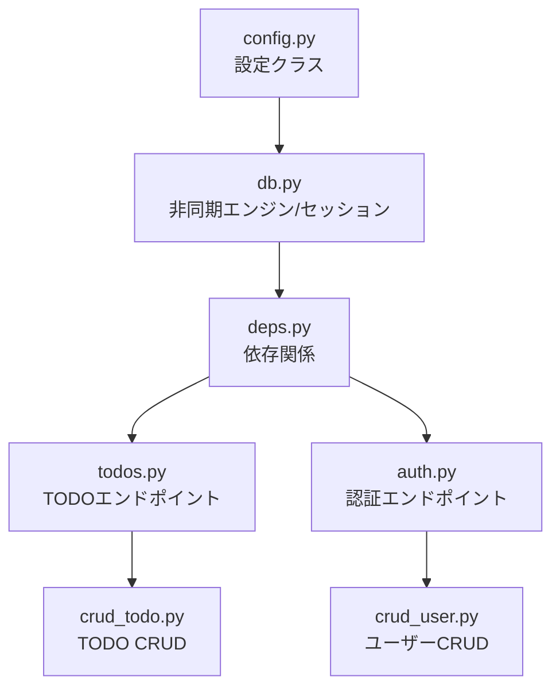

# データベース接続

<cite>
**この文書で参照されるファイル**
- [backend/app/core/config.py](file://backend/app/core/config.py)
- [backend/app/core/db.py](file://backend/app/core/db.py)
- [backend/app/api/deps.py](file://backend/app/api/deps.py)
- [backend/app/api/api_v1/endpoints/todos.py](file://backend/app/api/api_v1/endpoints/todos.py)
- [backend/app/api/api_v1/endpoints/auth.py](file://backend/app/api/api_v1/endpoints/auth.py)
- [backend/app/crud/crud_todo.py](file://backend/app/crud/crud_todo.py)
- [backend/app/crud/crud_user.py](file://backend/app/crud/crud_user.py)
- [backend/pyproject.toml](file://backend/pyproject.toml)
- [docker-compose.yml](file://docker-compose.yml)
</cite>

## 目次
1. [はじめに](#はじめに)
2. [プロジェクト構造](#プロジェクト構造)
3. [コアコンポーネント](#コアコンポーネント)
4. [アーキテクチャ概要](#アーキテクチャ概要)
5. [詳細コンポーネント解析](#詳細コンポーネント解析)
6. [依存関係解析](#依存関係解析)
7. [パフォーマンス考慮事項](#パフォーマンス考慮事項)
8. [トラブルシューティングガイド](#トラブルシューティングガイド)
9. [結論](#結論)

## はじめに
本ドキュメントは、FastAPIアプリケーションにおけるasyncpgによる非同期データベース接続の実装方法を解説します。具体的には、接続文字列の設定、接続プールの管理、非同期クエリの実行、接続エラー処理、設定ファイルでの環境変数の扱い、接続のライフサイクル管理、パフォーマンス最適化について詳しく説明します。

本プロジェクトでは、SQLAlchemyの非同期エンジンとSQLModelを用いて、PostgreSQL（asyncpg）との非同期接続を実現しています。FastAPIの依存関係注入を通じて、各APIエンドポイントから非同期セッションが取得され、CRUD操作が実行されます。

## プロジェクト構造
バックエンドのデータベース接続に関連する主なファイルは以下の通りです：

- 設定管理：`backend/app/core/config.py`
- 非同期エンジンとセッション：`backend/app/core/db.py`
- FastAPI依存関係：`backend/app/api/deps.py`
- APIエンドポイント（TODO/認証）：`backend/app/api/api_v1/endpoints/todos.py`、`backend/app/api/api_v1/endpoints/auth.py`
- CRUDロジック：`backend/app/crud/crud_todo.py`、`backend/app/crud/crud_user.py`
- 依存関係定義：`backend/pyproject.toml`
- DockerCompose（ローカルDB）：`docker-compose.yml`

**図の出典**
- [backend/app/core/config.py:44-48](file://backend/app/core/config.py#L44-L48)
- [backend/app/core/db.py:5-12](file://backend/app/core/db.py#L5-L12)
- [backend/app/api/deps.py:12-30](file://backend/app/api/deps.py#L12-L30)
- [backend/app/api/api_v1/endpoints/todos.py:13-57](file://backend/app/api/api_v1/endpoints/todos.py#L13-L57)
- [backend/app/api/api_v1/endpoints/auth.py:17-32](file://backend/app/api/api_v1/endpoints/auth.py#L17-L32)
- [backend/app/crud/crud_todo.py:10-151](file://backend/app/crud/crud_todo.py#L10-L151)
- [backend/app/crud/crud_user.py:7-21](file://backend/app/crud/crud_user.py#L7-L21)

**節の出典**
- [backend/app/core/config.py:1-73](file://backend/app/core/config.py#L1-L73)
- [backend/app/core/db.py:1-17](file://backend/app/core/db.py#L1-L17)
- [backend/app/api/deps.py:1-31](file://backend/app/api/deps.py#L1-L31)
- [backend/app/api/api_v1/endpoints/todos.py:1-102](file://backend/app/api/api_v1/endpoints/todos.py#L1-L102)
- [backend/app/api/api_v1/endpoints/auth.py:1-53](file://backend/app/api/api_v1/endpoints/auth.py#L1-L53)
- [backend/app/crud/crud_todo.py:1-152](file://backend/app/crud/crud_todo.py#L1-L152)
- [backend/app/crud/crud_user.py:1-22](file://backend/app/crud/crud_user.py#L1-L22)
- [backend/pyproject.toml:1-47](file://backend/pyproject.toml#L1-L47)
- [docker-compose.yml:1-16](file://docker-compose.yml#L1-L16)

## コアコンポーネント
- 設定クラス（Settings）
  - 環境変数からPostgreSQLの接続情報を取得し、asyncpg用の接続文字列を生成します。
  - 本番環境ではDATABASE_URLを環境変数から設定することが推奨されています。
  - 環境変数の読み込み元の.envファイルのパスが設定されています。

- 非同期エンジンとセッション
  - SQLAlchemyの非同期エンジンを作成し、非同期セッションのファクトリを定義します。
  - echoオプションにより、開発環境でのSQLログ出力が可能です。
  - get_dbジェネレータ関数を通じて、FastAPIの依存関係からセッションを提供します。

- FastAPI依存関係
  - get_db依存関係を介して、各エンドポイントに非同期セッションを注入します。
  - 認証トークンから現在のユーザーを解決し、ユーザーごとのデータアクセスを制御します。

- CRUDロジック
  - 非同期メソッドとして定義されたCRUD関数が、非同期セッションを使用してデータベース操作を実行します。
  - SQLModelのselect文と非同期executeメソッドにより、非同期クエリが実行されます。

**節の出典**
- [backend/app/core/config.py:44-48](file://backend/app/core/config.py#L44-L48)
- [backend/app/core/db.py:5-16](file://backend/app/core/db.py#L5-L16)
- [backend/app/api/deps.py:12-30](file://backend/app/api/deps.py#L12-L30)
- [backend/app/crud/crud_todo.py:10-151](file://backend/app/crud/crud_todo.py#L10-L151)
- [backend/app/crud/crud_user.py:7-21](file://backend/app/crud/crud_user.py#L7-L21)

## アーキテクチャ概要
以下は、FastAPIエンドポイントからデータベース操作までの非同期接続フローです。

**図の出典**
- [backend/app/api/deps.py:12-30](file://backend/app/api/deps.py#L12-L30)
- [backend/app/core/db.py:14-16](file://backend/app/core/db.py#L14-L16)
- [backend/app/crud/crud_todo.py:10-151](file://backend/app/crud/crud_todo.py#L10-L151)
- [backend/app/crud/crud_user.py:7-21](file://backend/app/crud/crud_user.py#L7-L21)

## 詳細コンポーネント解析

### 設定と接続文字列
- 接続文字列の生成ロジック
  - DATABASE_URLが設定されている場合はそれを優先し、そうでない場合は個別の環境変数から組み立てます。
  - asyncpgプロトコル（postgresql+asyncpg）を使用した接続文字列が生成されます。

- 環境変数の扱い
  - .envファイルの場所が設定されており、環境変数から設定値を読み込みます。
  - 本番環境ではSECRET_KEYなどの機密情報も環境変数経由で設定されることを想定しています。

- DockerComposeでのローカルDB
  - PostgreSQLイメージが起動され、初期DBと認証情報が設定されています。
  - 開発環境でのローカル接続に利用できます。

**節の出典**
- [backend/app/core/config.py:44-48](file://backend/app/core/config.py#L44-L48)
- [backend/app/core/config.py:67-70](file://backend/app/core/config.py#L67-L70)
- [docker-compose.yml:2-12](file://docker-compose.yml#L2-L12)

### 非同期エンジンとセッション
- SQLAlchemy非同期エンジン
  - 非同期接続用のEngineが作成され、echoオプションでSQLログ出力が可能になります。
  - 開発環境ではSQLを確認しやすいですが、本番環境ではオフにすることを推奨します。

- 非同期セッション
  - sessionmakerでAsyncSessionをラップした非同期セッションが定義されています。
  - expire_on_commit=Falseにより、コミット後にオブジェクトの有効期限切れを防ぎます。

- セッション取得ジェネレータ
  - get_dbジェネレータがFastAPIのDependsで使用され、リクエストごとにセッションを提供します。
  - with文でセッションのライフサイクルを管理し、リクエスト終了時に自動的にクローズされます。

**節の出典**
- [backend/app/core/db.py:5-12](file://backend/app/core/db.py#L5-L12)
- [backend/app/core/db.py:14-16](file://backend/app/core/db.py#L14-L16)

### APIエンドポイントからの接続使用
- TODOエンドポイント
  - 各エンドポイント（一覧取得、作成、更新、削除、件数取得）が非同期セッションを引数として受け取り、CRUD関数を呼び出します。
  - 依存関係としてget_dbが指定されており、FastAPIが自動的にセッションを注入します。

- 認証エンドポイント
  - ユーザー登録・ログイン時に非同期セッションを使用し、ユーザー情報をデータベースに保存または照会します。
  - 依存関係としてget_dbが使用され、get_current_userによって認証後のユーザー情報を取得します。

**節の出典**
- [backend/app/api/api_v1/endpoints/todos.py:13-57](file://backend/app/api/api_v1/endpoints/todos.py#L13-L57)
- [backend/app/api/api_v1/endpoints/todos.py:59-101](file://backend/app/api/api_v1/endpoints/todos.py#L59-L101)
- [backend/app/api/api_v1/endpoints/auth.py:17-32](file://backend/app/api/api_v1/endpoints/auth.py#L17-L32)
- [backend/app/api/api_v1/endpoints/auth.py:34-52](file://backend/app/api/api_v1/endpoints/auth.py#L34-L52)

### CRUDロジック
- 非同期メソッド
  - CRUD関数はすべて非同期メソッドとして定義されており、db.execute(select文)をawaitで待機します。
  - commitとrefreshを適切に呼び出すことで、永続化と最新状態の取得が実現されています。

- 検索・フィルタリング・ソート・ページネーション
  - TODO一覧取得では、検索キーワード、完了状態、優先度、タグ、ソート対象・順序、ページネーション（skip/limit）に対応した複雑なクエリが構築・実行されています。

- 件数取得
  - count_todos関数では、集計クエリを用いて件数を取得しています。

**節の出典**
- [backend/app/crud/crud_todo.py:10-151](file://backend/app/crud/crud_todo.py#L10-L151)
- [backend/app/crud/crud_user.py:7-21](file://backend/app/crud/crud_user.py#L7-L21)

### 依存関係とライブラリ
- asyncpgの追加
  - pyproject.tomlにasyncpgが依存ライブラリとして追加されており、非同期接続が可能になっています。

- その他の関連ライブラリ
  - SQLAlchemy非同期、SQLModel、FastAPIなどが統合されており、非同期DB操作がスムーズに行えます。

**節の出典**
- [backend/pyproject.toml:10-21](file://backend/pyproject.toml#L10-L21)

## 依存関係解析
以下は、データベース接続に関連するモジュール間の依存関係です。

**図の出典**
- [backend/app/core/config.py:44-48](file://backend/app/core/config.py#L44-L48)
- [backend/app/core/db.py:5-12](file://backend/app/core/db.py#L5-L12)
- [backend/app/api/deps.py:12-30](file://backend/app/api/deps.py#L12-L30)
- [backend/app/api/api_v1/endpoints/todos.py:13-57](file://backend/app/api/api_v1/endpoints/todos.py#L13-L57)
- [backend/app/api/api_v1/endpoints/auth.py:17-32](file://backend/app/api/api_v1/endpoints/auth.py#L17-L32)
- [backend/app/crud/crud_todo.py:10-151](file://backend/app/crud/crud_todo.py#L10-L151)
- [backend/app/crud/crud_user.py:7-21](file://backend/app/crud/crud_user.py#L7-L21)

**節の出典**
- [backend/app/core/config.py:44-48](file://backend/app/core/config.py#L44-L48)
- [backend/app/core/db.py:5-12](file://backend/app/core/db.py#L5-L12)
- [backend/app/api/deps.py:12-30](file://backend/app/api/deps.py#L12-L30)
- [backend/app/api/api_v1/endpoints/todos.py:13-57](file://backend/app/api/api_v1/endpoints/todos.py#L13-L57)
- [backend/app/api/api_v1/endpoints/auth.py:17-32](file://backend/app/api/api_v1/endpoints/auth.py#L17-L32)
- [backend/app/crud/crud_todo.py:10-151](file://backend/app/crud/crud_todo.py#L10-L151)
- [backend/app/crud/crud_user.py:7-21](file://backend/app/crud/crud_user.py#L7-L21)

## パフォーマンス考慮事項
- 接続文字列の設定
  - DATABASE_URLが設定されている場合、そちらを優先して使用することで、外部サービス（例：クラウドDB）への接続が容易になります。
  - asyncpgプロトコルを使用することで、非同期I/Oが活かされ、スループット向上が期待できます。

- 非同期セッションのライフサイクル
  - FastAPIのDependsとget_dbジェネレータにより、リクエストごとのセッション管理が自動化されています。
  - これにより、セッションのリークや不適切なクローズを防ぐことができます。

- SQLの最適化
  - CRUDロジックでは、必要に応じて複雑なクエリ（検索・フィルタ・ソート・ページネーション）を組み立てています。
  - これにより、不要なデータ転送を抑え、クライアント側での処理を軽減できます。

- 開発/本番環境の設定
  - 開発環境ではechoを有効にすることでSQLログを確認できますが、本番環境ではオフにすることを推奨します。

**節の出典**
- [backend/app/core/config.py:44-48](file://backend/app/core/config.py#L44-L48)
- [backend/app/core/db.py:5-12](file://backend/app/core/db.py#L5-L12)
- [backend/app/crud/crud_todo.py:10-151](file://backend/app/crud/crud_todo.py#L10-L151)

## トラブルシューティングガイド
- 接続文字列の問題
  - DATABASE_URLが正しく設定されていない場合、接続に失敗します。環境変数の値を確認し、asyncpgプロトコルが使用されていることを確認してください。

- 環境変数の読み込み
  - .envファイルのパスが正しく設定されていない場合、環境変数が読み込まれず、接続に失敗する可能性があります。

- 非同期セッションのエラー
  - 例外が発生した場合、get_dbジェネレータがセッションをクローズするまで待機するため、エラーハンドリングが重要です。
  - FastAPIのHTTPExceptionを使用して、認証エラーなどのケースに対応しています。

- DockerComposeでのDB起動
  - PostgreSQLが起動していない場合、ローカルDBへの接続に失敗します。コンテナが正常に起動しているか確認してください。

**節の出典**
- [backend/app/core/config.py:67-70](file://backend/app/core/config.py#L67-L70)
- [backend/app/api/deps.py:17-29](file://backend/app/api/deps.py#L17-L29)
- [docker-compose.yml:2-12](file://docker-compose.yml#L2-L12)

## 結論
本プロジェクトでは、asyncpgを用いた非同期データベース接続が、設定クラス、非同期エンジン、セッション、FastAPI依存関係、CRUDロジックを通じて統合的に実装されています。環境変数による柔軟な設定、リクエストごとのセッション管理、非同期クエリの実行が可能であり、パフォーマンスと保守性の両面でバランスの取れた設計となっています。本番環境では、DATABASE_URLの設定とセキュリティ対策、また開発環境でのSQLログ出力の有無に注意してください。