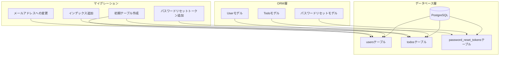
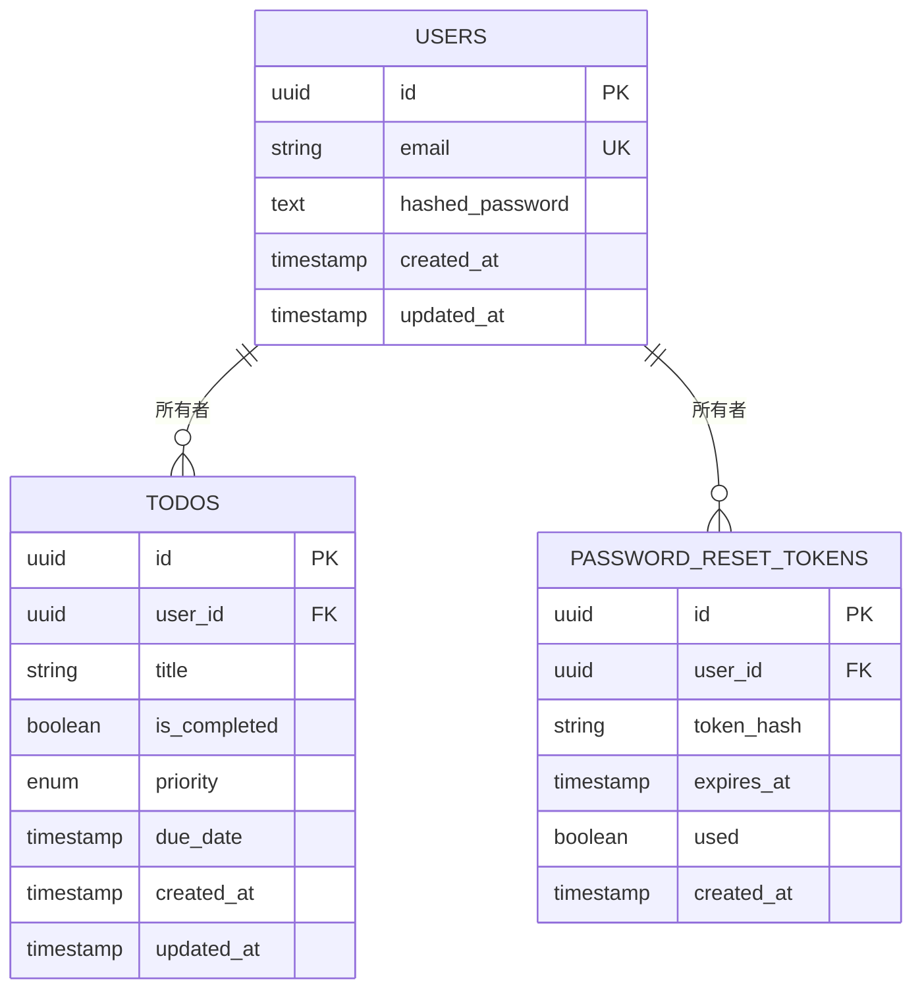
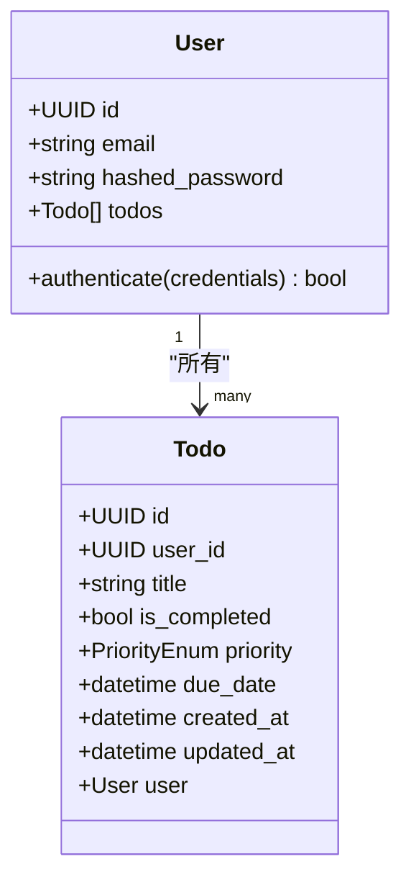
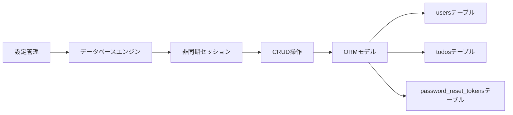

# データベース設計

<cite>
**この文書で参照されるファイル**
- [backend/app/models/user.py](file://backend/app/models/user.py)
- [backend/app/models/todo.py](file://backend/app/models/todo.py)
- [backend/app/models/password_reset.py](file://backend/app/models/password_reset.py)
- [backend/app/schemas/user.py](file://backend/app/schemas/user.py)
- [backend/app/schemas/todo.py](file://backend/app/schemas/todo.py)
- [backend/app/crud/crud_user.py](file://backend/app/crud/crud_user.py)
- [backend/app/crud/crud_todo.py](file://backend/app/crud/crud_todo.py)
- [backend/app/core/db.py](file://backend/app/core/db.py)
- [backend/app/core/config.py](file://backend/app/core/config.py)
- [backend/migrations/versions/4f4084d80ebd_create_users_and_todos_tables.py](file://backend/migrations/versions/4f4084d80ebd_create_users_and_todos_tables.py)
- [backend/migrations/versions/319591f893c3_rename_username_to_email.py](file://backend/migrations/versions/319591f893c3_rename_username_to_email.py)
- [backend/migrations/versions/add_indexes.py](file://backend/migrations/versions/add_indexes.py)
- [backend/migrations/versions/540d82e6a72d_add_password_reset_tokens.py](file://backend/migrations/versions/540d82e6a72d_add_password_reset_tokens.py)
- [backend/pyproject.toml](file://backend/pyproject.toml)
</cite>

## 目次
1. [イントロダクション](#イントロダクション)
2. [プロジェクト構造](#プロジェクト構造)
3. [コアコンポーネント](#コアコンポーネント)
4. [アーキテクチャ概要](#アーキテクチャ概要)
5. [詳細コンポーネント分析](#詳細コンポーネント分析)
6. [依存関係分析](#依存関係分析)
7. [パフォーマンス考慮事項](#パフォーマンス考慮事項)
8. [トラブルシューティングガイド](#トラブルシューティングガイド)
9. [結論](#結論)

## イントロダクション
この文書は、PostgreSQLを基盤としたTodoアプリケーションのデータベーススキーマの詳細設計を提供します。主にusersテーブルとtodosテーブルのカラム定義、制約、関連性について説明し、データベースマイグレーションの仕組み、インデックス設計、データ型の選定理由を含めます。ORMモデルの実装、データの整合性制御、パフォーマンス最適化のための設計方針についても詳しく解説します。

## プロジェクト構造
バックエンドアプリケーションはSQLModelを使用した非同期データベース操作を実装しており、Alembicによるマイグレーション管理が行われています。

```mermaid
graph TB
subgraph "データベース層"
DB[(PostgreSQL)]
Users[usersテーブル]
Todos[todosテーブル]
PasswordTokens[password_reset_tokensテーブル]
end
subgraph "ORM層"
UserModel[Userモデル]
TodoModel[Todoモデル]
PasswordResetModel[パスワードリセットモデル]
end
subgraph "マイグレーション"
Migration1[初期テーブル作成]
Migration2[メールアドレスへの変更]
Migration3[インデックス追加]
Migration4[パスワードリセットトークン追加]
end
DB --> Users
DB --> Todos
DB --> PasswordTokens
UserModel --> Users
TodoModel --> Todos
PasswordResetModel --> PasswordTokens
Migration1 --> Users
Migration1 --> Todos
Migration2 --> Users
Migration3 --> Todos
Migration4 --> PasswordTokens
```

**図の出典**
- [backend/app/models/user.py:9-15](file://backend/app/models/user.py#L9-L15)
- [backend/app/models/todo.py:10-24](file://backend/app/models/todo.py#L10-L24)
- [backend/migrations/versions/4f4084d80ebd_create_users_and_todos_tables.py:24-40](file://backend/migrations/versions/4f4084d80ebd_create_users_and_todos_tables.py#L24-L40)

**セクションの出典**
- [backend/app/core/db.py:1-17](file://backend/app/core/db.py#L1-L17)
- [backend/app/core/config.py:44-48](file://backend/app/core/config.py#L44-L48)

## コアコンポーネント
データベーススキーマは3つの主要なテーブルで構成されています：

### usersテーブル
- **主キー**: UUID型のidカラム
- **一意制約**: emailカラム
- **インデックス**: emailカラムに一意インデックス
- **データ型**: UUID、String、Text

### todosテーブル  
- **主キー**: UUID型のidカラム
- **外部キー**: user_idカラム（users.idへの参照）
- **インデックス**: user_id、created_at、is_completed、priority、due_date
- **データ型**: UUID、String、Boolean、DateTime、Enum

### password_reset_tokensテーブル
- **主キー**: UUID型のidカラム
- **外部キー**: user_idカラム（users.idへの参照）
- **インデックス**: token_hashカラム
- **データ型**: UUID、String、DateTime、Boolean

**セクションの出典**
- [backend/app/models/user.py:12-13](file://backend/app/models/user.py#L12-L13)
- [backend/app/models/todo.py:19-22](file://backend/app/models/todo.py#L19-L22)
- [backend/migrations/versions/4f4084d80ebd_create_users_and_todos_tables.py:24-40](file://backend/migrations/versions/4f4084d80ebd_create_users_and_todos_tables.py#L24-L40)

## アーキテクチャ概要
データベース設計は以下の要素で構成されています：

```mermaid
erDiagram
USERS {
uuid id PK
string email UK
text hashed_password
timestamp created_at
timestamp updated_at
}
TODOS {
uuid id PK
uuid user_id FK
string title
boolean is_completed
enum priority
timestamp due_date
timestamp created_at
timestamp updated_at
}
PASSWORD_RESET_TOKENS {
uuid id PK
uuid user_id FK
string token_hash
timestamp expires_at
boolean used
timestamp created_at
}
USERS ||--o{ TODOS : "所有者"
USERS ||--o{ PASSWORD_RESET_TOKENS : "所有者"
```

**図の出典**
- [backend/migrations/versions/4f4084d80ebd_create_users_and_todos_tables.py:24-40](file://backend/migrations/versions/4f4084d80ebd_create_users_and_todos_tables.py#L24-L40)
- [backend/migrations/versions/540d82e6a72d_add_password_reset_tokens.py:24-33](file://backend/migrations/versions/540d82e6a72d_add_password_reset_tokens.py#L24-L33)

### ORMモデルの関係性
- Userモデルは複数のTodoオブジェクトを持つ（1対多）
- Todoモデルは1つのUserオブジェクトに関連付けられる（多対1）
- PasswordResetTokenモデルは1つのUserオブジェクトに関連付けられる（多対1）

**セクションの出典**
- [backend/app/models/user.py:15](file://backend/app/models/user.py#L15)
- [backend/app/models/todo.py:24](file://backend/app/models/todo.py#L24)

## 詳細コンポーネント分析

### usersテーブル詳細設計

#### カラム定義
| カラム名 | 型 | 制約 | 説明 |
|----------|----|------|------|
| id | UUID | PRIMARY KEY, NOT NULL | ユニーク識別子 |
| email | String | UNIQUE, INDEX, NOT NULL, max_length=255 | ユーザーのメールアドレス |
| hashed_password | Text | NOT NULL | パスワードのハッシュ値 |

#### 制約とインデックス
- 主キー: idカラム
- 一意制約: emailカラム
- インデックス: emailカラム（一意）

**セクションの出典**
- [backend/migrations/versions/4f4084d80ebd_create_users_and_todos_tables.py:24-30](file://backend/migrations/versions/4f4084d80ebd_create_users_and_todos_tables.py#L24-L30)
- [backend/migrations/versions/319591f893c3_rename_username_to_email.py:24-27](file://backend/migrations/versions/319591f893c3_rename_username_to_email.py#L24-L27)

### todosテーブル詳細設計

#### カラム定義
| カラム名 | 型 | 制約 | 説明 |
|----------|----|------|------|
| id | UUID | PRIMARY KEY, NOT NULL | ユニーク識別子 |
| user_id | UUID | FOREIGN KEY(users.id), NOT NULL, INDEX | 所有者のユーザーID |
| title | String | NOT NULL, max_length=255 | TODOのタイトル |
| is_completed | Boolean | DEFAULT FALSE | 完了ステータス |
| priority | Enum | DEFAULT LOW | 優先度（high/medium/low） |
| due_date | DateTime | DEFAULT NULL | 期日 |
| created_at | DateTime | DEFAULT CURRENT_TIMESTAMP | 作成日時 |
| updated_at | DateTime | DEFAULT CURRENT_TIMESTAMP | 更新日時 |

#### 制約とインデックス
- 主キー: idカラム
- 外部キー: user_id → users.id
- インデックス: user_id, created_at, is_completed, priority, due_date

**セクションの出典**
- [backend/migrations/versions/4f4084d80ebd_create_users_and_todos_tables.py:32-40](file://backend/migrations/versions/4f4084d80ebd_create_users_and_todos_tables.py#L32-L40)
- [backend/migrations/versions/add_indexes.py:23-27](file://backend/migrations/versions/add_indexes.py#L23-L27)

### password_reset_tokensテーブル詳細設計

#### カラム定義
| カラム名 | 型 | 制約 | 説明 |
|----------|----|------|------|
| id | UUID | PRIMARY KEY, NOT NULL | トークン識別子 |
| user_id | UUID | FOREIGN KEY(users.id), NOT NULL | 所有者のユーザーID |
| token_hash | String | NOT NULL, INDEX | トークンのSHA-256ハッシュ |
| expires_at | DateTime | NOT NULL | 有効期限 |
| used | Boolean | DEFAULT FALSE, NOT NULL | 使用済みフラグ |
| created_at | DateTime | NOT NULL | 作成日時 |

**セクションの出典**
- [backend/migrations/versions/540d82e6a72d_add_password_reset_tokens.py:24-33](file://backend/migrations/versions/540d82e6a72d_add_password_reset_tokens.py#L24-L33)

### ORMモデルの実装

#### Userモデル

```mermaid
classDiagram
class User {
+UUID id
+string email
+string hashed_password
+Todo[] todos
+authenticate(credentials) bool
}
class Todo {
+UUID id
+UUID user_id
+string title
+bool is_completed
+PriorityEnum priority
+datetime due_date
+datetime created_at
+datetime updated_at
+User user
}
User "1" --> "many" Todo : "所有"
```

**図の出典**
- [backend/app/models/user.py:9-15](file://backend/app/models/user.py#L9-L15)
- [backend/app/models/todo.py:10-24](file://backend/app/models/todo.py#L10-L24)

#### Todoモデル
Todoモデルには複数のインデックスが定義されており、検索パフォーマンスを最適化しています。

**セクションの出典**
- [backend/app/models/todo.py:12-17](file://backend/app/models/todo.py#L12-L17)

### CRUD操作の実装

#### ユーザーCRUD操作
- `get_user_by_email`: メールアドレスによるユーザー検索
- `get_user_by_id`: IDによるユーザー検索  
- `create_user`: 新規ユーザー作成（パスワードハッシュ化）

#### TODO CRUD操作
- `get_todos`: 検索・フィルタリング・ページネーション対応の一覧取得
- `count_todos`: 検索条件に合致するTODO数の取得
- `create_todo`: 新規TODO作成
- `update_todo`: 部分的なTODO更新
- `delete_todo`: TODO削除

**セクションの出典**
- [backend/app/crud/crud_user.py:8-27](file://backend/app/crud/crud_user.py#L8-L27)
- [backend/app/crud/crud_todo.py:10-151](file://backend/app/crud/crud_todo.py#L10-L151)

## 依存関係分析

### データベース接続と設定
- 非同期接続を使用（asyncpgドライバ）
- PostgreSQL接続文字列は設定から動的に生成
- 開発環境ではSQLクエリの出力が有効化

### 外部依存関係
- **SQLModel**: ORMフレームワーク（0.0.38以降）
- **asyncpg**: PostgreSQL非同期ドライバ
- **Alembic**: データベースマイグレーションツール

```mermaid
graph LR
Config[設定管理] --> DBEngine[データベースエンジン]
DBEngine --> AsyncSession[非同期セッション]
AsyncSession --> CRUD[CRUD操作]
CRUD --> Models[ORMモデル]
Models --> Users[usersテーブル]
Models --> Todos[todosテーブル]
Models --> PasswordTokens[password_reset_tokensテーブル]
```

**図の出典**
- [backend/app/core/config.py:44-48](file://backend/app/core/config.py#L44-L48)
- [backend/app/core/db.py:5-12](file://backend/app/core/db.py#L5-L12)

**セクションの出典**
- [backend/pyproject.toml:7-25](file://backend/pyproject.toml#L7-L25)

## パフォーマンス考慮事項

### インデックス戦略
1. **todosテーブルのインデックス**
   - `ix_todos_user_id`: ユーザーごとのTODO検索最適化
   - `ix_todos_created_at`: 日付ベースのソート・フィルタリング
   - `ix_todos_is_completed`: 完了状態でのフィルタリング
   - `ix_todos_priority`: 優先度でのソート・フィルタリング
   - `ix_todos_due_date`: 期日のフィルタリング

2. **usersテーブルのインデックス**
   - `ix_users_email`: メールアドレスでの一意検索

3. **password_reset_tokensテーブルのインデックス**
   - `ix_password_reset_tokens_token_hash`: トークン検索最適化

### データ型選定の理由
- **UUID型**: 一意性を保ちながら分散システムでの衝突を防ぐ
- **String型**: 可変長文字列で柔軟性を確保
- **Text型**: 長いテキストデータ（パスワードハッシュ）の保存
- **Boolean型**: 真偽値の効率的な保存
- **DateTime型**: 日付時間の精度を保つためにタイムゾーン対応

### 検索パフォーマンス最適化
- Todo一覧取得時の複数条件のフィルタリング
- 部分一致検索のLIKE演算子使用
- ソート条件の複数指定対応（created_at, priority, due_date）

**セクションの出典**
- [backend/migrations/versions/add_indexes.py:22-30](file://backend/migrations/versions/add_indexes.py#L22-L30)
- [backend/app/crud/crud_todo.py:25-65](file://backend/app/crud/crud_todo.py#L25-L65)

## トラブルシューティングガイド

### 共通エラーと解決策

#### 1. データベース接続エラー
- **症状**: 接続が確立されない
- **原因**: 接続文字列の誤り、ポート番号の不一致
- **解決**: 設定ファイルの確認、ネットワーク接続の確認

#### 2. マイグレーションエラー
- **症状**: テーブル作成に失敗
- **原因**: 既存テーブルの存在、権限不足
- **解決**: `alembic stamp head`で手動で状態を更新

#### 3. インデックス作成エラー
- **症状**: 一意制約違反
- **原因**: 重複データの存在
- **解決**: 重複データの削除または修正

#### 4. ORM操作エラー
- **症状**: SQLエラーが発生
- **原因**: 型の不一致、制約違反
- **解決**: Pydanticスキーマのバリデーション確認

**セクションの出典**
- [backend/app/core/db.py:14-16](file://backend/app/core/db.py#L14-L16)
- [backend/app/core/config.py:44-48](file://backend/app/core/config.py#L44-L48)

### デバッグ手法
1. **SQLクエリの表示**: 開発環境ではSQLクエリをコンソールに出力
2. **マイグレーションの確認**: `alembic current`で現在のマイグレーション状態を確認
3. **データの検証**: `SELECT COUNT(*) FROM users/todos`でデータ量の確認

## 結論
このデータベース設計は、以下のような特徴を持っています：

### 強み
- **堅牢なデータ型選定**: UUID、Enum、DateTimeなどの適切な型使用
- **効率的なインデックス戦略**: 検索・フィルタリング・ソートのパフォーマンスを最適化
- **明確な関係性**: 1対多の関係性をORMで表現
- **拡張性**: 追加のマイグレーションに対応可能

### 改善点
- **タグ機能の拡張**: 現在は文字列として扱われており、専用のタグテーブルへの移行を検討
- **履歴管理**: 重要な変更の履歴を記録するための設計
- **パーティショニング**: 大量データへの対応としてパーティションの導入

### 最適化提案
1. **クエリのキャッシュ**: 高頻度アクセスのデータに対してRedisキャッシュの導入
2. **読み取りレプリカ**: 読み取り操作の負荷分散
3. **統計情報の定期更新**: ANALYZEコマンドの自動実行

この設計は、Todoアプリケーションの機能要件を満たしつつ、将来的な拡張にも対応できる堅牢な基盤を提供しています。