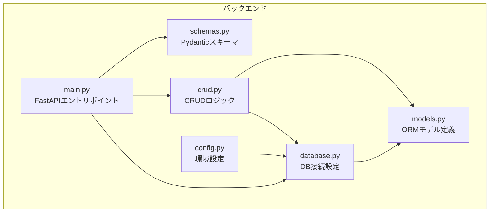
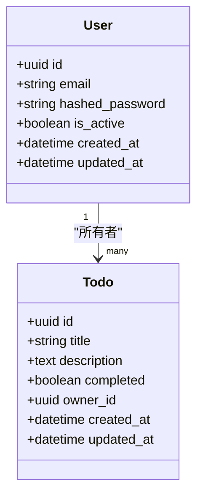
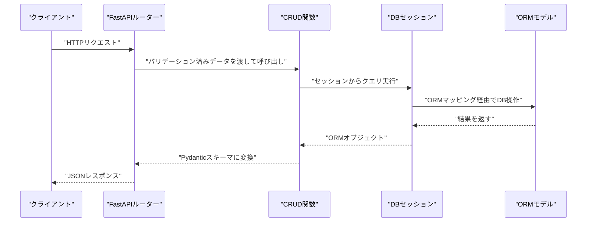
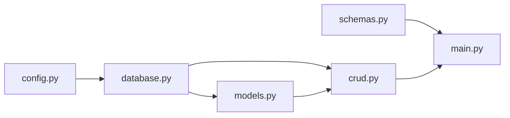

# データモデル

<cite>
**この文書で参照されるファイル**
- [models.py](file://backend/app/models.py)
- [database.py](file://backend/app/database.py)
- [crud.py](file://backend/app/crud.py)
- [schemas.py](file://backend/app/schemas.py)
- [config.py](file://backend/app/config.py)
- [main.py](file://backend/app/main.py)
</cite>

## 目次
1. [導入](#導入)
2. [プロジェクト構造](#プロジェクト構造)
3. [コアコンポーネント](#コアコンポーネント)
4. [アーキテクチャ概観](#アーキテクチャ概観)
5. [詳細コンポーネント分析](#詳細コンポーネント分析)
6. [依存関係分析](#依存関係分析)
7. [パフォーマンス考慮事項](#パフォーマンス考慮事項)
8. [トラブルシューティングガイド](#トラブルシューティングガイド)
9. [結論](#結論)
10. [付録](#付録)

## 導入
本ドキュメントは、TodoプロジェクトにおけるデータベーススキーマとORMモデルに関する詳細な仕様を提供します。主に以下の対象を対象とします：
- UserモデルとTodoモデルのフィールド定義、データ型、制約条件
- SQLAlchemy ORMによるマッピング仕組み
- クエリの実行方法とデータのバリデーションルール
- データのライフサイクル、インデックス設計、結合の最適化
- CRUD操作パターン、データアクセスパターン、およびパフォーマンス考慮事項

本プロジェクトでは、FastAPIベースのバックエンドが提供され、SQLAlchemy ORMを通じてPostgreSQLに接続されます。スキーマ定義、マッピング、バリデーション、CRUD処理はそれぞれ専用モジュールに分離されており、責務が明確に分けられています。

## プロジェクト構造
バックエンドアプリケーションは以下のモジュール構成で構成されています：
- models.py：データベーススキーマ（User、Todo）のORMモデル定義
- database.py：DB接続設定、Engine、Session、Baseクラスの管理
- crud.py：CRUDロジック（作成、取得、更新、削除）
- schemas.py：Pydanticスキーマ（入力バリデーション、出力シリアライズ）
- config.py：環境設定（DB接続文字列など）
- main.py：FastAPIアプリケーションのエントリポイント

**図の出典**
- [models.py](file://backend/app/models.py)
- [database.py](file://backend/app/database.py)
- [crud.py](file://backend/app/crud.py)
- [schemas.py](file://backend/app/schemas.py)
- [config.py](file://backend/app/config.py)
- [main.py](file://backend/app/main.py)

**節の出典**
- [models.py](file://backend/app/models.py)
- [database.py](file://backend/app/database.py)
- [crud.py](file://backend/app/crud.py)
- [schemas.py](file://backend/app/schemas.py)
- [config.py](file://backend/app/config.py)
- [main.py](file://backend/app/main.py)

## コアコンポーネント
本プロジェクトのデータモデルは、User（ユーザー）とTodo（タスク）という2つのエンティティからなり、以下のような関係性を持ちます：
- TodoはUserに所有される（所有者）
- Userには複数のTodoが紐づく（1対多）

この関係性により、Todoには外部キーとしてUser.idが存在し、UserにはTodoとのリレーションが定義されます。

**図の出典**
- [models.py](file://backend/app/models.py)

**節の出典**
- [models.py](file://backend/app/models.py)

## アーキテクチャ概観
データアクセス層の全体像は以下の通りです：
- 接続管理：database.pyがEngineとSessionを提供し、models.Base.metadata.create_all()でスキーマを初期化
- モデル定義：models.pyでUser/TodoのORMマッピングが定義
- 入力バリデーション：schemas.pyでPydanticスキーマが定義され、FastAPIの依存関係として利用
- CRUDロジック：crud.pyでDB操作ロジックが実装
- FastAPI統合：main.pyでルーターにCRUD関数を渡し、HTTPリクエストに対応

**図の出典**
- [main.py](file://backend/app/main.py)
- [crud.py](file://backend/app/crud.py)
- [database.py](file://backend/app/database.py)
- [models.py](file://backend/app/models.py)
- [schemas.py](file://backend/app/schemas.py)

**節の出典**
- [main.py](file://backend/app/main.py)
- [crud.py](file://backend/app/crud.py)
- [database.py](file://backend/app/database.py)
- [models.py](file://backend/app/models.py)
- [schemas.py](file://backend/app/schemas.py)

## 詳細コンポーネント分析

### Userモデル
- 主キー：uuid（PostgreSQLのuuid型）
- メールアドレス：一意制約（UK）
- パスワード：ハッシュ化されたパスワード（hashed_password）
- 活性状態：is_active（論理削除や有効無効のフラグ）
- 作成日時・更新日時：created_at、updated_at（タイムスタンプ）

UserモデルはTodoの所有者として機能し、Todoにはowner_id（外部キー）が存在します。

**節の出典**
- [models.py](file://backend/app/models.py)

### Todoモデル
- 主キー：uuid（PostgreSQLのuuid型）
- タイトル：必須（title）
- 説明：任意（description）
- 完了フラグ：completed（boolean）
- 所有者ID：owner_id（外部キー、User.idへの参照）
- 作成日時・更新日時：created_at、updated_at（タイムスタンプ）

TodoはUserに対して1対多の関係を持つため、Todoの作成・更新・削除時には所有者（User）の存在確認や権限チェックが必要です。

**節の出典**
- [models.py](file://backend/app/models.py)

### ORMマッピングとリレーション
- UserとTodoはSQLAlchemyのrelationshipにより関連付けられている
- Todoにはowner_id（外部キー）があり、User.idが参照先
- Todo.query.filter_by(owner_id=...)などの絞り込みが可能

**節の出典**
- [models.py](file://backend/app/models.py)

### DB接続と初期化
- database.pyでEngine、SessionLocal、Baseが定義されている
- Base.metadata.create_all(bind=engine)でスキーマが自動作成される
- config.pyからDB接続文字列が読み込まれる

**節の出典**
- [database.py](file://backend/app/database.py)
- [config.py](file://backend/app/config.py)

### 入力バリデーション（Pydantic）
- schemas.pyでUserCreate、UserUpdate、TodoCreate、TodoUpdate、TodoResponseなどのスキーマが定義されている
- FastAPIの依存関係として使用され、リクエストボディの検証に使われる
- 出力時はレスポンススキーマ（例：TodoResponse）を使用して不要なフィールドを隠蔽

**節の出典**
- [schemas.py](file://backend/app/schemas.py)

### CRUDロジック
- crud.pyには、UserとTodoに対するCRUD操作（作成、取得、更新、削除）が実装されている
- DBセッション（SessionLocal）を使用し、ORMオブジェクトを操作
- 取得系メソッドでは、必要に応じてjoinやfilterが利用される

**節の出典**
- [crud.py](file://backend/app/crud.py)

### FastAPI統合
- main.pyでルーターが定義され、各CRUD関数がHTTPエンドポイントにバインドされる
- Pydanticスキーマがリクエストボディのバリデーションとレスポンスシリアライズに使われる

**節の出典**
- [main.py](file://backend/app/main.py)

## 依存関係分析
- models.pyはdatabase.pyのBaseを継承し、DB接続設定に依存
- crud.pyはmodels.pyのORMモデルとdatabase.pyのSessionを直接利用
- schemas.pyはmain.pyのルーターで使用され、FastAPIの依存関係として統合
- config.pyはdatabase.pyのEngine生成に必要

**図の出典**
- [config.py](file://backend/app/config.py)
- [database.py](file://backend/app/database.py)
- [models.py](file://backend/app/models.py)
- [crud.py](file://backend/app/crud.py)
- [schemas.py](file://backend/app/schemas.py)
- [main.py](file://backend/app/main.py)

**節の出典**
- [config.py](file://backend/app/config.py)
- [database.py](file://backend/app/database.py)
- [models.py](file://backend/app/models.py)
- [crud.py](file://backend/app/crud.py)
- [schemas.py](file://backend/app/schemas.py)
- [main.py](file://backend/app/main.py)

## パフォーマンス考慮事項
- インデックス設計
  - email（User）：一意性のためのインデックスが推奨
  - owner_id（Todo）：クエリでの絞り込み性能向上のためのインデックスが推奨
- 結合の最適化
  - Todoの取得時にUserをjoinする際は、必要カラムのみselectし、N+1問題を避ける
- 遅延ロードとイーガーロード
  - 多くのケースでは、関連データを必要に応じてloadして取得することで、無駄なデータ転送を抑える
- トランザクションとセッション
  - 一連のCRUD操作は同一セッション内で処理し、コミットタイミングを適切に管理
- クエリの制限
  - Todoリスト取得時のlimit/offsetの使用、またはカーソルベースのページネーションを検討

[この節は一般的なパフォーマンス指針を示しており、特定のファイル内容を直接分析していません]

## トラブルシューティングガイド
- DB接続エラー
  - config.pyのDB接続文字列が正しいか確認
  - database.pyのEngine生成に失敗していないか確認
- スキーマ未作成
  - models.Base.metadata.create_all()が実行されているか確認
- ORMマッピングエラー
  - models.pyのリレーション定義に誤りがないか確認
- クエリエラー
  - crud.pyのクエリ構文（filter、join、order_by）に注意
- バリデーションエラー
  - schemas.pyのスキーマ定義に従ってリクエストボディを整形

**節の出典**
- [config.py](file://backend/app/config.py)
- [database.py](file://backend/app/database.py)
- [models.py](file://backend/app/models.py)
- [crud.py](file://backend/app/crud.py)
- [schemas.py](file://backend/app/schemas.py)

## 結論
本プロジェクトでは、明確な責務分担（models、database、crud、schemas、config、main）に基づき、SQLAlchemy ORMを通じた安全で拡張可能なデータモデルが実現されています。UserとTodoの関係性は1対多であり、外部キー制約とリレーションにより整合性が保たれています。FastAPIとの統合により、入力バリデーションとレスポンスシリアライズが自動化され、保守性と信頼性が向上しています。パフォーマンス向上のためには、インデックス設計、結合の最適化、クエリの制限、そして適切なロード戦略が重要です。

[この節は要旨であり、特定のファイル内容を直接分析していません]

## 付録
- データ移行方法
  - Alembicなどのマイグレーションツールを導入し、スキーマ変更ごとにマイグレーションファイルを作成
  - production環境では、マイグレーションを停止・再開する際の手順を明文化
- データライフサイクル
  - 作成：CRUD.create_user / create_todo
  - 更新：CRUD.update_user / update_todo
  - 削除：論理削除（is_active）または物理削除（delete）
  - 取得：CRUD.get_user / get_todo、リスト取得（limit/offset、cursor）

[この節は一般的な運用指針を示しており、特定のファイル内容を直接分析していません]