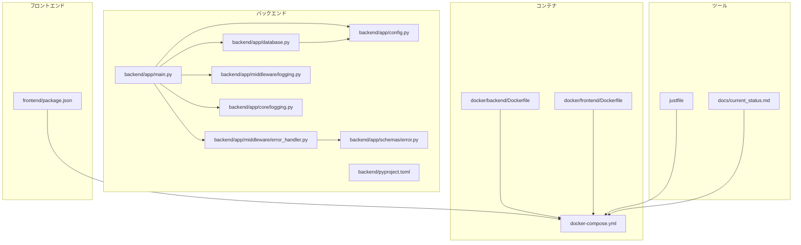
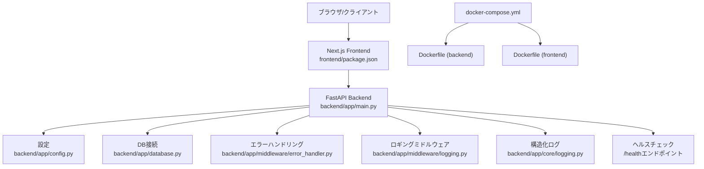
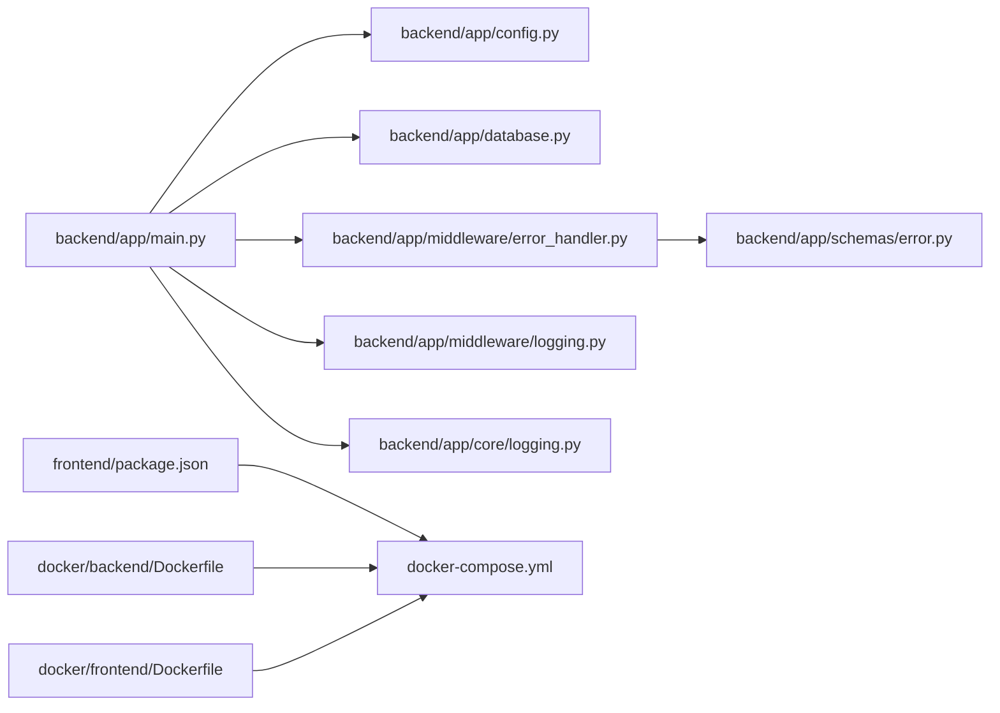

# トラブルシューティング

<cite>
**このドキュメントで参照されるファイル**
- [backend/app/main.py](file://backend/app/main.py)
- [backend/app/config.py](file://backend/app/config.py)
- [backend/app/database.py](file://backend/app/database.py)
- [backend/app/middleware/error_handler.py](file://backend/app/middleware/error_handler.py)
- [backend/app/middleware/logging.py](file://backend/app/middleware/logging.py)
- [backend/app/schemas/error.py](file://backend/app/schemas/error.py)
- [backend/app/core/logging.py](file://backend/app/core/logging.py)
- [backend/app/core/config.py](file://backend/app/core/config.py)
- [backend/app/core/db.py](file://backend/app/core/db.py)
- [docker/backend/Dockerfile](file://docker/backend/Dockerfile)
- [docker/frontend/Dockerfile](file://docker/frontend/Dockerfile)
- [docker-compose.yml](file://docker-compose.yml)
- [frontend/package.json](file://frontend/package.json)
- [backend/pyproject.toml](file://backend/pyproject.toml)
- [docs/current_status.md](file://docs/current_status.md)
- [justfile](file://justfile)
</cite>

## 更新概要
**変更内容**
- 新しいエラーハンドリング機能の追加に関するトラブルシューティング手順を追加
- 構造化ログ出力機能に関するトラブルシューティング手順を追加
- ヘルスチェックエンドポイントの動作確認手順を追加
- 依存関係の問題に関するトラブルシューティング手順を更新

## 目次
1. [はじめに](#はじめに)
2. [プロジェクト構造](#プロジェクト構造)
3. [コアコンポーネント](#コアコンポーネント)
4. [アーキテクチャ概観](#アーキテクチャ概観)
5. [詳細コンポーネント分析](#詳細コンポーネント分析)
6. [依存関係分析](#依存関係分析)
7. [パフォーマンスに関する考慮事項](#パフォーマンスに関する考慮事項)
8. [トラブルシューティングガイド](#トラブルシューティングガイド)
9. [結論](#結論)
10. [付録](#付録)

## はじめに
本ドキュメントは、Todoプロジェクトにおけるよくある問題とその解決法を網羅的にまとめたものです。開発環境のセットアップ時や運用中に発生しやすい問題（ポート競合、依存関係の問題、データベース接続エラー、Dockerコンテナ起動失敗、APIエンドポイントの動作不良、認証エラー、ログの確認方法、デバッグツールの使用、パフォーマンス劣化の原因と対策、システムのモニタリング方法など）について、実際のソースコードに基づいた手順を示します。

**更新** 最新の変更では、統一エラーハンドリング機能、構造化ログ出力、ヘルスチェックエンドポイントの追加により、トラブルシューティングの幅が広がっています。

## プロジェクト構造
Todoプロジェクトは、バックエンド（FastAPI）、フロントエンド（Next.js）、Dockerコンテナ、およびComposeによる統合管理で構成されています。バックエンドはPython製のWebフレームワークを使用し、データベース接続や設定管理が行われています。フロントエンドはTypeScript/Next.jsで構築され、依存関係管理にはpackage.jsonが利用されています。Dockerfileはバックエンドとフロントエンドそれぞれに用意されており、docker-compose.ymlで統合して起動・停止が制御されます。

**図の出典**
- [backend/app/main.py](file://backend/app/main.py)
- [backend/app/config.py](file://backend/app/config.py)
- [backend/app/database.py](file://backend/app/database.py)
- [backend/app/middleware/error_handler.py](file://backend/app/middleware/error_handler.py)
- [backend/app/middleware/logging.py](file://backend/app/middleware/logging.py)
- [backend/app/schemas/error.py](file://backend/app/schemas/error.py)
- [backend/app/core/logging.py](file://backend/app/core/logging.py)
- [docker/backend/Dockerfile](file://docker/backend/Dockerfile)
- [docker/frontend/Dockerfile](file://docker/frontend/Dockerfile)
- [docker-compose.yml](file://docker-compose.yml)
- [frontend/package.json](file://frontend/package.json)
- [backend/pyproject.toml](file://backend/pyproject.toml)
- [docs/current_status.md](file://docs/current_status.md)
- [justfile](file://justfile)

**節の出典**
- [backend/app/main.py](file://backend/app/main.py)
- [backend/app/config.py](file://backend/app/config.py)
- [backend/app/database.py](file://backend/app/database.py)
- [backend/app/middleware/error_handler.py](file://backend/app/middleware/error_handler.py)
- [backend/app/middleware/logging.py](file://backend/app/middleware/logging.py)
- [backend/app/schemas/error.py](file://backend/app/schemas/error.py)
- [backend/app/core/logging.py](file://backend/app/core/logging.py)
- [docker/backend/Dockerfile](file://docker/backend/Dockerfile)
- [docker/frontend/Dockerfile](file://docker/frontend/Dockerfile)
- [docker-compose.yml](file://docker-compose.yml)
- [frontend/package.json](file://frontend/package.json)
- [backend/pyproject.toml](file://backend/pyproject.toml)
- [docs/current_status.md](file://docs/current_status.md)
- [justfile](file://justfile)

## コアコンポーネント
- 設定管理：設定値（例：データベース接続文字列、APIのオリジン、認証関連）が集中管理され、アプリケーション全体で利用されます。
- DB接続：SQLAlchemyによるORM設定、DB接続プール、初期化処理が含まれます。
- APIエンドポイント：FastAPIのルーティング、エラーハンドリング、認証・認可の仕組みが定義されています。
- Dockerコンテナ：バックエンドとフロントエンドのビルド設定、ポートマッピング、環境変数の設定が記述されています。
- docker-compose：サービス間の依存関係、ネットワーク、ボリューム、環境変数の統合管理が行われています。
- 依存関係：バックエンドはpyproject.toml、フロントエンドはpackage.jsonで管理されています。
- 開発支援：justfileによるタスク定義、current_status.mdによる状態確認が可能です。
- **統一エラーハンドリング**：バリデーションエラー、HTTP例外、一般例外、レート制限エラーを一貫した形式で処理します。
- **構造化ログ出力**：JSON形式のログを標準出力に出力し、外部監視ツールとの連携を可能にします。
- **ヘルスチェックエンドポイント**：システム全体の健全性を確認するためのエンドポイントが提供されています。

**更新** 新しいエラーハンドリング機能、構造化ログ出力、ヘルスチェックエンドポイントが追加され、トラブルシューティングの精度と効率が向上しました。

**節の出典**
- [backend/app/config.py](file://backend/app/config.py)
- [backend/app/database.py](file://backend/app/database.py)
- [backend/app/main.py](file://backend/app/main.py)
- [backend/app/middleware/error_handler.py](file://backend/app/middleware/error_handler.py)
- [backend/app/middleware/logging.py](file://backend/app/middleware/logging.py)
- [backend/app/schemas/error.py](file://backend/app/schemas/error.py)
- [backend/app/core/logging.py](file://backend/app/core/logging.py)
- [docker/backend/Dockerfile](file://docker/backend/Dockerfile)
- [docker/frontend/Dockerfile](file://docker/frontend/Dockerfile)
- [docker-compose.yml](file://docker-compose.yml)
- [frontend/package.json](file://frontend/package.json)
- [backend/pyproject.toml](file://backend/pyproject.toml)
- [justfile](file://justfile)
- [docs/current_status.md](file://docs/current_status.md)

## アーキテクチャ概観
バックエンドはFastAPIで実装され、設定とDB接続を経てAPIエンドポイントを提供します。フロントエンドはNext.jsで構築され、バックエンドAPIにHTTPリクエストを送信します。Dockerコンテナ化により、開発・本番環境の一貫性が保たれています。docker-composeによって、サービス間の連携が制御され、ポートやネットワークが統一的に管理されます。

**図の出典**
- [backend/app/main.py](file://backend/app/main.py)
- [backend/app/config.py](file://backend/app/config.py)
- [backend/app/database.py](file://backend/app/database.py)
- [backend/app/middleware/error_handler.py](file://backend/app/middleware/error_handler.py)
- [backend/app/middleware/logging.py](file://backend/app/middleware/logging.py)
- [backend/app/core/logging.py](file://backend/app/core/logging.py)
- [docker-compose.yml](file://docker-compose.yml)
- [docker/backend/Dockerfile](file://docker/backend/Dockerfile)
- [docker/frontend/Dockerfile](file://docker/frontend/Dockerfile)
- [frontend/package.json](file://frontend/package.json)

## 詳細コンポーネント分析

### 設定管理（config.py）
- 説明：環境変数や設定値（例：データベースURL、APIのオリジン、認証関連）を読み込み、アプリケーション全体で共有します。
- トラブル対象：環境変数の誤り、設定値の不足、型ミスによるエラー。
- 解決手順：
  - 環境変数が正しくexportされているか確認します。
  - 設定値が存在するか、デフォルト値が適切か確認します。
  - 設定のバリデーション（例：URL形式、数値範囲）を追加することで、早期検出を促します。

**節の出典**
- [backend/app/config.py](file://backend/app/config.py)

### DB接続（database.py）
- 説明：SQLAlchemyのEngine作成、セッション管理、初期化処理（例：テーブル作成、マイグレーション）が含まれます。
- トラブル対象：DB接続文字列の誤り、DBサーバーへのアクセス不可、接続プールの上限超過。
- 解決手順：
  - 接続文字列が正しいか、ホスト・ポート・DB名・認証情報が一致するか確認します。
  - DBサーバーが起動しているか、ネットワーク経由でのアクセスが可能か確認します。
  - 接続プールのサイズとタイムアウトを調整し、同時接続数の増加に対応します。

**節の出典**
- [backend/app/database.py](file://backend/app/database.py)

### APIエンドポイント（main.py）
- 説明：FastAPIのルート定義、例外ハンドラ、CORS設定、認証・認可の処理が含まれます。
- トラブル対象：ルートの重複、CORSエラー、認証トークンの期限切れ、エラーハンドリング不足。
- 解決手順：
  - 重複したルート名やパスの定義がないか確認します。
  - CORSのオリジン設定が適切か、必要に応じてオリジンを追加または許可リストを設定します。
  - 認証トークンの有効期限や再生成機構を確認し、適切なエラーメッセージを返すようにします。
  - 例外ハンドラを追加し、HTTPステータスコードとエラーレスポンスを一貫して返すようにします。

**更新** 新しいエラーハンドリング機能により、バリデーションエラー、HTTP例外、一般例外、レート制限エラーが統一された形式で処理されるようになりました。

**節の出典**
- [backend/app/main.py](file://backend/app/main.py)

### 統一エラーハンドリング（error_handler.py）
- 説明：バリデーションエラー、HTTP例外、一般例外、レート制限エラーを統一されたErrorResponseスキーマで処理します。
- トラブル対象：エラーレスポンスの形式不整合、エラーメッセージの日本語対応不足、ログ出力の不備。
- 解決手順：
  - 各種例外ハンドラが正しく登録されているか確認します。
  - ErrorResponseスキーマのフィールドが適切に設定されているか確認します。
  - 日本語エラーメッセージが正しく設定されているか確認します。
  - ログ出力が適切に行われているか確認し、エラーの詳細情報を含めるようにします。

**更新** 新規追加されたエラーハンドリング機能で、エラー処理の一貫性が向上しました。

**節の出典**
- [backend/app/middleware/error_handler.py](file://backend/app/middleware/error_handler.py)
- [backend/app/schemas/error.py](file://backend/app/schemas/error.py)

### 構造化ログ出力（core/logging.py）
- 説明：JSON形式のログを標準出力に出力し、外部監視ツールとの連携を可能にします。
- トラブル対象：ログ出力のフォーマット不正、ログレベルの設定ミス、標準出力への出力失敗。
- 解決手順：
  - setup_logging関数が正しく呼び出されているか確認します。
  - JSONフォーマッターが正しく設定されているか確認します。
  - ログレベルが適切に設定されているか確認します。
  - 標準出力への出力が可能か確認し、権限の問題がないか確認します。

**更新** 新規追加された構造化ログ機能により、外部監視ツールとの連携が可能になりました。

**節の出典**
- [backend/app/core/logging.py](file://backend/app/core/logging.py)

### ロギングミドルウェア（middleware/logging.py）
- 説明：HTTPリクエスト・レスポンスのログを記録し、処理時間を計測します。
- トラブル対象：ログ出力の不具合、処理時間の計測ミス、エラー発生時のログ出力不足。
- 解決手順：
  - LoggingMiddlewareクラスが正しく設定されているか確認します。
  - リクエスト開始時刻の記録が適切に行われているか確認します。
  - 処理時間の計算とログ出力が正しく行われているか確認します。
  - エラー発生時のログ出力が適切に行われているか確認します。

**更新** 新規追加されたロギングミドルウェアにより、リクエスト処理の可視化が可能になりました。

**節の出典**
- [backend/app/middleware/logging.py](file://backend/app/middleware/logging.py)

### Dockerコンテナ（Dockerfile）
- 説明：バックエンドとフロントエンドそれぞれのビルド設定、依存関係のインストール、ポートの公開、実行ユーザーの設定が記述されています。
- トラブル対象：依存関係のインストール失敗、ポート競合、実行ユーザーの権限不足。
- 解決手順：
  - Dockerfile内の依存関係のインストールコマンドが成功するか確認します。
  - docker-compose.ymlでポートが他のプロセスと競合していないか確認します。
  - 実行ユーザーの権限が適切か、必要に応じてユーザーの追加や権限変更を行います。

**節の出典**
- [docker/backend/Dockerfile](file://docker/backend/Dockerfile)
- [docker/frontend/Dockerfile](file://docker/frontend/Dockerfile)

### docker-compose（docker-compose.yml）
- 説明：サービス（バックエンド、フロントエンド、DBなど）の起動順序、環境変数、ボリューム、ネットワークの設定が記述されています。
- トラブル対象：サービスの起動順序による依存エラー、環境変数の不足、ネットワークの競合。
- 解決手順：
  - depends_onやhealthcheckの設定を確認し、サービスの起動順序を適切にします。
  - 環境変数がすべて設定されているか、デフォルト値が適切か確認します。
  - サービス間のネットワーク設定（例：同一ネットワーク内での通信）を確認します。

**節の出典**
- [docker-compose.yml](file://docker-compose.yml)

### 依存関係（pyproject.toml、package.json）
- 説明：バックエンド（Python）とフロントエンド（JavaScript/TypeScript）の依存関係が記述されています。
- トラブル対象：バージョンの互換性がない、依存関係のインストールに失敗する。
- 解決手順：
  - pyproject.tomlとpackage.jsonの依存関係を確認し、互換性をチェックします。
  - 依存関係のインストールコマンドを実行し、エラー内容を確認します。
  - 必要に応じてロックファイル（uv.lock、bun.lock）を更新します。

**更新** 新しいエラーハンドリング機能には、slowapi（レート制限）とpython-json-logger（構造化ログ）が追加されました。

**節の出典**
- [backend/pyproject.toml](file://backend/pyproject.toml)
- [frontend/package.json](file://frontend/package.json)

### 開発支援（justfile、current_status.md）
- 説明：justfileでタスクを定義し、current_status.mdで現在のシステム状態を確認できます。
- トラブル対象：タスクの実行に失敗する、状態確認の情報が古くなる。
- 解決手順：
  - justfileのタスクが正しく実行できるか確認します。
  - current_status.mdの情報を最新に更新し、問題の切り分けに活用します。

**節の出典**
- [justfile](file://justfile)
- [docs/current_status.md](file://docs/current_status.md)

## 依存関係分析
バックエンドのmain.pyはconfig.pyとdatabase.pyに依存しており、APIの起動前に設定とDB接続が正常に初期化されている必要があります。新しいエラーハンドリング機能は、error_handler.pyとschemas/error.pyに依存し、構造化ログ出力はcore/logging.pyに依存しています。フロントエンドはpackage.jsonの依存関係をもとに動作し、docker-compose.ymlによってバックエンドとの連携が制御されます。Dockerfileは各サービスのビルド設定を提供し、依存関係の整合性が重要です。

**図の出典**
- [backend/app/main.py](file://backend/app/main.py)
- [backend/app/config.py](file://backend/app/config.py)
- [backend/app/database.py](file://backend/app/database.py)
- [backend/app/middleware/error_handler.py](file://backend/app/middleware/error_handler.py)
- [backend/app/middleware/logging.py](file://backend/app/middleware/logging.py)
- [backend/app/schemas/error.py](file://backend/app/schemas/error.py)
- [backend/app/core/logging.py](file://backend/app/core/logging.py)
- [frontend/package.json](file://frontend/package.json)
- [docker-compose.yml](file://docker-compose.yml)
- [docker/backend/Dockerfile](file://docker/backend/Dockerfile)
- [docker/frontend/Dockerfile](file://docker/frontend/Dockerfile)

**節の出典**
- [backend/app/main.py](file://backend/app/main.py)
- [backend/app/config.py](file://backend/app/config.py)
- [backend/app/database.py](file://backend/app/database.py)
- [backend/app/middleware/error_handler.py](file://backend/app/middleware/error_handler.py)
- [backend/app/middleware/logging.py](file://backend/app/middleware/logging.py)
- [backend/app/schemas/error.py](file://backend/app/schemas/error.py)
- [backend/app/core/logging.py](file://backend/app/core/logging.py)
- [frontend/package.json](file://frontend/package.json)
- [docker-compose.yml](file://docker-compose.yml)
- [docker/backend/Dockerfile](file://docker/backend/Dockerfile)
- [docker/frontend/Dockerfile](file://docker/frontend/Dockerfile)

## パフォーマンスに関する考慮事項
- DB接続プールの調整：同時接続数やタイムアウトを適切に設定し、DBの過負荷を防ぎます。
- APIのキャッシュ戦略：不要なリクエストを減らすために、適切なキャッシュヘッダーを設定します。
- Dockerコンテナのリソース制限：CPU・メモリの上限を設定し、他のサービスへの影響を抑えるようにします。
- 静的リソースの最適化：フロントエンドのビルド結果を圧縮・分割し、転送量を削減します。
- 監視とロギング：パフォーマンス指標（応答時間、エラーレート、DB接続数）を定期的に監視し、異常があれば即時対応します。
- **処理時間の計測**：ロギングミドルウェアによりリクエスト処理時間の計測が可能になり、パフォーマンスの分析が容易になりました。

**更新** 新しいロギング機能により、リクエスト処理時間の計測が可能になり、パフォーマンス分析の精度が向上しました。

## トラブルシューティングガイド

### 開発環境のセットアップ時のエラー
- ポート競合
  - 症状：コンテナ起動時にポートが使用中である旨のエラーが出る。
  - 対策：docker-compose.ymlで使用するポート番号を変更し、他のプロセスが使用していないか確認します。
  - 参考：[docker-compose.yml](file://docker-compose.yml)
- 依存関係の問題
  - 症状：pipやnpmのインストールに失敗する。
  - 対策：pyproject.tomlとpackage.jsonの依存関係を確認し、必要に応じてロックファイルを更新します。
  - 参考：[backend/pyproject.toml](file://backend/pyproject.toml)、[frontend/package.json](file://frontend/package.json)
- DB接続エラー
  - 症状：DBサーバーへの接続に失敗する。
  - 対策：config.pyのDB接続文字列、ホスト・ポート・認証情報を確認し、DBサーバーが起動しているか確認します。
  - 参考：[backend/app/config.py](file://backend/app/config.py)、[backend/app/database.py](file://backend/app/database.py)

**節の出典**
- [docker-compose.yml](file://docker-compose.yml)
- [backend/pyproject.toml](file://backend/pyproject.toml)
- [frontend/package.json](file://frontend/package.json)
- [backend/app/config.py](file://backend/app/config.py)
- [backend/app/database.py](file://backend/app/database.py)

### Dockerコンテナの起動失敗
- 症状：コンテナが起動しない、すぐに終了する。
- 対策：
  - Dockerfileのビルドステップを確認し、依存関係のインストールに失敗していないか確認します。
  - docker-compose.ymlの環境変数、ボリューム、ネットワーク設定を確認します。
  - コンテナのログを確認し、エラーの詳細を把握します。
- 参考：[docker/backend/Dockerfile](file://docker/backend/Dockerfile)、[docker/frontend/Dockerfile](file://docker/frontend/Dockerfile)、[docker-compose.yml](file://docker-compose.yml)

**節の出典**
- [docker/backend/Dockerfile](file://docker/backend/Dockerfile)
- [docker/frontend/Dockerfile](file://docker/frontend/Dockerfile)
- [docker-compose.yml](file://docker-compose.yml)

### APIエンドポイントの動作不良
- 症状：エラーレスポンスが返る、CORSエラーが発生する。
- 対策：
  - main.pyのルート定義とエラーハンドラを確認し、HTTPステータスコードを適切に返すようにします。
  - CORSのオリジン設定を確認し、許可リストに必要なオリジンを追加します。
- 参考：[backend/app/main.py](file://backend/app/main.py)

**節の出典**
- [backend/app/main.py](file://backend/app/main.py)

### 認証エラー
- 症状：認証トークンの期限切れ、認可エラー。
- 対策：
  - 認証トークンの発行・更新機構を確認し、適切なエラーメッセージを返すようにします。
  - 認可ロジックを確認し、権限の判定を適切に行うようにします。
- 参考：[backend/app/main.py](file://backend/app/main.py)

**節の出典**
- [backend/app/main.py](file://backend/app/main.py)

### DB接続問題
- 症状：DB接続文字列の誤り、DBサーバーへのアクセス不可。
- 対策：
  - config.pyのDB接続文字列を確認し、ホスト・ポート・DB名・認証情報を修正します。
  - DBサーバーが起動しているか、ネットワーク経由でのアクセスが可能か確認します。
  - 接続プールのサイズとタイムアウトを調整します。
- 参考：[backend/app/config.py](file://backend/app/config.py)、[backend/app/database.py](file://backend/app/database.py)

**節の出典**
- [backend/app/config.py](file://backend/app/config.py)
- [backend/app/database.py](file://backend/app/database.py)

### 新しいエラーハンドリング機能に関する問題
- 症状：エラーレスポンスの形式が不正、エラーメッセージが日本語でない、ログ出力が行われない。
- 対策：
  - main.pyのエラーハンドラ登録が適切に行われているか確認します。
  - error_handler.pyの各ハンドラが正しく動作しているか確認します。
  - ErrorResponseスキーマが適切に設定されているか確認します。
  - 日本語エラーメッセージが正しく設定されているか確認します。
  - ロギング設定が適切に行われているか確認します。
- 参考：[backend/app/main.py](file://backend/app/main.py)、[backend/app/middleware/error_handler.py](file://backend/app/middleware/error_handler.py)、[backend/app/schemas/error.py](file://backend/app/schemas/error.py)、[backend/app/core/logging.py](file://backend/app/core/logging.py)

**更新** 新規追加されたエラーハンドリング機能に関するトラブルシューティング手順を追加しました。

**節の出典**
- [backend/app/main.py](file://backend/app/main.py)
- [backend/app/middleware/error_handler.py](file://backend/app/middleware/error_handler.py)
- [backend/app/schemas/error.py](file://backend/app/schemas/error.py)
- [backend/app/core/logging.py](file://backend/app/core/logging.py)

### 構造化ログ出力の問題
- 症状：JSON形式のログが出力されない、ログフォーマットが不正、ログレベルが適切でない。
- 対策：
  - main.pyのsetup_logging呼び出しが適切に行われているか確認します。
  - core/logging.pyのsetup_logging関数が正しく設定されているか確認します。
  - JSONフォーマッターが正しく設定されているか確認します。
  - ログレベルが適切に設定されているか確認します。
  - 標準出力への出力が可能か確認します。
- 参考：[backend/app/main.py](file://backend/app/main.py)、[backend/app/core/logging.py](file://backend/app/core/logging.py)

**更新** 新規追加された構造化ログ機能に関するトラブルシューティング手順を追加しました。

**節の出典**
- [backend/app/main.py](file://backend/app/main.py)
- [backend/app/core/logging.py](file://backend/app/core/logging.py)

### ヘルスチェックエンドポイントの問題
- 症状：/healthエンドポイントが動作しない、ヘルスステータスがエラーになる。
- 対策：
  - main.pyのhealth_checkエンドポイントが正しく定義されているか確認します。
  - DB接続が適切に行われているか確認します。
  - ヘルスチェックのロジックが正しく動作しているか確認します。
  - ログ出力が適切に行われているか確認します。
- 参考：[backend/app/main.py](file://backend/app/main.py)

**更新** 新規追加されたヘルスチェックエンドポイントに関するトラブルシューティング手順を追加しました。

**節の出典**
- [backend/app/main.py](file://backend/app/main.py)

### ログの確認方法
- Dockerコンテナのログ：コンテナの標準出力・標準エラーを確認し、エラーの詳細を把握します。
- Pythonアプリケーションのログ：main.pyで設定されたロギングレベルを確認し、適切な出力先（ファイルや標準出力）を設定します。
- Next.jsのログ：開発サーバーの標準出力を確認し、エラーと警告を把握します。
- **構造化ログの確認**：JSON形式のログを標準出力から確認し、外部監視ツールとの連携を確認します。
- **リクエストログの確認**：ロギングミドルウェアによりリクエスト処理の詳細なログを確認できます。
- 参考：[docker-compose.yml](file://docker-compose.yml)、[backend/app/main.py](file://backend/app/main.py)、[frontend/package.json](file://frontend/package.json)、[backend/app/core/logging.py](file://backend/app/core/logging.py)、[backend/app/middleware/logging.py](file://backend/app/middleware/logging.py)

**更新** 新規追加された構造化ログとリクエストログに関するトラブルシューティング手順を追加しました。

**節の出典**
- [docker-compose.yml](file://docker-compose.yml)
- [backend/app/main.py](file://backend/app/main.py)
- [frontend/package.json](file://frontend/package.json)
- [backend/app/core/logging.py](file://backend/app/core/logging.py)
- [backend/app/middleware/logging.py](file://backend/app/middleware/logging.py)

### デバッグツールの使用
- Python：pdbやIDEのデバッガを使用し、config.py、database.py、main.pyの実行フローを確認します。
- JavaScript/TypeScript：Next.jsの開発サーバーのデバッグ機能やブラウザの開発者ツールを使用します。
- Docker：コンテナ内でシェルを起動し、サービスの内部状態を確認します。
- **エラーハンドリングのデバッグ**：各エラーハンドラの動作を確認し、ErrorResponseスキーマの内容を検証します。
- **ログ出力のデバッグ**：構造化ログの出力内容を確認し、ログレベルの設定を調整します。
- 参考：[backend/app/config.py](file://backend/app/config.py)、[backend/app/database.py](file://backend/app/database.py)、[backend/app/main.py](file://backend/app/main.py)、[frontend/package.json](file://frontend/package.json)、[backend/app/middleware/error_handler.py](file://backend/app/middleware/error_handler.py)、[backend/app/core/logging.py](file://backend/app/core/logging.py)

**更新** 新規追加されたエラーハンドリング機能と構造化ログ出力に関するデバッグ手順を追加しました。

**節の出典**
- [backend/app/config.py](file://backend/app/config.py)
- [backend/app/database.py](file://backend/app/database.py)
- [backend/app/main.py](file://backend/app/main.py)
- [frontend/package.json](file://frontend/package.json)
- [backend/app/middleware/error_handler.py](file://backend/app/middleware/error_handler.py)
- [backend/app/core/logging.py](file://backend/app/core/logging.py)

### パフォーマンスの劣化の原因と対策
- 原因：DB接続プールの不足、APIの無駄なリクエスト、静的リソースの未最適化、コンテナのリソース不足。
- 対策：DB接続プールの調整、キャッシュ戦略の導入、静的リソースの最適化、リソース制限の設定。
- **処理時間の分析**：ロギングミドルウェアによりリクエスト処理時間の分析が可能になり、パフォーマンスの改善に役立ちます。
- 参考：[backend/app/database.py](file://backend/app/database.py)、[backend/app/main.py](file://backend/app/main.py)、[docker-compose.yml](file://docker-compose.yml)、[backend/app/middleware/logging.py](file://backend/app/middleware/logging.py)

**更新** 新規追加されたロギング機能により、リクエスト処理時間の分析が可能になり、パフォーマンス改善の精度が向上しました。

**節の出典**
- [backend/app/database.py](file://backend/app/database.py)
- [backend/app/main.py](file://backend/app/main.py)
- [docker-compose.yml](file://docker-compose.yml)
- [backend/app/middleware/logging.py](file://backend/app/middleware/logging.py)

### システムのモニタリング方法
- 指標：応答時間、エラーレート、DB接続数、コンテナのCPU・メモリ使用率。
- 方法：ログから指標を収集し、定期的に確認します。必要に応じて外部の監視ツールを導入します。
- **構造化ログの活用**：JSON形式のログを外部監視ツールで解析し、リアルタイムモニタリングを実現します。
- **ヘルスチェックの活用**：/healthエンドポイントの結果を監視し、システムの健全性をリアルタイムで確認します。
- 参考：[docs/current_status.md](file://docs/current_status.md)、[docker-compose.yml](file://docker-compose.yml)、[backend/app/core/logging.py](file://backend/app/core/logging.py)、[backend/app/main.py](file://backend/app/main.py)

**更新** 新規追加された構造化ログとヘルスチェック機能により、システムモニタリングの精度と効率が向上しました。

**節の出典**
- [docs/current_status.md](file://docs/current_status.md)
- [docker-compose.yml](file://docker-compose.yml)
- [backend/app/core/logging.py](file://backend/app/core/logging.py)
- [backend/app/main.py](file://backend/app/main.py)

## 結論
本ドキュメントでは、Todoプロジェクトにおける開発・運用の主要な問題とその解決法を、実際のソースコードに基づいて整理しました。設定、DB接続、API、Docker、依存関係、ログ・デバッグ、パフォーマンス、モニタリングの各面から、具体的な手順を示しました。**最新の変更により、統一エラーハンドリング機能、構造化ログ出力、ヘルスチェックエンドポイントが追加され、トラブルシューティングの精度と効率が大幅に向上しました。これらの手順に従い、問題の早期発見・早期対応を実現することが可能です。**

## 付録
- 関連ファイル一覧：backend/app/main.py、backend/app/config.py、backend/app/database.py、backend/app/middleware/error_handler.py、backend/app/middleware/logging.py、backend/app/schemas/error.py、backend/app/core/logging.py、docker/backend/Dockerfile、docker/frontend/Dockerfile、docker-compose.yml、frontend/package.json、backend/pyproject.toml、docs/current_status.md、justfile