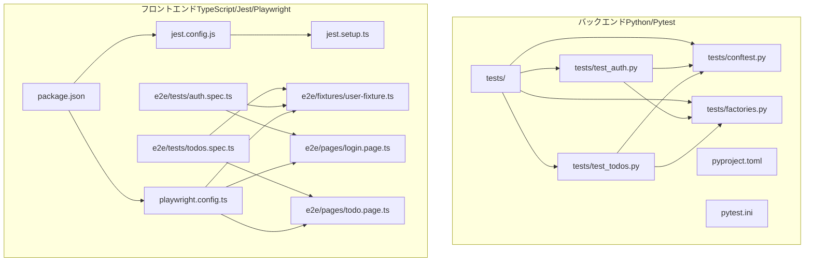
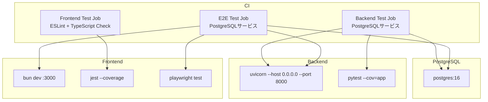
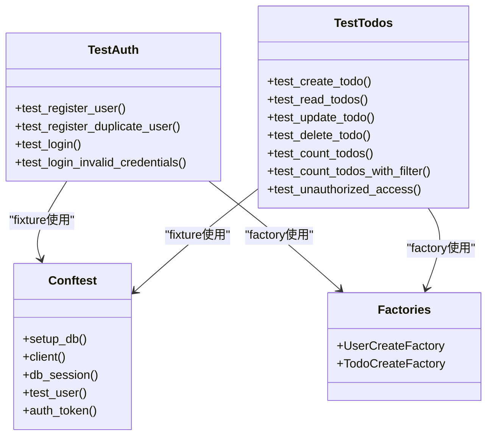
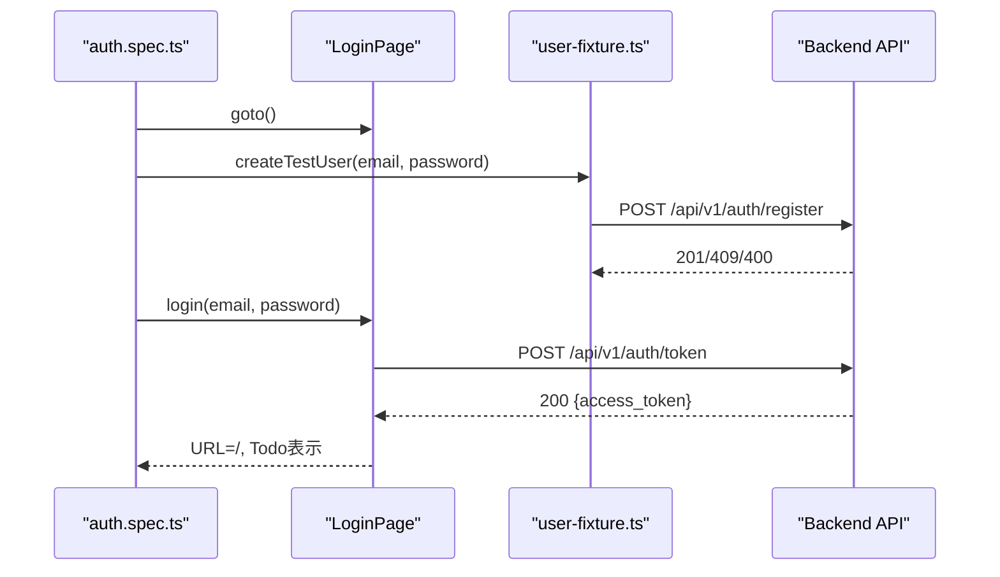
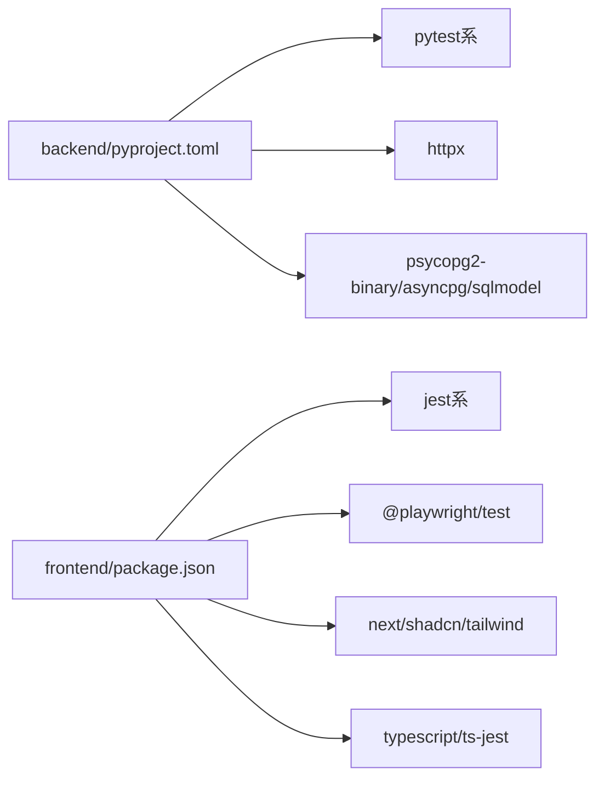

# テストの実行と問題解決

<cite>
**この文書で参照されるファイル**
- [README.md](file://README.md)
- [.github/workflows/ci.yml](file://.github/workflows/ci.yml)
- [.github/workflows/e2e-tests.yml](file://.github/workflows/e2e-tests.yml)
- [docker-compose.yml](file://docker-compose.yml)
- [backend/pyproject.toml](file://backend/pyproject.toml)
- [backend/pytest.ini](file://backend/pytest.ini)
- [backend/tests/conftest.py](file://backend/tests/conftest.py)
- [backend/tests/factories.py](file://backend/tests/factories.py)
- [backend/tests/test_auth.py](file://backend/tests/test_auth.py)
- [backend/tests/test_todos.py](file://backend/tests/test_todos.py)
- [frontend/package.json](file://frontend/package.json)
- [frontend/jest.config.js](file://frontend/jest.config.js)
- [frontend/jest.setup.ts](file://frontend/jest.setup.ts)
- [frontend/playwright.config.ts](file://frontend/playwright.config.ts)
- [frontend/e2e/fixtures/user-fixture.ts](file://frontend/e2e/fixtures/user-fixture.ts)
- [frontend/e2e/pages/login.page.ts](file://frontend/e2e/pages/login.page.ts)
- [frontend/e2e/pages/todo.page.ts](file://frontend/e2e/pages/todo.page.ts)
- [frontend/e2e/tests/auth.spec.ts](file://frontend/e2e/tests/auth.spec.ts)
- [frontend/e2e/tests/todos.spec.ts](file://frontend/e2e/tests/todos.spec.ts)
</cite>

## 目次
1. [はじめに](#はじめに)
2. [プロジェクト構造](#プロジェクト構造)
3. [コアコンポーネント](#コアコンポーネント)
4. [アーキテクチャ概要](#アーキテクチャ概要)
5. [詳細コンポーネント分析](#詳細コンポーネント分析)
6. [依存関係分析](#依存関係分析)
7. [パフォーマンス考慮事項](#パフォーマンス考慮事項)
8. [トラブルシューティングガイド](#トラブルシューティングガイド)
9. [結論](#結論)
10. [付録](#付録)

## はじめに
本ガイドでは、ユニットテスト（Pytest）とE2Eテスト（Playwright）の実行方法、テスト失敗時の問題解決手順、テスト環境のセットアップ、テストデータ管理方法について詳しく解説します。また、環境変数の不一致、データベースの状態、ネットワークエラーなどの一般的な失敗原因とその対処法、テストのデバッグ手法、CI/CDパイプラインでのテスト実行についても網羅的に説明します。

**更新** JestとPlaywrightの統合テスト、コードカバレッジの測定、テスト環境の設定が追加されました。

## プロジェクト構造
本プロジェクトはバックエンド（FastAPI）とフロントエンド（Next.js）の2つのテストスタックを持ちます。それぞれのテスト環境と実行方法は以下の通りです。

**図の出典**
- [backend/tests/conftest.py:1-81](file://backend/tests/conftest.py#L1-L81)
- [backend/tests/factories.py:1-48](file://backend/tests/factories.py#L1-L48)
- [backend/tests/test_auth.py:1-66](file://backend/tests/test_auth.py#L1-L66)
- [backend/tests/test_todos.py:1-151](file://backend/tests/test_todos.py#L1-L151)
- [backend/pyproject.toml:1-52](file://backend/pyproject.toml#L1-L52)
- [backend/pytest.ini:1-5](file://backend/pytest.ini#L1-L5)
- [frontend/package.json:1-65](file://frontend/package.json#L1-L65)
- [frontend/jest.config.js:1-31](file://frontend/jest.config.js#L1-L31)
- [frontend/jest.setup.ts:1-14](file://frontend/jest.setup.ts#L1-L14)
- [frontend/playwright.config.ts:1-66](file://frontend/playwright.config.ts#L1-L66)
- [frontend/e2e/fixtures/user-fixture.ts:1-87](file://frontend/e2e/fixtures/user-fixture.ts#L1-L87)
- [frontend/e2e/pages/login.page.ts:1-48](file://frontend/e2e/pages/login.page.ts#L1-L48)
- [frontend/e2e/pages/todo.page.ts:1-104](file://frontend/e2e/pages/todo.page.ts#L1-L104)
- [frontend/e2e/tests/auth.spec.ts:1-88](file://frontend/e2e/tests/auth.spec.ts#L1-L88)
- [frontend/e2e/tests/todos.spec.ts:1-192](file://frontend/e2e/tests/todos.spec.ts#L1-L192)

**節の出典**
- [README.md:143-215](file://README.md#L143-L215)
- [backend/pyproject.toml:37-52](file://backend/pyproject.toml#L37-L52)
- [backend/pytest.ini:1-5](file://backend/pytest.ini#L1-L5)
- [frontend/package.json:5-17](file://frontend/package.json#L5-L17)
- [frontend/jest.config.js:14-28](file://frontend/jest.config.js#L14-L28)
- [frontend/playwright.config.ts:7-66](file://frontend/playwright.config.ts#L7-L66)

## コアコンポーネント
- バックエンドテスト（Pytest）
  - 実行設定：asyncioモード自動、テストディレクトリ、Pythonパス
  - 依存：pytest、pytest-asyncio、httpx、polyfactory、psycopg2-binary
  - カバレッジ：appディレクトリをカバー対象、tests/migrationsを除外
  - 設定：fail_under=80、show_missing=true
- フロントエンドテスト（Jest）
  - 実行設定：jsdom環境、ts-jest変換、@/プレースホルダー設定
  - 依存：jest、@testing-library/react、jest-environment-jsdom
  - カバレッジ：srcディレクトリをカバー対象、layout.tsxと.d.tsを除外
  - 設定：branches=50、functions=50、lines=50、statements=50
- E2Eテスト（Playwright）
  - 実行設定：1並列、CI時は再試行2回、タイムアウト設定、トレース/スクリーンショット/ビデオ
  - サーバー起動：bun dev（3000）、webServer設定あり
  - E2Eコマンド：e2e、e2e:ui、e2e:headed、e2e:report

**節の出典**
- [backend/pyproject.toml:27-35](file://backend/pyproject.toml#L27-L35)
- [backend/pyproject.toml:38-52](file://backend/pyproject.toml#L38-L52)
- [backend/pytest.ini:1-5](file://backend/pytest.ini#L1-L5)
- [frontend/jest.config.js:14-28](file://frontend/jest.config.js#L14-L28)
- [frontend/package.json:5-17](file://frontend/package.json#L5-L17)
- [frontend/playwright.config.ts:7-66](file://frontend/playwright.config.ts#L7-L66)

## アーキテクチャ概要
テスト実行の全体像は以下の通りです。バックエンドはPostgreSQLをサービスとして起動し、フロントエンドはPlaywrightでChromiumを起動してE2Eテストを実施します。CIでは、PostgreSQLサービスを用意し、バックエンド/フロントエンドともに依存をインストール・マイグレーション・サーバー起動後にテストを実行します。

**図の出典**
- [.github/workflows/ci.yml:44-91](file://.github/workflows/ci.yml#L44-L91)
- [.github/workflows/ci.yml:117-144](file://.github/workflows/ci.yml#L117-L144)
- [.github/workflows/e2e-tests.yml:13-94](file://.github/workflows/e2e-tests.yml#L13-L94)
- [backend/pyproject.toml:7-25](file://backend/pyproject.toml#L7-L25)
- [frontend/package.json:5-17](file://frontend/package.json#L5-L17)

## 詳細コンポーネント分析

### バックエンド：Pytestによるユニットテスト
- 設定
  - asyncio_mode: auto
  - testpaths: tests
  - pythonpath: .
- 依存とカバレッジ
  - devグループ：pytest、pytest-asyncio、pytest-cov、httpx、polyfactory、psycopg2-binary
  - coverage：appをカバレッジ対象、tests/migrationsを除外
  - 設定：fail_under=80、show_missing=true
- 重要なテスト構成
  - conftest.py：レートリミット緩和、DBリセット、ASGIクライアント、DBセッション、テストユーザー、JWTトークン
  - factories.py：UserCreateFactory、TodoCreateFactory（Polyfactory）
  - test_auth.py：登録、重複登録、ログイン、無効資格情報
  - test_todos.py：作成、一覧、更新、削除、件数取得、認証なしアクセス

**図の出典**
- [backend/tests/conftest.py:42-81](file://backend/tests/conftest.py#L42-L81)
- [backend/tests/factories.py:7-48](file://backend/tests/factories.py#L7-L48)
- [backend/tests/test_auth.py:5-66](file://backend/tests/test_auth.py#L5-L66)
- [backend/tests/test_todos.py:5-151](file://backend/tests/test_todos.py#L5-L151)

**節の出典**
- [backend/pytest.ini:1-5](file://backend/pytest.ini#L1-L5)
- [backend/pyproject.toml:27-35](file://backend/pyproject.toml#L27-L35)
- [backend/pyproject.toml:38-52](file://backend/pyproject.toml#L38-L52)
- [backend/tests/conftest.py:1-81](file://backend/tests/conftest.py#L1-L81)
- [backend/tests/factories.py:1-48](file://backend/tests/factories.py#L1-L48)
- [backend/tests/test_auth.py:1-66](file://backend/tests/test_auth.py#L1-L66)
- [backend/tests/test_todos.py:1-151](file://backend/tests/test_todos.py#L1-L151)

### フロントエンド：Jestによるユニットテスト
- Jest設定
  - testEnvironment: jsdom
  - moduleNameMapper: '^@/(.*)$' → '<rootDir>/src/$1'
  - transform: ts-jest（tsconfig.json）
  - setupFilesAfterEnv: jest.setup.ts（Next.jsモック）
  - collectCoverageFrom: src/**/*.{ts,tsx}（layout.tsxと.d.tsを除外）
  - coverageThreshold: branches=50、functions=50、lines=50、statements=50
- Next.jsモック
  - next/navigationの全関数をjest.fn()で置き換え
  - useRouter: push、replace、prefetch、backをモック
  - usePathname、useSearchParamsを空関数で置き換え

**節の出典**
- [frontend/jest.config.js:1-31](file://frontend/jest.config.js#L1-L31)
- [frontend/jest.setup.ts:1-14](file://frontend/jest.setup.ts#L1-L14)

### E2Eテスト：Playwrightによるエンドツーエンドテスト
- Playwright設定
  - testDir: ./e2e/tests
  - fullyParallel: false（レートリミット対策）
  - forbidOnly: CI時のみ
  - retries: CI=2、ローカル=0
  - workers: 1（レートリミット対策）
  - reporter: html
  - timeout: 30秒、expect.timeout: 5秒
  - baseURL: NEXT_PUBLIC_API_URL（環境変数）または http://localhost:3000
  - trace/screenshot/video: 失敗時収集
  - webServer: bun dev（3000）、再利用可能
- Page Object
  - login.page.ts：ログインフォーム、エラーメッセージ、登録リンク
  - todo.page.ts：Todo入力、追加、検索、フィルター、ログアウト、リスト操作
- Fixtures
  - user-fixture.ts：テストユーザー作成（429リトライ）、ログイン、削除
- E2Eテスト構成
  - auth.spec.ts：ログインフォーム表示、認証エラー、登録ページ遷移、正常ログイン、バリデーションエラー
  - todos.spec.ts：Todo CRUD操作、検索、複数追加、ログアウト、認証なしリダイレクト

**図の出典**
- [frontend/e2e/tests/auth.spec.ts:47-63](file://frontend/e2e/tests/auth.spec.ts#L47-L63)
- [frontend/e2e/pages/login.page.ts:28-39](file://frontend/e2e/pages/login.page.ts#L28-L39)
- [frontend/e2e/fixtures/user-fixture.ts:6-46](file://frontend/e2e/fixtures/user-fixture.ts#L6-L46)

**節の出典**
- [frontend/playwright.config.ts:7-66](file://frontend/playwright.config.ts#L7-L66)
- [frontend/e2e/pages/login.page.ts:1-48](file://frontend/e2e/pages/login.page.ts#L1-L48)
- [frontend/e2e/pages/todo.page.ts:1-104](file://frontend/e2e/pages/todo.page.ts#L1-L104)
- [frontend/e2e/fixtures/user-fixture.ts:1-87](file://frontend/e2e/fixtures/user-fixture.ts#L1-L87)
- [frontend/e2e/tests/auth.spec.ts:1-88](file://frontend/e2e/tests/auth.spec.ts#L1-L88)
- [frontend/e2e/tests/todos.spec.ts:1-192](file://frontend/e2e/tests/todos.spec.ts#L1-L192)

## 依存関係分析
- バックエンド
  - pytest系：pytest、pytest-asyncio、pytest-cov
  - HTTP/DB：httpx、psycopg2-binary、asyncpg、sqlmodel
  - 開発ツール：ruff（lint/format）、alembic（マイグレーション）
- フロントエンド
  - Jest：jest、@testing-library/react、jest-environment-jsdom
  - Playwright：@playwright/test、browsersインストール
  - Next.js：next、@tanstack/react-query、shadcn/ui、Tailwind CSS
  - TypeScript：ts-jest、typescript

**図の出典**
- [backend/pyproject.toml:27-35](file://backend/pyproject.toml#L27-L35)
- [backend/pyproject.toml:7-25](file://backend/pyproject.toml#L7-L25)
- [frontend/package.json:18-55](file://frontend/package.json#L18-L55)

**節の出典**
- [backend/pyproject.toml:27-35](file://backend/pyproject.toml#L27-L35)
- [backend/pyproject.toml:7-25](file://backend/pyproject.toml#L7-L25)
- [frontend/package.json:18-55](file://frontend/package.json#L18-L55)

## パフォーマンス考慮事項
- Playwrightの並列実行
  - workers=1（レートリミット回避）、fullyParallel=false（競合防止）
  - CI時はretries=2で安定性向上
- DB接続
  - asyncpg（非同期）による接続プールの活用
  - テスト用DBリセットはgreenlet問題回避のため同期的に実施
- タイムアウト
  - 全体timeout: 30秒、expect: 5秒、actionTimeout: 0（無制限）
- Jestカバレッジ
  - collectCoverageFromで不要なファイルを除外
  - coverageThresholdで品質基準を設定

**節の出典**
- [frontend/playwright.config.ts:10-31](file://frontend/playwright.config.ts#L10-L31)
- [backend/tests/conftest.py:21-47](file://backend/tests/conftest.py#L21-L47)
- [frontend/jest.config.js:14-28](file://frontend/jest.config.js#L14-L28)

## トラブルシューティングガイド

### 1. 環境変数の不一致
- 症状
  - 認証エラー、DB接続エラー、API URLが見つからない
- 対処
  - BACKEND/FRONTEND共通：.env.exampleを元に.envを作成し、SECRET_KEY、DATABASE_URL、NEXT_PUBLIC_API_URLを確認
  - CI環境：ci.yml、e2e-tests.ymlで環境変数を明示的に設定
  - NEXT_PUBLIC_API_URLはfrontendのBASE_URLにも影響（playwright.config.ts）

**節の出典**
- [README.md:160-164](file://README.md#L160-L164)
- [.github/workflows/ci.yml:79-82](file://.github/workflows/ci.yml#L79-L82)
- [.github/workflows/e2e-tests.yml:89-94](file://.github/workflows/e2e-tests.yml#L89-L94)
- [frontend/playwright.config.ts:37-41](file://frontend/playwright.config.ts#L37-L41)

### 2. データベースの状態
- 症状
  - 重複登録エラー、認証エラー、テスト失敗
- 対処
  - conftest.pyのsetup_dbでDBを完全リセット（テーブル/型削除→再作成）
  - greenlet問題回避のため同期的にリセット（asyncio.to_thread経由）
  - alembicマイグレーション：ci.yml/e2e-tests.ymlでupgrade headを実施

**節の出典**
- [backend/tests/conftest.py:21-47](file://backend/tests/conftest.py#L21-L47)
- [.github/workflows/ci.yml:60-61](file://.github/workflows/ci.yml#L60-L61)
- [.github/workflows/e2e-tests.yml:60-61](file://.github/workflows/e2e-tests.yml#L60-L61)

### 3. ネットワークエラー（API/フロントエンド）
- 症状
  - curl 404/502、frontend起動待ちタイムアウト、BASE_URL未設定
- 対処
  - backend起動後、curlで/api/v1/docsが応答するまで待機（e2e-tests.yml）
  - frontend起動後、curlでlocalhost:3000が応答するまで待機
  - BASE_URLをhttp://localhost:3000に設定（playwright.config.ts）

**節の出典**
- [.github/workflows/e2e-tests.yml:68-86](file://.github/workflows/e2e-tests.yml#L68-L86)
- [frontend/playwright.config.ts:37-41](file://frontend/playwright.config.ts#L37-L41)

### 4. 認証・レートリミット
- 症状
  - 429 Too Many Requests、認証エラー
- 対処
  - conftest.pyで RATE_LIMIT_* を極端に緩和（テスト中）
  - user-fixture.tsで429発生時のリトライ（waitTime増加）
  - invalid credentialsテストで401を期待

**節の出典**
- [backend/tests/conftest.py:3-8](file://backend/tests/conftest.py#L3-L8)
- [frontend/e2e/fixtures/user-fixture.ts:25-42](file://frontend/e2e/fixtures/user-fixture.ts#L25-L42)
- [backend/tests/test_auth.py:57-66](file://backend/tests/test_auth.py#L57-L66)

### 5. E2Eテストのデバッグ
- 症状
  - 失敗時スクリーンショット/トレース/ビデオ収集が必要
- 対処
  - playwright.config.tsでtrace='on-first-retry'、screenshot='only-on-failure'、video='on-first-retry'
  - e2e:headed（GUIモード）で動作確認
  - e2e:reportでHTMLレポートを確認

**節の出典**
- [frontend/playwright.config.ts:40-47](file://frontend/playwright.config.ts#L40-L47)
- [frontend/package.json:13-16](file://frontend/package.json#L13-L16)

### 6. CI/CDでのテスト実行
- 症状
  - job失敗、レポートアップロード失敗、キャッシュ/依存不足
- 対処
  - Backend Test：PostgreSQLサービス、DATABASE_URL、SECRET_KEY、pytest --cov
  - Frontend Test：ESLint、TypeScriptチェック、jest --coverage
  - E2E Test：PostgreSQLサービス、alembic upgrade、backend/frontend起動、playwright test
  - artifacts：playwright-report、test-screenshotsをアップロード

**節の出典**
- [.github/workflows/ci.yml:40-91](file://.github/workflows/ci.yml#L40-L91)
- [.github/workflows/ci.yml:117-144](file://.github/workflows/ci.yml#L117-L144)
- [.github/workflows/e2e-tests.yml:88-111](file://.github/workflows/e2e-tests.yml#L88-L111)

### 7. コードカバレッジの問題
- 症状
  - coverageThresholdに引っかかる、カバレッジ率が低い
- 対処
  - jest.config.jsのcollectCoverageFromで不要なファイルを除外
  - collectCoverageFromにsrc/**/*.{ts,tsx}を指定し、layout.tsxと.d.tsを除外
  - coverageThresholdを適切な値（branches=50、functions=50、lines=50、statements=50）に設定

**節の出典**
- [frontend/jest.config.js:14-28](file://frontend/jest.config.js#L14-L28)

## 結論
本プロジェクトでは、Pytestによるバックエンドユニットテスト、Jestによるフロントエンドユニットテスト、PlaywrightによるフロントエンドE2Eテストを、PostgreSQLサービスを活用して安定的に実行しています。環境変数、DB状態、ネットワーク、レートリミットといった一般的な失敗要因に対して、設定ファイルとCIジョブで対策を施しています。テストのデバッグやCIでの継続的実行を円滑にするために、トレース/スクリーンショット/ビデオの収集、再試行、タイムアウト設定が適切に行われています。JestとPlaywrightの統合テスト、コードカバレッジの測定、テスト環境の設定が追加され、より包括的なテスト戦略が実現されています。

## 付録

### 1. テスト実行手順（ローカル）
- バックエンド（Pytest）
  - 依存：uv sync
  - 実行：uv run pytest -v
  - カバレッジ：uv run pytest --cov=app --cov-report=xml
- フロントエンド（Jest）
  - 依存：bun install
  - 実行：bun run test
  - カバレッジ：bun run test:coverage
- E2E（Playwright）
  - 依存：bun install、bun playwright install --with-deps chromium
  - 実行：bun run e2e
  - UIモード：bun run e2e:ui
  - headedモード：bun run e2e:headed
  - レポート：bun run e2e:report

**節の出典**
- [README.md:188-214](file://README.md#L188-L214)
- [backend/pyproject.toml:27-35](file://backend/pyproject.toml#L27-L35)
- [frontend/package.json:5-17](file://frontend/package.json#L5-L17)

### 2. Dockerでのテスト環境（オプション）
- docker-compose.ymlでPostgreSQL/Mailpitを起動
- backend/tests/conftest.pyでDBリセットロジックを使用

**節の出典**
- [docker-compose.yml:1-29](file://docker-compose.yml#L1-L29)
- [backend/tests/conftest.py:21-47](file://backend/tests/conftest.py#L21-L47)

### 3. Jest設定詳細
- testEnvironment: jsdom（DOM環境の提供）
- moduleNameMapper: '^@/(.*)$' → '<rootDir>/src/$1'（相対パス解決）
- transform: ts-jest（TypeScript変換）
- setupFilesAfterEnv: jest.setup.ts（Next.jsモック設定）
- collectCoverageFrom: src/**/*.{ts,tsx}（カバレッジ対象）
- coverageThreshold: 50%以上の品質基準

**節の出典**
- [frontend/jest.config.js:1-31](file://frontend/jest.config.js#L1-L31)
- [frontend/jest.setup.ts:1-14](file://frontend/jest.setup.ts#L1-L14)