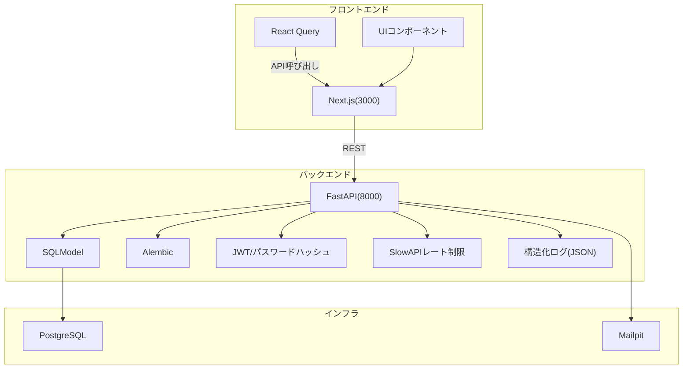
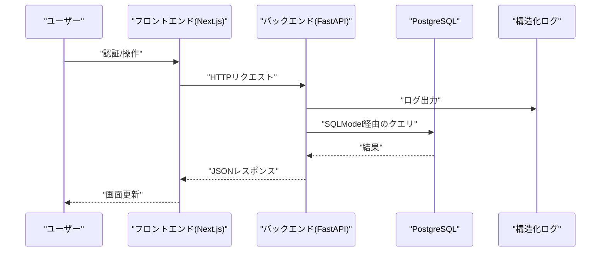
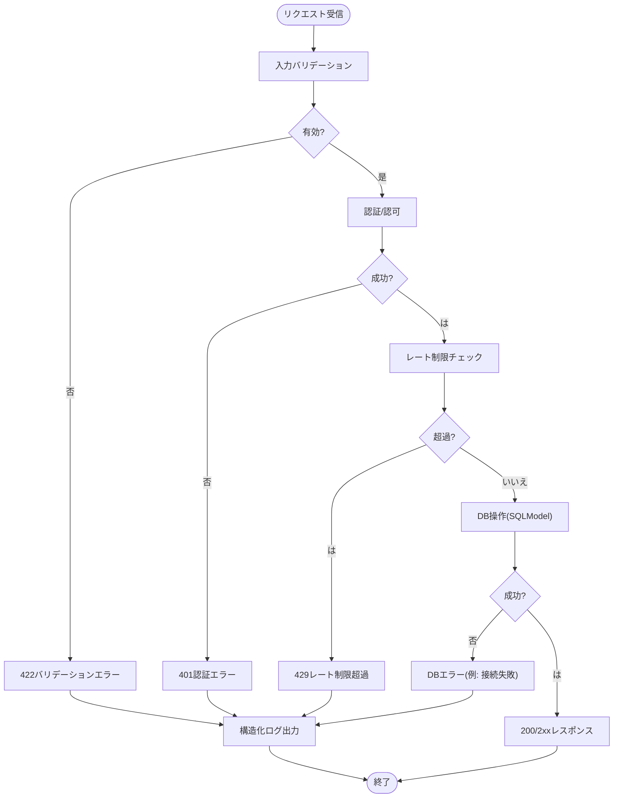
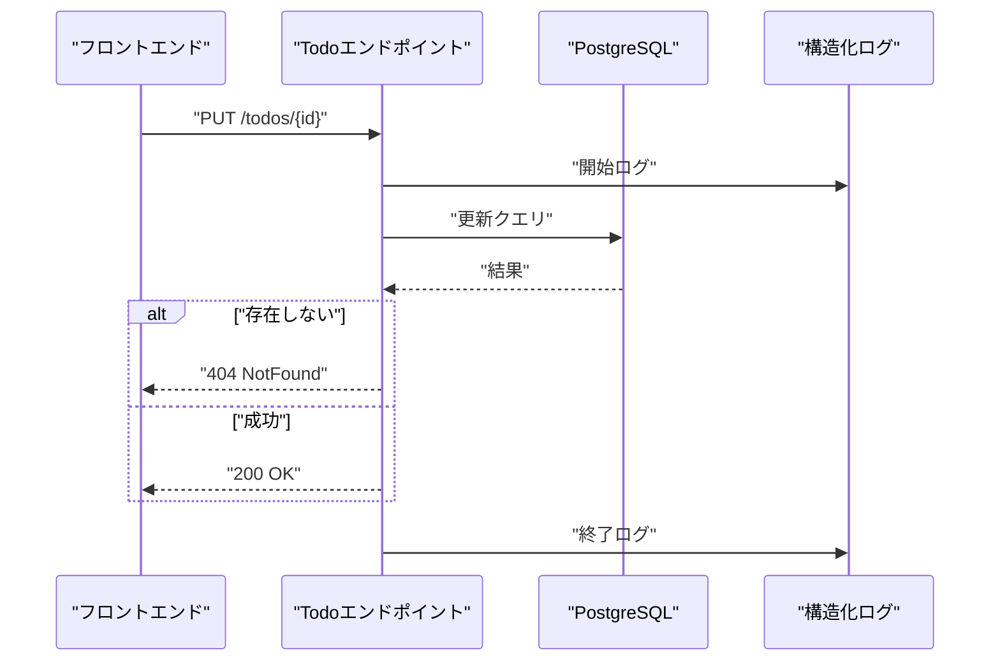
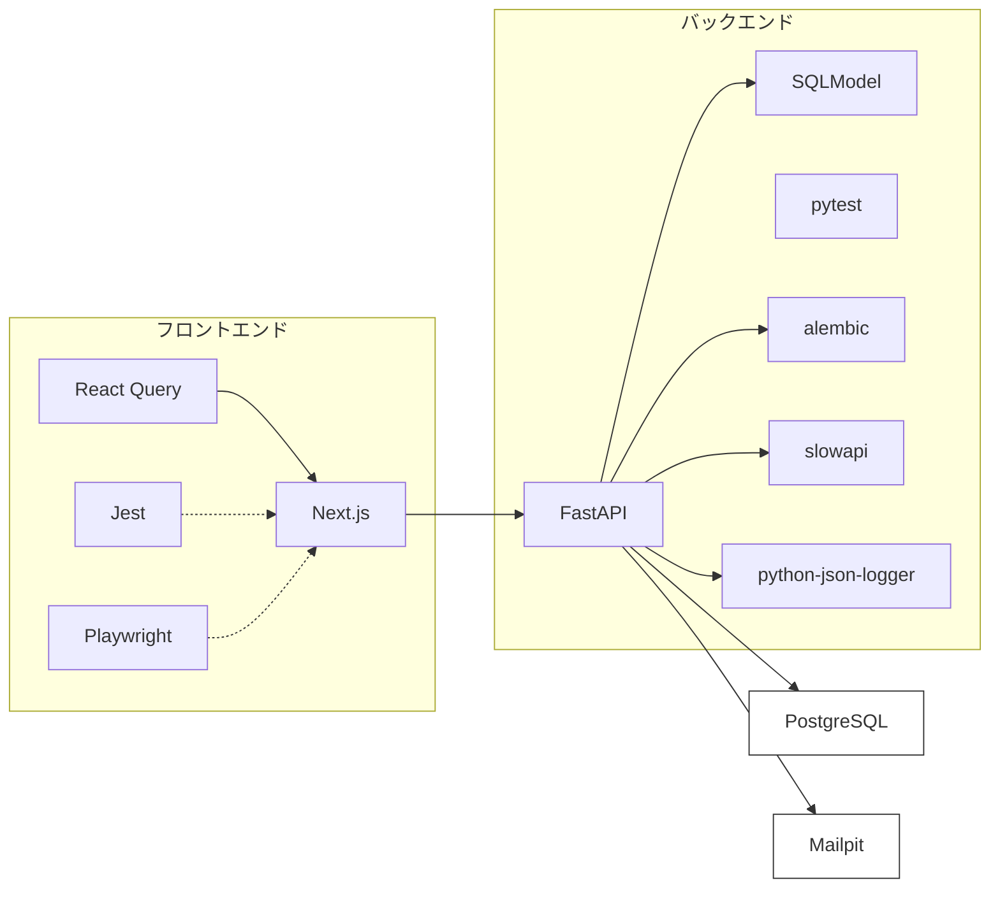
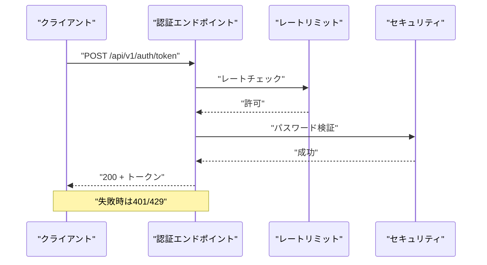
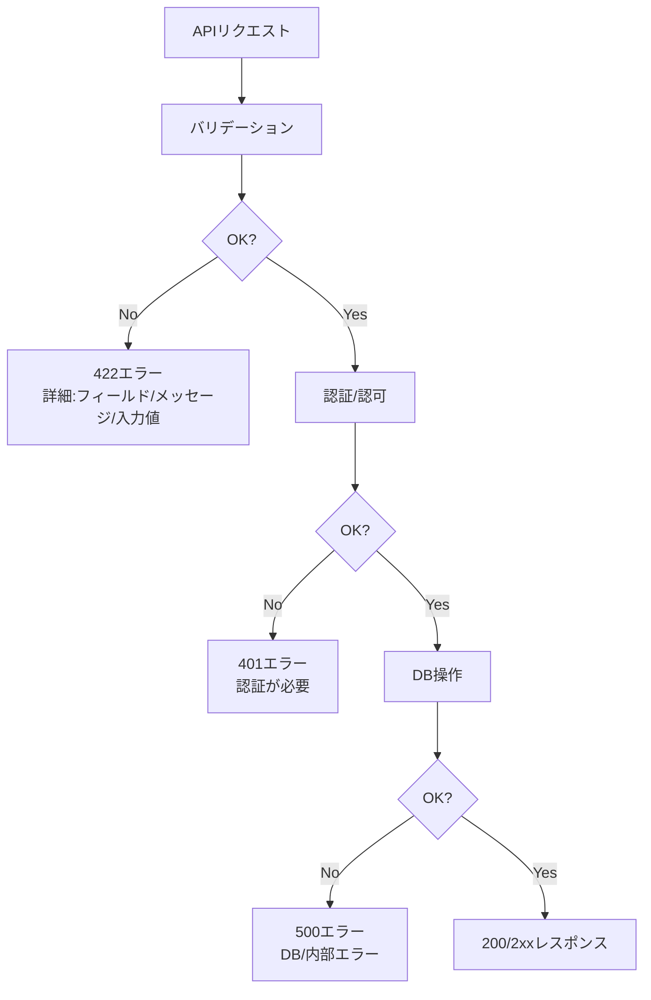
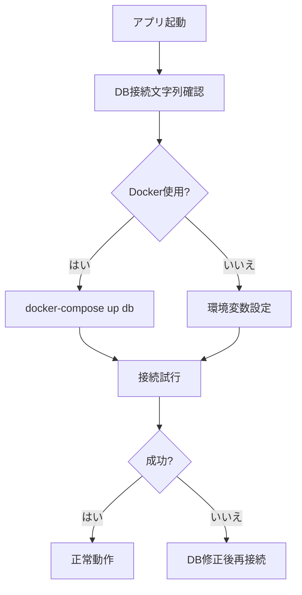

# トラブルシューティング

<cite>
**この文書で参照されるファイル**
- [README.md](file://README.md)
- [SPECIFICATION.md](file://SPECIFICATION.md)
- [docker-compose.yml](file://docker-compose.yml)
- [backend/pyproject.toml](file://backend/pyproject.toml)
- [frontend/package.json](file://frontend/package.json)
- [backend/app/core/logging.py](file://backend/app/core/logging.py)
- [backend/app/middleware/error_handler.py](file://backend/app/middleware/error_handler.py)
- [backend/app/api/api_v1/endpoints/auth.py](file://backend/app/api/api_v1/endpoints/auth.py)
- [backend/app/api/api_v1/endpoints/todos.py](file://backend/app/api/api_v1/endpoints/todos.py)
- [backend/app/core/db.py](file://backend/app/core/db.py)
- [frontend/src/hooks/useTodos.ts](file://frontend/src/hooks/useTodos.ts)
- [frontend/playwright.config.ts](file://frontend/playwright.config.ts)
- [frontend/jest.config.js](file://frontend/jest.config.js)
- [backend/tests/test_errors.py](file://backend/tests/test_errors.py)
- [backend/pytest.ini](file://backend/pytest.ini)
</cite>

## 目次
1. [はじめに](#はじめに)
2. [プロジェクト構造](#プロジェクト構造)
3. [コアコンポーネント](#コアコンポーネント)
4. [アーキテクチャ概観](#アーキテクチャ概観)
5. [詳細コンポーネント分析](#詳細コンポーネント分析)
6. [依存関係分析](#依存関係分析)
7. [パフォーマンス考慮事項](#パフォーマンス考慮事項)
8. [トラブルシューティングガイド](#トラブルシューティングガイド)
9. [結論](#結論)
10. [付録](#付録)

## はじめに
本ガイドでは、開発・運用中に遭遇する一般的な問題とその解決方法を提供します。認証エラー、APIエラー、データベース接続問題、フロントエンドのビルドエラーなどについて、ログの確認方法、デバッグ手法、テストの実行方法、開発ツールの使用法を詳しく解説します。

## プロジェクト構造
- バックエンド: FastAPI + SQLModel + uv + Alembic
- フロントエンド: Next.js(App Router) + TypeScript + TanStack React Query + shadcn/ui
- インフラ: Docker + Docker Compose(PostgreSQL, Mailpit)
- 開発ツール: Jujutsu(JJ), Just, Bun, uv, Playwright, Jest

**図の出典**
- [docker-compose.yml:1-29](file://docker-compose.yml#L1-L29)
- [backend/app/core/db.py:1-17](file://backend/app/core/db.py#L1-L17)
- [backend/app/core/logging.py:1-36](file://backend/app/core/logging.py#L1-L36)
- [backend/app/middleware/error_handler.py:1-149](file://backend/app/middleware/error_handler.py#L1-L149)

**節の出典**
- [README.md:143-242](file://README.md#L143-L242)
- [SPECIFICATION.md:99-147](file://SPECIFICATION.md#L99-L147)

## コアコンポーネント
- 認証: JWTアクセストークン発行、パスワードリセット、レート制限付きエンドポイント
- Todo管理: 一覧取得/作成/更新/削除、検索・フィルタ・ソート・ページネーション
- エラーハンドリング: 共通エラーレスポンス、バリデーションエラー、レート制限超過、HTTP例外
- 構造化ログ: JSONフォーマット、リクエスト/レスポンストラッキング、処理時間ヘッダー
- 開発ツール: Docker Compose、Just、Bun、uv、Playwright、Jest

**節の出典**
- [backend/app/api/api_v1/endpoints/auth.py:1-117](file://backend/app/api/api_v1/endpoints/auth.py#L1-L117)
- [backend/app/api/api_v1/endpoints/todos.py:1-102](file://backend/app/api/api_v1/endpoints/todos.py#L1-L102)
- [backend/app/middleware/error_handler.py:1-149](file://backend/app/middleware/error_handler.py#L1-L149)
- [backend/app/core/logging.py:1-36](file://backend/app/core/logging.py#L1-L36)

## アーキテクチャ概観

**図の出典**
- [backend/app/core/logging.py:1-36](file://backend/app/core/logging.py#L1-L36)
- [backend/app/core/db.py:1-17](file://backend/app/core/db.py#L1-L17)

## 詳細コンポーネント分析

### 認証エラーハンドリング
- 401認証エラー: 認証されていないアクセス、JWT未設定または期限切れ
- 422バリデーションエラー: 入力形式不正、Pydanticエラー詳細を含む
- 429レート制限超過: 認証系エンドポイントに過剰リクエスト
- 500内部エラー: 予期しない例外、スタックトレース付き

**図の出典**
- [backend/app/middleware/error_handler.py:15-149](file://backend/app/middleware/error_handler.py#L15-L149)
- [backend/app/api/api_v1/endpoints/auth.py:36-54](file://backend/app/api/api_v1/endpoints/auth.py#L36-L54)

**節の出典**
- [backend/app/middleware/error_handler.py:15-149](file://backend/app/middleware/error_handler.py#L15-L149)
- [backend/app/api/api_v1/endpoints/auth.py:19-54](file://backend/app/api/api_v1/endpoints/auth.py#L19-L54)

### Todo管理エラーハンドリング
- 404: 存在しないTodo更新/削除
- 422: Todo作成時の入力バリデーションエラー
- 500: DB接続異常やその他の予期しないエラー

**図の出典**
- [backend/app/api/api_v1/endpoints/todos.py:69-101](file://backend/app/api/api_v1/endpoints/todos.py#L69-L101)
- [backend/app/core/logging.py:1-36](file://backend/app/core/logging.py#L1-L36)

**節の出典**
- [backend/app/api/api_v1/endpoints/todos.py:13-101](file://backend/app/api/api_v1/endpoints/todos.py#L13-L101)

### 構造化ログの出力
- JSONフォーマット、asctime/name/levelname/message/filename/funcName/lineno
- INFOレベルで初期化完了ログ出力
- 各エラーハンドラでリクエストURL、メソッド、ステータスコードなどを出力

**節の出典**
- [backend/app/core/logging.py:6-36](file://backend/app/core/logging.py#L6-L36)
- [backend/app/middleware/error_handler.py:37-92](file://backend/app/middleware/error_handler.py#L37-L92)

## 依存関係分析
- バックエンド: FastAPI、SQLModel、uv、pytest、alembic、slowapi、python-json-logger
- フロントエンド: Next.js、TanStack React Query、Jest、Playwright、TailwindCSS
- インフラ: PostgreSQL、Mailpit(Docker Compose)

**図の出典**
- [backend/pyproject.toml:1-51](file://backend/pyproject.toml#L1-L51)
- [frontend/package.json:1-65](file://frontend/package.json#L1-L65)
- [docker-compose.yml:1-29](file://docker-compose.yml#L1-L29)

**節の出典**
- [backend/pyproject.toml:1-51](file://backend/pyproject.toml#L1-L51)
- [frontend/package.json:1-65](file://frontend/package.json#L1-L65)

## パフォーマンス考慮事項
- API応答時間: X-Process-Timeヘッダーで計測可能
- DB接続: 非同期接続(SQLAlchemy async)、コネクションプール設定
- レート制限: 認証系5rpm、デフォルト100rpm
- キャッシュ: React Queryによるクライアントサイドキャッシュ

[この節では具体的なファイル分析を行っていないため、節の出典はありません]

## トラブルシューティングガイド

### 認証エラー
症状
- 401認証が必要、またはトークンが無効
- /api/v1/auth/token で失敗

原因と対処
- トークンが期限切れまたは不正: 再ログイン
- Authorizationヘッダーが設定されていない: 有効なBearerトークンを設定
- 認証系エンドポイントへの過剰リクエスト: 待機後に再試行(429レート制限)

**図の出典**
- [backend/app/api/api_v1/endpoints/auth.py:36-54](file://backend/app/api/api_v1/endpoints/auth.py#L36-L54)
- [backend/app/middleware/error_handler.py:125-149](file://backend/app/middleware/error_handler.py#L125-L149)

**節の出典**
- [backend/app/api/api_v1/endpoints/auth.py:19-54](file://backend/app/api/api_v1/endpoints/auth.py#L19-L54)
- [backend/app/middleware/error_handler.py:107-122](file://backend/app/middleware/error_handler.py#L107-L122)

### APIエラー
症状
- 422バリデーションエラー: 入力形式不正
- 404: 存在しないリソース
- 500: 内部エラー

原因と対処
- 422: 必須フィールド不足、型不一致、範囲外値
- 404: ID不正、既に削除済み
- 500: DB接続失敗、未処理例外

**図の出典**
- [backend/app/middleware/error_handler.py:15-104](file://backend/app/middleware/error_handler.py#L15-L104)
- [backend/app/api/api_v1/endpoints/todos.py:69-101](file://backend/app/api/api_v1/endpoints/todos.py#L69-L101)

**節の出典**
- [backend/app/middleware/error_handler.py:15-104](file://backend/app/middleware/error_handler.py#L15-L104)
- [backend/tests/test_errors.py:22-37](file://backend/tests/test_errors.py#L22-L37)

### データベース接続問題
症状
- DB接続失敗、マイグレーションエラー、DBコネクション不足

原因と対処
- 環境変数: DATABASE_URL、ASYNC_DATABASE_URL
- Docker: dbコンテナが起動しているか、ポート5432が解放されているか
- 接続: SQLModel非同期エンジン、echo=is_developmentでデバッグ出力

**図の出典**
- [docker-compose.yml:1-29](file://docker-compose.yml#L1-L29)
- [backend/app/core/db.py:5-17](file://backend/app/core/db.py#L5-L17)

**節の出典**
- [docker-compose.yml:1-29](file://docker-compose.yml#L1-L29)
- [backend/app/core/db.py:1-17](file://backend/app/core/db.py#L1-L17)

### フロントエンドのビルドエラー
症状
- Next.jsビルドエラー、TypeScriptエラー、依存関係不足

原因と対処
- 依存関係: bun install
- TypeScript設定: tsconfig.json、jest.setup.ts
- ESLint: eslint.config.mjs
- 開発サーバー: bun dev

**節の出典**
- [frontend/package.json:1-65](file://frontend/package.json#L1-L65)
- [frontend/jest.config.js:1-31](file://frontend/jest.config.js#L1-L31)
- [README.md:202-214](file://README.md#L202-L214)

### ログの確認方法
- Docker: just logs で全サービスログを確認
- 構造化ログ: JSON形式、asctime/name/levelname/message/filename/funcName/lineno
- 処理時間: X-Process-Timeヘッダー

**節の出典**
- [README.md:176-179](file://README.md#L176-L179)
- [backend/app/core/logging.py:22-36](file://backend/app/core/logging.py#L22-L36)

### デバッグ手法
- バックエンド: uvicorn --reload でリロード付き開発サーバー
- APIドキュメント: http://localhost:8000/docs
- 構造化ログ: INFOレベル以上でリクエスト/レスポンストラッキング
- DB: echo=is_development でSQL出力

**節の出典**
- [README.md:196-200](file://README.md#L196-L200)
- [backend/app/core/logging.py:6-36](file://backend/app/core/logging.py#L6-L36)
- [backend/app/core/db.py:7-8](file://backend/app/core/db.py#L7-L8)

### テストの実行方法
- バックエンド: pytest(非同期対応)、pytest-cov、pytest-asyncio
- フロントエンド: Jest(単体テスト)、Playwright(統合テスト)
- E2E: playwright test、playwright test --ui、playwright show-report

**節の出典**
- [backend/pyproject.toml:27-35](file://backend/pyproject.toml#L27-L35)
- [backend/pytest.ini:1-5](file://backend/pytest.ini#L1-L5)
- [frontend/package.json:10-16](file://frontend/package.json#L10-L16)
- [frontend/playwright.config.ts:1-66](file://frontend/playwright.config.ts#L1-L66)
- [frontend/jest.config.js:1-31](file://frontend/jest.config.js#L1-L31)

### 開発ツールの使用法
- Docker/Docker Compose: just up/down/logs
- Jujutsu(JJ): jj init、jj branch、jj commit
- Bun: bun dev、bun install
- uv: uv sync、uv run uvicorn
- Just: justfileでタスク定義

**節の出典**
- [README.md:152-184](file://README.md#L152-L184)
- [SPECIFICATION.md:119-147](file://SPECIFICATION.md#L119-L147)

## 結論
本ガイドでは、認証エラー、APIエラー、データベース接続問題、フロントエンドビルドエラーのトラブルシューティング手順を、ログ確認、デバッグ手法、テスト実行、開発ツールの使用法とともに紹介しました。構造化ログと共通エラーハンドリングにより、問題の特定と修復を迅速に行うことができます。

## 付録
- APIエンドポイント一覧: 認証、Todo、ヘルスチェック
- 依存関係: backend/pyproject.toml、frontend/package.json
- インフラ: docker-compose.yml

**節の出典**
- [README.md:128-142](file://README.md#L128-L142)
- [backend/pyproject.toml:1-51](file://backend/pyproject.toml#L1-L51)
- [frontend/package.json:1-65](file://frontend/package.json#L1-L65)
- [docker-compose.yml:1-29](file://docker-compose.yml#L1-L29)