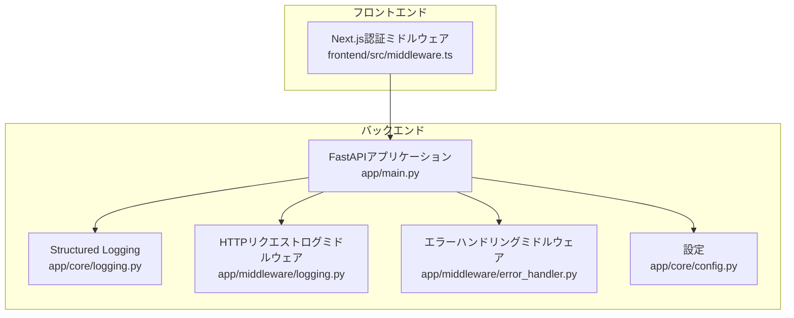
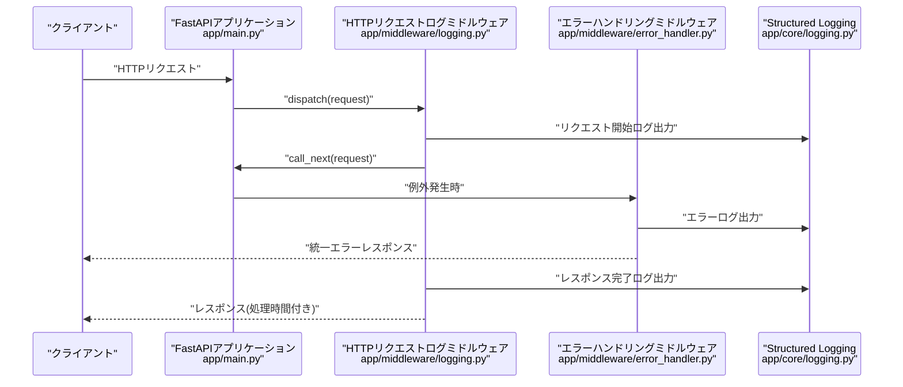
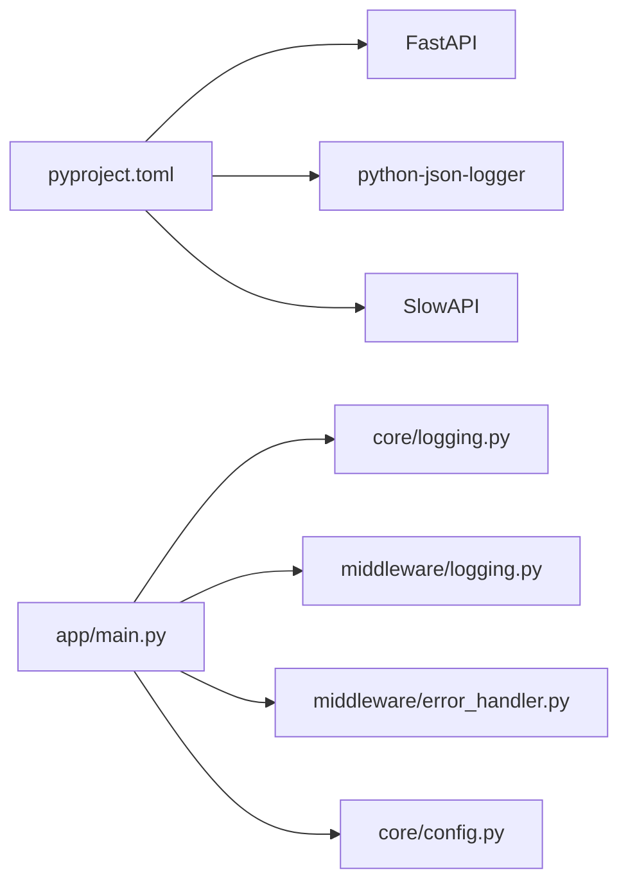
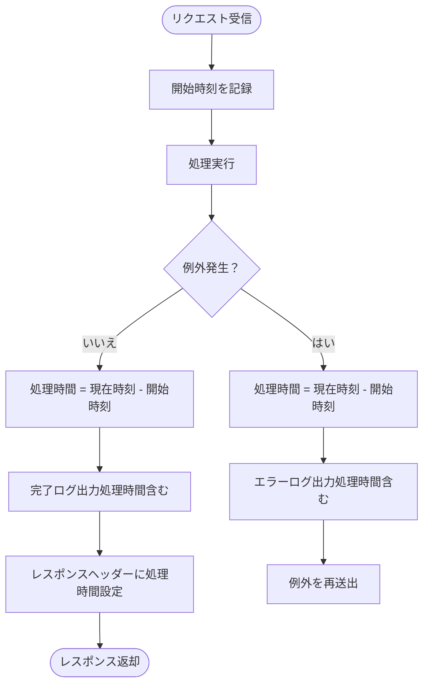

# ログの確認とデバッグ手法

<cite>
**本文で参照されるファイル**
- [backend/app/core/logging.py](file://backend/app/core/logging.py)
- [backend/app/middleware/logging.py](file://backend/app/middleware/logging.py)
- [backend/app/middleware/error_handler.py](file://backend/app/middleware/error_handler.py)
- [backend/app/main.py](file://backend/app/main.py)
- [backend/app/core/config.py](file://backend/app/core/config.py)
- [backend/pyproject.toml](file://backend/pyproject.toml)
- [frontend/src/middleware.ts](file://frontend/src/middleware.ts)
- [frontend/package.json](file://frontend/package.json)
</cite>

## 目次
1. [はじめに](#はじめに)
2. [プロジェクト構造](#プロジェクト構造)
3. [コアコンポーネント](#コアコンポーネント)
4. [アーキテクチャ概観](#アーキテクチャ概観)
5. [詳細コンポーネント解析](#詳細コンポーネント解析)
6. [依存関係分析](#依存関係分析)
7. [パフォーマンス考慮事項](#パフォーマンス考慮事項)
8. [トラブルシューティングガイド](#トラブルシューティングガイド)
9. [結論](#結論)
10. [付録](#付録)

## はじめに
本ドキュメントは、システムの動作確認と問題の特定に必要な「ログの確認方法」と「デバッグ手法」を、バックエンドのStructured Logging、フロントエンドのコンソールログ、APIリクエストのトレース、エラーハンドリングの確認手順について詳細に解説します。また、開発環境と本番環境でのログ設定の違い、パフォーマンスモニタリングのためのログ分析手法も含まれます。

## プロジェクト構造
本プロジェクトはバックエンド(FastAPI)とフロントエンド(Next.js)の2層構造です。バックエンドには、構造化ログ設定、HTTPリクエストログミドルウェア、エラーハンドリングミドルウェアが含まれています。フロントエンドには認証不要な公開パスを定義したミドルウェアがあります。

**図の出典**
- [backend/app/main.py:28-128](file://backend/app/main.py#L28-L128)
- [backend/app/core/logging.py:6-36](file://backend/app/core/logging.py#L6-L36)
- [backend/app/middleware/logging.py:10-67](file://backend/app/middleware/logging.py#L10-L67)
- [backend/app/middleware/error_handler.py:15-149](file://backend/app/middleware/error_handler.py#L15-L149)
- [backend/app/core/config.py:24-33](file://backend/app/core/config.py#L24-L33)
- [frontend/src/middleware.ts:7-34](file://frontend/src/middleware.ts#L7-L34)

**節の出典**
- [backend/app/main.py:28-128](file://backend/app/main.py#L28-L128)
- [backend/app/core/logging.py:6-36](file://backend/app/core/logging.py#L6-L36)
- [backend/app/middleware/logging.py:10-67](file://backend/app/middleware/logging.py#L10-L67)
- [backend/app/middleware/error_handler.py:15-149](file://backend/app/middleware/error_handler.py#L15-L149)
- [backend/app/core/config.py:24-33](file://backend/app/core/config.py#L24-L33)
- [frontend/src/middleware.ts:7-34](file://frontend/src/middleware.ts#L7-L34)

## コアコンポーネント
- 構造化ログ設定
  - 概要：標準出力へのJSONフォーマットのログ出力を設定し、アプリケーションロガーを初期化します。
  - 主な出力項目：タイムスタンプ、ロガー名、ログレベル、メッセージ、ファイル名、関数名、行番号、追加フィールド（例：ログレベル）。
  - 利用箇所：アプリケーション起動時に初期化され、HTTPリクエスト・レスポンス・エラー発生時のログにも使用されます。
  - 参考：[backend/app/core/logging.py:6-36](file://backend/app/core/logging.py#L6-L36)

- HTTPリクエストログミドルウェア
  - 概要：リクエスト開始時刻を計測し、リクエスト・レスポンス・エラー発生時のログを出力し、レスポンスヘッダーに処理時間を追加します。
  - 主な出力項目：メソッド、URL、クライアントホスト、ステータスコード、処理時間、エラー内容。
  - 参考：[backend/app/middleware/logging.py:10-67](file://backend/app/middleware/logging.py#L10-L67)

- エラーハンドリングミドルウェア
  - 概要：バリデーションエラー、HTTP例外、一般例外、レート制限超過に対して統一されたエラーレスポンスを返し、それぞれに対応するログを出力します。
  - 主な出力項目：URL、メソッド、ステータスコード、詳細エラー内容、クライアントホストなど。
  - 参考：[backend/app/middleware/error_handler.py:15-149](file://backend/app/middleware/error_handler.py#L15-L149)

- 設定
  - 概要：実行環境（開発/本番）やCORS、レート制限、メール設定、データベース接続文字列などを保持します。
  - 参考：[backend/app/core/config.py:24-33](file://backend/app/core/config.py#L24-L33)

**節の出典**
- [backend/app/core/logging.py:6-36](file://backend/app/core/logging.py#L6-L36)
- [backend/app/middleware/logging.py:10-67](file://backend/app/middleware/logging.py#L10-L67)
- [backend/app/middleware/error_handler.py:15-149](file://backend/app/middleware/error_handler.py#L15-L149)
- [backend/app/core/config.py:24-33](file://backend/app/core/config.py#L24-L33)

## アーキテクチャ概観
以下は、HTTPリクエストがバックエンドに到達し、ログ出力・エラーハンドリングがどのように行われるかを示すシーケンス図です。

**図の出典**
- [backend/app/main.py:117-118](file://backend/app/main.py#L117-L118)
- [backend/app/middleware/logging.py:15-66](file://backend/app/middleware/logging.py#L15-L66)
- [backend/app/middleware/error_handler.py:15-149](file://backend/app/middleware/error_handler.py#L15-L149)
- [backend/app/core/logging.py:6-36](file://backend/app/core/logging.py#L6-L36)

## 詳細コンポーネント解析

### バックエンド：Structured Logging
- 設定内容
  - ログ出力先：標準出力
  - フォーマット：JSON（python-json-logger）
  - 出力項目：asctime, name, levelname, message, filename, funcName, lineno および任意のextraフィールド
  - ログレベル：引数で指定（デフォルトはINFO）
  - アプリケーションロガー："app"という名前のロガーを設定し、初期化完了をログ出力
- 用途
  - HTTPリクエスト・レスポンス・エラー発生時のログ出力
  - アプリケーション起動/シャットダウン、ヘルスチェック結果などのシステムイベントログ
- 参考
  - [backend/app/core/logging.py:6-36](file://backend/app/core/logging.py#L6-L36)
  - [backend/app/main.py:28-47](file://backend/app/main.py#L28-L47)
  - [backend/app/main.py:158-165](file://backend/app/main.py#L158-L165)

**節の出典**
- [backend/app/core/logging.py:6-36](file://backend/app/core/logging.py#L6-L36)
- [backend/app/main.py:28-47](file://backend/app/main.py#L28-L47)
- [backend/app/main.py:158-165](file://backend/app/main.py#L158-L165)

### バックエンド：HTTPリクエストログミドルウェア
- 動作フロー
  - リクエスト受信：開始時刻を記録し、リクエスト開始ログを出力
  - 処理成功：レスポンスステータスと処理時間をログに出力し、レスポンスヘッダーに処理時間(X-Process-Time)を追加
  - 処理失敗：例外発生時、エラーログを出力（exc_info=trueでスタックトレースを含む）
- トレースポイント
  - "Request started"/"Request completed"/"Request failed"の3種類のログメッセージ
  - 処理時間の計測とレスポンスヘッダーへの埋め込み
- 参考
  - [backend/app/middleware/logging.py:15-66](file://backend/app/middleware/logging.py#L15-L66)

**節の出典**
- [backend/app/middleware/logging.py:15-66](file://backend/app/middleware/logging.py#L15-L66)

### バックエンド：エラーハンドリング
- 各種例外ハンドラ
  - バリデーションエラー：422、フィールドごとのエラー詳細を出力
  - HTTP例外：ステータスコードに応じた日本語メッセージを出力
  - 一般例外：500、内部エラーを出力（exc_info=true）
  - レート制限超過：429、リクエスト制限超過を出力
- 出力内容
  - URL、メソッド、ステータスコード、詳細エラー内容、クライアントホスト、エラー詳細リストなど
- 参考
  - [backend/app/middleware/error_handler.py:15-149](file://backend/app/middleware/error_handler.py#L15-L149)

**節の出典**
- [backend/app/middleware/error_handler.py:15-149](file://backend/app/middleware/error_handler.py#L15-L149)

### 設定：開発/本番環境の違い
- 環境識別
  - ENVIRONMENTで開発/本番を切り替え（is_development/is_productionプロパティ）
- CORS設定
  - 本番環境ではBACKEND_CORS_ORIGINSを環境変数で厳密に設定（未設定時はRuntimeError）
- その他の設定
  - DB接続文字列、レート制限、SMTP、メール送信元など
- 参考
  - [backend/app/core/config.py:24-33](file://backend/app/core/config.py#L24-L33)
  - [backend/app/main.py:106-107](file://backend/app/main.py#L106-L107)

**節の出典**
- [backend/app/core/config.py:24-33](file://backend/app/core/config.py#L24-L33)
- [backend/app/main.py:106-107](file://backend/app/main.py#L106-L107)

### フロントエンド：コンソールログと認証ミドルウェア
- 認証ミドルウェア
  - 認証不要な公開パス（例：ログイン/登録/パスワード再設定）を定義
  - トークン（CookieまたはlocalStorage）の有無でリダイレクト
  - 対象パスのマッチャー設定あり
- Next.jsの開発時コンソールログ
  - 開発サーバー起動時の標準出力（例：dev scripts）はブラウザコンソールに表示される場合があります
  - E2EテストやPlaywrightによる画面操作時のコンソール出力も確認対象
- 参考
  - [frontend/src/middleware.ts:7-34](file://frontend/src/middleware.ts#L7-L34)
  - [frontend/package.json:5-16](file://frontend/package.json#L5-L16)

**節の出典**
- [frontend/src/middleware.ts:7-34](file://frontend/src/middleware.ts#L7-L34)
- [frontend/package.json:5-16](file://frontend/package.json#L5-L16)

## 依存関係分析
- 外部依存
  - Structured Logging：python-json-logger
  - APIフレームワーク：FastAPI
  - レート制限：SlowAPI
- 内部依存
  - app/main.py が core/logging.py と middleware/logging.py、error_handler.py を使用
  - 設定は core/config.py から読み込まれる
- 参考
  - [backend/pyproject.toml:7-25](file://backend/pyproject.toml#L7-L25)
  - [backend/app/main.py:14-26](file://backend/app/main.py#L14-L26)

**図の出典**
- [backend/pyproject.toml:7-25](file://backend/pyproject.toml#L7-L25)
- [backend/app/main.py:14-26](file://backend/app/main.py#L14-L26)

**節の出典**
- [backend/pyproject.toml:7-25](file://backend/pyproject.toml#L7-L25)
- [backend/app/main.py:14-26](file://backend/app/main.py#L14-L26)

## パフォーマンス考慮事項
- 処理時間の監視
  - HTTPリクエストログミドルウェアで計測した処理時間をレスポンスヘッダー(X-Process-Time)に埋め込み、クライアント側で確認可能
  - 参考：[backend/app/middleware/logging.py:47-48](file://backend/app/middleware/logging.py#L47-L48)
- 処理時間の可視化フロー

**図の出典**
- [backend/app/middleware/logging.py:15-66](file://backend/app/middleware/logging.py#L15-L66)

## トラブルシューティングガイド

### 1) バックエンド：ログの確認方法
- 構造化ログの出力確認
  - 標準出力にJSON形式のログが出力されていることを確認
  - "Request started"/"Request completed"/"Request failed"の3種類のログメッセージを確認
  - 参考：[backend/app/middleware/logging.py:19-66](file://backend/app/middleware/logging.py#L19-L66)
- 特定のエラーのログ確認
  - 422/401/403/404/409/429/500などのステータスに対応するエラーハンドラのログを確認
  - 参考：[backend/app/middleware/error_handler.py:15-149](file://backend/app/middleware/error_handler.py#L15-L149)
- アプリケーションライフサイクルログ
  - 起動/シャットダウン、ヘルスチェック結果のログを確認
  - 参考：[backend/app/main.py:36-47](file://backend/app/main.py#L36-L47), [backend/app/main.py:158-165](file://backend/app/main.py#L158-L165)

**節の出典**
- [backend/app/middleware/logging.py:19-66](file://backend/app/middleware/logging.py#L19-L66)
- [backend/app/middleware/error_handler.py:15-149](file://backend/app/middleware/error_handler.py#L15-L149)
- [backend/app/main.py:36-47](file://backend/app/main.py#L36-L47)
- [backend/app/main.py:158-165](file://backend/app/main.py#L158-L165)

### 2) APIリクエストのトレース方法
- X-Process-Timeヘッダーの確認
  - HTTPレスポンスヘッダーに処理時間が含まれているか確認
  - 参考：[backend/app/middleware/logging.py:47-48](file://backend/app/middleware/logging.py#L47-L48)
- curl/ブラウザ開発者ツールでの確認
  - レスポンスヘッダーの確認、ネットワークパネルでの処理時間の可視化
- OpenAPI/Swagger経由での確認
  - Scalar経由でAPIドキュメントを開き、リクエスト/レスポンスを確認
  - 参考：[backend/app/main.py:120-126](file://backend/app/main.py#L120-L126)

**節の出典**
- [backend/app/middleware/logging.py:47-48](file://backend/app/middleware/logging.py#L47-L48)
- [backend/app/main.py:120-126](file://backend/app/main.py#L120-L126)

### 3) エラーハンドリングの確認手順
- 422バリデーションエラー
  - 入力データのフィールドごとのエラー詳細を確認
  - 参考：[backend/app/middleware/error_handler.py:15-49](file://backend/app/middleware/error_handler.py#L15-L49)
- 401/403/404/409/429/500
  - 各ステータスに対応するエラーメッセージと、ログ出力内容を確認
  - 参考：[backend/app/middleware/error_handler.py:52-149](file://backend/app/middleware/error_handler.py#L52-L149)
- 例外発生時のスタックトレース
  - exc_info=Trueにより、エラーログにスタックトレースが含まれる
  - 参考：[backend/app/middleware/logging.py:64](file://backend/app/middleware/logging.py#L64), [backend/app/middleware/error_handler.py:91](file://backend/app/middleware/error_handler.py#L91)

**節の出典**
- [backend/app/middleware/error_handler.py:15-49](file://backend/app/middleware/error_handler.py#L15-L49)
- [backend/app/middleware/error_handler.py:52-149](file://backend/app/middleware/error_handler.py#L52-L149)
- [backend/app/middleware/logging.py:64](file://backend/app/middleware/logging.py#L64)
- [backend/app/middleware/error_handler.py:91](file://backend/app/middleware/error_handler.py#L91)

### 4) 開発環境と本番環境でのログ設定の違い
- 環境識別
  - ENVIRONMENTで開発/本番を切り替え
  - 参考：[backend/app/core/config.py:24-33](file://backend/app/core/config.py#L24-L33)
- CORS設定
  - 本番環境ではBACKEND_CORS_ORIGINSを環境変数で厳密に設定
  - 未設定時はRuntimeError
  - 参考：[backend/app/main.py:106-107](file://backend/app/main.py#L106-L107)
- その他の設定
  - DB接続文字列、レート制限、SMTP、メール送信元などは環境変数から読み込まれる
  - 参考：[backend/app/core/config.py:44-83](file://backend/app/core/config.py#L44-L83)

**節の出典**
- [backend/app/core/config.py:24-33](file://backend/app/core/config.py#L24-L33)
- [backend/app/main.py:106-107](file://backend/app/main.py#L106-L107)
- [backend/app/core/config.py:44-83](file://backend/app/core/config.py#L44-L83)

### 5) フロントエンド：コンソールログの活用方法
- 開発時コンソールログ
  - Next.js devサーバー起動時の標準出力がブラウザコンソールに反映される可能性あり
  - 参考：[frontend/package.json:6](file://frontend/package.json#L6)
- E2Eテスト時のコンソール出力
  - Playwrightテスト実行時のコンソール出力もデバッグに役立つ
  - 参考：[frontend/package.json:13-16](file://frontend/package.json#L13-L16)
- 認証ミドルウェアの挙動
  - トークンの有無によるリダイレクト確認、公開パスのマッチャー設定
  - 参考：[frontend/src/middleware.ts:7-34](file://frontend/src/middleware.ts#L7-L34)

**節の出典**
- [frontend/package.json:6](file://frontend/package.json#L6)
- [frontend/package.json:13-16](file://frontend/package.json#L13-L16)
- [frontend/src/middleware.ts:7-34](file://frontend/src/middleware.ts#L7-L34)

## 結論
本プロジェクトでは、Structured LoggingによるJSON出力、HTTPリクエストログミドルウェア、エラーハンドリングミドルウェアを通じて、バックエンドの動作確認と問題の特定が効率的に行えます。また、フロントエンドのコンソールログと認証ミドルウェアの組み合わせにより、クライアント側の挙動も補完的に確認可能です。開発環境と本番環境では設定の違いに注意しながら、ログの出力内容とトレース方法を適切に活用してください。

## 付録

### A. APIリクエストのトレース手順（実践例）
- 手順
  1) curlまたはブラウザの開発者ツールでAPIリクエストを実行
  2) レスポンスヘッダーのX-Process-Timeを確認
  3) バックエンドのログで"Request started/completed/failed"を確認
  4) 必要に応じてエラーハンドラのログを確認
- 参考
  - [backend/app/middleware/logging.py:19-66](file://backend/app/middleware/logging.py#L19-L66)
  - [backend/app/middleware/error_handler.py:15-149](file://backend/app/middleware/error_handler.py#L15-L149)

**節の出典**
- [backend/app/middleware/logging.py:19-66](file://backend/app/middleware/logging.py#L19-L66)
- [backend/app/middleware/error_handler.py:15-149](file://backend/app/middleware/error_handler.py#L15-L149)