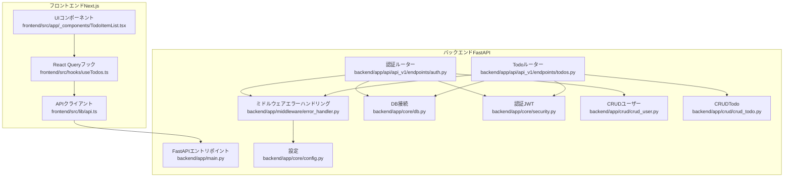
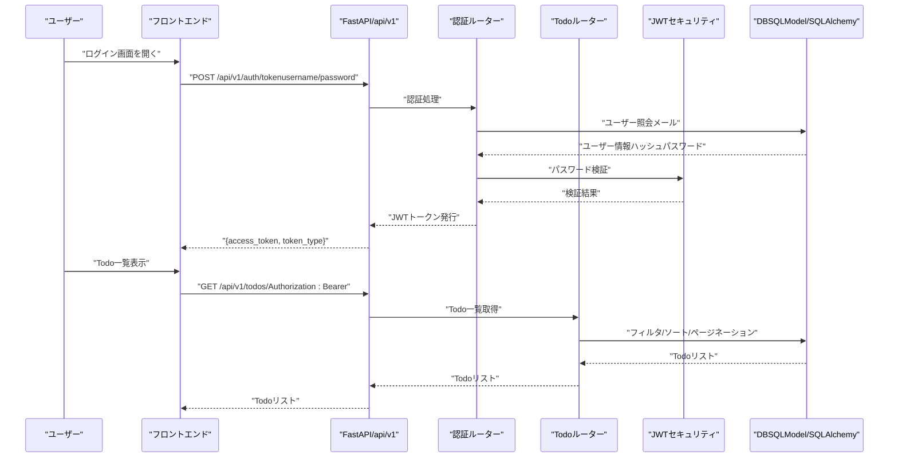
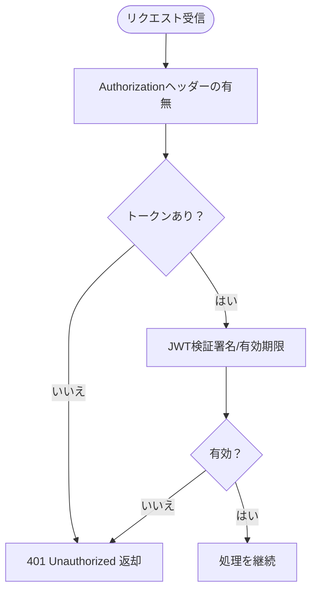
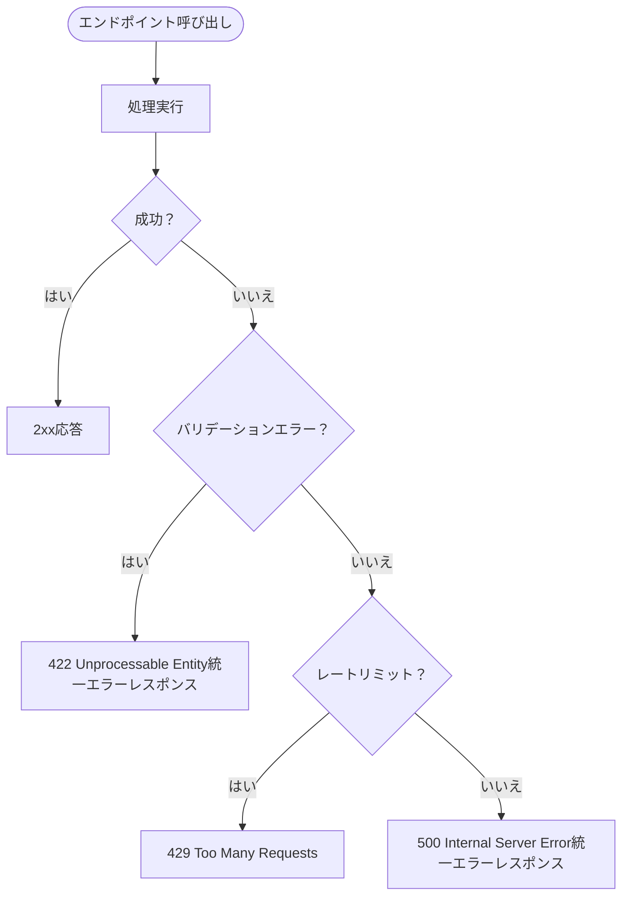
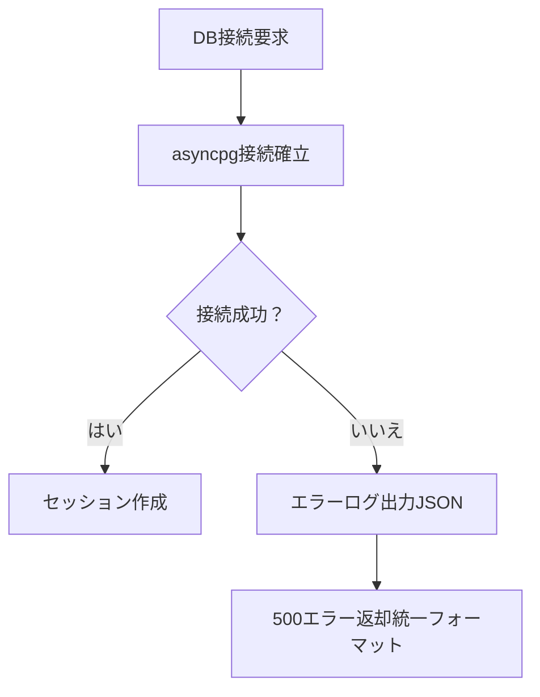
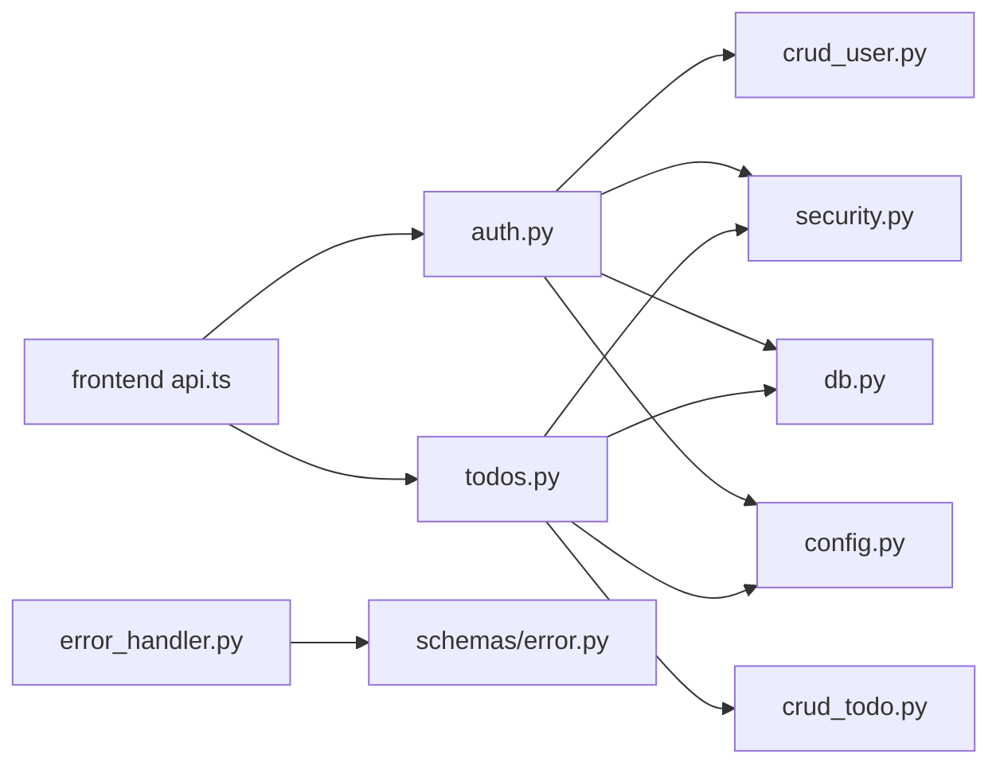

# 一般的な問題と解決法

<cite>
**本文で参照するファイル**   
- [README.md](file://README.md)
- [SPECIFICATION.md](file://SPECIFICATION.md)
- [backend/app/api/api_v1/endpoints/auth.py](file://backend/app/api/api_v1/endpoints/auth.py)
- [backend/app/api/api_v1/endpoints/todos.py](file://backend/app/api/api_v1/endpoints/todos.py)
- [backend/app/middleware/error_handler.py](file://backend/app/middleware/error_handler.py)
- [backend/app/core/db.py](file://backend/app/core/db.py)
- [backend/app/core/config.py](file://backend/app/core/config.py)
- [backend/app/core/security.py](file://backend/app/core/security.py)
- [backend/app/crud/crud_user.py](file://backend/app/crud/crud_user.py)
- [backend/app/crud/crud_todo.py](file://backend/app/crud/crud_todo.py)
- [backend/app/schemas/error.py](file://backend/app/schemas/error.py)
- [backend/tests/test_auth.py](file://backend/tests/test_auth.py)
- [backend/tests/test_todos.py](file://backend/tests/test_todos.py)
- [frontend/src/lib/api.ts](file://frontend/src/lib/api.ts)
- [frontend/src/hooks/useTodos.ts](file://frontend/src/hooks/useTodos.ts)
- [frontend/src/app/_components/TodoItemList.tsx](file://frontend/src/app/_components/TodoItemList.tsx)
- [frontend/playwright.config.ts](file://frontend/playwright.config.ts)
</cite>

## 目次
1. [はじめに](#はじめに)
2. [プロジェクト構造](#プロジェクト構造)
3. [コアコンポーネント](#コアコンポーネント)
4. [アーキテクチャ概観](#アーキテクチャ概観)
5. [詳細コンポーネント分析](#詳細コンポーネント分析)
6. [依存関係分析](#依存関係分析)
7. [パフォーマンスに関する考慮](#パフォーマンスに関する考慮)
8. [トラブルシューティングガイド](#トラブルシューティングガイド)
9. [結論](#結論)
10. [付録](#付録)

## はじめに
本ガイドは、開発・運用中に頻繁に発生する一般的な問題とその解決法を網羅的に解説します。認証エラー（401/403）、APIエラー（500/422）、データベース接続エラー、フロントエンドビルドエラー、テスト失敗などを具体的なエラーメッセージとともに、原因分析、再現手順、修正方法を詳細に示します。また、開発効率を向上させるための実践的なヒントも提供します。

## プロジェクト構造
本プロジェクトは、バックエンド（FastAPI）とフロントエンド（Next.js）の2層構造であり、Docker/Docker Composeによるコンテナ化が前提となっています。APIはバージョン付き（/api/v1）で提供されており、認証（JWT）、Todo管理（CRUD）、エラーハンドリング（統一エラーレスポンス）が実装されています。

**図の出典**
- [backend/app/api/api_v1/endpoints/auth.py](file://backend/app/api/api_v1/endpoints/auth.py)
- [backend/app/api/api_v1/endpoints/todos.py](file://backend/app/api/api_v1/endpoints/todos.py)
- [backend/app/middleware/error_handler.py](file://backend/app/middleware/error_handler.py)
- [backend/app/core/db.py](file://backend/app/core/db.py)
- [backend/app/core/config.py](file://backend/app/core/config.py)
- [backend/app/core/security.py](file://backend/app/core/security.py)
- [backend/app/crud/crud_user.py](file://backend/app/crud/crud_user.py)
- [backend/app/crud/crud_todo.py](file://backend/app/crud/crud_todo.py)
- [frontend/src/lib/api.ts](file://frontend/src/lib/api.ts)
- [frontend/src/hooks/useTodos.ts](file://frontend/src/hooks/useTodos.ts)
- [frontend/src/app/_components/TodoItemList.tsx](file://frontend/src/app/_components/TodoItemList.tsx)

**節の出典**
- [README.md:143-215](file://README.md#L143-L215)
- [SPECIFICATION.md:119-147](file://SPECIFICATION.md#L119-L147)

## コアコンポーネント
- 認証エンドポイント（/api/v1/auth/*）：登録、ログイン、パスワードリセット（トークン発行・検証）を提供。
- Todoエンドポイント（/api/v1/todos/*）：TodoのCRUD、件数取得、フィルタ・ソート・ページネーション。
- エラーハンドリング：422（リクエストバリデーションエラー）、401/403（認証・権限エラー）、429（レートリミット）、500（内部エラー）を統一レスポンスで返却。
- DB接続：非同期SQLAlchemy（asyncpg）による接続管理。
- 認証（JWT）：シークレットキー、アルゴリズム、有効期限設定。
- APIクライアント（フロント）：認証ヘッダーの自動付与、エラーメッセージのToast通知。

**節の出典**
- [backend/app/api/api_v1/endpoints/auth.py:19-117](file://backend/app/api/api_v1/endpoints/auth.py#L19-L117)
- [backend/app/api/api_v1/endpoints/todos.py:13-102](file://backend/app/api/api_v1/endpoints/todos.py#L13-L102)
- [backend/app/middleware/error_handler.py:15-149](file://backend/app/middleware/error_handler.py#L15-L149)
- [backend/app/core/db.py:1-17](file://backend/app/core/db.py#L1-L17)
- [backend/app/core/security.py:1-35](file://backend/app/core/security.py#L1-L35)
- [frontend/src/lib/api.ts:25-113](file://frontend/src/lib/api.ts#L25-L113)

## アーキテクチャ概観
以下は、認証フローとTodo CRUDフローの概観です。

**図の出典**
- [README.md:106-127](file://README.md#L106-L127)
- [backend/app/api/api_v1/endpoints/auth.py:36-54](file://backend/app/api/api_v1/endpoints/auth.py#L36-L54)
- [backend/app/api/api_v1/endpoints/todos.py:32-57](file://backend/app/api/api_v1/endpoints/todos.py#L32-L57)
- [backend/app/core/security.py:17-35](file://backend/app/core/security.py#L17-L35)
- [backend/app/crud/crud_user.py:8-27](file://backend/app/crud/crud_user.py#L8-L27)
- [backend/app/crud/crud_todo.py:10-71](file://backend/app/crud/crud_todo.py#L10-L71)

## 詳細コンポーネント分析

### 認証エラー（401/403）
- 401（認証エラー）：有効なJWTトークンがない、または認証情報が不正（メール/パスワード）。
- 403（権限エラー）：認可ロジックによりアクセスが拒否されるケース（本プロジェクトでは認証エラーとして401が主）。
- 429（レートリミット）：認証系エンドポイントに対するリクエスト制限超過。

**図の出典**
- [backend/app/api/api_v1/endpoints/auth.py:43-49](file://backend/app/api/api_v1/endpoints/auth.py#L43-L49)
- [backend/app/middleware/error_handler.py:107-122](file://backend/app/middleware/error_handler.py#L107-L122)
- [backend/app/core/security.py:29-35](file://backend/app/core/security.py#L29-L35)

**節の出典**
- [backend/app/api/api_v1/endpoints/auth.py:43-49](file://backend/app/api/api_v1/endpoints/auth.py#L43-L49)
- [backend/tests/test_auth.py:58-66](file://backend/tests/test_auth.py#L58-L66)
- [frontend/src/lib/api.ts:64-104](file://frontend/src/lib/api.ts#L64-L104)

### APIエラー（500/422）
- 500（内部エラー）：予期しない例外発生（DB接続異常、業務ロジックエラーなど）。
- 422（バリデーションエラー）：リクエストスキーマ違反（Pydantic）。

**図の出典**
- [backend/app/middleware/error_handler.py:15-149](file://backend/app/middleware/error_handler.py#L15-L149)
- [backend/app/schemas/error.py:5-23](file://backend/app/schemas/error.py#L5-L23)

**節の出典**
- [backend/app/middleware/error_handler.py:15-149](file://backend/app/middleware/error_handler.py#L15-L149)
- [backend/app/schemas/error.py:5-23](file://backend/app/schemas/error.py#L5-L23)

### データベース接続エラー
- 症状：DB接続失敗、コネクションタイムアウト、マイグレーション未適用。
- 原因：接続文字列不正、DBサービス未起動、ネットワーク問題、環境変数誤り。
- 対策：設定値確認（DATABASE_URL/POSTGRES_*）、DB起動確認、docker-compose up、alembic migrate。

**図の出典**
- [backend/app/core/db.py:1-17](file://backend/app/core/db.py#L1-L17)
- [backend/app/middleware/error_handler.py:84-104](file://backend/app/middleware/error_handler.py#L84-L104)

**節の出典**
- [backend/app/core/db.py:1-17](file://backend/app/core/db.py#L1-L17)
- [backend/app/core/config.py:44-48](file://backend/app/core/config.py#L44-L48)

### フロントエンドビルドエラー
- 症状：TypeScriptエラー、依存パッケージ不足、環境変数未設定。
- 原因：bun install未実施、NEXT_PUBLIC_API_URL未設定、型定義不足。
- 対策：bun install、.env.exampleを元に.env作成、NEXT_PUBLIC_API_URLを確認。

**節の出典**
- [frontend/src/lib/api.ts:3](file://frontend/src/lib/api.ts#L3)
- [README.md:186-214](file://README.md#L186-L214)

### テスト失敗
- 症状：認証エラー（401）、認可エラー（401）、Todo操作失敗。
- 原因：認証トークン未設定、DB初期化不足、クエリパラメータ不正。
- 対策：テスト前準備（DB初期化、ユーザー登録、認証トークン取得）、クエリパラメータの整合性確認。

**節の出典**
- [backend/tests/test_auth.py:5-66](file://backend/tests/test_auth.py#L5-L66)
- [backend/tests/test_todos.py:5-151](file://backend/tests/test_todos.py#L5-L151)

## 依存関係分析
- 認証系：auth.py → crud_user.py → db.py → config.py
- Todo系：todos.py → crud_todo.py → db.py → config.py
- エラーハンドリング：error_handler.py → schemas/error.py
- フロント：api.ts → backend（/api/v1）

**図の出典**
- [backend/app/api/api_v1/endpoints/auth.py](file://backend/app/api/api_v1/endpoints/auth.py)
- [backend/app/api/api_v1/endpoints/todos.py](file://backend/app/api/api_v1/endpoints/todos.py)
- [backend/app/crud/crud_user.py](file://backend/app/crud/crud_user.py)
- [backend/app/crud/crud_todo.py](file://backend/app/crud/crud_todo.py)
- [backend/app/core/security.py](file://backend/app/core/security.py)
- [backend/app/core/db.py](file://backend/app/core/db.py)
- [backend/app/core/config.py](file://backend/app/core/config.py)
- [backend/app/middleware/error_handler.py](file://backend/app/middleware/error_handler.py)
- [backend/app/schemas/error.py](file://backend/app/schemas/error.py)
- [frontend/src/lib/api.ts](file://frontend/src/lib/api.ts)

## パフォーマンスに関する考慮
- APIのレスポンスタイム監視：X-Process-Timeヘッダー（設定例）。
- DBクエリのオーダー条件：Todo一覧のソート（created_at/priority/due_date）に注意。
- 一括取得時のページネーション：limit上限（100）を守ることでDB負荷軽減。
- 画像や静的リソース：CDN利用、キャッシュヘッダー設定。

[この節は一般的なパフォーマンス指針を示すため、特定ファイルの引用は不要]

## トラブルシューティングガイド

### 認証エラー（401）
- 再現手順
  - 未認証でTodo一覧を取得
  - 無効なメール/パスワードでログイン
- 原因
  - Authorizationヘッダーなし
  - JWTの有効期限切れている
  - DBにユーザーが存在しない
- 修正方法
  - トークンを取得し、Authorization: Bearer に設定
  - トークンの有効期限内にリクエスト
  - 事前にユーザー登録を実施

**節の出典**
- [backend/tests/test_todos.py:147-151](file://backend/tests/test_todos.py#L147-L151)
- [backend/tests/test_auth.py:58-66](file://backend/tests/test_auth.py#L58-L66)
- [frontend/src/lib/api.ts:64-104](file://frontend/src/lib/api.ts#L64-L104)

### 認証エラー（403）
- 現状：本プロジェクトでは認可エラー（403）は未実装。認証エラー（401）として扱われる。
- 対策：カスタム認可ロジックを追加し、403を返すようにする。

[この節は現状の実装に基づく記述のため、特定ファイルの引用は不要]

### APIエラー（422）
- 再現手順
  - Todo作成時に必須フィールドを省略
  - 不正なenum値を指定
- 原因
  - Pydanticスキーマ違反
- 修正方法
  - 必須フィールドを埋める
  - enum値を許容範囲内に修正

**節の出典**
- [backend/app/middleware/error_handler.py:15-49](file://backend/app/middleware/error_handler.py#L15-L49)

### APIエラー（500）
- 再現手順
  - DB接続が失敗
  - 未処理例外が発生
- 原因
  - DBサービス未起動
  - 認証トークンの署名検証失敗
- 修正方法
  - DBサービスの起動確認
  - 環境変数（SECRET_KEY）の確認

**節の出典**
- [backend/app/middleware/error_handler.py:84-104](file://backend/app/middleware/error_handler.py#L84-L104)
- [backend/app/core/config.py:51-53](file://backend/app/core/config.py#L51-L53)

### APIエラー（429）
- 再現手順
  - 認証系エンドポイントを短時間に多数リクエスト
- 原因
  - RATE_LIMIT_*設定によるリクエスト制限
- 修正方法
  - 待機時間を設け、リクエストを間引く
  - 環境変数でレートリミットを調整

**節の出典**
- [backend/app/middleware/error_handler.py:125-149](file://backend/app/middleware/error_handler.py#L125-L149)
- [backend/app/core/config.py:62-67](file://backend/app/core/config.py#L62-L67)

### DB接続エラー
- 再現手順
  - DATABASE_URLが空、または不正
  - DBサービスが起動していない
- 原因
  - 環境変数の誤り
  - docker-composeでDBコンテナが起動していない
- 修正方法
  - .envに正しい接続情報を設定
  - docker-compose up --build でDBを起動

**節の出典**
- [backend/app/core/db.py:1-17](file://backend/app/core/db.py#L1-L17)
- [backend/app/core/config.py:44-48](file://backend/app/core/config.py#L44-L48)

### フロントエンドビルドエラー
- 再現手順
  - bun install未実施
  - NEXT_PUBLIC_API_URL未設定
- 原因
  - 依存パッケージ不足
  - 環境変数未設定
- 修正方法
  - bun installを実施
  - .env.exampleを元に.envを作成し、NEXT_PUBLIC_API_URLを設定

**節の出典**
- [frontend/src/lib/api.ts:3](file://frontend/src/lib/api.ts#L3)
- [README.md:186-214](file://README.md#L186-L214)

### E2Eテスト失敗
- 再現手順
  - 起動中のFrontendが存在しない
  - テスト実行時のレートリミット
- 原因
  - webServer設定（bun dev）が失敗
  - workers=1でテストが遅延
- 修正方法
  - bun devが正常に起動しているか確認
  - playwright.config.tsのworkersを調整

**節の出典**
- [frontend/playwright.config.ts:59-66](file://frontend/playwright.config.ts#L59-L66)

## 結論
本ガイドでは、認証エラー（401/403）、APIエラー（500/422）、DB接続エラー、フロントエンドビルドエラー、テスト失敗といった代表的な問題について、原因分析・再現手順・修正方法を示しました。エラーハンドリング（422/401/403/429/500）の統一レスポンス、JWT認証、DB接続設定、フロントエンドAPIクライアントの使い方を理解することで、開発効率と運用の安定性が向上します。

## 付録
- 開発・運用のヒント
  - 環境変数：.env.exampleを元に.envを作成し、DATABASE_URL、SECRET_KEY、SMTP_*、FRONTEND_URLを設定。
  - Docker：just upで一括起動、just logsでコンテナログ確認。
  - テスト：pytest、Playwright（E2E）を併用し、レートリミットに配慮した設定に留意。

**節の出典**
- [README.md:152-185](file://README.md#L152-L185)
- [SPECIFICATION.md:119-147](file://SPECIFICATION.md#L119-L147)