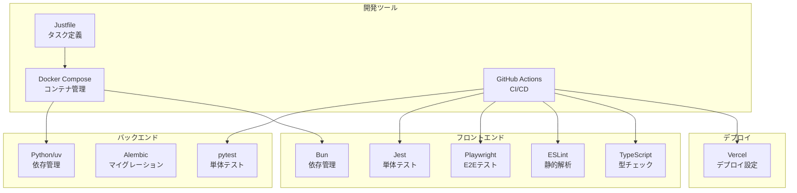
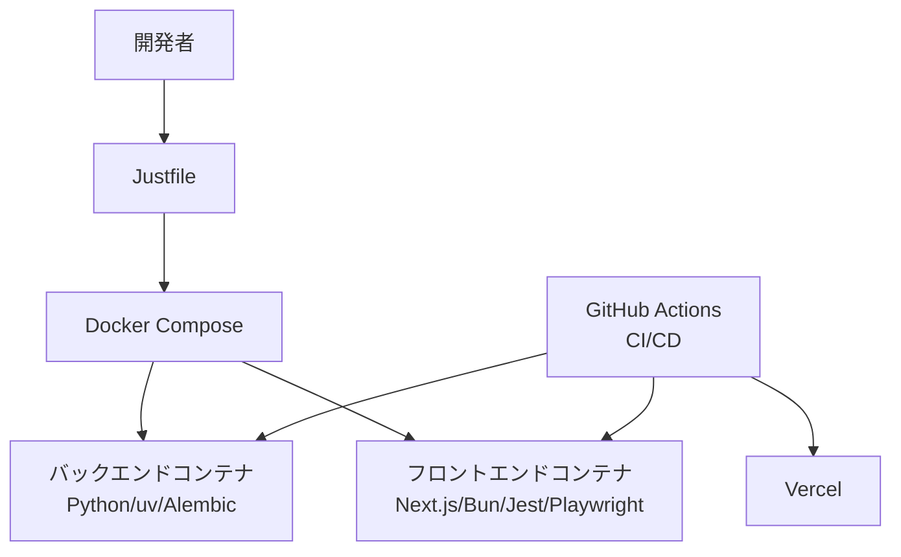
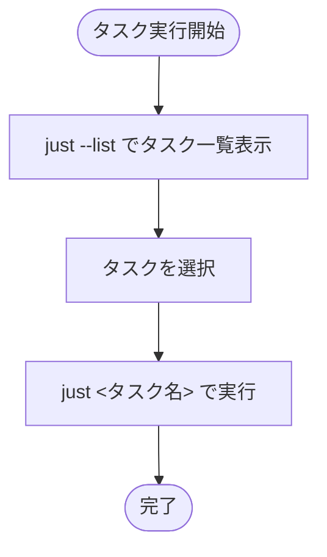
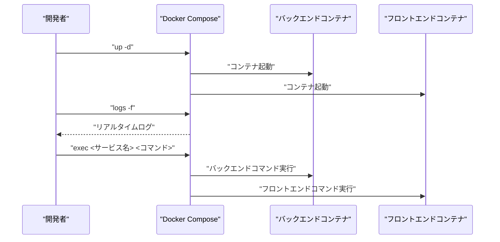
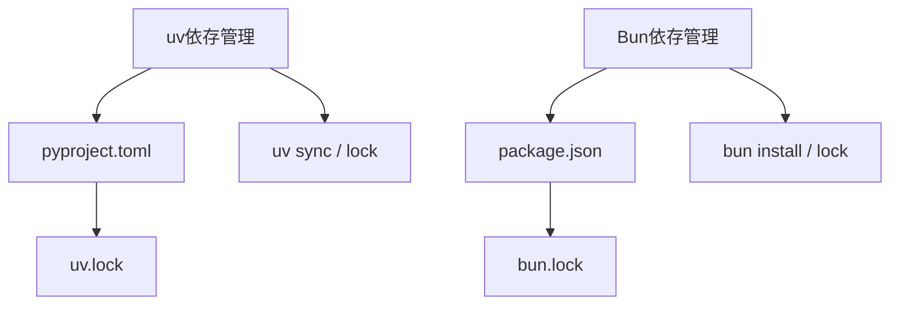
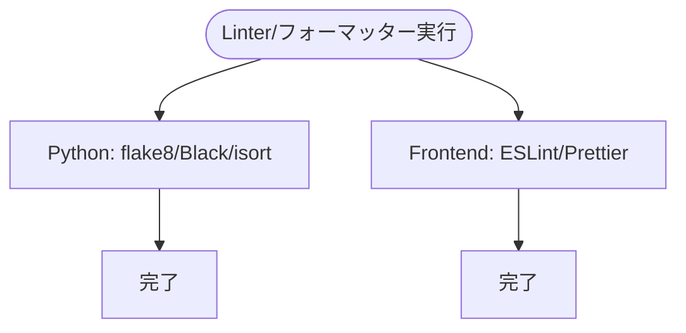
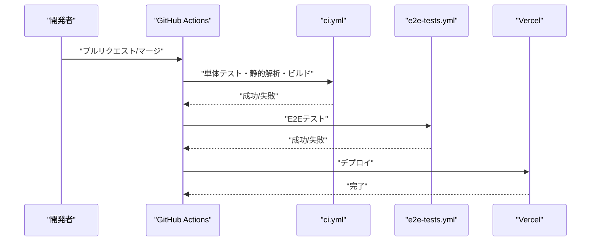
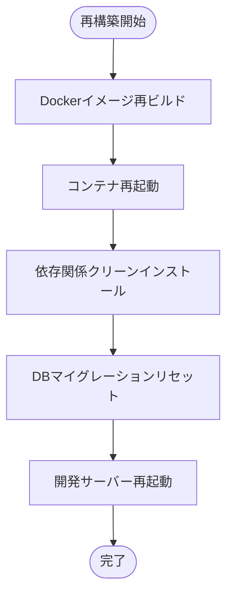
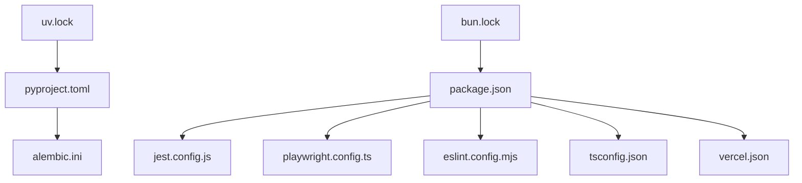

# 開発ツールの使用法

<cite>
**この文書で参照されるファイル**
- [justfile](file://justfile)
- [docker-compose.yml](file://docker-compose.yml)
- [.github/workflows/ci.yml](file://.github/workflows/ci.yml)
- [.github/workflows/e2e-tests.yml](file://.github/workflows/e2e-tests.yml)
- [backend/pyproject.toml](file://backend/pyproject.toml)
- [backend/uv.lock](file://backend/uv.lock)
- [frontend/package.json](file://frontend/package.json)
- [frontend/bun.lock](file://frontend/bun.lock)
- [backend/alembic.ini](file://backend/alembic.ini)
- [backend/pytest.ini](file://backend/pytest.ini)
- [frontend/jest.config.js](file://frontend/jest.config.js)
- [frontend/jest.setup.ts](file://frontend/jest.setup.ts)
- [frontend/playwright.config.ts](file://frontend/playwright.config.ts)
- [frontend/eslint.config.mjs](file://frontend/eslint.config.mjs)
- [frontend/tsconfig.json](file://frontend/tsconfig.json)
- [frontend/postcss.config.mjs](file://frontend/postcss.config.mjs)
- [frontend/components.json](file://frontend/components.json)
- [frontend/vercel.json](file://frontend/vercel.json)
- [frontend/next.config.ts](file://frontend/next.config.ts)
- [backend/main.py](file://backend/main.py)
- [frontend/src/app/layout.tsx](file://frontend/src/app/layout.tsx)
- [backend/tests/test_auth.py](file://backend/tests/test_auth.py)
- [backend/tests/test_todos.py](file://backend/tests/test_todos.py)
- [backend/tests/test_errors.py](file://backend/tests/test_errors.py)
- [backend/tests/test_password_reset.py](file://backend/tests/test_password_reset.py)
- [frontend/e2e/tests/auth.spec.ts](file://frontend/e2e/tests/auth.spec.ts)
- [frontend/e2e/tests/todos.spec.ts](file://frontend/e2e/tests/todos.spec.ts)
- [frontend/e2e/pages/login.page.ts](file://frontend/e2e/pages/login.page.ts)
- [frontend/e2e/pages/todo.page.ts](file://frontend/e2e/pages/todo.page.ts)
- [frontend/e2e/fixtures/user-fixture.ts](file://frontend/e2e/fixtures/user-fixture.ts)
</cite>

## 目次
1. [はじめに](#はじめに)
2. [プロジェクト構造](#プロジェクト構造)
3. [コアコンポーネント](#コアコンポーネント)
4. [アーキテクチャ概観](#アーキテクチャ概観)
5. [詳細なコンポーネント分析](#詳細なコンポーネン分析)
6. [依存関係分析](#依存関係分析)
7. [パフォーマンスに関する考慮事項](#パフォーマンスに関する考慮事項)
8. [トラブルシューティングガイド](#トラブルシューティングガイド)
9. [結論](#結論)
10. [付録](#付録)

## はじめに
本ドキュメントは、開発に必要な各種ツールの使用方法とトラブルシューティングを解説するものです。対象となる内容には、Justfileのタスク実行方法、Dockerコンテナの管理手順、依存関係のインストールと更新方法、Linterとフォーマッターの実行手順、CI/CDパイプラインの確認方法が含まれます。また、開発ツールのバージョン管理、設定ファイルの確認方法、開発環境の再構築手順も網羅的に記載しています。

## プロジェクト構造
本プロジェクトは、バックエンド（Python/uv/Alembic）とフロントエンド（Next.js/Bun/Jest/Playwright）の2つの主要なコンポーネントから成り立ち、Dockerコンテナによる一貫した開発環境を提供しています。CI/CDパイプラインはGitHub Actionsで定義されており、単体テスト、統合・E2Eテスト、静的解析、ビルド・デプロイフローが自動化されています。

**図の出典**
- [justfile](file://justfile)
- [docker-compose.yml](file://docker-compose.yml)
- [.github/workflows/ci.yml](file://.github/workflows/ci.yml)
- [.github/workflows/e2e-tests.yml](file://.github/workflows/e2e-tests.yml)
- [backend/pyproject.toml](file://backend/pyproject.toml)
- [backend/uv.lock](file://backend/uv.lock)
- [frontend/package.json](file://frontend/package.json)
- [frontend/bun.lock](file://frontend/bun.lock)
- [backend/alembic.ini](file://backend/alembic.ini)
- [backend/pytest.ini](file://backend/pytest.ini)
- [frontend/jest.config.js](file://frontend/jest.config.js)
- [frontend/jest.setup.ts](file://frontend/jest.setup.ts)
- [frontend/playwright.config.ts](file://frontend/playwright.config.ts)
- [frontend/eslint.config.mjs](file://frontend/eslint.config.mjs)
- [frontend/tsconfig.json](file://frontend/tsconfig.json)
- [frontend/postcss.config.mjs](file://frontend/postcss.config.mjs)
- [frontend/components.json](file://frontend/components.json)
- [frontend/vercel.json](file://frontend/vercel.json)
- [frontend/next.config.ts](file://frontend/next.config.ts)

**節の出典**
- [justfile](file://justfile)
- [docker-compose.yml](file://docker-compose.yml)
- [.github/workflows/ci.yml](file://.github/workflows/ci.yml)
- [.github/workflows/e2e-tests.yml](file://.github/workflows/e2e-tests.yml)

## コアコンポーネント
- Justfile：開発タスク（ビルド、テスト、マイグレーション、Linter実行など）を一元管理し、開発効率を向上させるためのタスクランナーです。
- Docker Compose：バックエンド（Python/uv）とフロントエンド（Next.js/Bun）のコンテナを統合して起動し、依存関係や共有ネットワークを管理します。
- GitHub Actions：CI/CDパイプラインとして、プルリクエストやマージ時に自動テスト、静的解析、ビルド、デプロイを実行します。
- 設定ファイル群：各ツールの設定（pyproject.toml、package.json、tsconfig.json、jest.config.js、playwright.config.ts、eslint.config.mjs、alembic.ini、vercel.jsonなど）が存在し、開発・テスト・デプロイの動作を制御します。

**節の出典**
- [justfile](file://justfile)
- [docker-compose.yml](file://docker-compose.yml)
- [.github/workflows/ci.yml](file://.github/workflows/ci.yml)
- [.github/workflows/e2e-tests.yml](file://.github/workflows/e2e-tests.yml)
- [backend/pyproject.toml](file://backend/pyproject.toml)
- [frontend/package.json](file://frontend/package.json)
- [frontend/tsconfig.json](file://frontend/tsconfig.json)
- [frontend/jest.config.js](file://frontend/jest.config.js)
- [frontend/playwright.config.ts](file://frontend/playwright.config.ts)
- [frontend/eslint.config.mjs](file://frontend/eslint.config.mjs)
- [backend/alembic.ini](file://backend/alembic.ini)
- [frontend/vercel.json](file://frontend/vercel.json)

## アーキテクチャ概観
開発環境の全体像は以下の通りです。開発者は、Justfileを通じてDockerコンテナ内のツールを操作し、CI/CDパイプラインで品質保証とデプロイを自動化します。

**図の出典**
- [justfile](file://justfile)
- [docker-compose.yml](file://docker-compose.yml)
- [.github/workflows/ci.yml](file://.github/workflows/ci.yml)
- [.github/workflows/e2e-tests.yml](file://.github/workflows/e2e-tests.yml)
- [frontend/vercel.json](file://frontend/vercel.json)

## 詳細なコンポーネント分析

### Justfileのタスク実行方法
- タスクの確認：ターミナルで「just --list」または「just -l」を実行し、定義されているタスクの一覧を表示します。
- 特定タスクの実行：「just <タスク名>」でタスクを実行します。例：「just dev」で開発サーバーを起動、「just test」でテストを実行、「just lint」で静的解析を実行します。
- タスクの追加・編集：[justfile](file://justfile)を編集することで、新しいタスクを追加したり既存タスクをカスタマイズしたりできます。

**図の出典**
- [justfile](file://justfile)

**節の出典**
- [justfile](file://justfile)

### Dockerコンテナの管理手順
- 全コンテナの起動：「docker compose up -d」でバックエンドとフロントエンドのコンテナを非同期で起動します。
- 特定コンテナの起動：「docker compose up -d backend」や「docker compose up -d frontend」で個別に起動します。
- コンテナの停止：「docker compose down」で停止し、不要なネットワークやボリュームを削除します。
- コンテナの再起動：「docker compose restart <サービス名>」で特定サービスを再起動します。
- ログの確認：「docker compose logs -f <サービス名>」でリアルタイムログを確認します。
- コンテナ内での作業：「docker compose exec <サービス名> <コマンド>」でコンテナ内で任意のコマンドを実行できます。

**図の出典**
- [docker-compose.yml](file://docker-compose.yml)

**節の出典**
- [docker-compose.yml](file://docker-compose.yml)

### 依存関係のインストールと更新方法
- Python（uv）：バックエンドの依存関係はuvを使用し、[backend/pyproject.toml](file://backend/pyproject.toml)に基づいてインストールされます。ロックファイル[backend/uv.lock](file://backend/uv.lock)によりバージョンが固定されています。
- Node.js（Bun）：フロントエンドの依存関係はBunを使用し、[frontend/package.json](file://frontend/package.json)に基づいてインストールされます。ロックファイル[frontend/bun.lock](file://frontend/bun.lock)によりバージョンが固定されています。
- 依存関係の更新：uvの場合は「just uv sync」、Bunの場合は「just bun install」で更新を適用します。ロックファイルの更新が必要な場合は「just uv lock」や「just bun lock」を実行します。

**図の出典**
- [backend/pyproject.toml](file://backend/pyproject.toml)
- [backend/uv.lock](file://backend/uv.lock)
- [frontend/package.json](file://frontend/package.json)
- [frontend/bun.lock](file://frontend/bun.lock)

**節の出典**
- [backend/pyproject.toml](file://backend/pyproject.toml)
- [backend/uv.lock](file://backend/uv.lock)
- [frontend/package.json](file://frontend/package.json)
- [frontend/bun.lock](file://frontend/bun.lock)

### Linterとフォーマッターの実行手順
- Python（flake8/Black/isort）：「just lint」で静的解析とフォーマットを実行します。設定は[backend/pyproject.toml](file://backend/pyproject.toml)に定義されています。
- TypeScript/JavaScript（ESLint/Prettier）：「just lint-fe」で静的解析とフォーマットを実行します。設定は[frontend/eslint.config.mjs](file://frontend/eslint.config.mjs)、[frontend/tsconfig.json](file://frontend/tsconfig.json)、[frontend/postcss.config.mjs](file://frontend/postcss.config.mjs)、[frontend/components.json](file://frontend/components.json)に定義されています。
- 自動フォーマット：「just fmt」でPython、フロントエンド共にフォーマットを適用します。

**図の出典**
- [backend/pyproject.toml](file://backend/pyproject.toml)
- [frontend/eslint.config.mjs](file://frontend/eslint.config.mjs)
- [frontend/tsconfig.json](file://frontend/tsconfig.json)
- [frontend/postcss.config.mjs](file://frontend/postcss.config.mjs)
- [frontend/components.json](file://frontend/components.json)

**節の出典**
- [backend/pyproject.toml](file://backend/pyproject.toml)
- [frontend/eslint.config.mjs](file://frontend/eslint.config.mjs)
- [frontend/tsconfig.json](file://frontend/tsconfig.json)
- [frontend/postcss.config.mjs](file://frontend/postcss.config.mjs)
- [frontend/components.json](file://frontend/components.json)

### CI/CDパイプラインの確認方法
- 単体テスト・静的解析・ビルド：[.github/workflows/ci.yml](file://.github/workflows/ci.yml)で定義されています。プルリクエストやマージ時に実行されます。
- E2Eテスト：[.github/workflows/e2e-tests.yml](file://.github/workflows/e2e-tests.yml)で定義されています。PlaywrightによるE2Eテストが実行されます。
- Vercelデプロイ：[frontend/vercel.json](file://frontend/vercel.json)で設定されたビルド・デプロイフローが実行されます。

**図の出典**
- [.github/workflows/ci.yml](file://.github/workflows/ci.yml)
- [.github/workflows/e2e-tests.yml](file://.github/workflows/e2e-tests.yml)
- [frontend/vercel.json](file://frontend/vercel.json)

**節の出典**
- [.github/workflows/ci.yml](file://.github/workflows/ci.yml)
- [.github/workflows/e2e-tests.yml](file://.github/workflows/e2e-tests.yml)
- [frontend/vercel.json](file://frontend/vercel.json)

### 開発環境の再構築手順
- Dockerコンテナの再構築：「docker compose build --no-cache」でイメージを再ビルドし、「docker compose up -d」で再起動します。
- 依存関係のクリーンインストール：uvの場合は「just uv sync --refresh」、Bunの場合は「just bun install --force」でロックファイルを無視して再インストールします。
- Alembicマイグレーションのリセット：「just db downgrade」でマイグレーションをすべて戻し、「just db upgrade」で最新状態に戻します。
- 開発サーバーの再起動：「just dev」でバックエンドとフロントエンドの開発サーバーを再起動します。

**図の出典**
- [docker-compose.yml](file://docker-compose.yml)
- [justfile](file://justfile)
- [backend/uv.lock](file://backend/uv.lock)
- [frontend/bun.lock](file://frontend/bun.lock)
- [backend/alembic.ini](file://backend/alembic.ini)

**節の出典**
- [docker-compose.yml](file://docker-compose.yml)
- [justfile](file://justfile)
- [backend/uv.lock](file://backend/uv.lock)
- [frontend/bun.lock](file://frontend/bun.lock)
- [backend/alembic.ini](file://backend/alembic.ini)

## 依存関係分析
- 開発ツールのバージョン管理：uv.lock（Python）、bun.lock（Node.js）により、依存関係の固定化が行われています。
- 設定ファイルの整合性：各ツールの設定ファイル（pyproject.toml、package.json、tsconfig.json、jest.config.js、playwright.config.ts、eslint.config.mjs、alembic.ini、vercel.json）が、開発・テスト・デプロイの動作を統一的に制御しています。
- 外部依存との連携：GitHub Actions、Vercel、Docker Registryなどの外部サービスとの連携が定義されています。

**図の出典**
- [backend/uv.lock](file://backend/uv.lock)
- [frontend/bun.lock](file://frontend/bun.lock)
- [backend/pyproject.toml](file://backend/pyproject.toml)
- [frontend/package.json](file://frontend/package.json)
- [frontend/tsconfig.json](file://frontend/tsconfig.json)
- [frontend/jest.config.js](file://frontend/jest.config.js)
- [frontend/playwright.config.ts](file://frontend/playwright.config.ts)
- [frontend/eslint.config.mjs](file://frontend/eslint.config.mjs)
- [backend/alembic.ini](file://backend/alembic.ini)
- [frontend/vercel.json](file://frontend/vercel.json)

**節の出典**
- [backend/uv.lock](file://backend/uv.lock)
- [frontend/bun.lock](file://frontend/bun.lock)
- [backend/pyproject.toml](file://backend/pyproject.toml)
- [frontend/package.json](file://frontend/package.json)
- [frontend/tsconfig.json](file://frontend/tsconfig.json)
- [frontend/jest.config.js](file://frontend/jest.config.js)
- [frontend/playwright.config.ts](file://frontend/playwright.config.ts)
- [frontend/eslint.config.mjs](file://frontend/eslint.config.mjs)
- [backend/alembic.ini](file://backend/alembic.ini)
- [frontend/vercel.json](file://frontend/vercel.json)

## パフォーマンスに関する考慮事項
- Dockerコンテナの軽量化：不要な依存やビルドキャッシュを削除し、イメージサイズを最小限に抑えます。
- 静的解析の高速化：ESLintやflake8の設定を適切に最適化し、必要最小限のファイルのみを対象とします。
- テストの並列実行：JestやPlaywrightの設定で並列実行を有効化し、テストの実行時間を短縮します。
- 開発サーバーの再起動頻度：変更を即反映できるように、ホットリロードを活用し、再起動回数を抑える工夫をします。

[この節では具体的なファイル分析を行っていません]

## トラブルシューティングガイド
- Dockerコンテナの起動に失敗する場合：
  - 「docker compose logs -f <サービス名>」でエラーログを確認します。
  - 依存関係の再インストール：「just uv sync --refresh」「just bun install --force」を実行します。
  - Dockerイメージの再ビルド：「docker compose build --no-cache」を実行します。
- Linter/フォーマッターでエラーが出る場合：
  - Python：「just lint」でエラー内容を確認し、[backend/pyproject.toml](file://backend/pyproject.toml)の設定を確認します。
  - Frontend：「just lint-fe」でエラー内容を確認し、[frontend/eslint.config.mjs](file://frontend/eslint.config.mjs)、[frontend/tsconfig.json](file://frontend/tsconfig.json)、[frontend/postcss.config.mjs](file://frontend/postcss.config.mjs)、[frontend/components.json](file://frontend/components.json)の設定を確認します。
- テストが失敗する場合：
  - 単体テスト：「just test」で失敗箇所を確認し、[backend/pytest.ini](file://backend/pytest.ini)、[backend/tests/](file://backend/tests/)の設定とテストコードを確認します。
  - E2Eテスト：「just e2e」で失敗箇所を確認し、[frontend/playwright.config.ts](file://frontend/playwright.config.ts)、[frontend/e2e/](file://frontend/e2e/)の設定とテストコードを確認します。
- DBマイグレーションの問題：
  - 状態の確認：「just db show」で現在のマイグレーション状況を確認します。
  - 戻す：「just db downgrade」で直前のバージョンに戻します。
  - 最新状態へ：「just db upgrade」で最新バージョンに移行します。
- Vercelデプロイエラー：
  - [frontend/vercel.json](file://frontend/vercel.json)の設定を確認し、ビルドコマンドや出力先を確認します。

**節の出典**
- [docker-compose.yml](file://docker-compose.yml)
- [justfile](file://justfile)
- [backend/pyproject.toml](file://backend/pyproject.toml)
- [frontend/eslint.config.mjs](file://frontend/eslint.config.mjs)
- [frontend/tsconfig.json](file://frontend/tsconfig.json)
- [frontend/postcss.config.mjs](file://frontend/postcss.config.mjs)
- [frontend/components.json](file://frontend/components.json)
- [backend/pytest.ini](file://backend/pytest.ini)
- [frontend/playwright.config.ts](file://frontend/playwright.config.ts)
- [backend/alembic.ini](file://backend/alembic.ini)
- [frontend/vercel.json](file://frontend/vercel.json)

## 結論
本プロジェクトでは、Justfile、Docker Compose、GitHub Actions、uv、Bun、ESLint、Jest、Playwright、Alembic、Vercelなどのツールを統合的に活用し、開発・テスト・デプロイの自動化を実現しています。設定ファイルのバージョン固定とCI/CDパイプラインの運用により、品質と保守性を高めています。トラブルシューティングガイドに従って問題を迅速に解決し、開発環境の再構築手順に従って安定した開発を維持してください。

[この節では具体的なファイル分析を行っていません]

## 付録
- 設定ファイルの確認方法：
  - Python：[backend/pyproject.toml](file://backend/pyproject.toml)、[backend/uv.lock](file://backend/uv.lock)
  - Node.js：[frontend/package.json](file://frontend/package.json)、[frontend/bun.lock](file://frontend/bun.lock)
  - TypeScript：[frontend/tsconfig.json](file://frontend/tsconfig.json)
  - ESLint：[frontend/eslint.config.mjs](file://frontend/eslint.config.mjs)
  - Jest：[frontend/jest.config.js](file://frontend/jest.config.js)、[frontend/jest.setup.ts](file://frontend/jest.setup.ts)
  - Playwright：[frontend/playwright.config.ts](file://frontend/playwright.config.ts)
  - Alembic：[backend/alembic.ini](file://backend/alembic.ini)
  - Vercel：[frontend/vercel.json](file://frontend/vercel.json)
- 開発サーバーの確認：
  - バックエンド：[backend/main.py](file://backend/main.py)
  - フロントエンド：[frontend/src/app/layout.tsx](file://frontend/src/app/layout.tsx)

**節の出典**
- [backend/pyproject.toml](file://backend/pyproject.toml)
- [backend/uv.lock](file://backend/uv.lock)
- [frontend/package.json](file://frontend/package.json)
- [frontend/bun.lock](file://frontend/bun.lock)
- [frontend/tsconfig.json](file://frontend/tsconfig.json)
- [frontend/eslint.config.mjs](file://frontend/eslint.config.mjs)
- [frontend/jest.config.js](file://frontend/jest.config.js)
- [frontend/jest.setup.ts](file://frontend/jest.setup.ts)
- [frontend/playwright.config.ts](file://frontend/playwright.config.ts)
- [backend/alembic.ini](file://backend/alembic.ini)
- [frontend/vercel.json](file://frontend/vercel.json)
- [backend/main.py](file://backend/main.py)
- [frontend/src/app/layout.tsx](file://frontend/src/app/layout.tsx)