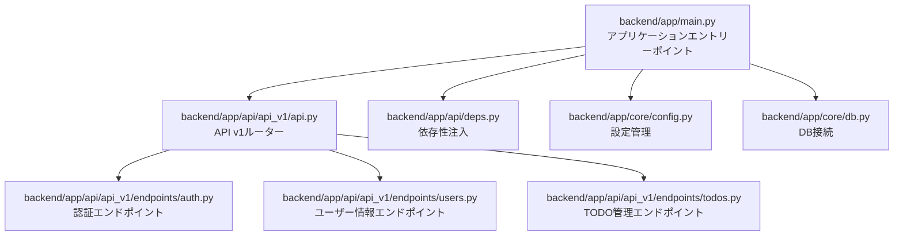
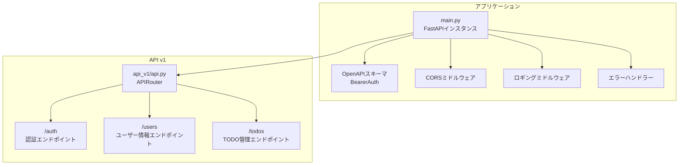
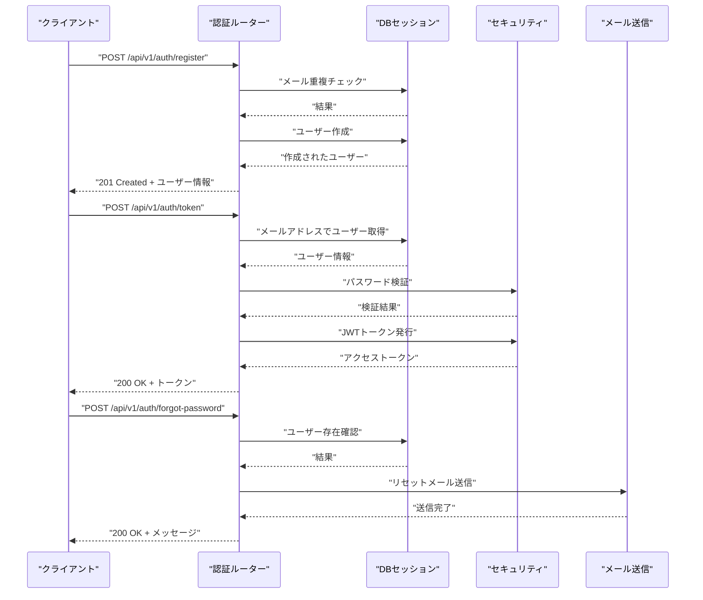
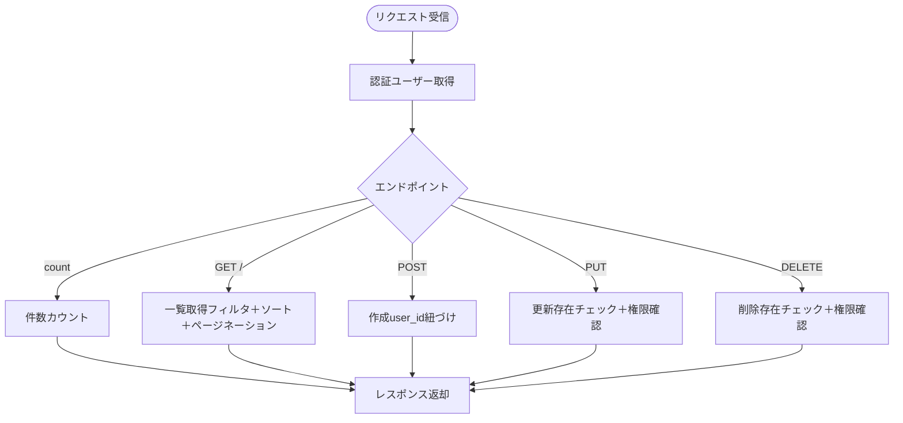
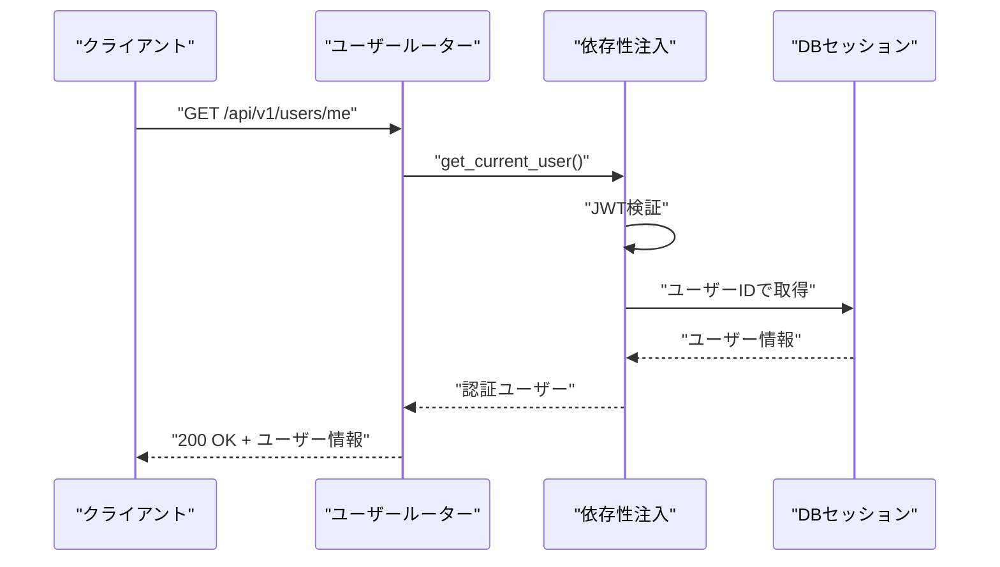
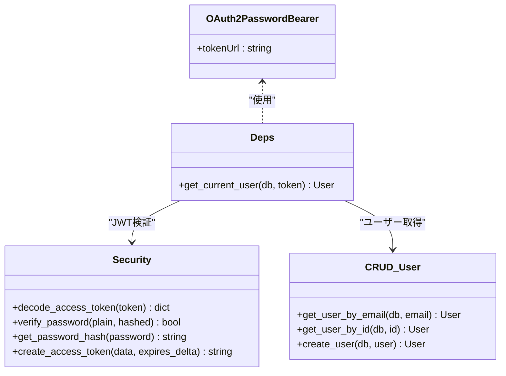
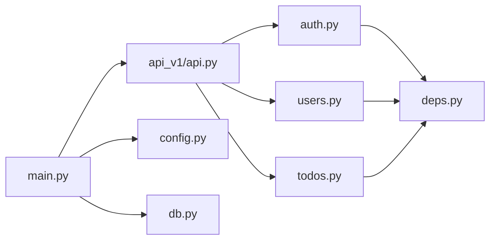

# APIルーティングシステム

<cite>
**この文書で参照されるファイル**
- [backend/app/main.py](file://backend/app/main.py)
- [backend/app/api/api_v1/api.py](file://backend/app/api/api_v1/api.py)
- [backend/app/api/api_v1/endpoints/auth.py](file://backend/app/api/api_v1/endpoints/auth.py)
- [backend/app/api/api_v1/endpoints/todos.py](file://backend/app/api/api_v1/endpoints/todos.py)
- [backend/app/api/api_v1/endpoints/users.py](file://backend/app/api/api_v1/endpoints/users.py)
- [backend/app/api/deps.py](file://backend/app/api/deps.py)
- [backend/app/core/config.py](file://backend/app/core/config.py)
- [backend/app/core/db.py](file://backend/app/core/db.py)
</cite>

## 目次
1. [はじめに](#はじめに)
2. [プロジェクト構造](#プロジェクト構造)
3. [コアコンポーネント](#コアコンポーネント)
4. [アーキテクチャ概要](#アーキテクチャ概要)
5. [詳細コンポーネント分析](#詳細コンポーネント分析)
6. [依存関係分析](#依存関係分析)
7. [パフォーマンス考慮事項](#パフォーマンス考慮事項)
8. [トラブルシューティングガイド](#トラブルシューティングガイド)
9. [結論](#結論)

## はじめに
本ドキュメントは、FastAPIによるAPIルーティングシステムの設計と実装について詳細に解説します。APIバージョン管理、エンドポイントの階層構造、ルートグループの定義方法、認証・Todo・ユーザー関連のエンドポイントの具体的な実装例、そしてRESTful APIの設計原則を適用した方法を網羅的に説明します。

## プロジェクト構造
バックエンドアプリケーションは、FastAPIのモジュール構造に従って以下のように構成されています：
- アプリケーションエントリーポイント：backend/app/main.py
- APIバージョンルーター：backend/app/api/api_v1/api.py
- 各機能のエンドポイント：backend/app/api/api_v1/endpoints/配下
- 依存性注入：backend/app/api/deps.py
- 設定管理：backend/app/core/config.py
- DB接続：backend/app/core/db.py

**図の出典**
- [backend/app/main.py:1-168](file://backend/app/main.py#L1-L168)
- [backend/app/api/api_v1/api.py:1-8](file://backend/app/api/api_v1/api.py#L1-L8)

**節の出典**
- [backend/app/main.py:1-168](file://backend/app/main.py#L1-L168)
- [backend/app/api/api_v1/api.py:1-8](file://backend/app/api/api_v1/api.py#L1-L8)

## コアコンポーネント
- APIバージョン管理
  - API v1のプレフィックスは「/api/v1」で固定されており、設定ファイルから取得されます。これにより、将来的なAPIバージョンの追加や互換性維持が容易になります。
  - 設定値の例：API_V1_STR = "/api/v1"

- ルートグループの定義
  - 各エンドポイントにはタグが割り当てられており、Swagger/OpenAPIのUI上で分類表示されます。
  - 例：認証（auth）、ユーザー（users）、TODO（todos）、ヘルス（health）

- 認証機構
  - JWT Bearer認証スキーマをOpenAPIに統合し、ScalarドキュメントでBearerトークンを直接試せる環境を整えています。
  - トークンの検証はOAuth2PasswordBearer経由で行われ、依存関数によって認証されたユーザーを取得します。

- CORS・ロギング・エラーハンドリング
  - CORS設定は環境変数で制御され、本番環境では必須設定です。
  - ロギングミドルウェアと複数の例外ハンドラーが登録され、バリデーションエラー、HTTP例外、一般例外、レート制限超過に対応しています。

**節の出典**
- [backend/app/core/config.py:22](file://backend/app/core/config.py#L22)
- [backend/app/main.py:58-63](file://backend/app/main.py#L58-L63)
- [backend/app/main.py:74-102](file://backend/app/main.py#L74-L102)
- [backend/app/api/deps.py:11](file://backend/app/api/deps.py#L11)
- [backend/app/main.py:104-118](file://backend/app/main.py#L104-L118)
- [backend/app/main.py:67-71](file://backend/app/main.py#L67-L71)

## アーキテクチャ概要
FastAPIのルーティングシステムは、以下の階層構造で設計されています：
- アプリケーションレベル：main.pyでFastAPIインスタンスを初期化し、OpenAPIスキーマ、CORS、ミドルウェア、ルーターを統合
- APIバージョンレベル：api_v1/api.pyで各機能グループ（認証、ユーザー、TODO）をルートプレフィックス付きでinclude
- 機能エンドポイントレベル：各endpoints/*.pyでHTTPメソッドごとのエンドポイントを定義

**図の出典**
- [backend/app/main.py:49-128](file://backend/app/main.py#L49-L128)
- [backend/app/api/api_v1/api.py:4-7](file://backend/app/api/api_v1/api.py#L4-L7)

## 詳細コンポーネント分析

### 認証エンドポイント（/api/v1/auth）
- 機能
  - ユーザー登録：メールアドレス重複チェックを行い、重複時は400エラーを返します。
  - トークン取得：メールアドレスとパスワードを検証し、JWTアクセストークンを発行します。
  - パスワードリセット：リセットメール送信（ユーザーが存在しなくても200）、トークン検証後のパスワード変更。
- 実装ポイント
  - 依存関数：DBセッション、認証されたユーザー取得
  - 例外処理：認証失敗、トークン無効、ユーザー未登録など
  - 速度制限：各エンドポイントにレートリミットが適用

**図の出典**
- [backend/app/api/api_v1/endpoints/auth.py:19-34](file://backend/app/api/api_v1/endpoints/auth.py#L19-L34)
- [backend/app/api/api_v1/endpoints/auth.py:36-54](file://backend/app/api/api_v1/endpoints/auth.py#L36-L54)
- [backend/app/api/api_v1/endpoints/auth.py:57-78](file://backend/app/api/api_v1/endpoints/auth.py#L57-L78)

**節の出典**
- [backend/app/api/api_v1/endpoints/auth.py:19-117](file://backend/app/api/api_v1/endpoints/auth.py#L19-L117)
- [backend/app/api/deps.py:13-36](file://backend/app/api/deps.py#L13-L36)

### TODO管理エンドポイント（/api/v1/todos）
- 機能
  - 件数取得：検索・完了状態・優先度・タグでのフィルタリングに対応
  - 一覧取得：ページネーション、検索・フィルタ・ソート（created_at/priority/due_date）
  - 作成・更新・削除：認証ユーザーに紐づくデータのみ操作可能
- 実装ポイント
  - 依存関数：DBセッション、認証ユーザー取得
  - 例外処理：404 Not Found（データなし）を適切に返却
  - 入力バリデーション：クエリパラメータの範囲・パターン検証

**図の出典**
- [backend/app/api/api_v1/endpoints/todos.py:13-30](file://backend/app/api/api_v1/endpoints/todos.py#L13-L30)
- [backend/app/api/api_v1/endpoints/todos.py:32-57](file://backend/app/api/api_v1/endpoints/todos.py#L32-L57)
- [backend/app/api/api_v1/endpoints/todos.py:59-67](file://backend/app/api/api_v1/endpoints/todos.py#L59-L67)
- [backend/app/api/api_v1/endpoints/todos.py:69-89](file://backend/app/api/api_v1/endpoints/todos.py#L69-L89)
- [backend/app/api/api_v1/endpoints/todos.py:91-101](file://backend/app/api/api_v1/endpoints/todos.py#L91-L101)

**節の出典**
- [backend/app/api/api_v1/endpoints/todos.py:1-102](file://backend/app/api/api_v1/endpoints/todos.py#L1-L102)
- [backend/app/api/deps.py:13-36](file://backend/app/api/deps.py#L13-L36)

### ユーザー情報エンドポイント（/api/v1/users/me）
- 機能
  - 現在認証中のユーザー情報を取得（自身のみ）
- 実装ポイント
  - 認証必須（依存関数経由）
  - JWTペイロードのsubからユーザーIDを取得し、DBから取得

**図の出典**
- [backend/app/api/api_v1/endpoints/users.py:9-13](file://backend/app/api/api_v1/endpoints/users.py#L9-L13)
- [backend/app/api/deps.py:13-36](file://backend/app/api/deps.py#L13-L36)

**節の出典**
- [backend/app/api/api_v1/endpoints/users.py:1-14](file://backend/app/api/api_v1/endpoints/users.py#L1-L14)
- [backend/app/api/deps.py:13-36](file://backend/app/api/deps.py#L13-L36)

### 依存性注入（deps.py）
- OAuth2PasswordBearerのtokenUrlは「/api/v1/auth/token」に設定
- get_current_user関数は、JWTペイロードのsubからUUIDを取得し、DBからユーザーを検索
- トークンが無効またはユーザーが見つからない場合は401エラー

**図の出典**
- [backend/app/api/deps.py:11](file://backend/app/api/deps.py#L11)
- [backend/app/api/deps.py:13-36](file://backend/app/api/deps.py#L13-L36)

**節の出典**
- [backend/app/api/deps.py:1-37](file://backend/app/api/deps.py#L1-L37)

### 設定管理（config.py）
- APIバージョン文字列：API_V1_STR = "/api/v1"
- 環境変数によるDB接続情報、JWT設定、CORS設定、レートリミット設定、SMTP設定、フロントエンドURL、リセットトークン有効期限などを管理
- 環境プロパティ：is_development/is_production

**節の出典**
- [backend/app/core/config.py:22](file://backend/app/core/config.py#L22)
- [backend/app/core/config.py:27-34](file://backend/app/core/config.py#L27-L34)
- [backend/app/core/config.py:62-83](file://backend/app/core/config.py#L62-L83)

### DB接続（db.py）
- 非同期SQLAlchemyエンジンの作成
- get_dbジェネレータ関数によるセッション管理（依存関数として利用）

**節の出典**
- [backend/app/core/db.py:5-17](file://backend/app/core/db.py#L5-L17)

## 依存関係分析
- main.py
  - API v1ルーターをinclude
  - OpenAPIスキーマのカスタム生成（BearerAuthの追加）
  - CORS、ロギング、エラーハンドラーの登録
  - ヘルスチェックエンドポイントの定義

- api_v1/api.py
  - 各機能ルーター（auth、users、todos）をinclude
  - 各ルーターにタグを付与

- endpoints/*
  - CRUD操作の実装
  - 依存関数（deps.get_db、deps.get_current_user）の使用
  - 例外処理（HTTPException、404、401など）

**図の出典**
- [backend/app/main.py:11-128](file://backend/app/main.py#L11-L128)
- [backend/app/api/api_v1/api.py:4-7](file://backend/app/api/api_v1/api.py#L4-L7)

**節の出典**
- [backend/app/main.py:11-128](file://backend/app/main.py#L11-L128)
- [backend/app/api/api_v1/api.py:4-7](file://backend/app/api/api_v1/api.py#L4-L7)

## パフォーマンス考慮事項
- 非同期DB接続
  - SQLAlchemy async engineを使用し、非同期I/Oによりスループット向上を図っています。
- 依存関数の効率化
  - DBセッションはジェネレータで管理され、コネクションの再利用が可能。
- 速度制限
  - 各認証関連エンドポイントにレートリミットが設定されており、DoS攻撃やブルートフォース対策として有効です。
- CORS設定
  - 本番環境ではオリジンを厳密に制限し、不要なヘッダーの許可を最小限に抑えます。

[この節では特定のファイルを分析していないため、節の出典はありません]

## トラブルシューティングガイド
- 認証エラー（401 Unauthorized）
  - トークン形式が不正、期限切れ、ペイロードにsubがない場合に発生します。
  - 対応：再度ログインし、正しいAuthorizationヘッダー（Bearer トークン）を設定。

- DB接続エラー
  - 環境変数DATABASE_URLが設定されていない場合、デフォルトのローカルDB接続が使用されます。
  - 対応：.envファイルに正しいDB接続情報を設定するか、環境変数を設定。

- CORSエラー
  - 本番環境でBACKEND_CORS_ORIGINSが設定されていない場合、ランタイムエラーになります。
  - 対応：許可するオリジンを環境変数に設定。

- 速度制限超過（429 Too Many Requests）
  - 認証・登録・パスワードリセットなどのエンドポイントに適用されています。
  - 対応：リクエスト間隔を空けるか、レートリミット設定を見直す。

**節の出典**
- [backend/app/api/deps.py:18-26](file://backend/app/api/deps.py#L18-L26)
- [backend/app/core/config.py:50-60](file://backend/app/core/config.py#L50-L60)
- [backend/app/main.py:106-107](file://backend/app/main.py#L106-L107)
- [backend/app/main.py:24-26](file://backend/app/main.py#L24-L26)

## 結論
本システムは、FastAPIのルーティングと依存性注入を活用し、APIバージョン管理、エンドポイントの階層構造、ルートグループの定義を明確に実装しています。認証・Todo・ユーザー関連のエンドポイントは、RESTful原則に従い、明確なHTTPメソッドの使い分け、適切なステータスコード、フィルタ・ページネーション・速度制限などの設計が採用されています。これにより、保守性・拡張性・運用性の高いAPIを実現しています。