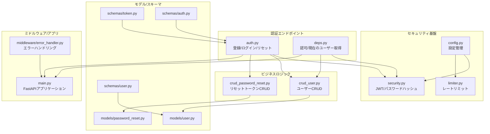
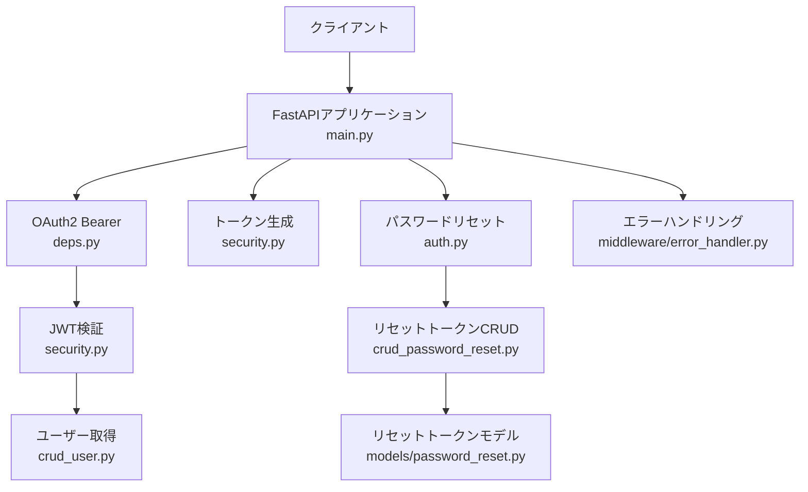
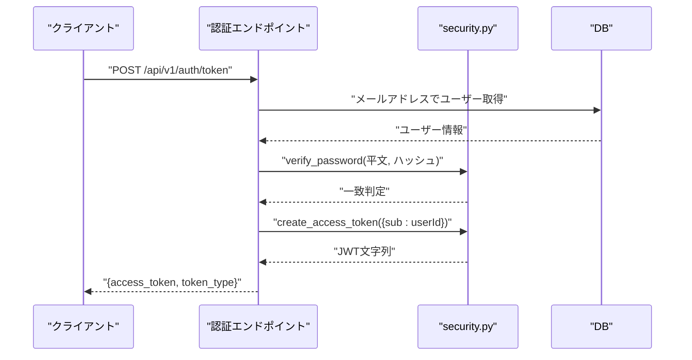
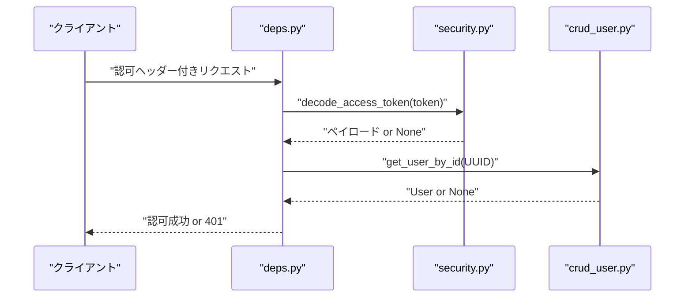
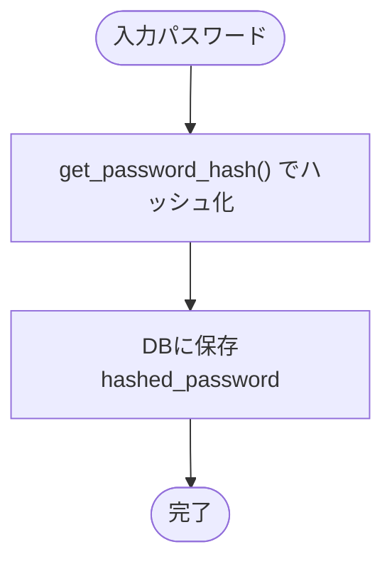
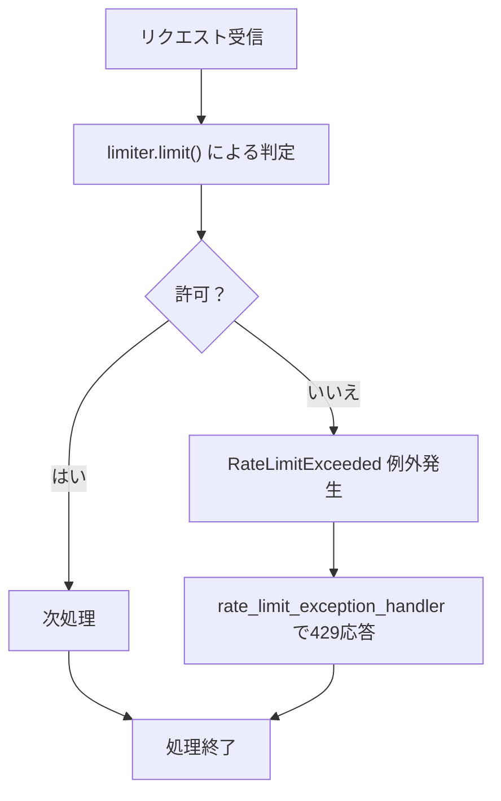
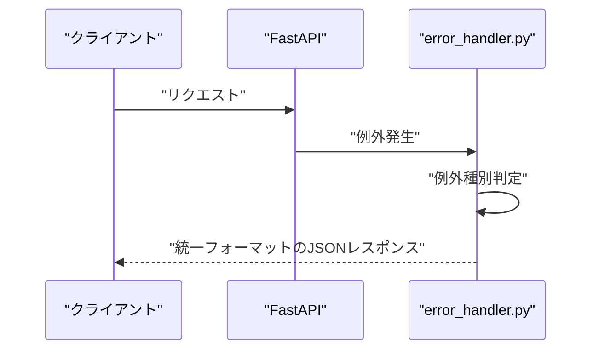
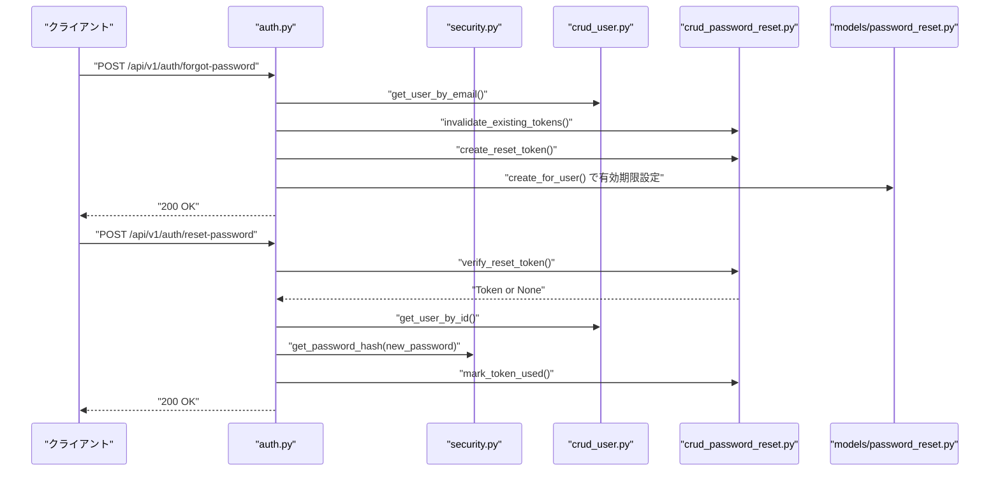
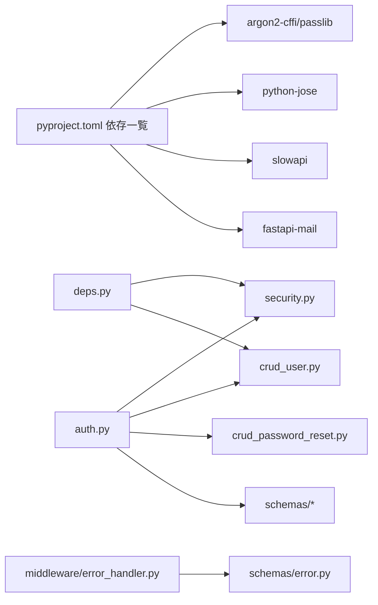
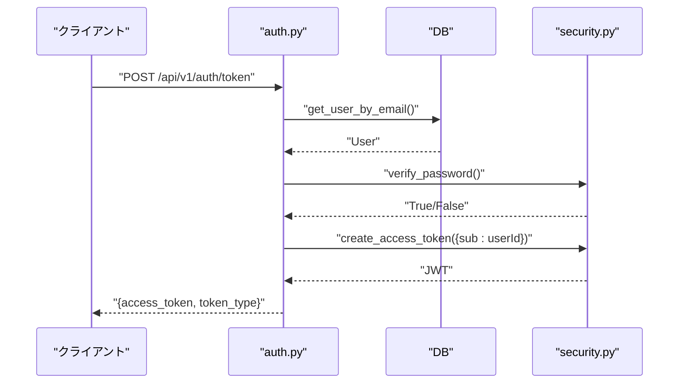

# セキュリティインフラストラクチャ

<cite>
**本文で参照されたファイル**   
- [backend/app/core/security.py](file://backend/app/core/security.py)
- [backend/app/api/api_v1/endpoints/auth.py](file://backend/app/api/api_v1/endpoints/auth.py)
- [backend/app/api/deps.py](file://backend/app/api/deps.py)
- [backend/app/core/config.py](file://backend/app/core/config.py)
- [backend/app/core/limiter.py](file://backend/app/core/limiter.py)
- [backend/app/middleware/error_handler.py](file://backend/app/middleware/error_handler.py)
- [backend/app/crud/crud_user.py](file://backend/app/crud/crud_user.py)
- [backend/app/crud/crud_password_reset.py](file://backend/app/crud/crud_password_reset.py)
- [backend/app/models/password_reset.py](file://backend/app/models/password_reset.py)
- [backend/app/models/user.py](file://backend/app/models/user.py)
- [backend/app/schemas/auth.py](file://backend/app/schemas/auth.py)
- [backend/app/schemas/token.py](file://backend/app/schemas/token.py)
- [backend/app/schemas/user.py](file://backend/app/schemas/user.py)
- [backend/app/main.py](file://backend/app/main.py)
- [backend/pyproject.toml](file://backend/pyproject.toml)
- [backend/tests/test_auth.py](file://backend/tests/test_auth.py)
</cite>

## 目次
1. [はじめに](#はじめに)
2. [プロジェクト構造](#プロジェクト構造)
3. [コアコンポーネント](#コアコンポーネント)
4. [アーキテクチャ概要](#アーキテクチャ概要)
5. [詳細コンポーネント分析](#詳細コンポーネント分析)
6. [依存関係分析](#依存関係分析)
7. [パフォーマンス考慮事項](#パフォーマンス考慮事項)
8. [トラブルシューティングガイド](#トラブルシューティングガイド)
9. [結論](#結論)
10. [付録](#付録)

## はじめに
本ドキュメントは、Todo APIバックエンドにおける認証・認可、セキュリティ機構の設計と実装について説明します。主な対象となる機能には以下の通りです：
- JWT（JSON Web Token）の生成・検証
- パスワードのハッシュ化（Argon2）
- APIリクエストの制限機構（SlowAPIによるレートリミット）
- 一貫したエラーハンドリングとセキュリティポリシーの実装方法
- 認証フロー（ログイン、ユーザー登録、パスワードリセット）

本設計はFastAPIフレームワーク上に構築され、非同期データベース接続（SQLModel + asyncpg）、OpenAPI/Swagger互換のドキュメントツール（Scalar）とともに運用されます。

## プロジェクト構造
バックエンドのセキュリティ関連コードは以下のディレクトリに分離・責務を明確にしています：
- core：セキュリティ基盤（JWT、パスワードハッシュ、設定、レートリミット）
- api_v1/endpoints：認証エンドポイント（登録、ログイン、パスワードリセット）
- crud：ユーザーおよびパスワードリセットトークンのCRUD
- models：DBスキーマ（User、PasswordResetToken）
- schemas：リクエスト/レスポンススキーマ（Token、User、ForgotPasswordRequest、ResetPasswordRequest）
- middleware：エラーハンドリング（Validation、HTTP、RateLimit、一般例外）
- tests：認証関連の統合テスト

**図の出典**
- [backend/app/core/config.py:1-91](file://backend/app/core/config.py#L1-L91)
- [backend/app/core/security.py:1-35](file://backend/app/core/security.py#L1-L35)
- [backend/app/core/limiter.py:1-7](file://backend/app/core/limiter.py#L1-L7)
- [backend/app/api/api_v1/endpoints/auth.py:1-117](file://backend/app/api/api_v1/endpoints/auth.py#L1-L117)
- [backend/app/api/deps.py:1-37](file://backend/app/api/deps.py#L1-L37)
- [backend/app/crud/crud_user.py:1-28](file://backend/app/crud/crud_user.py#L1-L28)
- [backend/app/crud/crud_password_reset.py:1-56](file://backend/app/crud/crud_password_reset.py#L1-L56)
- [backend/app/models/user.py:1-16](file://backend/app/models/user.py#L1-L16)
- [backend/app/models/password_reset.py:1-52](file://backend/app/models/password_reset.py#L1-L52)
- [backend/app/schemas/user.py:1-13](file://backend/app/schemas/user.py#L1-L13)
- [backend/app/schemas/token.py:1-10](file://backend/app/schemas/token.py#L1-L10)
- [backend/app/schemas/auth.py:1-11](file://backend/app/schemas/auth.py#L1-L11)
- [backend/app/middleware/error_handler.py:1-149](file://backend/app/middleware/error_handler.py#L1-L149)
- [backend/app/main.py:1-168](file://backend/app/main.py#L1-L168)

**節の出典**
- [backend/app/main.py:1-168](file://backend/app/main.py#L1-L168)
- [backend/app/core/config.py:1-91](file://backend/app/core/config.py#L1-L91)

## コアコンポーネント
- JWTトークン生成・検証
  - トークンの署名アルゴリズム、有効期限、シークレットキーは設定から取得
  - トークン検証失敗時はNoneを返し、認可ミドルウェアで401エラーへ
- パスワードハッシュ化
  - Argon2によるハッシュ化（passlib）
  - 登録時・リセット時のみハッシュ化が適用
- 認可・現在のユーザー取得
  - OAuth2 Bearerスキームに対応し、JWTペイロードからユーザーIDを取得
  - DBからユーザーをフェッチし、存在しない場合は401エラー
- APIリクエスト制限
  - SlowAPIによるIPベースのレートリミット（デフォルト、ログイン、登録、リセットなど）
- 一貫したエラーハンドリング
  - Validation、HTTP、RateLimit、一般例外を統一フォーマットで返却
  - 認識しやすい日本語メッセージを提供

**節の出典**
- [backend/app/core/security.py:1-35](file://backend/app/core/security.py#L1-L35)
- [backend/app/api/deps.py:1-37](file://backend/app/api/deps.py#L1-L37)
- [backend/app/core/limiter.py:1-7](file://backend/app/core/limiter.py#L1-L7)
- [backend/app/middleware/error_handler.py:1-149](file://backend/app/middleware/error_handler.py#L1-L149)

## アーキテクチャ概要
以下は認証・認可・セキュリティの全体像です。FastAPIアプリケーションがエンドポイントを介して認証処理を行い、JWTを介して認可を実施し、SlowAPIによるレートリミットとミドルウェアによるエラーハンドリングが横断的に適用されます。

**図の出典**
- [backend/app/main.py:1-168](file://backend/app/main.py#L1-L168)
- [backend/app/api/deps.py:1-37](file://backend/app/api/deps.py#L1-L37)
- [backend/app/core/security.py:1-35](file://backend/app/core/security.py#L1-L35)
- [backend/app/crud/crud_user.py:1-28](file://backend/app/crud/crud_user.py#L1-L28)
- [backend/app/api/api_v1/endpoints/auth.py:1-117](file://backend/app/api/api_v1/endpoints/auth.py#L1-L117)
- [backend/app/crud/crud_password_reset.py:1-56](file://backend/app/crud/crud_password_reset.py#L1-L56)
- [backend/app/models/password_reset.py:1-52](file://backend/app/models/password_reset.py#L1-L52)
- [backend/app/middleware/error_handler.py:1-149](file://backend/app/middleware/error_handler.py#L1-L149)

## 詳細コンポーネント分析

### JWTトークン生成・検証
- 生成
  - 任意のペイロード（例：sub=ユーザーID）に有効期限を追加し、SECRET_KEYとALGORITHMで署名
  - 有効期限は設定値ACCESS_TOKEN_EXPIRE_MINUTESに基づく
- 検証
  - 同じSECRET_KEYとALGORITHMでデコードし、JWTErrorを補足
  - 検証失敗時はNoneを返し、認可ミドルウェアで認証エラーへ

**図の出典**
- [backend/app/api/api_v1/endpoints/auth.py:36-54](file://backend/app/api/api_v1/endpoints/auth.py#L36-L54)
- [backend/app/core/security.py:10-27](file://backend/app/core/security.py#L10-L27)
- [backend/app/crud/crud_user.py:8-16](file://backend/app/crud/crud_user.py#L8-L16)

**節の出典**
- [backend/app/core/security.py:1-35](file://backend/app/core/security.py#L1-L35)
- [backend/app/api/api_v1/endpoints/auth.py:36-54](file://backend/app/api/api_v1/endpoints/auth.py#L36-L54)

### 認可・現在のユーザー取得
- OAuth2 Bearerスキームにより、Authorization: Bearer <JWT> が要求される
- JWTペイロードのsubからUUIDを取得し、DBからユーザーをフェッチ
- 存在しない場合やペイロード不正時は401エラー

**図の出典**
- [backend/app/api/deps.py:13-36](file://backend/app/api/deps.py#L13-L36)
- [backend/app/core/security.py:29-34](file://backend/app/core/security.py#L29-L34)
- [backend/app/crud/crud_user.py:13-16](file://backend/app/crud/crud_user.py#L13-L16)

**節の出典**
- [backend/app/api/deps.py:1-37](file://backend/app/api/deps.py#L1-L37)

### パスワードハッシュ化
- 登録時・パスワードリセット時のみハッシュ化が適用
- Argon2による堅牢なハッシュ化（passlib）

**図の出典**
- [backend/app/core/security.py:13-14](file://backend/app/core/security.py#L13-L14)
- [backend/app/crud/crud_user.py](file://backend/app/crud/crud_user.py#L19)
- [backend/app/api/api_v1/endpoints/auth.py](file://backend/app/api/api_v1/endpoints/auth.py#L110)

**節の出典**
- [backend/app/core/security.py:8-14](file://backend/app/core/security.py#L8-L14)
- [backend/app/crud/crud_user.py:18-27](file://backend/app/crud/crud_user.py#L18-L27)
- [backend/app/api/api_v1/endpoints/auth.py](file://backend/app/api/api_v1/endpoints/auth.py#L110)

### APIリクエスト制限機構（SlowAPI）
- IPアドレスごとのデフォルト制限と、エンドポイントごとのカスタム制限
- 設定値は環境変数から読み込まれる（例：RATE_LIMIT_LOGIN、RATE_LIMIT_REGISTER、RATE_LIMIT_FORGOT_PASSWORD、RATE_LIMIT_RESET_PASSWORD）

**図の出典**
- [backend/app/core/limiter.py:1-7](file://backend/app/core/limiter.py#L1-L7)
- [backend/app/core/config.py:62-67](file://backend/app/core/config.py#L62-L67)
- [backend/app/middleware/error_handler.py:125-148](file://backend/app/middleware/error_handler.py#L125-L148)
- [backend/app/api/api_v1/endpoints/auth.py](file://backend/app/api/api_v1/endpoints/auth.py#L20)
- [backend/app/api/api_v1/endpoints/auth.py](file://backend/app/api/api_v1/endpoints/auth.py#L37)
- [backend/app/api/api_v1/endpoints/auth.py](file://backend/app/api/api_v1/endpoints/auth.py#L63)
- [backend/app/api/api_v1/endpoints/auth.py](file://backend/app/api/api_v1/endpoints/auth.py#L87)

**節の出典**
- [backend/app/core/limiter.py:1-7](file://backend/app/core/limiter.py#L1-L7)
- [backend/app/core/config.py:62-67](file://backend/app/core/config.py#L62-L67)
- [backend/app/middleware/error_handler.py:125-148](file://backend/app/middleware/error_handler.py#L125-L148)

### 一貫したエラーハンドリング
- Validationエラー：Pydanticエラーを整形して422
- HTTP例外：ステータスコードに応じた日本語メッセージで4xx/5xx
- RateLimitExceeded：429（リクエスト制限超過）
- 一般例外：500（内部エラー）

**図の出典**
- [backend/app/middleware/error_handler.py:15-49](file://backend/app/middleware/error_handler.py#L15-L49)
- [backend/app/middleware/error_handler.py:52-76](file://backend/app/middleware/error_handler.py#L52-L76)
- [backend/app/middleware/error_handler.py:125-148](file://backend/app/middleware/error_handler.py#L125-L148)
- [backend/app/middleware/error_handler.py:79-104](file://backend/app/middleware/error_handler.py#L79-L104)

**節の出典**
- [backend/app/middleware/error_handler.py:1-149](file://backend/app/middleware/error_handler.py#L1-L149)

### 認証エンドポイントの流れ（登録・ログイン・パスワードリセット）
- 登録
  - 既存メールアドレスチェック → 重複時は400
  - 有効な入力の場合、パスワードをハッシュ化して登録
- ログイン
  - メールアドレスでユーザー取得 → 認証失敗時は401
  - 成功時、JWTアクセストークンを発行
- パスワードリセット
  - トークン作成（DB保存、有効期限設定）
  - 既存未使用トークンを無効化
  - トークン検証 → 失敗時は400
  - 正常時、新パスワードをハッシュ化して更新、トークン使用済みマーク

**図の出典**
- [backend/app/api/api_v1/endpoints/auth.py:57-116](file://backend/app/api/api_v1/endpoints/auth.py#L57-L116)
- [backend/app/crud/crud_user.py:8-16](file://backend/app/crud/crud_user.py#L8-L16)
- [backend/app/crud/crud_password_reset.py:9-55](file://backend/app/crud/crud_password_reset.py#L9-L55)
- [backend/app/models/password_reset.py:34-51](file://backend/app/models/password_reset.py#L34-L51)
- [backend/app/core/security.py:13-14](file://backend/app/core/security.py#L13-L14)

**節の出典**
- [backend/app/api/api_v1/endpoints/auth.py:1-117](file://backend/app/api/api_v1/endpoints/auth.py#L1-L117)
- [backend/app/crud/crud_password_reset.py:1-56](file://backend/app/crud/crud_password_reset.py#L1-L56)
- [backend/app/models/password_reset.py:1-52](file://backend/app/models/password_reset.py#L1-L52)

## 依存関係分析
- 外部依存
  - argon2-cffi、passlib：パスワードハッシュ化
  - python-jose[cryptography]：JWT署名/検証
  - slowapi：レートリミット
  - fastapi-mail：メール送信（リセットメール）
- 内部依存
  - auth.py は security.py、crud_user.py、crud_password_reset.py、schemas に依存
  - deps.py は security.py、crud_user.py に依存
  - middleware/error_handler.py は schemas/error.py に依存（エラーレスポンス定義）

**図の出典**
- [backend/pyproject.toml:7-25](file://backend/pyproject.toml#L7-L25)
- [backend/app/api/api_v1/endpoints/auth.py:1-17](file://backend/app/api/api_v1/endpoints/auth.py#L1-L17)
- [backend/app/api/deps.py:1-11](file://backend/app/api/deps.py#L1-L11)
- [backend/app/middleware/error_handler.py:1-12](file://backend/app/middleware/error_handler.py#L1-L12)

**節の出典**
- [backend/pyproject.toml:1-51](file://backend/pyproject.toml#L1-L51)

## パフォーマンス考慮事項
- JWT検証コスト
  - トークン検証は軽量だが、頻繁な認可チェックはDBアクセスを伴うため、必要最小限のフィールドのみ取得
- レートリミット
  - Redis等の外部ストアを使用することで、複数インスタンス間での状態共有が可能（現状はデフォルト設定）
- DBインデックス
  - users.email、password_reset_tokens.token_hash にインデックスが設定されている（モデル定義より）
- トークン有効期限
  - 短めのアクセストークン有効期限（デフォルト30分）はセキュリティ向上に寄与

[本節は一般的なパフォーマンス指針を示すため、特定ファイルの解析は不要]

## トラブルシューティングガイド
- 認証エラー（401）
  - トークン形式が不正、期限切れ、ペイロードsubが無効
  - 現在のユーザー取得に失敗（DBに存在しない）
- 認可エラー（403）
  - 現在の実装では明示的なロールベース認可は未実装（必要に応じて拡張）
- トークン検証エラー（400）
  - パスワードリセットトークンが無効または期限切れ
- 重複登録（400）
  - 同じメールアドレスでの登録は拒否
- 429（リクエスト制限超過）
  - 設定されたレートリミットを超えた場合
- 500（内部エラー）
  - 未捕捉例外は統一エラーハンドラーで500を返却

**節の出典**
- [backend/app/api/deps.py:17-36](file://backend/app/api/deps.py#L17-L36)
- [backend/app/api/api_v1/endpoints/auth.py:27-34](file://backend/app/api/api_v1/endpoints/auth.py#L27-L34)
- [backend/app/api/api_v1/endpoints/auth.py:94-109](file://backend/app/api/api_v1/endpoints/auth.py#L94-L109)
- [backend/app/middleware/error_handler.py:125-148](file://backend/app/middleware/error_handler.py#L125-L148)

## 結論
本プロジェクトは、FastAPI上にJWT認証、Argon2によるパスワードハッシュ化、SlowAPIによるレートリミット、一貫したエラーハンドリングを統合したセキュリティインフラを備えています。認証フロー（登録・ログイン・パスワードリセット）は明確なバリデーションとエラーレスポンスで保護されており、設定値を環境変数で柔軟に調整できます。今後の拡張として、ロールベース認可、CSRF対策、暗号化通信（HTTPS）の強制、セッション管理（リフレッシュトークン）などが考えられます。

## 付録

### 認証・認可フローのシーケンス図（ログイン）

**図の出典**
- [backend/app/api/api_v1/endpoints/auth.py:36-54](file://backend/app/api/api_v1/endpoints/auth.py#L36-L54)
- [backend/app/core/security.py:10-27](file://backend/app/core/security.py#L10-L27)
- [backend/app/crud/crud_user.py:8-16](file://backend/app/crud/crud_user.py#L8-L16)

### 設定値一覧（重要度：高）
- SECRET_KEY：JWT署名に使用（本番環境では必須）
- ALGORITHM：JWT署名アルゴリズム（デフォルトHS256）
- ACCESS_TOKEN_EXPIRE_MINUTES：アクセストークン有効期限
- BACKEND_CORS_ORIGINS：CORSオリジン（本番では厳密に設定）
- RATE_LIMIT_*：各エンドポイントのレートリミット
- SMTP_*：パスワードリセットメール送信設定
- FRONTEND_URL：リセットリンクのベースURL
- RESET_TOKEN_EXPIRE_HOURS：リセットトークン有効期限（時間）

**節の出典**
- [backend/app/core/config.py:51-83](file://backend/app/core/config.py#L51-L83)

### 依存ライブラリ（セキュリティ関連）
- argon2-cffi/passlib：パスワードハッシュ化（堅牢）
- python-jose[cryptography]：JWT署名/検証（暗号化ライブラリ）
- slowapi：レートリミット（DoS緩和）
- fastapi-mail：メール送信（パスワードリセット）

**節の出典**
- [backend/pyproject.toml:7-25](file://backend/pyproject.toml#L7-L25)

### 認証関連テスト（参考）
- 登録：重複メールアドレスでの400、正常登録での201
- ログイン：正しい資格情報での200、誤った資格情報での401
- これらのテストは認証フローの動作確認に役立ちます

**節の出典**
- [backend/tests/test_auth.py:1-66](file://backend/tests/test_auth.py#L1-L66)