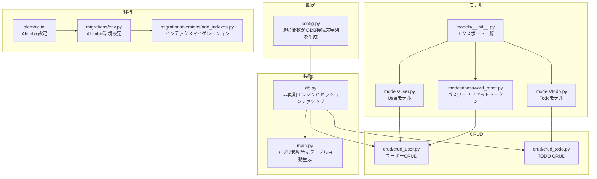
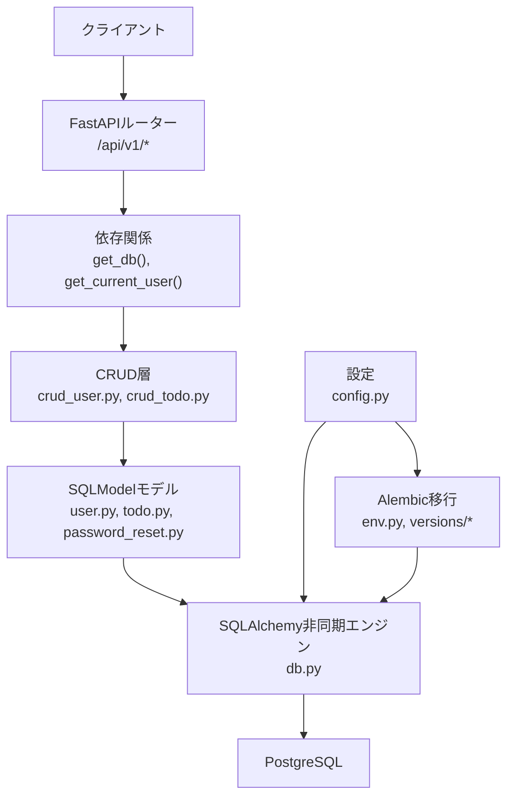
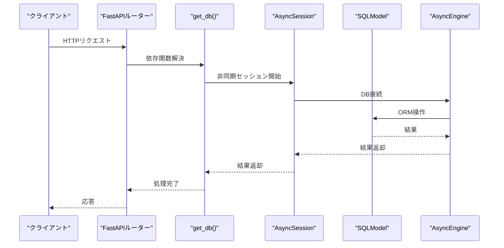
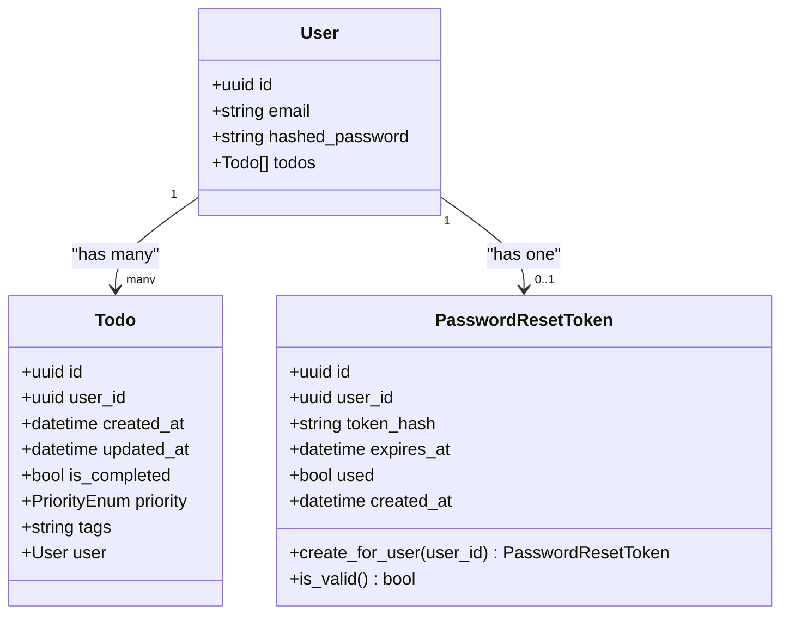
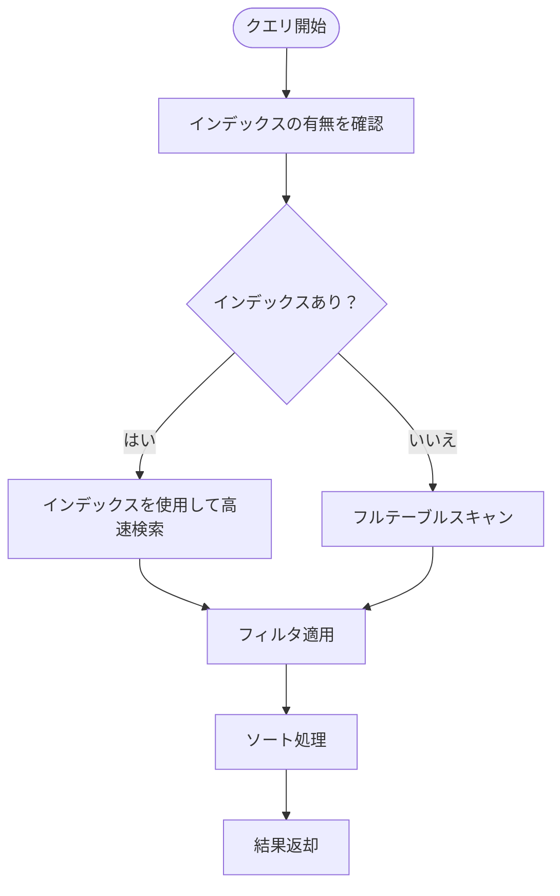
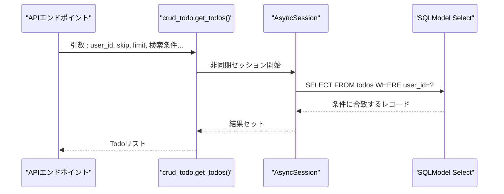
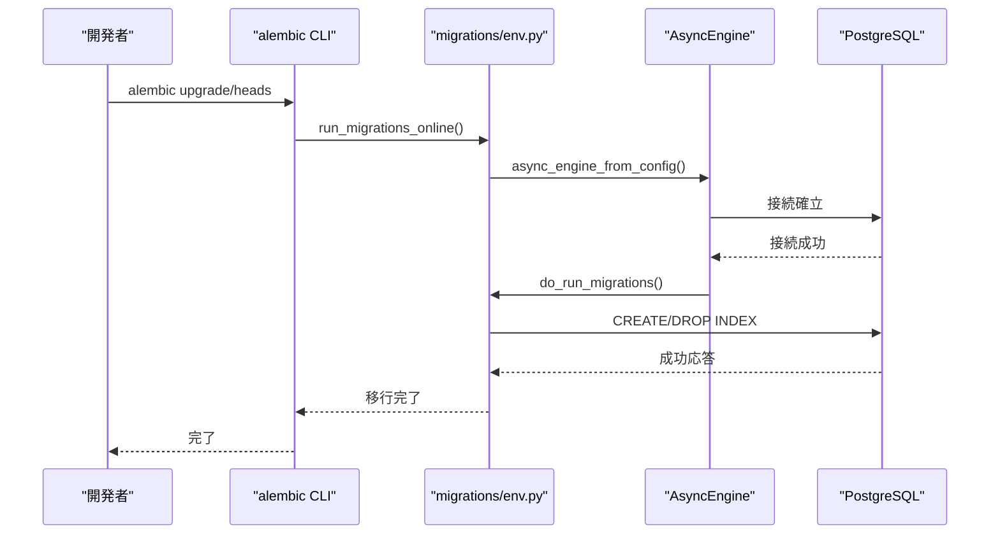
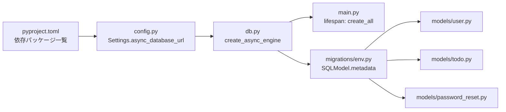

# データベースレイヤー

<cite>
**この文書で参照されるファイル**
- [backend/app/core/db.py](file://backend/app/core/db.py)
- [backend/app/core/config.py](file://backend/app/core/config.py)
- [backend/app/models/user.py](file://backend/app/models/user.py)
- [backend/app/models/todo.py](file://backend/app/models/todo.py)
- [backend/app/models/password_reset.py](file://backend/app/models/password_reset.py)
- [backend/app/models/__init__.py](file://backend/app/models/__init__.py)
- [backend/app/crud/crud_user.py](file://backend/app/crud/crud_user.py)
- [backend/app/crud/crud_todo.py](file://backend/app/crud/crud_todo.py)
- [backend/app/api/deps.py](file://backend/app/api/deps.py)
- [backend/app/main.py](file://backend/app/main.py)
- [backend/migrations/env.py](file://backend/migrations/env.py)
- [backend/migrations/versions/add_indexes.py](file://backend/migrations/versions/add_indexes.py)
- [backend/alembic.ini](file://backend/alembic.ini)
- [backend/pyproject.toml](file://backend/pyproject.toml)
</cite>

## 目次
1. [導入](#導入)
2. [プロジェクト構造](#プロジェクト構造)
3. [コアコンポーネント](#コアコンポーネント)
4. [アーキテクチャ概要](#アーキテクチャ概要)
5. [詳細コンポーネント解析](#詳細コンポーネント解析)
6. [依存関係解析](#依存関係解析)
7. [パフォーマンス考慮事項](#パフォーマンス考慮事項)
8. [トラブルシューティングガイド](#トラブルシューティングガイド)
9. [結論](#結論)

## 導入
本プロジェクトはSQLModelをORMとして採用し、非同期データベース接続を実現するデータベースレイヤーを設計しています。FastAPIアプリケーションのライフサイクル中にテーブルを自動生成し、Alembicによるマイグレーション管理を行うことで、開発・運用の両面での保守性を高めています。

## プロジェクト構造
データベースレイヤーに関連する主なファイルと役割は以下の通りです：

- 接続設定: `backend/app/core/db.py`（非同期エンジンとセッションファクトリ）
- 設定管理: `backend/app/core/config.py`（環境変数からDB接続文字列を生成）
- モデル定義: `backend/app/models/`（User、Todo、PasswordResetToken）
- CRUD操作: `backend/app/crud/`（データアクセス層）
- 移行管理: `backend/migrations/`（Alembic設定とマイグレーションスクリプト）
- 依存関係注入: `backend/app/api/deps.py`（DBセッションと認証フロー）

**図の出典**
- [backend/app/core/db.py:1-17](file://backend/app/core/db.py#L1-L17)
- [backend/app/core/config.py:44-48](file://backend/app/core/config.py#L44-L48)
- [backend/app/main.py:38-42](file://backend/app/main.py#L38-L42)
- [backend/app/models/user.py:9-15](file://backend/app/models/user.py#L9-L15)
- [backend/app/models/todo.py:10-24](file://backend/app/models/todo.py#L10-L24)
- [backend/app/models/password_reset.py:21-32](file://backend/app/models/password_reset.py#L21-L32)
- [backend/app/models/__init__.py:1-4](file://backend/app/models/__init__.py#L1-L4)
- [backend/app/crud/crud_user.py:8-27](file://backend/app/crud/crud_user.py#L8-L27)
- [backend/app/crud/crud_todo.py:10-151](file://backend/app/crud/crud_todo.py#L10-L151)
- [backend/migrations/env.py:10-27](file://backend/migrations/env.py#L10-L27)
- [backend/migrations/versions/add_indexes.py:20-41](file://backend/migrations/versions/add_indexes.py#L20-L41)
- [backend/alembic.ini:86-89](file://backend/alembic.ini#L86-L89)

**節の出典**
- [backend/app/core/db.py:1-17](file://backend/app/core/db.py#L1-L17)
- [backend/app/core/config.py:44-48](file://backend/app/core/config.py#L44-L48)
- [backend/app/main.py:38-42](file://backend/app/main.py#L38-L42)
- [backend/app/models/__init__.py:1-4](file://backend/app/models/__init__.py#L1-L4)

## コアコンポーネント
- 非同期エンジンとセッション
  - `create_async_engine`でPostgreSQL用の非同期接続を設定
  - `sessionmaker`で`AsyncSession`を生成し、`expire_on_commit=False`でコミット後のオブジェクト状態を維持
  - 依存関数`get_db`によりFastAPIのルーターでDI可能

- 設定管理
  - `Settings.async_database_url`プロパティでDB接続文字列を環境変数から生成
  - 開発環境ではSQLAlchemyのecho機能を有効化

- モデル定義
  - User: UUID主キー、hashed_password、Todoとのリレーション
  - Todo: UUID主キー、user_id外部キー、複数のインデックス、created_at/updated_at
  - PasswordResetToken: トークンのハッシュ化、有効期限管理

- CRUD操作
  - 非同期メソッドでCRUDを実装
  - Todo一覧取得には検索・フィルタ・ソート・ページネーション対応

**節の出典**
- [backend/app/core/db.py:5-16](file://backend/app/core/db.py#L5-L16)
- [backend/app/core/config.py:44-48](file://backend/app/core/config.py#L44-L48)
- [backend/app/models/user.py:9-15](file://backend/app/models/user.py#L9-L15)
- [backend/app/models/todo.py:10-24](file://backend/app/models/todo.py#L10-L24)
- [backend/app/models/password_reset.py:21-52](file://backend/app/models/password_reset.py#L21-L52)
- [backend/app/crud/crud_todo.py:10-151](file://backend/app/crud/crud_todo.py#L10-L151)

## アーキテクチャ概要
非同期ORMレイヤーの全体像は以下の通りです。FastAPI起動時にSQLModelのメタデータからテーブルが作成され、リクエスト処理中には非同期セッションがDIされ、CRUD操作が実行されます。Alembicはenv.pyを通じてSQLModelのメタデータを認識し、マイグレーションを管理します。

**図の出典**
- [backend/app/main.py:38-42](file://backend/app/main.py#L38-L42)
- [backend/app/api/deps.py:13-36](file://backend/app/api/deps.py#L13-L36)
- [backend/app/crud/crud_user.py:8-27](file://backend/app/crud/crud_user.py#L8-L27)
- [backend/app/crud/crud_todo.py:10-151](file://backend/app/crud/crud_todo.py#L10-L151)
- [backend/app/core/db.py:5-16](file://backend/app/core/db.py#L5-L16)
- [backend/migrations/env.py:10-27](file://backend/migrations/env.py#L10-L27)

## 詳細コンポーネント解析

### 接続プールとセッション管理
- 非同期接続
  - `create_async_engine`でPostgreSQL+asyncpgを使用
  - 開発環境ではSQLAlchemyのechoを有効化
- セッションファクトリ
  - `sessionmaker(class_=AsyncSession, expire_on_commit=False)`
  - FastAPIの依存関数`get_db`でコンテキストマネージャーとして利用

**図の出典**
- [backend/app/core/db.py:10-16](file://backend/app/core/db.py#L10-L16)
- [backend/app/api/deps.py:13-36](file://backend/app/api/deps.py#L13-L36)

**節の出典**
- [backend/app/core/db.py:5-16](file://backend/app/core/db.py#L5-L16)

### モデル定義とリレーション
- Userモデル
  - 主キー: UUID(default_factory)
  - 外部キー: なし（自身が親）
  - 子リレーション: List[Todo]（back_populates）
- Todoモデル
  - 主キー: UUID(default_factory)
  - 外部キー: users.id（user_id）
  - インデックス: user_id、created_at、is_completed、priority、due_date
  - 親リレーション: User（back_populates）
- PasswordResetTokenモデル
  - 主キー: UUID(default_factory)
  - 外部キー: users.id（user_id）
  - インデックス: token_hash
  - トークン生成・ハッシュ化・有効期限管理

**図の出典**
- [backend/app/models/user.py:9-15](file://backend/app/models/user.py#L9-L15)
- [backend/app/models/todo.py:10-24](file://backend/app/models/todo.py#L10-L24)
- [backend/app/models/password_reset.py:21-52](file://backend/app/models/password_reset.py#L21-L52)

**節の出典**
- [backend/app/models/user.py:9-15](file://backend/app/models/user.py#L9-L15)
- [backend/app/models/todo.py:10-24](file://backend/app/models/todo.py#L10-L24)
- [backend/app/models/password_reset.py:21-52](file://backend/app/models/password_reset.py#L21-L52)

### インデックスの最適化
- 定義されたインデックス
  - todos: user_id, created_at, is_completed, priority, due_date
  - users: username（移行スクリプトで追加）
- インデックスの目的
  - 検索・フィルタ・ソートのパフォーマンス向上
  - 外部キー参照の効率化

**図の出典**
- [backend/app/models/todo.py:12-17](file://backend/app/models/todo.py#L12-L17)
- [backend/migrations/versions/add_indexes.py:20-41](file://backend/migrations/versions/add_indexes.py#L20-L41)

**節の出典**
- [backend/app/models/todo.py:12-17](file://backend/app/models/todo.py#L12-L17)
- [backend/migrations/versions/add_indexes.py:20-41](file://backend/migrations/versions/add_indexes.py#L20-L41)

### CRUD操作の実装パターン
- 非同期メソッドの使用
  - SQLAlchemyの非同期セッションでselect、commit、refreshを実施
- Todo一覧取得の高度なフィルタリング
  - 検索条件: title LIKE、is_completed、priority、tags（複数指定可）
  - ソート: created_at、priority、due_date（昇順/降順）
  - ページネーション: offset/limit

**図の出典**
- [backend/app/crud/crud_todo.py:10-71](file://backend/app/crud/crud_todo.py#L10-L71)

**節の出典**
- [backend/app/crud/crud_todo.py:10-151](file://backend/app/crud/crud_todo.py#L10-L151)

### 移行管理（Alembic）
- env.pyの設定
  - SQLModel.metadataをターゲットメタデータとして使用
  - 非同期移行用のrun_async_migrationsを呼び出し
  - settings.async_database_urlをAlembic設定に反映
- 移行スクリプト
  - 新しいインデックスを追加/削除するマイグレーション
  - 依存関係: env.py → versions/*

**図の出典**
- [backend/migrations/env.py:66-88](file://backend/migrations/env.py#L66-L88)
- [backend/migrations/versions/add_indexes.py:20-41](file://backend/migrations/versions/add_indexes.py#L20-L41)

**節の出典**
- [backend/migrations/env.py:10-27](file://backend/migrations/env.py#L10-L27)
- [backend/migrations/env.py:66-88](file://backend/migrations/env.py#L66-L88)
- [backend/migrations/versions/add_indexes.py:20-41](file://backend/migrations/versions/add_indexes.py#L20-L41)
- [backend/alembic.ini:86-89](file://backend/alembic.ini#L86-L89)

## 依存関係解析
- 外部依存
  - SQLModel、Alembic、asyncpg、SQLAlchemy非同期
- 内部依存
  - config.settings → db.engine → main.lifespan（テーブル自動生成）
  - db.get_db → api.deps.get_current_user → crud_user → models.user
  - migrations.env → models.*（SQLModel.metadataを認識）

**図の出典**
- [backend/pyproject.toml:7-25](file://backend/pyproject.toml#L7-L25)
- [backend/app/core/config.py:44-48](file://backend/app/core/config.py#L44-L48)
- [backend/app/core/db.py:5-16](file://backend/app/core/db.py#L5-L16)
- [backend/app/main.py:38-42](file://backend/app/main.py#L38-L42)
- [backend/migrations/env.py:10-27](file://backend/migrations/env.py#L10-L27)

**節の出典**
- [backend/pyproject.toml:7-25](file://backend/pyproject.toml#L7-L25)
- [backend/app/core/config.py:44-48](file://backend/app/core/config.py#L44-L48)
- [backend/app/core/db.py:5-16](file://backend/app/core/db.py#L5-L16)
- [backend/app/main.py:38-42](file://backend/app/main.py#L38-L42)
- [backend/migrations/env.py:10-27](file://backend/migrations/env.py#L10-L27)

## パフォーマンス考慮事項
- 非同期接続の活用
  - I/O重複処理（DBアクセス）において並列性を最大化
- インデックス戦略
  - 常にWHERE条件やJOINに使用されるカラムにインデックスを設置
  - Todoの一覧取得における検索・フィルタ・ソートに特化した複数インデックス
- クエリの効率化
  - 不要なSELECTを避けるため、必要最小限のフィールドを取得
  - ページネーションを適切に使用し、一度に大量データを扱わない

## トラブルシューティングガイド
- 接続文字列の確認
  - `Settings.async_database_url`が正しい形式か確認
  - 環境変数DATABASE_URLが設定されているか
- 移行失敗
  - `migrations/env.py`のrun_async_migrationsが正常に実行されているか
  - `alembic.ini`のsqlalchemy.urlが正しく設定されているか
- テーブル未作成
  - `main.py`のlifespanで`SQLModel.metadata.create_all`が実行されているか
- インデックス問題
  - `migrations/versions/add_indexes.py`が適用されているか確認
  - 既存データに対するインデックス作成に時間がかかる場合、バックグラウンドで作成する

**節の出典**
- [backend/app/core/config.py:44-48](file://backend/app/core/config.py#L44-L48)
- [backend/migrations/env.py:66-88](file://backend/migrations/env.py#L66-L88)
- [backend/app/main.py:38-42](file://backend/app/main.py#L38-L42)
- [backend/migrations/versions/add_indexes.py:20-41](file://backend/migrations/versions/add_indexes.py#L20-L41)

## 結論
本プロジェクトはSQLModelと非同期ORMを活用した堅牢なデータベースレイヤーを実現しています。設定ベースの接続文字列管理、自動的なテーブル生成、Alembicによる移行管理、そして適切なインデックス戦略により、開発効率と運用の信頼性を両立しています。今後の拡張では、より複雑なクエリや集計処理に対応するためのインデックス追加や、パフォーマンスベンチマークの継続的な評価が推奨されます。