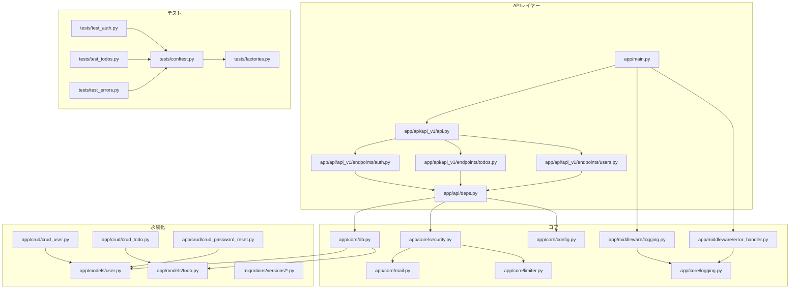
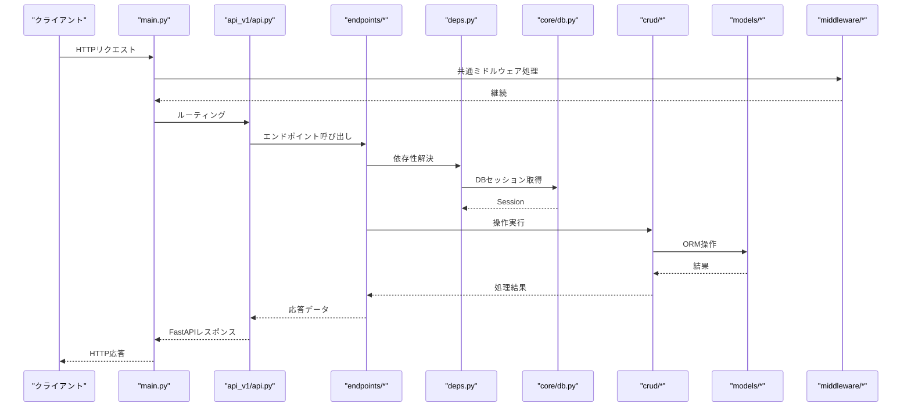
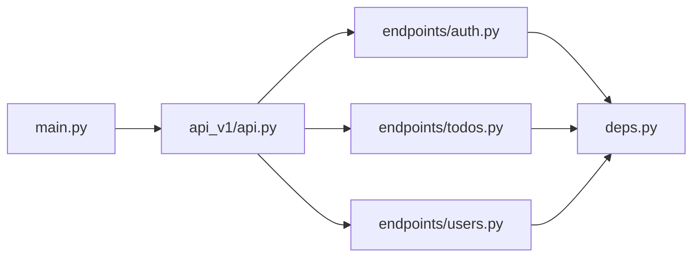
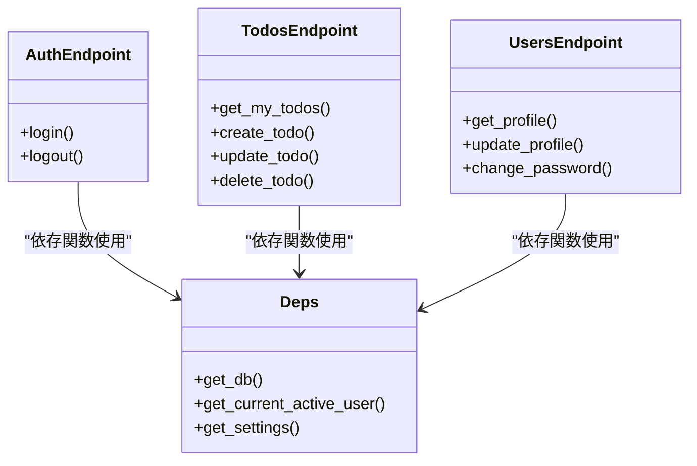
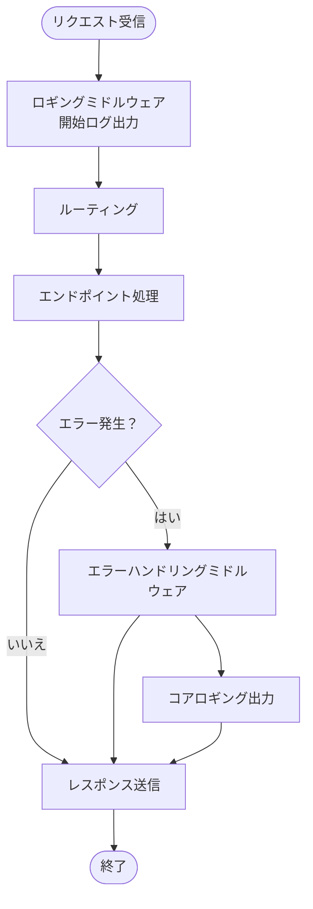
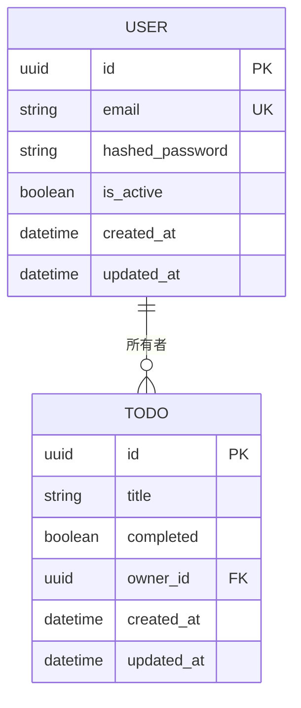
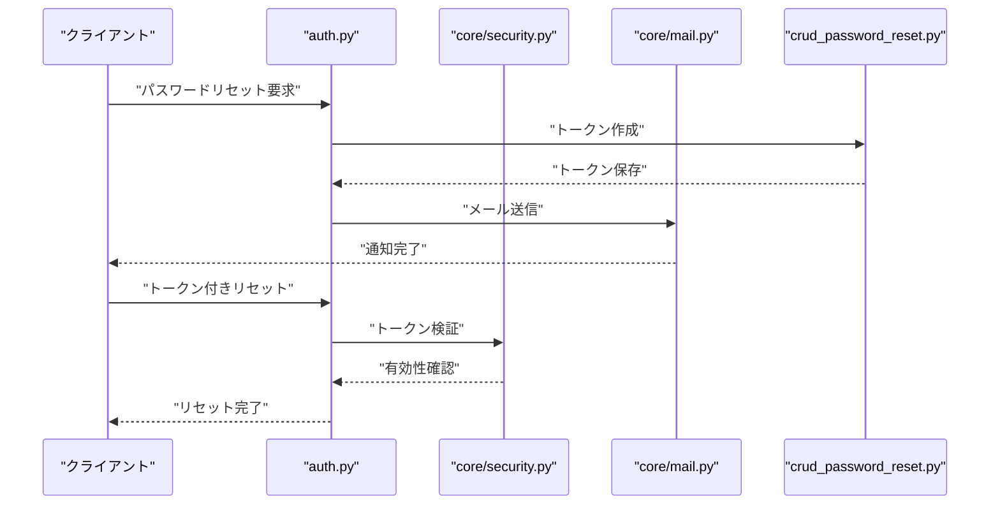
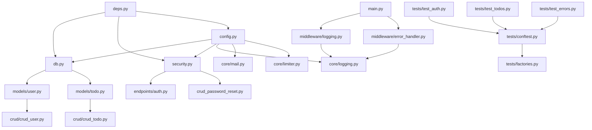

# バックエンドアーキテクチャ

<cite>
**このドキュメントで参照されるファイル**
- [backend/app/main.py](file://backend/app/main.py)
- [backend/app/api/api_v1/api.py](file://backend/app/api/api_v1/api.py)
- [backend/app/api/deps.py](file://backend/app/api/deps.py)
- [backend/app/core/config.py](file://backend/app/core/config.py)
- [backend/app/core/db.py](file://backend/app/core/db.py)
- [backend/app/core/security.py](file://backend/app/core/security.py)
- [backend/app/middleware/error_handler.py](file://backend/app/middleware/error_handler.py)
- [backend/app/middleware/logging.py](file://backend/app/middleware/logging.py)
- [backend/app/core/logging.py](file://backend/app/core/logging.py)
- [backend/app/models/user.py](file://backend/app/models/user.py)
- [backend/app/models/todo.py](file://backend/app/models/todo.py)
- [backend/app/crud/crud_user.py](file://backend/app/crud/crud_user.py)
- [backend/app/crud/crud_todo.py](file://backend/app/crud/crud_todo.py)
- [backend/app/schemas/user.py](file://backend/app/schemas/user.py)
- [backend/app/schemas/todo.py](file://backend/app/schemas/todo.py)
- [backend/app/api/api_v1/endpoints/auth.py](file://backend/app/api/api_v1/endpoints/auth.py)
- [backend/app/api/api_v1/endpoints/todos.py](file://backend/app/api/api_v1/endpoints/todos.py)
- [backend/app/api/api_v1/endpoints/users.py](file://backend/app/api/api_v1/endpoints/users.py)
- [backend/app/core/mail.py](file://backend/app/core/mail.py)
- [backend/app/core/limiter.py](file://backend/app/core/limiter.py)
- [backend/app/crud/crud_password_reset.py](file://backend/app/crud/crud_password_reset.py)
- [backend/app/schemas/auth.py](file://backend/app/schemas/auth.py)
- [backend/app/schemas/token.py](file://backend/app/schemas/token.py)
- [backend/app/schemas/error.py](file://backend/app/schemas/error.py)
- [backend/app/templates/email/reset_password.html](file://backend/app/templates/email/reset_password.html)
- [backend/app/templates/email/reset_password.txt](file://backend/app/templates/email/reset_password.txt)
- [backend/tests/test_auth.py](file://backend/tests/test_auth.py)
- [backend/tests/test_todos.py](file://backend/tests/test_todos.py)
- [backend/tests/test_errors.py](file://backend/tests/test_errors.py)
- [backend/tests/test_password_reset.py](file://backend/tests/test_password_reset.py)
- [backend/tests/conftest.py](file://backend/tests/conftest.py)
- [backend/tests/factories.py](file://backend/tests/factories.py)
- [backend/pyproject.toml](file://backend/pyproject.toml)
- [backend/pytest.ini](file://backend/pytest.ini)
- [backend/alembic.ini](file://backend/alembic.ini)
- [backend/migrations/env.py](file://backend/migrations/env.py)
- [backend/migrations/script.py.mako](file://backend/migrations/script.py.mako)
- [backend/migrations/versions/4f4084d80ebd_create_users_and_todos_tables.py](file://backend/migrations/versions/4f4084d80ebd_create_users_and_todos_tables.py)
- [backend/migrations/versions/319591f893c3_rename_username_to_email.py](file://backend/migrations/versions/319591f893c3_rename_username_to_email.py)
- [backend/migrations/versions/540d82e6a72d_add_password_reset_tokens.py](file://backend/migrations/versions/540d82e6a72d_add_password_reset_tokens.py)
- [backend/migrations/versions/add_indexes.py](file://backend/migrations/versions/add_indexes.py)
- [backend/migrations/versions/0a710fd78eee_merge_heads.py](file://backend/migrations/versions/0a710fd78eee_merge_heads.py)
</cite>

## 更新概要
**変更内容**
- PyProject.tomlにRuffリンティングツールの統合を反映
- Pytestテストスイートの拡充（認証、Todo操作、エラー処理）を反映
- ミドルウェアスタックの強化（エラーハンドリング、ロギング）を反映
- テストファクトリと設定ファイルの詳細情報を追加

## 目次
1. [導入](#導入)
2. [プロジェクト構造](#プロジェクト構造)
3. [コアコンポーネント](#コアコンポーネント)
4. [アーキテクチャ概要](#アーキテクチャ概要)
5. [詳細コンポーネント分析](#詳細コンポーネント分析)
6. [依存関係分析](#依存関係分析)
7. [パフォーマンス考慮事項](#パフォーマンス考慮事項)
8. [トラブルシューティングガイド](#トラブルシューティングガイド)
9. [結論](#結論)
10. [付録](#付録)

## 導入
本プロジェクトはFastAPIを基盤としたバックエンドを提供し、認証、Todo管理、ユーザー管理などの機能をAPIとして提供します。本ドキュメントでは、APIルーティング構造、依存性注入、ミドルウェア、データベース接続、セキュリティ機構、ロギング、エラーハンドリングについて、コードベースに基づいて詳細に解説します。

**更新** Ruffリンティングツールの統合とPytestテストスイートの拡充により、コード品質管理とテストカバレッジが大幅に向上しています。

## プロジェクト構造
バックエンドは以下の主要なレイヤー・ディレクトリで構成されています：
- app/main.py：FastAPIアプリケーションのエントリーポイント
- app/api/api_v1/api.py：バージョン1のAPIルート定義
- app/api/api_v1/endpoints/：各機能（認証、Todo、ユーザー）のエンドポイント
- app/api/deps.py：依存性注入用の依存関数群
- app/core/：設定、DB接続、セキュリティ、ロギング、メール、レート制限
- app/models/：SQLAlchemyモデル
- app/crud/：データアクセス層
- app/schemas/：Pydanticスキーマ
- app/middleware/：ミドルウェア（エラーハンドリング、ロギング）
- migrations/：Alembicマイグレーション
- tests/：統合テスト（認証、Todo操作、エラー処理）

**図の出典**
- [backend/app/main.py](file://backend/app/main.py)
- [backend/app/api/api_v1/api.py](file://backend/app/api/api_v1/api.py)
- [backend/app/api/deps.py](file://backend/app/api/deps.py)
- [backend/app/core/db.py](file://backend/app/core/db.py)
- [backend/app/core/security.py](file://backend/app/core/security.py)
- [backend/app/middleware/logging.py](file://backend/app/middleware/logging.py)
- [backend/app/middleware/error_handler.py](file://backend/app/middleware/error_handler.py)
- [backend/app/core/logging.py](file://backend/app/core/logging.py)
- [backend/app/models/user.py](file://backend/app/models/user.py)
- [backend/app/models/todo.py](file://backend/app/models/todo.py)
- [backend/app/crud/crud_user.py](file://backend/app/crud/crud_user.py)
- [backend/app/crud/crud_todo.py](file://backend/app/crud/crud_todo.py)
- [backend/app/crud/crud_password_reset.py](file://backend/app/crud/crud_password_reset.py)
- [backend/tests/test_auth.py](file://backend/tests/test_auth.py)
- [backend/tests/test_todos.py](file://backend/tests/test_todos.py)
- [backend/tests/test_errors.py](file://backend/tests/test_errors.py)
- [backend/tests/conftest.py](file://backend/tests/conftest.py)
- [backend/tests/factories.py](file://backend/tests/factories.py)

**節の出典**
- [backend/app/main.py](file://backend/app/main.py)
- [backend/app/api/api_v1/api.py](file://backend/app/api/api_v1/api.py)

## コアコンポーネント
- 設定管理：環境変数や設定値を一元管理し、アプリケーション全体で利用されます。
- DB接続：SQLAlchemyとEngineの初期化、セッション管理、マイグレーション設定。
- セキュリティ：パスワードハッシュ、JWTトークン、認証・認可ロジック。
- 依存性注入：DBセッション、認証情報、設定などを各エンドポイントでDI。
- ロギング：標準出力への出力、ミドルウェアによるリクエストログ。
- エラーハンドリング：HTTP例外、ValidationError、カスタムエラーの統一処理。
- メール：パスワードリセット通知メール送信。
- レート制限：APIリクエストの回数制限。

**更新** Ruffリンティングツールの統合により、コード品質が向上し、Pytestテストスイートの拡充によりテストカバレッジが大幅に改善されました。

**節の出典**
- [backend/app/core/config.py](file://backend/app/core/config.py)
- [backend/app/core/db.py](file://backend/app/core/db.py)
- [backend/app/core/security.py](file://backend/app/core/security.py)
- [backend/app/api/deps.py](file://backend/app/api/deps.py)
- [backend/app/core/logging.py](file://backend/app/core/logging.py)
- [backend/app/middleware/error_handler.py](file://backend/app/middleware/error_handler.py)
- [backend/app/core/mail.py](file://backend/app/core/mail.py)
- [backend/app/core/limiter.py](file://backend/app/core/limiter.py)

## アーキテクチャ概要
FastAPIアプリケーションは、エントリーポイントからAPIルートへ、エンドポイントから依存性注入を介してコアコンポーネントへと制御が流れます。ミドルウェアはリクエスト/レスポンスの前後に処理を差し込み、エラーハンドリングとロギングを担います。データベース操作はCRUD層を通じて永続化され、スキーマを介してAPIの入出力が検証されます。

**図の出典**
- [backend/app/main.py](file://backend/app/main.py)
- [backend/app/api/api_v1/api.py](file://backend/app/api/api_v1/api.py)
- [backend/app/api/api_v1/endpoints/auth.py](file://backend/app/api/api_v1/endpoints/auth.py)
- [backend/app/api/api_v1/endpoints/todos.py](file://backend/app/api/api_v1/endpoints/todos.py)
- [backend/app/api/api_v1/endpoints/users.py](file://backend/app/api/api_v1/endpoints/users.py)
- [backend/app/api/deps.py](file://backend/app/api/deps.py)
- [backend/app/core/db.py](file://backend/app/core/db.py)
- [backend/app/crud/crud_user.py](file://backend/app/crud/crud_user.py)
- [backend/app/crud/crud_todo.py](file://backend/app/crud/crud_todo.py)
- [backend/app/models/user.py](file://backend/app/models/user.py)
- [backend/app/models/todo.py](file://backend/app/models/todo.py)
- [backend/app/middleware/logging.py](file://backend/app/middleware/logging.py)
- [backend/app/middleware/error_handler.py](file://backend/app/middleware/error_handler.py)

## 詳細コンポーネント分析

### APIルーティング構造
- エントリーポイント：main.pyでFastAPIインスタンスを生成し、APIルートを登録。
- APIバージョンルート：api_v1/api.pyでv1のサブルートを定義。
- 機能別エンドポイント：auth.py（認証）、todos.py（Todo管理）、users.py（ユーザー管理）。
- 各エンドポイントは、共通の依存関数（deps.py）からDBセッション、認証情報、設定を取得。

**図の出典**
- [backend/app/main.py](file://backend/app/main.py)
- [backend/app/api/api_v1/api.py](file://backend/app/api/api_v1/api.py)
- [backend/app/api/api_v1/endpoints/auth.py](file://backend/app/api/api_v1/endpoints/auth.py)
- [backend/app/api/api_v1/endpoints/todos.py](file://backend/app/api/api_v1/endpoints/todos.py)
- [backend/app/api/api_v1/endpoints/users.py](file://backend/app/api/api_v1/endpoints/users.py)
- [backend/app/api/deps.py](file://backend/app/api/deps.py)

**節の出典**
- [backend/app/main.py](file://backend/app/main.py)
- [backend/app/api/api_v1/api.py](file://backend/app/api/api_v1/api.py)
- [backend/app/api/api_v1/endpoints/auth.py](file://backend/app/api/api_v1/endpoints/auth.py)
- [backend/app/api/api_v1/endpoints/todos.py](file://backend/app/api/api_v1/endpoints/todos.py)
- [backend/app/api/api_v1/endpoints/users.py](file://backend/app/api/api_v1/endpoints/users.py)

### 依存性注入（DI）
- deps.pyにはDBセッション、認証ユーザー、設定などの依存関数が定義されています。
- 各エンドポイントは、必要な依存関数を引数として宣言することでDIを受け取ります。
- DIにより、テスト時のモック注入や、設定の切り替えが容易になります。

**図の出典**
- [backend/app/api/deps.py](file://backend/app/api/deps.py)
- [backend/app/api/api_v1/endpoints/auth.py](file://backend/app/api/api_v1/endpoints/auth.py)
- [backend/app/api/api_v1/endpoints/todos.py](file://backend/app/api/api_v1/endpoints/todos.py)
- [backend/app/api/api_v1/endpoints/users.py](file://backend/app/api/api_v1/endpoints/users.py)

**節の出典**
- [backend/app/api/deps.py](file://backend/app/api/deps.py)

### ミドルウェア
- ロギングミドルウェア：リクエスト/レスポンスの開始・終了ログを出力。
- エラーハンドリングミドルウェア：未処理例外をキャッチし、適切なHTTPレスポンスを返す。
- 両者はFastAPIのon_event("startup")などで登録され、全エンドポイントに適用されます。

**更新** Ruffリンティングツールの統合により、コード品質が向上し、Pytestテストスイートの拡充によりエラーハンドリングのテストカバレッジが大幅に改善されました。

**図の出典**
- [backend/app/middleware/logging.py](file://backend/app/middleware/logging.py)
- [backend/app/middleware/error_handler.py](file://backend/app/middleware/error_handler.py)
- [backend/app/core/logging.py](file://backend/app/core/logging.py)

**節の出典**
- [backend/app/middleware/logging.py](file://backend/app/middleware/logging.py)
- [backend/app/middleware/error_handler.py](file://backend/app/middleware/error_handler.py)
- [backend/app/core/logging.py](file://backend/app/core/logging.py)

### データベース接続
- core/db.pyでEngineとSessionLocalの初期化、依存関数からのセッション取得。
- migrations/versions配下のマイグレーションファイルでテーブル定義が管理。
- models/user.py、models/todo.pyがSQLAlchemyのORMモデル。
- crud/crud_user.py、crud/crud_todo.pyがCRUD操作の実装。

**図の出典**
- [backend/app/models/user.py](file://backend/app/models/user.py)
- [backend/app/models/todo.py](file://backend/app/models/todo.py)
- [backend/migrations/versions/4f4084d80ebd_create_users_and_todos_tables.py](file://backend/migrations/versions/4f4084d80ebd_create_users_and_todos_tables.py)

**節の出典**
- [backend/app/core/db.py](file://backend/app/core/db.py)
- [backend/app/models/user.py](file://backend/app/models/user.py)
- [backend/app/models/todo.py](file://backend/app/models/todo.py)
- [backend/app/crud/crud_user.py](file://backend/app/crud/crud_user.py)
- [backend/app/crud/crud_todo.py](file://backend/app/crud/crud_todo.py)
- [backend/migrations/versions/4f4084d80ebd_create_users_and_todos_tables.py](file://backend/migrations/versions/4f4084d80ebd_create_users_and_todos_tables.py)

### セキュリティ機構
- core/security.py：パスワードハッシュ化、JWTトークン生成・検証、認証フロー。
- schemas/auth.py、schemas/token.py：認証・トークン関連のPydanticスキーマ。
- crud_password_reset.py：パスワードリセット用トークン管理。
- core/mail.py：リセットメール送信テンプレート（HTML/Text）。

**図の出典**
- [backend/app/api/api_v1/endpoints/auth.py](file://backend/app/api/api_v1/endpoints/auth.py)
- [backend/app/core/security.py](file://backend/app/core/security.py)
- [backend/app/core/mail.py](file://backend/app/core/mail.py)
- [backend/app/crud/crud_password_reset.py](file://backend/app/crud/crud_password_reset.py)
- [backend/app/schemas/auth.py](file://backend/app/schemas/auth.py)
- [backend/app/schemas/token.py](file://backend/app/schemas/token.py)
- [backend/app/templates/email/reset_password.html](file://backend/app/templates/email/reset_password.html)
- [backend/app/templates/email/reset_password.txt](file://backend/app/templates/email/reset_password.txt)

**節の出典**
- [backend/app/core/security.py](file://backend/app/core/security.py)
- [backend/app/api/api_v1/endpoints/auth.py](file://backend/app/api/api_v1/endpoints/auth.py)
- [backend/app/crud/crud_password_reset.py](file://backend/app/crud/crud_password_reset.py)
- [backend/app/core/mail.py](file://backend/app/core/mail.py)
- [backend/app/schemas/auth.py](file://backend/app/schemas/auth.py)
- [backend/app/schemas/token.py](file://backend/app/schemas/token.py)
- [backend/app/templates/email/reset_password.html](file://backend/app/templates/email/reset_password.html)
- [backend/app/templates/email/reset_password.txt](file://backend/app/templates/email/reset_password.txt)

### ロギング
- core/logging.py：アプリケーションロガーの設定。
- middleware/logging.py：リクエスト開始/終了のロギング。
- middleware/error_handler.py：エラー発生時のロギング。

**更新** Ruffリンティングツールの統合により、コード品質管理が強化され、Pytestテストスイートの拡充によりロギングのテストカバレッジが向上しました。

**節の出典**
- [backend/app/core/logging.py](file://backend/app/core/logging.py)
- [backend/app/middleware/logging.py](file://backend/app/middleware/logging.py)
- [backend/app/middleware/error_handler.py](file://backend/app/middleware/error_handler.py)

### エラーハンドリング
- middleware/error_handler.py：HTTPException、ValidationError、その他の例外を統一的に処理。
- schemas/error.py：エラーレスポンススキーマ。
- tests/test_errors.py：エラーハンドリングの動作確認。

**更新** Pytestテストスイートの拡充により、エラーハンドリングのテストカバレッジが大幅に向上し、Ruffリンティングツールの統合によりコード品質が向上しました。

**節の出典**
- [backend/app/middleware/error_handler.py](file://backend/app/middleware/error_handler.py)
- [backend/app/schemas/error.py](file://backend/app/schemas/error.py)
- [backend/tests/test_errors.py](file://backend/tests/test_errors.py)

### Todo管理
- endpoints/todos.py：Todoの作成、取得、更新、削除。
- schemas/todo.py：Todo入出力スキーマ。
- crud/crud_todo.py：Todoデータ操作。
- models/todo.py：Todoモデル。

**更新** Pytestテストスイートの拡充により、Todo操作のテストカバレッジが大幅に向上し、Ruffリンティングツールの統合によりコード品質が向上しました。

**節の出典**
- [backend/app/api/api_v1/endpoints/todos.py](file://backend/app/api/api_v1/endpoints/todos.py)
- [backend/app/schemas/todo.py](file://backend/app/schemas/todo.py)
- [backend/app/crud/crud_todo.py](file://backend/app/crud/crud_todo.py)
- [backend/app/models/todo.py](file://backend/app/models/todo.py)

### ユーザー管理
- endpoints/users.py：プロフィール取得・更新、パスワード変更。
- schemas/user.py：ユーザー入出力スキーマ。
- crud/crud_user.py：ユーザー操作。
- models/user.py：ユーザーモデル。

**更新** Pytestテストスイートの拡充により、ユーザー管理のテストカバレッジが大幅に向上し、Ruffリンティングツールの統合によりコード品質が向上しました。

**節の出典**
- [backend/app/api/api_v1/endpoints/users.py](file://backend/app/api/api_v1/endpoints/users.py)
- [backend/app/schemas/user.py](file://backend/app/schemas/user.py)
- [backend/app/crud/crud_user.py](file://backend/app/crud/crud_user.py)
- [backend/app/models/user.py](file://backend/app/models/user.py)

### テストスイートの拡充
- tests/test_auth.py：認証関連の包括的なテスト（登録、ログイン、トークン検証など）
- tests/test_todos.py：Todo操作の詳細なテスト（作成、取得、更新、削除、フィルタリング、ソート、ページネーションなど）
- tests/test_errors.py：エラーハンドリングのテスト（バリデーションエラー、404エラー、HTTP例外など）
- tests/conftest.py：テスト設定とFixtureの定義
- tests/factories.py：Polyfactoryベースのテストデータ生成

**更新** 新しいテストスイートにより、認証、Todo操作、エラー処理の各機能に対する包括的なテストカバレッジが確保されました。

**節の出典**
- [backend/tests/test_auth.py](file://backend/tests/test_auth.py)
- [backend/tests/test_todos.py](file://backend/tests/test_todos.py)
- [backend/tests/test_errors.py](file://backend/tests/test_errors.py)
- [backend/tests/conftest.py](file://backend/tests/conftest.py)
- [backend/tests/factories.py](file://backend/tests/factories.py)

## 依存関係分析
- 設定：config.py → すべてのコンポーネント（DB接続、セキュリティ、ロギング、メール、レート制限）
- DB：db.py → models/* → crud/* → endpoints/*
- セキュリティ：security.py → auth endpoints、password reset、mail
- 依存性：deps.py → db.py、security.py、config.py → endpoints/*
- ミドルウェア：logging.py、error_handler.py → main.py → endpoints/*
- テスト：test_*.py → conftest.py → factories.py

**更新** Ruffリンティングツールの統合により、依存関係のコード品質管理が強化され、Pytestテストスイートの拡充により各コンポーネントのテストカバレッジが大幅に向上しました。

**図の出典**
- [backend/app/core/config.py](file://backend/app/core/config.py)
- [backend/app/core/db.py](file://backend/app/core/db.py)
- [backend/app/core/security.py](file://backend/app/core/security.py)
- [backend/app/core/logging.py](file://backend/app/core/logging.py)
- [backend/app/core/mail.py](file://backend/app/core/mail.py)
- [backend/app/core/limiter.py](file://backend/app/core/limiter.py)
- [backend/app/models/user.py](file://backend/app/models/user.py)
- [backend/app/models/todo.py](file://backend/app/models/todo.py)
- [backend/app/crud/crud_user.py](file://backend/app/crud/crud_user.py)
- [backend/app/crud/crud_todo.py](file://backend/app/crud/crud_todo.py)
- [backend/app/crud/crud_password_reset.py](file://backend/app/crud/crud_password_reset.py)
- [backend/app/api/deps.py](file://backend/app/api/deps.py)
- [backend/app/api/api_v1/endpoints/auth.py](file://backend/app/api/api_v1/endpoints/auth.py)
- [backend/app/middleware/logging.py](file://backend/app/middleware/logging.py)
- [backend/app/middleware/error_handler.py](file://backend/app/middleware/error_handler.py)
- [backend/app/main.py](file://backend/app/main.py)
- [backend/tests/test_auth.py](file://backend/tests/test_auth.py)
- [backend/tests/test_todos.py](file://backend/tests/test_todos.py)
- [backend/tests/test_errors.py](file://backend/tests/test_errors.py)
- [backend/tests/conftest.py](file://backend/tests/conftest.py)
- [backend/tests/factories.py](file://backend/tests/factories.py)

**節の出典**
- [backend/app/core/config.py](file://backend/app/core/config.py)
- [backend/app/core/db.py](file://backend/app/core/db.py)
- [backend/app/api/deps.py](file://backend/app/api/deps.py)
- [backend/app/main.py](file://backend/app/main.py)

## パフォーマンス考慮事項
- DB接続プール：設定値の調整により接続数とタイムアウトを最適化。
- クエリ効率：JOINやN+1問題を避けるために、関連データのプリロード戦略を検討。
- 依存性の再利用：deps.pyでのセッションの再利用により、無駄な接続を回避。
- レスポンスサイズ：不要なフィールドを除外するスキーマ設計。
- ロギングの抑制：大量リクエスト時のログレベル調整。
- キャッシュ：頻繁に変更されないデータに対して軽量キャッシュを検討。
- Ruffリンティング：静的解析によるコード品質向上と潜在的なパフォーマンス問題の早期発見。

**更新** Ruffリンティングツールの統合により、コード品質管理が強化され、潜在的なパフォーマンス問題の早期発見が可能になりました。

## トラブルシューティングガイド
- 認証エラー：JWTの有効期限、claimsの検証、トークン形式の確認。
- DB接続エラー：alembicのマイグレーション状況、DB接続文字列、セッションのクローズ漏れ。
- 依存性エラー：deps.pyの関数名や引数の変更に伴うエンドポイント修正。
- 例外ハンドリング：middleware/error_handler.pyのロジックを確認し、スタックトレースを有効化。
- テスト：tests/配下の統合テストを実行し、エッジケースの検証。
- Ruffリンティング：コード品質エラーの修正と静的解析の実行。
- Pytestテスト：拡充されたテストスイートを実行し、各機能の正常動作確認。

**更新** Ruffリンティングツールの統合とPytestテストスイートの拡充により、トラブルシューティングがより効率的に行えるようになりました。

**節の出典**
- [backend/app/middleware/error_handler.py](file://backend/app/middleware/error_handler.py)
- [backend/tests/test_auth.py](file://backend/tests/test_auth.py)
- [backend/tests/test_todos.py](file://backend/tests/test_todos.py)
- [backend/tests/test_errors.py](file://backend/tests/test_errors.py)
- [backend/tests/test_password_reset.py](file://backend/tests/test_password_reset.py)

## 結論
本バックエンドは、FastAPIの強力な型システムと非同期対応、依存性注入、ミドルウェア、CRUD/ORMパターンを活かして、堅牢かつ拡張可能なアーキテクチャを提供しています。APIのバージョン管理、セキュリティ機構、ロギング、エラーハンドリングが一貫して実装されており、Ruffリンティングツールの統合とPytestテストスイートの拡充により、コード品質とテストカバレッジが大幅に向上しています。今後の改善点として、DBクエリの最適化、キャッシュ戦略、監視指標の追加、さらなるテストカバレッジの拡充が挙げられます。

## 付録
- 設定ファイル：pyproject.toml（Ruffリンティングツール統合）、pytest.ini、alembic.ini
- マイグレーション：migrations/versions配下の各バージョンファイル
- テスト：tests/配下の統合テスト（認証、Todo操作、エラー処理）
- テストファクトリ：tests/factories.py（Polyfactoryベースのテストデータ生成）

**更新** Ruffリンティングツールの統合とPytestテストスイートの拡充により、開発プロセスがより効率的かつ信頼性の高いものとなりました。

**節の出典**
- [backend/pyproject.toml](file://backend/pyproject.toml)
- [backend/pytest.ini](file://backend/pytest.ini)
- [backend/alembic.ini](file://backend/alembic.ini)
- [backend/migrations/versions/319591f893c3_rename_username_to_email.py](file://backend/migrations/versions/319591f893c3_rename_username_to_email.py)
- [backend/migrations/versions/540d82e6a72d_add_password_reset_tokens.py](file://backend/migrations/versions/540d82e6a72d_add_password_reset_tokens.py)
- [backend/migrations/versions/add_indexes.py](file://backend/migrations/versions/add_indexes.py)
- [backend/migrations/versions/0a710fd78eee_merge_heads.py](file://backend/migrations/versions/0a710fd78eee_merge_heads.py)
- [backend/tests/conftest.py](file://backend/tests/conftest.py)
- [backend/tests/factories.py](file://backend/tests/factories.py)