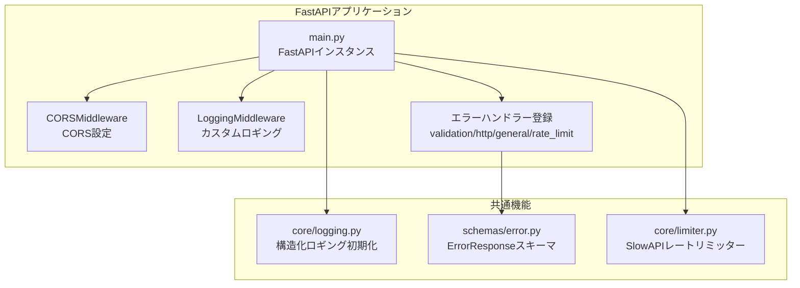
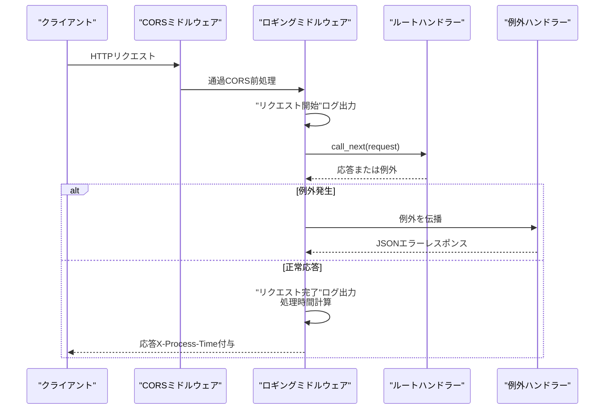
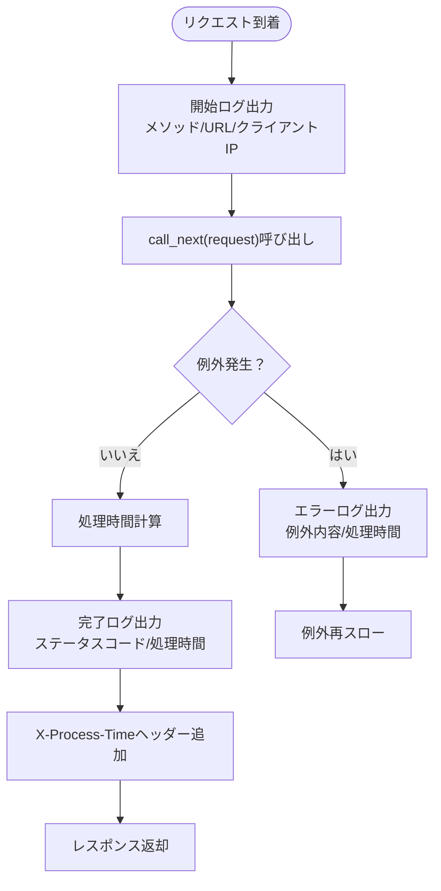
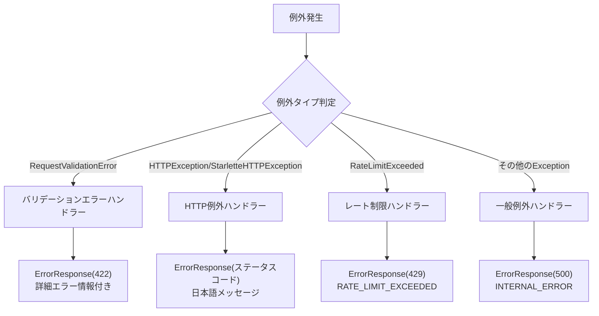
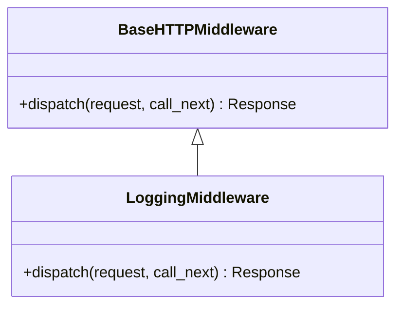
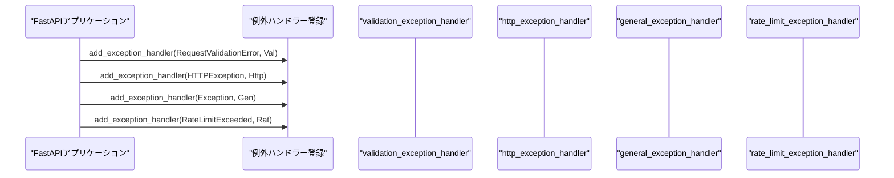
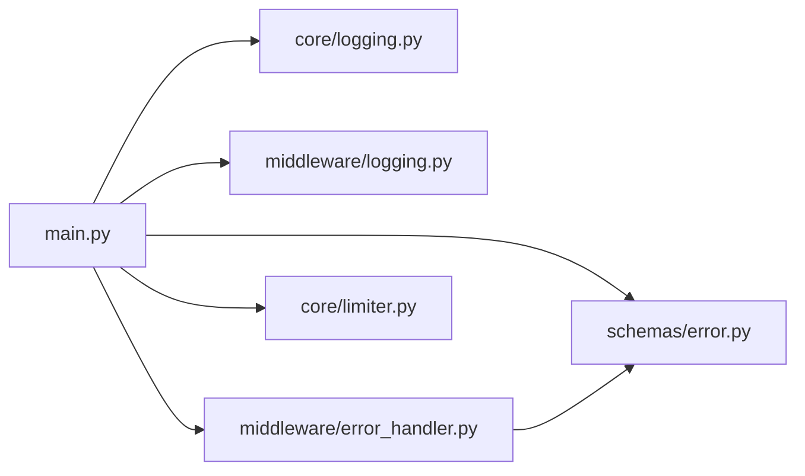

# ミドルウェアスタック

<cite>
**この文書で参照されたファイル**
- [backend/app/main.py](file://backend/app/main.py)
- [backend/app/middleware/logging.py](file://backend/app/middleware/logging.py)
- [backend/app/middleware/error_handler.py](file://backend/app/middleware/error_handler.py)
- [backend/app/core/logging.py](file://backend/app/core/logging.py)
- [backend/app/schemas/error.py](file://backend/app/schemas/error.py)
- [backend/app/core/limiter.py](file://backend/app/core/limiter.py)
- [backend/tests/test_errors.py](file://backend/tests/test_errors.py)
</cite>

## 目次
1. [はじめに](#はじめに)
2. [プロジェクト構造](#プロジェクト構造)
3. [コアコンポーネント](#コアコンポーネント)
4. [アーキテクチャ概観](#アーキテクチャ概観)
5. [詳細なコンポーネント分析](#詳細なコンポーネント分析)
6. [依存関係分析](#依存関係分析)
7. [パフォーマンス考慮事項](#パフォーマンス考慮事項)
8. [トラブルシューティングガイド](#トラブルシューティングガイド)
9. [結論](#結論)

## はじめに
本ドキュメントは、FastAPIにおけるミドルウェアスタックの設計と実装について説明します。特に、エラーハンドリングミドルウェアとロギングミドルウェアの役割、実行順序、処理フローに焦点を当て、FastAPIのミドルウェア仕組みとカスタムミドルウェアの作成方法を実例とともに解説します。

## プロジェクト構造
バックエンドアプリケーションは以下のモジュール構成で構成されています：
- アプリケーションエントリーポイント：FastAPIアプリケーションの定義、ミドルウェアの登録、例外ハンドラーの設定
- ミドルウェア：ロギングミドルウェア（カスタム）とCORSミドルウェア（FastAPI標準）
- カスタムエラーハンドリング：Pydanticバリデーションエラー、HTTP例外、一般例外、レート制限超過に対応
- 共通ロギング：構造化JSONロギングの初期化
- エラーレスポンススキーマ：統一されたエラーレスポンスフォーマット

**図の出典**
- [backend/app/main.py:104-128](file://backend/app/main.py#L104-L128)
- [backend/app/core/logging.py:6-35](file://backend/app/core/logging.py#L6-L35)
- [backend/app/schemas/error.py:5-23](file://backend/app/schemas/error.py#L5-L23)
- [backend/app/core/limiter.py:1-6](file://backend/app/core/limiter.py#L1-L6)

**節の出典**
- [backend/app/main.py:1-168](file://backend/app/main.py#L1-L168)

## コアコンポーネント
- FastAPIアプリケーション：起動・停止時のライフサイクル管理、OpenAPIカスタマイズ、ルーターのinclude、ヘルスチェックエンドポイント
- CORSミドルウェア：クロスオリジンリクエストの許可設定（本番環境での設定必須）
- ロギングミドルウェア（カスタム）：リクエスト開始/完了ログ、処理時間計測、レスポンスヘッダーへの埋め込み
- エラーハンドリング：バリデーションエラー、HTTP例外、一般例外、レート制限超過に対応する4つのハンドラー
- 構造化ロギング：JSONフォーマットでの出力、アプリケーションロガーの設定
- エラーレスポンススキーマ：統一されたエラーレスポンスの構造

**節の出典**
- [backend/app/main.py:28-48](file://backend/app/main.py#L28-L48)
- [backend/app/main.py:66-71](file://backend/app/main.py#L66-L71)
- [backend/app/main.py:104-118](file://backend/app/main.py#L104-L118)
- [backend/app/core/logging.py:6-35](file://backend/app/core/logging.py#L6-L35)
- [backend/app/schemas/error.py:5-23](file://backend/app/schemas/error.py#L5-L23)

## アーキテクチャ概観
ミドルウェアスタックの実行順序は以下の通りです：
1. CORSミドルウェア（FastAPI標準）
2. ロギングミドルウェア（カスタム）
3. ルートハンドラー（APIエンドポイント）
4. 例外ハンドラー（カスタム）

**図の出典**
- [backend/app/main.py:104-118](file://backend/app/main.py#L104-L118)
- [backend/app/middleware/logging.py:15-66](file://backend/app/middleware/logging.py#L15-L66)
- [backend/app/middleware/error_handler.py:15-104](file://backend/app/middleware/error_handler.py#L15-L104)

## 詳細なコンポーネント分析

### ロギングミドルウェア（カスタム）
- 動作概要：リクエスト受信時に開始ログを出力し、call_nextを通じて次の処理へ渡す。正常応答時は完了ログを出力し、レスポンスヘッダーに処理時間を追加。例外発生時はエラーログを出力し、例外を再スロー。
- 処理フロー：

**図の出典**
- [backend/app/middleware/logging.py:15-66](file://backend/app/middleware/logging.py#L15-L66)

**節の出典**
- [backend/app/middleware/logging.py:10-66](file://backend/app/middleware/logging.py#L10-L66)

### エラーハンドリングミドルウェア（カスタム）
- 動作概要：FastAPIのadd_exception_handlerを通じて登録された4つのハンドラーが、バリデーションエラー、HTTP例外、一般例外、レート制限超過に対応。
- 各ハンドラーの役割：
  - バリデーションエラー：Pydanticバリデーションエラーを整形し、統一されたErrorResponse形式で返却。
  - HTTP例外：HTTPExceptionおよびStarletteのHTTPExceptionに対応し、ステータスコードに応じた日本語メッセージを設定。
  - 一般例外：未捕捉の予期しないエラーを500エラーとして返却。
  - レート制限超過：SlowAPIによるレート制限超過を429エラーとして返却。

**図の出典**
- [backend/app/middleware/error_handler.py:15-148](file://backend/app/middleware/error_handler.py#L15-L148)

**節の出典**
- [backend/app/middleware/error_handler.py:15-148](file://backend/app/middleware/error_handler.py#L15-L148)

### FastAPIのミドルウェア仕組みとカスタムミドルウェアの作成方法
- 仕組み：FastAPIはStarletteベースであり、ミドルウェアはリクエスト/レスポンスをラップする関数またはクラスとして実装される。dispatchメソッド内でcall_next(request)を呼び出すことで、次のミドルウェアまたはルートハンドラーに処理を渡す。
- 作成手順：
  1. BaseHTTPMiddlewareを継承したクラスを作成
  2. dispatchメソッドを実装し、前処理・call_next・後処理を記述
  3. app.add_middlewareで登録
- 実装例：backend/app/middleware/logging.pyのLoggingMiddleware

**図の出典**
- [backend/app/middleware/logging.py:10-15](file://backend/app/middleware/logging.py#L10-L15)

**節の出典**
- [backend/app/middleware/logging.py:10-15](file://backend/app/middleware/logging.py#L10-L15)

### 例外ハンドラーの登録フロー
- 登録場所：backend/app/main.pyでapp.add_exception_handlerを使用して各例外タイプに対応するハンドラーを登録。
- 登録順序：バリデーションエラー → HTTP例外 → 一般例外 → レート制限超過

**図の出典**
- [backend/app/main.py:66-71](file://backend/app/main.py#L66-L71)

**節の出典**
- [backend/app/main.py:66-71](file://backend/app/main.py#L66-L71)

## 依存関係分析
- 外部依存：FastAPI、Starlette、SlowAPI（レートリミッター）、python-json-logger（構造化ロギング）
- 内部依存：
  - main.pyがcore/logging.py、middleware/logging.py、middleware/error_handler.py、schemas/error.py、core/limiter.pyをインポート
  - error_handler.pyがErrorResponseスキーマを使用

**図の出典**
- [backend/app/main.py:1-26](file://backend/app/main.py#L1-L26)
- [backend/app/middleware/error_handler.py](file://backend/app/middleware/error_handler.py#L10)

**節の出典**
- [backend/app/main.py:1-26](file://backend/app/main.py#L1-L26)
- [backend/app/middleware/error_handler.py:1-12](file://backend/app/middleware/error_handler.py#L1-L12)

## パフォーマンス考慮事項
- 処理時間の計測：ロギングミドルウェアでリクエストごとの処理時間を計測し、レスポンスヘッダーにX-Process-Timeを追加することで、パフォーマンス監視が容易になる。
- レートリミッター：SlowAPIを使用してリクエスト数を制限し、サービスの安定性を維持。
- ログ出力：構造化JSONロギングにより、外部監視ツールでの解析が効率的になる。

[この節は一般的なガイダンスを提供しており、特定のファイルを直接分析していません]

## トラブルシューティングガイド
- CORSエラー：本番環境ではBACKEND_CORS_ORIGINSが設定されているか確認。設定されていない場合、起動時にRuntimeErrorが発生。
- 404エラー：存在しないエンドポイントにアクセスするとHTTP例外が発生し、エラーハンドラーによって統一された404エラーが返却。
- 422エラー：Pydanticバリデーションエラーにより、詳細なフィールド名とエラーメッセージが含まれる422エラーが返却。
- 429エラー：SlowAPIのレートリミッターにより超過すると、RATE_LIMIT_EXCEEDEDエラーが返却。
- 500エラー：未捕捉の例外はGENERAL例外ハンドラーによって500エラーとして返却され、ログにもエラー内容が記録される。

**節の出典**
- [backend/app/main.py:106-107](file://backend/app/main.py#L106-L107)
- [backend/app/middleware/error_handler.py:52-76](file://backend/app/middleware/error_handler.py#L52-L76)
- [backend/app/middleware/error_handler.py:125-148](file://backend/app/middleware/error_handler.py#L125-L148)
- [backend/tests/test_errors.py:34-37](file://backend/tests/test_errors.py#L34-L37)

## 結論
本プロジェクトでは、FastAPIのミドルウェアスタックを活用して、CORS対応、カスタムロギング、統一されたエラーハンドリングを実現しています。ロギングミドルウェアはリクエストの流れ全体を可視化し、エラーハンドリングミドルウェアはバリデーションエラー、HTTP例外、一般例外、レート制限超過に対して一貫した応答を提供します。これにより、運用・保守性の高いAPIサービスを実現しています。