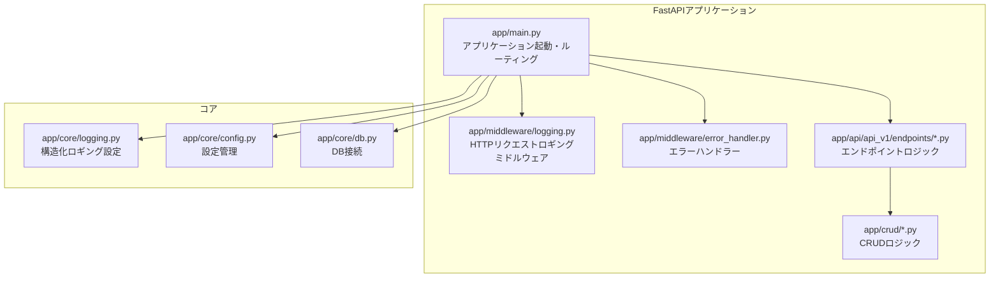
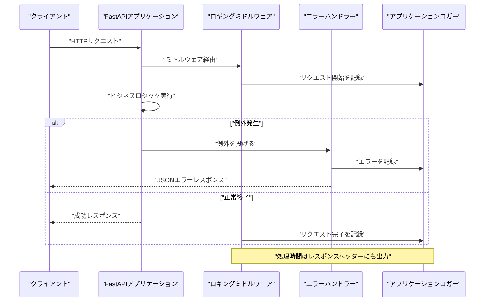
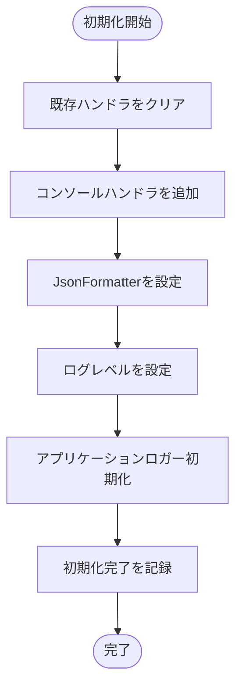
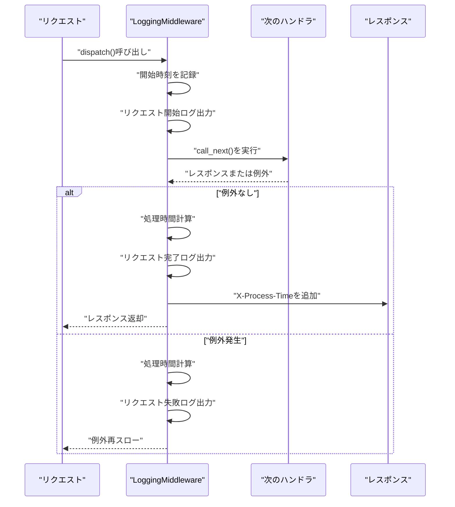
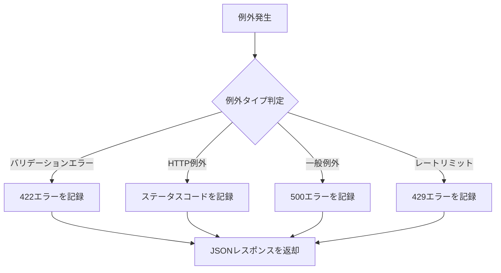
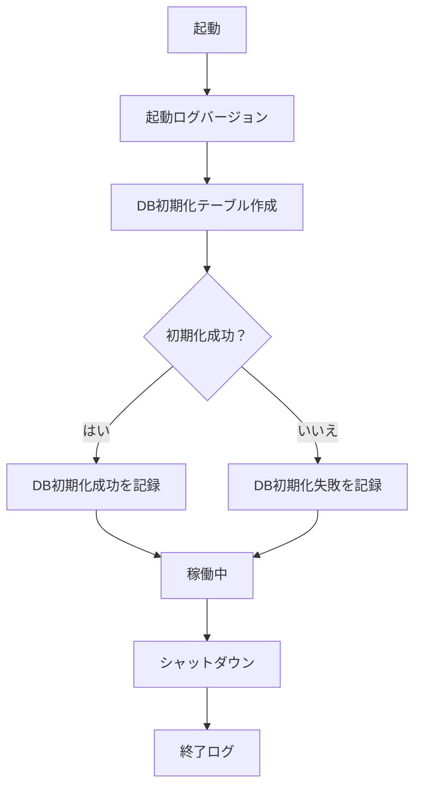
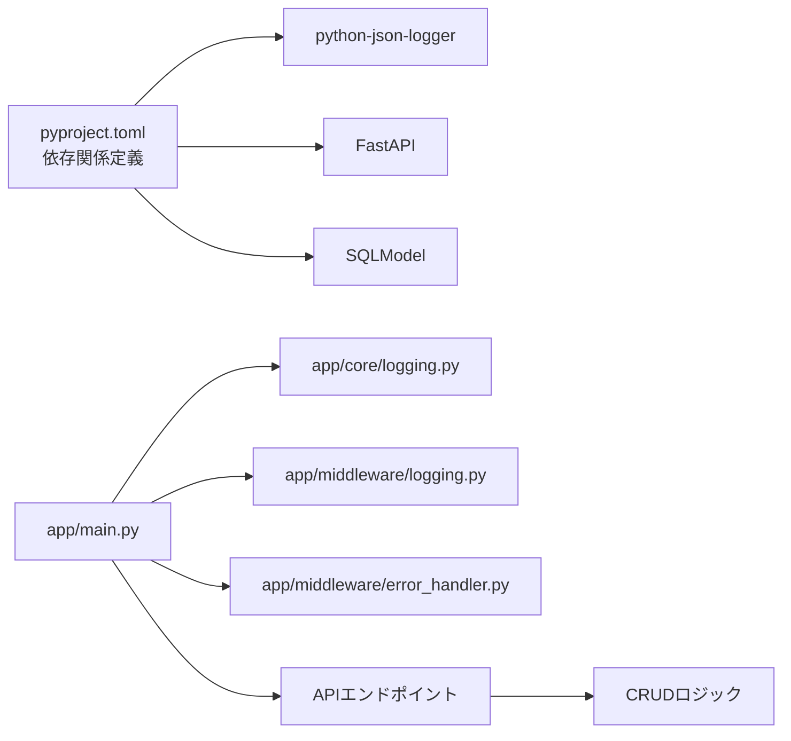

# ロギングと監視

<cite>
**この文書で参照されるファイル**
- [backend/app/core/logging.py](file://backend/app/core/logging.py)
- [backend/app/middleware/logging.py](file://backend/app/middleware/logging.py)
- [backend/app/middleware/error_handler.py](file://backend/app/middleware/error_handler.py)
- [backend/app/main.py](file://backend/app/main.py)
- [backend/app/api/api_v1/endpoints/auth.py](file://backend/app/api/api_v1/endpoints/auth.py)
- [backend/app/api/api_v1/endpoints/todos.py](file://backend/app/api/api_v1/endpoints/todos.py)
- [backend/app/crud/crud_user.py](file://backend/app/crud/crud_user.py)
- [backend/pyproject.toml](file://backend/pyproject.toml)
- [docker-compose.yml](file://docker-compose.yml)
- [backend/tests/conftest.py](file://backend/tests/conftest.py)
- [backend/tests/test_auth.py](file://backend/tests/test_auth.py)
- [backend/tests/test_errors.py](file://backend/tests/test_errors.py)
</cite>

## 更新履歴
**変更内容**
- トレースIDの実装方法に関するセクションを削除（verbose_logger.goが削除されたため）
- 関連するコード例と図式を更新
- トレースIDの概念的な説明を削除

## 目次
1. [はじめに](#はじめに)
2. [プロジェクト構造](#プロジェクト構造)
3. [コアコンポーネント](#コアコンポーネント)
4. [アーキテクチャ概要](#アーキテクチャ概要)
5. [詳細コンポーネント解析](#詳細コンポーネント解析)
6. [依存関係分析](#依存関係分析)
7. [パフォーマンス考慮事項](#パフォーマンス考慮事項)
8. [トラブルシューティングガイド](#トラブルシューティングガイド)
9. [結論](#結論)

## はじめに
本ドキュメントは、Todo APIプロジェクトにおける「構造化ロギングの設計と実装」について解説します。具体的には、以下のトピックを網羅的に扱います：
- ログレベルの設定方法
- 構造化ログフォーマットのカスタマイズ
- 監視ツールとの連携方法
- パフォーマンスモニタリングの実装
- エラーレポートの仕組み

本設計はFastAPIアプリケーション全体に適用され、ミドルウェア、エラーハンドラー、ビジネスロジック層にわたる一貫したログ出力を実現しています。

## プロジェクト構造
バックエンドはPython/AsyncIOベースのFastAPIアプリケーションであり、以下のレイヤーで構成されています：
- 設定管理：環境変数から設定を読み込み、DB接続やCORS、レートリミットなどを管理
- API層：認証、TODO管理などのエンドポイント
- 中間層：ロギングミドルウェア、エラーハンドラー
- 核心部：構造化ロギング設定、DB接続、セキュリティユーティリティ
- CRUD層：データアクセスロジック
- テスト：Pytestによる統合・単体テスト

**図の出典**
- [backend/app/main.py:1-183](file://backend/app/main.py#L1-L183)
- [backend/app/middleware/logging.py:1-67](file://backend/app/middleware/logging.py#L1-L67)
- [backend/app/middleware/error_handler.py:1-135](file://backend/app/middleware/error_handler.py#L1-L135)
- [backend/app/api/api_v1/endpoints/auth.py:1-117](file://backend/app/api/api_v1/endpoints/auth.py#L1-L117)
- [backend/app/api/api_v1/endpoints/todos.py:1-102](file://backend/app/api/api_v1/endpoints/todos.py#L1-L102)
- [backend/app/crud/crud_user.py:1-28](file://backend/app/crud/crud_user.py#L1-L28)
- [backend/app/core/logging.py:1-36](file://backend/app/core/logging.py#L1-L36)
- [backend/app/core/config.py:1-91](file://backend/app/core/config.py#L1-L91)

**節の出典**
- [backend/app/main.py:1-183](file://backend/app/main.py#L1-L183)
- [backend/app/core/config.py:1-91](file://backend/app/core/config.py#L1-L91)

## コアコンポーネント
- 構造化ロギング設定
  - Python標準ライブラリのloggingとpython-json-loggerを使用
  - JSONフォーマットで出力し、コンソールに標準出力へ
  - ログレベルは引数で設定可能（デフォルト：INFO）
  - 初期化時にアプリケーションロガーも設定
  - 参考：[backend/app/core/logging.py:1-36](file://backend/app/core/logging.py#L1-L36)

- HTTPリクエストロギングミドルウェア
  - 各リクエストの開始/完了/エラーをJSONで記録
  - 処理時間（秒）をレスポンスヘッダーにも出力
  - 参考：[backend/app/middleware/logging.py:1-67](file://backend/app/middleware/logging.py#L1-L67)

- エラーハンドラー
  - 入力バリデーションエラー、HTTP例外、一般例外、レートリミット超過を一元管理
  - すべてのエラーを警告またはエラーとしてJSONで記録
  - 参考：[backend/app/middleware/error_handler.py:1-135](file://backend/app/middleware/error_handler.py#L1-L135)

- アプリケーションライフサイクルロギング
  - 起動・シャットダウン・ヘルスチェック結果をJSONで記録
  - 参考：[backend/app/main.py:34-47](file://backend/app/main.py#L34-L47)、[backend/app/main.py:178-183](file://backend/app/main.py#L178-L183)

**節の出典**
- [backend/app/core/logging.py:1-36](file://backend/app/core/logging.py#L1-L36)
- [backend/app/middleware/logging.py:1-67](file://backend/app/middleware/logging.py#L1-L67)
- [backend/app/middleware/error_handler.py:1-135](file://backend/app/middleware/error_handler.py#L1-L135)
- [backend/app/main.py:34-47](file://backend/app/main.py#L34-L47)
- [backend/app/main.py:178-183](file://backend/app/main.py#L178-L183)

## アーキテクチャ概要
以下は、リクエスト処理フローにおけるロギングの流れです。ミドルウェアがリクエストを補足し、エラーハンドラーが例外発生時に記録し、アプリケーションロガーが起動・シャットダウン・ヘルスチェックを記録します。

**図の出典**
- [backend/app/middleware/logging.py:15-66](file://backend/app/middleware/logging.py#L15-L66)
- [backend/app/middleware/error_handler.py:15-134](file://backend/app/middleware/error_handler.py#L15-L134)
- [backend/app/main.py:34-47](file://backend/app/main.py#L34-L47)

## 詳細コンポーネント解析

### 構造化ロギング設定（core.logging）
- JSONフォーマットの出力項目
  - 時刻、ロガー名、ログレベル、メッセージ、ファイル名、関数名、行番号
- 出力先
  - 標準出力（コンソール）
- 設定内容
  - 既存ハンドラのクリア
  - JsonFormatterの設定
  - ログレベルの設定（引数で指定可能）
  - アプリケーションロガーの初期化

**図の出典**
- [backend/app/core/logging.py:6-35](file://backend/app/core/logging.py#L6-L35)

**節の出典**
- [backend/app/core/logging.py:1-36](file://backend/app/core/logging.py#L1-L36)

### HTTPリクエストロギングミドルウェア（middleware.logging）
- 記録内容
  - 開始時：メソッド、URL、クライアントIP
  - 完了時：ステータスコード、処理時間
  - エラー時：エラーメッセージ、処理時間
- 処理時間の追加
  - X-Process-Timeレスポンスヘッダーに処理時間を付与

**図の出典**
- [backend/app/middleware/logging.py:15-66](file://backend/app/middleware/logging.py#L15-L66)

**節の出典**
- [backend/app/middleware/logging.py:1-67](file://backend/app/middleware/logging.py#L1-L67)

### エラーハンドラー（middleware.error_handler）
- 対応する例外種類
  - 入力バリデーションエラー（422）
  - HTTP例外（4xx/5xx）
  - 一般例外（500）
  - レートリミット超過（429）
- 記録内容
  - URL、メソッド、ステータスコード、エラー詳細
  - 例外発生時の詳細情報（exc_info=True）

**図の出典**
- [backend/app/middleware/error_handler.py:15-134](file://backend/app/middleware/error_handler.py#L15-L134)

**節の出典**
- [backend/app/middleware/error_handler.py:1-135](file://backend/app/middleware/error_handler.py#L1-L135)

### アプリケーションライフサイクルロギング（main.py）
- 起動時：バージョン情報を含めた起動ログ
- DB初期化：テーブル作成後の成功ログ
- シャットダウン：シャットダウンログ
- ヘルスチェック：DB接続確認結果を含めたログ

**図の出典**
- [backend/app/main.py:34-47](file://backend/app/main.py#L34-L47)
- [backend/app/main.py:178-183](file://backend/app/main.py#L178-L183)

**節の出典**
- [backend/app/main.py:34-47](file://backend/app/main.py#L34-L47)
- [backend/app/main.py:178-183](file://backend/app/main.py#L178-L183)

## 依存関係分析
- 外部依存
  - python-json-logger：JSONフォーマットのロガー
  - FastAPI：ミドルウェア、ルーティング、例外処理
  - SQLAlchemy/SQLModel：DB接続、CRUD操作
- 内部依存
  - app/main.py が core.logging と middleware.logging を使用
  - APIエンドポイントがCRUD層を介してDB操作
  - エラーハンドラーが共通のエラーレスポンス形式を提供

**図の出典**
- [backend/pyproject.toml:1-52](file://backend/pyproject.toml#L1-L52)
- [backend/app/main.py:1-183](file://backend/app/main.py#L1-L183)
- [backend/app/core/logging.py:1-36](file://backend/app/core/logging.py#L1-L36)
- [backend/app/middleware/logging.py:1-67](file://backend/app/middleware/logging.py#L1-L67)
- [backend/app/middleware/error_handler.py:1-135](file://backend/app/middleware/error_handler.py#L1-L135)

**節の出典**
- [backend/pyproject.toml:1-52](file://backend/pyproject.toml#L1-L52)
- [backend/app/main.py:1-183](file://backend/app/main.py#L1-L183)

## パフォーマンス考慮事項
- 処理時間の計測
  - ミドルウェアでリクエスト処理時間を計測し、ログとレスポンスヘッダーに記録
  - 参考：[backend/app/middleware/logging.py:15-49](file://backend/app/middleware/logging.py#L15-L49)
- 処理時間の可視化
  - X-Process-Timeヘッダーにより、クライアント側でもパフォーマンスを把握可能
- ログ出力のコスト
  - JSONフォーマットは解析しやすいが、大量のログを出力する際はパフォーマンスへの影響を考慮

**節の出典**
- [backend/app/middleware/logging.py:15-49](file://backend/app/middleware/logging.py#L15-L49)

## トラブルシューティングガイド
- ログレベルの調整
  - 構造化ロギング設定の引数でDEBUG/INFO/WARNING/ERROR/CRITICALを指定可能
  - 参考：[backend/app/core/logging.py:6-29](file://backend/app/core/logging.py#L6-L29)
- テスト環境でのレートリミット緩和
  - 環境変数でレートリミットを緩和し、テストを安定させる
  - 参考：[backend/tests/conftest.py:3-8](file://backend/tests/conftest.py#L3-L8)
- Docker環境でのサービス確認
  - PostgresとMailpitが起動しているか確認
  - 参考：[docker-compose.yml:1-29](file://docker-compose.yml#L1-L29)
- 404エラーの確認
  - 存在しないエンドポイントにアクセスすると404エラーとなり、エラーハンドラーが動作
  - 参考：[backend/tests/test_errors.py:33-38](file://backend/tests/test_errors.py#L33-L38)
- 認証エラーの確認
  - 無効な認証情報を使用すると401エラーとなり、エラーハンドラーが動作
  - 参考：[backend/tests/test_auth.py:58-66](file://backend/tests/test_auth.py#L58-L66)

**節の出典**
- [backend/app/core/logging.py:6-29](file://backend/app/core/logging.py#L6-L29)
- [backend/tests/conftest.py:3-8](file://backend/tests/conftest.py#L3-L8)
- [docker-compose.yml:1-29](file://docker-compose.yml#L1-L29)
- [backend/tests/test_errors.py:33-38](file://backend/tests/test_errors.py#L33-L38)
- [backend/tests/test_auth.py:58-66](file://backend/tests/test_auth.py#L58-L66)

## 結論
本プロジェクトでは、FastAPIのミドルウェアとエラーハンドラーを通じて一貫した構造化ロギングを実現しています。JSONフォーマットにより監視ツールとの連携が容易であり、処理時間の計測とレスポンスヘッダーの追加によりパフォーマンスモニタリングが可能です。トレースIDの導入は今後の拡張として検討できますが、現在の実装ではその機能は提供されていません。環境変数によるログレベルの柔軟な設定、監視システムとの連携（例：ELK/CloudWatch/OpenTelemetry）への統合が考えられます。