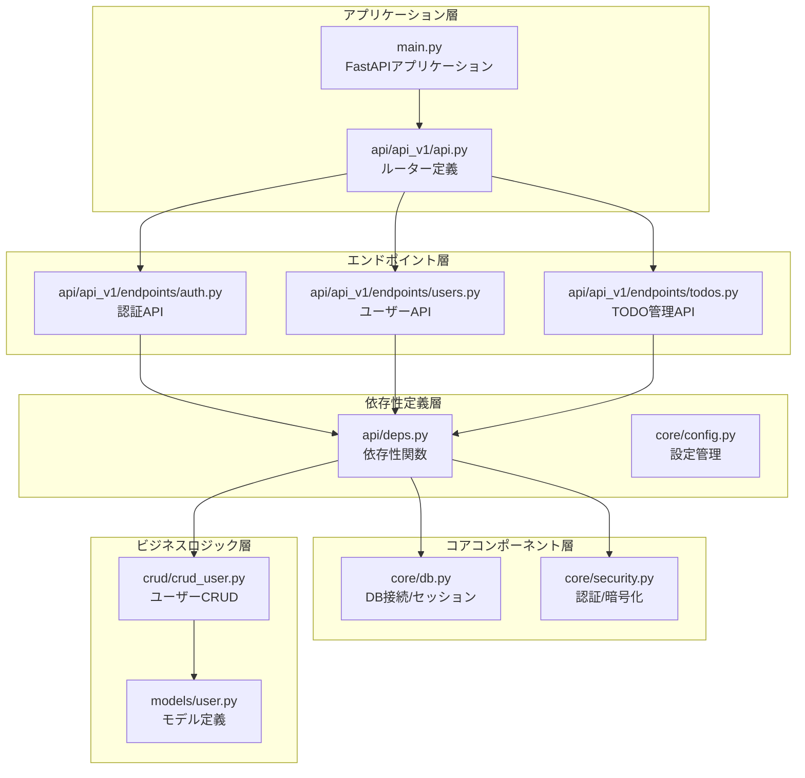
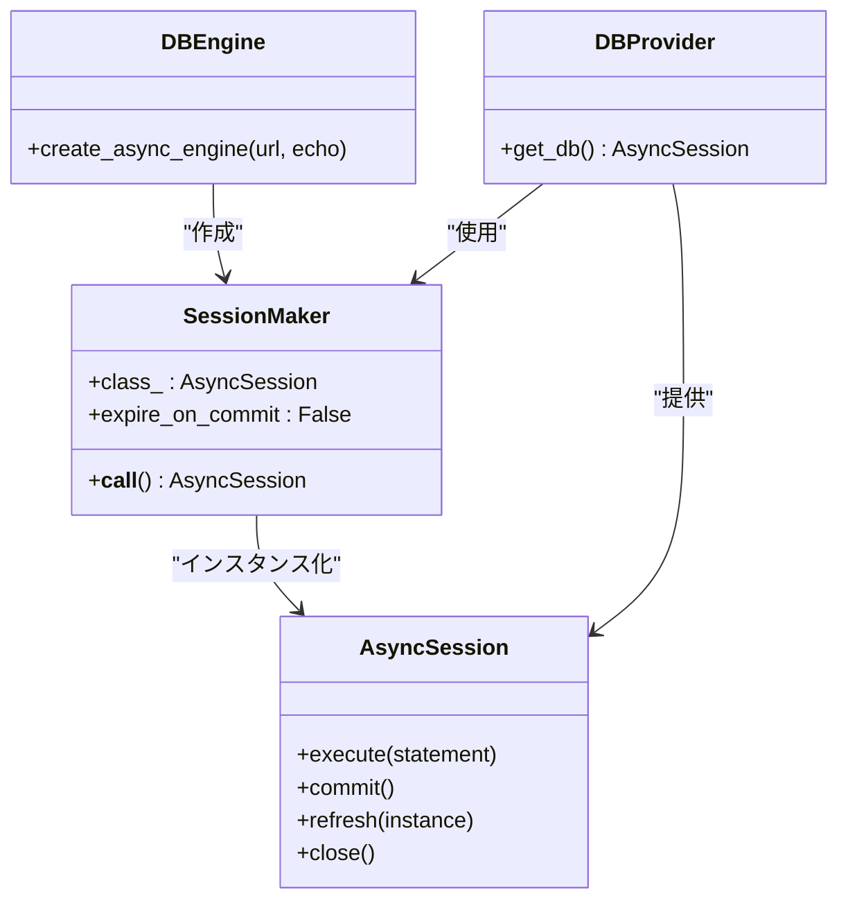
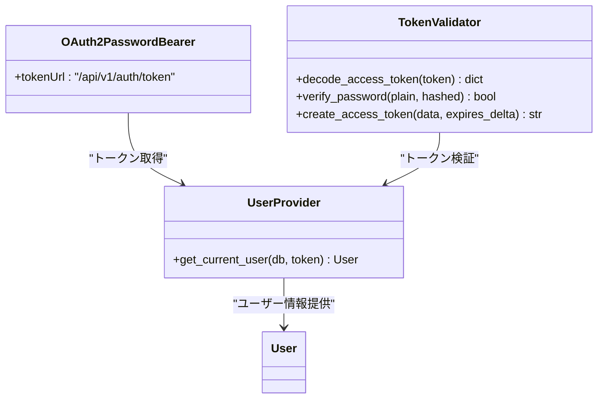
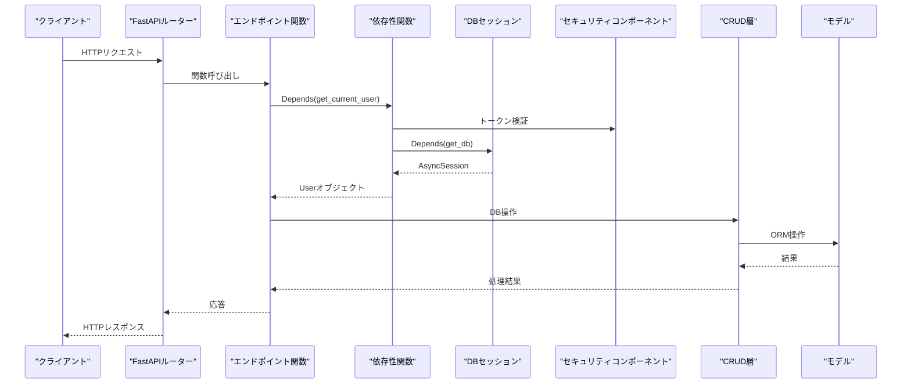
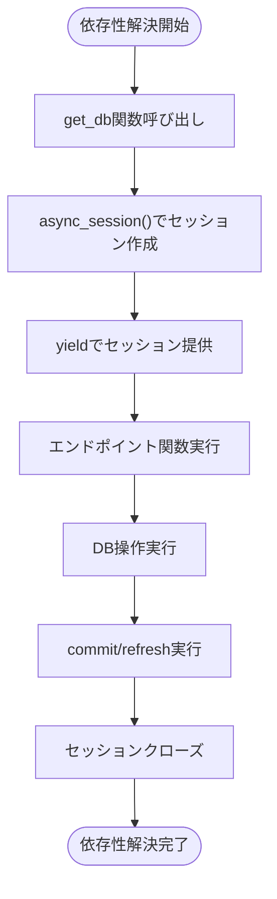
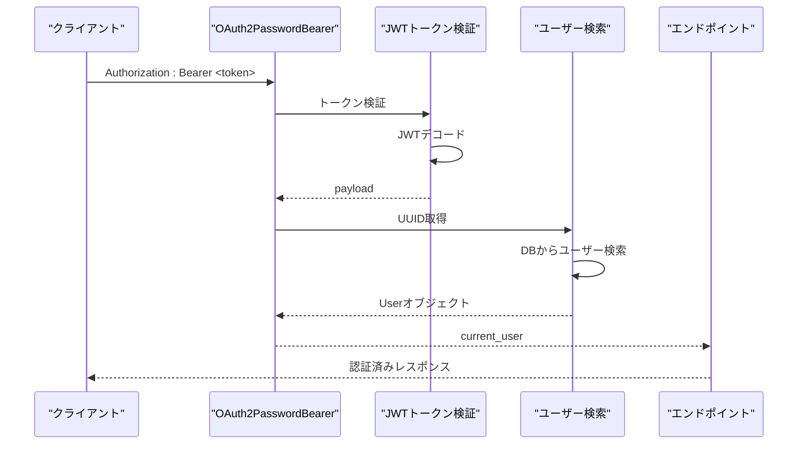
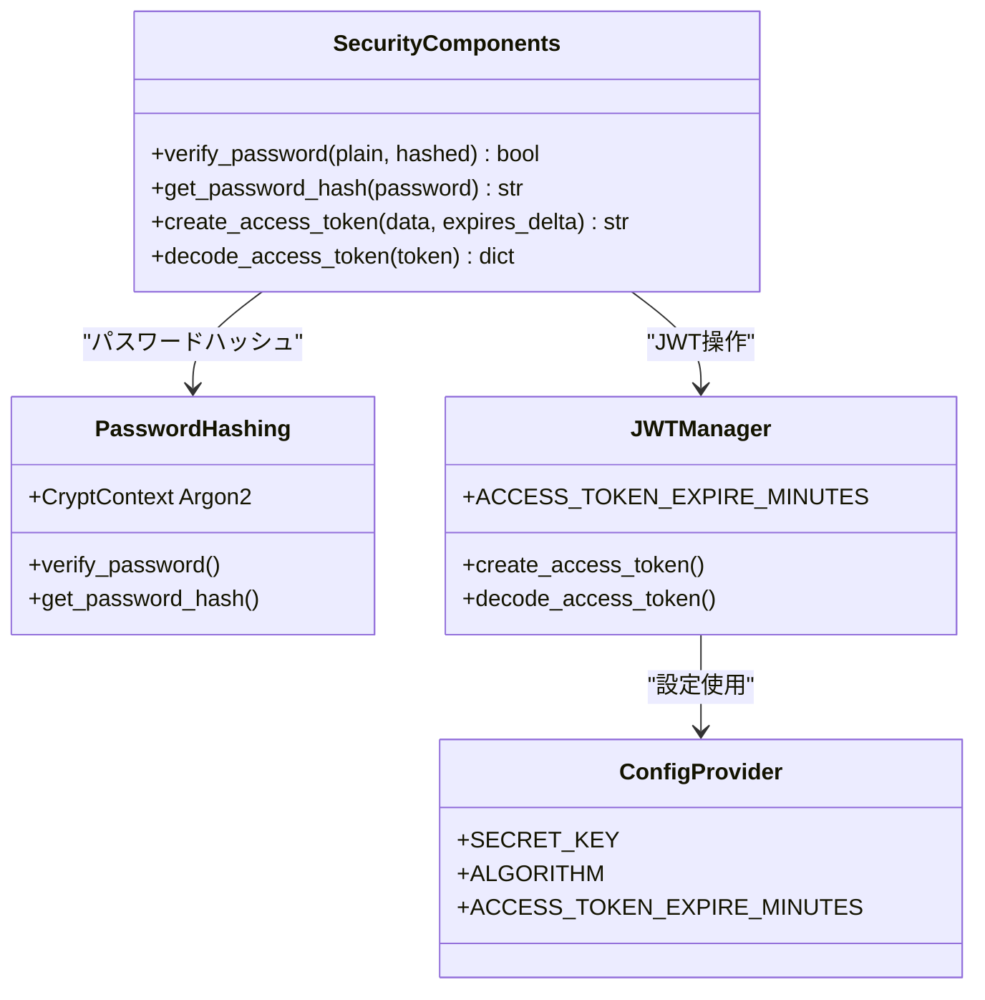
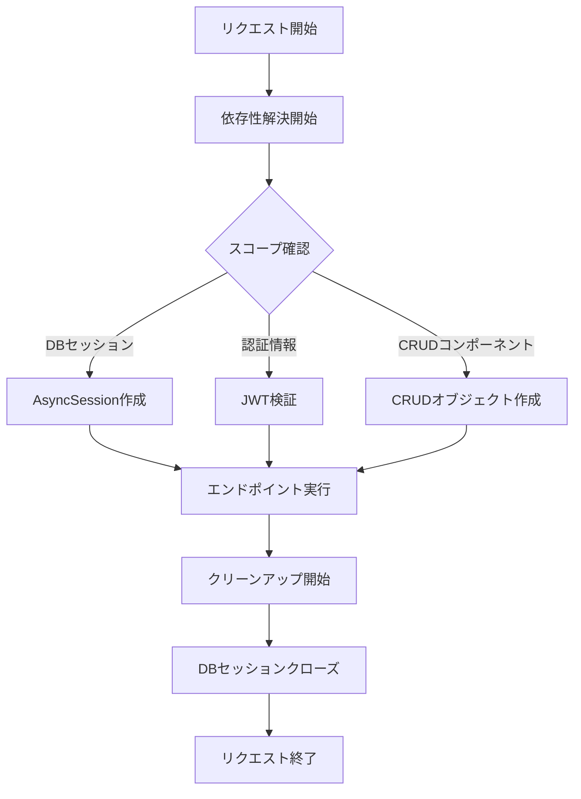
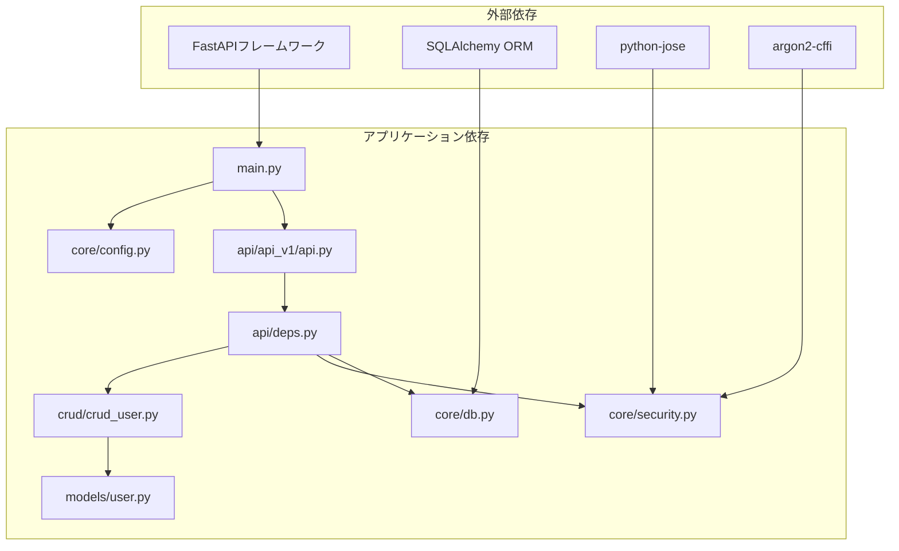
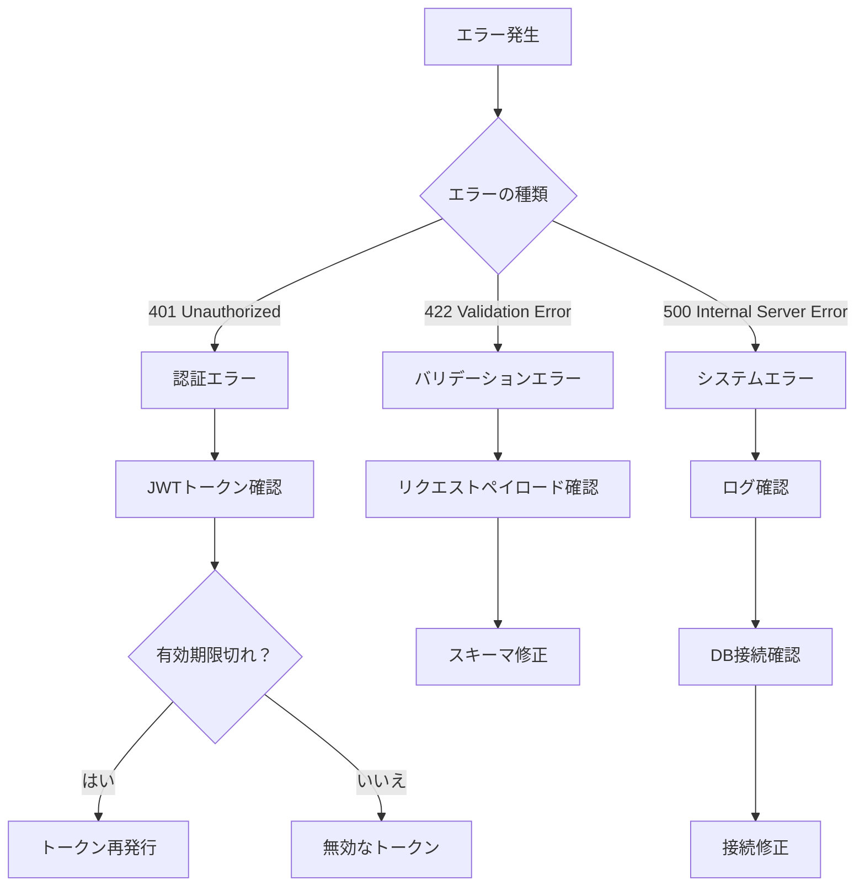

# 依存性注入

<cite>
**この文書で参照されるファイル**
- [backend/app/main.py](file://backend/app/main.py)
- [backend/app/api/deps.py](file://backend/app/api/deps.py)
- [backend/app/core/db.py](file://backend/app/core/db.py)
- [backend/app/core/security.py](file://backend/app/core/security.py)
- [backend/app/api/api_v1/endpoints/auth.py](file://backend/app/api/api_v1/endpoints/auth.py)
- [backend/app/api/api_v1/endpoints/users.py](file://backend/app/api/api_v1/endpoints/users.py)
- [backend/app/api/api_v1/endpoints/todos.py](file://backend/app/api/api_v1/endpoints/todos.py)
- [backend/app/api/api_v1/api.py](file://backend/app/api/api_v1/api.py)
- [backend/app/crud/crud_user.py](file://backend/app/crud/crud_user.py)
- [backend/app/models/user.py](file://backend/app/models/user.py)
- [backend/app/core/config.py](file://backend/app/core/config.py)
- [backend/pyproject.toml](file://backend/pyproject.toml)
</cite>

## 目次
1. [はじめに](#はじめに)
2. [プロジェクト構造](#プロジェクト構造)
3. [コアコンポーネント](#コアコンポーネント)
4. [アーキテクチャ概観](#アーキテクチャ概観)
5. [詳細コンポーネント分析](#詳細コンポーネント分析)
6. [依存関係分析](#依存関係分析)
7. [パフォーマンス考慮事項](#パフォーマンス考慮事項)
8. [トラブルシューティングガイド](#トラブルシューティングガイド)
9. [結論](#結論)

## はじめに
本ドキュメントは、FastAPIにおける依存性注入（DI）コンテナの仕組みと実装方法について詳しく解説します。特に以下の点に焦点を当てます：
- DBセッションの取得プロセス
- 認証情報の注入メカニズム
- セキュリティコンポーネントの提供方法
- 依存性のライフサイクル管理とスコープの概念
- 実際のコード例を通じた理解深化

## プロジェクト構造
FastAPIアプリケーションはモジュール指向の設計で構成されており、依存性注入は各エンドポイントで直接的に利用されています。

**図の出典**
- [backend/app/main.py:1-168](file://backend/app/main.py#L1-L168)
- [backend/app/api/api_v1/api.py:1-8](file://backend/app/api/api_v1/api.py#L1-L8)

**節の出典**
- [backend/app/main.py:1-168](file://backend/app/main.py#L1-L168)
- [backend/app/api/api_v1/api.py:1-8](file://backend/app/api/api_v1/api.py#L1-L8)

## コアコンポーネント
依存性注入の中心となる4つのコンポーネントを以下に示します。

### DBセッション管理コンポーネント
DBセッションは非同期SQLAlchemyセッションとして管理され、FastAPIのDependsによって提供されます。

**図の出典**
- [backend/app/core/db.py:1-17](file://backend/app/core/db.py#L1-L17)

### 認証情報注入コンポーネント
OAuth2 Bearer認証スキームとJWTトークンの検証を担うコンポーネント群です。

**図の出典**
- [backend/app/api/deps.py:1-37](file://backend/app/api/deps.py#L1-L37)
- [backend/app/core/security.py:1-35](file://backend/app/core/security.py#L1-L35)

**節の出典**
- [backend/app/core/db.py:1-17](file://backend/app/core/db.py#L1-L17)
- [backend/app/api/deps.py:1-37](file://backend/app/api/deps.py#L1-L37)
- [backend/app/core/security.py:1-35](file://backend/app/core/security.py#L1-L35)

## アーキテクチャ概観
FastAPIの依存性注入は、エンドポイントごとに必要な依存性を宣言的に指定することで実現されています。以下は全体のフローです。

**図の出典**
- [backend/app/api/api_v1/endpoints/auth.py:1-117](file://backend/app/api/api_v1/endpoints/auth.py#L1-L117)
- [backend/app/api/api_v1/endpoints/users.py:1-14](file://backend/app/api/api_v1/endpoints/users.py#L1-L14)
- [backend/app/api/api_v1/endpoints/todos.py:1-102](file://backend/app/api/api_v1/endpoints/todos.py#L1-L102)

## 詳細コンポーネント分析

### DBセッションの取得プロセス
DBセッションの取得は、FastAPIのDependsと非同期ジェネレータによってライフサイクル管理されています。

**図の出典**
- [backend/app/core/db.py:14-17](file://backend/app/core/db.py#L14-L17)

DBセッションのライフサイクル管理の特徴：
- 非同期ジェネレータによる自動クローズ
- トランザクション終了時にセッションを閉じる
- expire_on_commit=Falseにより、コミット後のオブジェクト状態維持

**節の出典**
- [backend/app/core/db.py:1-17](file://backend/app/core/db.py#L1-L17)

### 認証情報の注入メカニズム
認証情報の注入は、OAuth2 BearerスキームとJWTトークン検証の2段階で行われます。

**図の出典**
- [backend/app/api/deps.py:13-36](file://backend/app/api/deps.py#L13-L36)
- [backend/app/core/security.py:29-34](file://backend/app/core/security.py#L29-L34)

認証プロセスの重要なポイント：
- トークンの形式検証（subフィールドの存在確認）
- UUID形式のバリデーション
- DBからのユーザー存在確認
- 401エラー時のWWW-Authenticateヘッダー設定

**節の出典**
- [backend/app/api/deps.py:1-37](file://backend/app/api/deps.py#L1-L37)
- [backend/app/core/security.py:1-35](file://backend/app/core/security.py#L1-L35)

### セキュリティコンポーネントの提供方法
セキュリティコンポーネントは複数の役割を担っています。

**図の出典**
- [backend/app/core/security.py:1-35](file://backend/app/core/security.py#L1-L35)
- [backend/app/core/config.py:51-53](file://backend/app/core/config.py#L51-L53)

**節の出典**
- [backend/app/core/security.py:1-35](file://backend/app/core/security.py#L1-L35)
- [backend/app/core/config.py:1-91](file://backend/app/core/config.py#L1-L91)

### 依存性のライフサイクル管理とスコープ
FastAPIのDependsは、リクエストごとのスコープを持つ依存性を管理します。

スコープの特徴：
- DBセッション：リクエストごとのトランザクションスコープ
- 認証情報：リクエストごとの認証スコープ
- 設定情報：アプリケーション起動時のグローバルスコープ

**節の出典**
- [backend/app/api/deps.py:13-36](file://backend/app/api/deps.py#L13-L36)
- [backend/app/core/db.py:14-17](file://backend/app/core/db.py#L14-L17)

## 依存関係分析
依存性注入の全体像を以下に示します。

**図の出典**
- [backend/pyproject.toml:7-25](file://backend/pyproject.toml#L7-L25)
- [backend/app/main.py:1-168](file://backend/app/main.py#L1-L168)

**節の出典**
- [backend/pyproject.toml:1-51](file://backend/pyproject.toml#L1-L51)
- [backend/app/main.py:1-168](file://backend/app/main.py#L1-L168)

## パフォーマンス考慮事項
依存性注入のパフォーマンスへの影響を考慮すべきポイント：

1. **DBセッションの再利用**
   - 非同期ジェネレータによるセッション管理により、リクエストごとのセッション作成コストを最小限に抑えています。

2. **認証情報のキャッシュ**
   - 現在の実装では、JWTペイロードの再検証がリクエストごとに行われています。必要に応じて認証情報のキャッシュ戦略を検討できます。

3. **依存性の遅延評価**
   - FastAPIのDependsは必要に応じてのみ依存性を解決するため、不要な依存性の解決を避けることでパフォーマンス向上が期待できます。

4. **設定情報のアクセス**
   - Settingsオブジェクトはグローバルに保持されているため、設定アクセスのコストは最小限です。

## トラブルシューティングガイド

### 一般的なエラーの診断手順

### 常見の問題と解決策

**DB接続エラー**
- 症状：500エラー、DB接続失敗
- 対応：設定ファイルのDATABASE_URL確認、DBサーバーの起動確認

**認証エラー**
- 症状：401エラー、WWW-Authenticateヘッダー付き
- 対応：JWTトークンの形式確認、SECRET_KEYの一致確認

**バリデーションエラー**
- 症状：422エラー、詳細なエラーメッセージ表示
- 対応：リクエストデータのスキーマ確認、必須フィールドの追加

**節の出典**
- [backend/app/middleware/error_handler.py:15-149](file://backend/app/middleware/error_handler.py#L15-L149)

## 結論
FastAPIの依存性注入は、モジュール指向の設計と明確なスコープ管理によって、堅牢で保守性の高いシステムを実現しています。DBセッションのライフサイクル管理、認証情報の安全な注入、セキュリティコンポーネントの適切な提供が、全体の品質を支えています。

主な利点：
- **明確な依存関係**：各エンドポイントで必要な依存性を宣言的に指定
- **ライフサイクル管理**：非同期ジェネレータによる自動クリーンアップ
- **セキュリティ強化**：JWTベースの認証とパスワードハッシュ化
- **拡張性**：モジュールごとの独立性により、機能追加が容易

今後の改善点：
- 認証情報のキャッシュ戦略の導入
- 依存性の条件付き解決の活用
- 設定情報の動的変更対応