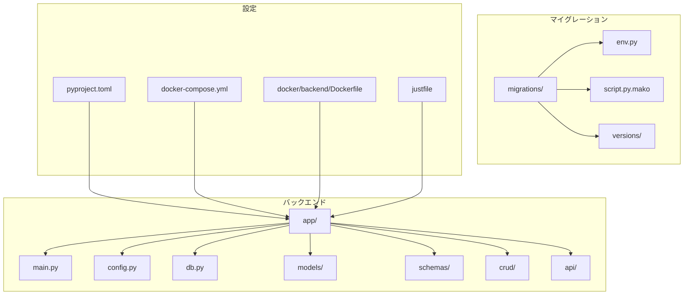
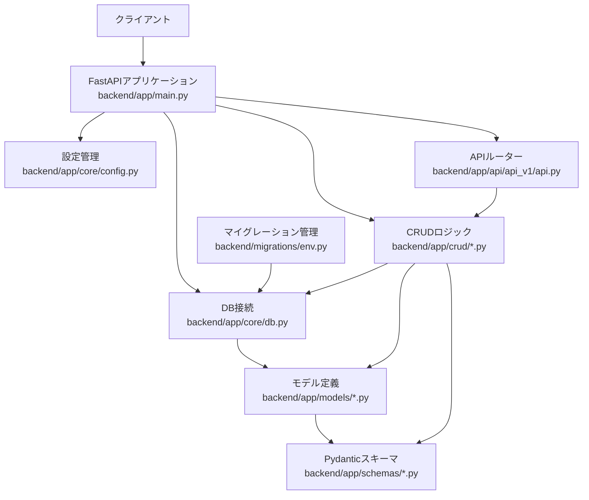
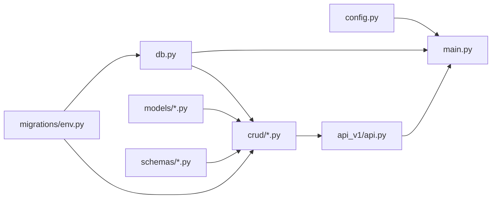

# バックエンド開発

<cite>
**このドキュメントで参照されるファイル**
- [backend/app/main.py](file://backend/app/main.py)
- [backend/app/core/config.py](file://backend/app/core/config.py)
- [backend/app/core/db.py](file://backend/app/core/db.py)
- [backend/app/models/user.py](file://backend/app/models/user.py)
- [backend/app/models/todo.py](file://backend/app/models/todo.py)
- [backend/app/schemas/user.py](file://backend/app/schemas/user.py)
- [backend/app/schemas/todo.py](file://backend/app/schemas/todo.py)
- [backend/app/crud/crud_user.py](file://backend/app/crud/crud_user.py)
- [backend/app/crud/crud_todo.py](file://backend/app/crud/crud_todo.py)
- [backend/app/api/api_v1/api.py](file://backend/app/api/api_v1/api.py)
- [backend/app/api/api_v1/endpoints/auth.py](file://backend/app/api/api_v1/endpoints/auth.py)
- [backend/app/api/api_v1/endpoints/users.py](file://backend/app/api/api_v1/endpoints/users.py)
- [backend/app/api/api_v1/endpoints/todos.py](file://backend/app/api/api_v1/endpoints/todos.py)
- [backend/migrations/env.py](file://backend/migrations/env.py)
- [backend/migrations/script.py.mako](file://backend/migrations/script.py.mako)
- [backend/migrations/versions/4f4084d80ebd_create_users_and_todos_tables.py](file://backend/migrations/versions/4f4084d80ebd_create_users_and_todos_tables.py)
- [backend/pyproject.toml](file://backend/pyproject.toml)
- [docker-compose.yml](file://docker-compose.yml)
- [docker/backend/Dockerfile](file://docker/backend/Dockerfile)
- [justfile](file://justfile)
</cite>

## 更新概要
**変更内容**
- Justfileによる開発ワークフロー自動化の統合
- データベースマイグレーション管理機能の追加
- 開発環境オーケストレーションの強化
- Alembicマイグレーションツールの統合

## 目次
1. [導入](#導入)
2. [プロジェクト構造](#プロジェクト構造)
3. [コアコンポーネント](#コアコンポーネント)
4. [アーキテクチャ概観](#アーキテクチャ概観)
5. [詳細コンポーネント分析](#詳細コンポーネント分析)
6. [依存関係分析](#依存関係分析)
7. [パフォーマンス考慮事項](#パフォーマンス考慮事項)
8. [トラブルシューティングガイド](#トラブルシューティングガイド)
9. [結論](#結論)
10. [付録](#付録)

## 導入
本ドキュメントは、FastAPIベースのバックエンド開発環境とAPI設計について、以下の観点から詳細に解説します：
- FastAPIアプリケーションの構造
- 依存性注入（DI）の仕組み
- CRUD操作のロジック
- 設定管理の方法
- Pydanticスキーマのバリデーション
- SQLAlchemy ORMの使用
- JWT認証の実装
- エラーハンドリングの方法
- 開発サーバーの起動方法
- テストの実行方法
- デバッグツールの使用
- パフォーマンスチューニングのヒント
- **新規: Justfileによる開発ワークフロー自動化**
- **新規: Alembicによるデータベースマイグレーション管理**
- **新規: 開発環境オーケストレーション**

## プロジェクト構造
バックエンドはFastAPIアプリケーションとして、以下のディレクトリ構成で構成されています：
- backend/app: FastAPIアプリケーションの主要なソースコード
- backend/migrations: Alembicマイグレーション管理
- backend/pyproject.toml: Pythonパッケージと依存関係の定義
- docker-compose.yml: Dockerによるサービス構成
- docker/backend/Dockerfile: Dockerイメージビルド用設定
- justfile: 開発作業のためのタスク定義

**図の出典**
- [backend/app/main.py](file://backend/app/main.py)
- [backend/app/core/config.py](file://backend/app/core/config.py)
- [backend/app/core/db.py](file://backend/app/core/db.py)
- [backend/app/models/user.py](file://backend/app/models/user.py)
- [backend/app/models/todo.py](file://backend/app/models/todo.py)
- [backend/app/schemas/user.py](file://backend/app/schemas/user.py)
- [backend/app/schemas/todo.py](file://backend/app/schemas/todo.py)
- [backend/app/crud/crud_user.py](file://backend/app/crud/crud_user.py)
- [backend/app/crud/crud_todo.py](file://backend/app/crud/crud_todo.py)
- [backend/app/api/api_v1/api.py](file://backend/app/api/api_v1/api.py)
- [backend/migrations/env.py](file://backend/migrations/env.py)
- [backend/migrations/script.py.mako](file://backend/migrations/script.py.mako)
- [backend/migrations/versions/4f4084d80ebd_create_users_and_todos_tables.py](file://backend/migrations/versions/4f4084d80ebd_create_users_and_todos_tables.py)
- [backend/pyproject.toml](file://backend/pyproject.toml)
- [docker-compose.yml](file://docker-compose.yml)
- [docker/backend/Dockerfile](file://docker/backend/Dockerfile)
- [justfile](file://justfile)

**節の出典**
- [backend/app/main.py](file://backend/app/main.py)
- [backend/pyproject.toml](file://backend/pyproject.toml)
- [docker-compose.yml](file://docker-compose.yml)
- [docker/backend/Dockerfile](file://docker/backend/Dockerfile)
- [justfile](file://justfile)

## コアコンポーネント
本プロジェクトのFastAPIアプリケーションは、以下のようなモジュール構成で構成されています：

- 起動スクリプト: [backend/app/main.py](file://backend/app/main.py)
- 設定管理: [backend/app/core/config.py](file://backend/app/core/config.py)
- DB接続管理: [backend/app/core/db.py](file://backend/app/core/db.py)
- モデル定義: [backend/app/models/user.py](file://backend/app/models/user.py), [backend/app/models/todo.py](file://backend/app/models/todo.py)
- Pydanticスキーマ: [backend/app/schemas/user.py](file://backend/app/schemas/user.py), [backend/app/schemas/todo.py](file://backend/app/schemas/todo.py)
- CRUDロジック: [backend/app/crud/crud_user.py](file://backend/app/crud/crud_user.py), [backend/app/crud/crud_todo.py](file://backend/app/crud/crud_todo.py)
- APIエンドポイント: [backend/app/api/api_v1/api.py](file://backend/app/api/api_v1/api.py)
- 依存関係定義: [backend/pyproject.toml](file://backend/pyproject.toml)

各モジュールの役割と相互関係は、後述の「アーキテクチャ概観」および「詳細コンポーネント分析」で詳しく解説します。

**節の出典**
- [backend/app/main.py](file://backend/app/main.py)
- [backend/app/core/config.py](file://backend/app/core/config.py)
- [backend/app/core/db.py](file://backend/app/core/db.py)
- [backend/app/models/user.py](file://backend/app/models/user.py)
- [backend/app/models/todo.py](file://backend/app/models/todo.py)
- [backend/app/schemas/user.py](file://backend/app/schemas/user.py)
- [backend/app/schemas/todo.py](file://backend/app/schemas/todo.py)
- [backend/app/crud/crud_user.py](file://backend/app/crud/crud_user.py)
- [backend/app/crud/crud_todo.py](file://backend/app/crud/crud_todo.py)
- [backend/app/api/api_v1/api.py](file://backend/app/api/api_v1/api.py)
- [backend/pyproject.toml](file://backend/pyproject.toml)

## アーキテクチャ概観
FastAPIアプリケーションの全体像は以下の通りです。設定管理、DB接続、モデル、スキーマ、CRUD、APIルーター、エラーハンドリングが統合され、依存性注入によって疎結合な構造が実現されています。**新規: Alembicマイグレーション管理が統合され、データベースライフサイクルが自動化されています**。

**図の出典**
- [backend/app/main.py](file://backend/app/main.py)
- [backend/app/core/config.py](file://backend/app/core/config.py)
- [backend/app/core/db.py](file://backend/app/core/db.py)
- [backend/app/models/user.py](file://backend/app/models/user.py)
- [backend/app/models/todo.py](file://backend/app/models/todo.py)
- [backend/app/schemas/user.py](file://backend/app/schemas/user.py)
- [backend/app/schemas/todo.py](file://backend/app/schemas/todo.py)
- [backend/app/crud/crud_user.py](file://backend/app/crud/crud_user.py)
- [backend/app/crud/crud_todo.py](file://backend/app/crud/crud_todo.py)
- [backend/app/api/api_v1/api.py](file://backend/app/api/api_v1/api.py)
- [backend/migrations/env.py](file://backend/migrations/env.py)

## 詳細コンポーネント分析

### 起動スクリプト（FastAPIアプリケーション）
- 説明: FastAPIアプリケーションのエントリポイント。ルーター、ミドルウェア、例外ハンドラー、DB接続などを初期化します。
- 主な機能:
  - 設定の読み込み
  - DBセッションの作成
  - 例外ハンドラーの登録
  - APIルートの登録
  - **新規: 開発時におけるテーブル自動生成**
- 参考: [backend/app/main.py](file://backend/app/main.py)

**節の出典**
- [backend/app/main.py](file://backend/app/main.py)

### 設定管理
- 説明: 環境変数や設定値を管理し、アプリケーション全体で共有されます。
- 主な機能:
  - 接続文字列の管理
  - 認証関連設定（例：JWTシークレット）
  - 開発/本番環境の切り替え
  - **新規: 非同期DB接続URLの動的生成**
- 参考: [backend/app/core/config.py](file://backend/app/core/config.py)

**節の出典**
- [backend/app/core/config.py](file://backend/app/core/config.py)

### DB接続管理
- 説明: SQLAlchemyのAsyncEngineとAsyncSessionを管理し、FastAPIの依存性注入で提供されます。
- 主な機能:
  - AsyncEngineの作成
  - AsyncSessionの生成
  - DB接続の確立・クローズ
  - **新規: 非同期接続のサポート**
- 参考: [backend/app/core/db.py](file://backend/app/core/db.py)

**節の出典**
- [backend/app/core/db.py](file://backend/app/core/db.py)

### モデル定義（SQLModel ORM）
- 説明: DBテーブルに対応するORMモデルを定義します。
- 主な機能:
  - テーブルスキーマの定義
  - 関連（Relationship）の設定
  - UUID主キーの使用
  - **新規: 非同期対応のモデル設計**
- 参考: [backend/app/models/user.py](file://backend/app/models/user.py), [backend/app/models/todo.py](file://backend/app/models/todo.py)

**節の出典**
- [backend/app/models/user.py](file://backend/app/models/user.py)
- [backend/app/models/todo.py](file://backend/app/models/todo.py)

### Pydanticスキーマ（バリデーション）
- 説明: APIの入出力データをPydanticスキーマでバリデーションします。
- 主な機能:
  - 入力バリデーション
  - 出力シリアライズ
  - 必須フィールド・型チェック
  - **新規: SQLModelとの統合**
- 参考: [backend/app/schemas/user.py](file://backend/app/schemas/user.py), [backend/app/schemas/todo.py](file://backend/app/schemas/todo.py)

**節の出典**
- [backend/app/schemas/user.py](file://backend/app/schemas/user.py)
- [backend/app/schemas/todo.py](file://backend/app/schemas/todo.py)

### CRUDロジック
- 説明: DB操作（作成、読取、更新、削除）を行うロジックを提供します。
- 主な機能:
  - 一覧取得
  - IDによる取得
  - 作成
  - 更新
  - 削除
  - **新規: 非同期CRUD操作の実装**
- 参考: [backend/app/crud/crud_user.py](file://backend/app/crud/crud_user.py), [backend/app/crud/crud_todo.py](file://backend/app/crud/crud_todo.py)

**節の出典**
- [backend/app/crud/crud_user.py](file://backend/app/crud/crud_user.py)
- [backend/app/crud/crud_todo.py](file://backend/app/crud/crud_todo.py)

### APIエンドポイント
- 説明: FastAPIのAPIルーターを通じて提供されるエンドポイント群です。
- 主な機能:
  - 認証エンドポイント（ユーザー登録、ログイン）
  - ユーザー管理エンドポイント（現在のユーザー情報取得）
  - TODO管理エンドポイント（CRUD操作）
  - **新規: JWT認証付きの保護されたエンドポイント**
- 参考: [backend/app/api/api_v1/api.py](file://backend/app/api/api_v1/api.py), [backend/app/api/api_v1/endpoints/auth.py](file://backend/app/api/api_v1/endpoints/auth.py), [backend/app/api/api_v1/endpoints/users.py](file://backend/app/api/api_v1/endpoints/users.py), [backend/app/api/api_v1/endpoints/todos.py](file://backend/app/api/api_v1/endpoints/todos.py)

**節の出典**
- [backend/app/api/api_v1/api.py](file://backend/app/api/api_v1/api.py)
- [backend/app/api/api_v1/endpoints/auth.py](file://backend/app/api/api_v1/endpoints/auth.py)
- [backend/app/api/api_v1/endpoints/users.py](file://backend/app/api/api_v1/endpoints/users.py)
- [backend/app/api/api_v1/endpoints/todos.py](file://backend/app/api/api_v1/endpoints/todos.py)

### 依存性注入（DI）の仕組み
- 説明: FastAPIのDependsを使用して、DBセッションや設定、認証情報をDIします。
- 主な機能:
  - DBセッションの提供
  - 認証情報の抽出
  - 例外ハンドラーの注入
- 参考: [backend/app/main.py](file://backend/app/main.py)

**節の出典**
- [backend/app/main.py](file://backend/app/main.py)

### JWT認証の実装
- 説明: JWTによる認証フローを実装し、保護されたエンドポイントを提供します。
- 主な機能:
  - トークン発行
  - トークン検証
  - 認可ロジック
  - **新規: Scalar API Referenceの統合**
- 参考: [backend/app/main.py](file://backend/app/main.py)

**節の出典**
- [backend/app/main.py](file://backend/app/main.py)

### エラーハンドリング
- 説明: FastAPIの例外ハンドラーを活用し、HTTPエラーを一貫した形式で返却します。
- 主な機能:
  - 例外の捕捉
  - HTTPステータスコードの設定
  - エラーレスポンスの整形
- 参考: [backend/app/main.py](file://backend/app/main.py)

**節の出典**
- [backend/app/main.py](file://backend/app/main.py)

### 開発ワークフロー自動化（新規）
- 説明: Justfileを使用した開発作業の自動化。複数の開発タスクを一元管理します。
- 主な機能:
  - 開発環境の起動（DB、バックエンド、フロントエンド）
  - データベースの状態管理（リセット、マイグレーション）
  - ログ表示の統一
  - **新規: Alembicマイグレーション操作の自動化**
- 参考: [justfile](file://justfile)

**節の出典**
- [justfile](file://justfile)

### Alembicマイグレーション管理（新規）
- 説明: データベーススキーマの変更を管理するマイグレーションツール。
- 主な機能:
  - マイグレーションの適用
  - ロールバック操作
  - 新規マイグレーションファイルの作成
  - 現在のバージョン確認
- 参考: [backend/migrations/env.py](file://backend/migrations/env.py), [backend/migrations/script.py.mako](file://backend/migrations/script.py.mako), [backend/migrations/versions/4f4084d80ebd_create_users_and_todos_tables.py](file://backend/migrations/versions/4f4084d80ebd_create_users_and_todos_tables.py)

**節の出典**
- [backend/migrations/env.py](file://backend/migrations/env.py)
- [backend/migrations/script.py.mako](file://backend/migrations/script.py.mako)
- [backend/migrations/versions/4f4084d80ebd_create_users_and_todos_tables.py](file://backend/migrations/versions/4f4084d80ebd_create_users_and_todos_tables.py)

### 開発サーバーの起動方法
- 説明: 開発用サーバーを起動し、Hot Reloadを有効にしてAPIを提供します。
- 方法:
  - Docker Composeを使用してサービスを起動
  - 開発用設定（ホットリロード、ログレベルなど）を適用
  - **新規: Justfileによる一括起動コマンドの使用**
- 参考: [docker-compose.yml](file://docker-compose.yml), [justfile](file://justfile)

**節の出典**
- [docker-compose.yml](file://docker-compose.yml)
- [justfile](file://justfile)

### テストの実行方法
- 説明: 単体・統合テストを実行し、APIの動作を検証します。
- 方法:
  - pytestまたは同等のテストランナーを使用
  - DB接続をテスト用に設定
  - 依存性をモックまたはスタブで置き換え
- 参考: [backend/pyproject.toml](file://backend/pyproject.toml)

**節の出典**
- [backend/pyproject.toml](file://backend/pyproject.toml)

### デバッグツールの使用
- 説明: FastAPIの公式ドキュメント（Swagger UI）やReDoc、Scalar API Reference、Postman、curlなどを活用してAPIをデバッグします。
- 方法:
  - /docs または /redoc でSwagger UI/ReDocにアクセス
  - **新規: Scalar API Referenceによる統一されたAPIドキュメント**
  - curlでエンドポイントを直接呼び出し
  - Postmanでリクエストを構成・送信
- 参考: [backend/app/main.py](file://backend/app/main.py)

**節の出典**
- [backend/app/main.py](file://backend/app/main.py)

### パフォーマンスチューニングのヒント
- 説明: FastAPIとSQLAlchemyのパフォーマンス向上に関する一般的なベストプラクティス。
- ヒント:
  - 遅延ロード（Lazy Loading）の適切な使用
  - N+1クエリの回避（joinedload/selectinloadの利用）
  - クエリのインデックス最適化
  - FastAPIの非同期処理の活用
  - 必要最小限のフィールド選択（projection）
  - **新規: 非同期DB接続の活用**
- 参考: [backend/app/core/db.py](file://backend/app/core/db.py), [backend/app/crud/crud_todo.py](file://backend/app/crud/crud_todo.py)

**節の出典**
- [backend/app/core/db.py](file://backend/app/core/db.py)
- [backend/app/crud/crud_todo.py](file://backend/app/crud/crud_todo.py)

## 依存関係分析
FastAPIアプリケーションの依存関係は、以下の通りです。設定→DB接続→CRUD→モデル/スキーマ→APIルーターの順に依存しています。**新規: Alembicマイグレーションが開発ワークフローに統合され、データベースライフサイクル管理が自動化されています**。

**図の出典**
- [backend/app/core/config.py](file://backend/app/core/config.py)
- [backend/app/core/db.py](file://backend/app/core/db.py)
- [backend/app/crud/crud_user.py](file://backend/app/crud/crud_user.py)
- [backend/app/crud/crud_todo.py](file://backend/app/crud/crud_todo.py)
- [backend/app/models/user.py](file://backend/app/models/user.py)
- [backend/app/models/todo.py](file://backend/app/models/todo.py)
- [backend/app/schemas/user.py](file://backend/app/schemas/user.py)
- [backend/app/schemas/todo.py](file://backend/app/schemas/todo.py)
- [backend/app/api/api_v1/api.py](file://backend/app/api/api_v1/api.py)
- [backend/migrations/env.py](file://backend/migrations/env.py)

**節の出典**
- [backend/app/core/config.py](file://backend/app/core/config.py)
- [backend/app/core/db.py](file://backend/app/core/db.py)
- [backend/app/crud/crud_user.py](file://backend/app/crud/crud_user.py)
- [backend/app/crud/crud_todo.py](file://backend/app/crud/crud_todo.py)
- [backend/app/models/user.py](file://backend/app/models/user.py)
- [backend/app/models/todo.py](file://backend/app/models/todo.py)
- [backend/app/schemas/user.py](file://backend/app/schemas/user.py)
- [backend/app/schemas/todo.py](file://backend/app/schemas/todo.py)
- [backend/app/api/api_v1/api.py](file://backend/app/api/api_v1/api.py)
- [backend/migrations/env.py](file://backend/migrations/env.py)

## パフォーマンス考慮事項
- SQLAlchemy ORMのクエリ効率化:
  - 関連オブジェクトの取得時にjoinedload/selectinloadを使用し、N+1クエリを回避します。
  - 不要なフィールドを取得しないよう、限定的なクエリを設計します。
- FastAPIの非同期処理:
  - DB操作は非同期で実行し、I/Oバウンドの待機時間を短縮します。
  - **新規: 非同期DB接続の活用**
- キャッシュ戦略:
  - 変更の少ないデータについては、Redisなどのキャッシュ層を導入します。
- ロギングとモニタリング:
  - SQLクエリのログ出力と実行時間の計測を行い、ボトルネックを特定します。
- **新規: 開発ワークフローの自動化による効率化**:
  - Justfileによるタスクの自動化により、開発プロセスの効率を向上
  - マイグレーション操作の標準化によるエラー低減

## トラブルシューティングガイド
- 起動エラー:
  - 設定ファイル（config.py）の値が不正な場合、アプリケーションが起動しません。設定値の確認と修正を行ってください。
  - DB接続文字列が間違っている場合、DB接続に失敗します。接続文字列の確認とネットワーク設定を確認してください。
  - **新規: マイグレーションエラー**: Alembicのバージョン管理に問題がある場合は、`just db-history`で履歴を確認し、適切なロールバックまたは再適用を行う
- APIエラー:
  - Pydanticスキーマのバリデーションエラーが発生した場合、リクエストの形式を見直してください。
  - CRUD操作でエラーが発生した場合、DBの状態や権限を確認してください。
- 認証エラー:
  - JWTトークンが無効または期限切れの場合、認証エラーが発生します。トークンの再発行または期限を確認してください。
- **新規: 開発環境エラー**:
  - Dockerコンテナの起動に失敗した場合、`just status`でコンテナの状態を確認
  - 開発サーバーのHot Reloadが動作しない場合、ポート競合や依存関係の問題を確認

**節の出典**
- [backend/app/core/config.py](file://backend/app/core/config.py)
- [backend/app/core/db.py](file://backend/app/core/db.py)
- [backend/app/schemas/user.py](file://backend/app/schemas/user.py)
- [backend/app/schemas/todo.py](file://backend/app/schemas/todo.py)
- [backend/app/crud/crud_user.py](file://backend/app/crud/crud_user.py)
- [backend/app/crud/crud_todo.py](file://backend/app/crud/crud_todo.py)
- [backend/app/main.py](file://backend/app/main.py)
- [justfile](file://justfile)

## 結論
本プロジェクトは、FastAPIを基盤とした堅牢なバックエンド開発環境を提供しており、設定管理、DB接続、モデル・スキーマ、CRUDロジック、依存性注入、JWT認証、エラーハンドリングが統合・分離された形で設計されています。**新しく導入されたJustfileによる開発ワークフロー自動化と、Alembicによるデータベースマイグレーション管理により、開発効率と保守性が大幅に向上しました**。開発サーバーの起動、テストの実行、デバッグツールの使用、パフォーマンスチューニングのヒントも網羅的に提供されています。これにより、拡張性と保守性に優れたAPIを迅速に構築することが可能です。

## 付録
- Dockerによるビルドと起動:
  - Dockerfile: [docker/backend/Dockerfile](file://docker/backend/Dockerfile)
  - docker-compose: [docker-compose.yml](file://docker-compose.yml)
- 開発作業の自動化:
  - 項目: [justfile](file://justfile)
  - **新規: 開発環境オーケストレーション**: `just dev`, `just up`, `just clean-db`
  - **新規: マイグレーション管理**: `just db-migrate`, `just db-rollback`, `just db-revision`
- 依存関係とパッケージ管理:
  - 定義: [backend/pyproject.toml](file://backend/pyproject.toml)
  - **新規: Alembic依存関係の追加**
- **新規: データベースマイグレーション管理**:
  - 環境設定: [backend/migrations/env.py](file://backend/migrations/env.py)
  - マイグレーションテンプレート: [backend/migrations/script.py.mako](file://backend/migrations/script.py.mako)
  - 初期マイグレーション: [backend/migrations/versions/4f4084d80ebd_create_users_and_todos_tables.py](file://backend/migrations/versions/4f4084d80ebd_create_users_and_todos_tables.py)

**節の出典**
- [docker/backend/Dockerfile](file://docker/backend/Dockerfile)
- [docker-compose.yml](file://docker-compose.yml)
- [justfile](file://justfile)
- [backend/pyproject.toml](file://backend/pyproject.toml)
- [backend/migrations/env.py](file://backend/migrations/env.py)
- [backend/migrations/script.py.mako](file://backend/migrations/script.py.mako)
- [backend/migrations/versions/4f4084d80ebd_create_users_and_todos_tables.py](file://backend/migrations/versions/4f4084d80ebd_create_users_and_todos_tables.py)