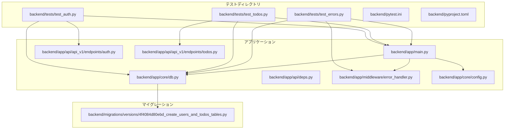
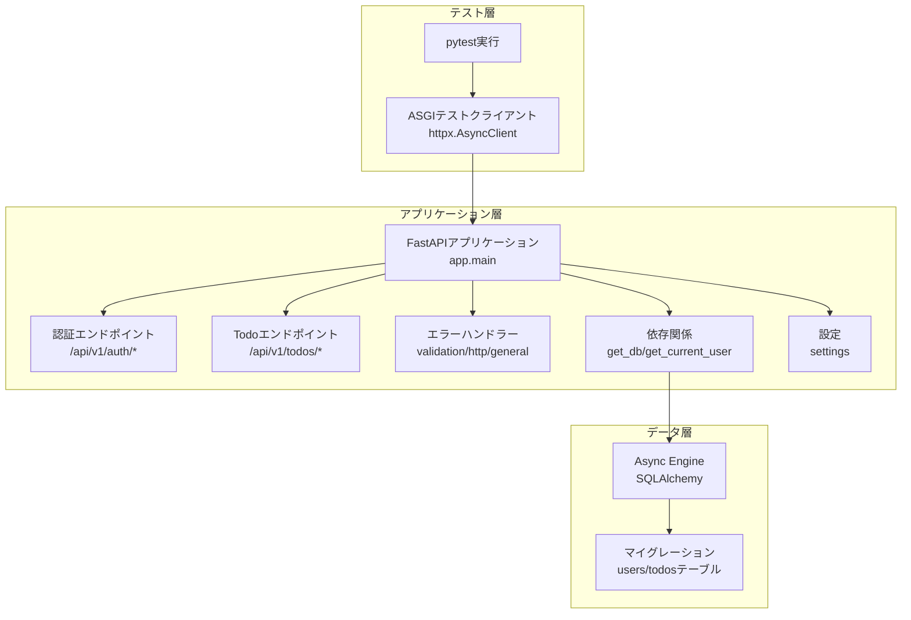
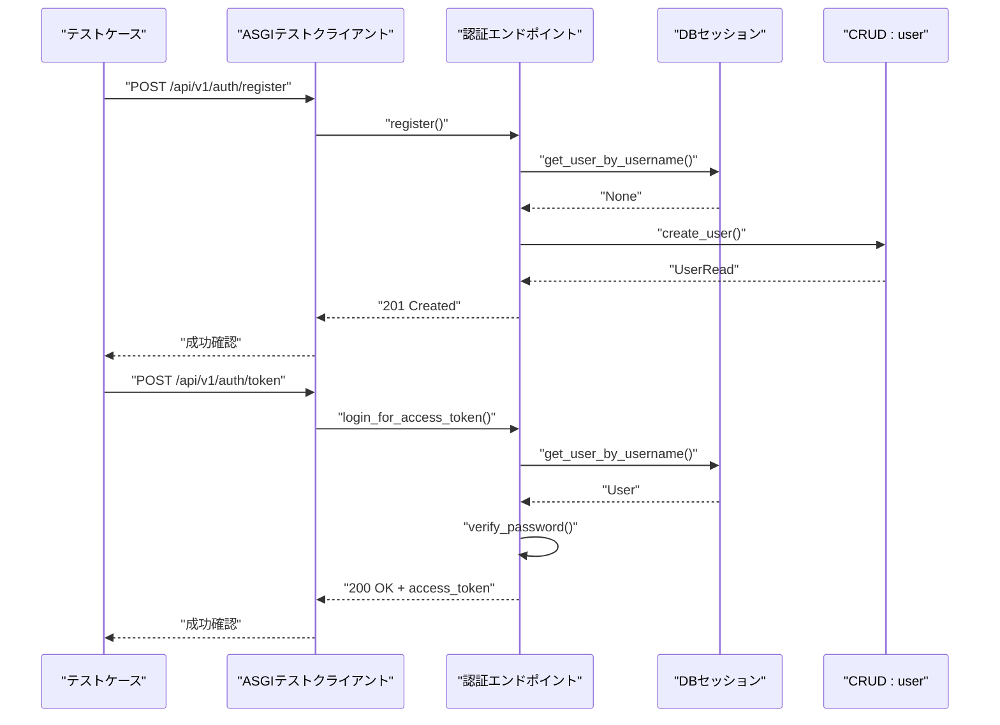
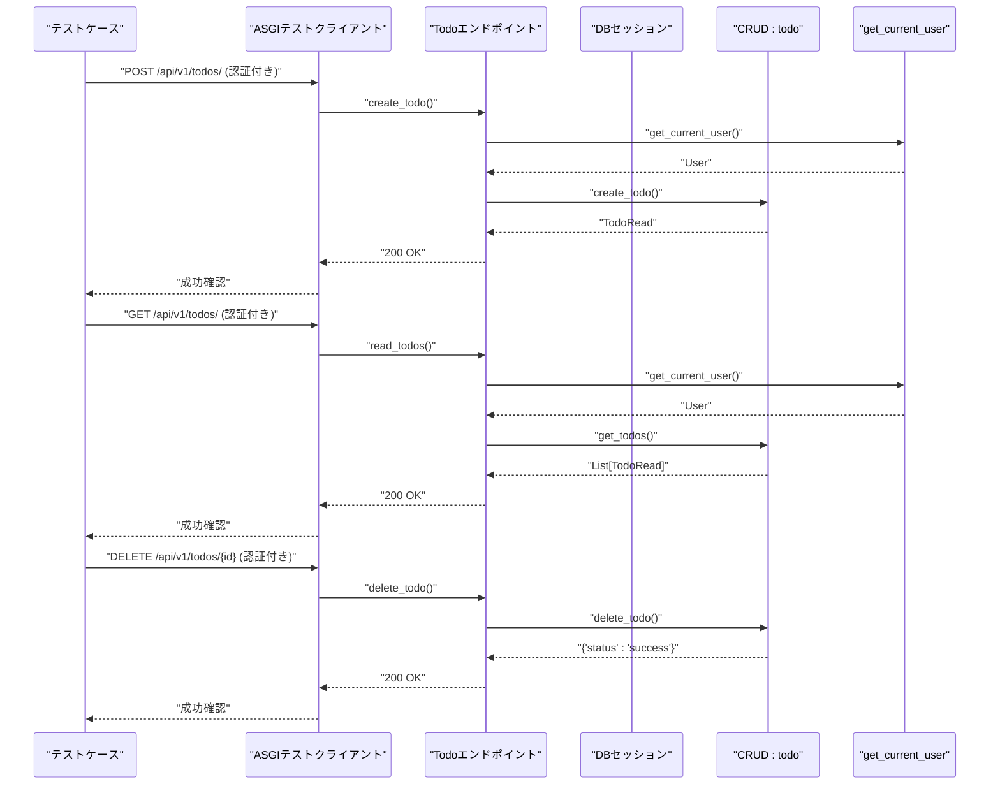
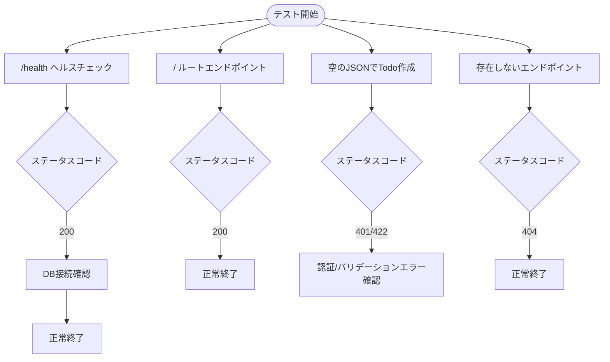
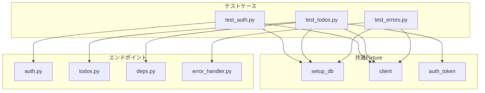

# バックエンドテストフレームワーク

<cite>
**本文で参照されたファイル**   
- [backend/tests/test_auth.py](file://backend/tests/test_auth.py)
- [backend/tests/test_todos.py](file://backend/tests/test_todos.py)
- [backend/tests/test_errors.py](file://backend/tests/test_errors.py)
- [backend/pytest.ini](file://backend/pytest.ini)
- [backend/pyproject.toml](file://backend/pyproject.toml)
- [backend/app/main.py](file://backend/app/main.py)
- [backend/app/core/db.py](file://backend/app/core/db.py)
- [backend/app/api/api_v1/endpoints/auth.py](file://backend/app/api/api_v1/endpoints/auth.py)
- [backend/app/api/api_v1/endpoints/todos.py](file://backend/app/api/api_v1/endpoints/todos.py)
- [backend/app/api/deps.py](file://backend/app/api/deps.py)
- [backend/app/middleware/error_handler.py](file://backend/app/middleware/error_handler.py)
- [backend/app/core/config.py](file://backend/app/core/config.py)
- [backend/migrations/versions/4f4084d80ebd_create_users_and_todos_tables.py](file://backend/migrations/versions/4f4084d80ebd_create_users_and_todos_tables.py)
</cite>

## 目次
1. [はじめに](#はじめに)
2. [プロジェクト構造](#プロジェクト構造)
3. [コアコンポーネント](#コアコンポーネント)
4. [アーキテクチャ概要](#アーキテクチャ概要)
5. [詳細コンポーネント分析](#詳細コンポーネント分析)
6. [依存関係分析](#依存関係分析)
7. [パフォーマンス考慮事項](#パフォーマンス考慮事項)
8. [トラブルシューティングガイド](#トラブルシューティングガイド)
9. [結論](#結論)

## はじめに
本ドキュメントは、Todoプロジェクトのバックエンドテストフレームワークについての包括的な解説です。FastAPIベースのWebアプリケーションに対して、非同期テスト環境を構築し、認証、Todo管理、エラーハンドリングの各機能を網羅的に検証するためのテストアーキテクチャを解説します。pytestとhttpxを活用したASGI互換テストクライアントを通じて、リアルタイムでAPIの動作を検証します。

## プロジェクト構造
テスト関連のディレクトリとファイルの位置づけを以下に示します。

**図の出典**
- [backend/tests/test_auth.py:1-80](file://backend/tests/test_auth.py#L1-L80)
- [backend/tests/test_todos.py:1-129](file://backend/tests/test_todos.py#L1-L129)
- [backend/tests/test_errors.py:1-57](file://backend/tests/test_errors.py#L1-L57)
- [backend/pytest.ini:1-4](file://backend/pytest.ini#L1-L4)
- [backend/pyproject.toml:1-47](file://backend/pyproject.toml#L1-L47)
- [backend/app/main.py:1-164](file://backend/app/main.py#L1-L164)
- [backend/app/core/db.py:1-14](file://backend/app/core/db.py#L1-L14)
- [backend/app/api/api_v1/endpoints/auth.py:1-53](file://backend/app/api/api_v1/endpoints/auth.py#L1-L53)
- [backend/app/api/api_v1/endpoints/todos.py:1-80](file://backend/app/api/api_v1/endpoints/todos.py#L1-L80)
- [backend/app/api/deps.py:1-31](file://backend/app/api/deps.py#L1-L31)
- [backend/app/middleware/error_handler.py:1-149](file://backend/app/middleware/error_handler.py#L1-L149)
- [backend/app/core/config.py:1-60](file://backend/app/core/config.py#L1-L60)
- [backend/migrations/versions/4f4084d80ebd_create_users_and_todos_tables.py:1-51](file://backend/migrations/versions/4f4084d80ebd_create_users_and_todos_tables.py#L1-L51)

**節の出典**
- [backend/tests/test_auth.py:1-80](file://backend/tests/test_auth.py#L1-L80)
- [backend/tests/test_todos.py:1-129](file://backend/tests/test_todos.py#L1-L129)
- [backend/tests/test_errors.py:1-57](file://backend/tests/test_errors.py#L1-L57)
- [backend/pytest.ini:1-4](file://backend/pytest.ini#L1-L4)
- [backend/pyproject.toml:1-47](file://backend/pyproject.toml#L1-L47)

## コアコンポーネント
本テストフレームワークの核となるコンポーネントは以下の通りです：

- テストランナー設定
  - pytestのasyncioモード設定、テストパス、ファイルパターン、カバレッジ設定
- ASGIテストクライアント
  - httpx.AsyncClientによるASGI互換通信、テスト用ベースURL設定
- データベースFixture
  - SQLAlchemy Async Engineによるテーブル作成/破棄、テストごとのクリーンな状態確保
- 認証Fixture
  - JWTアクセストークン取得、認証不要エンドポイントのテスト支援
- APIエンドポイント
  - 認証、Todo管理、ヘルスチェック、エラーハンドリングの各エンドポイント

**節の出典**
- [backend/pyproject.toml:33-47](file://backend/pyproject.toml#L33-L47)
- [backend/tests/test_auth.py:7-22](file://backend/tests/test_auth.py#L7-L22)
- [backend/tests/test_todos.py:7-39](file://backend/tests/test_todos.py#L7-L39)
- [backend/tests/test_errors.py:7-22](file://backend/tests/test_errors.py#L7-L22)

## アーキテクチャ概要
テストフレームワークの全体像を以下に示します。pytestがテストケースを実行し、ASGI互換クライアントがFastAPIアプリケーションにリクエストを送信します。各エンドポイントは依存関係解決を通じてDBセッションや認証情報を取得し、エラーハンドラーが統一されたレスポンスを返します。

**図の出典**
- [backend/app/main.py:1-164](file://backend/app/main.py#L1-L164)
- [backend/app/api/api_v1/endpoints/auth.py:1-53](file://backend/app/api/api_v1/endpoints/auth.py#L1-L53)
- [backend/app/api/api_v1/endpoints/todos.py:1-80](file://backend/app/api/api_v1/endpoints/todos.py#L1-L80)
- [backend/app/middleware/error_handler.py:1-149](file://backend/app/middleware/error_handler.py#L1-L149)
- [backend/app/api/deps.py:1-31](file://backend/app/api/deps.py#L1-L31)
- [backend/app/core/db.py:1-14](file://backend/app/core/db.py#L1-L14)
- [backend/migrations/versions/4f4084d80ebd_create_users_and_todos_tables.py:1-51](file://backend/migrations/versions/4f4084d80ebd_create_users_and_todos_tables.py#L1-L51)

## 詳細コンポーネント分析

### 認証テストコンポーネント
認証に関するテストは、ユーザー登録、重複登録エラー、有効/無効な資格情報でのログインを網羅的に検証します。

**図の出典**
- [backend/tests/test_auth.py:23-80](file://backend/tests/test_auth.py#L23-L80)
- [backend/app/api/api_v1/endpoints/auth.py:17-53](file://backend/app/api/api_v1/endpoints/auth.py#L17-L53)
- [backend/app/api/deps.py:12-31](file://backend/app/api/deps.py#L12-L31)

**節の出典**
- [backend/tests/test_auth.py:23-80](file://backend/tests/test_auth.py#L23-L80)
- [backend/app/api/api_v1/endpoints/auth.py:17-53](file://backend/app/api/api_v1/endpoints/auth.py#L17-L53)

### Todo管理テストコンポーネント
TodoのCRUD操作、認証不要アクセスのテスト、および一貫したレスポンス形式を検証します。

**図の出典**
- [backend/tests/test_todos.py:40-129](file://backend/tests/test_todos.py#L40-L129)
- [backend/app/api/api_v1/endpoints/todos.py:40-80](file://backend/app/api/api_v1/endpoints/todos.py#L40-L80)
- [backend/app/api/deps.py:12-31](file://backend/app/api/deps.py#L12-L31)

**節の出典**
- [backend/tests/test_todos.py:40-129](file://backend/tests/test_todos.py#L40-L129)
- [backend/app/api/api_v1/endpoints/todos.py:40-80](file://backend/app/api/api_v1/endpoints/todos.py#L40-L80)

### エラーハンドリングテストコンポーネント
バリデーションエラー、認証エラー、404エラー、ヘルスチェックを検証します。

**図の出典**
- [backend/tests/test_errors.py:23-57](file://backend/tests/test_errors.py#L23-L57)
- [backend/app/main.py:130-164](file://backend/app/main.py#L130-L164)
- [backend/app/middleware/error_handler.py:15-149](file://backend/app/middleware/error_handler.py#L15-L149)

**節の出典**
- [backend/tests/test_errors.py:23-57](file://backend/tests/test_errors.py#L23-L57)
- [backend/app/middleware/error_handler.py:15-149](file://backend/app/middleware/error_handler.py#L15-L149)

### 依存関係と設定
- pytest設定
  - asyncio_mode: 自動設定により非同期テストをサポート
  - testpaths: testsディレクトリをテスト探索対象に
  - python_files/classes/functions: テストファイル/クラス/関数の命名規則
  - coverage: ソースカバレッジの設定
- 設定管理
  - DATABASE_URL、SECRET_KEY、CORSオリジン、レート制限などの設定値をEnvironmentから読み込み
- DB接続
  - asyncpg + SQLAlchemy Async Engineによる非同期接続
  - テストごとにテーブル作成/破棄を行うFixture

**節の出典**
- [backend/pyproject.toml:33-47](file://backend/pyproject.toml#L33-L47)
- [backend/app/core/config.py:1-60](file://backend/app/core/config.py#L1-L60)
- [backend/app/core/db.py:1-14](file://backend/app/core/db.py#L1-L14)

## 依存関係分析
テストフレームワークの依存関係を以下に示します。各テストケースは共通のFixtureに依存し、エンドポイントは依存関係解決を通じてDBセッションや認証情報を取得します。

**図の出典**
- [backend/tests/test_auth.py:7-22](file://backend/tests/test_auth.py#L7-L22)
- [backend/tests/test_todos.py:7-39](file://backend/tests/test_todos.py#L7-L39)
- [backend/tests/test_errors.py:7-22](file://backend/tests/test_errors.py#L7-L22)
- [backend/app/api/api_v1/endpoints/auth.py:1-53](file://backend/app/api/api_v1/endpoints/auth.py#L1-L53)
- [backend/app/api/api_v1/endpoints/todos.py:1-80](file://backend/app/api/api_v1/endpoints/todos.py#L1-L80)
- [backend/app/api/deps.py:1-31](file://backend/app/api/deps.py#L1-L31)
- [backend/app/middleware/error_handler.py:1-149](file://backend/app/middleware/error_handler.py#L1-L149)

**節の出典**
- [backend/tests/test_auth.py:7-22](file://backend/tests/test_auth.py#L7-L22)
- [backend/tests/test_todos.py:7-39](file://backend/tests/test_todos.py#L7-L39)
- [backend/tests/test_errors.py:7-22](file://backend/tests/test_errors.py#L7-L22)

## パフォーマンス考慮事項
- 非同期テストの実行
  - pytest-asyncioのautoモードにより、非同期テストが効率的に実行されます。
- DB接続の最適化
  - 各テストでテーブル作成/破棄を行うFixtureにより、テスト間の影響を排除しつつ、接続コストを最小限に抑えます。
- 依存関係の再利用
  - 共通Fixture（setup_db、client、auth_token）を再利用することで、テストの実行時間を短縮できます。

[この節では具体的なファイル分析を行っていません]

## トラブルシューティングガイド
- 認証エラー（401）
  - 有効なアクセストークンをAuthorizationヘッダーに設定してください。
  - 認証フローが正しく行われているか確認してください。
- バリデーションエラー（422）
  - 必須フィールドが不足していないか、データ型が正しいか確認してください。
- 404 Not Found
  - エンドポイントパスが正しいか、リクエストメソッドが適切か確認してください。
- DB接続エラー
  - 設定ファイルのDATABASE_URLが正しいか確認し、DBサーバーが起動しているか確認してください。

**節の出典**
- [backend/tests/test_errors.py:41-57](file://backend/tests/test_errors.py#L41-L57)
- [backend/app/middleware/error_handler.py:15-149](file://backend/app/middleware/error_handler.py#L15-L149)

## 結論
本テストフレームワークは、pytestとhttpxを活用した非同期テスト環境を提供し、認証、Todo管理、エラーハンドリングの各機能を網羅的に検証します。共通Fixtureを通じてテストの再利用性と保守性を高め、FastAPIアプリケーションの品質向上に貢献します。今後の改善として、より多くのエッジケースのテストカバレッジ拡充や、Fixtureのパラメータ化による柔軟なテスト設計が考えられます。