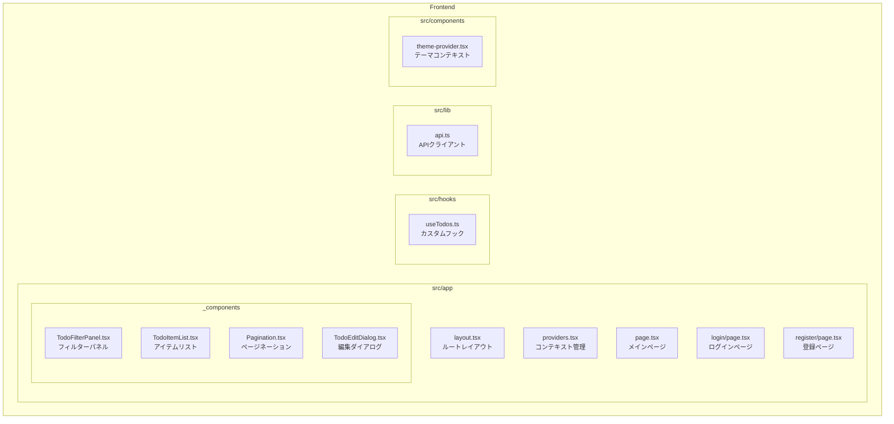
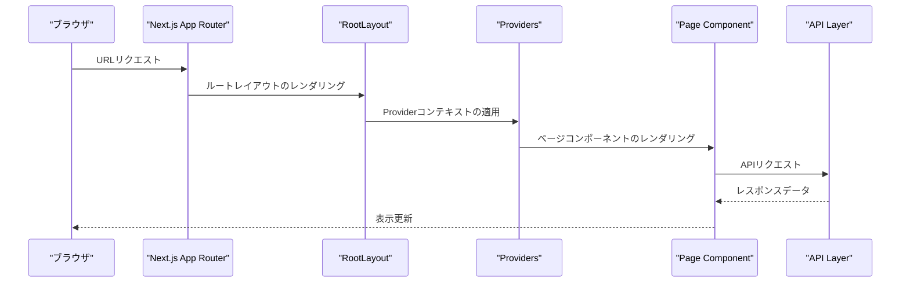
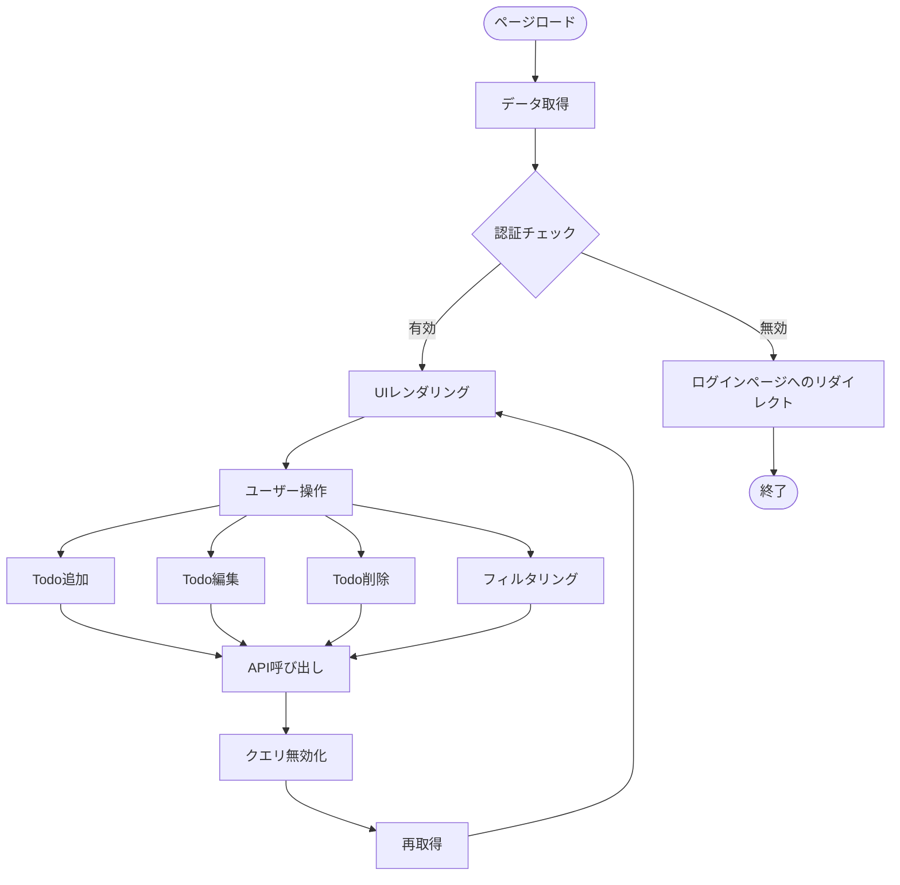
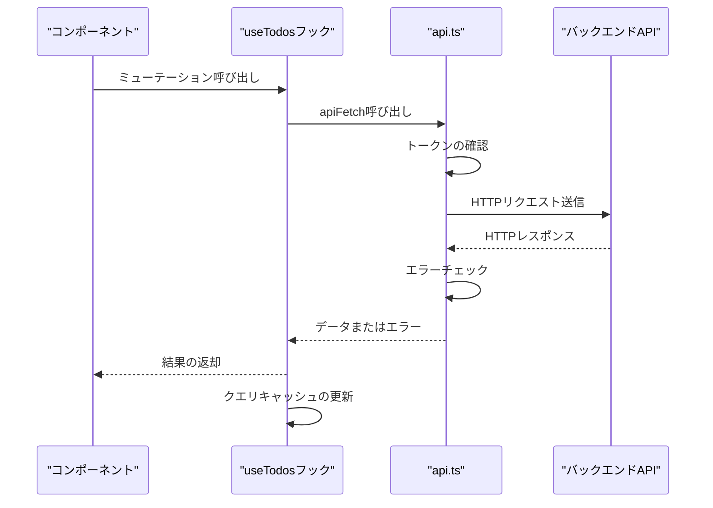
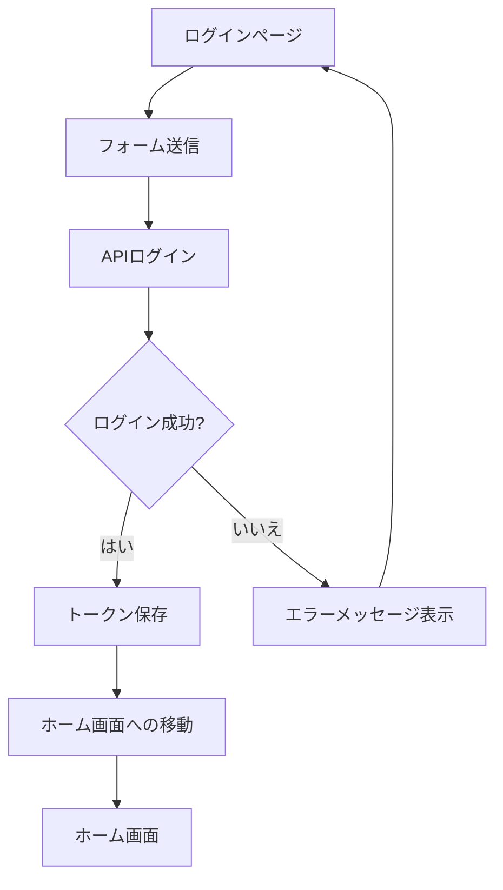
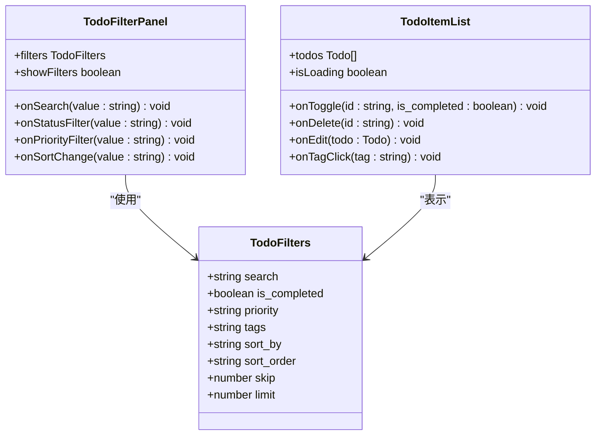
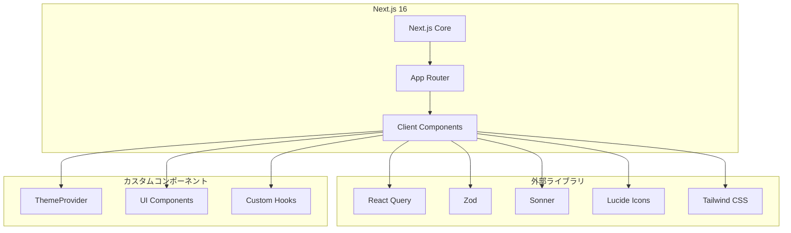

# Next.js App Router構造

<cite>
**このドキュメントで参照されるファイル**
- [frontend/src/app/layout.tsx](file://frontend/src/app/layout.tsx)
- [frontend/src/app/providers.tsx](file://frontend/src/app/providers.tsx)
- [frontend/src/app/page.tsx](file://frontend/src/app/page.tsx)
- [frontend/src/app/login/page.tsx](file://frontend/src/app/login/page.tsx)
- [frontend/src/app/register/page.tsx](file://frontend/src/app/register/page.tsx)
- [frontend/src/hooks/useTodos.ts](file://frontend/src/hooks/useTodos.ts)
- [frontend/src/lib/api.ts](file://frontend/src/lib/api.ts)
- [frontend/src/app/_components/TodoFilterPanel.tsx](file://frontend/src/app/_components/TodoFilterPanel.tsx)
- [frontend/src/app/_components/TodoItemList.tsx](file://frontend/src/app/_components/TodoItemList.tsx)
- [frontend/src/app/_components/Pagination.tsx](file://frontend/src/app/_components/Pagination.tsx)
- [frontend/src/app/_components/TodoEditDialog.tsx](file://frontend/src/app/_components/TodoEditDialog.tsx)
- [frontend/src/components/theme-provider.tsx](file://frontend/src/components/theme-provider.tsx)
- [frontend/next.config.ts](file://frontend/next.config.ts)
- [frontend/package.json](file://frontend/package.json)
</cite>

## 目次
1. [導入](#導入)
2. [プロジェクト構造](#プロジェクト構造)
3. [コアコンポーネント](#コアコンポーネント)
4. [アーキテクチャ概観](#アーキテクチャ概観)
5. [詳細コンポーネント分析](#詳細コンポーネント分析)
6. [依存関係分析](#依存関係分析)
7. [パフォーマンス考慮事項](#パフォーマンス考慮事項)
8. [トラブルシューティングガイド](#トラブルシューティングガイド)
9. [結論](#結論)

## 導入
本プロジェクトはNext.js 16のApp Routerを使用したモダンなTodoアプリケーションです。Appディレクトリの階層構造、共通レイアウト設計、コンテキスト管理、ルーティング仕組み、ページコンポーネントのライフサイクル、エラーハンドリング、スロットリングの実装方法について詳細に解説します。

## プロジェクト構造
Frontendプロジェクトの構造は以下の通りです：

**図のソース**
- [frontend/src/app/layout.tsx:1-40](file://frontend/src/app/layout.tsx#L1-L40)
- [frontend/src/app/providers.tsx:1-26](file://frontend/src/app/providers.tsx#L1-L26)
- [frontend/src/app/page.tsx:1-298](file://frontend/src/app/page.tsx#L1-L298)

**セクションのソース**
- [frontend/src/app/layout.tsx:1-40](file://frontend/src/app/layout.tsx#L1-L40)
- [frontend/src/app/providers.tsx:1-26](file://frontend/src/app/providers.tsx#L1-L26)
- [frontend/src/app/page.tsx:1-298](file://frontend/src/app/page.tsx#L1-L298)

## コアコンポーネント
### ルートレイアウト (RootLayout)
ルートレイアウトはアプリケーション全体の基本構造を定義し、以下の機能を提供します：

- Google FontsのGeistフォントの読み込み
- 共通CSSの適用
- 通知システムの初期化
- Providerコンポーネントのラッピング

### Providerコンテキスト
Providerコンポーネントは以下のコンテキストを提供します：

- React Queryのクエリクライアント管理
- テーマコンテキストの管理
- 開発用クエリツールの有効化

**セクションのソース**
- [frontend/src/app/layout.tsx:17-40](file://frontend/src/app/layout.tsx#L17-L40)
- [frontend/src/app/providers.tsx:8-26](file://frontend/src/app/providers.tsx#L8-L26)

## アーキテクチャ概観
Next.js 16のApp Routerは以下の構造で動作します：

**図のソース**
- [frontend/src/app/layout.tsx:22-40](file://frontend/src/app/layout.tsx#L22-L40)
- [frontend/src/app/providers.tsx:8-26](file://frontend/src/app/providers.tsx#L8-L26)
- [frontend/src/app/page.tsx:27-298](file://frontend/src/app/page.tsx#L27-L298)

## 詳細コンポーネント分析

### Todo管理フロー
Todoアプリケーションの主要な処理フローは以下の通りです：

**図のソース**
- [frontend/src/app/page.tsx:49-54](file://frontend/src/app/page.tsx#L49-L54)
- [frontend/src/hooks/useTodos.ts:52-108](file://frontend/src/hooks/useTodos.ts#L52-L108)

### API通信フロー
API通信は以下のステップで行われます：

**図のソース**
- [frontend/src/hooks/useTodos.ts:26-118](file://frontend/src/hooks/useTodos.ts#L26-L118)
- [frontend/src/lib/api.ts:25-62](file://frontend/src/lib/api.ts#L25-L62)

**セクションのソース**
- [frontend/src/app/page.tsx:27-298](file://frontend/src/app/page.tsx#L27-L298)
- [frontend/src/hooks/useTodos.ts:26-118](file://frontend/src/hooks/useTodos.ts#L26-L118)
- [frontend/src/lib/api.ts:25-110](file://frontend/src/lib/api.ts#L25-L110)

### 認証フロー
認証プロセスは以下の通りです：

**図のソース**
- [frontend/src/app/login/page.tsx:33-41](file://frontend/src/app/login/page.tsx#L33-L41)
- [frontend/src/lib/api.ts:64-102](file://frontend/src/lib/api.ts#L64-L102)

**セクションのソース**
- [frontend/src/app/login/page.tsx:22-105](file://frontend/src/app/login/page.tsx#L22-L105)
- [frontend/src/lib/api.ts:64-110](file://frontend/src/lib/api.ts#L64-L110)

### フィルタリング機能
フィルタリングは以下の要素で構成されます：

**図のソース**
- [frontend/src/hooks/useTodos.ts:15-24](file://frontend/src/hooks/useTodos.ts#L15-L24)
- [frontend/src/app/_components/TodoFilterPanel.tsx:15-23](file://frontend/src/app/_components/TodoFilterPanel.tsx#L15-L23)
- [frontend/src/app/_components/TodoItemList.tsx:10-17](file://frontend/src/app/_components/TodoItemList.tsx#L10-L17)

**セクションのソース**
- [frontend/src/app/_components/TodoFilterPanel.tsx:25-105](file://frontend/src/app/_components/TodoFilterPanel.tsx#L25-L105)
- [frontend/src/app/_components/TodoItemList.tsx:34-182](file://frontend/src/app/_components/TodoItemList.tsx#L34-L182)

## 依存関係分析
Next.js 16プロジェクトの依存関係は以下の通りです：

**図のソース**
- [frontend/package.json:18-36](file://frontend/package.json#L18-L36)
- [frontend/src/app/providers.tsx:3-6](file://frontend/src/app/providers.tsx#L3-L6)

**セクションのソース**
- [frontend/package.json:1-65](file://frontend/package.json#L1-L65)
- [frontend/src/app/providers.tsx:1-26](file://frontend/src/app/providers.tsx#L1-L26)

## パフォーマンス考慮事項
### キャッシュ戦略
- React QueryのstaleTimeを60秒に設定し、キャッシュの有効期間を最適化
- APIクエリの無効化を適切に行い、不要なリクエストを削減

### ページネーション
- Todoリストのページネーションにより、一度に大量のデータをロードすることを防ぐ
- 各ページの表示件数を制限し、パフォーマンスを維持

### テーマ切り替え
- next-themesを使用したクライアントサイドのテーマ切り替え
- システム設定の変更に応じた自動切り替え対応

## トラブルシューティングガイド

### 認証エラー対応
401エラー時のリダイレクト処理：
- APIエラーレスポンスのstatusコードを確認
- 401エラーの場合のみログインページへのリダイレクトを実行
- 他のエラーの場合はエラーメッセージを表示

### APIエラーハンドリング
- ApiErrorクラスを使用したエラーハンドリング
- サーバーエラーメッセージの抽出と表示
- バリデーションエラーの詳細表示対応

### ページコンポーネントのライフサイクル
- useEffectを使用した認証状態の監視
- ローディング状態の適切な表示
- エラー状態でのリダイレクト防止

**セクションのソース**
- [frontend/src/app/page.tsx:49-54](file://frontend/src/app/page.tsx#L49-L54)
- [frontend/src/lib/api.ts:17-23](file://frontend/src/lib/api.ts#L17-L23)
- [frontend/src/lib/api.ts:39-59](file://frontend/src/lib/api.ts#L39-L59)

## 結論
本プロジェクトはNext.js 16のApp Routerを活用した高度なTodoアプリケーションを実装しています。共通レイアウト設計、コンテキスト管理、ルーティング仕組み、ページコンポーネントのライフサイクル、エラーハンドリング、スロットリングの実装方法を網羅的に実装しており、モダンなWebアプリケーションのベストプラクティスを反映しています。React Queryの使用により、データ取得とキャッシュ管理が効率的に行われており、ユーザー体験の向上に貢献しています。