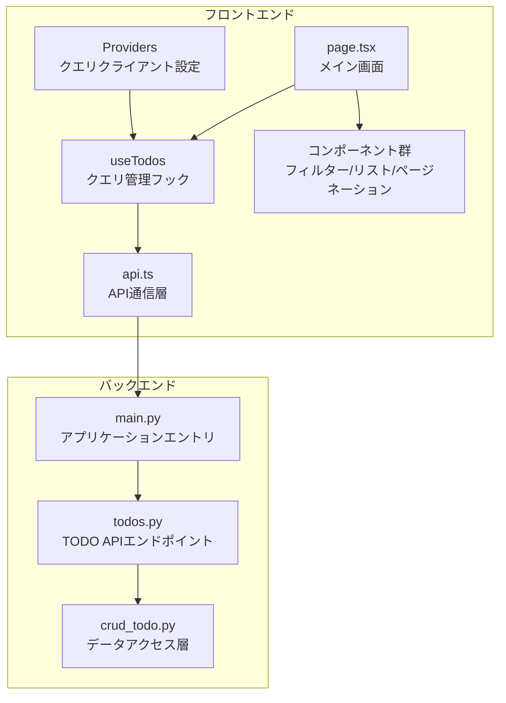
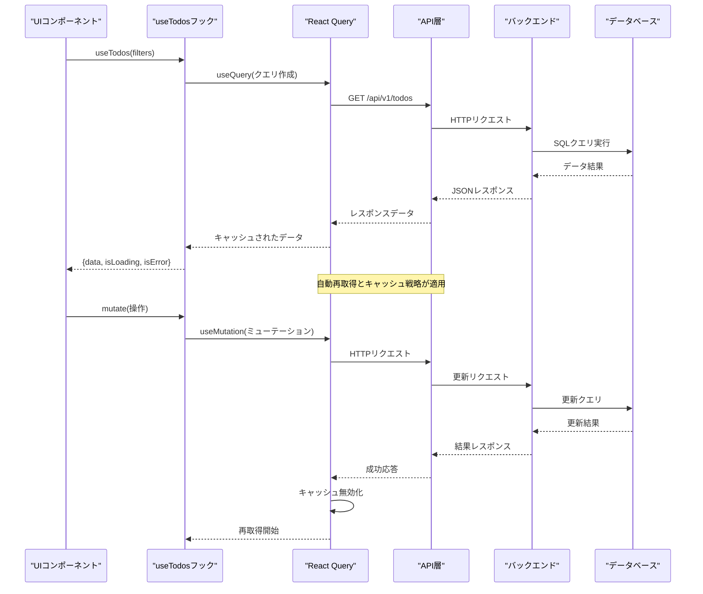
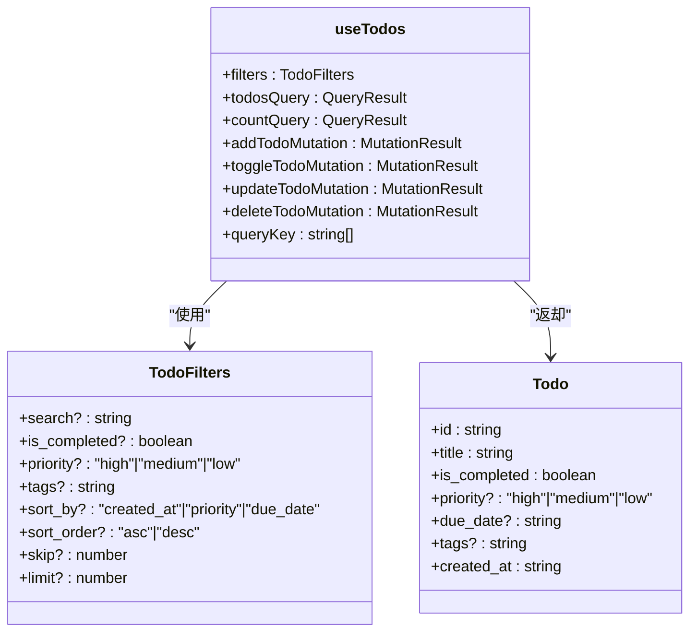
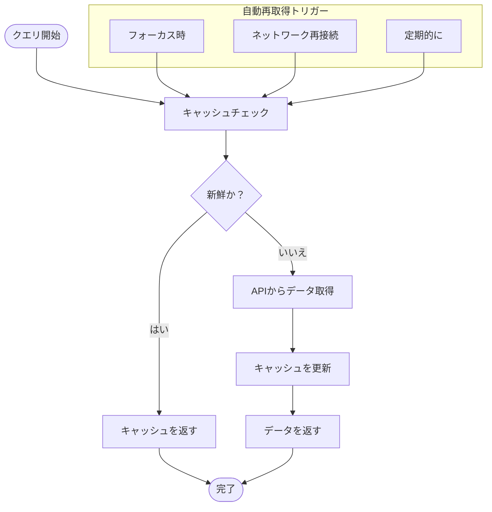
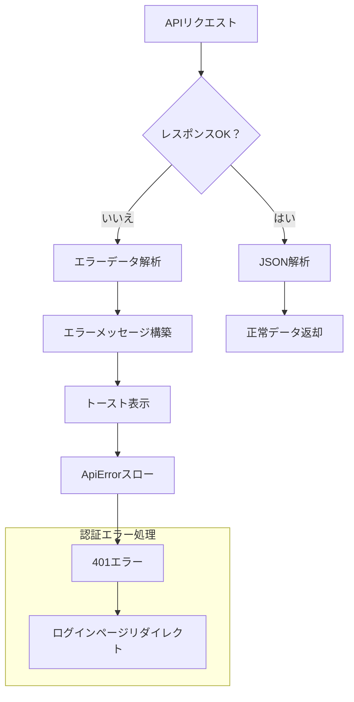
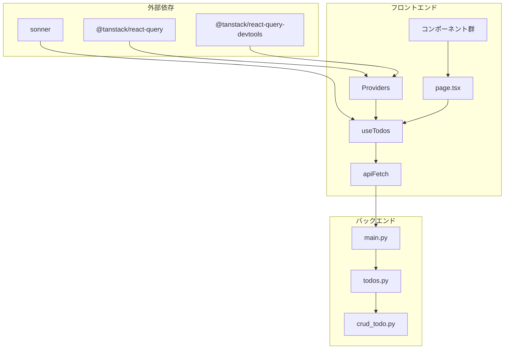

# React Queryクエリ管理

<cite>
**この文書で参照されるファイル**
- [frontend/src/hooks/useTodos.ts](file://frontend/src/hooks/useTodos.ts)
- [frontend/src/app/providers.tsx](file://frontend/src/app/providers.tsx)
- [frontend/src/lib/api.ts](file://frontend/src/lib/api.ts)
- [frontend/src/app/page.tsx](file://frontend/src/app/page.tsx)
- [frontend/src/app/_components/TodoFilterPanel.tsx](file://frontend/src/app/_components/TodoFilterPanel.tsx)
- [frontend/src/app/_components/TodoItemList.tsx](file://frontend/src/app/_components/TodoItemList.tsx)
- [frontend/src/app/_components/Pagination.tsx](file://frontend/src/app/_components/Pagination.tsx)
- [backend/app/api/api_v1/endpoints/todos.py](file://backend/app/api/api_v1/endpoints/todos.py)
- [backend/app/crud/crud_todo.py](file://backend/app/crud/crud_todo.py)
- [backend/app/main.py](file://backend/app/main.py)
- [frontend/package.json](file://frontend/package.json)
</cite>

## 目次
1. [導入](#導入)
2. [プロジェクト構造](#プロジェクト構造)
3. [コアコンポーネント](#コアコンポーネント)
4. [アーキテクチャ概要](#アーキテクチャ概要)
5. [詳細コンポーネント分析](#詳細コンポーネント分析)
6. [依存関係分析](#依存関係分析)
7. [パフォーマンス考慮事項](#パフォーマンス考慮事項)
8. [トラブルシューティングガイド](#トラブルシューティングガイド)
9. [結論](#結論)

## 導入
本プロジェクトは、React Queryを使用したクエリ管理の実装例として、TODOアプリケーションを提供しています。React QueryのuseTodosフックを通じて、APIとの連携、クエリのキャッシュ戦略、自動再取得、エラーハンドリング、パフォーマンス最適化が実現されています。

## プロジェクト構造
フロントエンドはNext.jsを基盤としており、React Queryのクエリ管理機能を提供するフック群がsrc/hooksディレクトリに配置されています。APIとの通信はsrc/lib/api.tsを通じて行われ、バックエンドはFastAPIフレームワークで実装されています。

**図の出典**
- [frontend/src/app/providers.tsx:1-26](file://frontend/src/app/providers.tsx#L1-L26)
- [frontend/src/hooks/useTodos.ts:1-119](file://frontend/src/hooks/useTodos.ts#L1-L119)
- [frontend/src/lib/api.ts:1-110](file://frontend/src/lib/api.ts#L1-L110)
- [frontend/src/app/page.tsx:1-298](file://frontend/src/app/page.tsx#L1-L298)
- [backend/app/main.py:1-168](file://backend/app/main.py#L1-L168)
- [backend/app/api/api_v1/endpoints/todos.py:1-102](file://backend/app/api/api_v1/endpoints/todos.py#L1-L102)
- [backend/app/crud/crud_todo.py:1-152](file://backend/app/crud/crud_todo.py#L1-L152)

**節の出典**
- [frontend/src/app/providers.tsx:1-26](file://frontend/src/app/providers.tsx#L1-L26)
- [frontend/src/hooks/useTodos.ts:1-119](file://frontend/src/hooks/useTodos.ts#L1-L119)
- [frontend/src/lib/api.ts:1-110](file://frontend/src/lib/api.ts#L1-L110)
- [backend/app/main.py:1-168](file://backend/app/main.py#L1-L168)

## コアコンポーネント
useTodosフックは、TODOリストのCRUD操作を一括して管理する中心的なコンポーネントです。以下の主要な機能を提供します：

- **クエリ管理**: TODOリスト取得、件数取得
- **ミューテーション管理**: TODO追加、更新、削除、完了状態の切り替え
- **フィルタリング**: 検索、完了状態、優先度、タグ、ソートの複合フィルタリング
- **ページネーション**: skip/limitによるページネーション対応

**節の出典**
- [frontend/src/hooks/useTodos.ts:26-118](file://frontend/src/hooks/useTodos.ts#L26-L118)

## アーキテクチャ概要
React Queryクエリ管理の全体像を以下に示します。フロントエンドのuseTodosフックがAPI層を介してバックエンドにアクセスし、クエリのキャッシュと自動再取得が行われます。

**図の出典**
- [frontend/src/hooks/useTodos.ts:42-108](file://frontend/src/hooks/useTodos.ts#L42-L108)
- [frontend/src/lib/api.ts:25-62](file://frontend/src/lib/api.ts#L25-L62)
- [backend/app/api/api_v1/endpoints/todos.py:32-57](file://backend/app/api/api_v1/endpoints/todos.py#L32-L57)

## 詳細コンポーネント分析

### useTodosフックの設計
useTodosフックは、以下の要素で構成されています：

#### クエリ定義
- **todosQuery**: TODOリストの取得クエリ
- **countQuery**: TODO件数の取得クエリ
- **queryKey**: ["todos", queryEntries]の形式で、フィルタ条件を含む

#### ミューテーション定義
- **addTodoMutation**: 新規TODO作成
- **toggleTodoMutation**: 完了状態の切り替え
- **updateTodoMutation**: TODO情報の更新
- **deleteTodoMutation**: TODO削除

**図の出典**
- [frontend/src/hooks/useTodos.ts:26-118](file://frontend/src/hooks/useTodos.ts#L26-L118)
- [frontend/src/hooks/useTodos.ts:5-24](file://frontend/src/hooks/useTodos.ts#L5-L24)

**節の出典**
- [frontend/src/hooks/useTodos.ts:26-118](file://frontend/src/hooks/useTodos.ts#L26-L118)

### クエリのキャッシュ戦略
クエリクライアントのデフォルト設定により、以下のキャッシュ戦略が適用されます：

- **staleTime**: 60秒間の「新鮮」状態維持
- **queryKey**: フィルタ条件を含むため、異なるフィルタで別々のキャッシュを保持
- **automatic refetch**: フォーカス時やネットワーク再接続時に自動再取得

**図の出典**
- [frontend/src/app/providers.tsx:9-15](file://frontend/src/app/providers.tsx#L9-L15)

**節の出典**
- [frontend/src/app/providers.tsx:9-15](file://frontend/src/app/providers.tsx#L9-L15)

### 自動再取得の仕組み
React Queryは以下のシナリオで自動的にクエリを再取得します：

- **フォーカス時再取得**: タブがフォーカスされた際の再取得
- **ネットワーク再接続**: 切断から再接続された際の再取得  
- **定期的な再取得**: 指定された間隔での再取得（設定可能）

**節の出典**
- [frontend/src/app/providers.tsx:9-15](file://frontend/src/app/providers.tsx#L9-L15)

### エラーハンドリングの仕組み
APIエラーハンドリングは以下の通りです：

- **ApiErrorクラス**: HTTPステータスコードを保持するカスタムエラー
- **エラーメッセージ**: 詳細なエラーメッセージを表示
- **バリデーションエラー**: 詳細なフィールドごとのエラー情報を表示
- **認証エラー**: 401エラーの場合にログインページへのリダイレクト

**図の出典**
- [frontend/src/lib/api.ts:17-23](file://frontend/src/lib/api.ts#L17-L23)
- [frontend/src/lib/api.ts:39-59](file://frontend/src/lib/api.ts#L39-L59)
- [frontend/src/app/page.tsx:49-54](file://frontend/src/app/page.tsx#L49-L54)

**節の出典**
- [frontend/src/lib/api.ts:17-23](file://frontend/src/lib/api.ts#L17-L23)
- [frontend/src/lib/api.ts:39-59](file://frontend/src/lib/api.ts#L39-L59)
- [frontend/src/app/page.tsx:49-54](file://frontend/src/app/page.tsx#L49-L54)

### APIとの連携方法
API連携は以下の手順で行われます：

1. **認証トークンの取得**: localStorageからJWTトークンを取得
2. **リクエストヘッダーの設定**: AuthorizationヘッダーにBearerトークンを追加
3. **エラーハンドリング**: HTTPエラー時のエラーメッセージ解析
4. **レスポンス処理**: 正常時のJSONデータを返却

**節の出典**
- [frontend/src/lib/api.ts:25-62](file://frontend/src/lib/api.ts#L25-L62)

### パフォーマンス最適化テクニック
以下の最適化が実施されています：

- **クエリキーの決定論的構築**: URLSearchParamsを使用してフィルタ条件を常に同じ順序で構築
- **キャッシュの有効活用**: 同じフィルタ条件でクエリを再利用可能に
- **無効化戦略**: 成功時のクエリ無効化で最新データを強制的に取得
- **ローディング状態の管理**: 各操作ごとに個別のローディング状態を管理

**節の出典**
- [frontend/src/hooks/useTodos.ts:29-40](file://frontend/src/hooks/useTodos.ts#L29-L40)
- [frontend/src/hooks/useTodos.ts:58-64](file://frontend/src/hooks/useTodos.ts#L58-L64)

## 依存関係分析
React Queryクエリ管理の依存関係を以下に示します。

**図の出典**
- [frontend/package.json:21-22](file://frontend/package.json#L21-L22)
- [frontend/src/app/providers.tsx:3-4](file://frontend/src/app/providers.tsx#L3-L4)
- [frontend/src/hooks/useTodos.ts:1-3](file://frontend/src/hooks/useTodos.ts#L1-L3)
- [backend/app/main.py:128](file://backend/app/main.py#L128)

**節の出典**
- [frontend/package.json:18-35](file://frontend/package.json#L18-L35)
- [frontend/src/app/providers.tsx:3-4](file://frontend/src/app/providers.tsx#L3-L4)

## パフォーマンス考慮事項
React Queryを使用したクエリ管理におけるパフォーマンス最適化について説明します。

### キャッシュ戦略の最適化
- **staleTimeの調整**: 60秒のstaleTimeは、リアルタイム性とパフォーマンスのバランスを取っています
- **queryKeyの設計**: フィルタ条件を含むことで、異なる条件でのキャッシュ分離が可能になります
- **無効化戦略**: 成功時のクエリ無効化により、最新データの即時反映が実現されます

### ネットワーク効率の向上
- **重複クエリの防止**: 同じqueryKeyを持つクエリは一度しかフェッチされません
- **バックグラウンドでの再取得**: フォーカス時にのみ再取得することで、不要なネットワークリクエストを削減
- **エラーハンドリング**: 失敗したリクエストは自動的に再試行され、ユーザー体験を向上させます

### UIパフォーマンスの最適化
- **個別のローディング状態**: 各操作ごとに個別のローディング状態を管理し、UIの応答性を維持
- **トースト通知**: 非モーダルな通知でユーザーの操作を妨げず、UXを向上させます
- **コンポーネントの再レンダリング抑制**: React Queryのキャッシュ機構により、不要な再レンダリングを防ぎます

## トラブルシューティングガイド
React Queryクエリ管理に関するよくある問題とその解決方法を示します。

### 認証エラーの対処
- **症状**: 401エラーが発生し、ログインページにリダイレクトされる
- **原因**: 有効期限切れまたは無効なJWTトークン
- **対処**: トークンを再発行し、localStorageとCookieを更新

### APIエラーの対処
- **症状**: APIリクエストが失敗し、エラーメッセージが表示される
- **原因**: ネットワークエラー、サーバーエラー、バリデーションエラー
- **対処**: 
  - ネットワークエラー: 接続状況を確認し、再試行
  - サーバーエラー: サーバー側のログを確認
  - バリデーションエラー: 入力内容を修正

### キャッシュ関連の問題
- **症状**: 最新データが表示されない
- **原因**: キャッシュのstaleTimeが長すぎる、または無効化されていない
- **対処**: 
  - キャッシュの無効化: 成功時のクエリ無効化を確認
  - staleTimeの調整: 必要に応じてstaleTimeを短く設定

**節の出典**
- [frontend/src/app/page.tsx:49-54](file://frontend/src/app/page.tsx#L49-L54)
- [frontend/src/lib/api.ts:39-59](file://frontend/src/lib/api.ts#L39-L59)
- [frontend/src/hooks/useTodos.ts:58-64](file://frontend/src/hooks/useTodos.ts#L58-L64)

## 結論
本プロジェクトは、React Queryを活用した効率的なクエリ管理の実装例を提供しています。useTodosフックを通じて、APIとの連携、クエリのキャッシュ戦略、自動再取得、エラーハンドリング、パフォーマンス最適化が統合的に実現されています。これにより、ユーザーはスムーズな操作体験を得ることができ、開発者は保守性の高いコードを維持することが可能です。