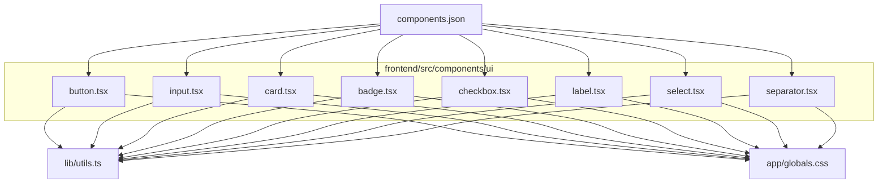
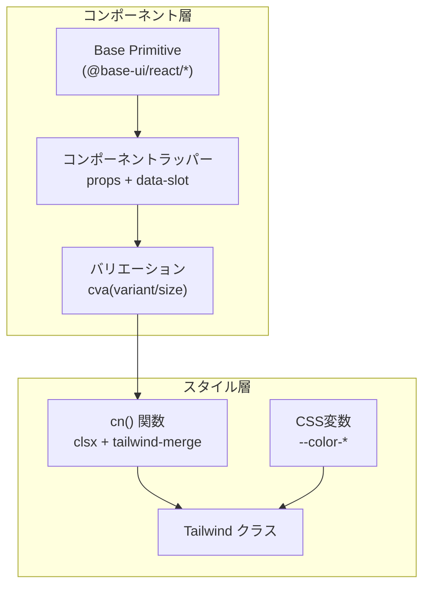
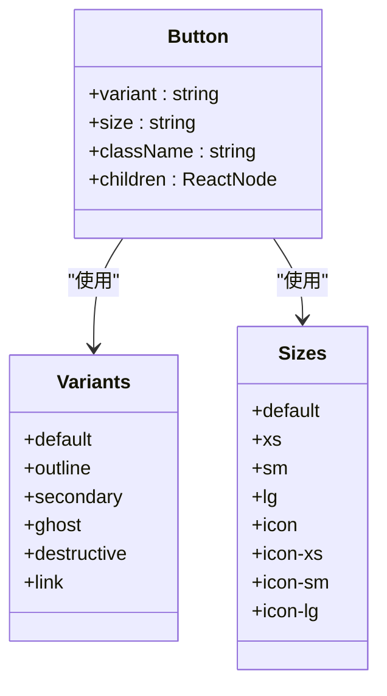
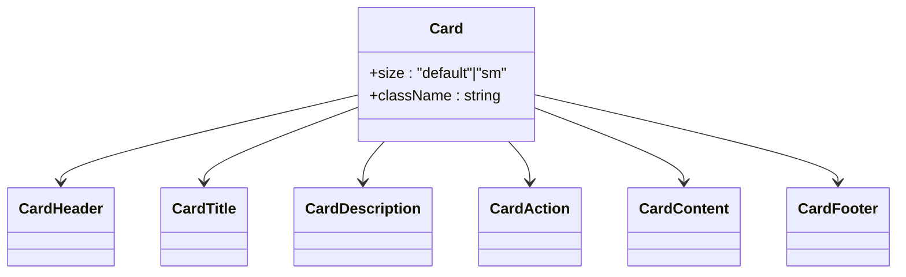
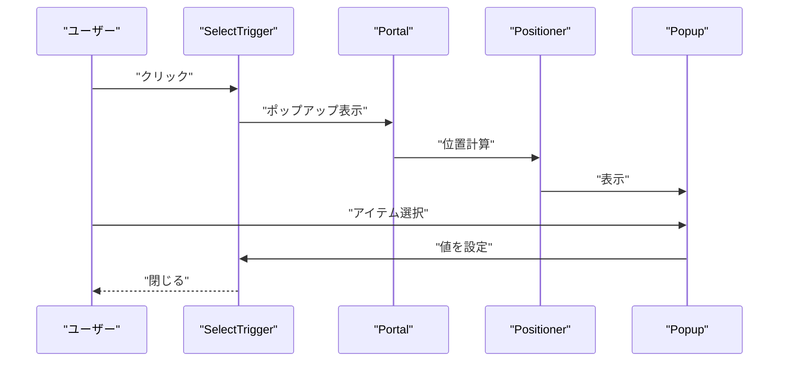
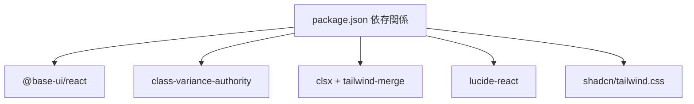

# UIコンポーネント

<cite>
**この文書で参照されるファイル**
- [frontend/src/components/ui/button.tsx](file://frontend/src/components/ui/button.tsx)
- [frontend/src/components/ui/input.tsx](file://frontend/src/components/ui/input.tsx)
- [frontend/src/components/ui/card.tsx](file://frontend/src/components/ui/card.tsx)
- [frontend/src/components/ui/badge.tsx](file://frontend/src/components/ui/badge.tsx)
- [frontend/src/components/ui/checkbox.tsx](file://frontend/src/components/ui/checkbox.tsx)
- [frontend/src/components/ui/label.tsx](file://frontend/src/components/ui/label.tsx)
- [frontend/src/components/ui/select.tsx](file://frontend/src/components/ui/select.tsx)
- [frontend/src/components/ui/separator.tsx](file://frontend/src/components/ui/separator.tsx)
- [frontend/src/lib/utils.ts](file://frontend/src/lib/utils.ts)
- [frontend/components.json](file://frontend/components.json)
- [frontend/src/app/globals.css](file://frontend/src/app/globals.css)
- [frontend/package.json](file://frontend/package.json)
- [frontend/src/components/theme-provider.tsx](file://frontend/src/components/theme-provider.tsx)
- [frontend/src/components/theme-toggle.tsx](file://frontend/src/components/theme-toggle.tsx)
- [frontend/src/__tests__/theme-toggle.test.tsx](file://frontend/src/__tests__/theme-toggle.test.tsx)
</cite>

## 目次
1. [導入](#導入)
2. [プロジェクト構造](#プロジェクト構造)
3. [コアコンポーネント](#コアコンポーネント)
4. [アーキテクチャ概観](#アーキテクチャ概観)
5. [詳細コンポーネント解析](#詳細コンポーネント解析)
6. [依存関係解析](#依存関係解析)
7. [パフォーマンス考慮事項](#パフォーマンス考慮事項)
8. [トラブルシューティングガイド](#トラブルシューティングガイド)
9. [結論](#結論)
10. [付録](#付録)

## 導入
本ドキュメントは、shadcn/uiベースのUIコンポーネント群の詳細設計を説明します。対象となるコンポーネントには、ボタン、入力フォーム、カード、バッジ、チェックボックス、ラベル、セレクト、区切り線などがあります。それぞれのコンポーネントのprops、イベント、カスタマイズ方法、Tailwind CSSとの統合、アクセシビリティ対応、レスポンシブデザインの実装方法について解説します。

## プロジェクト構造
UIコンポーネントはfrontend/src/components/ui配下に配置されており、各コンポーネントは最小限の責務を持ち、再利用性と拡張性を重視して設計されています。スタイルはTailwind CSSとCSS変数によって管理され、components.jsonがshadcn/uiの設定を保持しています。

**図の出典**
- [frontend/src/components/ui/button.tsx:1-59](file://frontend/src/components/ui/button.tsx#L1-L59)
- [frontend/src/components/ui/input.tsx:1-21](file://frontend/src/components/ui/input.tsx#L1-L21)
- [frontend/src/components/ui/card.tsx:1-104](file://frontend/src/components/ui/card.tsx#L1-L104)
- [frontend/src/components/ui/badge.tsx:1-53](file://frontend/src/components/ui/badge.tsx#L1-L53)
- [frontend/src/components/ui/checkbox.tsx:1-30](file://frontend/src/components/ui/checkbox.tsx#L1-L30)
- [frontend/src/components/ui/label.tsx:1-21](file://frontend/src/components/ui/label.tsx#L1-L21)
- [frontend/src/components/ui/select.tsx:1-202](file://frontend/src/components/ui/select.tsx#L1-L202)
- [frontend/src/components/ui/separator.tsx:1-26](file://frontend/src/components/ui/separator.tsx#L1-L26)
- [frontend/src/lib/utils.ts:1-7](file://frontend/src/lib/utils.ts#L1-L7)
- [frontend/src/app/globals.css:1-130](file://frontend/src/app/globals.css#L1-L130)
- [frontend/components.json:1-26](file://frontend/components.json#L1-L26)

**節の出典**
- [frontend/src/components/ui/button.tsx:1-59](file://frontend/src/components/ui/button.tsx#L1-L59)
- [frontend/src/components/ui/input.tsx:1-21](file://frontend/src/components/ui/input.tsx#L1-L21)
- [frontend/src/components/ui/card.tsx:1-104](file://frontend/src/components/ui/card.tsx#L1-L104)
- [frontend/src/components/ui/badge.tsx:1-53](file://frontend/src/components/ui/badge.tsx#L1-L53)
- [frontend/src/components/ui/checkbox.tsx:1-30](file://frontend/src/components/ui/checkbox.tsx#L1-L30)
- [frontend/src/components/ui/label.tsx:1-21](file://frontend/src/components/ui/label.tsx#L1-L21)
- [frontend/src/components/ui/select.tsx:1-202](file://frontend/src/components/ui/select.tsx#L1-L202)
- [frontend/src/components/ui/separator.tsx:1-26](file://frontend/src/components/ui/separator.tsx#L1-L26)
- [frontend/src/lib/utils.ts:1-7](file://frontend/src/lib/utils.ts#L1-L7)
- [frontend/src/app/globals.css:1-130](file://frontend/src/app/globals.css#L1-L130)
- [frontend/components.json:1-26](file://frontend/components.json#L1-L26)

## コアコンポーネント
本プロジェクトのUIコンポーネントは、以下の特徴を持っています。

- 基底コンポーネントライブラリとして@base-ui/reactを使用し、アクセシブルなネイティブ要素をラップ
- class-variance-authorityによるバリエーション（variant/size）の定義
- Tailwind Merge + clsxによるクラスのマージ
- CSS変数によるカラーパレット管理（shadcn/ui準拠）
- data-slot属性による内部構造の識別
- aria-*属性による状態表現（無効、エラー、選択中など）

**節の出典**
- [frontend/src/components/ui/button.tsx:1-59](file://frontend/src/components/ui/button.tsx#L1-L59)
- [frontend/src/components/ui/input.tsx:1-21](file://frontend/src/components/ui/input.tsx#L1-L21)
- [frontend/src/components/ui/card.tsx:1-104](file://frontend/src/components/ui/card.tsx#L1-L104)
- [frontend/src/components/ui/badge.tsx:1-53](file://frontend/src/components/ui/badge.tsx#L1-L53)
- [frontend/src/components/ui/checkbox.tsx:1-30](file://frontend/src/components/ui/checkbox.tsx#L1-L30)
- [frontend/src/components/ui/label.tsx:1-21](file://frontend/src/components/ui/label.tsx#L1-L21)
- [frontend/src/components/ui/select.tsx:1-202](file://frontend/src/components/ui/select.tsx#L1-L202)
- [frontend/src/components/ui/separator.tsx:1-26](file://frontend/src/components/ui/separator.tsx#L1-L26)
- [frontend/src/lib/utils.ts:1-7](file://frontend/src/lib/utils.ts#L1-L7)
- [frontend/src/app/globals.css:1-130](file://frontend/src/app/globals.css#L1-L130)

## アーキテクチャ概観
コンポーネントは「基底要素」＋「バリエーション」＋「状態」の3層構造を持ちます。バリエーションはcvaで定義され、状態はaria-*やdata-*属性で表現されます。スタイルはCSS変数とTailwindクラスの組み合わせで実現され、テーマ切り替えに対応しています。

**図の出典**
- [frontend/src/components/ui/button.tsx:6-41](file://frontend/src/components/ui/button.tsx#L6-L41)
- [frontend/src/components/ui/input.tsx:6-18](file://frontend/src/components/ui/input.tsx#L6-L18)
- [frontend/src/lib/utils.ts:4-6](file://frontend/src/lib/utils.ts#L4-L6)
- [frontend/src/app/globals.css:7-49](file://frontend/src/app/globals.css#L7-L49)

## 詳細コンポーネント解析

### ボタン（Button）
- 機能：クリック可能な基本的なインタラクティブ要素
- 主なprops
  - variant: "default" | "outline" | "secondary" | "ghost" | "destructive" | "link"
  - size: "default" | "xs" | "sm" | "lg" | "icon" | "icon-xs" | "icon-sm" | "icon-lg"
  - className: 追加クラス
- 独自仕様
  - data-slot="button" で内部構造を識別
  - aria-invalidに対応したバリエーション
  - アイコン付きのgap/padding調整
- カスタマイズ方法
  - variant/sizeを変更
  - classNameで追加スタイル
  - 子要素としてSVGアイコンを配置（自動サイズ調整あり）

**図の出典**
- [frontend/src/components/ui/button.tsx:6-41](file://frontend/src/components/ui/button.tsx#L6-L41)

**節の出典**
- [frontend/src/components/ui/button.tsx:43-56](file://frontend/src/components/ui/button.tsx#L43-L56)

### 入力フォーム（Input）
- 機能：テキスト入力用の基本要素
- 主なprops
  - type: "text" | "email" | "password" など
  - className: 追加クラス
- 特徴
  - data-slot="input"
  - aria-invalidによるエラー状態表示
  - focus時とdisabled時の視覚的フィードバック
- カスタマイズ方法
  - typeを変更
  - classNameで幅・余白などを調整

**節の出典**
- [frontend/src/components/ui/input.tsx:6-18](file://frontend/src/components/ui/input.tsx#L6-L18)

### カード（Card）
- 機能：コンテンツを枠で囲むコンテナ
- 主なprops
  - size: "default" | "sm"
  - className: 追加クラス
- 内部構成
  - CardHeader/CardTitle/CardDescription/CardAction/CardContent/CardFooter
- 特徴
  - data-size="sm" によるサイズ変更
  - data-slot属性で各パーツを識別
  - グリッドレイアウトによるアクション配置
- カスタマイズ方法
  - sizeをsmに変更
  - 各セクションを必要に応じて組み合わせ

**図の出典**
- [frontend/src/components/ui/card.tsx:5-21](file://frontend/src/components/ui/card.tsx#L5-L21)
- [frontend/src/components/ui/card.tsx:23-34](file://frontend/src/components/ui/card.tsx#L23-L34)
- [frontend/src/components/ui/card.tsx:36-47](file://frontend/src/components/ui/card.tsx#L36-L47)
- [frontend/src/components/ui/card.tsx:49-57](file://frontend/src/components/ui/card.tsx#L49-L57)
- [frontend/src/components/ui/card.tsx:59-69](file://frontend/src/components/ui/card.tsx#L59-L69)
- [frontend/src/components/ui/card.tsx:72-80](file://frontend/src/components/ui/card.tsx#L72-L80)
- [frontend/src/components/ui/card.tsx:82-93](file://frontend/src/components/ui/card.tsx#L82-L93)

**節の出典**
- [frontend/src/components/ui/card.tsx:1-104](file://frontend/src/components/ui/card.tsx#L1-L104)

### バッジ（Badge）
- 機能：ラベルやステータスを示す小さなタグ
- 主なprops
  - variant: "default" | "secondary" | "destructive" | "outline" | "ghost" | "link"
  - className: 追加クラス
  - render: useRenderによるカスタムレンダリング
- 特徴
  - cvaによるバリエーション
  - data-slot="badge"
  - aria-invalidによるエラー状態
- カスタマイズ方法
  - variantを変更
  - renderでカスタム要素を指定

**節の出典**
- [frontend/src/components/ui/badge.tsx:30-50](file://frontend/src/components/ui/badge.tsx#L30-L50)

### チェックボックス（Checkbox）
- 機能：ON/OFFを切り替える選択要素
- 主なprops
  - className: 追加クラス
  - その他のCheckboxPrimitive.Root.Props
- 特徴
  - data-slot="checkbox"
  - data-checkedによる選択状態
  - aria-invalidによるエラー状態
  - 内部にCheckIconを表示
- カスタマイズ方法
  - classNameで外観を調整
  - 外部ラベルと連携する際はLabelコンポーネントを使用

**節の出典**
- [frontend/src/components/ui/checkbox.tsx:8-27](file://frontend/src/components/ui/checkbox.tsx#L8-L27)

### ラベル（Label）
- 機能：フォーム要素の見出しまたは説明
- 主なprops
  - className: 追加クラス
- 特徴
  - data-slot="label"
  - disabled状態への対応
  - peerとの連携で入力要素の状態を反映
- カスタマイズ方法
  - classNameでフォント・余白を調整

**節の出典**
- [frontend/src/components/ui/label.tsx:7-17](file://frontend/src/components/ui/label.tsx#L7-L17)

### セレクト（Select）
- 機能：選択肢から1つを選ぶ入力コンポーネント
- 主なprops
  - Trigger: size="sm" | "default"
  - Content: align/side/sideOffset/alignOffset/alignItemWithTrigger
  - Item: destructiveneeds対応
- 内部構成
  - SelectTrigger/SelectContent/SelectValue/SelectLabel/SelectItem/SelectSeparator/SelectScrollUpButton/SelectScrollDownButton
- 特徴
  - Portalによるポップアップ配置
  - Positionerによる位置計算
  - data-slot属性で各パーツ識別
  - Scrollボタンによるスクロール操作
- カスタマイズ方法
  - Triggerのsizeを変更
  - Contentの配置オプションを調整
  - Itemにアイコンやカスタム要素を含める

**図の出典**
- [frontend/src/components/ui/select.tsx:31-57](file://frontend/src/components/ui/select.tsx#L31-L57)
- [frontend/src/components/ui/select.tsx:59-96](file://frontend/src/components/ui/select.tsx#L59-L96)

**節の出典**
- [frontend/src/components/ui/select.tsx:9-201](file://frontend/src/components/ui/select.tsx#L9-L201)

### 区切り線（Separator）
- 機能：セクション間の区切りを示す線
- 主なprops
  - orientation: "horizontal" | "vertical"
  - className: 追加クラス
- 特徴
  - data-slot="separator"
  - data-horizontal/data-verticalによる向きの判定
- カスタマイズ方法
  - orientationを変更
  - classNameで太さ・色を調整

**節の出典**
- [frontend/src/components/ui/separator.tsx:7-23](file://frontend/src/components/ui/separator.tsx#L7-L23)

## 依存関係解析
コンポーネント間の依存関係と外部ライブラリの統合を以下に示します。

**図の出典**
- [frontend/package.json:18-35](file://frontend/package.json#L18-L35)
- [frontend/components.json:1-26](file://frontend/components.json#L1-L26)

**節の出典**
- [frontend/package.json:18-35](file://frontend/package.json#L18-L35)
- [frontend/components.json:1-26](file://frontend/components.json#L1-L26)

## パフォーマンス考慮事項
- クラスマージの最適化
  - cn()関数はclsxとtailwind-mergeを使用し、重複クラスを効率的に削除
- レスポンシブデザイン
  - Tailwindのレスポンシブ接頭辞（md:, lg:など）を活用
  - CSS変数によるテーマ対応
- アニメーションとポップアップ
  - PortalとPositionerによるDOMの効率的な配置
  - data-*属性による条件付きアニメーション

## トラブルシューティングガイド
- テーマ切り替え時のハイドレーションミスマッチ
  - ThemeToggleコンポーネントではマウント後のレンダリングにより回避
  - sr-onlyでスクリーンリーダー用ラベルを提供
- アクセシビリティ
  - aria-invalid、aria-expanded、aria-checkedなどの状態属性を適切に設定
  - data-slot属性で内部要素を特定可能に
- カラーパレット
  - CSS変数が正しく定義されているか確認
  - darkカスタム変数が有効になっているか確認

**節の出典**
- [frontend/src/components/theme-toggle.tsx:8-36](file://frontend/src/components/theme-toggle.tsx#L8-L36)
- [frontend/src/__tests__/theme-toggle.test.tsx:1-28](file://frontend/src/__tests__/theme-toggle.test.tsx#L1-L28)
- [frontend/src/app/globals.css:5-130](file://frontend/src/app/globals.css#L5-L130)

## 結論
本プロジェクトのUIコンポーネントは、shadcn/uiの設計思想に従い、アクセシブルでカスタマイズ可能な構造を実現しています。バリエーションと状態の明確な分離、CSS変数とTailwindの統合、そしてデータ属性による内部構造の識別により、保守性と拡張性を両立しています。

## 付録
- Tailwind CSSとの統合
  - components.jsonでtailwind設定を管理
  - globals.cssでCSS変数と@themeを定義
- アクセシビリティ対応
  - aria-*属性による状態表現
  - data-slot属性による要素識別
- レスポンシブデザイン
  - CSS変数によるテーマ対応
  - Tailwindのレスポンシブクラスの活用

**節の出典**
- [frontend/components.json:6-12](file://frontend/components.json#L6-L12)
- [frontend/src/app/globals.css:1-130](file://frontend/src/app/globals.css#L1-L130)
- [frontend/src/lib/utils.ts:4-6](file://frontend/src/lib/utils.ts#L4-L6)