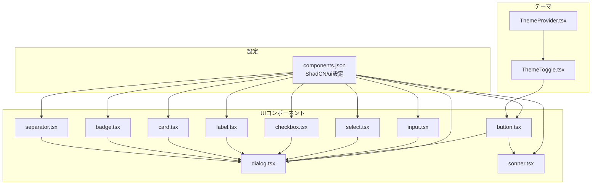
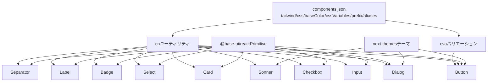
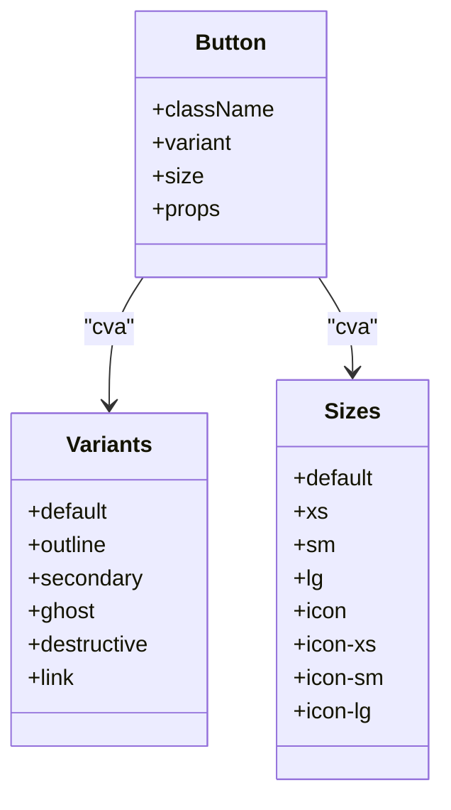
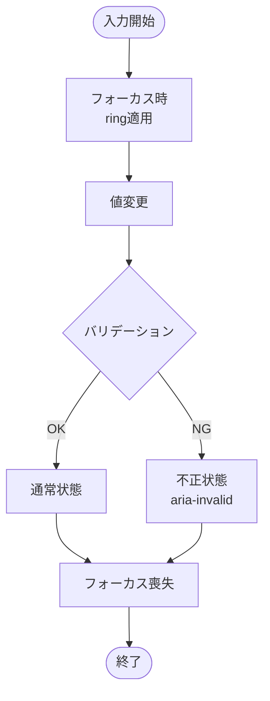
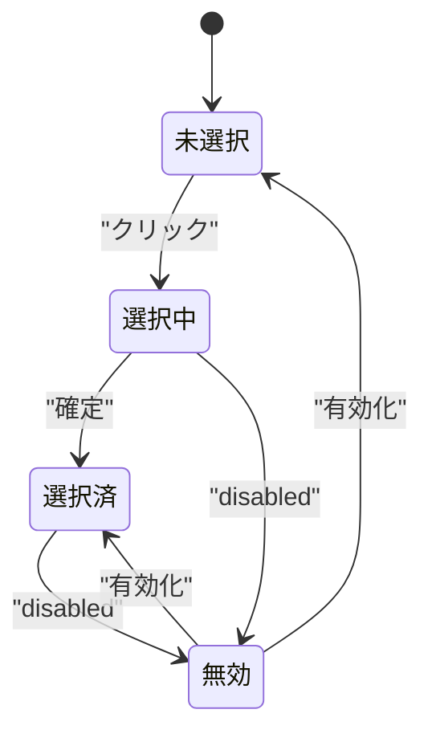
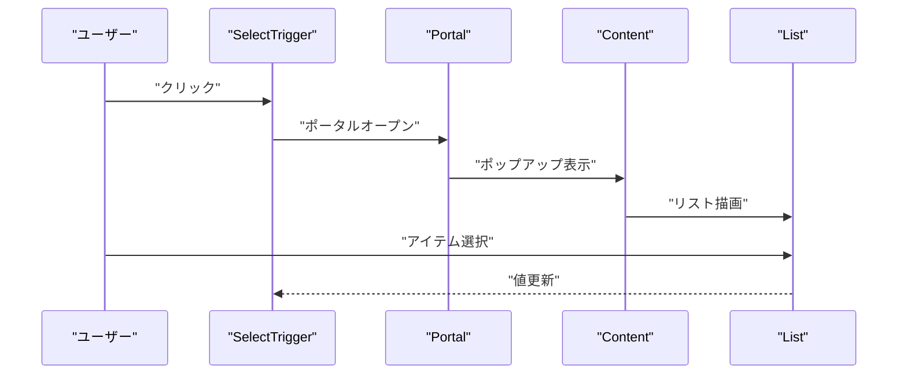
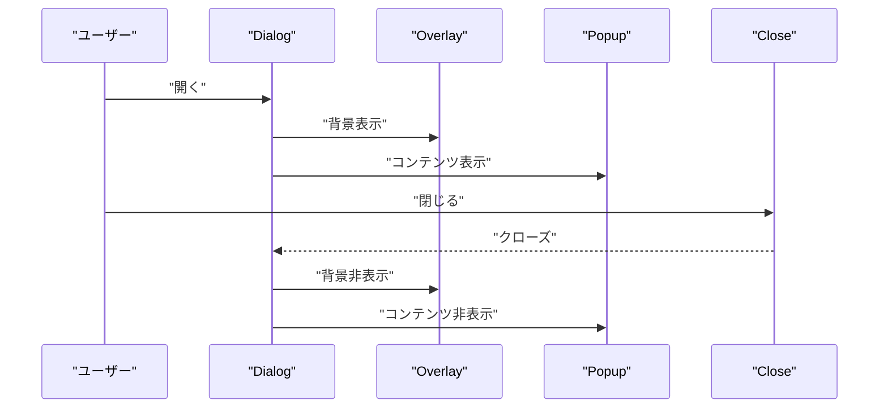
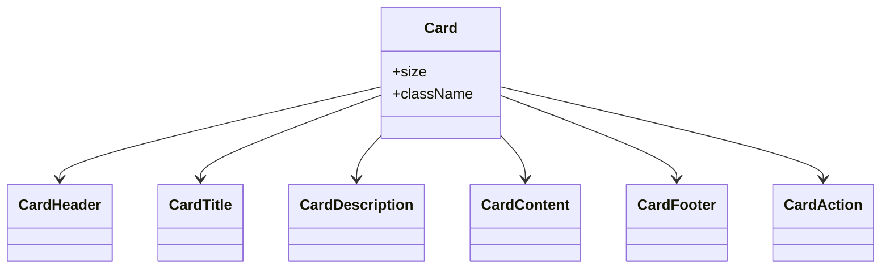
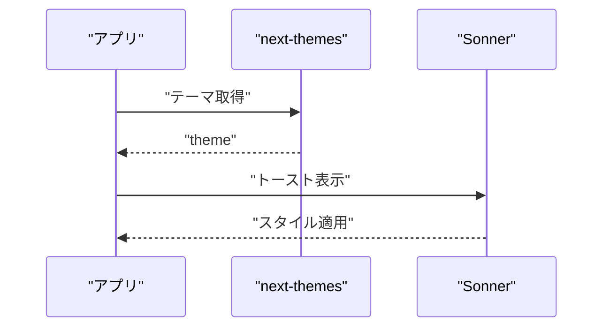
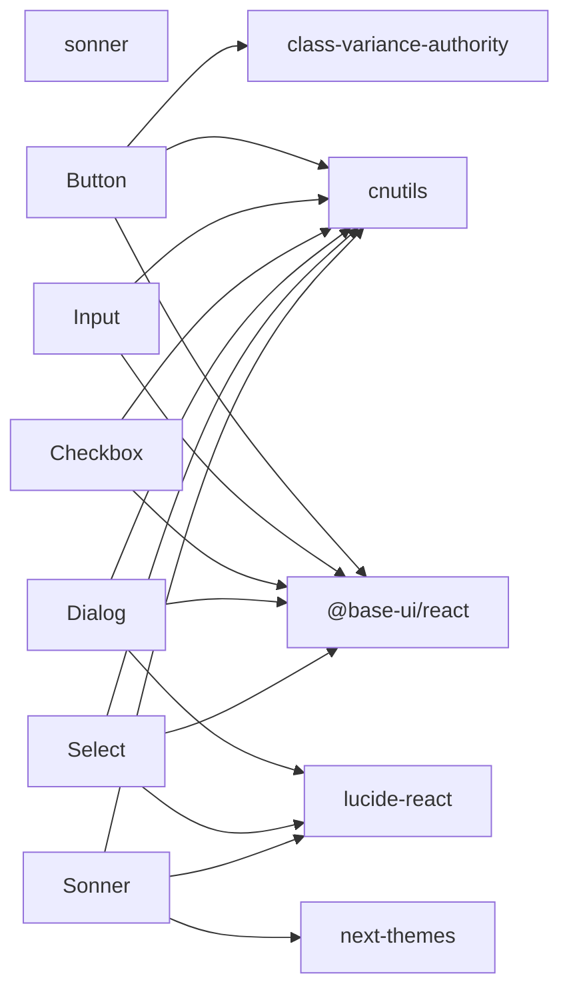

# UIコンポーネント

<cite>
**この文書で参照されるファイル**
- [frontend/components.json](file://frontend/components.json)
- [frontend/src/components/theme-provider.tsx](file://frontend/src/components/theme-provider.tsx)
- [frontend/src/components/theme-toggle.tsx](file://frontend/src/components/theme-toggle.tsx)
- [frontend/src/components/ui/button.tsx](file://frontend/src/components/ui/button.tsx)
- [frontend/src/components/ui/input.tsx](file://frontend/src/components/ui/input.tsx)
- [frontend/src/components/ui/dialog.tsx](file://frontend/src/components/ui/dialog.tsx)
- [frontend/src/components/ui/select.tsx](file://frontend/src/components/ui/select.tsx)
- [frontend/src/components/ui/checkbox.tsx](file://frontend/src/components/ui/checkbox.tsx)
- [frontend/src/components/ui/card.tsx](file://frontend/src/components/ui/card.tsx)
- [frontend/src/components/ui/badge.tsx](file://frontend/src/components/ui/badge.tsx)
- [frontend/src/components/ui/label.tsx](file://frontend/src/components/ui/label.tsx)
- [frontend/src/components/ui/separator.tsx](file://frontend/src/components/ui/separator.tsx)
- [frontend/src/components/ui/sonner.tsx](file://frontend/src/components/ui/sonner.tsx)
</cite>

## 目次
1. [導入](#導入)
2. [プロジェクト構造](#プロジェクト構造)
3. [コアコンポーネント](#コアコンポーネント)
4. [アーキテクチャ概観](#アーキテクチャ概観)
5. [詳細コンポーネント分析](#詳細コンポーネント分析)
6. [依存関係分析](#依存関係分析)
7. [パフォーマンス考慮事項](#パフォーマンス考慮事項)
8. [トラブルシューティングガイド](#トラブルシューティングガイド)
9. [結論](#結論)
10. [付録](#付録)

## 導入
本プロジェクトでは、ShadCN/uiを活用したカスタムUIコンポーネントの設計・実装が行われています。Tailwind CSSによるスタイリング、class-variance-authorityによるバリエーション管理、Base UIとの統合を通じて、再利用性・アクセシビリティ・レスポンシブデザインを両立させたコンポーネント群を提供しています。また、テーマ切り替え機能（ダーク/ライト）も同梱され、ユーザー体験の向上に努めています。

## プロジェクト構造
- 設定ファイル
  - frontend/components.json: ShadCN/uiの設定（スタイル、Tailwind、アイコンライブラリ、エイリアスなど）
- テーマ
  - frontend/src/components/theme-provider.tsx: Next Themes Providerラッパー
  - frontend/src/components/theme-toggle.tsx: テーマ切り替えUI（アイコンボタン＋スクリーンリーダー対応）
- UIコンポーネント（frontend/src/components/ui/*.tsx）
  - 入力系: button.tsx, input.tsx, checkbox.tsx, label.tsx, select.tsx
  - 表示系: card.tsx, badge.tsx, separator.tsx
  - 行動系: dialog.tsx
  - 通知: sonner.tsx

```mermaid
graph TB
subgraph "設定"
CJSON["components.json<br/>ShadCN/ui設定"]
end
subgraph "テーマ"
TP["ThemeProvider.tsx"]
TT["ThemeToggle.tsx"]
end
subgraph "UIコンポーネント"
BTN["button.tsx"]
INP["input.tsx"]
CHK["checkbox.tsx"]
LBL["label.tsx"]
SEL["select.tsx"]
CARD["card.tsx"]
BAD["badge.tsx"]
SEP["separator.tsx"]
DLG["dialog.tsx"]
SON["sonner.tsx"]
end
CJSON --> BTN
CJSON --> INP
CJSON --> CHK
CJSON --> LBL
CJSON --> SEL
CJSON --> CARD
CJSON --> BAD
CJSON --> SEP
CJSON --> DLG
CJSON --> SON
TP --> TT
TT --> BTN
BTN --> DLG
BTN --> SON
INP --> DLG
SEL --> DLG
CHK --> DLG
LBL --> DLG
CARD --> DLG
BAD --> DLG
SEP --> DLG
```

**図の出典**
- [frontend/components.json:1-26](file://frontend/components.json#L1-L26)
- [frontend/src/components/theme-provider.tsx:1-9](file://frontend/src/components/theme-provider.tsx#L1-L9)
- [frontend/src/components/theme-toggle.tsx:1-37](file://frontend/src/components/theme-toggle.tsx#L1-L37)
- [frontend/src/components/ui/button.tsx:1-59](file://frontend/src/components/ui/button.tsx#L1-L59)
- [frontend/src/components/ui/input.tsx:1-21](file://frontend/src/components/ui/input.tsx#L1-L21)
- [frontend/src/components/ui/checkbox.tsx:1-30](file://frontend/src/components/ui/checkbox.tsx#L1-L30)
- [frontend/src/components/ui/label.tsx:1-21](file://frontend/src/components/ui/label.tsx#L1-L21)
- [frontend/src/components/ui/select.tsx:1-202](file://frontend/src/components/ui/select.tsx#L1-L202)
- [frontend/src/components/ui/card.tsx:1-104](file://frontend/src/components/ui/card.tsx#L1-L104)
- [frontend/src/components/ui/badge.tsx:1-53](file://frontend/src/components/ui/badge.tsx#L1-L53)
- [frontend/src/components/ui/separator.tsx:1-26](file://frontend/src/components/ui/separator.tsx#L1-L26)
- [frontend/src/components/ui/dialog.tsx:1-161](file://frontend/src/components/ui/dialog.tsx#L1-L161)
- [frontend/src/components/ui/sonner.tsx:1-50](file://frontend/src/components/ui/sonner.tsx#L1-L50)

**節の出典**
- [frontend/components.json:1-26](file://frontend/components.json#L1-L26)

## コアコンポーネント
- Button（バリエーション・サイズ管理、フォーカス・無効状態対応）
  - 変数: variant（default/outline/secondary/ghost/destructive/link）、size（default/xs/sm/lg/icon等）
  - 特徴: class-variance-authorityによるスタイル変数、data-slot属性によるスロット識別、アクセシビリティ属性（aria-*）対応
  - 参考: [frontend/src/components/ui/button.tsx:6-41](file://frontend/src/components/ui/button.tsx#L6-L41)
- Input（入力フィールド、バリデーション表示、レスポンシブフォント）
  - 特徴: 焦点時（ring）アニメーション、無効・不正時の視覚的フィードバック、data-slot属性
  - 参考: [frontend/src/components/ui/input.tsx:6-18](file://frontend/src/components/ui/input.tsx#L6-L18)
- Checkbox（選択状態・無効状態、アイコンインジケータ）
  - 特徴: data-checked、aria-checked、disabledに対応したスタイル、内部にチェックアイコン
  - 参考: [frontend/src/components/ui/checkbox.tsx:8-27](file://frontend/src/components/ui/checkbox.tsx#L8-L27)
- Select（トリガー・ポップアップ・スクロールボタン、位置調整）
  - 特徴: Portal＋Positionerによる配置、align/side/offset制御、スクロールボタン付きリスト
  - 参考: [frontend/src/components/ui/select.tsx:59-96](file://frontend/src/components/ui/select.tsx#L59-L96)
- Dialog（モーダル表示、ヘッダー/フッター、クローズボタン）
  - 特徴: Overlay/Popup/Portalの組み合わせ、data-slot属性、showCloseButtonオプション
  - 参考: [frontend/src/components/ui/dialog.tsx:42-81](file://frontend/src/components/ui/dialog.tsx#L42-L81)
- Card（カードレイアウト、ヘッダー/コンテンツ/フッター、サイズ指定）
  - 特徴: data-sizeによるサブスタイル適用、data-slotによるスロット識別
  - 参考: [frontend/src/components/ui/card.tsx:5-21](file://frontend/src/components/ui/card.tsx#L5-L21)
- Badge（バリエーション、useRenderによるレンダリング制御）
  - 特徴: cvaによるバリエーション、useRenderによる要素名・スロットの柔軟化
  - 参考: [frontend/src/components/ui/badge.tsx:30-50](file://frontend/src/components/ui/badge.tsx#L30-L50)
- Label（ラベル表示、無効・disabled対応）
  - 特徴: data-slot属性、disabledグループに対応
  - 参考: [frontend/src/components/ui/label.tsx:7-17](file://frontend/src/components/ui/label.tsx#L7-L17)
- Separator（区切り線、方向指定）
  - 特徴: data-horizontal/data-verticalによる方向スタイル分岐
  - 参考: [frontend/src/components/ui/separator.tsx:7-23](file://frontend/src/components/ui/separator.tsx#L7-L23)
- Sonner（トースト通知、テーマ連携、アイコンカスタマイズ）
  - 特徴: next-themes連携、CSS変数によるテーマ適用、各種状態アイコン
  - 参考: [frontend/src/components/ui/sonner.tsx:7-47](file://frontend/src/components/ui/sonner.tsx#L7-L47)

**節の出典**
- [frontend/src/components/ui/button.tsx:1-59](file://frontend/src/components/ui/button.tsx#L1-L59)
- [frontend/src/components/ui/input.tsx:1-21](file://frontend/src/components/ui/input.tsx#L1-L21)
- [frontend/src/components/ui/checkbox.tsx:1-30](file://frontend/src/components/ui/checkbox.tsx#L1-L30)
- [frontend/src/components/ui/select.tsx:1-202](file://frontend/src/components/ui/select.tsx#L1-L202)
- [frontend/src/components/ui/dialog.tsx:1-161](file://frontend/src/components/ui/dialog.tsx#L1-L161)
- [frontend/src/components/ui/card.tsx:1-104](file://frontend/src/components/ui/card.tsx#L1-L104)
- [frontend/src/components/ui/badge.tsx:1-53](file://frontend/src/components/ui/badge.tsx#L1-L53)
- [frontend/src/components/ui/label.tsx:1-21](file://frontend/src/components/ui/label.tsx#L1-L21)
- [frontend/src/components/ui/separator.tsx:1-26](file://frontend/src/components/ui/separator.tsx#L1-L26)
- [frontend/src/components/ui/sonner.tsx:1-50](file://frontend/src/components/ui/sonner.tsx#L1-L50)

## アーキテクチャ概観
ShadCN/uiの設定（components.json）に基づき、Tailwindクラスとclass-variance-authority（cva）によるバリエーション管理が中心です。Base UI（@base-ui/react）をベースとしたカプセル化されたコンポーネント群が、共通のデータスロット（data-slot）とユーティリティ（cn）を通じて統一されたスタイリングとアクセシビリティを提供します。テーマはnext-themes経由で管理され、トースト通知もテーマに連動してスタイルが適用されます。

```mermaid
graph TB
CFG["components.json<br/>tailwind/css/baseColor/cssVariables/prefix/aliases"]
CN["cnユーティリティ"]
CVA["cvaバリエーション"]
BASE["@base-ui/reactPrimitive"]
THEME["next-themesテーマ"]
CFG --> CVA
CFG --> CN
CVA --> BTN["Button"]
CN --> BTN
CN --> INP["Input"]
CN --> CHK["Checkbox"]
CN --> CARD["Card"]
CN --> BAD["Badge"]
CN --> DLG["Dialog"]
CN --> SEL["Select"]
CN --> LBL["Label"]
CN --> SEP["Separator"]
CN --> SON["Sonner"]
BASE --> BTN
BASE --> INP
BASE --> CHK
BASE --> DLG
BASE --> SEL
BASE --> LBL
BASE --> CARD
BASE --> BAD
BASE --> SEP
THEME --> SON
THEME --> BTN
THEME --> DLG
```

**図の出典**
- [frontend/components.json:1-26](file://frontend/components.json#L1-L26)
- [frontend/src/components/ui/button.tsx:1-59](file://frontend/src/components/ui/button.tsx#L1-L59)
- [frontend/src/components/ui/input.tsx:1-21](file://frontend/src/components/ui/input.tsx#L1-L21)
- [frontend/src/components/ui/checkbox.tsx:1-30](file://frontend/src/components/ui/checkbox.tsx#L1-L30)
- [frontend/src/components/ui/dialog.tsx:1-161](file://frontend/src/components/ui/dialog.tsx#L1-L161)
- [frontend/src/components/ui/select.tsx:1-202](file://frontend/src/components/ui/select.tsx#L1-L202)
- [frontend/src/components/ui/card.tsx:1-104](file://frontend/src/components/ui/card.tsx#L1-L104)
- [frontend/src/components/ui/badge.tsx:1-53](file://frontend/src/components/ui/badge.tsx#L1-L53)
- [frontend/src/components/ui/label.tsx:1-21](file://frontend/src/components/ui/label.tsx#L1-L21)
- [frontend/src/components/ui/separator.tsx:1-26](file://frontend/src/components/ui/separator.tsx#L1-L26)
- [frontend/src/components/ui/sonner.tsx:1-50](file://frontend/src/components/ui/sonner.tsx#L1-L50)

## 詳細コンポーネント分析

### Button（バリエーション・サイズ・インタラクション）
- Props
  - className: 追加クラス
  - variant: "default"|"outline"|"secondary"|"ghost"|"destructive"|"link"
  - size: "default"|"xs"|"sm"|"lg"|"icon"|"icon-xs"|"icon-sm"|"icon-lg"
  - その他のButtonPrimitive.Props（onClickなど）
- イベントハンドリング
  - onClick等のイベントはButtonPrimitiveにそのまま渡される
- スタイリング
  - cvaによるバリエーション適用、data-slot="button"、フォーカス・無効・aria-*対応
- 再利用性
  - data-slotによりスロット識別が可能で、テーマやスタイリングの再定義が容易
- アクセシビリティ
  - focus-visibleによるキーボード操作対応、aria-*属性による状態表現
- レスポンシブデザイン
  - サイズバリエーションで幅・フォント・アイコンサイズを調整

```mermaid
classDiagram
class Button {
+className
+variant
+size
+props
}
class Variants {
+default
+outline
+secondary
+ghost
+destructive
+link
}
class Sizes {
+default
+xs
+sm
+lg
+icon
+icon-xs
+icon-sm
+icon-lg
}
Button --> Variants : "cva"
Button --> Sizes : "cva"
```

**図の出典**
- [frontend/src/components/ui/button.tsx:6-41](file://frontend/src/components/ui/button.tsx#L6-L41)

**節の出典**
- [frontend/src/components/ui/button.tsx:43-56](file://frontend/src/components/ui/button.tsx#L43-L56)

### Input（入力フィールド）
- Props
  - className: 追加クラス
  - type: "text"|"password"|...
  - その他のHTMLInputElement属性
- イベントハンドリング
  - onChange/onBlur/onFocus等のイベントはInputPrimitiveに渡される
- スタイリング
  - data-slot="input"、フォーカス時ring、無効・不正時の視覚フィードバック
- 再利用性
  - data-slotによりテーマ・スタイリングの再定義が可能
- アクセシビリティ
  - aria-invalid、placeholder、disabled対応
- レスポンシブデザイン
  - md-breakpointでのフォントサイズ調整

```mermaid
flowchart TD
Start(["入力開始"]) --> Focus["フォーカス時<br/>ring適用"]
Focus --> Change["値変更"]
Change --> Validate{"バリデーション"}
Validate --> |OK| Normal["通常状態"]
Validate --> |NG| Invalid["不正状態<br/>aria-invalid"]
Normal --> Blur["フォーカス喪失"]
Invalid --> Blur
Blur --> End(["終了"])
```

**図の出典**
- [frontend/src/components/ui/input.tsx:6-18](file://frontend/src/components/ui/input.tsx#L6-L18)

**節の出典**
- [frontend/src/components/ui/input.tsx:6-18](file://frontend/src/components/ui/input.tsx#L6-L18)

### Checkbox（選択状態・無効状態）
- Props
  - className: 追加クラス
  - その他のCheckboxPrimitive.Root.Props
- イベントハンドリング
  - onChange等のイベントはCheckboxPrimitiveに渡される
- スタイリング
  - data-checked、aria-checked、disabledに対応したスタイル
- 再利用性
  - data-slot="checkbox"により再定義可能
- アクセシビリティ
  - aria-checked、フォーカスリング、無効状態の視覚フィードバック
- レスポンシブデザイン
  - サイズ・フォント・アイコンサイズの調整

```mermaid
stateDiagram-v2
[*] --> 未選択
未選択 --> 選択中 : "クリック"
選択中 --> 選択済 : "確定"
選択中 --> 無効 : "disabled"
選択済 --> 無効 : "disabled"
無効 --> 未選択 : "有効化"
無効 --> 選択済 : "有効化"
```

**図の出典**
- [frontend/src/components/ui/checkbox.tsx:8-27](file://frontend/src/components/ui/checkbox.tsx#L8-L27)

**節の出典**
- [frontend/src/components/ui/checkbox.tsx:8-27](file://frontend/src/components/ui/checkbox.tsx#L8-L27)

### Select（トリガー・ポップアップ・リスト）
- Props
  - Trigger: size（"sm"|"default"）
  - Content: align/side/sideOffset/alignOffset/alignItemWithTrigger
  - Item/Label/Separator/ScrollUp/ScrollDown: 通常要素Props
- イベントハンドリング
  - 値変更はSelectPrimitiveによって処理され、外部ではonChange等を受け取る
- スタイリング
  - data-size、data-align-trigger、data-slot、アニメーションクラス
- 再利用性
  - Portal＋Positionerによる配置再利用、data-slotによるスロット識別
- アクセシビリティ
  - アイテム選択・スクロールボタンのキーボード操作対応
- レスポンシブデザイン
  - max-height、widthの計算値（--available-height、--anchor-width）

```mermaid
sequenceDiagram
participant U as "ユーザー"
participant T as "SelectTrigger"
participant P as "Portal"
participant C as "Content"
participant L as "List"
U->>T : "クリック"
T->>P : "ポータルオープン"
P->>C : "ポップアップ表示"
C->>L : "リスト描画"
U->>L : "アイテム選択"
L-->>T : "値更新"
```

**図の出典**
- [frontend/src/components/ui/select.tsx:31-96](file://frontend/src/components/ui/select.tsx#L31-L96)

**節の出典**
- [frontend/src/components/ui/select.tsx:59-96](file://frontend/src/components/ui/select.tsx#L59-L96)

### Dialog（モーダル）
- Props
  - DialogContent: showCloseButton（true/false）
  - DialogFooter: showCloseButton（true/false）
  - その他: Root/Trigger/Portal/Overlay/Popup/Title/Description/Close
- イベントハンドリング
  - DialogPrimitive.Closeを介したクローズ処理
- スタイリング
  - data-slot="dialog-*"、data-open/anime、overlay背景透過
- 再利用性
  - Header/Footer/contentのスロット構造により再利用可能
- アクセシビリティ
  - sr-onlyによるスクリーンリーダー対応、data-slotによる識別
- レスポンシブデザイン
  - max-w/sm:max-w-sm、レスポンシブな位置調整

```mermaid
sequenceDiagram
participant U as "ユーザー"
participant D as "Dialog"
participant O as "Overlay"
participant P as "Popup"
participant C as "Close"
U->>D : "開く"
D->>O : "背景表示"
D->>P : "コンテンツ表示"
U->>C : "閉じる"
C-->>D : "クローズ"
D->>O : "背景非表示"
D->>P : "コンテンツ非表示"
```

**図の出典**
- [frontend/src/components/ui/dialog.tsx:10-81](file://frontend/src/components/ui/dialog.tsx#L10-L81)

**節の出典**
- [frontend/src/components/ui/dialog.tsx:42-81](file://frontend/src/components/ui/dialog.tsx#L42-L81)

### Card（カードレイアウト）
- Props
  - size: "default"|"sm"
  - その他のHTMLDivElement属性
- イベントハンドリング
  - 子要素のイベントは通常通り伝播
- スタイリング
  - data-sizeによるサブスタイル、data-slot="card-*"、フッター/画像対応
- 再利用性
  - 各スロット（Header/Title/Description/Content/Footer/Action）の存在で再利用可能
- アクセシビリティ
  - 単なる装飾コンポーネントとして、適切なマークアップを推奨
- レスポンシブデザイン
  - sm:sizeでの間隔・パディング調整

```mermaid
classDiagram
class Card {
+size
+className
}
class CardHeader
class CardTitle
class CardDescription
class CardContent
class CardFooter
class CardAction
Card --> CardHeader
Card --> CardTitle
Card --> CardDescription
Card --> CardContent
Card --> CardFooter
Card --> CardAction
```

**図の出典**
- [frontend/src/components/ui/card.tsx:5-21](file://frontend/src/components/ui/card.tsx#L5-L21)

**節の出典**
- [frontend/src/components/ui/card.tsx:5-21](file://frontend/src/components/ui/card.tsx#L5-L21)

### Badge（バリエーション）
- Props
  - variant: "default"|"secondary"|"destructive"|"outline"|"ghost"|"link"
  - render: useRenderによる要素名指定
  - その他のspan要素属性
- イベントハンドリング
  - useRenderによるレンダリング制御
- スタイリング
  - cvaによるバリエーション、data-slot="badge"、aria-invalid対応
- 再利用性
  - useRenderにより要素名・スロットの柔軟化
- アクセシビリティ
  - focus-visibleによるキーボード操作対応
- レスポンシブデザイン
  - サイズ・フォント・アイコンサイズの調整

**節の出典**
- [frontend/src/components/ui/badge.tsx:30-50](file://frontend/src/components/ui/badge.tsx#L30-L50)

### Label（ラベル）
- Props
  - className: 追加クラス
  - その他のHTMLLabelElement属性
- イベントハンドリング
  - 通常のラベルイベント（onClickなど）
- スタイリング
  - data-slot="label"、disabledグループ対応
- 再利用性
  - data-slotによりテーマ・スタイリングの再定義が可能
- アクセシビリティ
  - disabled・peer-disabled対応
- レスポンシブデザイン
  - 通常のテキストスタイリング

**節の出典**
- [frontend/src/components/ui/label.tsx:7-17](file://frontend/src/components/ui/label.tsx#L7-L17)

### Separator（区切り線）
- Props
  - orientation: "horizontal"|"vertical"
  - その他のSeparatorPrimitive.Props
- イベントハンドリング
  - なし（静的表示）
- スタイリング
  - data-horizontal/data-verticalによる方向スタイル分岐
- 再利用性
  - 方向のみの違いで再利用可能
- アクセシビリティ
  - なし（装飾要素）
- レスポンシブデザイン
  - なし（固定方向）

**節の出典**
- [frontend/src/components/ui/separator.tsx:7-23](file://frontend/src/components/ui/separator.tsx#L7-L23)

### Sonner（トースト通知）
- Props
  - ToasterProps: 通知の表示・スタイル設定
- イベントハンドリング
  - トーストの表示・消去（外部からトーストAPI呼び出し）
- スタイリング
  - next-themes連携、CSS変数によるテーマ適用、各種状態アイコン
- 再利用性
  - 1つのToasterで全般管理可能
- アクセシビリティ
  - アイコン＋スクリーンリーダー対応（sr-only）
- レスポンシブデザイン
  - トースト自体のレスポンシブ対応（Tailwindクラス）

```mermaid
sequenceDiagram
participant App as "アプリ"
participant Theme as "next-themes"
participant Toas as "Sonner"
App->>Theme : "テーマ取得"
Theme-->>App : "theme"
App->>Toas : "トースト表示"
Toas-->>App : "スタイル適用"
```

**図の出典**
- [frontend/src/components/ui/sonner.tsx:7-47](file://frontend/src/components/ui/sonner.tsx#L7-L47)

**節の出典**
- [frontend/src/components/ui/sonner.tsx:7-47](file://frontend/src/components/ui/sonner.tsx#L7-L47)

## 依存関係分析
- 外部依存
  - class-variance-authority（cva）: バリエーション管理
  - @base-ui/react: 基底UIコンポーネント（Button/Input/Checkbox/Dialog/Select/Separator）
  - lucide-react: アイコン
  - next-themes: テーマ管理
  - sonner: 通知
- 内部依存
  - cn（frontend/lib/utils）: Tailwindクラスのマージ
  - data-slot: 各コンポーネントのスロット識別
  - components.json: Tailwind設定・エイリアス・アイコンライブラリ

```mermaid
graph LR
CVA["class-variance-authority"]
BASE["@base-ui/react"]
LUCIDE["lucide-react"]
NEXTTHEMES["next-themes"]
SONNER["sonner"]
CN["cnutils"]
BTN["Button"] --> CVA
BTN --> CN
BTN --> BASE
INP["Input"] --> CN
INP --> BASE
CHK["Checkbox"] --> CN
CHK --> BASE
DLG["Dialog"] --> CN
DLG --> BASE
DLG --> LUCIDE
SEL["Select"] --> CN
SEL --> BASE
SEL --> LUCIDE
SON["Sonner"] --> NEXTTHEMES
SON --> LUCIDE
SON --> CN
```

**図の出典**
- [frontend/src/components/ui/button.tsx:1-59](file://frontend/src/components/ui/button.tsx#L1-L59)
- [frontend/src/components/ui/input.tsx:1-21](file://frontend/src/components/ui/input.tsx#L1-L21)
- [frontend/src/components/ui/checkbox.tsx:1-30](file://frontend/src/components/ui/checkbox.tsx#L1-L30)
- [frontend/src/components/ui/dialog.tsx:1-161](file://frontend/src/components/ui/dialog.tsx#L1-L161)
- [frontend/src/components/ui/select.tsx:1-202](file://frontend/src/components/ui/select.tsx#L1-L202)
- [frontend/src/components/ui/sonner.tsx:1-50](file://frontend/src/components/ui/sonner.tsx#L1-L50)

**節の出典**
- [frontend/src/components/ui/button.tsx:1-59](file://frontend/src/components/ui/button.tsx#L1-L59)
- [frontend/src/components/ui/input.tsx:1-21](file://frontend/src/components/ui/input.tsx#L1-L21)
- [frontend/src/components/ui/checkbox.tsx:1-30](file://frontend/src/components/ui/checkbox.tsx#L1-L30)
- [frontend/src/components/ui/dialog.tsx:1-161](file://frontend/src/components/ui/dialog.tsx#L1-L161)
- [frontend/src/components/ui/select.tsx:1-202](file://frontend/src/components/ui/select.tsx#L1-L202)
- [frontend/src/components/ui/sonner.tsx:1-50](file://frontend/src/components/ui/sonner.tsx#L1-L50)

## パフォーマンス考慮事項
- クラスマージ
  - cn（ユーティリティ）による条件付きクラス適用は軽量だが、複数の条件分岐が多い場合、不要なクラスの追加を避ける
- アニメーション
  - data-open/anime（Dialog/Select）は軽量だが、大量の要素を同時に表示する場合は、Portalの使用を推奨
- テーマ切り替え
  - next-themesのuseThemeは軽量だが、頻繁なテーマ切り替えは再レンダリングを引き起こす可能性あり
- 通知
  - Sonnerは軽量だが、大量のトーストを同時に表示しないよう注意

## トラブルシューティングガイド
- ハイドレーションミスマッチ（ThemeToggle）
  - 状況: 初回レンダリング時にクライアント/サーバーのテーマ状態が異なる
  - 対策: mountedフラグによる遅延レンダリング（requestAnimationFrame）
  - 参考: [frontend/src/components/theme-toggle.tsx:13-20](file://frontend/src/components/theme-toggle.tsx#L13-L20)
- アクセシビリティ（Dialog/Label）
  - 状況: sr-onlyによるスクリーンリーダー対応不足
  - 対策: 必要に応じてaria-label/aria-describedbyを追加
  - 参考: [frontend/src/components/ui/dialog.tsx:75](file://frontend/src/components/ui/dialog.tsx#L75)
  - 参考: [frontend/src/components/ui/label.tsx:12](file://frontend/src/components/ui/label.tsx#L12)
- レスポンシブデザイン（Button/Input/Select）
  - 状況: 小画面での見切れ・ズレ
  - 対策: size/variantの調整、max-width・paddingの見直し
  - 参考: [frontend/src/components/ui/button.tsx:22-34](file://frontend/src/components/ui/button.tsx#L22-L34)
  - 参考: [frontend/src/components/ui/input.tsx:11-14](file://frontend/src/components/ui/input.tsx#L11-L14)
  - 参考: [frontend/src/components/ui/select.tsx:43-46](file://frontend/src/components/ui/select.tsx#L43-L46)
- テーマ連携（Sonner）
  - 状況: トーストの色がテーマと一致しない
  - 対策: CSS変数（--popover等）の確認、themeプロパティの確認
  - 参考: [frontend/src/components/ui/sonner.tsx:31-38](file://frontend/src/components/ui/sonner.tsx#L31-L38)

**節の出典**
- [frontend/src/components/theme-toggle.tsx:13-20](file://frontend/src/components/theme-toggle.tsx#L13-L20)
- [frontend/src/components/ui/dialog.tsx:75](file://frontend/src/components/ui/dialog.tsx#L75)
- [frontend/src/components/ui/label.tsx:12](file://frontend/src/components/ui/label.tsx#L12)
- [frontend/src/components/ui/button.tsx:22-34](file://frontend/src/components/ui/button.tsx#L22-L34)
- [frontend/src/components/ui/input.tsx:11-14](file://frontend/src/components/ui/input.tsx#L11-L14)
- [frontend/src/components/ui/select.tsx:43-46](file://frontend/src/components/ui/select.tsx#L43-L46)
- [frontend/src/components/ui/sonner.tsx:31-38](file://frontend/src/components/ui/sonner.tsx#L31-L38)

## 結論
本プロジェクトでは、ShadCN/uiの設定（components.json）に基づいた統一されたUIコンポーネント設計が実現されています。class-variance-authorityによるバリエーション管理、Base UIとの統合、data-slotによるスロット識別、next-themesによるテーマ連携が組み合わさり、再利用性・アクセシビリティ・レスポンシブデザインを両立させています。さらに、ThemeToggleとSonnerを活用することで、ユーザー体験の向上が図られています。

## 付録
- 設定ファイル（components.json）の主な項目
  - style: "base-nova"
  - tailwind: css（src/app/globals.css）、baseColor（neutral）、cssVariables（true）
  - iconLibrary: lucide
  - aliases: components（@/components）、ui（@/components/ui）、lib（@/lib）、hooks（@/hooks）
- 代表的なコンポーネントのバリエーション
  - Button: variant（6種）、size（7種）
  - Badge: variant（6種）
  - Select: Trigger size（2種）
  - Card: size（2種）

**節の出典**
- [frontend/components.json:1-26](file://frontend/components.json#L1-L26)
- [frontend/src/components/ui/button.tsx:9-40](file://frontend/src/components/ui/button.tsx#L9-L40)
- [frontend/src/components/ui/badge.tsx:10-27](file://frontend/src/components/ui/badge.tsx#L10-L27)
- [frontend/src/components/ui/select.tsx:36-37](file://frontend/src/components/ui/select.tsx#L36-L37)
- [frontend/src/components/ui/card.tsx:7](file://frontend/src/components/ui/card.tsx#L7)