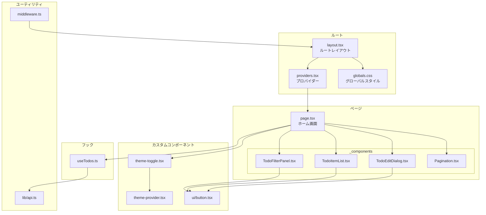
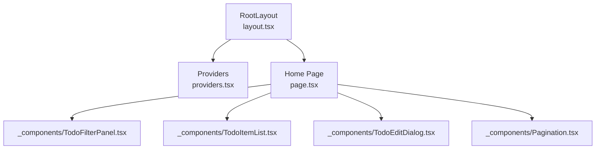
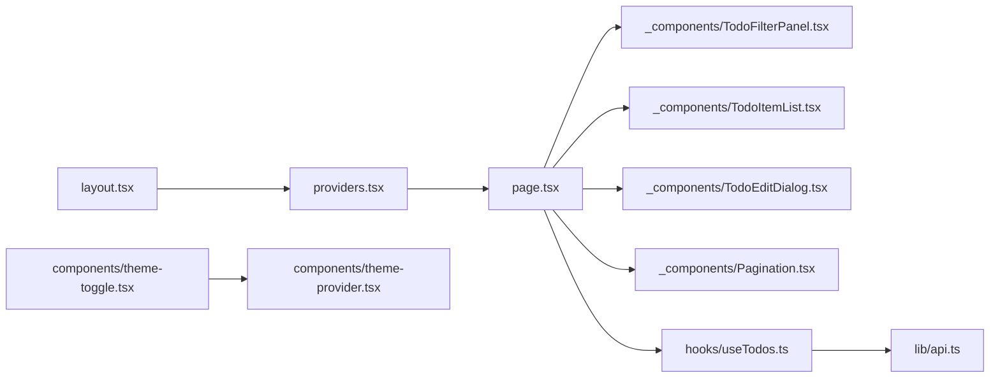

# コンポーネント構造

<cite>
**この文書で参照されるファイル**
- [frontend/src/app/layout.tsx](file://frontend/src/app/layout.tsx)
- [frontend/src/app/providers.tsx](file://frontend/src/app/providers.tsx)
- [frontend/src/components/theme-provider.tsx](file://frontend/src/components/theme-provider.tsx)
- [frontend/src/app/page.tsx](file://frontend/src/app/page.tsx)
- [frontend/src/app/_components/TodoFilterPanel.tsx](file://frontend/src/app/_components/TodoFilterPanel.tsx)
- [frontend/src/app/_components/TodoItemList.tsx](file://frontend/src/app/_components/TodoItemList.tsx)
- [frontend/src/app/_components/TodoEditDialog.tsx](file://frontend/src/app/_components/TodoEditDialog.tsx)
- [frontend/src/app/_components/Pagination.tsx](file://frontend/src/app/_components/Pagination.tsx)
- [frontend/src/hooks/useTodos.ts](file://frontend/src/hooks/useTodos.ts)
- [frontend/src/components/ui/button.tsx](file://frontend/src/components/ui/button.tsx)
- [frontend/src/components/theme-toggle.tsx](file://frontend/src/components/theme-toggle.tsx)
- [frontend/src/lib/api.ts](file://frontend/src/lib/api.ts)
- [frontend/src/middleware.ts](file://frontend/src/middleware.ts)
- [frontend/src/app/globals.css](file://frontend/src/app/globals.css)
</cite>

## 目次
1. [はじめに](#はじめに)
2. [プロジェクト構造](#プロジェクト構造)
3. [コアコンポーネント](#コアコンポーネント)
4. [アーキテクチャ概観](#アーキテクチャ概観)
5. [詳細コンポーネント解析](#詳細コンポーネント解析)
6. [依存関係解析](#依存関係解析)
7. [パフォーマンス考慮事項](#パフォーマンス考慮事項)
8. [トラブルシューティングガイド](#トラブルシューティングガイド)
9. [結論](#結論)

## はじめに
本ドキュメントは、Next.js App Routerにおけるコンポーネント階層と構造について詳細に解説します。特に以下の点に焦点を当てます：
- layout.tsxの役割とルートレベルでのコンポーネントスコープ
- _componentsフォルダの設計思想と再利用性の向上
- テーマプロバイダーの実装方法とNext Themesとの統合
- 親子コンポーネント間のデータフローと状態管理
- React Queryによるサーバー状態管理と再利用性の確保

## プロジェクト構造
Next.js App Routerでは、ルートディレクトリ以下にappディレクトリが存在し、その中に各ページコンポーネントが配置されます。ルートレイアウト（RootLayout）は全ページに適用される共通コンテナであり、テーマプロバイダー、クエリプロバイダー、グローバルスタイルなどを提供します。

**図の出典**
- [frontend/src/app/layout.tsx:22-39](file://frontend/src/app/layout.tsx#L22-L39)
- [frontend/src/app/providers.tsx:8-25](file://frontend/src/app/providers.tsx#L8-L25)
- [frontend/src/app/page.tsx:21-297](file://frontend/src/app/page.tsx#L21-L297)
- [frontend/src/app/_components/TodoFilterPanel.tsx:25-104](file://frontend/src/app/_components/TodoFilterPanel.tsx#L25-L104)
- [frontend/src/app/_components/TodoItemList.tsx:34-181](file://frontend/src/app/_components/TodoItemList.tsx#L34-L181)
- [frontend/src/app/_components/TodoEditDialog.tsx:38-136](file://frontend/src/app/_components/TodoEditDialog.tsx#L38-L136)
- [frontend/src/app/_components/Pagination.tsx:13-48](file://frontend/src/app/_components/Pagination.tsx#L13-L48)
- [frontend/src/components/theme-provider.tsx:6-8](file://frontend/src/components/theme-provider.tsx#L6-L8)
- [frontend/src/components/ui/button.tsx:43-58](file://frontend/src/components/ui/button.tsx#L43-L58)
- [frontend/src/components/theme-toggle.tsx:8-36](file://frontend/src/components/theme-toggle.tsx#L8-L36)
- [frontend/src/hooks/useTodos.ts:26-118](file://frontend/src/hooks/useTodos.ts#L26-L118)
- [frontend/src/lib/api.ts:25-62](file://frontend/src/lib/api.ts#L25-L62)
- [frontend/src/middleware.ts:7-26](file://frontend/src/middleware.ts#L7-L26)
- [frontend/src/app/globals.css:1-130](file://frontend/src/app/globals.css#L1-L130)

**節の出典**
- [frontend/src/app/layout.tsx:17-39](file://frontend/src/app/layout.tsx#L17-L39)
- [frontend/src/app/providers.tsx:8-25](file://frontend/src/app/providers.tsx#L8-L25)
- [frontend/src/app/globals.css:1-130](file://frontend/src/app/globals.css#L1-L130)

## コアコンポーネント
- RootLayout（layout.tsx）
  - 全ページに適用されるルートコンテナ。HTML要素、フォント、グローバルCSS、トースト通知、プロバイダーのラッパーを含みます。
  - 子コンポーネント（ページ）はProviders内に配置され、テーマ・クエリ状態が共有されます。
- Providers（providers.tsx）
  - React Queryクライアントの初期化、Next Themesによるテーマ管理、開発用ツールの有効化を行うコンテキストプロバイダー。
- ThemeProvider（theme-provider.tsx）
  - next-themesの薄いラッパーで、テーマ属性の制御やデフォルトテーマ設定をカスタマイズ可能にします。
- Home（page.tsx）
  - Todo一覧画面のメインコンポーネント。フィルター、リスト、編集ダイアログ、ページネーションを統括し、useTodosフックから取得したクエリ状態を活用します。

**節の出典**
- [frontend/src/app/layout.tsx:22-39](file://frontend/src/app/layout.tsx#L22-L39)
- [frontend/src/app/providers.tsx:8-25](file://frontend/src/app/providers.tsx#L8-L25)
- [frontend/src/components/theme-provider.tsx:6-8](file://frontend/src/components/theme-provider.tsx#L6-L8)
- [frontend/src/app/page.tsx:27-297](file://frontend/src/app/page.tsx#L27-L297)

## アーキテクチャ概観
Next.js App Routerにおけるコンポーネント階層は、ルートレイアウトがルートスコープで、各ページが子コンポーネントを持つという階層構造です。_componentsフォルダは、ページ固有の再利用可能なUI部品を一元管理し、再利用性とスコープの明確化を目的としています。

**図の出典**
- [frontend/src/app/layout.tsx:22-39](file://frontend/src/app/layout.tsx#L22-L39)
- [frontend/src/app/providers.tsx:8-25](file://frontend/src/app/providers.tsx#L8-L25)
- [frontend/src/app/page.tsx:21-297](file://frontend/src/app/page.tsx#L21-L297)
- [frontend/src/app/_components/TodoFilterPanel.tsx:25-104](file://frontend/src/app/_components/TodoFilterPanel.tsx#L25-L104)
- [frontend/src/app/_components/TodoItemList.tsx:34-181](file://frontend/src/app/_components/TodoItemList.tsx#L34-L181)
- [frontend/src/app/_components/TodoEditDialog.tsx:38-136](file://frontend/src/app/_components/TodoEditDialog.tsx#L38-L136)
- [frontend/src/app/_components/Pagination.tsx:13-48](file://frontend/src/app/_components/Pagination.tsx#L13-L48)

## 詳細コンポーネント解析

### RootLayout（layout.tsx）
- 役割
  - HTML言語設定、フォント変数、グローバルCSSの読み込み、トースト通知コンポーネント、ルートプロバイダーの配置。
  - 子コンポーネント（ページ）はProviders内で描画され、テーマ・クエリ状態が全ページで共有されます。
- 特徴
  - suppressHydrationWarningによりハイドレーション時の不一致を緩和。
  - Toasterは全ページで一貫して通知を表示可能にします。

**節の出典**
- [frontend/src/app/layout.tsx:17-39](file://frontend/src/app/layout.tsx#L17-L39)

### Providers（providers.tsx）
- 役割
  - React Queryクライアントの初期化（デフォルトキャッシュ設定あり）。
  - Next Themesによるテーマ管理（属性=class、デフォルトテーマ=システム）。
  - 開発用React Query Devtoolsの条件付き表示。
- 特徴
  - QueryClientProviderはRootLayoutの子として配置され、全ページでクエリ状態が有効になります。
  - ThemeProviderはクエリプロバイダーの内側に配置され、テーマ変更がクエリキャッシュに影響を与えないように設計されています。

**節の出典**
- [frontend/src/app/providers.tsx:8-25](file://frontend/src/app/providers.tsx#L8-L25)

### ThemeProvider（theme-provider.tsx）
- 役割
  - next-themesのThemeProviderを薄いラッパーとして提供し、属性やデフォルト値を明示的に制御可能にします。
- 特徴
  - Home画面の右上に配置されるThemeToggleがテーマを切り替える際、このコンポーネントの属性設定に基づいて動作します。

**節の出典**
- [frontend/src/components/theme-provider.tsx:6-8](file://frontend/src/components/theme-provider.tsx#L6-L8)

### Home（page.tsx）
- 役割
  - Todo一覧画面のコアロジック。フォーム入力、フィルター操作、リスト表示、編集ダイアログ、ページネーションを統括。
  - useTodosフックから取得したクエリ状態（todosQuery、countQuery）とミューテーション（追加、更新、削除、完了状態切り替え）を使用。
- 特徴
  - 認証エラー（401）時にログインページへのリダイレクト処理。
  - 各子コンポーネント（TodoFilterPanel、TodoItemList、TodoEditDialog、Pagination）にpropsとして状態とハンドラを渡すことで、親子間のデータフローを明確にしています。

**節の出典**
- [frontend/src/app/page.tsx:27-297](file://frontend/src/app/page.tsx#L27-L297)
- [frontend/src/hooks/useTodos.ts:26-118](file://frontend/src/hooks/useTodos.ts#L26-L118)

### _componentsフォルダの設計思想
- 再利用性
  - TodoFilterPanel、TodoItemList、TodoEditDialog、Paginationは、Home画面以外でも再利用可能なUI部品として設計されています。
  - 各コンポーネントはprops経由で状態を受け取り、内部状態を最小限に抑えています。
- スコープの管理
  - _components配下のコンポーネントは、ページ固有のUIロジックをカプセル化し、Home画面の肥大化を防ぎます。
  - 各コンポーネントは「プレゼンテーション」中心に設計されており、状態管理は親（Home）が行うことで、責務の分離が明確です。

**節の出典**
- [frontend/src/app/_components/TodoFilterPanel.tsx:25-104](file://frontend/src/app/_components/TodoFilterPanel.tsx#L25-L104)
- [frontend/src/app/_components/TodoItemList.tsx:34-181](file://frontend/src/app/_components/TodoItemList.tsx#L34-L181)
- [frontend/src/app/_components/TodoEditDialog.tsx:38-136](file://frontend/src/app/_components/TodoEditDialog.tsx#L38-L136)
- [frontend/src/app/_components/Pagination.tsx:13-48](file://frontend/src/app/_components/Pagination.tsx#L13-L48)

### TodoFilterPanel（_components/TodoFilterPanel.tsx）
- 役割
  - 検索、ステータス、優先度、並び替えのフィルターUIを提供。
  - 親（Home）から渡されたハンドラを通じて、フィルター状態を更新します。
- 特徴
  - propsとしてfilters、showFilters、setShowFilters、各種フィルター処理関数を受け取り、状態管理を親に委ねています。

**節の出典**
- [frontend/src/app/_components/TodoFilterPanel.tsx:25-104](file://frontend/src/app/_components/TodoFilterPanel.tsx#L25-L104)

### TodoItemList（_components/TodoItemList.tsx）
- 役割
  - Todoリストの表示、完了状態の切り替え、編集・削除ボタン、タグクリック処理を提供。
  - 各Todoの期限状況に応じた視覚的フィードバック（期限切れ、まもなく期限、通常）を表示します。
- 特徴
  - 子要素（Checkbox、Badge、Buttonなど）はUIコンポーネント（ui/button.tsxなど）を使用し、一貫したデザインシステムを維持します。

**節の出典**
- [frontend/src/app/_components/TodoItemList.tsx:34-181](file://frontend/src/app/_components/TodoItemList.tsx#L34-L181)
- [frontend/src/components/ui/button.tsx:43-58](file://frontend/src/components/ui/button.tsx#L43-L58)

### TodoEditDialog（_components/TodoEditDialog.tsx）
- 役割
  - Todo編集ダイアログ。編集内容をローカル状態で保持し、保存時に親に渡すハンドラを呼び出します。
- 特徴
  - useEffect内でrequestAnimationFrameを使用して、ダイアログオープン時の状態設定を安全に行っています。

**節の出典**
- [frontend/src/app/_components/TodoEditDialog.tsx:38-136](file://frontend/src/app/_components/TodoEditDialog.tsx#L38-L136)

### Pagination（_components/Pagination.tsx）
- 役割
  - Todo一覧のページネーションUI。現在ページ、総ページ数、表示範囲を表示し、前へ/次への遷移を提供。
- 特徴
  - totalItemsが0の場合は非表示とし、不要なレンダリングを回避します。

**節の出典**
- [frontend/src/app/_components/Pagination.tsx:13-48](file://frontend/src/app/_components/Pagination.tsx#L13-L48)

### useTodos（hooks/useTodos.ts）
- 役割
  - Todo関連のクエリとミューテーションを一元管理。フィルター条件をURLSearchParamsとしてクエリキーに統一。
  - 各ミューテーション成功時、クエリを無効化（invalidate）して最新状態を反映させます。
- 特徴
  - TodoFiltersインターフェースにより、フィルターの種類とデフォルト値を明確に定義しています。

**節の出典**
- [frontend/src/hooks/useTodos.ts:26-118](file://frontend/src/hooks/useTodos.ts#L26-L118)

### ThemeToggle（components/theme-toggle.tsx）
- 役割
  - テーマ切り替えボタン。クライアントサイドでのみ動作し、mount後にレンダリングすることでハイドレーションミスマッチを回避します。
- 特徴
  - next-themesのuseThemeフックを使用し、テーマ状態を即座に切り替えます。

**節の出典**
- [frontend/src/components/theme-toggle.tsx:8-36](file://frontend/src/components/theme-toggle.tsx#L8-L36)

### API通信（lib/api.ts）
- 役割
  - APIベースURLの管理、認証トークンの付与、エラーレスポンスの整形、ログイン/ログアウト処理。
  - ApiErrorクラスを用いてHTTPエラーをJavaScriptのErrorとして再スローし、フロントエンドで適切な処理が可能になります。
- 特徴
  - 401エラーの場合、Home画面でリダイレクト処理が行われます。

**節の出典**
- [frontend/src/lib/api.ts:25-62](file://frontend/src/lib/api.ts#L25-L62)
- [frontend/src/app/page.tsx:49-54](file://frontend/src/app/page.tsx#L49-L54)

### 認証ミドルウェア（middleware.ts）
- 役割
  - 認証が必要なページに対してトークンの存在を確認し、存在しない場合はログインページへリダイレクトします。
  - publicPathsに該当するページ（ログイン、登録、パスワードリセット）はスキップされます。
- 特徴
  - callbackUrlをクエリパラメータとして保持することで、認証後の戻り先を維持できます。

**節の出典**
- [frontend/src/middleware.ts:7-26](file://frontend/src/middleware.ts#L7-L26)

### グローバルスタイル（app/globals.css）
- 役割
  - Tailwind CSS、アニメーション、shadcn/uiのスタイルをインポート。
  - CSS変数ベースのカラーパレット（oklch）を定義し、Light/Darkテーマに対応した色を提供。
- 特徴
  - :rootと.darkセレクタでテーマごとの色を定義し、Next Themesの属性=class設定と連携します。

**節の出典**
- [frontend/src/app/globals.css:1-130](file://frontend/src/app/globals.css#L1-L130)

## 依存関係解析
- RootLayout → Providers → Home
  - RootLayoutがProvidersを子として持ち、HomeがProviders内に配置されることで、テーマ・クエリ状態が全ページで有効になります。
- Home → _components（TodoFilterPanel、TodoItemList、TodoEditDialog、Pagination）
  - Homeが各子コンポーネントにpropsを渡し、状態管理を親に集中させることで、再利用性とスコープの明確化を実現します。
- useTodos → API（lib/api.ts）
  - useTodosフックがapiFetchを通じてバックエンドAPIにアクセスし、クエリ状態を管理します。
- ThemeToggle → ThemeProvider
  - ThemeToggleがThemeProviderの属性設定（attribute="class"）に従ってテーマを切り替えます。

**図の出典**
- [frontend/src/app/layout.tsx:22-39](file://frontend/src/app/layout.tsx#L22-L39)
- [frontend/src/app/providers.tsx:8-25](file://frontend/src/app/providers.tsx#L8-L25)
- [frontend/src/app/page.tsx:21-297](file://frontend/src/app/page.tsx#L21-L297)
- [frontend/src/app/_components/TodoFilterPanel.tsx:25-104](file://frontend/src/app/_components/TodoFilterPanel.tsx#L25-L104)
- [frontend/src/app/_components/TodoItemList.tsx:34-181](file://frontend/src/app/_components/TodoItemList.tsx#L34-L181)
- [frontend/src/app/_components/TodoEditDialog.tsx:38-136](file://frontend/src/app/_components/TodoEditDialog.tsx#L38-L136)
- [frontend/src/app/_components/Pagination.tsx:13-48](file://frontend/src/app/_components/Pagination.tsx#L13-L48)
- [frontend/src/hooks/useTodos.ts:26-118](file://frontend/src/hooks/useTodos.ts#L26-L118)
- [frontend/src/lib/api.ts:25-62](file://frontend/src/lib/api.ts#L25-L62)
- [frontend/src/components/theme-toggle.tsx:8-36](file://frontend/src/components/theme-toggle.tsx#L8-L36)
- [frontend/src/components/theme-provider.tsx:6-8](file://frontend/src/components/theme-provider.tsx#L6-L8)

## パフォーマンス考慮事項
- React Queryのキャッシュ
  - Providersでクエリクライアントを初期化し、staleTimeを設定することで、不要なリクエストを抑制します。
- 条件付きレンダリング
  - Home画面ではisLoadingとisErrorに応じた条件付きレンダリングを行い、不要なDOM構築を避けます。
- 無駄な再レンダリングの防止
  - _components内の各コンポーネントは、必要最小限の状態管理とprops経由のデータフローにより、再レンダリングを抑制します。
- トグルアニメーション
  - ThemeToggleはmount後にレンダリングすることで、ハイドレーション時の不要なアニメーションを回避します。

[この節は一般的なパフォーマンスに関する指針を示しており、特定のファイルを直接分析していないため、節の出典はありません]

## トラブルシューティングガイド
- 401エラー（認証エラー）
  - Home画面でtodosQuery.errorがApiErrorかつstatusが401の場合、ログインページへリダイレクトします。
  - トークンの有効期限切れや不正な値が原因である可能性があります。
- トースト通知の表示
  - APIエラーや成功メッセージはlib/api.tsのエラーハンドリングとuseTodosのミューテーション処理で表示されます。
- テーマの切り替えが反映されない
  - ThemeProviderのattribute="class"が正しく設定されているか確認してください。また、CSS変数（:root、.dark）が適切に定義されていることを確認してください。

**節の出典**
- [frontend/src/app/page.tsx:49-54](file://frontend/src/app/page.tsx#L49-L54)
- [frontend/src/lib/api.ts:25-62](file://frontend/src/lib/api.ts#L25-L62)
- [frontend/src/hooks/useTodos.ts:52-108](file://frontend/src/hooks/useTodos.ts#L52-L108)
- [frontend/src/components/theme-provider.tsx:6-8](file://frontend/src/components/theme-provider.tsx#L6-L8)
- [frontend/src/app/globals.css:86-118](file://frontend/src/app/globals.css#L86-L118)

## 結論
本プロジェクトでは、Next.js App Routerのルートレイアウトが全ページの共通コンテナとして機能し、Providersがテーマとクエリ状態を提供するという設計になっています。_componentsフォルダは再利用性とスコープの明確化のために設計されており、Home画面はその親としてフィルター、リスト、編集、ページネーションのロジックを統括しています。useTodosフックを通じてAPIとの連携が一元化され、React Queryのキャッシュ戦略によりパフォーマンスとユーザーエクスペリエンスが向上しています。テーマプロバイダーは属性=class設定により、クエリ状態とは独立して動作し、ユーザーの好みに応じたテーマ切り替えを実現しています。