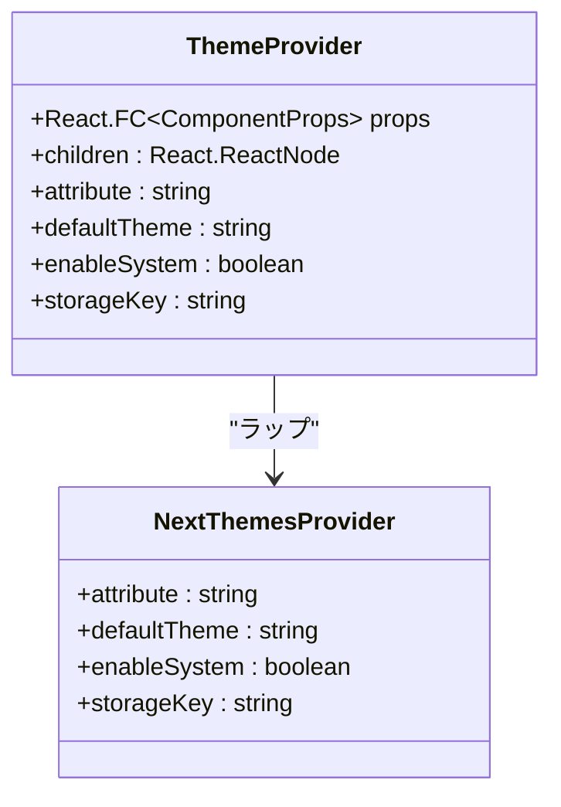
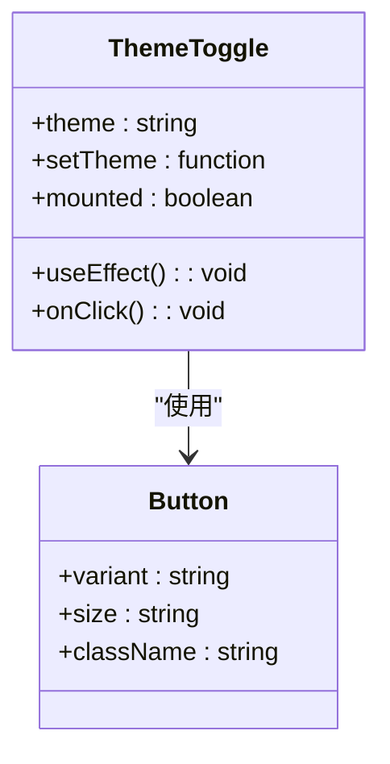
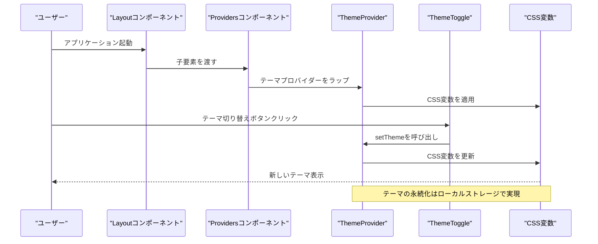
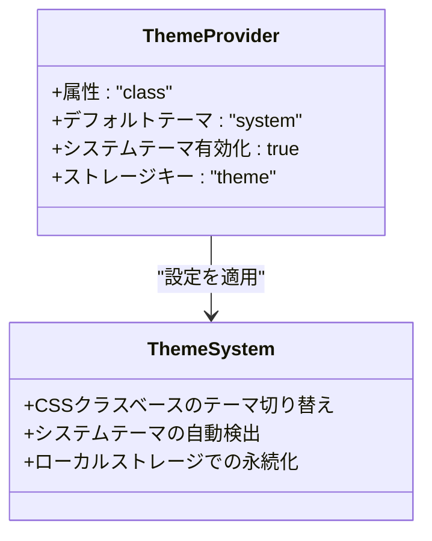
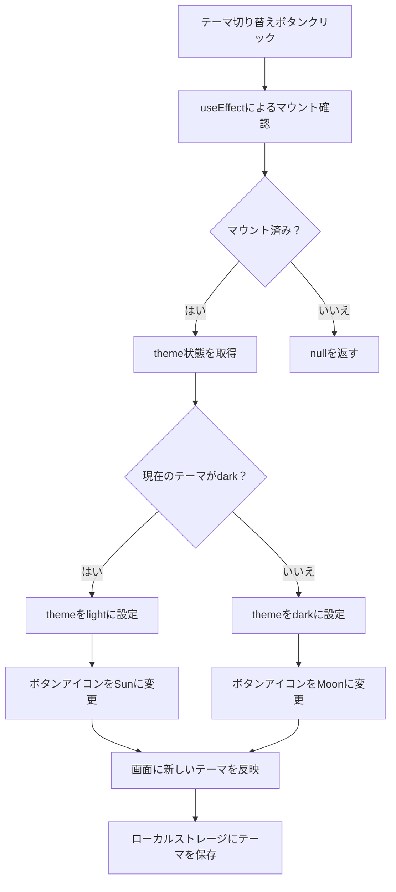
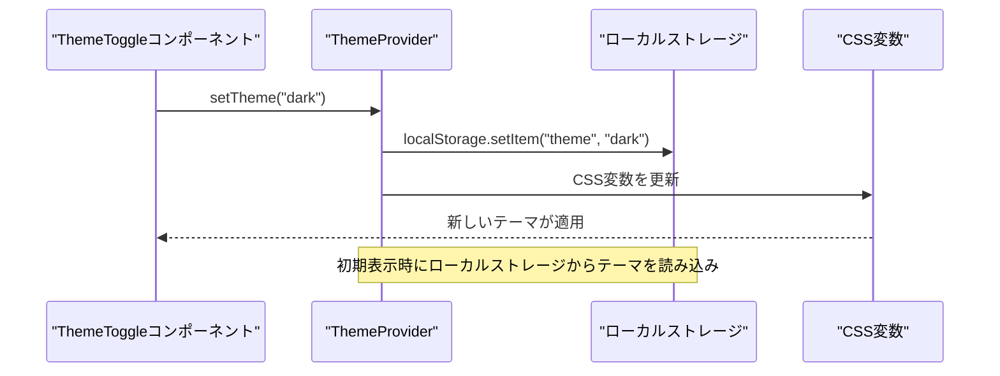

# テーマシステム

<cite>
**この文書で参照されたファイル**
- [theme-provider.tsx](file://frontend/src/components/theme-provider.tsx)
- [theme-toggle.tsx](file://frontend/src/components/theme-toggle.tsx)
- [providers.tsx](file://frontend/src/app/providers.tsx)
- [globals.css](file://frontend/src/app/globals.css)
- [layout.tsx](file://frontend/src/app/layout.tsx)
- [button.tsx](file://frontend/src/components/ui/button.tsx)
- [theme-toggle.test.tsx](file://frontend/src/__tests__/theme-toggle.test.tsx)
- [package.json](file://frontend/package.json)
</cite>

## 目次
1. [はじめに](#はじめに)
2. [プロジェクト構造](#プロジェクト構造)
3. [コアコンポーネント](#コアコンポーネント)
4. [アーキテクチャ概観](#アーキテクチャ概観)
5. [詳細コンポーネント解析](#詳細コンポーネント解析)
6. [依存関係解析](#依存関係解析)
7. [パフォーマンス考慮事項](#パフォーマンス考慮事項)
8. [トラブルシューティングガイド](#トラブルシューティングガイド)
9. [結論](#結論)

## はじめに

このTodoアプリケーションでは、ダークモードとライトモードのテーマ切り替え機能を実装しています。テーマシステムはCSS変数ベースのカラーパレットと、Next.jsのテーマ管理ライブラリを使用して構築されています。本ドキュメントでは、ThemeProviderコンポーネントの設計、CSS変数の活用、テーマ切り替えのフローについて詳しく解説し、ローカルストレージとの連携、初期表示の設定、テーマの永続化方法について具体的なコード例とともに説明します。

## プロジェクト構造

テーマシステムは以下の主要ファイルによって構成されています：

```mermaid
graph TB
subgraph "テーマシステム構成"
A[layout.tsx] --> B[providers.tsx]
B --> C[theme-provider.tsx]
C --> D[theme-toggle.tsx]
A --> E[globals.css]
D --> F[button.tsx]
end
subgraph "外部依存"
G[next-themes]
H[lucide-react]
I[@base-ui/react]
end
C --> G
D --> H
F --> I
```

**図の出典**
- [layout.tsx:22-38](file://frontend/src/app/layout.tsx#L22-L38)
- [providers.tsx:8-24](file://frontend/src/app/providers.tsx#L8-L24)
- [theme-provider.tsx:1-9](file://frontend/src/components/theme-provider.tsx#L1-L9)
- [theme-toggle.tsx:1-37](file://frontend/src/components/theme-toggle.tsx#L1-L37)
- [globals.css:1-130](file://frontend/src/app/globals.css#L1-L130)
- [button.tsx:1-59](file://frontend/src/components/ui/button.tsx#L1-L59)

**セクションの出典**
- [layout.tsx:1-40](file://frontend/src/app/layout.tsx#L1-L40)
- [providers.tsx:1-26](file://frontend/src/app/providers.tsx#L1-L26)
- [package.json:18-36](file://frontend/package.json#L18-L36)

## コアコンポーネント

### ThemeProviderコンポーネント

ThemeProviderコンポーネントは、テーマ管理ライブラリのラッパーとして機能し、アプリケーション全体のテーマ状態を提供します。



**図の出典**
- [theme-provider.tsx:6-8](file://frontend/src/components/theme-provider.tsx#L6-L8)
- [providers.tsx:18](file://frontend/src/app/providers.tsx#L18)

### ThemeToggleコンポーネント

テーマ切り替えボタンコンポーネントは、現在のテーマを取得し、テーマを切り替える機能を提供します。



**図の出典**
- [theme-toggle.tsx:8-36](file://frontend/src/components/theme-toggle.tsx#L8-L36)
- [button.tsx:43-56](file://frontend/src/components/ui/button.tsx#L43-L56)

**セクションの出典**
- [theme-provider.tsx:1-9](file://frontend/src/components/theme-provider.tsx#L1-L9)
- [theme-toggle.tsx:1-37](file://frontend/src/components/theme-toggle.tsx#L1-L37)

## アーキテクチャ概観

テーマシステムの全体像は以下の通りです：



**図の出典**
- [layout.tsx:22-38](file://frontend/src/app/layout.tsx#L22-L38)
- [providers.tsx:8-24](file://frontend/src/app/providers.tsx#L8-L24)
- [theme-toggle.tsx:22-35](file://frontend/src/components/theme-toggle.tsx#L22-L35)
- [globals.css:51-118](file://frontend/src/app/globals.css#L51-L118)

## 詳細コンポーネント解析

### CSS変数ベースのカラーパレット

テーマシステムはCSS変数を活用してカラーパレットを管理しています。これにより、テーマごとに一貫した色の変更が可能になります。

```mermaid
flowchart TD
A[CSS変数定義] --> B[:rootセレクタ]
A --> C[.darkセレクタ]
B --> D[ライトテーマ用色]
C --> E[ダークテーマ用色]
D --> F[--background: oklch(1 0 0)]
D --> G[--foreground: oklch(0.145 0 0)]
E --> H[--background: oklch(0.145 0 0)]
E --> I[--foreground: oklch(0.985 0 0)]
F --> J[色の適用]
G --> J
H --> J
I --> J
```

**図の出典**
- [globals.css:51-118](file://frontend/src/app/globals.css#L51-L118)

### ThemeProviderの設計

ThemeProviderコンポーネントは、テーマ管理ライブラリの設定をカスタマイズして提供します。



**図の出典**
- [providers.tsx:18](file://frontend/src/app/providers.tsx#L18)

### テーマ切り替えフロー

テーマ切り替えの処理フローは以下の通りです：



**図の出典**
- [theme-toggle.tsx:13-35](file://frontend/src/components/theme-toggle.tsx#L13-L35)

**セクションの出典**
- [globals.css:1-130](file://frontend/src/app/globals.css#L1-L130)
- [providers.tsx:17-23](file://frontend/src/app/providers.tsx#L17-L23)
- [theme-toggle.tsx:8-36](file://frontend/src/components/theme-toggle.tsx#L8-L36)

### ローカルストレージとの連携

テーマの永続化は、テーマ管理ライブラリのデフォルト設定によりローカルストレージを使用して実現されます。



**図の出典**
- [providers.tsx:18](file://frontend/src/app/providers.tsx#L18)

**セクションの出典**
- [providers.tsx:18](file://frontend/src/app/providers.tsx#L18)

## 依存関係解析

テーマシステムの依存関係は以下の通りです：

```mermaid
graph TB
subgraph "テーマシステム"
A[layout.tsx]
B[providers.tsx]
C[theme-provider.tsx]
D[theme-toggle.tsx]
E[globals.css]
F[button.tsx]
end
subgraph "外部ライブラリ"
G[next-themes]
H[lucide-react]
I[@base-ui/react]
end
subgraph "テスト"
J[theme-toggle.test.tsx]
end
A --> B
B --> C
C --> D
A --> E
D --> F
C --> G
D --> H
F --> I
J --> D
J --> G
```

**図の出典**
- [layout.tsx:22-38](file://frontend/src/app/layout.tsx#L22-L38)
- [providers.tsx:8-24](file://frontend/src/app/providers.tsx#L8-L24)
- [theme-provider.tsx:3](file://frontend/src/components/theme-provider.tsx#L3)
- [theme-toggle.tsx:3-5](file://frontend/src/components/theme-toggle.tsx#L3-L5)
- [button.tsx:1](file://frontend/src/components/ui/button.tsx#L1)
- [theme-toggle.test.tsx:2-10](file://frontend/src/__tests__/theme-toggle.test.tsx#L2-L10)

**セクションの出典**
- [package.json:27](file://frontend/package.json#L27)
- [theme-toggle.test.tsx:1-28](file://frontend/src/__tests__/theme-toggle.test.tsx#L1-L28)

## パフォーマンス考慮事項

テーマ切り替えのパフォーマンスに関する考慮点：

1. **ハイドレーションミスマッチの回避**: `requestAnimationFrame`を使用してマウント後のレンダリングを遅らせることで、クライアントとサーバー間の不一致を防ぎます。

2. **CSS変数の効率的な更新**: CSS変数ベースのカラーパレットは、テーマ切り替え時に必要なDOM操作を最小限に抑えます。

3. **ローカルストレージの非同期処理**: テーマの保存は非同期に行われ、ユーザー体験を損なうことなく実行されます。

4. **メモリ効率**: `useEffect`のクリーンアップ関数を使用して、不要なアニメーションフレームを解放します。

**セクションの出典**
- [theme-toggle.tsx:13-16](file://frontend/src/components/theme-toggle.tsx#L13-L16)

## トラブルシューティングガイド

### 共通問題と解決策

1. **テーマ切り替えが機能しない場合**
   - 確認項目: `useTheme`フックが正しくインポートされているか
   - 解決策: `next-themes`のバージョンを確認し、適切にインストールされているか確認

2. **初期表示が正しくない場合**
   - 確認項目: `defaultTheme="system"`の設定が適切か
   - 解決策: システムのデフォルトテーマ設定を確認

3. **ローカルストレージに保存されない場合**
   - 確認項目: `storageKey`の設定、ブラウザのCookie設定
   - 解決策: ブラウザのプライベートモードやCookieブロックの設定を確認

4. **アクセシビリティの問題**
   - 確認項目: `sr-only`クラスの使用、スクリーンリーダー対応
   - 解決策: `aria-label`属性の追加、適切なロールの指定

**セクションの出典**
- [theme-toggle.test.tsx:12-27](file://frontend/src/__tests__/theme-toggle.test.tsx#L12-L27)
- [theme-toggle.tsx:28-34](file://frontend/src/components/theme-toggle.tsx#L28-L34)

## 結論

このテーマシステムは、CSS変数ベースのカラーパレットと、Next.jsのテーマ管理ライブラリを組み合わせることで、効率的でスケーラブルなテーマ切り替え機能を実現しています。以下の特徴があります：

1. **堅牢なアーキテクチャ**: Providerパターンを使用して、テーマ状態をアプリケーション全体で共有
2. **パフォーマンス最適化**: CSS変数とアニメーションフレームを使用した効率的なレンダリング
3. **アクセシビリティ対応**: スクリーンリーダー対応と適切なARIA属性の使用
4. **永続化機能**: ローカルストレージを活用したテーマの保存と復元
5. **テスト対応**: 単体テストによる機能の検証

この実装は、将来的なテーマ拡張やカスタマイズにも柔軟に対応できるよう設計されており、開発チームにとってメンテナンスしやすい基盤を提供します。